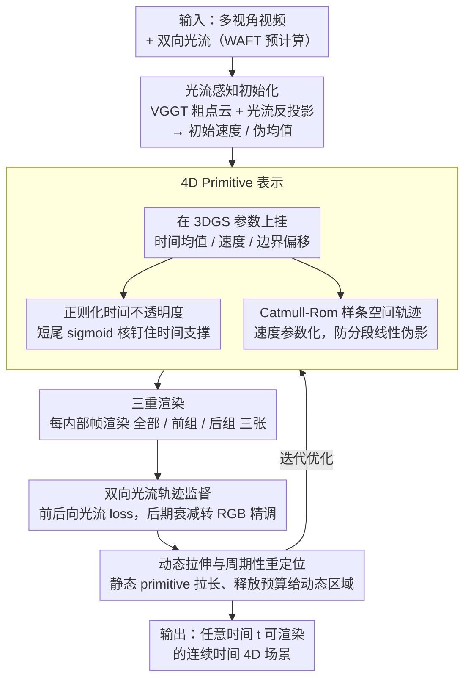

# RetimeGS: Continuous-Time Reconstruction of 4D Gaussian Splatting

**会议**: CVPR2026  
**arXiv**: [2603.13783](https://arxiv.org/abs/2603.13783)  
**代码**: 无  
**领域**: 3D视觉  
**关键词**: 4D Gaussian Splatting, 动态场景重建, 时间插值, 光流监督, Catmull-Rom 样条, 时间别名

## 一句话总结

提出 RetimeGS，通过正则化时间不透明度 + Catmull-Rom 样条轨迹 + 双向光流监督 + 三重渲染等策略，解决 4DGS 在离散帧间插值时的鬼影/时间别名问题，实现任意时间戳的无鬼影连续时间 4D 重建。

## 研究背景与动机

动态场景的高保真重建是 CV/CG 的核心问题，关键需求之一是 **retime 控制**——在任意时间戳渲染动态场景并保持时间一致性，用于慢动作回放、VR 高帧率渲染、子弹时间等 VFX 效果。这本质上要求在离散输入帧之间生成连续的中间帧。

### 现有方法的两大范式及其短板

**范式一：形变场方法**（Deform-GS, MotionGS 等）在 canonical space 中建模几何和外观，通过 deformation field / control points / 物理约束捕捉动态：

- 假设动态主要来自几何运动，当物体**可见性或纹理外观随时间变化**时失效
- 依赖精确的点对应估计，在**大运动或帧间重叠有限**时对应不可靠
- 同一 primitive 因错误对应而累积空间不对齐的信号，导致视觉伪影和错误轨迹

**范式二：4D 原语方法**（STGS, Ex4DGS 等）用 4D primitive 直接表示动态场景，将 opacity 分解为 base opacity × 空间 3D Gaussian × 时间 1D Gaussian：

- 核心问题：时间 opacity 仅在**离散整数帧**上有监督，无任何正则化
- 学到的 opacity 会**过拟合到离散帧**（temporal aliasing：时间支撑塌缩到子帧级别）
- 渲染中间帧时出现典型的**鬼影伪影**——相邻输入帧的半透明重叠结构静态叠加
- 对小运动/高帧率数据问题不大，但在**大运动**场景下严重

直觉上的解法是对时间 opacity 做低通滤波（类似 Mip-Splatting 解空间别名），但拉伸的时间分布需要跨多帧的精确轨迹估计，否则会引入另一种鬼影。

### 设计原则

基于以上分析，RetimeGS 的表示需满足三条原则：

**动态出现/消失** — 捕捉外观和可见性变化，克服形变方法局限

**正则化防塌缩** — 防止在稀疏时间采样下退化聚集到离散帧

**精确一致的轨迹** — 在 primitive 生存期内保持平滑准确的运动，避免不一致导致鬼影

## 方法详解

### 整体框架

RetimeGS 要解决的是 4DGS 在离散帧之间插值时的鬼影/时间别名问题，让任意时间戳都能无鬼影地渲染。它的输入是多视角视频和对应的双向光流（由 WAFT 预计算），输出是一套可在任意时间 $t$ 渲染的 4D 场景表示。整套方法围绕一个重新设计的 4D primitive 表示展开，再用四项训练策略把"时间支撑不塌缩"和"轨迹平滑一致"两件事钉住。

### 关键设计

**1. 4D Primitive 表示：在 3DGS 参数上挂时间均值、速度与样条轨迹**

在标准 3DGS 参数 $(x, s, h, q, \sigma)$ 之上，每个 Gaussian primitive 扩展为

$$(\mu_\tau,\ \tau_l,\ \tau_r,\ \boldsymbol{\mu},\ \boldsymbol{v},\ \boldsymbol{s},\ \boldsymbol{q}(t),\ \boldsymbol{h},\ \sigma)$$

其中 $\mu_\tau$ 是时间均值，$\tau_l, \tau_r$ 是左右时间边界偏移（定义时间 opacity），$\boldsymbol{\mu}$ 是伪空间均值，$\boldsymbol{v} = (v_1, v_2, v_3)$ 是速度分量（与 $\mu$ 一起定义样条轨迹），旋转 $q(t)$ 建模为时间的低阶多项式。在任意时间 $t$，可从这些参数导出标准 3DGS 的 $(\boldsymbol{x}(t), \boldsymbol{s}, \boldsymbol{q}(t), \boldsymbol{h}, \sigma_\tau(t), \sigma)$，然后照常做投影、深度排序、alpha 合成。这个表示让"几何随时间怎么动"和"何时出现/消失"都成为可优化量，从而能捕捉外观和可见性的变化、克服纯形变方法的局限。

**2. 正则化时间不透明度：用短尾 sigmoid 核钉住时间支撑、防止塌缩到离散帧**

4D 原语方法的鬼影根源在于：时间 opacity 只在离散整数帧上有监督、又没有任何正则，于是会过拟合到离散帧（temporal aliasing，时间支撑塌缩到子帧级别），渲染中间帧时相邻输入帧的半透明结构就静态叠在一起。RetimeGS 先把时间均值和边界偏移在初始化时设为相邻两帧的中点和半间距、且不可优化

$$\mu_\tau = \frac{t_i + t_{i+1}}{2}, \quad \tau_l = \tau_r = \frac{\Delta t}{2}$$

再用两个 sigmoid 乘积定义短尾时间核，在左右边界平滑衰减

$$\sigma_\tau(t) = \tilde{\psi}_l\left(\frac{t - (\mu_\tau - \tau_l)}{\gamma}\right) \cdot \tilde{\psi}_r\left(\frac{(\mu_\tau + \tau_r) - t}{\gamma}\right)$$

在视频首尾的全局边界处，对应 sigmoid 换成常数 1 避免可见性下降，$\gamma=0.005$ 保证短尾。这样每组 primitive 居中覆盖两个相邻输入帧之间的区间、同时被两帧监督，输入帧附近两组相邻 primitive 平滑混入/混出，过渡无缝。

**3. Catmull-Rom 样条空间轨迹：用双向光流监督的样条防住大运动下的分段线性伪影**

仅正则化时间 opacity 还不够——稀疏时间输入下移动物体相邻帧几乎无内容重叠，RGB 监督学不到可靠对应，而线性速度假设在大运动时会出分段线性伪影。于是用 **Catmull-Rom 样条**建模空间均值 $\boldsymbol{x}(t)$，参数由双向光流显式监督。对时间均值在 $(t_i + t_{i+1})/2$ 的 primitive：$v_2$ 是帧 $t_i$ 到 $t_{i+1}$ 的线性速度（3D 对应），$v_1$ 是 $t_{i-1}$ 到 $t_i$、$v_3$ 是 $t_{i+1}$ 到 $t_{i+2}$ 的速度，$\boldsymbol{\mu}$ 是假设线性运动时在 $\mu_\tau$ 处的位置。样条四个控制点由这些参数直接导出——内控制点（样条精确通过）取帧 $t_i, t_{i+1}$ 处位置 $p_1 = \mu - \frac{1}{2}\Delta t \cdot v_2$、$p_2 = \mu + \frac{1}{2}\Delta t \cdot v_2$，外控制点决定内点曲率 $p_0 = p_1 - \Delta t \cdot v_1$、$p_3 = p_2 + \Delta t \cdot v_3$。静态 primitive 的速度近零，即使时间支撑被拉伸，外推也保持静态位置一致。实验发现优化"伪均值+速度分量"比直接优化四个控制点容易得多（虽数学等价）。

### 损失函数 / 训练策略

四项训练策略把上面的表示真正训得起来：

**1. 双向光流轨迹监督**：用前向和后向光流给轨迹参数 $(\mu, v)$ 建粗对应——在帧 $t_i$ 处把相邻两组 primitive 控制点间的 3D 位移投影到 2D、光栅化成前向/后向光流图（光栅化时把时间 opacity 除以 $\sigma_\tau(t_i)$ 归一化，因两组分别渲染），与 GT 光流做逐像素 loss；训练后期把光流学习率衰减到零，完全转 RGB 精调。

**2. 三重渲染（Triple Rendering）**：直接渲染全部 primitive 能重建输入帧，但两组 primitive 各覆盖不同空间区域、单独渲染时欠重建。解法是对每个内部帧 $t_i$ 渲染三张图——全部 primitive、前一组单独、后一组单独——三张都与 GT 监督；边界帧只有一组、渲染一张。这逼每组 primitive 各自独立解释输入帧，从根上解决覆盖不均。

**3. 动态拉伸与周期性重定位**：训练稳定后检查相邻组的最近邻 primitive，若基色相似且速度近零就拉伸 $\tau_l, \tau_r$ 覆盖更大时间范围，并以概率 $1 - 1/(k+1)$ 剪枝冗余 primitive，让静态区域用更少 primitive、在 MCMC 预算下把容量释放给动态区域（实验中约 9% primitive 为静态长时 primitive，有效 primitive 数减少 2.26×）；重定位评分 $s = \sigma / (\tau_l + \tau_r)$ 按时间持续时长加权 base opacity，鼓励向动态区域重定位。

**4. 光流感知初始化**：用 VGGT（无 bundle adjustment）粗估每帧点云，把 2D 光流多视角反投影到 3D 并平均得到初始 3D 速度，用它初始化所有速度分量 $v_1, v_2, v_3$，并通过位移估计初始化伪均值 $\mu$，给优化一个合理起点。

训练细节上，总损失为 RGB 重建 loss + 光流 loss（学习率从 0.5 衰减至 $10^{-6}$，12K iter 后）+ opacity 正则（0.01）+ scale 正则（0.1）；MCMC 每 100 iter 重定位（最小 opacity 阈值 0.01）、动态拉伸每 3K iter 执行；总训练 20K iter，18K iter 后对所有属性做学习率衰减；单卡 RTX 4090D，数据缩放到 1K 分辨率。

## 实验关键数据

### 数据集与评估设置

- **DNA-Rendering**：10 个场景，60 个 4K/2K 相机，15 FPS，17 帧（定性评估）
- **Stage-Capture**（自采）：9 个新场景，32 个同步 4K 相机，22 FPS -> 隔帧采样有效 11 FPS，保留帧做中间帧 GT（定量评估）
- 指标：前景区域 PSNR/SSIM + 掩码背景 LPIPS

### 主实验结果

| 方法 | PSNR ↑ | SSIM ↑ | LPIPS ↓ |
|:---|:---:|:---:|:---:|
| Deform-GS | 28.45 | 0.867 | 0.0272 |
| STGS | 25.34 | 0.825 | 0.0357 |
| GaussianFlow | 25.91 | 0.825 | 0.0339 |
| Ex4DGS | 25.95 | 0.811 | 0.0379 |
| 2D Lifting (FILM+STGS) | 28.79 | 0.886 | 0.0267 |
| **RetimeGS (Ours)** | **30.08** | **0.904** | **0.0225** |

RetimeGS 在三项指标上全面最优。相比最强基线 2D Lifting，PSNR **+1.29 dB**；相比同类 4D 原语方法 STGS，PSNR **+4.74 dB**。

### 消融实验

| 消融配置 | PSNR ↑ | SSIM ↑ | LPIPS ↓ |
|:---|:---:|:---:|:---:|
| w/o 光流初始化 | 29.69 | 0.899 | 0.0227 |
| w/o 光流监督 | 27.24 | 0.861 | 0.0282 |
| w/o 三重渲染 | 27.16 | 0.849 | 0.0319 |
| w/o 动态拉伸 | 28.81 | 0.886 | 0.0247 |
| 线性轨迹 | 28.50 | 0.884 | 0.0243 |
| **完整 RetimeGS** | **30.08** | **0.904** | **0.0225** |

### 关键发现

1. **三重渲染**影响最大（-2.92 dB）——无三重渲染时两组 primitive 各自仅覆盖部分区域，消融图清晰可见前组缺右侧纹理、后组缺左侧纹理
2. **光流监督**次之（-2.84 dB）——移除后快速运动物体纹理严重扭曲
3. **样条 vs 线性轨迹**（-1.58 dB）——在圆周运动场景中差异误差热图沿边缘显著减少
4. **动态拉伸**（-1.27 dB）——88K/1M primitive 为拉伸静态 primitive，释放容量给动态区域
5. **光流初始化**贡献最小（-0.39 dB），提供合理起点加速收敛
6. GaussianFlow 仅有前向光流监督但无时间正则，优化器在满足光流约束的同时仍可缩短时间支撑，鬼影依旧

## 亮点与洞察

1. **问题诊断精准**：将 4D 原语方法的鬼影归因为 temporal aliasing，与 Mip-Splatting 的空间别名形成类比框架
2. **伪均值+速度参数化**：虽与四控制点数学等价，但优化景观远优于后者——优秀的参数化选择
3. **三重渲染思路简洁高效**：通过要求每组 primitive 独立解释输入帧，从根本上解决覆盖不均问题
4. **动态拉伸多重收益**：减少冗余 primitive + 释放预算给动态区域 + 静态区域跨帧累积监督减少闪烁
5. **光流使用精巧**：初始化+双向监督+训练后期自动衰减，从 coarse-to-fine 充分利用光流但不过拟合噪声

## 局限与展望

1. **极低帧率失效**：帧间运动超约 50 像素（@1K）时光流不可靠，中间帧出现伪影；7.5 FPS 快速舞蹈已明显退化
2. **轻微闪烁**：相邻 primitive 组的不相交本质在输入帧处仍可能导致微小时间不连续
3. **依赖预计算光流**：WAFT 光流质量直接影响结果，增加预处理复杂度
4. **未建模外观变化**：SH 系数不随时间变化，光照剧烈变化场景可能受限
5. **可能方向**：引入 video diffusion model 作为运动先验处理极大运动；统一 4D 表示消除分组边界不连续

## 相关工作与启发

- **Mip-Splatting**：空间别名解法启发 RetimeGS 将类似思想推广到时间维度，但指出直接低通滤波不可行需配合轨迹设计
- **GaussianFlow**：首次引入光流轨迹监督，但证明仅光流不够，需配合时间 opacity 正则化
- **STGS**：4D 原语基线，时间 opacity 无约束导致 temporal aliasing 的典型例子
- **SplineGS**：样条轨迹先驱，面向单目；RetimeGS 推广到多视角并加入双向光流约束

## 评分

| 维度 | 分数 (1-10) |
|:---|:---:|
| 创新性 | 7 |
| 技术深度 | 8 |
| 实验充分度 | 8 |
| 写作质量 | 9 |
| 实用价值 | 7 |
| **综合** | **7.5** |

<!-- RELATED:START -->

## 相关论文

- [\[CVPR 2026\] 4C4D: 4 Camera 4D Gaussian Splatting](4c4d_4_camera_4d_gaussian_splatting.md)
- [\[CVPR 2026\] BulletGen: Improving 4D Reconstruction with Bullet-Time Generation](bulletgen_improving_4d_reconstruction_with_bullet-time_generation.md)
- [\[CVPR 2026\] AeroDGS: Physically Consistent Dynamic Gaussian Splatting for Single-Sequence Aerial 4D Reconstruction](aerodgs_physically_consistent_dynamic_gaussian_splatting_for_single-sequence_aer.md)
- [\[AAAI 2026\] Sparse4DGS: 4D Gaussian Splatting for Sparse-Frame Dynamic Scene Reconstruction](../../AAAI2026/3d_vision/sparse4dgs_4d_gaussian_splatting_for_sparse-frame_dynamic_scene_reconstruction.md)
- [\[CVPR 2026\] SV-GS: Sparse View 4D Reconstruction with Skeleton-Driven Gaussian Splatting](sv-gs_sparse_view_4d_reconstruction_with_skeleton-driven_gaussian_splatting.md)

<!-- RELATED:END -->
