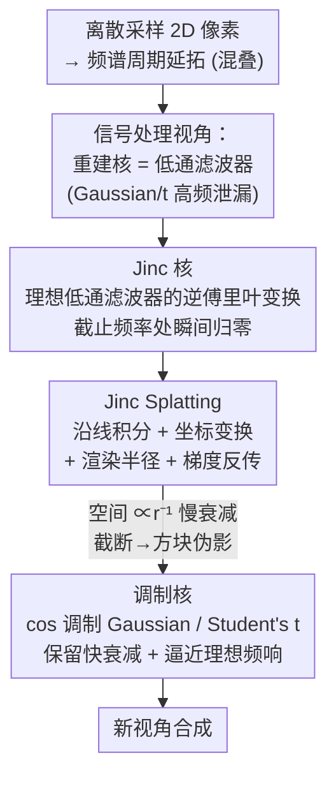

# Revisiting 3D Reconstruction Kernels as Low-Pass Filters

**会议**: CVPR 2026  
**论文**: [CVF Open Access](https://openaccess.thecvf.com/content/CVPR2026/html/Zhang_Revisiting_3D_Reconstruction_Kernels_as_Low-Pass_Filters_CVPR_2026_paper.html)  
**代码**: 缓存中未给出  
**领域**: 3D视觉 / 新视角合成 / 3D Gaussian Splatting  
**关键词**: 信号处理, 理想低通滤波器, Jinc 核, 调制核, 抗混叠

## 一句话总结
把 3D Gaussian Splatting 的"重建核"重新理解成信号重建里的"低通滤波器"，指出 Gaussian / 指数 / Student's t 都是不理想的低通滤波器（高频泄漏导致混叠），于是提出对应理想低通滤波器的 **Jinc 核**，并用余弦**调制核**在"频域保真"和"空间快衰减"之间折中，在低/高分辨率新视角合成上都优于 3DGS 与 SSS。

## 研究背景与动机

**领域现状**：3D 重建本质是从离散采样的 2D 像素恢复连续的 3D 信号。以 3DGS 为代表的显式表示用一堆"基元核"（Gaussian 椭球）叠加来表达场景，靠光栅化做实时渲染。后续工作把核从 Gaussian 换成别的：GES 用广义指数函数、SSS（3D Student Splatting and Scooping）用带正负密度的 Student's t 混合、3DGabSplat 用 Gabor 基元。

**现有痛点**：作者用一个被忽视的视角串起这些方法——**重建核的傅里叶变换，就是信号重建里的低通滤波器**。离散采样会让信号频谱产生周期性延拓（spectral extension），要恢复连续信号必须用低通滤波器把基带频谱从周期副本里隔离出来。问题在于：Gaussian、指数、Student's t 的频域响应在截止频率附近**衰减不干脆**，高频分量和低频分量在离散信号频谱里发生重叠，即高频泄漏（high-frequency leakage），表现为渲染时的混叠（aliasing）和细节模糊。点云更极端——其频域是常数 1，根本没有滤波能力。

**核心矛盾**：理想低通滤波器（在截止频率处瞬间归零）能完全抑制混叠，但它对应的空间域核（Jinc 函数）**衰减极慢**（$\propto r^{-1}$），渲染时每个像素会被大量核覆盖，显存和时间爆炸；要省显存就得提前截断，又会破坏核跨 tile 的连续性，产生**方块状伪影**（rectangular artifacts，尺寸正好等于光栅化 tile 大小）。于是出现"频域保真"和"空间高效"的二选一。

**本文目标**：① 给出从信号处理角度评估各种 3D 重建核的统一框架；② 设计真正逼近理想低通滤波器的核；③ 在不爆显存、不产生伪影的前提下拿到抗混叠收益。

**切入角度**：既然核就是滤波器，那就直接从"理想低通滤波器"反推核——这就是 Jinc 核的来源；再用频率调制把现成的快衰减核"搬"到接近理想滤波器的频响。

**核心 idea**：用理想低通滤波器的逆傅里叶变换（Jinc 核）替代经验性的 Gaussian/Student's t 核来消除混叠；再用余弦调制核在保留基核空间快衰减的同时逼近理想频响。

## 方法详解

### 整体框架
论文的主线是一条"信号处理推导链"：先把离散采样导致的频谱周期延拓认定为根本难题，再论证显式 3D 核 = 低通滤波器；据此从 3D 理想低通滤波器反推出 **Jinc 核**，并为它设计一套可微的 **Jinc Splatting** 光栅化渲染（沿光线积分、坐标变换、渲染半径、梯度反传）；最后针对 Jinc 空间慢衰减带来的方块伪影，提出**调制核**作为工程上可用的折中方案。

### 关键设计

**1. 信号处理视角与 Jinc 核：用理想低通滤波器反推重建核**

这一步针对"现有核为什么不好"的根因：它们的频域响应在截止频率附近不是干脆地归零，高频会泄漏进低频。作者先把 3D 理想低通滤波器（ILPF）定义为频域里的球形示性函数——半径 $f_c$ 内全通、外全阻：$H(\bm{f}) = 1$ 当 $\|\bm{f}\| \le f_c$，否则为 $0$。对它做逆傅里叶变换，得到各向同性的空间域核

$$h(r) = \frac{2 f_c^2}{r}\, j_1(2\pi f_c r),$$

其中 $j_1(\alpha) = \frac{\sin\alpha - \alpha\cos\alpha}{\alpha^2}$ 是第一类球贝塞尔函数——这就是 Jinc 核。再把它推广到各向异性形式（用协方差 $\Sigma = RSS^\top R^\top$，截止频率可吸收进尺度矩阵 $S$）：$h(\bm{x}) = \dfrac{j_1(\sqrt{(\bm{x}-\bm{\mu})^\top \Sigma^{-1}(\bm{x}-\bm{\mu})})}{\sqrt{(\bm{x}-\bm{\mu})^\top \Sigma^{-1}(\bm{x}-\bm{\mu})}}$。和 Gaussian/Student's t 的根本区别在于：Jinc 在频域是**带截断**的理想滤波器，理论上完全抑制混叠，而前者都是不理想的低通滤波器。

**2. Jinc Splatting：让 Jinc 核能像 3DGS 一样光栅化渲染**

光是有了核还不够，得有一套能优化、能渲染的光栅化方案。渲染一个像素需要仿射变换、投影变换，再沿光线积分。作者先推导 Jinc 核沿任意直线 $\bm{x}(t) = \bm{a} + t\bm{b}$ 的积分，借助 $\bm{m} = S^{-1}R^{-1}(\bm{a}-\bm{\mu})$、$\bm{n} = S^{-1}R^{-1}\bm{b}$ 化简成闭式：

$$I = \frac{\pi\, J_1(\alpha)}{\|\bm{n}\|\,\alpha}, \qquad \alpha = \frac{\|\bm{m}\times\bm{n}\|}{\|\bm{n}\|},$$

其中 $J_1$ 是第一类贝塞尔函数。接着把世界坐标到像素坐标的相机变换代入，得到每个像素 $(u,v)$ 对应的 $\alpha$ 和积分值。为了控制开销，设阈值 $q$：当 $\alpha$ 超过 $q$ 就截断该核的贡献，这等价于在投影平面上解一个齐次二次方程 $\bm{u}_h^\top(N - (\|\bm{m}\|^2 - q^2)Q)\bm{u}_h = 0$，其解是一个椭圆（圆锥曲线），由它给出渲染结果的 2D 半径 $\Sigma_{2D}$。最后推导 $\partial I/\partial\alpha = \frac{1}{\|\bm{n}\|}\big[\frac{\pi J_0(\alpha)}{\alpha} - \frac{2\pi J_1(\alpha)}{\alpha^2}\big]$ 以及 $\alpha$ 对 $\bm{\mu}$、$\Sigma$ 的梯度，从而支持端到端优化。

**3. 调制核：用余弦调制让快衰减核逼近理想频响**

Jinc 虽频域理想，但空间域 $\propto r^{-1}$ 衰减太慢——每个像素被太多核覆盖，显存/时间随分辨率暴涨；为省显存提前截断又会破坏核的跨 tile 连续性，产生尺寸等于 tile 的方块伪影（Fig. 2）。作者的折中是：拿现成的快衰减核（Gaussian、Student's t）乘上一个余弦项再做累加，做"频率搬移"。以 1D Gaussian 为例：

$$h_g(x) = g(x)\big(\omega + (1-\omega)\cos(f_0 x)\big),$$

其频域变成 $\mathcal{F}(h_g) = \omega G(f) + \frac{1-\omega}{2}\big(G(f-f_0) + G(f+f_0)\big)$，即把基核频谱往两侧平移 $f_0$ 叠加，让低频响应更接近理想滤波器的平台；$\omega\in[0,1]$ 平衡原响应与调制项。频移量 $f_0$ 取基核半高全宽（FWHM）的一半：Gaussian 的 $\text{FWHM}_g = 2\sigma\sqrt{2\ln 2}\approx 2.355\sigma$，故 $f_0 = 1.178\sigma$；Student's t（$\nu=1$）的 $\text{FWHM}_t = 2\sigma\ln 2\approx 1.386\sigma$。Student's t 也用同样形式调制。关键收益：调制核继承了基核的指数级空间快衰减（$\propto e^{-r^2}$），不需要大支撑、不产生方块伪影，同时频域 95% 能量集中度更窄、更接近 Jinc——把"频域保真 vs 空间高效"从二选一变成可调折中。

### 损失函数 / 训练策略
方法实现在 SSS 代码库之上，沿用 SSS 的 SGHMC 优化器和自适应密度控制；Jinc 核不用 Gaussian 的经验 $3\sigma$ 规则定范围，而用积分参数 $\alpha$（固定 $\alpha=30$）界定有效空间范围。调制核实验则分别建在 3DGS 和 SSS 原代码库上，只替换重建核、不动其他超参，保证性能差异来自核设计本身。

## 实验关键数据

> 指标说明：PSNR↑（峰值信噪比，越高越好）、SSIM↑（结构相似度）、LPIPS↓（学习感知相似度，越低越好）。"Speed/Energy" 指核的衰减速率与 95% 能量集中半径（归一化空间长度 / 波数，越小越集中）。

### 核的空间/频域特性对比（Table 1）

| 核 | 空间衰减 | 空间 95% 能量 | 频域衰减 | 频域 95% 能量 |
|------|---------|-------------|---------|-------------|
| Gaussian [18] | $\propto e^{-r^2}$ | 2.77 | $\propto e^{-f^2}$ | 2.77 |
| Student's t [53] | $\propto r^{-2}$ | 3.68 | $\propto e^{-f}$ | 2.99 |
| Jinc | $\propto r^{-1}$ | 5.59（最慢） | 截断 (Cutoff) | **1.90**（最集中） |
| Modulated Gaussian | $\propto e^{-r^2}$ | ~2.77 | $\propto e^{-f^2}$ | <2.77 |
| Modulated Student's t | $\propto r^{-2}$ | ~3.68 | $\propto e^{-f}$ | <2.99 |

可见 Gaussian 空间最快衰减、能量最集中，Jinc 频域最优但空间最差；调制核在保留基核空间衰减的同时把频域能量压得更窄。

### 低分辨率新视角合成（Table 2，NeRF-Synthetic 降采样）

| 分辨率 | 方法 | PSNR↑ | SSIM↑ | LPIPS↓ |
|--------|------|-------|-------|--------|
| 64×64 | 3DGS [18] | 24.01 | 0.901 | 0.0575 |
| 64×64 | SSS [53] | 29.17 | 0.954 | 0.0214 |
| 64×64 | **Jinc** | **29.87** | **0.955** | **0.0199** |
| 128×128 | 3DGS [18] | 22.30 | 0.887 | 0.0956 |
| 128×128 | SSS [53] | 30.24 | 0.964 | 0.0230 |
| 128×128 | **Jinc** | **31.40** | 0.961 | 0.0411 |

64×64 下 Jinc 比 SSS 高 0.70 dB、比 3DGS 高 5.86 dB；128×128 下 Jinc 比 3DGS 高 9.10 dB PSNR，印证理想低通核确实压住了混叠。

### 调制核的标准新视角合成（Table 3，部分）

| 数据集 | 方法 | PSNR↑ | SSIM↑ | LPIPS↓ |
|--------|------|-------|-------|--------|
| Mip-NeRF360 | 3DGS [18] | 28.69 | 0.870 | 0.182 |
| Mip-NeRF360 | **Ours (3DGS)** | **29.16** | 0.871 | 0.181 |
| Mip-NeRF360 | SSS [53] | 29.90 | 0.893 | 0.145 |
| Mip-NeRF360 | **Ours (SSS)** | **29.96** | 0.893 | **0.143** |
| Tanks & Temples | 3DGS [18] | 23.14 | 0.841 | 0.183 |
| Tanks & Temples | **Ours (3DGS)** | **23.86** | **0.853** | **0.168** |
| Deep Blending | **Ours (SSS)** | **30.17** | **0.911** | 0.242 |

### 关键发现
- **理想低通核的收益真实存在**：低分辨率下 Jinc 对 3DGS 的 PSNR 提升达 5.86~9.10 dB，且 SSIM/LPIPS 同步领先，说明高频泄漏确实是这类核的主要瓶颈。
- **调制对 3DGS 收益更大（最高 +0.72 dB PSNR、+0.012 SSIM）**：因为 Gaussian 频域衰减较快，调制能显著补强低频响应；而 SSS 本身频域衰减就慢，可补的空间有限，因此提升温和但稳定。
- **Jinc 高分辨率不实用**：$\propto r^{-1}$ 慢衰减导致显存/时间随分辨率暴涨，必须靠调制核落地——这也是论文用"低分辨率评 Jinc、标准分辨率评调制核"分开测的原因。

## 亮点与洞察
- **把一类经验性核统一进信号处理框架**：用"核的傅里叶变换 = 低通滤波器"这一句话，把 3DGS/GES/SSS/Gabor 全部纳入同一坐标系评判，框架本身就有解释力，Fig. 1 的频响可视化是很好的"教学图"。
- **从理想滤波器反推核**是个干净的思路：不是改进经验核，而是直接写出理想目标（频域球形示性函数）再逆变换，得到有明确物理含义的 Jinc 核。
- **调制核是可迁移的 trick**：cos 调制 + 累加几乎是"即插即用"地套到任意快衰减核上重塑频响，作者已在 Gaussian 和 Student's t 上验证，理论上能推广到其他基元表示。
- **诚实地承认 Jinc 不能直接用**：用"分辨率分而治之"的实验设计避免夸大 Jinc 的实用性，把它定位成理论锚点、调制核才是落地方案。

## 局限性 / 可改进方向
- 作者承认 Jinc 核固有两大问题：空间慢衰减需大支撑（高显存 + 方块伪影），且理想核天然有**振铃（ringing）**——强度过渡呈振荡而非平滑单调衰减，限制了需要无伪影表示的场景。
- 调制核虽缓解了空间衰减，但本质是折中，频域并未完全达到理想截断；$\omega$、$f_0$ 的选择目前是基于 FWHM 的经验设定，⚠️ 是否最优有待更系统的搜索（以原文为准）。
- 评测主要在 NeRF-Synthetic 降采样和常见 NVS 数据集，缺少对动态场景、大规模室外场景的验证；作者展望把调制策略推广到前馈重建管线和 4D 动态场景。

## 相关工作与启发
- **vs 3DGS [18]**：3DGS 用 Gaussian 椭球（非理想低通），高频泄漏导致细节模糊；本文把核换成 Jinc/调制核，从频域根因上抗混叠，低分辨率下 PSNR 大幅领先。
- **vs SSS [53]**：SSS 用带正负密度的 Student's t 混合，频域衰减慢；本文方法直接建在 SSS 之上仅替换核，调制后在多数设置上小幅但一致提升，说明增益来自核设计而非辅助组件。
- **vs Mip-Splatting / 抗混叠 3DGS 类**：那些方法多在像素 footprint 上做解析积分来抗混叠；本文从"核即滤波器"的频域设计角度切入，提供互补视角。

## 评分
- 新颖性: ⭐⭐⭐⭐⭐ 把 3D 重建核统一为低通滤波器、从理想滤波器反推 Jinc 核，视角干净且有解释力
- 实验充分度: ⭐⭐⭐⭐ 低/标准分辨率 + 多数据集对比充分，但 Jinc 高分辨率不可直接评、缺动态/室外场景
- 写作质量: ⭐⭐⭐⭐ 推导完整、Fig. 1 频响图直观；公式排版在缓存里较密集
- 价值: ⭐⭐⭐⭐ 提供可迁移的调制核 trick 与统一分析框架，对 3DGS 系列抗混叠研究有参考价值

<!-- RELATED:START -->

## 相关论文

- [\[CVPR 2026\] UniSH: Unifying Scene and Human Reconstruction in a Feed-Forward Pass](unish_unifying_scene_and_human_reconstruction_in_a_feed-forward_pass.md)
- [\[CVPR 2026\] 3DReflecNet: A Large-Scale Dataset for 3D Reconstruction of Reflective, Transparent, and Low-Texture Objects](3dreflecnet_a_large-scale_dataset_for_3d_reconstruction_of_reflective_transparen.md)
- [\[CVPR 2026\] Omni-3DEdit: Generalized Versatile 3D Editing in One-Pass](omni-3dedit_generalized_versatile_3d_editing_in_one-pass.md)
- [\[CVPR 2026\] Coherent Human-Scene Reconstruction from Multi-Person Multi-View Video in a Single Pass](coherent_humanscene_reconstruction_from_multiperso.md)
- [\[CVPR 2026\] Revisiting Pose Sensitivity in Splat-based Computed Tomography under Sparse-view Reconstruction](revisiting_pose_sensitivity_in_splat-based_computed_tomography_under_sparse-view.md)

<!-- RELATED:END -->
