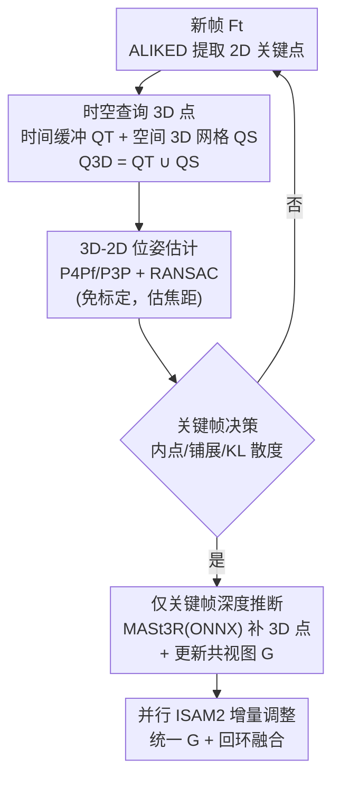

# Revisiting Monocular SLAM with Spatio-Temporal Scene Modeling

**会议**: CVPR 2026  
**论文**: [CVF Open Access](https://openaccess.thecvf.com/content/CVPR2026/html/Piedade_Revisiting_Monocular_SLAM_with_Spatio-Temporal_Scene_Modeling_CVPR_2026_paper.html)  
**代码**: 将开源（项目页 merl.com/research/highlights/slam-mer）  
**领域**: 3D视觉 / 视觉 SLAM / 实时定位建图  
**关键词**: 单目 SLAM, 时空建模, 免标定, 前馈几何先验, 实时定位

## 一句话总结
针对免标定单目 SLAM"要么慢、要么不模块化"的痛点，提出从零用 C++ 实现的 **SLAM-MER** 管线，用"时间缓冲（最近关键帧）+ 空间 3D 网格（早期重建区域）"双路查询 3D 点做定位，只在关键帧上调用前馈深度模型（MASt3R），把稀疏关键点定位和半稠密锚点表示融合，实现 **80+ FPS** 实时（远超 MASt3R-SLAM ~13 FPS、VGGT-SLAM <5 FPS）且定位精度持平或更优。

## 研究背景与动机

**领域现状**：视觉 SLAM 同时估计相机轨迹和重建环境地图。传统几何方法（MonoSLAM、PTAM、ORB-SLAM 系列）靠手工特征 + 多视图几何 + 稀疏地图，计算高效但难做稠密、且都需要已知内参。近年前馈多视图几何模型（DUSt3R、MASt3R、VGGT）能从未标定 RGB 直接出稠密点云，催生了 MASt3R-SLAM、VGGT-SLAM 这类学习型 SLAM——免标定、出稠密图，但**计算太重，没有一个能在 30 FPS 以上实时运行**。

**现有痛点**：① 稠密前馈方法每帧都跑一次推理、做 3D-3D 匹配，开销巨大，往往要丢帧（每三帧只处理一帧）才能勉强跑；② 大多数定位（无论稠密还是稀疏）只跟踪"最新关键帧"到当前帧的 2D 关键点，要求每个被跟踪像素都有对应的 3D 地图点，导致相机轻微抖动让关键点瞬间消失时就触发不必要的关键帧创建，破坏时间一致性；③ 现有管线常把调整拆成 local/global、回环时还要单独计算，难以模块化与实时。

**核心矛盾**：**实时性 vs 稠密/免标定能力**之间存在 trade-off——纯几何稀疏法快但不稠密且需标定，前馈稠密法免标定出稠密图但慢。问题根因在于：地图表示和定位查询的方式没有充分利用场景的"时空结构"。

**本文目标**：① 设计一种能同时利用时间连续性和空间布局来查询 3D 点的定位方式；② 在免标定单目下保持实时（>30 FPS，目标 80+）；③ 给出可任意替换组件（深度模型 / VPR / 特征）的模块化 C++ 框架。

**切入角度**：作者主张**准确定位用 3D-2D 对应就够了，不需要每帧的深度**（这是和 MASt3R-/VGGT-SLAM 的 3D-3D 匹配最大的区别）——深度只在创建关键帧时推一次。再用"时间缓冲 + 空间 3D 网格"两路互补地召回 3D 点，既保短期连续性、又能重访早期重建区域。

**核心 idea**：用时空双路查询（temporal buffer + spatial 3D cells）召回 3D 地图点做 3D-2D 定位，把稀疏关键点跟踪的轻量实时性和前馈几何先验的免标定/半稠密能力融合在一个并行 ISAM2 增量优化的统一框架里。

## 方法详解

### 整体框架
SLAM-MER 的地图是三元组 $M = (K, P_w, C)$：关键帧集 $K$、世界系 3D 地图点 $P_w$、3D 网格单元 $C$（把 3D 点按空间体素分组）。三者通过**共视图（covisibility graph）** $G$ 关联——节点是关键帧和地图点，边 $E_{KK}$ 记关键帧间相对位姿、$E_{KP}$ 记 3D-2D 投影约束 + 3D-3D 欧氏距离约束。管线有两个**并行模块**：定位（localization）和调整（adjustment）。新帧进来后提取 2D 关键点、双路查询 3D 点、估计绝对位姿、决定是否建关键帧；建关键帧时才跑深度推断补 3D 点并更新 $G$；调整模块在另一线程持续监控 $G$ 变化、用 ISAM2 增量优化关键帧位姿和地图点，回环也只往 $G$ 加约束、不单独优化。

### 关键设计

**1. 时空双路查询 3D 地图点：用时间连续性和空间布局互补召回**

这是论文最核心的贡献，针对"只跟踪最新关键帧导致抖动即丢点"的痛点。定位时不是只看上一关键帧，而是从两路凑出候选 3D 点集 $Q_{3D} = Q_T \cup Q_S$。**时间查询 $Q_T$**：维护一个含最近 $N$ 帧的缓冲 $B$，每帧都知道与之共视 3D 点最多的关键帧，把这些关键帧的 3D 点都收进 $Q_T$——这让 2D 关键点能被跟踪更久，缩小共视图和地图规模。**空间查询 $Q_S$**：用最近成功定位帧的位姿 $T_k$ 算出可见的 3D 网格单元（网格按到相机距离异步排序加速），把占用单元光栅化回图像确认可见性，只取最近若干单元里的 3D 点。最后对 $Q_{3D}$ 的描述子和当前帧 2D 关键点描述子用 FAISS 做最近邻匹配得到 3D-2D 对应。空间查询的妙处在于：只要漂移不大，它本身就能"隐式闭环"——重访旧区域时网格直接召回旧点，不必等回环模块。

**2. 仅关键帧深度推断 + 3D-2D 免标定定位：把前馈几何的开销摊薄**

针对"前馈稠密法每帧推理太慢"的痛点。作者主张准确定位只需 3D-2D 对应、不需要每帧深度，因此**只在创建关键帧时**才调用前馈单图几何模型（默认 MASt3R，导出 ONNX 在 C++ 用 ONNXRuntime 跑，且并行执行），从它取点图和置信度，给该关键帧的每个 2D 关键点造局部 3D 点 $P^{kf}_i$。由于前馈点图是无尺度的，用已有 3D-2D 对应估一个尺度因子把局部点对齐到世界系地图点。位姿估计上，因内参未知，用 **P4Pf 解算器**（在 RANSAC 内做鲁棒估计，能顺带估出相机焦距，假设两轴等焦、主点在图像中心）；处理若干帧后把焦距取历史中值、当作已标定，之后改用更快的 P3P。这套设计让管线既免标定、又只在关键帧承担一次深度推断成本，是 80+ FPS 的关键。

**3. 基于 KL 散度的关键帧决策与隐式回环**

针对"何时该建关键帧"——既要补足新区域的 3D 点、又不能因抖动滥建。作者用三条准则：① 位姿估计内点数太少；② 有 3D-2D 对应的 2D 关键点在图像上铺得够不够开（用"有对应的关键点凸包面积 / 全部检测关键点凸包面积"的比值衡量，铺得开能增加场景覆盖、避免病态位姿问题）；③ 检测是否在重访旧位置。第三条最有意思：对当前帧统计"被各关键帧看到的 3D 点数"直方图 $H_k$，和上一帧的 $H_{k-1}$ 比 KL 散度 $D_{KL}(H_k\|H_{k-1})$。观察全新区域时只有最近关键帧有共视点、直方图右偏、KL 小（不建关键帧，论文示例 $D_{KL}=0.016$）；重访旧位置时早期关键帧突然开始共视、直方图剧变、KL 大（建关键帧，示例 $D_{KL}=3.74$），相当于在创建关键帧时就把回环约束加进共视图。

**4. 并行 ISAM2 增量调整与回环融合：统一共视图、不分 local/global**

针对"现有管线回环要单独算、调整分 local/global 难实时"的痛点。调整模块在独立线程持续监控 $G$ 的变化，用 ISAM2（GTSAM 框架）增量更新关键帧位姿和地图点。ISAM2 的因子图表示让它**天然支持局部和全局调整而无需分支处理**，因此整个优化过程只维护一张统一的共视图。回环则用 MegaLoc 做图像级检索选候选关键帧，再用 3D-2D 对应做几何验证；验证通过的回环只往 $G$ 加 $E_{KP}$/$E_{KK}$ 边并融合重复的 3D 点（map fusion），**不在回环末尾单独跑优化**——增量求解器会自动吸收这些新约束。配合相机丢失时基于检索+位姿验证的重定位（relocalization），整个系统对短时遮挡鲁棒、对绑架机器人问题也能恢复。

### 一个完整示例
以 7-Scenes 的 office 序列为例（论文 Fig. 1）：相机沿桌面移动，地图维护一张半稠密 3D 点云和覆盖其上的 3D 网格。每来一帧，空间查询用当前位姿算出可见网格（图中红色单元就是被选中的最近可见单元），从中召回 3D 点；同时时间查询从最近几帧的共视关键帧召回点。两路合并、FAISS 匹配后用 P4Pf/RANSAC 估位姿。多数帧 KL 散度小、不建关键帧（省下深度推断）；当相机转回先前看过的区域、旧关键帧重新共视、KL 骤升时才建关键帧、跑一次 MASt3R 补点并隐式闭环。该序列下系统跑到 100 FPS。

## 实验关键数据

> 指标说明：ATE（Absolute Trajectory Error，绝对轨迹误差，米，越小越好，经 Sim(3) Umeyama 对齐后用 evo 工具算 RMSE）；FPS（每秒处理帧数，越大越实时）。基线精度取自 [37, 42]，FPS 在作者机器（i9-14900K + RTX 4090）上实测。

### 主实验：位姿精度与实时性（Table 1，平均 ATE / FPS）

| 数据集 | 方法 | 类型 | 平均 ATE↓ (m) | FPS↑ |
|--------|------|------|-------------|------|
| TUM RGB-D | DROID-SLAM [53] | 稠密/标定 | 0.158 | ≈20 |
| TUM RGB-D | MASt3R-SLAM [42] | 稠密/免标定 | 0.060 | 13.2 |
| TUM RGB-D | VGGT-SLAM (SL(4)) [37] | 稠密/免标定 | 0.053 | <5 |
| TUM RGB-D | **SLAM-MER (Ours)** | 稀疏/免标定 | **0.056** | **86.6** |
| 7-Scenes | MASt3R-SLAM [42] | 稠密/免标定 | 0.058 | 15.0 |
| 7-Scenes | VGGT-SLAM (SL(4)) [37] | 稠密/免标定 | 0.056 | <5 |
| 7-Scenes | **SLAM-MER (Ours)** | 稀疏/免标定 | 0.059 | **103.2** |

精度与最强的 VGGT-SLAM/MASt3R-SLAM 持平（TUM 0.056、7-Scenes 0.059），但 FPS 高出一个数量级（86.6 / 103.2 vs <5~15）。且 SLAM-MER 不丢帧地实时处理 30 FPS 视频流，而 MASt3R-/VGGT-SLAM 需每三帧丢两帧。

### 消融实验：时空查询的作用（Table 2，部分，两组场景）

| 配置 | ATE↓ (m) | 关键帧数 \|K\| | 地图点数 \|Pw\| | FPS↑ |
|------|---------|-------------|--------------|------|
| 缓冲 \|B\|=1（无时间） | 0.084 / 0.304 | 31 / 88 | 8659 / 23327 | 168.9 / 161.4 |
| 缓冲 \|B\|=10 | 0.073 / 0.280 | 31 / 86 | 7820 / 22731 | 159.3 / 144.9 |
| 缓冲 \|B\|=100 | 0.059 / 0.191 | 28 / 79 | 7551 / 20381 | 114.2 / 98.4 |
| 缓冲 \|B\|=1000 | 0.040 / 0.151 | 23 / 67 | 6445 / 17772 | 81.8 / 45.9 |
| + 空间查询（网格 ≈8 cm） | 0.035 / — | 22 / — | 6342 / — | — |

### 关键发现
- **时间缓冲越大，定位越准、地图越紧凑，但 FPS 下降**：$|B|$ 从 1 增到 1000，ATE 从 0.084 降到 0.040，关键帧数从 31 降到 23、地图点从 8659 降到 6445（跟踪更久 → 少建关键帧），但 FPS 从 168.9 掉到 81.8——存在精度/速度折中。
- **空间查询进一步压低误差**：在 $|B|=1000$ 基础上加 ≈8 cm 网格的空间查询，ATE 从 0.040 再降到 0.035，且关键帧/地图点更少，验证两路查询互补。
- **稀疏定位 + 仅关键帧深度是实时性的来源**：相比每帧跑稠密推理的前馈 SLAM，SLAM-MER 把重计算摊薄到关键帧，才能在不丢帧下维持 80+ FPS。

## 亮点与洞察
- **"定位只需 3D-2D、不需每帧深度"这个判断很关键**：它直接把前馈几何的开销从"每帧"降到"每关键帧"，是整套实时性的根，也是与 MASt3R-/VGGT-SLAM（3D-3D 匹配）的本质分野。
- **KL 散度做关键帧决策 + 隐式回环**很巧：用"被各关键帧看到的点数直方图"的剧变来同时判断"该建关键帧"和"形成了回环"，把回环检测的一部分负担前置到关键帧创建，省掉额外计算。
- **空间 3D 网格的隐式闭环**：只要漂移小，重访旧区域时网格直接召回旧点就闭环了，不必每次都触发重型回环模块——这是工程上很实用的"先用便宜的、不行再用贵的"。
- **统一共视图 + ISAM2 不分 local/global**：用单张因子图承载所有约束、增量求解，回环只加边不单独优化，简化了传统 SLAM 的多线程分支逻辑，可迁移到其他实时优化系统。
- **强模块化**：特征（ALIKED）、深度模型（MASt3R/VGGT）、检索（MegaLoc）、解算器（PoseLib）都可即插即换，框架将开源，利于后续替换更强组件。

## 局限性 / 可改进方向
- 依赖前馈深度模型的质量与尺度估计：局部点图无尺度、靠 3D-2D 对应估尺度因子，⚠️ 在纹理稀疏或对应稀少时尺度可能不稳（以原文/补充材料为准）。
- 空间查询的隐式闭环只在"漂移小"时成立——漂移大时网格无法正确光栅化、仍需回退到回环模块，极端"绑架机器人"场景靠重定位兜底，但能否稳定恢复依赖检索质量。
- 位姿精度与最强稠密法持平而非全面超越（部分序列略逊），其卖点主要是**同等精度下一个数量级的速度**；论文未与稠密法在重建质量（accuracy/completion/Chamfer）上做大规模正面比较（部分在补充材料）。
- 评测集中在 TUM RGB-D 与 7-Scenes（室内中小场景），大尺度室外、强动态场景的鲁棒性有待验证。

## 相关工作与启发
- **vs MASt3R-SLAM [42] / VGGT-SLAM [37]**：它们每帧跑前馈推理、做 3D-3D 匹配，免标定出稠密图但 <5~15 FPS 且要丢帧；本文只在关键帧推一次深度、用 3D-2D 对应定位，精度持平却快一个数量级。
- **vs ORB-SLAM3 [3]**：ORB-SLAM3 需已知内参、用 bag-of-words 回环、调整分 local/global；本文免标定（P4Pf 估焦距）、用 MegaLoc 检索 + 统一 ISAM2 共视图，且空间查询可隐式闭环。
- **vs DROID-SLAM [53]**：DROID 用学习的稠密光流 + 后端优化，重且 ≈20 FPS；本文走稀疏关键点 + 半稠密锚点的混合路线，更轻、可免标定。

## 评分
- 新颖性: ⭐⭐⭐⭐ "时空双路查询 + 仅关键帧深度 + KL 关键帧决策"组合新颖且实用，单项多为已有组件的巧妙拼装
- 实验充分度: ⭐⭐⭐⭐ TUM/7-Scenes 精度+FPS 对比清晰、消融到位，但场景偏室内、重建质量正面比较较少
- 写作质量: ⭐⭐⭐⭐ 管线讲解清楚、Fig. 2 流程图与 KL 决策示意直观
- 价值: ⭐⭐⭐⭐⭐ 在同精度下把免标定单目 SLAM 拉到 80+ FPS 实时，且模块化开源，实用价值高

<!-- RELATED:START -->

## 相关论文

- [\[CVPR 2026\] SCE-SLAM: Scale-Consistent Monocular SLAM via Scene Coordinate Embeddings](sce-slam_scale-consistent_monocular_slam_via_scene_coordinate_embeddings.md)
- [\[CVPR 2026\] ST4R-Splat: Spatio-Temporal Referring Segmentation in 4D Gaussian Splatting](st4r-splat_spatio-temporal_referring_segmentation_in_4d_gaussian_splatting.md)
- [\[CVPR 2026\] LiDAR Prompted Spatio-Temporal Multi-View Stereo for Autonomous Driving](lidar_prompted_spatio-temporal_multi-view_stereo_for_autonomous_driving.md)
- [\[CVPR 2026\] STS-Mixer: Spatio-Temporal-Spectral Mixer for 4D Point Cloud Video Understanding](sts_mixer_4d_point_cloud.md)
- [\[CVPR 2026\] STAC: Plug-and-Play Spatio-Temporal Aware Cache Compression for Streaming 3D Reconstruction](stac_plug-and-play_spatio-temporal_aware_cache_compression_for_streaming_3d_reco.md)

<!-- RELATED:END -->
