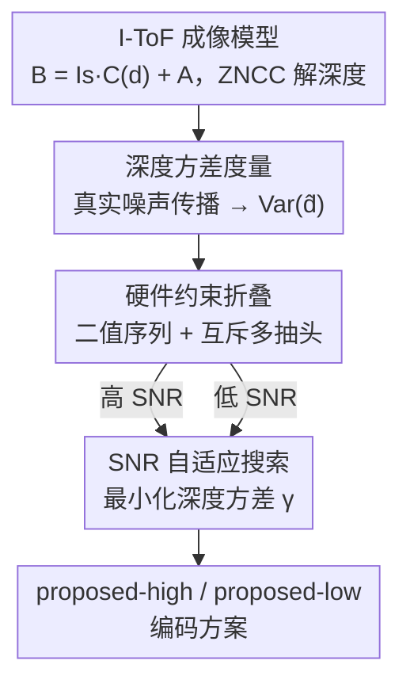

# Revisiting Optimal Coding for I-ToF under Practical Sensor Constraints

**会议**: CVPR 2026  
**论文**: [CVF Open Access](https://openaccess.thecvf.com/content/CVPR2026/html/Luo_Revisiting_Optimal_Coding_for_I-ToF_under_Practical_Sensor_Constraints_CVPR_2026_paper.html)  
**代码**: 无  
**领域**: 3D视觉 / 计算成像 / 深度传感  
**关键词**: 间接飞行时间, 编码方案, 深度方差, 硬件约束, 互斥多抽头

## 一句话总结
这篇论文把 I-ToF 相机在真实噪声模型下的深度误差推成一个可计算的「深度方差度量」，再把峰值功率、带宽、二值波形、互斥多抽头这些硬件约束直接折进编码方案的设计阶段，从而能在被约束压缩后的可行空间里直接搜索出最优编码方案——搜出的两套方案（高/低 SNR 各一套）在仿真和真实商用传感器上都稳稳超过 Hamiltonian 和 double ramp。

## 研究背景与动机
**领域现状**：间接飞行时间（I-ToF）相机靠发射连续调制光、测量回波相位延迟来估深度，因为分辨率高、体积小、成本低，成了 AR、扫描、机器人、消费电子里最常用的深度传感方案。在激光功率和曝光时间固定的前提下，深度精度几乎完全由「编码方案」决定——也就是激光的调制函数 $M(t)$ 和相机的解调函数 $D(t)$ 这一对函数怎么设计。

**现有痛点**：怎么找到最优编码方案是个老大难，因为 $M(t)$、$D(t)$ 的组合理论上有无穷多种。已有工作分两路，各有硬伤：Gupta 等人（Hamiltonian 编码）做的是漂亮的解析框架，用「编码曲线长度」当度量指导设计，但它假设的是理想传感器（噪声固定、功率无限、解调连续），在真实硬件下最优性根本不成立；Li 等人走深度学习路线，噪声模型更完整，但需要已知场景统计量、要大算力和大量标注数据，且同样没建模真实传感器约束。

**核心矛盾**：真实商用 I-ToF 传感器有一条几乎所有理论框架都忽略的硬约束——**互斥多抽头机制**：传感器上多个解调抽头（tap，本质是一个收集电荷的「桶」）在任意时刻只能有一个被激活，否则抽头间会串扰。这条约束会从根本上改变 Hamiltonian 码的形状（让 $M(t)$ 在一个周期内被迫重复三次、编码曲线缩短到设计的 1/3），把理论上的最优码打回原形。Gutierrez 等人虽然考虑了峰值功率、带宽、二值波形，但他们是先在理想设定下设计好编码、再「事后近似」去逼近理想曲线，不保证真能在硬件上实现，而且照样漏掉了互斥约束。

**本文目标**：(1) 在真实噪声模型下把 I-ToF 的深度误差推导出来，得到一个能直接当搜索目标的深度方差度量；(2) 把全部实际硬件约束（含互斥多抽头）在设计阶段就折进去，让搜索空间小到可枚举；(3) 据此搜出能在商用传感器上部署、且对不同 SNR 各自最优的编码方案。

**核心 idea**：与其在理想空间里设计漂亮的码再硬塞进硬件，不如先用硬件约束把可行空间压小，再在这个小空间里直接最小化「真实深度方差」搜出码——而且作者发现**最优编码方案不是固定的，它依赖场景 SNR**，所以干脆为高 SNR、低 SNR 各搜一套。

## 方法详解

### 整体框架
方法是一条「成像建模 → 噪声/误差分析 → 推出深度方差度量 → 硬件约束折叠 → 在约束空间内搜索」的设计流水线，最终产出两套针对不同 SNR 的编码方案（proposed-high / proposed-low）。

先把 I-ToF 成像写清楚：激光发射调制信号 $M(t)$，传感器收到反射信号 $R(t)=s\,M(t-\tfrac{2d}{c})+a$，其中 $d$ 是深度、$c$ 是光速、$s=\beta/d^2$ 把表面反射率 $\beta$ 和距离衰减合在一起、$a$ 是环境光。传感器用解调函数 $D(t)$ 控制曝光，积分得到亮度 $B(d)=\int_0^T R(t)D(t)\,dt = I_s\,C(d)+A$，其中 $C(d)$ 是 $M$、$D$ 的归一化互相关、$I_s=s\,M_\text{total}\,T/\tau$、$A$ 是环境光贡献。一次测量有 $I_s$、$d$、$A$ 三个未知量，所以实际用一个 $M(t)$ 配三个相移版本的解调 $D_i(t)\,(i=0,1,2)$ 拿到三个亮度，再用零均值归一化互相关（ZNCC）解深度。这套 $\{M,D_i\}$ 就叫**编码方案**。

整条流水线如下：

### 关键设计

**1. 深度方差度量：把「真实噪声下的深度误差」写成一个可优化的标量**

旧方法（Gupta）用编码曲线长度当度量，但那建立在「噪声固定、解调理想」的假设上，真实传感器里噪声方差随亮度变化、解码器也非理想，曲线长度不再代表精度。本文沿用 Li 的真实噪声模型：测量亮度被近似成高斯 $\hat B_i(d)\sim\mathcal N(B_i(d),\sigma_i^2(d))$，方差 $\sigma_i(d)=\sqrt{B_i(d)+\sigma_r^2}$ 同时含与亮度相关的光子散粒噪声和读出噪声 $\sigma_r$（暗电流因商用传感器多有补偿被忽略）。

在「小噪声、解码工作在真值邻域」的假设下，对 ZNCC 的归一化函数 $G(\cdot)$ 做一阶线性化（雅可比 $J_G(B)$ 把亮度投影到与亮度方向 $[1,1,1]$ 正交的平面上并按标准差缩放），归一化测量的协方差 $\Sigma_Y\approx J_G\,\Sigma_B\,J_G^\top$。深度解码近似为 $\hat d\approx d+k^\top(\hat Y-Y)$，最优权重 $k$ 来自广义最小二乘/最大似然。一路推下来得到深度方差：

$$\mathrm{Var}(\hat d)\approx\Big(\sum_{i=0}^{2}\frac{I_s^2\,(C'_{\perp i}(d))^2}{\sigma_i^2(d)}\Big)^{-1}$$

其中 $C'_{\perp i}(d)$ 是相关函数导数 $C'(d)$ 在正交于亮度方向那张平面上的分量（⚠️ 投影与逆协方差加权的具体矩阵形式以原文 Eq.16–17 为准）。这个式子的意义在于：若把 $\sigma_i^2$、$I_s$ 固定成理想，它就退化成「$C(d)$ 三维速度的平方」——也就是 Gupta 的曲线长度；但保留真实的、随亮度变的 $\sigma_i^2$ 后，它才真正刻画了真实传感器上的精度。这就是后面搜索的目标函数雏形。

**2. 硬件约束折叠：在设计阶段就把可行空间压小，而不是事后逼近**

Gutierrez 的做法是先在理想空间设计、再事后近似往可实现曲线上靠，结果有些设计在真实传感器上根本无法实现。本文反过来，把四条硬件约束直接写成对「离散二值序列」的约束：(1) 峰值功率受限 $P_\text{max}$；(2) 带宽受限——把带宽近似成「最小可切换时长」 $t_\text{min}=2/f_\text{max}$，相当于用最大频率的一半当最短时间单元，让信号在频率上限内逼近方波；(3) 调制/解调都是二值（0/1）；(4) **互斥多抽头**。

于是把连续的 $M(t)$、$D_i(t)$ 离散成长度 $n=\tau/t_\text{min}$ 的二值序列 $S_M$、$S_{D_i}\in\{0,1\}$。互斥约束写成在每个时刻只有一个抽头能开：

$$\sum_{i=0}^{2}S_{D_i}[k]\le 1,\quad \forall k$$

再加上三个抽头开启总时长相等 $\sum_k S_{D_0}[k]=\sum_k S_{D_1}[k]=\sum_k S_{D_2}[k]$（保证 ZNCC 的解算前提成立）。功率上，只约束峰值（$M(t)=P_\text{max}S_M$），所以总功率 $M_\text{total}=P_\text{max}\sum_k S_M[k]\,t_\text{min}$ 会随调制函数变化——这点和以往「固定总功率」的约束不同，意味着编码方案的设计会同时影响激光总功率和环境光贡献。正是带宽（决定 $n$）加上这几条约束，把原本无穷的搜索空间砍成有限且可枚举的规模，第 3 点的搜索才变得可行。

**3. SNR 自适应搜索：在压缩后的空间里直接搜，并按 SNR 各搜一套**

有了度量（设计 1）和被压小的离散空间（设计 2），就能直接搜。作者把深度方差在整个量程上积分，定义搜索目标 $\gamma$：

$$\gamma=\frac{1}{d_\text{range}}\int_{0}^{d_\text{max}=c\tau/2}\Big(\sum_{i=0}^{2}\frac{I_s^2(d)\,(C'_{\perp i}(d))^2}{I_s(d)\,C_i(d)+A+\sigma_r^2}\Big)^{-1}\,dd$$

注意分母里 $I_s(d)C_i(d)$ 就是亮度（含与深度相关的距离衰减），$A$ 是环境光、$\sigma_r^2$ 是读出噪声方差，所以 $\gamma$ 直接反映了整段量程的平均深度方差。优化问题是：

$$\arg\min_{S_M,\{S_{D_i}\}}\ \gamma(S_M,\{S_{D_i}\})$$

约束包括二值、互斥、$M_\text{total}>0$、$\text{sum}_D>0$，以及非歧义约束 $\forall d_1\ne d_2,\ G(C(d_1))\ne G(C(d_2))$（避免不同深度解出同一码、产生深度歧义）。求解用**暴力枚举或模拟退火（SA）**——因为设计 2 已经把空间压到可枚举，这步才现实。

关键洞察是：**最优码依赖 SNR**。固定激光功率、积分时间、读出噪声、周期后，只要固定场景反照率 $\beta$、改变平均环境光 $\bar a$ 就能对应不同 SNR 等级。作者据此搜出两套码：高 SNR（$\bar a=0$）下最优的 **proposed-high** 和低 SNR（$\bar a$ 大）下最优的 **proposed-low**。仿真里两套码在 $\bar a=0.2$ 附近发生顺序互换，正好印证「没有一套码通吃所有 SNR」。

### 损失函数 / 训练策略
本文不是学习类方法，没有训练损失，唯一的「目标函数」就是上面的 $\gamma$（整段量程的平均深度方差），通过暴力/模拟退火在离散二值序列空间里最小化。仿真主设定：积分时间 $T=10\,\text{ms}$、周期 $\tau=90\,\text{ns}$、$t_\text{min}=10\,\text{ns}$、峰值功率 $P_\text{max}=1/\text{ns}$、$\beta=0.5$、读出噪声标准差 $\sigma_r=20$，靠改 $\bar a$ 取不同 SNR。

## 实验关键数据

### 方法对比定位（Table 1）
| 方法 | 建模的约束 | 优化方式 | 优化目标 | 可部署 |
|------|-----------|---------|---------|--------|
| Gupta [9] | 无（理想） | 理论分析 | 编码曲线长度 | 否 |
| Li [20] | 功率、带宽 | 深度学习 | 训练损失 | 否 |
| Gutierrez [10] | 功率、带宽、二值 | 事后近似 | 逼近理想曲线 | 是 |
| **本文** | **+互斥多抽头** | **暴力 / 模拟退火** | **深度误差(方差)** | **是** |

本文是唯一把互斥约束建进设计、又直接以真实深度误差为目标、且可部署的方法。

### 仿真：Stanford bunny 重建 MAE（Fig.5，越小越好）
| 编码方案 | 高 SNR（$\bar a=0$）MAE | 低 SNR（$\bar a=1$）MAE |
|----------|----------------------|----------------------|
| Double ramp | 6.15 mm | 23.86 mm |
| Hamiltonian | 5.28 mm | 23.27 mm |
| **Proposed-high** | **1.02 mm** | 2.94 mm |
| **Proposed-low** | 2.09 mm | **2.83 mm** |

两套搜出的码把误差从十几~二十几毫米压到个位数毫米；高 SNR 下 proposed-high 最好、低 SNR 下 proposed-low 最好，正好验证「按 SNR 各搜一套」的设计意图。Fig.4 进一步显示：随环境光增强，proposed-high/low 在 $\bar a=0.2$ 处互换名次；Hamiltonian 仅用 1/3 总功率却略好于 double ramp，但两者都明显输给搜出的码。

### 真实传感器实验（3-tap BEM80T04BB，240×240，最高 100 MHz）
| 场景 / 设定 | 对比 | 结果 |
|------------|------|------|
| 平板重建（Fig.7，高/低 SNR） | proposed vs 旧码 | proposed 在两种 SNR 下重建 MAE 均最低（⚠️ 具体数值以原文图为准） |
| 运动物体（缩短积分时间） | 15 ms double ramp vs 5 ms proposed-low（静态板 90 cm） | double ramp MAE=5.14 cm / STD=3.89 cm；proposed-low MAE=3.33 cm / STD=1.87 cm |
| 书本/球等一般物体（Fig.8） | proposed vs Hamiltonian/double ramp | proposed 不仅 MAE 更低，对不同深度的物体可分性也更强 |

最有说服力的一条是运动实验：proposed-low 只用 **1/3 的积分时间（5 ms vs 15 ms）就拿到更低的 MAE 和 STD**，意味着同样精度下能跑更高帧率、更少运动模糊——这正是封面图 Fig.1 展示的「同传感器只换编码方案就同时降噪、降模糊、提帧率」。

### 关键发现
- **没有一套码通吃**：高/低 SNR 最优码不同，且随环境光会互换名次（仿真 $\bar a=0.2$）——这是本文区别于「找一个固定最优码」的核心实验证据。
- **仿真与真实有 gap 但趋势一致**：真实实验里 Hamiltonian 明显优于 double ramp（仿真里只是略优），说明仿真噪声模型不完全等于真机；但 proposed 始终最好的相对关系不变。
- **互斥约束是真实精度的关键**：正因为把它建进设计，搜出的码才能在商用传感器上既可实现又更优，而忽略它的 Hamiltonian 编码曲线会被迫缩短 3 倍。

## 亮点与洞察
- **把「编码方案优劣」从几何度量（曲线长度）升级成真实噪声下的深度方差度量**：这让度量第一次和真实传感器的噪声、解码器对齐，是整篇论文能搜出可部署好码的根基。
- **「先用硬件约束压空间，再在小空间里搜」的思路很干净**：相比事后近似（Gutierrez）或大模型优化（Li），它既保证可实现，又不需要训练数据和大算力，可迁移到「改约束→重搜」的各种传感器配置（论文提到非互斥、不同抽头数、固定总功率等都能在补充材料里同法处理）。
- **「最优码依赖 SNR」这个观察本身就有价值**：它提示实际部署时可以按场景光照在线切换编码方案，而不是出厂烧死一套码。
- **互斥多抽头约束被显式建模**，第一次解释了为什么理论最优的 Hamiltonian 码到了真机上会「曲线缩短 3 倍」而失效。

## 局限与展望
- **小噪声假设**：整套误差分析建立在「噪声小、解码在真值邻域」上；真实强噪声会让解码深度在不同值之间跳变（类似多径），那时方差需要重新分析。
- **周期性编码假设**：本文把 $M$、$D$ 都当周期函数；但存在大量非周期编码（用于去歧义、瞬态成像等），还可以把积分时间切成多段、每段用不同周期模式拼出更复杂的编码曲线——作者把这当作有前景的方向。
- **搜索可扩展性存疑**（自己发现）：暴力枚举依赖带宽把序列长度 $n$ 压得够小；若 $t_\text{min}$ 更细、$n$ 变大，可枚举空间会指数膨胀，模拟退火能否稳定搜到全局最优、以及搜索耗时如何，论文没给量化分析。
- **总功率未约束**：实验只约束峰值功率，承认这在长积分时可能触及功率安全/过热问题，运动实验靠短积分回避了，但完整的总功率约束版本只放在补充材料。

## 相关工作与启发
- **vs Gupta（Hamiltonian 编码）**：Gupta 在理想传感器上用编码曲线长度做解析最优；本文指出其最优性在真实硬件（尤其互斥多抽头）下不成立，改用真实深度方差度量、并把约束建进设计。本文优势是可部署，代价是放弃了纯解析的优雅闭式解、改用搜索。
- **vs Li（学习类编码设计）**：Li 噪声模型更完整但要已知场景统计、大算力和大量标注，且没建模互斥；本文不依赖训练数据和大模型优化，更适合给通用 3D 传感系统做编码设计。
- **vs Gutierrez**：两者都考虑功率/带宽/二值约束，但 Gutierrez 是「先理想设计、后事后逼近」，不保证可实现且漏掉互斥；本文把约束（含互斥）在设计阶段就折进去，从源头保证可实现。

## 评分
- 新颖性: ⭐⭐⭐⭐ 把真实噪声深度方差当度量、并把互斥多抽头折进设计阶段，是对经典编码理论的扎实修正，但属于「正确地把已知约束建全」而非全新范式。
- 实验充分度: ⭐⭐⭐⭐ 仿真+自搭真实 3-tap 原型，覆盖平板/物体/运动多场景，且诚实报告仿真与真机的 gap；个别真实数值需对照原文图。
- 写作质量: ⭐⭐⭐⭐ 推导链完整、动机清晰，公式偏密但逻辑自洽。
- 价值: ⭐⭐⭐⭐ 直接面向商用 I-ToF 可部署、不需训练数据，运动场景下「1/3 积分时间更优精度」对实际帧率/功耗很有吸引力。

<!-- RELATED:START -->

## 相关论文

- [\[CVPR 2026\] Revisiting Pose Sensitivity in Splat-based Computed Tomography under Sparse-view Reconstruction](revisiting_pose_sensitivity_in_splat-based_computed_tomography_under_sparse-view.md)
- [\[CVPR 2026\] Globally Optimal Pose from Orthographic Silhouettes](globally_optimal_pose_from_orthographic_silhouettes.md)
- [\[CVPR 2026\] GeoCodeBench: Benchmarking PhD-Level Coding in 3D Geometric Computer Vision](benchmarking_phd-level_coding_in_3d_geometric_computer_vision.md)
- [\[CVPR 2026\] LiteSense: Lifting Lightweight ToF with RGB for High-Resolution Metric Depth Estimation](litesense_lifting_lightweight_tof_with_rgb_for_high-resolution_metric_depth_esti.md)
- [\[CVPR 2026\] Revisiting 3D Reconstruction Kernels as Low-Pass Filters](revisiting_3d_reconstruction_kernels_as_low-pass_filters.md)

<!-- RELATED:END -->
