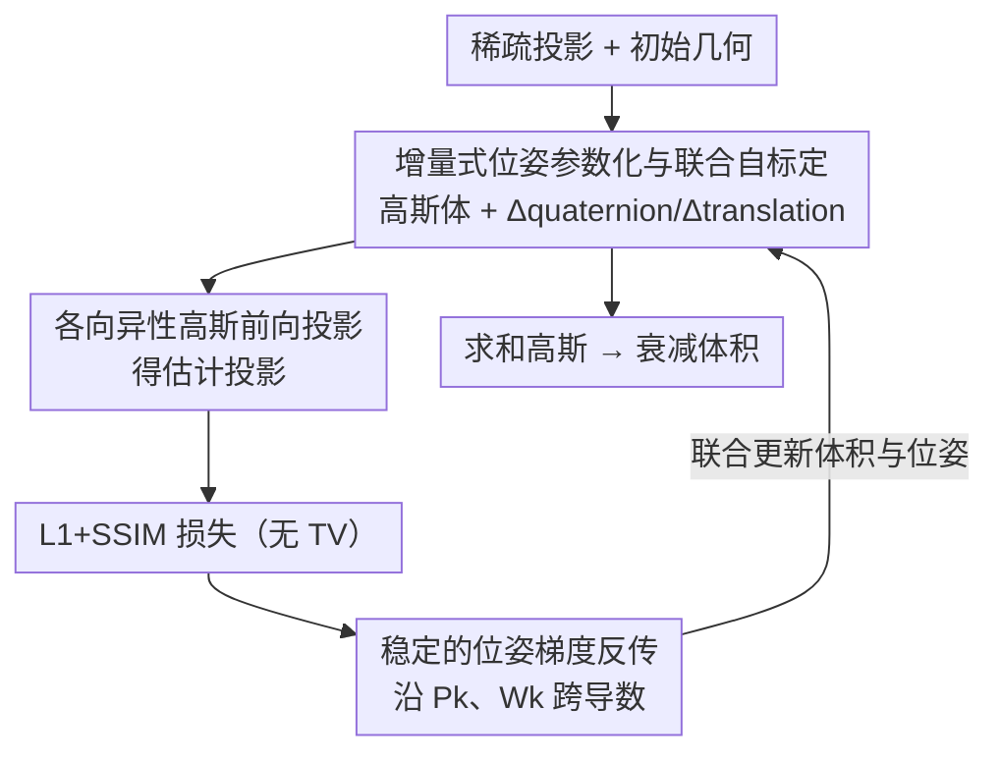

# Revisiting Pose Sensitivity in Splat-based Computed Tomography under Sparse-view Reconstruction

**会议**: CVPR 2026  
**论文**: [CVF Open Access](https://openaccess.thecvf.com/content/CVPR2026/html/Choi_Revisiting_Pose_Sensitivity_in_Splat-based_Computed_Tomography_under_Sparse-view_Reconstruction_CVPR_2026_paper.html)  
**代码**: 待确认  
**领域**: 3D视觉  
**关键词**: CT重建, 高斯泼溅, 稀疏视图, 几何自标定, 位姿优化

## 一句话总结
针对基于 3D 高斯泼溅的稀疏视图 CT 在真实数据上出现的条纹/条带伪影，本文通过受控实验证明其主因是采集几何的位姿误差而非视图稀疏，并据此推导出一个稳定可微的联合自标定框架——在重建体积的同时增量式优化相机位姿，去掉 TV 正则后反而更稳、更快，真实数据上把条纹伪影压下去的同时保住细节，合成数据 PSNR 比 SOTA 高约 10 dB。

## 研究背景与动机
**领域现状**：X 射线 CT 从穿透投影里重建物体内部结构，广泛用于医疗诊断和工业检测。经典 FDK 算法快但需密集投影；迭代方法质量好但慢。近年可微渲染把 CT 重建变成对连续体积场的优化问题，神经隐式表示和最新的**基于泼溅的表示（R2-Gaussian）**——把衰减场建模为一组各向异性 3D 高斯——在稀疏视图下兼顾高质量和快速收敛。

**现有痛点**：泼溅式 CT 在合成数据上表现很好，但作者发现一旦用到**真实 CT 采集**上，就会出现明显的条纹（streak）和条带（strip）伪影，且比传统重建方法严重得多——即使场景里没有会引发异常的金属物。这说明退化不只来自数据稀疏。

**核心矛盾**：泼溅式 CT 的高斯表示沿射线方向引入各向异性加权，使重建强度**对几何错位天然敏感**；而真实旋转系统由于机械缺陷，实际几何与理想几何之间必然存在偏差（位姿不准）。视图稀疏只是表象，位姿敏感性才是真正限制泼溅式 CT 鲁棒性的根因。

**本文目标**：(1) 系统分析并定位泼溅式 CT 伪影的真正来源；(2) 重新推导泼溅公式里的位姿优化，得到一个稳定可微、能在重建过程中联合精修几何的自标定框架；(3) 提供能受控注入位姿扰动的无偏仿真数据，让几何敏感性可复现评测。

**切入角度**：用一个巧妙的「伪 GT 回环实验」把「稀疏」和「位姿误差」两个混淆变量拆开——分别在真实投影和从伪 GT 重新合成的投影上跑泼溅重建，对比谁出伪影。

**核心 idea**：把相机位姿当作和高斯体积一起优化的可学习参数，用增量式参数化 + 稳定的跨导数梯度反传实现「自标定重建」，无需预标定硬件。

## 方法详解

### 整体框架
方法分两部分。**先做溯源分析**（图 2 的四步实验）确认伪影主因是位姿误差；**再做联合自标定重建**：把稀疏投影喂给泼溅重建，3D 高斯的密度/中心/协方差 $\{\rho_i,\mathbf{p}_i,\Sigma_i\}$ 与每相机的**增量位姿参数** $\{\Delta\mathbf{q}_k,\Delta\mathbf{t}_k\}$ 一起优化；各向异性高斯前向投影出估计投影，与输入投影算 L1+SSIM 损失（**去掉 TV 正则**），再通过稳定的梯度反传同时更新体积和位姿，迭代到收敛后把高斯求和成衰减体积。下图是运行时的自标定重建闭环（溯源分析与无偏数据生成是支撑性贡献，不在此闭环内）：

### 关键设计

**1. 伪影溯源：把「稀疏」和「位姿误差」拆开，证明主因是位姿**

痛点：泼溅式 CT 在真实数据上出条纹伪影，但「稀疏视图」和「位姿不准」两个因素混在一起，无法直接归因。作者设计了一个四步受控实验（图 2）。第一步用真实数据的密集 721 视图跑 FDK 得到伪 GT 体积（依据 $\text{RMSE}\propto 1/\sqrt{N}$，$N$ 为无偏几何误差下的投影数，密集投影下 FDK 足够准）；第二步从伪 GT 重新合成 75 张投影（几何完全已知、无位姿误差）；第三步分别用「真实 75 视图」和「合成 75 视图」跑泼溅重建。结果很关键：合成 75 视图重建出的条纹伪影**显著被抑制**，而真实 75 视图重建仍满是条纹——既然两者视图数相同，伪影就不主要来自稀疏。第四步进一步比较两套数据下估计投影与 GT 的误差图：合成数据误差均匀分布，真实数据误差却在物体边缘呈**方向性偏置**，这正是相机位姿不准的指纹。由此把伪影主因钉死在几何误差上，为后续设计提供依据。

**2. 增量式位姿参数化与联合自标定：让位姿和体积一起优化**

痛点：传统 CT 标定要么离线用已知尺寸的标定体（无法应对扫描中的实时几何扰动、还要额外扫描），要么在线方法各有局限。本文把位姿直接纳入重建优化。每个相机的刚体运动用旋转矩阵 $\mathbf{W}_k$ 和平移 $\mathbf{t}_k$ 表示，第 $i$ 个高斯被变换为 $\tilde{\mathbf{p}}_{i,k}=\mathbf{W}_k\mathbf{p}_i+\mathbf{t}_k$、$\tilde\Sigma_{i,k}=\mathbf{W}_k\Sigma_i\mathbf{W}_k^\top$，再投影到 2D 探测器。关键在于**增量式参数化**：用四元数 $\mathbf{q}_k$ 和平移向量建模运动，但只优化相对初始几何的小增量 $\Delta\mathbf{q}_k=\mathbf{q}_k-\mathbf{q}_{k,init}$、$\Delta\mathbf{t}_k=\mathbf{t}_k-\mathbf{t}_{k,init}$，最终参数集 $\Theta=\{\mathbf{p}_i,\Sigma_i,\rho_i,\Delta\mathbf{q}_k,\Delta\mathbf{t}_k\}$ 在同一优化里联合求解。这种「相对初值的小增量」在小角近似下缓解了梯度爆炸、允许细粒度精修旋转和平移，从而实现自标定——不依赖预标定硬件，也不像传统方法需要额外扫描或 GT 分割先验。

**3. 稳定的位姿梯度反传 + 去 TV 正则：让几何梯度既稳又不被压**

痛点：以往泼溅式 CT 方法在反传时忽略了位姿相关的跨导数依赖，导致优化不稳。本文显式追踪损失对两个位姿相关中间量的雅可比（图 5）：透视投影矩阵 $\mathbf{P}_k\in\mathbb{R}^{3\times4}$ 和旋转矩阵 $\mathbf{W}_k$。对 $\mathbf{W}_k$ 的梯度被拆成两路 $\tfrac{\partial\mathcal{L}}{\partial\mathbf{W}_k}=\tfrac{\partial\mathcal{L}}{\partial\mathbf{W}_{k,a}}+\tfrac{\partial\mathcal{L}}{\partial\mathbf{W}_{k,b}}$，分别经由变换后的高斯中心 $\tilde{\mathbf{p}}_{i,k}$ 和 $\mathbf{M}_{i,k}$（雅可比 $\mathbf{J}_{i,k}$ 与 $\mathbf{W}_k$ 的乘积），其中蓝色那一项 $\tfrac{\partial\mathcal{L}}{\partial\mathbf{W}_{k,b}}$ 与 RGB 泼溅标定方法不同——因为 CT 泼溅的射线-空间映射 $\phi(\cdot)$ 保留了第三维（要算高斯在真实距离上的射线积分以模拟 X 射线衰减），而 novel view synthesis 的 2D 泼溅没有这一项。损失只用 L1+SSIM、**刻意去掉 TV 正则**：作者发现在联合标定框架下 TV 项不仅多余，还会压住关键的几何梯度、削弱系统恢复细微位姿修正的能力——这从经验上印证「稳定性应来自精确的几何建模，而非启发式平滑约束」，且去掉 TV 还顺带降低了计算时间。

**4. 无偏几何扰动仿真数据：让位姿敏感性可复现评测**

痛点：常规合成数据假设理想圆形轨迹（绕固定旋转中心），无法体现真实系统的机械偏差，导致评测脱离真实。作者构造能受控注入几何误差的数据集：把探测器几何建模为 SE(3) 刚体变换 $T$，对旋转和平移**分开处理**以保证无偏。平移是线性的，直接从零均值高斯 $\mathbf{t}\sim\mathcal{N}(0,\sigma_{trans}^2 I)$ 采样；旋转在非线性的 SO(3) 上，不能直接加噪，于是先用对数映射到切空间、加方差 $\sigma_{rot}^2$ 的高斯噪声、再用指数映射回 SO(3)，既保证扰动真实又保持变换合法。论文给出了数据生成无偏性的数学证明（在补充材料），从而提供一个可复现、可控制扰动幅度的几何敏感性测试床。

### 损失函数 / 训练策略
损失为 $\mathcal{L}(I_k,\hat I_k)=\mathcal{L}_{L1}(I_k,\hat I_k)+\lambda\mathcal{L}_{SSIM}(I_k,\hat I_k)$，结合像素级和结构相似度，无 TV。沿用 R2-Gaussian 的高斯学习率，相机参数学习率设 2e-4 并在 30000 步内指数衰减到 2e-5；PyTorch + CUDA 实现，RTX A6000 上训练。

## 实验关键数据

### 主实验
合成数据用 TIGRE 生成、注入旋转噪声 std 0.03（李代数域）和平移噪声 std 1.0（一个体素尺寸）；真实数据用公开 CT 数据集，全部 75 视图。下表为有/无几何扰动下基线泼溅法 [R2-Gaussian] 与本文的 PSNR 对比（部分场景）：

| 场景 | 无噪声-基线 | 无噪声-本文 | 有噪声-基线 | 有噪声-本文 |
|------|------|------|------|------|
| Chest | 35.81 | 35.68 | 26.69 | **30.44** |
| Foot | 32.51 | 32.04 | 25.46 | **30.57** |
| Beetle | 43.18 | 43.22 | 33.15 | **40.48** |
| Broccoli | 36.54 | 34.70 | 22.21 | **30.20** |
| Engine | 40.25 | 39.33 | 24.69 | **31.60** |
| Teapot | 47.81 | 47.79 | 36.65 | **43.43** |

无噪声时本文与基线几乎持平（说明自标定不会损害理想情形），一旦注入位姿噪声，基线急剧崩坏而本文保持稳定——在多个物体上整体比 SOTA 联合标定方法（Thies et al.）的 PSNR 高约 10 dB。位姿标定精度上（表 2，15 个场景均值），本文平移 RMSE 0.726 AU（NeAT 1.437、Thies et al. 2.463）、朝向误差 0.627°（NeAT 2.881°、Thies et al. 4.076°），均大幅领先。

### 消融实验
| 配置 | 关键结果 | 说明 |
|------|---------|------|
| 噪声等级 $\sigma_{rot}/\sigma_{trans}$（Beetle）0.01/0.5 → 0.10/5.0 | 基线 37.28→30.80；本文 41.38→32.32 dB | 噪声越大基线掉得越狠，本文始终更鲁棒 |
| 视图数 75/50/25（有扰动） | 本文 33.42/31.73/29.02；基线 28.50/27.67/26.44 dB | 各视图数下本文 PSNR/SSIM 全面领先 |
| 计算时间（合成均值） | 本文 20.89 min < 基线 23.19 < Thies 31.15 < NeAT 48.35 | 去 TV 正则使本文比基线还快 |
| 极稀疏 25 视图 + 扰动 | 本文伪影远少于基线，但开始出针状伪影 | 去 TV 在极端稀疏下暴露局限 |

### 关键发现
- **位姿误差才是主因**：受控实验证明同样 75 视图下，合成（无位姿误差）几乎无条纹、真实（有位姿误差）满是条纹，误差图在真实数据上呈边缘方向性偏置——这是全文最核心的归因证据。
- **去 TV 反而更好**：在联合自标定框架下，TV 正则会压住几何梯度、还拖慢速度；去掉后既更稳又更快，说明稳定性应来自精确几何建模而非平滑约束。
- **极端稀疏下的权衡**：25 视图时本文虽仍远好于基线，但因缺 TV 开始出现针状伪影——提示极稀疏场景可能仍需额外正则。

## 亮点与洞察
- **「拆混淆变量」的实验设计很漂亮**：用密集 FDK 伪 GT + 重新合成投影，把「稀疏」和「位姿误差」干净地分离开，并用误差图的方向性偏置坐实位姿假设——这是一个可复用的归因范式。
- **针对 CT 泼溅特有的梯度项**：明确指出 CT 泼溅的射线-空间映射保留第三维、导致其位姿梯度与 RGB 泼溅标定不同（多出蓝色那一项），把「为什么泼溅式 CT 对几何特别敏感」从现象讲到了机制。
- **「少即是多」**：去掉 TV 正则同时换来更稳的几何梯度、更高质量和更短时间，三赢——值得在其他可微重建任务里重新审视启发式平滑项。
- **标定参数可复用**：估计出的相机标定参数能迁移给其他重建方法用，自标定不只服务本框架。

## 局限与展望
- 作者承认：极稀疏视图（25 投影）下因缺 TV 会出现针状伪影，需要额外正则策略，这是明确的未来工作。
- 平移在体素空间采样，物理效应会随数据尺度变化——评测里的「AU = 一个体素尺寸」量纲需注意可比性。
- 自己发现的局限：方法假设存在合理的初始几何（增量式只优化小偏差），对初值偏离很大或存在大幅运动的情形是否仍稳定、是否会陷入局部极小，论文未充分讨论；锥束几何下的验证较多，对其他系统几何的普适性有待进一步检验。

## 相关工作与启发
- **vs R2-Gaussian（泼溅式 CT 基线）**：基线假设几何已标定、用 TV 正则压伪影，真实数据上因位姿误差出针状伪影且被过度平滑；本文联合优化位姿、去 TV，既压伪影又保细节，无噪声时还不掉点。
- **vs Thies et al.（FDK + 头动校正）**：他们做 FDK 重建并修头部运动，但 FDK 本身限制了输出质量、还依赖预训练网络评估重建质量；本文用可微泼溅、端到端联合优化，PSNR 高约 10 dB、位姿误差更小。
- **vs Gao et al. / Wu et al.（隐式表示 + 位姿校正）**：Gao 需要 GT 分割先验，Wu 只支持扇束几何且无公开代码；本文支持锥束、无需分割先验。
- **vs NeAT（自适应八叉树隐式 + 位姿校正）**：NeAT 边界锐利但难重建均匀区域、且隐式网络时间复杂度高；本文泼溅表示快、鲁棒、全可微，标定精度也更高。

## 评分
- 新颖性: ⭐⭐⭐⭐ 「位姿敏感性才是主因」的归因洞察 + CT 泼溅特有梯度项推导很有价值，单个组件（联合位姿优化、增量参数化）借鉴自 RGB 泼溅标定
- 实验充分度: ⭐⭐⭐⭐ 合成/真实双评测 + 噪声/视图数/时间多组消融 + 位姿精度量化，证据扎实，但真实数据多为定性
- 写作质量: ⭐⭐⭐⭐⭐ 从溯源实验到机制分析再到方法，逻辑链非常清晰
- 价值: ⭐⭐⭐⭐ 为泼溅式 CT 落地真实系统扫清了关键障碍，标定参数可复用、框架轻量易集成

<!-- RELATED:START -->

## 相关论文

- [\[CVPR 2026\] Regularizing INR with Diffusion Prior for Self-Supervised 3D Reconstruction of Neutron Computed Tomography Data](regularizing_inr_with_diffusion_prior_self-supervised_3d_reconstruction_of_neutr.md)
- [\[CVPR 2026\] Revisiting Optimal Coding for I-ToF under Practical Sensor Constraints](revisiting_optimal_coding_for_i-tof_under_practical_sensor_constraints.md)
- [\[CVPR 2026\] Revisiting Token Compression for Accelerating ViT-based Sparse Multi-View 3D Object Detectors](revisiting_token_compression_for_accelerating_vit-based_sparse_multi-view_3d_obj.md)
- [\[CVPR 2026\] SV-GS: Sparse View 4D Reconstruction with Skeleton-Driven Gaussian Splatting](sv-gs_sparse_view_4d_reconstruction_with_skeleton-driven_gaussian_splatting.md)
- [\[CVPR 2026\] SEPatch3D: Revisiting Token Compression for Accelerating ViT-based Sparse Multi-View 3D Object Detectors](sepatch3d_revisiting_token_compression_for_accelerating_vit_based_sparse_3d_detectors.md)

<!-- RELATED:END -->
