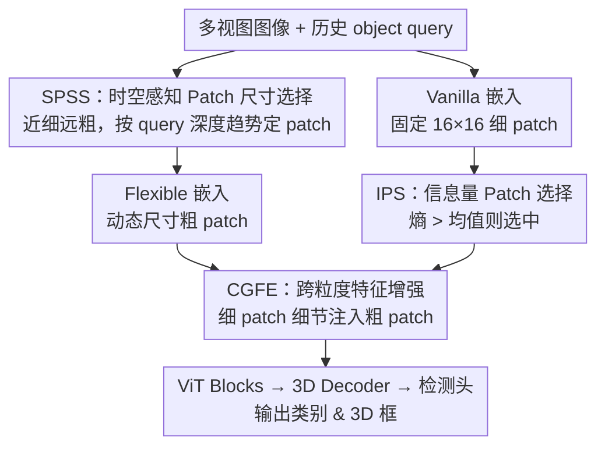

# Revisiting Token Compression for Accelerating ViT-based Sparse Multi-View 3D Object Detectors

**会议**: CVPR 2026  
**论文**: [CVF Open Access](https://openaccess.thecvf.com/content/CVPR2026/html/Ji_Revisiting_Token_Compression_for_Accelerating_ViT-based_Sparse_Multi-View_3D_Object_CVPR_2026_paper.html)  
**代码**: https://github.com/Mingqj/SEPatch3D  
**领域**: 3D视觉 / 自动驾驶感知 / 模型加速  
**关键词**: 多视图3D检测, Token压缩, 动态Patch尺寸, ViT加速, 熵选择

## 一句话总结
针对 ViT 多视图 3D 检测器推理慢的问题，本文提出 SEPatch3D，用「按场景时空分布动态选 patch 尺寸 + 把粗 patch 用细 patch 增强」替代传统 token 剪枝/合并，在 nuScenes 上比 StreamPETR 提速最高 57.7% 而精度几乎不掉。

## 研究背景与动机

**领域现状**：多视图 3D 目标检测是自动驾驶感知的核心环节。其中稀疏 query 类检测器（DETR3D、Sparse4D、StreamPETR 等）绕开了稠密 BEV 构建，直接让可学习的 object query 去关联图像特征，能聚焦物体级信息、精度领先；而它们又特别适合搭配表征能力强的 ViT 骨干。

**现有痛点**：ViT 的计算量基本随 token 数线性增长，稀疏检测器叠 ViT 后推理延迟很高（StreamPETR + ViT-L 在 640×1600 分辨率下单帧要 1.3 秒）。为加速而生的三类 token 压缩——token 剪枝、token 合并、增大 patch 尺寸——在分类任务上有效，但搬到 3D 检测上各有硬伤：剪枝会丢掉背景区域（这些区域恰恰是检测任务里宝贵的难负样本来源）；合并会做出不规则聚合、破坏上下文一致性；单纯增大 patch（超过 18 后）则丢失细粒度语义、掉点明显。

**核心矛盾**：加速（减少 token）和精度（保住细粒度语义 + 背景上下文）之间存在 trade-off。三种现成策略都是「一刀切」地压缩，没有按场景内容区别对待，于是要么丢背景、要么丢细节。

**本文目标**：设计一种既高效、又能保住检测所需细粒度语义的压缩策略，把精度-效率的折中点往前推。

**切入角度**：作者发现增大 patch 这条路「整体语义保留得最好」、最契合检测需求，问题只出在过大时丢细节。那只要做到「该粗的地方粗、该细的地方细」，再把被粗化掉的关键区域细节补回来，就能兼顾两头。判断「该粗该细」的线索来自历史 object query 的深度分布——近处有物体的场景要细，背景主导的远景可以粗。

**核心 idea**：按物体的时空分布动态调 patch 尺寸（近细远粗），再用熵挑出信息量大的区域、把细粒度 patch 的细节注回粗 patch，从而在减少 token 的同时把信息损失降到最低。

## 方法详解

### 整体框架
SEPatch3D 在 StreamPETR 这类稀疏检测器的「图像 → patch embedding → ViT → 3D decoder → 检测头」流水线里，只改前端的 patch 化与特征增强部分，分两大阶段。第一阶段是**动态双路 patch embedding**：对每帧多视图图像同时做两路嵌入——一路是固定 16×16 的 vanilla 嵌入（产出细 patch，作为细节来源），另一路由 SPSS 模块根据历史 query 的时空线索动态选一个更大的尺寸做灵活嵌入（产出粗 patch，作为主干输入）。第二阶段是**选择式跨粒度特征增强**：IPS 模块用熵从 vanilla patch 里挑出信息量最大的区域，CGFE 模块再把这些区域对应的细 patch 细节通过 cross-attention 注入相应的粗 patch。增强后的粗 patch（连同其余粗 patch）才送进 ViT、3D decoder 和检测头输出类别与 3D 框。

### 关键设计

**1. SPSS 时空感知 Patch 尺寸选择：用历史 query 的深度趋势决定该帧粗到什么程度**

要做到「近细远粗」，先得有个不依赖当前帧、又能反映场景物体远近的代理量。SPSS 直接复用上一帧 $T-1$ 的 object query：把 $M$ 个 query 按 StreamPETR 的方式投到 ego 坐标系算 3D 位置，取它们深度的均值 $\bar{D}_{T-1}=\frac{1}{M}\sum_i d_i^{T-1}$ 作为场景空间布局的标量描述。只看单帧深度容易让相邻帧 patch 尺寸跳变，所以再对前 $h$ 帧的平均深度做线性回归得到趋势斜率 $S_{T-1}=\mathrm{Linear}(\bar{D}_{T-h},\dots,\bar{D}_{T-1})$，并用 $\Delta S_{T-1}=S_{T-1}-S_{T-2}$ 描述趋势变化。当前帧 patch 尺寸按三分支决策：物体远且在变小（$\bar{D}_{T-1}>\theta$ 且 $\Delta S_{T-1}>0$）选大 patch $P_l$ 省算力；物体近且在变大（$\bar{D}_{T-1}<\theta$ 且 $\Delta S_{T-1}<0$）选小 patch $P_s$ 保细节；其余情况沿用上一帧尺寸以保持时间稳定。$\theta$ 取 0.6。这种「空间深度 + 时间趋势」联合判据，比固定增大 patch 多了对场景的自适应，也比纯空间判据更平滑。

**2. IPS 基于熵的信息量 Patch 选择：自适应挑出真正会因粗化丢细节的区域**

不是所有区域都值得费力增强，只有那些纹理/边缘丰富、最容易在粗化中被抹掉的区域才需要。IPS 先按 StreamPETR 用运动估计把历史 query 对齐到当前帧得到 $\hat{Q}_T$，再让 patch 特征 $F_p$ 作 query、$\hat{Q}_T$ 作 key/value 做一次 cross-attention，把时序运动线索吸进 patch 特征以便跨帧推理前景。由于 patch 特征来自浅层、语义抽象有限，作者用**熵**来定位信息量大的区域：对 L2 归一化后的特征 $\tilde{F}$ 逐 patch 算 $H_j=-\sum_{c=1}^{C}\tilde{F}_{j,c}\log\tilde{F}_{j,c}$，熵高的 patch 通常对应纹理/边缘丰富区。选择上不用固定 top-K，而是**自适应**地选「熵超过全场均熵」的所有 patch，让选中数量随场景复杂度自动变化。选择在 vanilla 细 patch 上做，再把索引投影到粗 patch 空间保证跨尺度对齐。

**3. CGFE 跨粒度特征增强：把细 patch 的细节用 cross-attention 注回粗 patch**

选出信息区后，要真正把丢掉的细节补回粗 patch。CGFE 让粗 patch 特征 $F_l$ 作 query 去从对应的选中细 patch 特征 $F_n$ 里检索细粒度信息：$F_e=\mathrm{softmax}\!\left(\frac{\mathrm{pos}(F_l)\,\mathrm{pos}(F_n)^\top}{\sqrt{C}}\right)F_n$，其中 $\mathrm{pos}(\cdot)$ 表示给 patch 加上位置编码 $PE$。为保留粗 patch 原有的全局结构、只做细节注入，用残差连接 $F_l'=F_l+F_e$。这样粗 patch 在信息区获得了细 patch 的局部细节，特征质量提升，弥补了增大 patch 带来的语义损失——这正是 SEPatch3D 能「既粗化又不太掉点」的关键。

> 三个模块与框架严格对应：SPSS 决定粗 patch 尺寸（动态双路嵌入阶段），IPS + CGFE 构成选择式跨粒度增强阶段，三者覆盖了框架图里全部贡献节点。

### 损失函数 / 训练策略
方法不引入额外的压缩专用损失，沿用 StreamPETR 的检测训练目标，模块以即插即用方式接入。骨干用 ViT-L，query 数 $M=64$、特征维度 $C=256$、历史帧 $h=8$。提供 fast / faster 两个变体，区别仅在 $(P_s,P_l)$ 取值（如 320×800 下 fast 用 (17,18)、faster 用 (18,20)；640×1600 下 fast 用 (18,20)、faster 用 (20,22)）。所有推理在单张 RTX 3090 上计时以保证公平。

## 实验关键数据

> 指标说明：**NDS**（nuScenes Detection Score，综合平移/尺度/朝向/速度/属性误差的检测得分，越高越好）；**mAP** 越高越好；**CDS**（Argoverse 2 的 Composite Detection Score，综合 mATE/mASE/mAOE）；Infe. Time 为整模型推理时延、Back. Time 为骨干时延，越低越好。

### 主实验

nuScenes 验证集（ViT-L 骨干；†表示 640×1600 高分辨率）：

| 方法 | 分辨率 | NDS(%)↑ | mAP(%)↑ | 推理时延(ms)↓ | 相对加速 |
|------|--------|---------|---------|---------------|----------|
| StreamPETR | 320×800 | 61.2 | 52.1 | 317.0 | 基线 |
| ToC3D-faster | 320×800 | 60.5 | 51.3 | 237.2 | -25.2% |
| SEPatch3D-fast | 320×800 | 61.2 | 52.1 | 250.2 | -21.1% |
| SEPatch3D-faster | 320×800 | 60.3 | 51.6 | 194.3 | -38.7% |
| StreamPETR† | 640×1600 | 62.7 | 55.8 | 1309.9 | 基线 |
| ToC3D-faster† | 640×1600 | 61.9 | 54.3 | 878.5 | -33.0% |
| SEPatch3D-fast† | 640×1600 | 62.7 | 54.5 | 675.4 | -48.4% |
| SEPatch3D-faster† | 640×1600 | 62.4 | 54.2 | 554.4 | -57.7% |

在 320×800 下 fast 变体精度与 StreamPETR 持平（61.2 NDS）而提速 21.1%；faster 提速 38.7% 仅掉 0.9 NDS。640×1600 下 fast 完全匹配基线精度（62.7 NDS）且省 48.4% 时延，faster 进一步省到 57.7%。相比 SOTA 的 ToC3D-faster，SEPatch3D-faster 精度相当但整模型快约 17.6%。Argoverse 2 上 fast 变体 18.5 CDS / 25.3 mAP（基线 19.0/25.7）而省 29.2% 时延，验证跨数据集泛化。

### 消融实验

各组件逐步叠加（基于 faster，320×800，nuScenes）：

| 配置 | NDS(%)↑ | mAP(%)↑ | 推理时延(ms)↓ | 参数(M) |
|------|---------|---------|---------------|---------|
| Baseline | 61.2 | 52.1 | 317.0 | 316.62 |
| + SPSS | 58.8 | 50.8 | 189.1 (-40.3%) | 318.77 |
| + CGFE | 60.4 | 51.7 | 209.6 (-33.9%) | 325.58 |
| + IPS | 60.3 | 51.6 | 194.3 (-38.7%) | 328.13 |

只加 SPSS 提速极猛（-40.3%）但掉 2.4 NDS——说明单纯动态粗化确实丢细节；加上 CGFE 后 NDS 从 58.8 回升到 60.4，验证「细节注回」是补偿掉点的主力；再加 IPS 几乎不掉精度却把时延从 209.6 压回 194.3（IPS 让 CGFE 只增强少量信息区、省下增强开销）。

### 关键发现
- **CGFE 是精度补偿的核心**：加它把 SPSS 造成的 2.4 NDS 损失追回大半（+1.6 NDS），印证「增大 patch 丢的是细节、补回细节即可救」。
- **IPS 让增强更省**：从 top-K 改为「熵超均值」的自适应选择，既随场景复杂度变，又把 CGFE 的算力开销压下去（+IPS 后时延反降 15ms）。
- **泛化性强**：换到 DETR3D、Sparse4Dv2 同样提速约 22%/37% 且精度几乎不掉；换 ViT-B、SAM 预训练、ToC3D-ViT-L 等不同编码器也都稳定加速，说明收益不绑定特定检测器或骨干。

## 亮点与洞察
- **重新审视三类 token 压缩并指出它们在检测上的具体失效模式**（丢背景难负样本 / 破坏上下文 / 丢细粒度），把「增大 patch 最契合检测」这个常被忽视的观察立成方法主线，动机扎实。
- **用历史 query 深度趋势当 patch 尺寸的驱动信号**很巧妙：复用了稀疏检测器本就有的 query，零额外感知开销就拿到了「近/远」时空线索，还用线性回归斜率防止帧间跳变。
- **「先粗化省算力、再选择性把细节注回」的两段式思路可迁移**到其他 ViT 加速场景（如视频理解、检测里的高分辨率特征图），核心是把「压缩」和「补偿」解耦。

## 局限与展望
- patch 尺寸只在预设的 $\{P_s, P_l\}$ 两档间切换，粒度较粗；若能做连续/多档自适应或许折中点更优。
- SPSS 依赖上一帧 query 的深度作为代理，**冷启动首帧或 query 质量差时**（如刚进入场景、强遮挡）尺寸决策可能失准 ⚠️（论文未专门分析该退化情形）。
- 熵被当作「信息量」的代理，对噪声/低光等极端图像是否仍可靠，论文未做压力测试；自定义的熵选择阈值（均熵）是否对所有场景最优也值得进一步消融。

## 相关工作与启发
- **vs ToC3D**：ToC3D 用运动感知 query 区分前/背景再对背景 token 做剪枝聚合，本质仍是「按重要性剪枝」，会丢背景；本文不剪枝，而是动态调 patch 粒度 + 增强信息区，精度-效率折中更好（faster 变体比 ToC3D-faster 快约 17.6%）。
- **vs tgGBC**：tgGBC 加速的是 decoder（对每个 key 算重要性后逐层剪），但 ViT 检测器里骨干才是延迟大头，故整体提速有限；本文直接动刀骨干前端的 token 数，加速更彻底。
- **vs 通用 ViT token 压缩（DynamicViT / ToMe / CvT 等）**：它们面向分类、按重要性剪或合并 token；本文指出这些策略在 3D 检测上各有结构性损伤，并给出检测专用的「动态 patch + 跨粒度增强」替代。

## 评分
- 新颖性: ⭐⭐⭐⭐ 「动态 patch 尺寸 + 跨粒度细节注回」组合在 3D 检测加速里少见，但各零件（熵选择、cross-attention 增强、动态 patch）多为已有技术重组。
- 实验充分度: ⭐⭐⭐⭐⭐ 两数据集、两分辨率、三检测器、三骨干 + 逐组件消融，泛化与归因都覆盖到。
- 写作质量: ⭐⭐⭐⭐ 动机推导清晰、图示直观；部分模块（IPS 内 cross-attention 的必要性）依赖补充材料。
- 价值: ⭐⭐⭐⭐ 即插即用、对多检测器有效，对自动驾驶实时感知有实用意义。

<!-- RELATED:START -->

## 相关论文

- [\[CVPR 2026\] SEPatch3D: Revisiting Token Compression for Accelerating ViT-based Sparse Multi-View 3D Object Detectors](sepatch3d_revisiting_token_compression_for_accelerating_vit_based_sparse_3d_detectors.md)
- [\[CVPR 2026\] Revisiting Pose Sensitivity in Splat-based Computed Tomography under Sparse-view Reconstruction](revisiting_pose_sensitivity_in_splat-based_computed_tomography_under_sparse-view.md)
- [\[CVPR 2026\] OLATverse: A Large-scale Real-world Object Dataset with Precise Lighting Control](olatverse_a_large-scale_real-world_object_dataset_with_precise_lighting_control.md)
- [\[CVPR 2026\] Aligning Text, Images and 3D Structure Token-by-Token](aligning_text_images_and_3d_structure_token-by-token.md)
- [\[CVPR 2026\] Block-Sparse Global Attention for Efficient Multi-View Geometry Transformers](block-sparse_global_attention_for_efficient_multi-view_geometry_transformers.md)

<!-- RELATED:END -->
