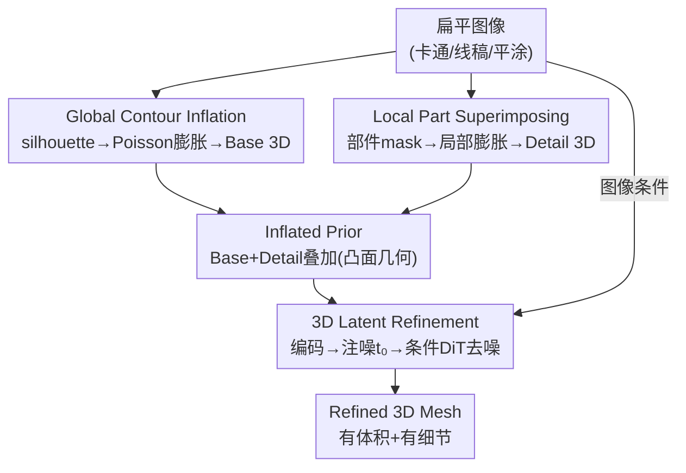

# REVIVE 3D: Refinement via Encoded Voluminous Inflated prior for Volume Enhancement

**会议**: CVPR 2026  
**arXiv**: [2604.27504](https://arxiv.org/abs/2604.27504)  
**代码**: https://guts4.github.io/REVIVE3D/ (项目主页)  
**领域**: 3D视觉  
**关键词**: 单图生成3D、扁平图像、膨胀先验、3D隐空间精修、体积量化指标

## 一句话总结
REVIVE 3D 用一个"两阶段、即插即用"的管线，把缺乏 3D 线索的扁平图像（卡通、线稿、平涂插画）先膨胀成一个有体积的"膨胀先验"网格、再在预训练 3D 隐扩散骨干的隐空间里注噪去噪精修，从而生成既有体积感又有局部细节的 3D 网格，并配套提出 Compactness 与 Normal Anisotropy 两个无参考指标来量化"体积"和"表面扁平度"。

## 研究背景与动机
**领域现状**：单图生成 3D（image-to-3D）目前主流是两类路线——先合成多视角图再升维到 3D，或直接在紧凑隐空间里做 3D 隐扩散（一个 3D autoencoder 定义隐空间 + 一个 DiT 在隐空间从高斯噪声条件去噪到干净 latent，再解码成 mesh，如 Trellis、Direct3D、Hunyuan3D）。

**现有痛点**：当输入是**扁平图像**（flat image，作者定义为缺乏 shading、纹理梯度、相对位置等 3D 线索的输入，如卡通、线稿、平涂美术）时，这些 SOTA 模型几乎全军覆没——要么深度/法线估计失败，要么生成出"压扁的"几乎没有体积的网格。根因是大规模训练集几乎全是富含 3D 线索的自然照片或渲染图，扁平图像对它们来说是 out-of-distribution。

**核心矛盾**：以往针对扁平图的补救手段都"够不着真正的 3D"。轮廓膨胀法（Monster Mash 系）只靠 silhouette 驱动，背面和细节都还原不了；2D-guided 管线（depth/Canny/pose 引导）只能提供 2D 线索，形变停留在图像空间，做不出体积或背面几何；参数化回归法被预定义模型空间框死，表达力受限。问题的本质是：**这些方法都在 2D 或受限模型空间里打转，没有直接给模型 3D 体积线索**。

**本文目标**：从扁平图像直接生成"有体积 + 有细节"的 3D 网格，并且要能量化"有没有体积"这件事。

**切入角度**：作者的观察是——既然骨干模型本身已经预训练了丰富的 3D 知识，缺的只是一个能把它"激活"的体积线索，那就**显式地在 3D 里造一个粗糙但有体积的先验**喂给它，再用扩散的随机性去精修，而不是再去 2D 里绕。

**核心 idea**：先把轮廓和部件 mask 膨胀成一个体积化、部件感知的 Inflated Prior，再把它编码进 3D 隐空间、注入高斯噪声后条件去噪，用先验的几何线索"借力"骨干的预训练 3D 知识来补全凹陷和背面、精修细节。

## 方法详解

### 整体框架
REVIVE 3D 要解决的是"扁平图 → 有体积有细节的 3D 网格"，整体分两阶段串行（Fig. 3）。**Stage 1（Inflated Prior Generation）**：从输入图的前景 silhouette 膨胀出一个负责全局体积的 Base 3D，再从部件分割 mask 膨胀出负责局部结构的 Detail 3D，二者叠加（superimpose）成一个**膨胀先验 Inflated Prior**——它有体积、且带"哪里该有细节"的部件空间线索，但因为是纯加法叠加，所以只能得到**凸面几何**（该凹的嘴、该朝后的尾巴都被错误地做成凸起）。**Stage 2（3D Latent Refinement）**：把这个先验网格用 3D Encoder 编码成 latent，按一个初始噪声水平 $t_0$ 注入高斯噪声，再以输入图为条件做 DiT 去噪、解码成最终 Refined 3D mesh——注噪去噪的随机性正是用来"擦掉"凸面假设、借骨干预训练知识纠正凹陷与背面，同时保留先验给的体积。整套管线即插即用，作者在 Hunyuan3D-2.1 和 Direct3D 两个骨干上都验证有效。

### 关键设计

**1. Global Contour Inflation：用 Poisson 膨胀把轮廓"吹"出全局体积**

这一步针对"扁平图没有 3D 线索、模型估不出深度"这个根本痛点，目标是先无中生有地造出全局体积。作者沿用 Monster Mash 的几何膨胀思路：先从前景 silhouette 提取外轮廓，对轮廓围成的 2D 平面区域三角化得到 2D mesh，然后在这张 mesh 上解一个离散 Poisson 方程求一个平滑的高度场 $\tilde{h}$，它给每个顶点一个沿法向位移的标量值。对每个内部顶点 $i$ 强制局部体积约束：

$$\sum_{j\in N_i} w_{ij}(\tilde{h}_j-\tilde{h}_i)=s_i a_i c,\qquad \tilde{h}_i=0\ \text{for}\ i\in\mathcal{C}$$

其中 $w_{ij}$ 是 cotangent Laplacian 权重（刻画局部曲率），$s_i$ 取 $+1$（前面）/ $-1$（背面），$a_i$ 是顶点 $i$ 周围三角形面积的 $1/3$（lumped vertex area），$c$ 是全局膨胀强度，轮廓集 $\mathcal{C}$ 上的顶点被 Dirichlet 边界条件钉在零高度平面。最后再做一个开方映射 $h_i=s_i\sqrt{|\tilde{h}_i|}$ 把高度场变得更平滑，得到凸的 Base 3D。这样做的好处是：膨胀是从图像本身的轮廓来的，给出的体积线索天然与图像对齐，比拿一个通用球体当先验靠谱得多。

**2. Local Part Superimposing：叠加部件膨胀，补上局部结构线索**

只靠 silhouette 膨胀会漏掉精细结构，Stage 2 就难以精修出有细节的网格。作者用一个自动分割方法（SAM 系）抽出部件候选 mask，按一定准则过滤后，把每个保留下来的部件 $p$ 同样三角化、膨胀出一个局部高度场 $h_p$（即 Detail 3D），再插值叠加到 Base 高度场上：

$$h_{\text{final}}=h_{\text{base}}+\sum_p \mathcal{I}_p(h_p)$$

其中 $\mathcal{I}_p$ 是分段线性插值函数，把局部高度场插到 base mesh 顶点上、逐部件累加。这一步的价值在于：它给 Stage 2 提供了"细结构应该出现在哪、长什么样"的显式部件空间线索，让条件 DiT 能把图像特征和隐空间几何对齐得更准。消融显示，去掉它（只用 Base 3D）即便全局体积出来了，也常常表面扁平、细节丢失。

**3. Stochastic 3D Latent Refinement：注噪去噪，把凸面假设"借力"纠正成真几何**

这是全文的灵魂设计，针对的痛点是 Stage 1 加法叠加导致的**凸面专属几何**（concave/back-facing 区域都被做成凸起，Fig. 4）。作者借鉴随机扩散模型"能纠错、提升样本质量"的特性：先把 Inflated Prior 编码成 latent $z_0$，再在归一化初始噪声水平 $t_0\in[0,1]$ 处注入高斯噪声得到起始 latent

$$z_{t_0}=a_{t_0}z_0+b_{t_0}\varepsilon,\qquad \varepsilon\sim\mathcal{N}(0,\mathbf{I})$$

其中 $a_{t_0},b_{t_0}$ 由骨干扩散器的噪声调度决定（$t_0=0$ 是干净 latent、$t_0=1$ 是纯噪声）。然后以输入图为条件，从 $z_{t_0}$ 一路去噪回 $z_0$，最后解码（Marching Cubes）成 mesh。关键在于：注入的随机性让 DiT 不必死守先验的凸面假设，而是调用骨干预训练的 3D 知识去"重画"凹陷和背面；同时去噪又被先验的体积/部件线索引导，所以既纠错又保住了体积。$t_0$ 因此成了一个**保真—合理性**的旋钮——太小会连凸面缺陷一起保留，太大会把体积也一起冲掉。

### 损失函数 / 训练策略
本方法**无需训练**，是即插即用管线，直接复用预训练 3D 隐扩散骨干（Hunyuan3D-2.1 / Direct3D），不引入新损失。关键超参：Stage 1 全局与局部膨胀强度均 $c=1.5$；Stage 2 guidance scale $7.0$、采样 $50$ 步、默认初始噪声 $t_0=0.8$（经验上 $[0.7,0.8]$ 最佳）。单图推理约 3 分钟（Stage 1 约 2 min + Stage 2 约 1 min，RTX 6000 Ada）。

## 实验关键数据

### 主实验
测试集是作者自建的 2,232 张扁平图像（人/动物/角色，专门挑现有模型会失败的平涂、无阴影、被遮挡/与背景重叠的难例）。评测用 Uni3D / ULIP 衡量图—3D 语义一致性，用自提的 Compactness（$C$，越高越有体积）和 Normal Anisotropy（$\mathrm{NA}$，越低越不扁平）衡量体积与表面扁平度。

| 方法 | Uni3D↑ | ULIP↑ | C↑ | NA↓ |
|------|--------|-------|------|------|
| Trellis | 0.2736 | 0.1241 | 0.1748 | 0.1282 |
| DrawingSpinUp | 0.2335 | 0.1164 | 0.1604 | 0.1332 |
| Hunyuan3D-Omni | 0.2816 | 0.1257 | 0.1707 | 0.1120 |
| Direct3D（骨干） | 0.2796 | 0.1315 | 0.2012 | 0.1019 |
| Hunyuan3D-2.1（骨干） | 0.2759 | 0.1193 | 0.1408 | 0.1347 |
| **Ours (Hunyuan3D-2.1)** | 0.3043 | 0.1265 | **0.2179** | **0.0767** |
| **Ours (Direct3D)** | **0.3097** | **0.1375** | 0.2178 | 0.0908 |

两个骨干上挂载 REVIVE 3D 后，Compactness 和 Normal Anisotropy 全面领先（NA 从 0.13/0.10 降到 0.077/0.091，体积更足、表面更不扁），且 Uni3D/ULIP 也同时提升，说明体积变好的同时语义一致性没有牺牲。51 人用户研究（5 点 Likert，10 张难例 × 6 方法 360° GIF）显示，本方法在 Quality / Volume / Details 三项上都被评为最优。

### 消融实验
在 Art3D 数据集上扫膨胀强度（全局与局部共享）和初始噪声 $t_0$（默认 1.5 / 0.8 为红色高亮）：

| 膨胀强度 | 噪声 $t_0$ | C | NA | Uni3D | ULIP | 说明 |
|---------|-----------|------|------|-------|------|------|
| 6.0 | 0.8 | 0.2682 | 0.0547 | 0.3276 | 0.1153 | 膨胀过强 |
| 0.1 | 0.8 | 0.1172 | 0.2539 | 0.2840 | 0.0935 | 膨胀过弱，体积塌、表面扁 |
| 1.5 | 1.0 | 0.1501 | 0.2168 | 0.3003 | 0.1006 | 纯噪声起步，先验体积被冲掉 |
| 1.5 | 0.6 | 0.4296 | 0.0511 | 0.3043 | 0.0979 | 更贴近先验（C/NA 好但偏离图像） |
| **1.5** | **0.8** | 0.2691 | 0.0610 | **0.3382** | 0.1153 | **默认：几何与图像对齐最好** |

### 关键发现
- **$t_0$ 是体积—保真的总开关**：$t_0$ 小（0.6）时 latent 起步靠近 Inflated Prior，C/NA 数值最漂亮但会连凸面缺陷一起保留、且偏离输入图；$t_0$ 大（1.0）时起步接近纯噪声，体积被骨干冲掉。作者选 $t_0=0.8$ 因为它在保住体积的同时让 Uni3D/ULIP（与图像的几何对齐）最高。
- **Local Part Superimposing 是细节命门**：只用 Base 3D 精修（去掉部件叠加）即便恢复了全局体积，也常表面扁平、丢细节（Fig. 8）；部件线索给了 DiT "细结构在哪"的显式引导。
- **指标本身可信**：把 ModelNet40 各类按 C / NA 排序（Table 1），高 C 是 glass_box/dresser/radio 等有体积类、低 C 是 curtain/keyboard/laptop 等扁平类；高 NA 是 door/wardrobe/keyboard 等扁平类、低 NA 是 vase/bowl/plant 等曲面复杂类——与直觉和用户感知一致。

## 亮点与洞察
- **"造一个粗糙 3D 先验去激活骨干预训练知识"是个可复用范式**：与其在 2D 里绕，不如直接在 3D 里给一个有体积但不完美的初值，再用扩散的随机性去精修。这种"先验 + 隐空间注噪去噪"的思路可迁移到任何"输入线索不足、但骨干已有强先验"的生成任务。
- **用 SDEdit 式注噪去噪做 3D 几何纠错**：把图像编辑里"注噪到中间步再去噪"的技巧搬到 3D latent，$t_0$ 恰好控制"保留多少先验 vs 借力多少骨干"，物理含义清晰、单旋钮可调。
- **为"体积"这件难量化的事造了无参考指标**：扁平图没有 GT 3D，Chamfer 这类参考指标用不了；Compactness（等周商 $36\pi V^2/S^3$）和 Normal Anisotropy（法向分布的归一化香农熵补）只依赖生成网格自身，且经 ModelNet40 排序 + 用户研究双重验证与人类感知对齐——这套评测协议本身对"扁平图 3D"子领域很有价值。

## 局限与展望
- **作者承认**：方法依赖预训练骨干做精修，会把卡通输入的风格简洁性"拉向"骨干的写实偏置（photorealistic bias），即风格漂移；作者期望通过更好的纹理对齐缓解，留作未来工作。
- **自己发现**：① 整条管线建立在"前景 silhouette + 部件分割可靠"之上，虽然 Fig. 10 展示了对模糊轮廓/不完美分割的一定鲁棒性，但分割严重失败时 Detail 3D 线索会失真；② Stage 1 约 2 分钟的耗时主要花在 Poisson 膨胀与部件处理上，单图 3 分钟对批量场景偏慢；③ Compactness 可被"充气橡皮擦"式简单凸体刷高，必须配合 Normal Anisotropy 一起看，单指标会误导。
- **改进思路**：把纹理/风格保持作为 Stage 2 的额外条件或约束，缓解写实漂移；或让 $t_0$ 随区域自适应（凹陷/背面区给大噪声、已对的区域给小噪声）以兼顾纠错与保真。

## 相关工作与启发
- **vs 轮廓膨胀法（Monster Mash 系）**：他们只靠 silhouette 膨胀，背面无引导、部件结构过简，常需人工消歧；本文把膨胀只当"先验"而非终点，再用 3D 隐扩散精修补全凹陷与背面，区别在于多了一个"借力预训练 3D 知识"的精修阶段。
- **vs 2D-guided 管线（DrawingSpinUp、depth/Canny/pose 引导）**：他们只提供 depth/pose/contour 等 2D 线索，形变停在图像空间、做不出真体积；本文直接在 3D 里给体积线索且不回投影到 2D，因此能生成背面几何。表里 DrawingSpinUp 在 C/NA 上明显落后即为佐证。
- **vs 带框条件的 Hunyuan3D-Omni**：用 bounding-box 条件能增大表观体积，但常把局部拉伸/膨胀去贴合框，产生破坏图像一致性的"均匀膨胀"；本文的体积来自图像对齐的膨胀先验，体积与细节都与图一致。
- **vs 纯骨干（Direct3D / Hunyuan3D-2.1）**：直接喂扁平图会塌成扁平网格；挂载本文的两阶段后，同一骨干 C/NA 全面改善——证明问题不在骨干能力，而在缺一个能激活它的 3D 体积先验。

## 评分
- 新颖性: ⭐⭐⭐⭐ "膨胀先验 + 3D 隐空间注噪去噪精修"这一组合切中扁平图 3D 的真痛点，并配套提出两个可验证的无参考指标，思路扎实但单个组件多为已有技术的巧妙拼装。
- 实验充分度: ⭐⭐⭐⭐ 自建 2,232 张难例测试集、双骨干验证、5 baseline 对比、51 人用户研究、$t_0$/膨胀强度消融、指标自验证齐全，唯缺更大规模定量基准。
- 写作质量: ⭐⭐⭐⭐ 动机层层递进、两阶段结构清晰、图示（凸面失败、轨迹、消融）到位，公式与符号交代完整。
- 价值: ⭐⭐⭐⭐ 即插即用、不需训练，可直接挂到主流 3D 隐扩散骨干上，对卡通/插画转 3D 的实际生产（游戏、动画、VR）有直接落地价值。

<!-- RELATED:START -->

## 相关论文

- [\[CVPR 2026\] Rethinking Pose Refinement in 3D Gaussian Splatting under Pose Prior and Geometric Uncertainty](rethinking_pose_refinement_in_3d_gaussian_splatting_under_pose_prior_and_geometr.md)
- [\[CVPR 2026\] Color-Encoded Illumination for High-Speed Volumetric Scene Reconstruction](color-encoded_illumination_for_high-speed_volumetric_scene_reconstruction.md)
- [\[CVPR 2026\] Photo3D: Advancing Photorealistic 3D Generation through Structure-Aligned Detail Enhancement](photo3d_advancing_photorealistic_3d_generation_through_structure-aligned_detail_.md)
- [\[CVPR 2026\] Dynamic Visual SLAM using a General 3D Prior](dynamic_visual_slam_using_a_general_3d_prior.md)
- [\[CVPR 2026\] mmWaveFlow: Unified Enhancement and Generation of mmWave Human Point Clouds](mmwaveflow_unified_enhancement_and_generation_of_mmwave_human_point_clouds.md)

<!-- RELATED:END -->
