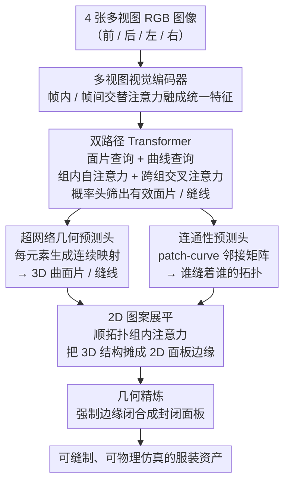

# ReWeaver: Towards Simulation-Ready and Topology-Accurate Garment Reconstruction

**会议**: CVPR2026  
**arXiv**: [2601.16672](https://arxiv.org/abs/2601.16672)  
**作者**: Ming Li, Hui Shan, Kai Zheng, Chentao Shen, Siyu Liu, Yanwei Fu, Zhen Chen, Xiangru Huang
**机构**: 浙江大学, 上海创新研究院, 西湖大学, 复旦大学, Adobe, 西安电子科技大学
**代码**: 待确认  
**领域**: 3D视觉  
**关键词**: 服装重建, 缝纫模式, 拓扑重建, 多视图重建, 物理仿真

## 一句话总结

提出 ReWeaver 框架，从最少4张多视图RGB图像中联合重建3D服装几何与2D缝纫图案（sewing pattern），通过双路径Transformer预测3D曲面片/曲线及其拓扑连接，再经组内注意力将3D结构展平为2D面板边缘，首次实现拓扑准确且可直接用于物理仿真的服装资产恢复。

## 背景与动机

高质量3D服装重建在虚拟试穿、数字人、游戏和机器人操作等应用中至关重要。然而现有方法存在两大痛点：

1. **非结构化表示的局限**：现有方法（点云、SDF、3D高斯泼溅等）虽能近似服装几何，但缺乏显式的缝纫结构（seam/panel），难以直接用于物理仿真、服装编辑或重定向。这些表示与工业标准的服装设计流程（以2D缝纫图案为核心）天然不兼容。

2. **已有缝纫图案方法的不足**：
    - 依赖预定义拓扑的方法（如 DiffAvatar）仅适用于简单服装，无法处理未见过的版型
    - 基于视觉-语言模型的方法（如 ChatGarment、AIpparel）通过token化JSON描述生成2D图案，虽然拓扑泛化性更强，但几何精度不足
    - 大多数方法只关注2D图案，忽略了精确的3D几何理解

**核心目标**：同时重建准确的服装**拓扑**（哪些面板/缝线相连）和**几何**（各元素的精确3D形状），使输出既能用于3D感知，又能用于高保真物理仿真。

## 方法详解

### 整体框架

ReWeaver 要回答的问题是：只给四张前后左右的服装照片，能不能既恢复出准确的 3D 几何，又同时吐出工业流程真正需要的 2D 缝纫图案，而且两者的缝线、面板还要一一对应、可直接拿去做物理仿真。它用一套编码器-解码器来串这件事：多视图编码器先把稀疏图像融成统一特征，双路径 Transformer 再从这些特征里解出 3D 曲面片、缝线以及它们的拓扑连接关系，最后一个展平模块顺着拓扑把 3D 结构摊平成 2D 面板边缘，配合后处理保证面板闭合。

理解后面的关键是先记住模型在 2D 和 3D 两套空间里各有一组对应的名词：

| 空间 | 表面区域 | 边界线 |
|:---:|:---:|:---:|
| 3D | Patch（曲面片） | Curve（曲线/缝线） |
| 2D | Panel（面板） | Edge（边缘） |

也就是说，3D 里的一块 Patch 会被展平成 2D 里的一片 Panel，3D 里缝合两块 Patch 的 Curve 对应 2D 面板的 Edge——整条 pipeline 本质上就是在维护这套 2D↔3D 的对应关系。

### 关键设计

**1. 多视图视觉编码器：用交替注意力把稀疏未知视角的图像融成统一特征**

服装重建的第一道坎是输入只有寥寥几张、视角分布还不固定的多视图照片，单视图里的局部纹理和跨视图才能确定的全局几何必须同时用上。ReWeaver 沿用 VGGT 的思路：每张图先切成不重叠的 $16\times16$ patch，经 DINOv2 backbone 嵌成 token，然后交替堆叠**帧内自注意力**（细化单张图内部的纹理线索）和**帧间自注意力**（跨视图对齐、聚合几何信息）。两种注意力轮流作用，等于让局部纹理和全局几何被渐进式地反复整合，对视角稀疏、分布未知的输入更鲁棒。最后把帧内、帧间输出拼接并展平所有帧的 token，得到序列 $T_i \in \mathbb{R}^{N_i \times D}$（$D=768$）供后续解码。

**2. 双路径 Transformer：让曲面片和缝线各走一条解码路径、又互相交换证据**

3D 几何里曲面片（Patch）和缝线（Curve）是两类性质很不一样的元素，混在一起解码容易互相干扰。借鉴 ComplexGen，ReWeaver 给它们各开一条路径：用可学习的面片查询 $Q_p \in \mathbb{R}^{N_p \times D}$（$N_p=200$）和曲线查询 $Q_c \in \mathbb{R}^{N_c \times D}$（$N_c=70$）作起点，查询数量取到训练集中最大元素数的约两倍，留足冗余。每一层里，两条路径各自先做**组内自注意力**（patch 与 patch、curve 与 curve 内部交换信息），再做**跨组交叉注意力**（从图像 token 以及另一类元素里检索上下文），最后过 LayerNorm + FFN + 残差。多层之后得到精炼的 $T_p \in \mathbb{R}^{N_p \times D}$ 和 $T_c \in \mathbb{R}^{N_c \times D}$，分头送进三个解码头。其中一个概率头先判断哪些查询命中了真实元素：

$$\sigma_p^i = \text{sigmoid}(f_p^{\text{prob}}(T_p^i)), \quad \sigma_c^i = \text{sigmoid}(f_c^{\text{prob}}(T_c^i))$$

低于阈值 $\epsilon_p$、$\epsilon_c$ 的查询被滤掉，再经拓扑精炼得到二值有效掩码 $\boldsymbol{\sigma}_p^{\star}$、$\boldsymbol{\sigma}_c^{\star}$，等于从 200/70 个候选里筛出真正存在的面片和缝线。

**3. 超网络几何预测头：不回归离散点坐标，而是为每个元素生成一条连续映射**

如果直接让网络回归固定数量的点坐标，采样密度就被训练时写死了，大面片和小面片只能用同一套密度，要么浪费要么欠采。ReWeaver 改用超网络（HyperNetwork）：每个 token 不输出点，而是输出一个小 MLP 的权重，这个 MLP 把参数域连续映射到 3D 空间。曲线的 $f_c^{\text{geo}}$ 据 $T_c^i$ 生成一个把 $[0,1]$ 映到 $\mathbb{R}^3$ 的 3 层 MLP，曲面片的 $f_p^{\text{geo}}$ 生成把 $[0,1]^2$ 映到 $\mathbb{R}^3$ 的 MLP：

$$g_c^i(u) = f_c^{\text{geo}}(T_c^i)(u) \in \mathbb{R}^3, \quad g_p^i(u,v) = f_p^{\text{geo}}(T_p^i)(u,v) \in \mathbb{R}^3$$

由于几何被表示成连续函数，训练时可在任意密度均匀采样而不影响光滑性，推理时更能按需取点——小面片稀采、大面片密采，得到近似均匀的 3D 点分布。每个 token 都参数化了一条独立映射，相当于把丰富的形状信息压进了一组 MLP 权重里。

**4. 连通性预测头：用 patch-curve 邻接矩阵把"谁缝着谁"显式预测出来**

光有面片和缝线还不够，要做缝纫图案必须知道每条缝线连着哪两块面片——这正是拓扑信息。ReWeaver 把 patch token 和 curve token 各做一次线性投影，再点积过 Sigmoid 得到连接概率：

$$\sigma_{pc}(i,j) = \text{sigmoid}(f_p^{\text{adj}}(T_p^i) \cdot f_c^{\text{adj}}(T_c^j))$$

整张邻接矩阵 $\sigma_{pc}$ 经阈值 $\epsilon_{\text{adj}}$ 过滤和拓扑精炼后变成二值矩阵 $\sigma_{pc}^{\star} \in \{0,1\}^{N_p \times N_c}$，明确给出每块面片由哪些缝线围成，为下一步展平提供分组依据。

**5. 2D 图案展平：顺着拓扑做组内注意力，把 3D 结构摊成 2D 面板**

有了有效元素和拓扑，最后一步是把 3D 缝合结构展平成可缝制的 2D 图案。模型按 $\sigma_{pc}^{\star}$ 把每块有效 patch token 和它相连的 curve token 编成一组，在**组内**先让 curve token 自注意力、再与对应的 patch token 交叉注意力，过 LayerNorm + FFN + 残差得到 edge token $T_e$。对每条连接曲线 $j \in \partial_i$，再用一个超网络生成 MLP，把 1D 参数映到归一化 2D 坐标：

$$g_e^{ij}(u) = f_e^{\text{edge}}(T_e^j)(u) \in [0,1]^2, \quad \forall u \in [0,1]$$

因为面板是在 $[0,1]^2$ 归一化空间里预测的，还要额外一个 MLP $f_p^{\text{scale}}$ 从 patch token 回归缩放因子 $s_i$，乘回归一化坐标才能恢复真实物理尺寸。超网络不保证相邻边端点严丝合缝，所以最后再加一道几何精炼，强制边缘闭合、让面板成封闭回路，这样才能直接三角化送进仿真。

### 一个完整示例

以一件普通短袖为例走一遍：四张前后左右的渲染图进入多视图编码器，切成 $16\times16$ patch、过 DINOv2 嵌成 token，交替帧内/帧间注意力后融成统一特征序列。双路径 Transformer 拿 200 个面片查询和 70 个曲线查询去检索这些特征，概率头把它们筛到只剩真正存在的若干块面片（如前身片、后身片、两只袖片、领口）和对应缝线，超网络几何头为每块面片生成一条 $[0,1]^2\to\mathbb{R}^3$ 的连续曲面映射、为每条缝线生成 $[0,1]\to\mathbb{R}^3$ 的曲线映射。连通性头给出邻接矩阵，标明袖片由袖山缝线、侧缝线、袖口线围成。展平模块据此把袖片这一组的 patch token 和它的缝线 token 编成一组做组内注意力，超网络再把每条缝线映成 2D 归一化坐标、配合 $f_p^{\text{scale}}$ 恢复尺寸，得到一片有真实尺寸的袖子面板；几何精炼把这片面板的边端点对齐闭合。所有面板都这样处理完，输出就是一套缝线和 3D 几何一一对应、可直接缝制并仿真的服装资产。

### 损失函数

通过**匈牙利匹配**建立预测元素与真值的对应关系，总损失包含三项：

**几何损失**（Chamfer Distance）：

$$L_{\text{geo}} = \sum_{g \in \mathcal{G}} w_{\text{geo}}^{(g)} \cdot \text{CD}(V(g), V(m(g)))$$

对所有参数化映射（patch、curve、edge）输出的点集与真值计算倒角距离。

**分类与连通性损失**（BCE）：

$$L_{\text{cls}} = \sum_{\sigma \in \{\boldsymbol{\sigma}_p, \boldsymbol{\sigma}_c, \sigma_{pc}\}} w_{\text{cls}}^{(\sigma)} \cdot \text{BCE}(\sigma, m(\sigma))$$

**尺度损失**（$\ell_2$）：

$$L_{\text{scale}} = \sum_{i=1}^{N_p} w_{\text{scale}} \|s_i - s_{m(i)}^{\text{gt}}\|_2^2$$

## 实验

### 数据集：GCD-TS

在 GarmentCodeData (GCD) 基础上扩展，主要改进：

- 替换了 GCD 中包含强缝线线索的默认纹理，改用约50种 BEDLAM 人体纹理和大量可平铺（tileable）服装纹理
- 每个服装-人体配对从4个视角（前/后/左/右）渲染，带小尺度相机姿态扰动
- 总计约 **100,000** 个带纹理的多视图样本，覆盖广泛的复杂几何与拓扑

### 主实验结果

| 指标 | AIpparel-MV | ReWeaver | 说明 |
|:---|:---:|:---:|:---|
| $\text{Acc}_p$ ↑ 面板数准确率 | 0.4561 | **0.8923** | ReWeaver 高出 **+43.6%** |
| $\text{Acc}_e$ ↑ 边数准确率 | **0.6774** | 0.6570 | 两者相当 |
| $\text{Acc}_o$ ↑ 整体拓扑准确率 | 0.3090 | **0.5863** | ReWeaver 高出 **+27.7%** |
| $\text{CD}_e$ ↓ 2D边倒角距离 | 0.0648 | **0.0395** | 几何更精确 |
| IoU ↑ 面板交并比 | 0.7084 | **0.8080** | 高出 **+10.0%** |

ReWeaver 在6项指标中5项显著优于多视图增强的 AIpparel（AIpparel-MV），尤其在**面板数准确率**上从45.6%跃升到89.2%，表明模型能更可靠地识别服装的拓扑结构。

### 消融实验：拓扑与几何精炼的效果

| 配置 | $\text{CD}_p^{\text{base}}$ ↓ | $\text{CD}_p^{\text{adapt}}$ ↓ | $\text{CD}_c$ ↓ | $\text{Acc}_p$ ↑ | $\text{Acc}_e$ ↑ | $\text{Acc}_o$ ↑ | $\text{CD}_e$ ↓ | IoU ↑ |
|:---|:---:|:---:|:---:|:---:|:---:|:---:|:---:|:---:|
| 有精炼 | 0.0225 | **0.0187** | 0.0264 | 0.8923 | **0.6570** | **0.5863** | **0.0395** | **0.8080** |
| 无精炼 | 0.0225 | 0.0188 | **0.0255** | **0.9101** | 0.5361 | 0.4880 | 0.0416 | 0.7775 |

**关键发现**：

- **拓扑精炼**移除冗余/重复边，使边数准确率（$\text{Acc}_e$）从53.6%提升到65.7%（+12.1%），整体准确率从48.8%提升到58.6%（+9.8%）
- **几何精炼**闭合2D空间中边缘间的细小间隙，产生完全封闭的面板边界，使 IoU 从77.8%提升到80.8%
- 精炼对3D几何指标影响很小（$\text{CD}_p$、$\text{CD}_c$ 几乎不变），说明它主要改善了拓扑一致性和2D面板质量
- 注意无精炼时 $\text{Acc}_p$ 反而略高（0.91 vs 0.89），因为精炼会移除一些被误认为冗余的有效元素，但整体拓扑质量仍有大幅提升

### 自适应采样

- 训练时使用固定 $20\times20$ 的面片采样密度
- 推理时先预采样 $20\times20$ 网格，再根据**空间方差**自适应保留点。小面片剔除过密的点，大面片保持密集采样
- 自适应采样后的 $\text{CD}_p^{\text{adapt}}$ 从0.0225降至0.0187，证明自适应策略有效

## 亮点

- ⭐ **首次联合重建**：同时输出3D服装几何与2D缝纫图案，并维护显式的2D-3D对应关系，使输出直接可用于物理仿真
- ⭐ **超网络参数化**：用 HyperNetwork 生成连续参数化映射，推理时支持任意密度采样和自适应采样，兼具灵活性与几何光滑性
- ⭐ **双路径 Transformer**：patch/curve 双路径的自注意力+交叉注意力设计，有效融合多视图图像证据与结构几何约束
- ⭐ **GCD-TS 数据集**：10万级规模，修复了原GCD中纹理泄漏缝线信息的问题，提升泛化能力
- ⭐ 面板数准确率 89.2%，远超基线的 45.6%，拓扑泛化能力强

## 局限性

- 高质量复杂拓扑+真实感纹理的3D服装数据仍然稀缺，实验输入存在明显的**仿真-真实域差距**（sim-to-real gap）
- 边数准确率（$\text{Acc}_e = 0.657$）相对面板数准确率偏低，说明**细粒度拓扑**预测仍有较大改进空间
- 缺少真实世界图像的定量评估，仅在合成数据集上验证
- 几何精炼依赖后处理启发式规则，不保证百分百闭合成功
- 视图数固定为4个标准视角（前后左右），对更自由的拍摄条件未做充分验证

## 评分

- 新颖性: ⭐⭐⭐⭐ — 首次将3D几何+2D缝纫图案+拓扑连接联合建模，超网络参数化设计优雅
- 实验充分度: ⭐⭐⭐ — 合成数据上验证全面但缺少真实图像评估，基线仅对比了一个方法
- 写作质量: ⭐⭐⭐⭐ — 术语定义清晰，2D/3D双空间描述到位，框架图易懂
- 价值: ⭐⭐⭐⭐ — 直接输出可仿真资产，对数字人/虚拟试穿/机器人操作领域有实际价值

<!-- RELATED:START -->

## 相关论文

- [\[CVPR 2026\] PhysHead: Simulation-Ready Gaussian Head Avatars](physhead_simulation-ready_gaussian_head_avatars.md)
- [\[CVPR 2026\] PhysX-Anything: Simulation-Ready Physical 3D Assets from Single Image](physx-anything_simulation-ready_physical_3d_assets_from_single_image.md)
- [\[CVPR 2026\] ExMesh: EXplicit Mesh Reconstruction with Topology Adaptation](exmesh_explicit_mesh_reconstruction_with_topology_adaptation.md)
- [\[CVPR 2026\] SwiftTailor: Efficient 3D Garment Generation with Geometry Image Representation](swifttailor_efficient_3d_garment_generation_with_geometry_image_representation.md)
- [\[AAAI 2026\] Pb4U-GNet: Resolution-Adaptive Garment Simulation via Propagation-before-Update Graph Network](../../AAAI2026/3d_vision/pb4u-gnet_resolution-adaptive_garment_simulation_via_propagation-before-update_g.md)

<!-- RELATED:END -->
