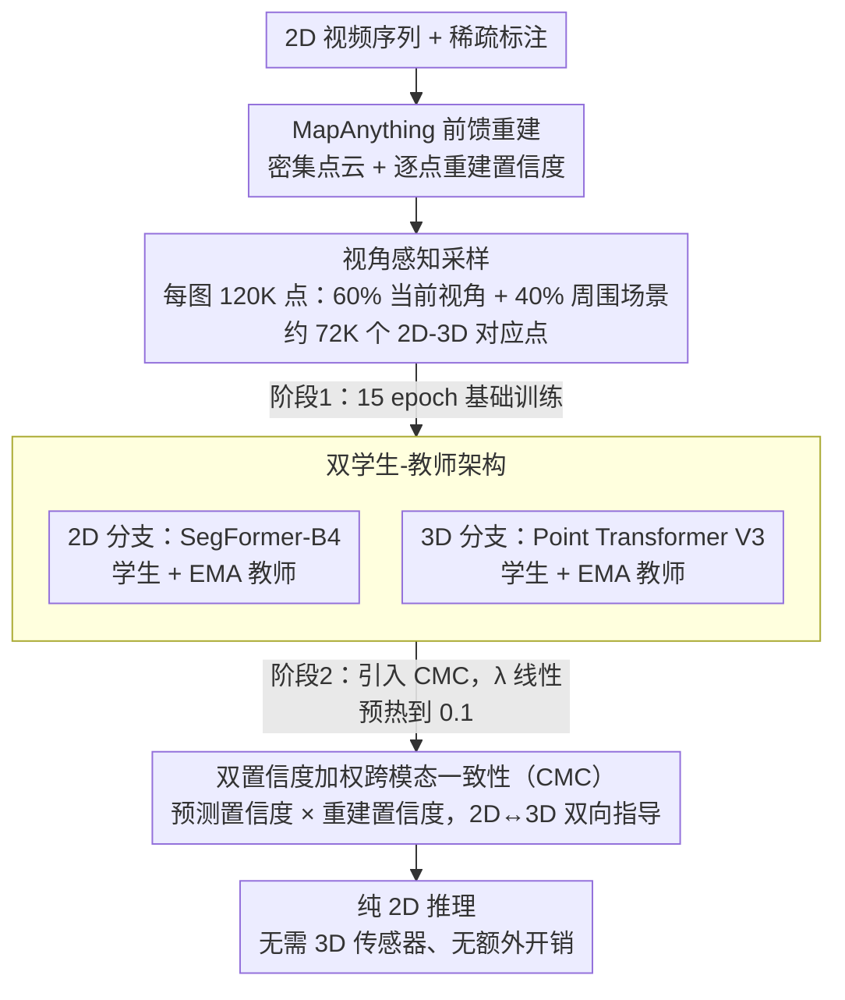

# Rewis3d: Reconstruction Improves Weakly-Supervised Semantic Segmentation

**会议**: CVPR 2026  
**arXiv**: [2603.06374](https://arxiv.org/abs/2603.06374)  
**代码**: 即将开源  
**领域**: 3D视觉 / 语义分割  
**关键词**: 弱监督分割, 3D重建, 跨模态一致性, 稀疏标注, Mean Teacher

## 一句话总结

提出 Rewis3d 框架，首次将前馈式 3D 场景重建作为辅助监督信号整合到弱监督语义分割中，通过双学生-教师架构和双置信度加权的跨模态一致性损失，在仅有稀疏标注的情况下将 mIoU 提升 2-7%，且推理时仅使用 2D 图像。

## 研究背景与动机

语义分割虽已取得显著进展，但严重依赖密集像素级标注——这种标注极其昂贵。弱监督语义分割（WSSS）通过利用点标注、涂鸦（scribble）或粗糙标签等稀疏标注来降低标注负担，但仍存在与全监督之间的性能差距。

**现有方法的关键局限**：
1. **纯 2D 方法的天花板**：SASFormer、TreeEnergy 等方法设计了专用架构和损失来在 2D 图像平面内传播标注信息，但难以在几何复杂的户外场景中充分弥补监督信号的不足
2. **未利用 3D 几何信息**：3D 结构天然提供跨视角一致性约束——当一个物体在某个视角被标注了涂鸦时，其 3D 结构可将标签传播到它出现的所有其他视角

**核心洞察**：近年前馈式 3D 重建（如 MapAnything）的突破使得从普通 2D 视频序列直接恢复高保真度 3D 点云成为可能，无需 LiDAR 等专用传感器。这启发了一种全新策略：**利用重建的 3D 几何作为辅助监督来增强 2D 弱监督分割**，同时保持纯 2D 推理管线。

## 方法详解

### 整体框架

Rewis3d 想用"重建出来的 3D 几何"给 2D 弱监督分割当辅助监督，但又不让 3D 拖累部署——推理时只跑 2D。预处理阶段先用 MapAnything 前馈重建出密集点云，再做**视角感知采样**为每张图配齐足够多的 2D-3D 对应点。随后由三块协同：2D 分割分支用 SegFormer-B4 + Mean Teacher，3D 分割分支用 Point Transformer V3 + Mean Teacher，再用跨模态一致性（CMC）让一个模态的教师去指导另一个模态的学生、双向传递知识。训练分两阶段：先做 15 个 epoch 的基础训练，各自把两个模态的学生-教师框架独立立起来；再进入 CMC 训练，引入跨模态一致性损失、用 5 个 epoch 线性预热到最大权重 $\lambda = 0.1$。关键是 3D 重建只当预处理，最终推理完全在 2D，既不需要 3D 传感器、也无额外推理开销。

### 关键设计

**1. 视角感知采样：为每张图配足够多的 2D-3D 对应点**

MapAnything 从 2D 视频序列单次前向就能重建出密集点云和逐点重建置信度，但全场景点云规模太大（200+ 图像→60M+ 点）没法直接处理。Rewis3d 为每张目标图像生成专属的 120K 点子采样，且刻意按比例混合——**60% 采样来自当前视角**（保证稠密的 2D-3D 对应，约 72K 对应点），**40% 来自周围场景**（提供上下文、维持 3D 分支的全局场景理解）。这一招很要紧：随机采样每张图只能得到约 140 个对应点，根本撑不起 CMC 损失的有效训练，视角感知采样把对应点数拉高了两个数量级。

**2. 双学生-教师架构：两个模态各自用 Mean Teacher 稳住伪标签**

2D 和 3D 分支各维护一套独立的 Mean Teacher 结构，教师权重由学生 EMA 更新

$$\boldsymbol{\theta}_t^{\text{teacher}} \leftarrow \alpha \boldsymbol{\theta}_{t-1}^{\text{teacher}} + (1-\alpha) \boldsymbol{\theta}_t^{\text{student}}, \quad \alpha = 0.99$$

每个分支既用标注区域的有监督交叉熵 $\mathcal{L}_S$、也用未标注区域的无监督一致性 $\mathcal{L}_U$（教师给伪标签），并做置信度过滤——只保留教师最大类概率超过阈值 $\tau$ 的像素。稳定的教师伪标签是后面跨模态传递不被噪声带歪的前提。

**3. 双置信度加权跨模态一致性：只让"高质量几何上的可靠预测"过线**

跨模态监督最怕把错的传过去，所以 CMC 的每个监督信号都过两道置信度。以 3D 教师指导 2D 学生为例

$$\mathcal{L}_C^{2D} = -\sum_j w_i \cdot \log(S_{2D}^{y_i}(I_j))$$

权重同时乘上预测置信度和重建置信度

$$w_i = \underbrace{\max(\text{softmax}(T_{3D}(p_i)))}_{\text{预测置信度}} \cdot \underbrace{c_i^{\text{rec}}}_{\text{重建置信度}}$$

前者来自 3D 教师的输出概率、后者来自 MapAnything 的逐点重建质量。两重过滤叠加，确保监督主要来自"在高质量重建几何上做出的可靠预测"。对称地，2D 教师也以同样方式指导 3D 学生（$\mathcal{L}_C^{3D}$）。

### 损失函数 / 训练策略

总损失把两个模态各自的有监督/无监督项和两条跨模态一致性项加在一起

$$\mathcal{L}_{\text{Total}} = \sum_{m \in \{2D, 3D\}} (\mathcal{L}_S^m + \mathcal{L}_U^m) + \lambda_{2D} \mathcal{L}_C^{2D} + \lambda_{3D} \mathcal{L}_C^{3D}$$

训练细节上，2D 分支 SegFormer-B4、学习率 $5 \times 10^{-5}$，3D 分支 Point Transformer V3、学习率 $10^{-3}$，优化器 AdamW、batch size 12、两块 H100；训练 50 epochs（NYUv2 为 250 epochs），CMC 权重 $\lambda = 0.1$ 线性预热；学生用更强增强（Cutout、Blur、AugMix / RandomRotation、RandomScale、RandomJitter），教师用弱增强。

## 实验关键数据

### 主实验：涂鸦标注下的语义分割

| 方法 | 3D 监督 | Backbone | Waymo mIoU | SS/FS% | KITTI-360 mIoU | SS/FS% | NYUv2 mIoU | SS/FS% |
|------|---------|----------|-----------|--------|---------------|--------|-----------|--------|
| Fully Supervised | — | SegFormer-B4 | 59.0 | — | 68.4 | — | 51.1 | — |
| EMA (基线) | — | SegFormer-B4 | 49.4 | 83.7 | 60.3 | 88.2 | 42.9 | 84.0 |
| SASFormer | — | SegFormer-B4 | 37.8 | 64.1 | 46.4 | 67.8 | 44.7 | 87.5 |
| TEL | — | DeepLabV3+ | 42.4 | 71.9 | 59.2 | 86.6 | 38.3 | 75.0 |
| **Ours (Real 3D)** | LiDAR/Depth | SegFormer-B4 | 51.8 | 87.8 | 61.7 | 90.2 | 44.7 | 87.6 |
| **Ours (Recon)** | 重建 | SegFormer-B4 | **53.3** | **90.3** | **63.4** | **93.4** | **46.1** | **90.2** |

### 消融实验（Waymo 数据集）

| 配置 | 置信度过滤 | 采样策略 | 3D 来源 | mIoU |
|------|-----------|---------|---------|------|
| EMA 基线 (仅 2D) | — | — | — | 49.4 |
| 无过滤 | ❌ | 视角感知 | 多视角重建 | 51.9 |
| + 预测置信度 | 预测 | 视角感知 | 多视角重建 | 52.7 |
| + 重建置信度 | 重建 | 视角感知 | 多视角重建 | 52.1 |
| + 双重置信度 (Ours) | 双重 | 视角感知 | 多视角重建 | **53.3** |
| 随机采样 | 双重 | 随机 | 多视角重建 | 51.9 |
| 单帧重建 | 双重 | 视角感知 | 单帧 | 52.1 |

### 跨标注类型泛化（Cityscapes）

| 方法 | 点标注 | 涂鸦 | 粗糙标签 |
|------|--------|------|---------|
| Fully Supervised | 77.6 | 77.6 | 77.6 |
| TEL | 53.1 | 64.4 | 64.9 |
| SASFormer | 42.7 | 55.6 | 42.8 |
| EMA (基线) | 50.5 | 61.2 | 66.5 |
| **Ours** | **56.5** (+6.0) | **68.1** (+6.9) | **68.6** (+2.1) |

### 关键发现

1. **重建 3D 优于真实 3D**：这一反直觉结果源于两个原因——重建点云通常比 LiDAR 更稠密完整，且双置信度过滤可抑制重建噪声（真实 LiDAR 缺乏重建置信度指标）
2. **视角感知采样至关重要**：相比随机采样（~140 对应点/图像），视角感知采样保证 ~72K 对应点，mIoU 提升 1.4%
3. **双置信度比单一置信度更优**：预测置信度和重建置信度捕获可靠性的互补方面
4. **多视角重建优于单帧重建**：多视角提供更丰富的几何上下文和更可靠的深度估计（+1.2 mIoU）
5. **方法跨标注类型通用**：在点、涂鸦、粗糙标签三种稀疏标注下均有显著提升，最大增益出现在标注最稀疏时
6. **监督差距大幅缩小**：在 KITTI-360 上填补了 93.4% 的弱监督到全监督差距

## 亮点与洞察

- **范式创新**：首次将前馈 3D 重建作为弱监督分割的辅助监督信号——不同于直接使用 LiDAR 或在 3D 上做分割，而是利用重建几何增强 2D 分割，推理保持纯 2D
- **反直觉发现**：重建的 3D（来自 2D 视频）反而优于真实的 LiDAR/深度 3D，因稠密性和可过滤性上的优势
- **跨模态设计精妙**：双学生-教师 + 双置信度机制确保跨模态知识传递的可靠性，不依赖单一模态的信心
- **通用框架**：不绑定特定分割架构（验证了 SegFormer 和 EoMT），不绑定特定标注类型（点/涂鸦/粗糙标签均有效），不绑定特定场景（室外/室内均有效）
- **实验覆盖全面**：4 个数据集（Waymo、KITTI-360、Cityscapes、NYUv2）、3 种标注类型、消融极为详尽

## 局限与展望

1. **动态场景重建噪声**：3D 重建模型（MapAnything）未针对动态内容优化，驾驶场景中移动物体引入几何噪声和深度不确定性
2. **重建计算开销**：虽然推理时无额外开销，但训练时的 3D 重建预处理（200+ 图像→60M+ 点云）计算量不小
3. **单帧场景受限**：Cityscapes 按单帧处理（无多视角视频），性能增益相对受限
4. **未集成动态感知重建**：整合显式处理动态场景的重建模型是明确的提升方向
5. **3D 分支的推理未被利用**：训练了完整的 3D 分支但推理只用 2D，3D 分支的潜在价值未完全挖掘

## 相关工作与启发

- **MapAnything / DUSt3R / VGGT**：前馈式多视角重建的最新进展，使从 2D 图像获取高质量 3D 几何成为可能——这是 Rewis3d 的基础设施
- **Mean Teacher**：Boettcher et al. (2024) 证明 Mean Teacher 在稀疏标注下仍具竞争力，Rewis3d 以此为基础加入 3D 几何监督
- **SASFormer / TEL**：当前 WSSS SOTA，但仅在 2D 平面内传播信息，无法利用几何一致性
- **2DPASS**：从 2D 向 3D 蒸馏知识用于 LiDAR 分割，与 Rewis3d 的方向相反（3D→2D）
- **启发**：跨模态一致性是强大的自监督信号，特别是当不同模态（2D 外观 vs 3D 几何）提供互补信息时

## 评分

| 维度 | 评分 |
|------|------|
| 创新性 | ⭐⭐⭐⭐⭐ |
| 理论深度 | ⭐⭐⭐⭐ |
| 实验充分性 | ⭐⭐⭐⭐⭐ |
| 实用价值 | ⭐⭐⭐⭐ |
| 写作质量 | ⭐⭐⭐⭐⭐ |
| 总体 | ⭐⭐⭐⭐⭐ |

<!-- RELATED:START -->

## 相关论文

- [\[CVPR 2026\] Learning 3D Reconstruction with Priors in Test Time](tco_learning_3d_reconstruction_with_priors_in_test_time.md)
- [\[CVPR 2026\] FF3R: Feedforward Feature 3D Reconstruction from Unconstrained Views](ff3r_feedforward_feature_3d_reconstruction_from_unconstrained_views.md)
- [\[CVPR 2026\] Speed3R: Sparse Feed-forward 3D Reconstruction Models](speed3r_sparse_feed-forward_3d_reconstruction_models.md)
- [\[CVPR 2026\] VGG-T3: Offline Feed-Forward 3D Reconstruction at Scale](vgg-t3_offline_feed-forward_3d_reconstruction_at_scale.md)
- [\[CVPR 2026\] tttLRM: Test-Time Training for Long Context and Autoregressive 3D Reconstruction](tttlrm_test-time_training_for_long_context_and_autoregressive_3d_reconstruction.md)

<!-- RELATED:END -->
