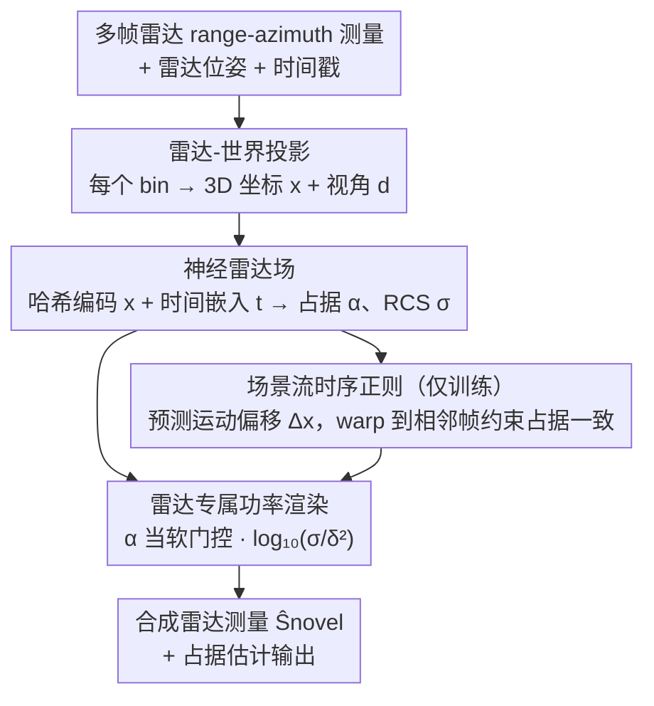

# RF4D: Neural Radar Fields for Novel View Synthesis in Outdoor Dynamic Scenes

**会议**: CVPR 2026  
**论文**: [CVF Open Access](https://openaccess.thecvf.com/content/CVPR2026/html/Zhang_RF4DNeural_Radar_Fields_for_Novel_View_Synthesis_in_Outdoor_Dynamic_CVPR_2026_paper.html)  
**代码**: https://zhan0618.github.io/RF4D  
**领域**: 3D视觉 / 神经场 / 自动驾驶感知  
**关键词**: 雷达神经场, 新视角合成, 动态场景, 场景流, 占据估计

## 一句话总结
RF4D 把毫米波雷达接入神经场，用「时空雷达场 + 场景流时序正则 + 符合雷达物理的功率渲染」首次实现室外动态场景下的雷达新视角合成，在两个公开雷达数据集上的合成与占据估计精度大幅超越 Radar Fields。

## 研究背景与动机

**领域现状**：神经场（NeRF 系）在场景重建与新视角合成（NVS）上很成功，但主流输入是 RGB 或 LiDAR。雷达 NVS 一直被冷落——尽管毫米波雷达在自动驾驶里用得极广，且有抗恶劣天气、抗弱光、远距离、低成本等独特优势。

**现有痛点**：① RGB/LiDAR 神经场在雨雪雾等恶劣天气下鲁棒性差；② 传统雷达重建多靠射线追踪 / 射频传播建模，强依赖雷达硬件参数与波形配置，泛化差，且基本只能处理静态场景；③ 现有把神经场搬到雷达的工作（如 Radar Fields）**只支持静态场景**——遇到动态环境会失败（移动车辆直接「消失」），而且作者发现它存在一个根本性的**占据-反射率矛盾**：预测占据高的区域反而反射率被压低，这违背物理直觉（被占据区域应产生更强反射）；它还得依赖外部占据估计器来做监督，引入额外依赖。

**核心矛盾**：室外驾驶场景频繁有动态物体，时空建模是时序一致 NVS 的关键；而现有雷达神经场既没建模时间维（处理不了运动），又在「占据」与「反射」之间建了个物理上自相矛盾的解耦渲染，导致动态目标丢失、信号嘈杂。

**本文目标**：做一个面向室外动态场景的雷达神经场，既能稳定重建运动目标，又让占据与反射率的关系符合雷达物理，还要摆脱对外部占据监督的依赖。

**切入角度**：作者把场景表示成「位置 + 时间」的时空神经场，在每个空间点预测两个雷达专属量——占据 $\alpha$（是否被占据）和雷达截面积 RCS $\sigma$（占据区的反射强度）；再从雷达成像物理出发设计渲染公式，让占据直接作为「门控」去激活反射，从物理层面消解矛盾。

**核心 idea**：用时空神经场显式建时间维、用场景流模块预测帧间运动偏移做时序正则，并用一条「占据当软门控、RCS 当反射强度」的雷达功率渲染替换 Radar Fields 的解耦渲染，从而在动态、恶劣天气下都能合成出物理一致的雷达测量。

## 方法详解

### 整体框架
给定一个 3D 查询点 $x$、时间 $t$ 和视角方向 $d$，RF4D 先把雷达 range-azimuth 测量投影到世界坐标，再用神经雷达场预测该点的占据 $\alpha$ 和 RCS $\sigma$；两者经雷达专属功率渲染合成接收功率 $\hat{P}_r$，用真值雷达测量监督。训练时额外接一个场景流模块：它从同一隐特征预测前/后帧的运动偏移，把点 warp 到相邻帧再算占据，用时序正则逼它们一致，从而让动态目标的占据稳定连贯。整条管线无需外部占据标签——占据完全从雷达测量里自监督学出来。

### 关键设计

**1. 时空神经雷达场：把时间维显式编码进神经场，分离占据与反射两个物理量**

要重建会动的场景，神经场必须「知道现在是什么时刻」。RF4D 用多分辨率哈希网格 $H$ 编码位置 $x$、用可学习嵌入网络 $T$ 编码时间戳 $t$，拼接后过 MLP $f_\chi$ 得到时空隐特征 $\chi=f_\chi(H(x),T(t))$。隐特征分两路出物理量：占据走 MLP $f_\alpha$ 并在输出端用 **Gumbel-Sigmoid** 激活，把 $\alpha$ 逼成近二值的软掩码（0=空、1=占据），对齐物理上「占据是 0/1」的语义；RCS 因为还取决于雷达波入射角，所以把 $\chi$ 与球谐编码后的方向 $S(d)$ 拼接再过 $f_\sigma$ 得到 $\sigma=f_\sigma(\chi,S(d))$。把占据和 RCS 显式拆成两个量，是后面功率渲染能「占据门控反射」的前提。

**2. 场景流时序正则：预测帧间运动偏移、warp 后约束占据一致，稳住动态目标**

静态雷达场遇到移动车辆会让它「消失」，根因是没有跨帧的运动约束。RF4D 从同一隐特征 $\chi$ 用 MLP $f_{\Delta x}$ 预测一个 6 维运动偏移 $\Delta x$：前 3 维是到上一帧的偏移 $\Delta x_-$、后 3 维是到下一帧的偏移 $\Delta x_+$。把点分别 warp 到相邻帧位置，再过 $f_\chi$、$f_\alpha$ 得到相邻帧占据 $\alpha_{t-\Delta t}=f_\alpha(f_\chi(H(x+\Delta x_-),T(t-\Delta t)))$、$\alpha_{t+\Delta t}$（同理）。训练时用 $\mathcal{L}_{oc}=\frac{1}{N}\sum_{\delta,\theta}\big[(\hat{\alpha}-\hat{\alpha}^{t-\Delta t})^2+(\hat{\alpha}-\hat{\alpha}^{t+\Delta t})^2\big]$ 逼这三处占据一致。这让模型对运动物体也能给出稳定连贯的占据，正是动态场景重建成功的关键。

**3. 雷达专属功率渲染：用占据当软门控激活 RCS，消解占据-反射率矛盾并去掉外部监督**

NeRF 的光学体渲染不能直接搬到雷达。由雷达物理 $P_r=\frac{P_t G^2 \sigma}{(4\pi)^3 \delta^2}$ 出发，固定的发射功率/天线增益等常数项可省略，并取 base-10 对数对齐雷达数据常用的分贝尺度。与 Radar Fields「把占据和反射率解耦」不同，RF4D 把占据 $\alpha$ 当成**软门控掩码**——只有当某点被预测为物理存在时才激活雷达响应，于是渲染功率为 $\hat{P}_r=\alpha\cdot\log_{10}(\sigma/\delta^2)$。这一步同时做成三件事：① 高占据天然对应强反射，从公式层面消解了占据-反射率矛盾；② 门控机制压住噪声、削弱多径干扰；③ 占据从雷达测量重建损失里自监督学出，**不再需要外部占据估计器**。

### 损失函数 / 训练策略
总损失含四项：雷达功率重建（对采样的 range-azimuth bin 做 MSE）$\mathcal{L}_{rt}=\frac{1}{N}\sum_{\delta,\theta}\big(\hat{\alpha}\log_{10}(\hat{\sigma}/\delta^2)-P_{GT}\big)^2$；时序占据一致 $\mathcal{L}_{oc}$（见设计 2）；占据稀疏正则 $\mathcal{L}_p=\frac{1}{N}\sum\hat{\alpha}$（防止处处 $\alpha\approx1$ 的退化解）；运动偏移幅度正则 $\mathcal{L}_m=\frac{1}{N}\sum(\|\Delta x_-\|^2+\|\Delta x_+\|^2)$（防不合理位移）。合为 $\mathcal{L}_{total}=\mathcal{L}_{rt}+\lambda_{oc}\mathcal{L}_{oc}+\lambda_p\mathcal{L}_p+\lambda_m\mathcal{L}_m$。实现用 PyTorch + tiny-cuda-nn，单张 RTX A5000，每个场景独立训练 15000 次迭代，每次随机采 4 帧雷达扫描再随机选 bin 监督。

## 实验关键数据

> 指标说明：**PSNR / SSIM** 评雷达测量合成质量（越高越好，SSIM 更敏感于结构/边界）；**CD**（Chamfer Distance）/ **RCD**（Relative Chamfer Distance）评占据估计——把预测的 BEV 点云与 LiDAR 参考比较，越低越好。占据真值用同步 LiDAR 点云标定构造。

### 主实验

Oxford Radar RobotCar（含动态车辆，4 个场景平均看趋势）：

| 方法 | Scene1 SSIM↑ | Scene1 CD↓ | Scene3 SSIM↑ | Scene3 CD↓ |
|------|--------------|------------|--------------|------------|
| D-NeRF | 0.1270 | 80.97 | 0.1620 | 23.84 |
| Hexplane | 0.2674 | 78.99 | 0.3909 | 119.01 |
| Radar Fields | 0.3372 | 18.19 | 0.3498 | 9.54 |
| **RF4D（本文）** | **0.6103** | **7.34** | **0.6258** | **3.29** |

Boreas（含 sun/snow/rain/static，覆盖恶劣天气）：

| 方法 | Sun PSNR↑ | Sun SSIM↑ | Rain PSNR↑ | Rain SSIM↑ | Static SSIM↑ |
|------|-----------|-----------|------------|------------|--------------|
| Radar Fields | 25.39 | 0.3641 | 25.80 | 0.3905 | 0.4331 |
| **RF4D（本文）** | **26.65** | **0.7001** | **26.21** | **0.6635** | **0.7724** |

最醒目的是 SSIM 几乎翻倍（Scene1 0.337→0.610、Sun 0.364→0.700），说明结构/动态目标边界的保真度大幅提升；CD 也成倍下降（Scene1 18.19→7.34），占据几何更准。Radar Fields 在动态场景会丢移动车辆，RF4D 能把它们渲染出来。

### 消融实验

RobotCar 上逐项加正则（Scene1 / Scene3）：

| $\mathcal{L}_p$ | $\mathcal{L}_{oc}$ | $\mathcal{L}_m$ | S1 PSNR↑ | S1 SSIM↑ | S1 CD↓ | S3 CD↓ |
|:---:|:---:|:---:|---------|----------|--------|--------|
| | | | 21.90 | 0.3184 | 80.97 | 23.84 |
| ✓ | | | 23.23 | 0.5662 | 9.23 | 6.51 |
| ✓ | ✓ | | 22.99 | 0.6167 | 7.57 | 5.10 |
| ✓ | ✓ | ✓ | 23.38 | 0.6103 | 7.34 | 3.29 |

占据估计对比（CD↓ / RCD↓，RobotCar Scene1 与 Boreas Sun）：

| 方法 | S1 CD↓ | S1 RCD↓ | Sun CD↓ | Sun RCD↓ |
|------|--------|---------|---------|----------|
| CFAR | 19.53 | 0.0276 | 8.76 | 0.0214 |
| Bayesian filtering | 13.28 | 0.0179 | 6.07 | 0.0150 |
| **RF4D（本文）** | **7.34** | 0.0190 | **5.45** | **0.0033** |

### 关键发现
- **稀疏正则 $\mathcal{L}_p$ 贡献最大**：单加它就把 SSIM 从 0.318 提到 0.566、CD 从 80.97 砍到 9.23——它压住了「处处占据」的退化解，是渲染质量的地基。
- **时序一致 $\mathcal{L}_{oc}$ 提结构、运动正则 $\mathcal{L}_m$ 提几何**：加 $\mathcal{L}_{oc}$ 后 SSIM 继续涨到 0.617；再加 $\mathcal{L}_m$ 把 Scene3 的 CD 从 5.10 进一步压到 3.29，说明约束运动幅度让动态几何更准。
- **占据估计零 LiDAR 监督也超传统法**：RF4D 只用雷达测量自监督，CD/RCD 仍普遍优于需调参的 CFAR 与 Bayesian filtering，且在恶劣天气（Boreas Sun RCD 0.0033）优势明显。

## 亮点与洞察
- **指出并修复了 Radar Fields 的「占据-反射率矛盾」**：把占据当软门控直接乘进功率渲染（$\hat{P}_r=\alpha\log_{10}(\sigma/\delta^2)$），一步同时拿到物理一致性、抗噪和「免外部占据监督」三个好处，是全文最优雅的设计。
- **首次用神经场做雷达动态场景 NVS**：场景流 + 时间嵌入这套时空建模把「移动车辆消失」这个动态雷达的老大难治住了，填补了 RGB/LiDAR 之外的模态空白。
- **可迁移性**：「占据软门控 × 物理前向模型」的思路可推广到其他主动传感（声呐、ToF）的神经场渲染；用 LiDAR 构造几何参考来评雷达占据的做法，也是缺标注模态评测的实用范式。

## 局限与展望
- 每个场景需独立训练 15000 次迭代（per-scene 优化），**不具备跨场景泛化/实时性** ⚠️，离在线自动驾驶部署还有距离。
- 占据真值依赖同步 LiDAR 构造，雪天因 LiDAR 几何不可靠而**无法报告 CD/RCD**，恶劣天气下占据精度的评测仍有盲区。
- RCS 用球谐编码视角方向，对强多径、金属强反射等复杂电磁现象的建模仍较简化；论文也未与显式建模多径噪声的 RadarSplat 类方法正面比较（作者称方向正交）。
- 多个损失权重 $\lambda_{oc},\lambda_p,\lambda_m$ 的敏感性未充分给出，调参成本对实践者是个未知数。

## 相关工作与启发
- **vs Radar Fields**：同为雷达神经场，但 Radar Fields 只支持静态、解耦占据与反射率（导致物理矛盾）、且依赖外部占据估计器；RF4D 显式建时间维 + 场景流处理动态，用占据门控渲染消矛盾并自监督占据，动态与恶劣天气下 SSIM/CD 大幅领先。
- **vs 传统雷达仿真（射线追踪 / RF 传播 / RadSimReal）**：传统法强依赖硬件参数与波形、泛化差且多限静态；RF4D 是数据驱动的隐式表示，不需详细硬件建模。
- **vs RGB 动态神经场（D-NeRF / Hexplane）**：这类方法面向光学体渲染，直接用在雷达上 SSIM/CD 都远差（D-NeRF SSIM 仅 0.12）；RF4D 表明动态雷达 NVS 必须换成贴合雷达物理的功率渲染才work。

## 评分
- 新颖性: ⭐⭐⭐⭐⭐ 首个雷达动态场景神经场 NVS，并精准修复了前作的占据-反射率物理矛盾。
- 实验充分度: ⭐⭐⭐⭐ 两数据集、含恶劣天气、合成与占据双任务、逐项消融；但缺跨场景泛化与权重敏感性分析。
- 写作质量: ⭐⭐⭐⭐⭐ 从雷达物理一路推到渲染公式，矛盾诊断与图示都很清楚。
- 价值: ⭐⭐⭐⭐ 对全天候自动驾驶仿真/重建有实在意义，但 per-scene 训练限制了即时落地。

<!-- RELATED:START -->

## 相关论文

- [\[CVPR 2026\] Dynamic-Static Decomposition for Novel View Synthesis of Dynamic Scenes with Spiking Neurons](dynamic-static_decomposition_for_novel_view_synthesis_of_dynamic_scenes_with_spi.md)
- [\[CVPR 2026\] From None to All: Self-Supervised 3D Reconstruction via Novel View Synthesis](from_none_to_all_self-supervised_3d_reconstruction_via_novel_view_synthesis.md)
- [\[CVPR 2026\] GeodesicNVS: Probability Density Geodesic Flow Matching for Novel View Synthesis](geodesicnvs_probability_density_geodesic_flow_matching_for_novel_view_synthesis.md)
- [\[CVPR 2026\] SmokeSVD: Smoke Reconstruction from A Single View via Progressive Novel View Synthesis and Refinement with Diffusion Models](smokesvd_smoke_reconstruction_from_a_single_view_via_progressive_novel_view_synt.md)
- [\[CVPR 2026\] WildRayZer: Self-supervised Large View Synthesis in Dynamic Environments](wildrayzer_self-supervised_large_view_synthesis_in_dynamic_environments.md)

<!-- RELATED:END -->
