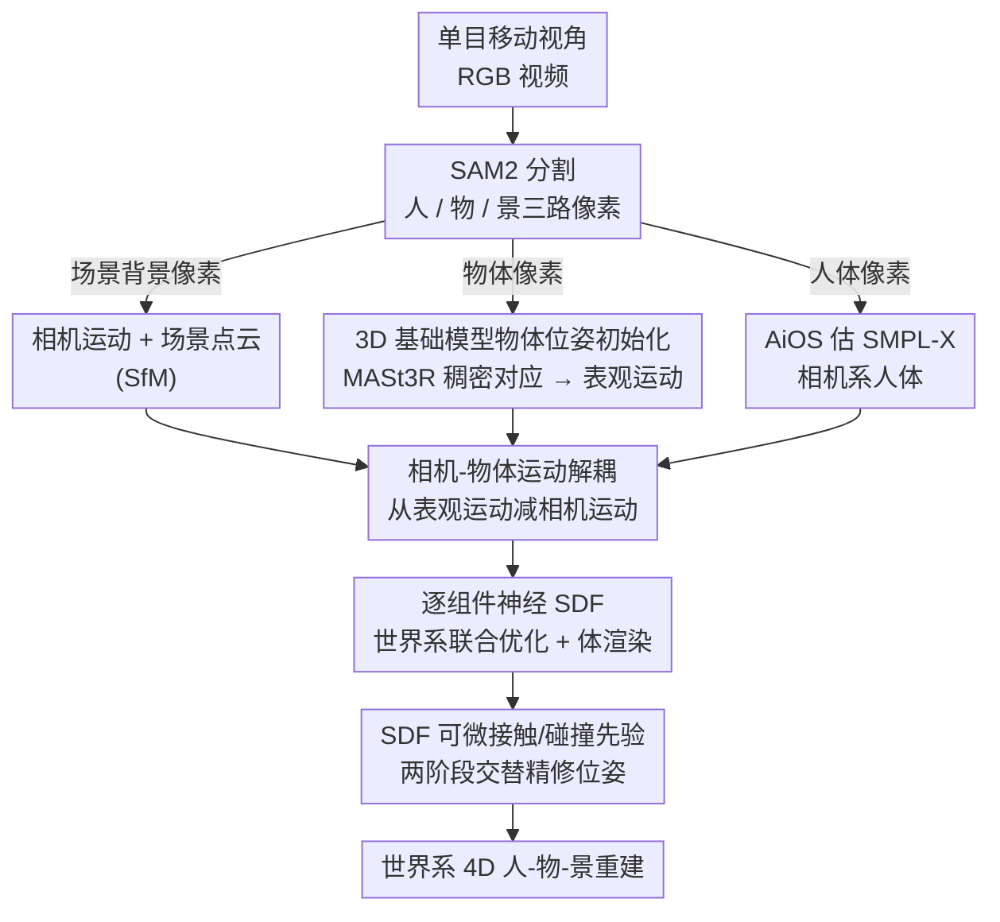

# RHINO: Reconstructing Human Interactions with Novel Objects from Monocular Videos

**会议**: CVPR 2026  
**arXiv**: [2605.17014](https://arxiv.org/abs/2605.17014)  
**代码**: https://lxxue.github.io/RHINO (有)  
**领域**: 3D视觉  
**关键词**: 人-物交互重建, 单目视频, 神经SDF, 相机-物体运动解耦, 接触先验

## 一句话总结
从一段移动视角的单目 RGB 视频里，在同一个世界坐标系下把"人 + 被操纵的未知物体 + 静态场景"全部重建成 4D 几何——靠 3D 基础模型稳住低纹理物体的运动估计、靠相机运动减法把物体真实运动从"表观运动"里抠出来、再用逐组件神经 SDF 联合优化并施加可微接触先验，在新视角合成和 4D 重建上都超过现有最强基线。

## 研究背景与动机
**领域现状**：从单目 RGB 视频做 3D 重建是智能系统的长期目标。但现有工作几乎都是"分而治之"：要么只重建无人的静态场景，要么只重建孤立的人体，少数能在世界坐标系下联合重建"人 + 场景"（如 SotA 方法 HSR）。

**现有痛点**：一旦人手里拿着东西操纵它，这些方法就崩。HSR 能把静态场景和走动的人重建得很好，但人推动桌子时桌子的重建直接退化成一团乱（论文 Fig. 2）。另一类手-物重建方法（HOLD）只在相机坐标系里做手和物体，不涉及全身、不涉及场景；HOI 重建方法（InterTrack 等）则往往依赖已知物体模板、或只输出稀疏点云、或对训练集外的新物体泛化很差。更普遍地，很多方法假设已知物体/场景形状或已标定相机，落地不现实。

**核心矛盾**：移动相机带来一个根本性的纠缠——"表观运动"（apparent motion）把相机运动和物体运动揉在了一起，无法直接分离；同时日常物体常常低纹理、对称、在画面里只占一小块，传统稀疏关键点（SuperPoint）和稠密匹配（LoFTR）都给不出稳定一致的对应，导致基于特征的 SfM 失效。

**本文目标**：在统一世界坐标系下，从单个移动视角的单目 RGB 视频，同时恢复人体、未知（unseen）被操纵物体、静态场景三者的细节 3D 形状与外观，且不需要预扫描物体模板、不需要标定相机。

**切入角度**：作者的两个关键观察——(1) 近期 3D 感知基础模型（MASt3R）把对应当作 3D 点图回归而非 2D 图像匹配，在低纹理区域反而格外鲁棒，可以撑起物体的 SfM；(2) 神经 SDF 不只编码几何，它给出的是连续可微的"到物体表面的有符号距离"，天然就是推理接触的理想信号。

**核心 idea**："先解耦再联合"——先用 3D 基础模型 + 相机运动减法把人/物/景对齐进一个世界坐标系，再用逐组件神经 SDF 联合优化恢复细节，并复用同一套 SDF 距离构造可微接触损失把手"吸"到物体表面、同时惩罚穿模。

## 方法详解

### 整体框架
RHINO 是一个三阶段框架。输入是单段移动视角的单目 RGB 视频（一个人在操纵一个刚性物体），输出是世界坐标系下人体、物体、场景三者的细节 4D 几何 + 外观。整体逻辑是：**第一阶段**用现成模型在各自坐标系下拿到粗初始化（场景点云 + 相机运动、物体表观运动、相机系人体）；**第二阶段**把这三者对齐进同一个世界坐标系，核心是把相机运动从物体表观运动里"减掉"得到真实物体运动；**第三阶段**用逐组件神经 SDF + 外观场做联合体渲染优化恢复细节，并在最后用 SDF 距离构造的接触/碰撞损失做两阶段交替精修，提升物理合理性。

在世界坐标系（而非各自相机系）里做联合优化是关键：它把所有帧、所有组件放在同一空间里多帧约束，从而缓解逐帧初始化的误差。

### 关键设计

**1. 3D 基础模型驱动的物体位姿初始化：用点图对应救活低纹理物体的 SfM**

物体重建的第一道坎是它在全身视频里往往低纹理、对称、还被遮挡、只占画面一小块，传统稀疏关键点（SuperPoint）会因为关键点不可重复检测而失败，无关键点的稠密匹配（LoFTR）又在帧间不一致。作者不去改 SfM 本身，而是换掉它的对应来源：用 MASt3R 在相邻帧的物体像素上建立稠密对应。MASt3R 把对应建模成基于点图（pointmap）回归的 3D 任务，而不是图像空间里的 2D 问题，因此在低纹理区域得到的对应更准更稳。基于这些可靠匹配做三角化，就得到一条"假设物体静止"时的合成相机轨迹 $\mathbf{C}_{\text{obj}}$。消融里这一替换直接体现为物体位姿质量的代差：在 SP+SG、LoFTR、本文三者对比中，物体重建 CD 从 4.25 / 3.97 cm 降到 1.09 cm，F1 从 60 / 63% 升到 91.4%。

**2. 相机-物体运动解耦：把相机运动从表观运动里"减掉"才能拿到真实物体运动**

移动相机让物体的"表观运动"同时包含相机运动和物体自身运动，二者纠缠。作者先在静态背景像素上做 SfM 得到真实相机轨迹 $\mathbf{C}_{\text{scn}}$，再把上一步得到的物体轨迹 $\mathbf{C}_{\text{obj}}$（表观）对齐过来。世界系物体位姿序列 $\mathbf{P}_{\text{obj}}$ 满足 $\mathbf{T}\cdot\mathbf{S}\cdot\mathbf{C}_{\text{obj}}=\mathbf{C}_{\text{scn}}\cdot\mathbf{P}_{\text{obj}}$，其中 $\mathbf{S}$ 是尺度、$\mathbf{T}=[\mathbf{R},\mathbf{t};\mathbf{0},1]$ 是刚性变换。关键技巧是用 RANSAC 找出"物体静止帧"$i'$（此时 $\mathbf{P}_{\text{obj}}^{i'}=I$），方程退化成 $\mathbf{T}\cdot\mathbf{S}\cdot\mathbf{C}_{\text{obj}}=\mathbf{C}_{\text{scn}}$，于是能用 Umeyama 最小二乘求出尺度/旋转/平移：

$$\min_{\mathbf{s},\mathbf{R},\mathbf{t}}\sum_{i'=1}^{n}\|\mathbf{s}\mathbf{R}\mathbf{c}_{\text{obj}}^{i}+\mathbf{t}-\mathbf{c}_{\text{scn}}^{i}\|^{2}$$

求得对齐后，世界系物体位姿即 $\mathbf{P}_{\text{obj}}=\mathbf{C}_{\text{scn}}^{-1}\cdot\mathbf{T}\cdot\mathbf{S}\cdot\mathbf{C}_{\text{obj}}$——本质就是先 Procrustes 把 $\mathbf{C}_{\text{obj}}$ morph 到真实尺度坐标，再把真实相机运动 $\mathbf{C}_{\text{scn}}$ 除掉，剩下的就是纯物体运动。人体同理：把相机系下弱透视假设的 SMPL-X 轨迹，靠 2D 投影约束 + 在场景点云上 RANSAC 估出的地面接触约束，恢复到世界系透视相机下。这一步是整个世界系重建的命门：消融里去掉运动解耦（w/o MD），CD 从 2.65 暴涨到 10.21 cm、F1 从 56% 崩到 26%。

**3. 逐组件神经 SDF 的组合式联合优化：在世界系里多帧约束、各自规范空间建模**

初始化只是粗形状，细节靠组合式神经场恢复。人体 $H$、物体 $O$、场景 $S$ 各有一个神经 SDF $f_{\text{sdf}}^{(\cdot)}$，把 3D 点映射到有符号距离 $\xi^{(\cdot)}$ 和几何特征 $\mathbf{z}^{(\cdot)}$；其中人体场额外以身体关节 $\boldsymbol{\theta}_b$（不含全局朝向/平移）为条件以捕捉衣物褶皱等姿态相关形变。各组件还配一个外观场 $f_{\text{rgb}}^{(\cdot)}$ 输出 RGB，且都以形状特征 $\mathbf{z}$ 和法向 $\mathbf{n}$（由 SDF 梯度算出）为条件以解耦形状与外观；物体/场景外观还引入逐帧隐码以捕捉阴影高光。人体场在规范空间建模、用逆 LBS 与世界系互映（$\mathbf{x}^H=LBS^{-1}(\mathbf{x}'^{H},\boldsymbol{\theta})$），物体则直接用位姿映射（$\mathbf{x}^O=\mathbf{P}_{obj}^{-1}\mathbf{x}'^{O}$）。渲染时对每条相机射线在三组件包围盒内各采 $N$ 点、按到相机距离排序做组合式体渲染 $C(r)=\sum_{i=1}^{3N}\tau_i\mathbf{c}^{(\cdot)}(\mathbf{x}^i)$，自然处理组件间遮挡。训练用逐像素 RGB 损失 + mask/深度/法向辅助损失，在所有帧上全局优化。针对近距离 HOI 的严重互遮挡，作者还在 SMPL-X 体内采点（负 SDF）、体外采点（正 SDF）做约束，并用一个由 SMPL-X 网格引导的手部专属 SDF 损失防止手几何糊成一团。

**4. SDF 可微接触先验 + 两阶段交替精修：让手真正贴上物体而不穿模**

像素对齐好不代表 3D 里彼此对齐——深度歧义会让手悬在物体上方或扎进物体内部。作者复用物体的神经 SDF 把这件事变成可微：对每个身体接触点 $x_c$，定义 $\xi^{O}_{x_c}=f_{sdf}^{O}(x_c)$ 作为它到物体表面的有符号距离，据此构造接触/碰撞损失

$$\mathcal{L}_{\text{contact}}=\alpha_1\tanh(\xi^{O}_{x_c}/\alpha_2)^2\ \ (\xi^{O}_{x_c}\!\geq\!0),\qquad \mathcal{L}_{\text{collision}}=\beta_1\tanh(\xi^{O}_{x_c}/\beta_2)^2\ \ (\xi^{O}_{x_c}\!<\!0)$$

即点在体外（$\xi\geq0$）就被吸向表面、点在体内（$\xi<0$）就被推出表面。接触点本身由图像级 InteractVLM 估计，但它有误检和时序抖动；作者用一个巧妙的物理线索过滤：物体只有被操纵时才会动，所以"有物体运动的帧"才标为接触帧，从而压掉无交互帧上的假阳性，再加时序滤波。最后是两阶段交替策略：一开始就上物理损失会因穿模破坏物体形状，所以**第一阶段**只用 RGB/mask/形状损失优化一切；**第二阶段**冻结形状网络和外观网络、只优化人体与物体位姿、并加入物理损失；两阶段在整个优化中交替进行，使物理损失只修位姿、不腐蚀物体形状。消融显示它把穿透深度 PD 几乎减半（1.088→0.477 cm）、接触召回率近乎三倍（18.4%→63.6%）。

### 损失函数 / 训练策略
- **第一阶段（形状/外观学习）**：逐像素 RGB 损失 + mask/深度/法向辅助损失 + SMPL-X 体内外 SDF 约束 + 手部专属 SDF 损失，在世界系全帧全局优化。
- **第二阶段（物理精修）**：冻结所有形状/外观网络，仅优化人/物位姿，加入接触损失 $\mathcal{L}_{\text{contact}}$ 与碰撞损失 $\mathcal{L}_{\text{collision}}$。
- 两阶段交替执行，避免物理损失破坏物体几何。

## 实验关键数据

### 主实验
评测数据集 **BenchRHINO**：手持移动相机在含 106 台同步相机（53 RGB + 53 IR，12MP@30FPS）的体素 4D 采集棚里拍摄，7 个序列、4 个被试操纵 6 个物体，提供 4D HOI 几何与相机运动真值；另有 WildRHINO（5 序列、室内自然场景）做定性评测。形状用 Chamfer(CD)/Hausdorff(HD)/F1@2cm 评测（基线在相机系，先 ICP 对齐到真值），新视角合成用 PSNR/SSIM/LPIPS。

**形状重建（Table 1，CD / HD / F1，列 H=人 O=物 S=景）**：

| 方法 | 重建 H/O/S | CD-H ↓ | CD-O ↓ | F1-H ↑ | F1-O ↑ |
|------|-----------|--------|--------|--------|--------|
| HSR | H, S | 2.69 | — | 55.17 | — |
| HOLD | O | — | 4.41 | — | 33.64 |
| InterTrack | H, O | 4.66 | 11.16 | 29.41 | 16.81 |
| **RHINO** | **H, O, S** | **2.65** | **1.21** | **56.16** | **90.42** |

RHINO 是唯一同时重建人/物/景的方法；物体重建 CD 1.21 cm、F1 90.42%，把只做物体的 HOLD（4.41 cm / 33.64%）和做 HOI 的 InterTrack（11.16 cm / 16.81%）甩开一大截。

**新视角合成（Table 2，BenchRHINO 全序列）**：

| 方法 | PSNR ↑ | SSIM ↑ | LPIPS ↓ |
|------|--------|--------|---------|
| HSR | 22.65 | 0.791 | 0.246 |
| HOLD | 17.92 | 0.646 | 0.513 |
| **RHINO** | **25.80** | **0.832** | **0.212** |

### 消融实验
| 配置 | 关键指标 | 说明 |
|------|---------|------|
| 物体位姿：SP+SG | CD 4.25 / HD 25.43 / F1 60.06 | 大块无纹理物体上关键点不可重复，退化 |
| 物体位姿：LoFTR | CD 3.97 / HD 20.19 / F1 62.80 | 复杂运动下对应不够准 |
| 物体位姿：**RHINO(MASt3R)** | **CD 1.09 / HD 10.94 / F1 91.38** | 3D 点图对应，鲁棒准确 |
| w/o MD（无运动解耦） | CD 10.21 / F1 26.32 / PSNR 22.89 | 直接用表观运动，世界系重建崩溃 |
| **完整 RHINO** | **CD 2.65 / F1 56.16 / PSNR 25.80** | — |
| w/o Contact Opt（无接触精修） | PD 1.088 / Recall 18.39 / F1 20.84 | 手悬空或穿模 |
| **完整 RHINO** | **PD 0.477 / Recall 63.57 / F1 36.57** | 穿透深度减半、召回近三倍 |

> 自定义/关键指标说明：**PD（penetration depth, 穿透深度，cm)** 衡量手等部位扎进物体内部的深度，越低越物理合理；**接触 Precision/Recall/F1** 以真值接触为参照评测预测接触点的准确率/召回率。

### 关键发现
- **运动解耦（MD）是最关键的一环**：去掉它 CD 直接从 2.65 飙到 10.21 cm，因为相机运动没减掉，物体在世界系里的位置就全错了——这是"移动相机单目"这个设定下绕不过去的核心难点。
- **物体位姿初始化的质量决定上限**：把 MASt3R 换成传统特征匹配，物体重建 F1 从 91% 掉到 60% 量级；甚至给 HOLD 喂上 RHINO 的物体位姿（HOLD*），其物体形状就显著变好，说明瓶颈确实在位姿而非形状网络。
- **接触精修主要改物理合理性而非纯几何**：它把穿透深度减半、接触召回从 18% 提到 64%，让手"真正贴上"物体，这是新视角下肉眼可见的差异（论文 Fig. 8 红圈）。
- **基线的失败模式很统一**：HOLD 物体位姿噪声大就崩、且不建模交互；InterTrack 对训练分布外的新物体泛化差、且只出稀疏点云；HSR 干脆处理不了动态物体。

## 亮点与洞察
- **"减法"思路解纠缠**：把相机运动从表观运动里减掉这一步，配合"RANSAC 找静止帧 → 退化方程 → Umeyama 闭式解"，用一套经典几何工具干净地解决了移动单目最棘手的运动纠缠，没有引入额外学习负担。
- **一物两用的神经 SDF**：同一个 SDF 既当几何表示又当接触距离场，省掉了显式接触检测，把"手该不该贴着物体"变成可微优化目标，这个 repurpose 很优雅、可直接迁移到任何带 SDF 的多组件重建。
- **用物体运动给接触检测去噪**：把"物体在动的帧才可能有接触"作为先验来压 InteractVLM 的假阳性，是一个几乎零成本但非常 specific 的工程洞察。
- **两阶段交替防止物理损失反噬形状**：先学形状再只修位姿、交替进行，避免了"上来就加接触损失把物体形状压扁"的常见坑，值得在所有"先重建后施加物理约束"的 pipeline 里借鉴。
- **配套的 BenchRHINO 数据集**：首个移动视角 + 全身 HOI + 4D 真值的基准（用 AprilTag + SAM2 mask loss 标定 iPhone 相机轨迹），填补了"现有 HOI 数据集都是静态相机"的空白。

## 局限性 / 可改进方向
- **只支持单人单刚体**：多人或多物体的复杂场景目前处理不了（作者明确承认）。
- **假设物体刚性**：非刚性/铰接物体（如可开合的箱子）不在能力范围内，是重要的未来方向。
- **优化慢**：当前是逐场景优化，速度慢，AR/VR 和机器人应用需要的快速 4D 捕获还做不到。
- **依赖良好的物体可见度**：在稀疏观测/物体覆盖差时性能下降，鲁棒性还有提升空间。
- **强依赖多个现成模型**（SAM2 / MASt3R / AiOS / Sapiens / InteractVLM），任一环节失败会向下游传播；且评测仅 7 个标注序列，规模偏小。

## 相关工作与启发
- **vs HSR**：HSR 在世界系联合重建人 + 静态场景，是本文最近的 SotA，但完全无法处理被操纵的动态物体（推桌子时桌子重建退化）。RHINO 在 HSR 的世界系联合优化范式上，额外把形状/位姿/运动全未知的动态物体也纳入同一坐标系，并复用其体渲染/不透明度定义。
- **vs HOLD**：HOLD 从单视频做精细手-物重建，但只在相机系、只管手不管全身和场景，且对无纹理物体和快速位姿变化很脆弱。即便喂给它 RHINO 的物体位姿（HOLD*）物体形状变好，它仍无法建模交互的 3D 相对配置。
- **vs InterTrack / ProciGen**：这类免模板 HOI 方法能跟踪人-物，但依赖合成训练数据、对分布外新物体泛化差、且输出稀疏点云缺细节，且都在相机系而非世界系。
- **vs 基于模板的物体位姿估计**（OnePose / BundleSDF 等）：它们要么需要预扫描模板、要么需要深度或静态参考视频建模，且依赖缺乏多视一致性的 2D 特征匹配；RHINO 用 3D 基础模型的稠密几何一致对应替代，免模板即可鲁棒初始化。

## 评分
- 新颖性: ⭐⭐⭐⭐⭐ 首个从移动单目视频在世界系联合重建"人+未知物体+场景"的框架，运动解耦 + SDF 接触先验两处都很扎实。
- 实验充分度: ⭐⭐⭐⭐ 主实验 + 三组消融都清楚证明了各阶段贡献，但标注序列仅 7 个、规模偏小。
- 写作质量: ⭐⭐⭐⭐⭐ 三阶段逻辑递进、图（Fig. 2/3/4）与公式配合讲清了"为什么纠缠、怎么解"，可读性强。
- 价值: ⭐⭐⭐⭐⭐ 给 AR/VR、机器人、从网络视频学操纵提供了免模板免标定的 4D HOI 重建基线 + 配套基准数据集。

<!-- RELATED:START -->

## 相关论文

- [\[CVPR 2026\] Recovering Physically Plausible Human-Object Interactions from Monocular Videos](recovering_physically_plausible_human-object_interactions_from_monocular_videos.md)
- [\[CVPR 2026\] Scaling4D: Pushing the Frontier of Video Novel View Synthesis through Large-Scale Monocular Videos](scaling4d_pushing_the_frontier_of_video_novel_view_synthesis_through_large-scale.md)
- [\[CVPR 2026\] NeoVerse: Enhancing 4D World Model with in-the-wild Monocular Videos](neoverse_enhancing_4d_world_model_with_in-the-wild_monocular_videos.md)
- [\[CVPR 2026\] FunREC: Reconstructing Functional 3D Scenes from Egocentric Interaction Videos](funrec_reconstructing_functional_3d_scenes_from_egocentric_interaction_videos.md)
- [\[CVPR 2026\] PhysHO: Physics-Based Dynamic 3D Gaussian Human and Object from Monocular Video](physho_physics-based_dynamic_3d_gaussian_human_and_object_from_monocular_video.md)

<!-- RELATED:END -->
