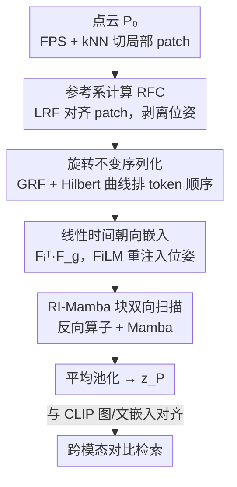

# RI-Mamba: Rotation-Invariant Mamba for Robust Text-to-Shape Retrieval

**会议**: CVPR 2026  
**论文**: [CVF Open Access](https://openaccess.thecvf.com/content/CVPR2026/html/Nguyen_RI-Mamba_Rotation-Invariant_Mamba_for_Robust_Text-to-Shape_Retrieval_CVPR_2026_paper.html)  
**代码**: 无（仅项目页 ndkhanh360.github.io/project-rimamba）  
**领域**: 3D视觉  
**关键词**: 文本到形状检索, 旋转不变, 状态空间模型, Mamba, 点云

## 一句话总结
针对真实场景里 3D 物体任意朝向、类别多样的检索难题，提出首个纯 Mamba 的旋转不变点云模型 RI-Mamba——用局部/全局参考系解耦位姿、Hilbert 曲线构造旋转不变 token 序列、线性时间的朝向嵌入找回被丢掉的位姿信息，配合自动三元组生成的跨模态对比学习，在 OmniObject3D 的 200+ 类别任意朝向检索上取得 SOTA。

## 研究背景与动机

**领域现状**：文本到形状检索（text-to-shape retrieval）让用户用自然语言从大规模 3D 库里找模型。主流做法（Text2Shape、Parts2Words、SCA3D 等）靠人工 caption 监督，甚至依赖细粒度的部件分割标注来对齐文本和形状。

**现有痛点**：这些方法有两个硬伤。其一，被绑死在很小的预定义类别集（Text2Shape 只有桌子和椅子，TriCoLo 也只有 13 个 ShapeNet 类），因为人工标注/部件标签只在小规模精选数据集上才有。其二，它们**假设所有 3D 物体都处于规范位姿（canonical pose）**，而真实线上 3D 库里的物体往往是随机朝向的，一旦数据库物体被随机旋转，这些模型的检索精度断崖式下跌。

**核心矛盾**：要规模化就得抛弃人工标注、改用自动数据生成；要鲁棒就得让模型对任意 SO(3) 旋转不变。但已有旋转不变（RI）网络要么施加苛刻约束、要么表达力弱、要么计算昂贵——尤其 SOTA 的 RI-Transformer 靠注意力机制实现 RI，复杂度是 token 数的平方，难以放到需要大规模跨模态训练的检索任务里。而高效的 Mamba 类点云模型又都没解决旋转不变。

**本文目标**：(1) 摆脱人工标注、把训练数据扩到 200+ 类别；(2) 设计一个既高效（线性时间）又真正旋转不变、还不损失表达力的 3D 编码器。

**切入角度**：作者注意到 Mamba 是单向状态空间模型，每个 token 的更新依赖它在序列里的位置——所以要让 Mamba 旋转不变，**既要 patch 的 embedding 旋转不变，又要 token 在序列里的顺序旋转不变**，这是用 SSM 做 RI 的关键难点。

**核心 idea**：用参考系把位姿从几何里剥离出来保证不变性，再用 Hilbert 曲线在全局参考系里排出一个旋转不变的 token 序列喂给 Mamba；同时用一个线性时间的「朝向嵌入」把被剥掉的位姿信息以旋转不变的方式重新注入，弥补 RI 模型表达力的损失。

## 方法详解

### 整体框架

给定一个 $N$ 点的点云 $P_0 \in \mathbb{R}^{N\times3}$（可选带颜色 $C_0$），RI-Mamba 先用最远点采样（FPS）选 $G$ 个中心点，再对每个中心用 kNN 聚出局部 patch。接着对每个 patch 算一个**局部参考系（LRF）** 把它对齐到规范朝向，剥离位姿；用**旋转不变序列化**（全局参考系 GRF + Hilbert 曲线）把无序的 patch 集合排成一个旋转鲁棒的 1D 序列；每个 patch 抽几何嵌入 $\text{geo}_i$、位置嵌入 $\text{pos}_i$、朝向嵌入 $\text{ori}_i$；这些嵌入按序列顺序送进 $L$ 个 **RI-Mamba 块**（内含 FiLM、反向算子、Mamba 模块）建模长程几何关系；最后平均池化得到单个点云特征 $z_P \in \mathbb{R}^C$，通过**跨模态对比学习**与 CLIP 的图像、文本嵌入对齐。

### 关键设计

**1. 参考系计算 RFC：把位姿从几何里剥出来**

旋转不变的根基。作者把任意点集 $X \in \mathbb{R}^{n\times3}$ 看成某个规范点集 $\hat{X}$ 在参考系 $F \in \mathbb{R}^{3\times3}$ 下被旋转后的结果：$\hat{X}$ 编码内在几何，$F$ 编码朝向。于是把点投影到自己的参考系里就把位姿消掉了：

$$F = \text{RFC}(X), \quad \hat{X} = X F^{\top}.$$

$F$ 用 PCA 估计（取方差主方向作为正交轴）。但 PCA 有**符号歧义**——每根轴的正负两个方向都合法，会让后续序列处理不一致。作者的消歧（reference frame disambiguation, RFD）很朴素却有效：把点投到每根轴上，选「大多数点所在的那一侧」作为正方向，从而得到确定性、可复现的参考系。对每个局部 patch $p_i$ 做这一套得到其 LRF $F_i$，对齐为 $\hat{p}_i = p_i F_i^{\top}$——这就是一个**与旋转无关、只刻画局部几何**的规范表示。

**2. 旋转不变序列化：让 token 顺序也对旋转不变**

Mamba 是单向 SSM，信息传播严重依赖 token 在序列里的位置，所以光让 patch embedding 不变还不够——**排序本身也必须旋转不变**，否则同一物体换个朝向就会排出不同的序列。作者先对整个物体算一个**全局参考系 GRF** $F_g = \text{RFC}(P_0)$，把 patch 中心投影到 GRF 得到规范坐标 $\hat{P} = P F_g^{\top}$，再用 **Hilbert 空间填充曲线** 对这些规范坐标排序：$I_H = \text{Hilbert}(\hat{P})$。Hilbert 曲线的好处是保空间局部性——3D 里相邻的点在 1D 序列里也相邻，给 Mamba 喂的是有几何意义的顺序。

为什么旋转不变？给输入施加旋转 $R$：$P_0^r = P_0 R$，则中心 $P^r = PR$、GRF 也跟着转 $F_g^r = F_g R$，代入得

$$\hat{P}^r = P^r (F_g^r)^{\top} = PR(F_g R)^{\top} = P F_g^{\top} = \hat{P},$$

规范坐标完全不变，因此 Hilbert 索引 $I_H$ 也不变。位置嵌入同理由 LRF 投影 $\text{pos}_i = \text{MLP}(P_i F_i^{\top})$ 保证不变，几何嵌入 $\text{geo}_i = \text{PointNet}(p_i F_i^{\top})$ 用 mini-PointNet 抽取也因输入对齐而不变。

**3. 线性时间朝向嵌入：把丢掉的位姿以旋转不变方式找回来**

把每个 patch 对齐到自己的 LRF 虽然保证了不变性，却**把 patch 的朝向信息也丢了**——而已有研究表明这种位姿损失会削弱模型表达力、拖累性能。最朴素的补救（对每个 LRF 用 MLP 编码）行不通，因为 LRF 自己会随输入旋转，编出来的嵌入不是旋转不变的；RI-Transformer 的做法是建模所有 patch 两两之间的相对朝向，但那是平方复杂度，且和 Mamba 的单向处理不兼容。

作者的关键观察：单个 patch 的 LRF $F_i$ 与全局 GRF $F_g$ 在任意全局旋转下**变化方式相同**，所以它们的相对位姿 $F_i^{\top} F_g$ 旋转不变。于是直接把每个 patch 相对全局朝向编码成朝向嵌入：

$$\text{ori}_i = \text{MLP}(F_i^{\top} F_g).$$

这是 **patch-wise** 而非 pairwise 的，每个 patch 独立算一个嵌入，天然是线性时间、天然兼容状态空间模型，让 Mamba 在顺序处理中隐式捕捉 patch 间朝向关系，避免了 RI-Transformer 的平方开销。三类嵌入 $(\text{geo}_i, \text{pos}_i, \text{ori}_i)$ 都按 $I_H$ 排好顺序送进 Mamba。

**4. RI-Mamba 块的双向扫描与 FiLM 位姿重注入**

每个 RI-Mamba 块接收上一层隐状态 $h_{l-1}$ 加位置/朝向嵌入，依次过 FiLM → 反向算子 → Mamba。**FiLM（特征级线性调制）** 负责把可能在 tokenize 时丢失的空间上下文重新注入：先用 bottleneck 层降维 $\text{pos}$、$\text{ori}$ 及它们的逐元素积 $\text{pos}\odot\text{ori}$，拼接后用 MLP 学出逐通道的缩放/平移 $\gamma_l, \beta_l \in \mathbb{R}^C$，调制隐状态 $h'_l = \gamma_l \cdot h_{l-1} + \beta_l$，让点特征能根据空间上下文动态自适应。**反向算子** 则解决 Mamba 单向因果的短板——点云聚邻需要全方向信息，作者让奇数层从左到右扫、偶数层从右到左扫，零额外计算地实现双向上下文流。消融显示去掉 pos+ori（仅靠 geo）精度从 14.7 暴跌到 8.2，去掉双向扫描降到 12.7，证明这两件事都关键。

### 损失函数 / 训练策略

为摆脱人工标注，作者采用**自动三元组生成**：复用 OpenShape 从 3D mesh 自动渲染图像 + image captioning 得到「点云-图像-文本」三元组，无需手工标。训练沿用 TAMM 的跨模态对比框架：对 RI-Mamba 输出的全局特征 $z_P$ 用两个 adapter 解耦出视觉属性 $z_I$ 和语义隐变量 $z_T$，分别与 CLIP 的图像、文本嵌入对齐，损失为两个方向的 InfoNCE 之和：

$$\mathcal{L} = \mathcal{L}_{P\leftrightarrow I} + \mathcal{L}_{P\leftrightarrow T}.$$

这套无标注管线把训练规模从 ShapeNet 单数据集（~52K）扩到四数据集合集 Ensemble（~123K），支撑 200+ 类别检索。

## 实验关键数据

### 主实验

**有监督检索（Text2Shape，桌/椅）**：在规范位姿下，RI-Mamba 不用任何部件标签就和用了部件标注（†）的 SOTA 打平；在随机旋转 SO(3) 设定下大幅领先——已有方法只关注训练流程、忽视模型鲁棒性，旋转后精度崩盘。

| 方法 | 规范 RR@1 | 规范 NDCG@5 | SO(3) RR@1 | SO(3) NDCG@5 |
|------|-----------|-------------|------------|--------------|
| Parts2Words† | 12.72 | 23.13 | 1.68 | 3.57 |
| SCA3D† | 13.74 | 24.58 | 2.24 | 4.46 |
| **RI-Mamba** | **13.87** | 24.55 | **13.20** | **23.65** |

**零样本检索（OmniObject3D，214 类，Ensemble 预训练）**：非 RI 模型在随机旋转下显著掉点，RI 模型虽稳但常因表达力弱而在对齐点云上吃亏；RI-Mamba 几乎在所有设定都最好。

| 方法 | Omni3D RR@1 | Omni3D NDCG@5 | SO(3) RR@1 | SO(3) NDCG@5 |
|------|-------------|---------------|------------|--------------|
| DuoMamba | 15.82 | 29.28 | 7.83 | 17.09 |
| RI-Transformer | 9.67 | 20.89 | 10.39 | 21.24 |
| **RI-Mamba** | **19.02** | **34.39** | **19.34** | **33.76** |

3D-to-3D 检索（mAP）和零样本分类（ModelNet40 / OmniObject3D）同样验证：RI-Mamba 在 SO(3) 设定全面领先，在规范位姿下也接近非 RI 模型，表达力与鲁棒性平衡最好。

### 消融实验

逐组件移除（Omni3D，ShapeNet 预训练，指标为 RR@1）：

| 配置 | 指标 | 说明 |
|------|------|------|
| (0) 完整模型 | 14.7 | Hilbert+RFD+pos+ori+FiLM+双向扫描全开 |
| (1) w/o Hilbert | 13.9 | 去掉 Hilbert 排序 |
| (2) w/o RFD | 14.1 | 去掉参考系消歧 |
| (3) w/o pos+ori | 8.2 | 去掉位置+朝向嵌入，暴跌 6.5 |
| (4) w/o FiLM | 13.1 | 有 pos+ori 但不用 FiLM 自适应注入 |
| (5) w/o 双向扫描 | 12.7 | Mamba 仅单向 |

### 关键发现
- **位姿信息找回是性能命门**：去掉 pos+ori 直接从 14.7 掉到 8.2（行 3），证明 RI 模型「剥位姿换不变性」的代价很大，必须有机制补回来；而只补回不用 FiLM 自适应注入（行 4，13.1）仍不够，说明 FiLM 的逐通道动态调制是有效手段。
- **效率碾压 RI-Transformer**：token 数到 2048 时，RI-Transformer 显存超 20 GB，RI-Mamba 仅约 2 GB，FLOPs/运行时间也随长度线性增长而非平方——这正是线性 patch-wise 朝向嵌入 + SSM 的红利。
- **泛化更稳**：RI-Transformer 在仅 40 类、且与预训练高度重叠的 ModelNet40 上靠注意力过拟合拿到最高分，但在 214 类、更贴近真实的 OmniObject3D 上 RI-Mamba 反超，说明它对未见类别泛化更好。
- **轴交换鲁棒**：现实数据集重力轴约定不一（y 或 z），非 RI 模型对 y-z 轴交换极敏感，RI-Mamba 最稳。

## 亮点与洞察
- **「token 顺序也要旋转不变」这一洞察很关键**：把 RI 从「embedding 不变」推进到「序列结构不变」，用 GRF + Hilbert 曲线一招同时满足不变性和空间局部性，是把 SSM 用在 RI 任务上的核心使能点。
- **$F_i^{\top}F_g$ 这个相对位姿设计非常巧**：用「局部参考系 vs 全局参考系」的相对量，既旋转不变又是 patch-wise 线性复杂度，绕开了 RI-Transformer 平方级两两比较，思路可迁移到任何需要在保不变性前提下保留朝向信息的几何任务。
- **整套无标注数据管线**（渲染 + captioning + 自动三元组 + 跨模态对比）把检索从「桌椅 13 类」直接拉到 200+ 类，证明对比学习能替代昂贵的部件分割标注。

## 局限与展望
- 旋转不变性建立在 **PCA 参考系**之上，对近似对称或退化几何（主轴方差接近、PCA 不稳定）的物体，参考系估计和符号消歧可能失效 ⚠️（论文未深入讨论这类失败情形）。
- 评测主要在合成/精选 3D 数据集（ShapeNet、OmniObject3D、ModelNet40），对真实扫描点云的噪声、缺失、遮挡鲁棒性未充分检验。
- 自动三元组依赖渲染图 + image captioning，文本监督质量受 caption 模型上限制约，细粒度属性（材质、部件关系）描述可能不够精确。
- 朝向嵌入是 patch 相对全局的「独立」量，靠 Mamba 顺序处理隐式建模 patch 间朝向关系，是否充分捕捉复杂物体的部件间相对位姿，仍有探索空间。

## 相关工作与启发
- **vs RI-Transformer**: 两者都做几何/朝向解耦实现 RI，但 RI-Transformer 用注意力建模 patch 两两相对朝向，平方复杂度、显存爆炸；RI-Mamba 改用 patch-wise 的 $F_i^{\top}F_g$ + 线性 SSM，效率高一个量级，且对未见类别泛化更好。
- **vs DuoMamba / PointBERT（非 RI 的 SSM/Transformer）**: 它们表达力强、规范位姿下分高，但完全不处理旋转，随机朝向下精度崩盘；RI-Mamba 牺牲极小的规范位姿精度换来全旋转设定下的稳定领先。
- **vs LocoTrans / Vector Neurons 等 RI 方法**: 这类方法或靠额外等变分支恢复位姿（计算翻倍）、或用手工 RI 特征丢弃朝向（表达力弱）；RI-Mamba 用单一线性嵌入 + FiLM 兼顾不变性与表达力。
- **vs TriCoLo / SCA3D（文本-形状检索）**: 它们靠人工 caption / 部件标注，被困在十几个类别且假设规范位姿；RI-Mamba 用自动三元组 + 跨模态对比扩到 200+ 类并处理任意朝向。

## 评分
- 新颖性: ⭐⭐⭐⭐⭐ 首个纯 Mamba 的旋转不变点云模型，「序列顺序旋转不变 + 线性朝向嵌入」是实打实的新设计
- 实验充分度: ⭐⭐⭐⭐ 覆盖有监督/零样本检索、3D-to-3D、分类、效率、轴交换、消融，建立首个任意位姿文本-形状检索 benchmark
- 写作质量: ⭐⭐⭐⭐ 不变性推导清晰、动机层层递进，图表完整
- 价值: ⭐⭐⭐⭐⭐ 把文本-形状检索推向真实世界（多类别 + 任意朝向 + 无标注），且效率适合大规模部署

<!-- RELATED:START -->

## 相关论文

- [\[CVPR 2026\] RINO: Rotation-Invariant Non-Rigid Correspondences](rino_rotation-invariant_non-rigid_correspondences.md)
- [\[CVPR 2026\] Mamba Learns in Context: Structure-Aware Domain Generalization for Multi-Task Point Cloud Understanding](mamba_learns_in_context_structure-aware_domain_generalization_for_multi-task_poi.md)
- [\[CVPR 2026\] VIMCAN: Visual-Inertial 3D Human Pose Estimation with Hybrid Mamba-Cross-Attention Network](vimcan_visual-inertial_3d_human_pose_estimation_with_hybrid_mamba-cross-attentio.md)
- [\[CVPR 2026\] 4D Local Modeling Toward Dynamic Global Perception for Ambiguity-free Rotation-Invariant Point Cloud Analysis](4d_local_modeling_toward_dynamic_global_perception_for_ambiguity-free_rotation-i.md)
- [\[CVPR 2025\] Spectral Informed Mamba for Robust Point Cloud Processing](../../CVPR2025/3d_vision/spectral_informed_mamba_for_robust_point_cloud_processing.md)

<!-- RELATED:END -->
