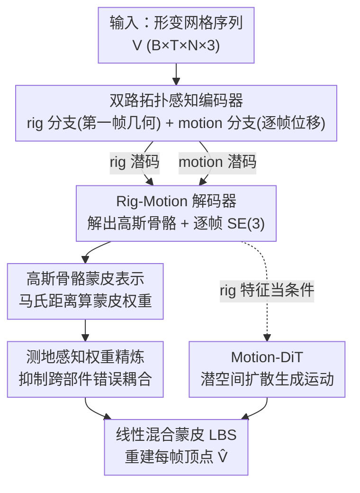

# RigMo: Unifying Rig and Motion Learning for Generative Animation

**会议**: CVPR 2026  
**论文**: [CVF Open Access](https://openaccess.thecvf.com/content/CVPR2026/html/Zhang_RigMo_Unifying_Rig_and_Motion_Learning_for_Generative_Animation_CVPR_2026_paper.html)  
**代码**: 无（仅项目页 RigMoPage.github.io）  
**领域**: 3D视觉  
**关键词**: 4D生成, 自动绑定, 蒙皮权重, 高斯骨骼, 运动扩散

## 一句话总结
RigMo 把"绑定（rig）"和"运动（motion）"统一进一个前馈 VAE：直接从裸网格序列中自监督地学出一组高斯骨骼、蒙皮权重和逐帧 SE(3) 变换，无需任何人工骨架标注，再配一个在其潜空间里跑的 Motion-DiT 做可控运动生成，在重建精度、跨运动泛化和推理速度上都全面超过现有自动绑定与变形 baseline。

## 研究背景与动机
**领域现状**：4D 生成（动起来的 3D 资产）天然由两件事组成——**结构**（rig，定义物体能怎么变形）和**运动**（motion，结构随时间怎么演化）。但现有 pipeline 几乎都把这两件事拆开做。自动绑定方法（RigNet、UniRig、MagicArticulate）从静态网格预测骨架和蒙皮权重，本质是模仿艺术家手工标注的启发式；运动生成方法（如 AnyTop）则假设骨架已知，只在 pose 空间预测关节旋转；还有一类纯顶点变形方法（AnimateAnyMesh、GVFDiffusion）干脆不要 rig，逐帧直接预测顶点位移。

**现有痛点**：三类范式各有硬伤。自动绑定**重度依赖人工标注的骨架**，跨数据集、跨物体类别难以一致和扩展，而且"看静态几何猜蒙皮"这件事连资深艺术家都做不准、必须反复试错；假设已知骨架的方法**无法处理任意几何**，骨架不匹配就崩；纯顶点变形虽灵活，但**难控制、难解释、产不出可复用的可动资产**——而可复用恰恰是 rigging 存在的意义。经典 SSDR（带刚性骨的平滑蒙皮分解）虽能从序列反解出 rig，但要**对每条序列单独做一次非线性优化**，又慢又只绑定到单条序列、无法泛化。

**核心矛盾**：根本问题在于——**鲁棒的 rig 无法从静态几何里推断出来，必须从运动里学**。光看一个静止的 mesh，你不知道哪些顶点该归同一根骨；只有看它真正"动"起来，结构才会自然浮现。但现有框架没有一个能直接从原始 mesh 序列里**同时**学出 rig 结构和运动动态，且不要预定义骨架、不要逐序列优化。

**核心 idea**：用一个统一的前馈 VAE，把逐顶点形变**解耦**进两个紧凑潜空间——一个 rig 潜空间解码成显式的**高斯骨骼 + 蒙皮权重**，一个 motion 潜空间解码成逐帧 **SE(3) 变换**，两者经可微蒙皮重建出网格运动；整个过程**只用顶点级重建损失 + KL 自监督**，彻底绕开人工绑定标注这个瓶颈。

## 方法详解

### 整体框架
RigMo 由两部分组成：**RigMo-VAE**（核心，学绑定表示 + 运动参数）和 **Motion-DiT**（在 VAE 潜空间里做下游可控运动生成）。

RigMo-VAE 的数据流是：输入一段形变网格序列 $V \in \mathbb{R}^{B\times T\times N\times 3}$（B 批、T 帧、每帧 N 个顶点）→ 一个**双路拓扑感知编码器**把"静态几何"和"动态运动"分开编码（rigging 分支只看第一帧规范几何、motion 分支看逐帧位移）→ **Rig-Motion 解码器**分别解出高斯骨骼参数 $G=[\Delta c, s, q]$ 和局部/根部 SE(3) 运动 $\{q_{local}, t_{local}, q_{root}, t_{root}\}$ → **高斯蒙皮 LBS 模块**先把高斯骨算出蒙皮权重、再经测地精炼、最后线性混合蒙皮重建出每帧顶点 $\hat V$。整个网络前馈一次就能推断一段 20 帧 5K 顶点序列，A100 上每帧约 40ms。

拿到这套结构感知的潜表示后，Motion-DiT 把 rig 分支输出当作条件、在 motion 潜空间里跑扩散，生成或插值出新运动，再用 VAE 解码器还原成动画。

### 关键设计

**1. 高斯骨骼绑定表示：用软椭球当"骨头"，让复杂度只跟骨数走**

传统骨架是离散的关节 + 刚性骨，绑定时要先定拓扑、再硬分配顶点，跟 mesh 分辨率强绑定。RigMo 改用一组**高斯骨骼**：每根骨 $k$ 由 $G_k=[c_k, s_k, q_k]$ 定义——中心 $c_k\in\mathbb{R}^3$、各向异性缩放 $s_k\in\mathbb{R}^3$、朝向四元数 $q_k\in\mathbb{R}^4$，合起来就是一个 3D 高斯椭球，充当**影响范围空间渐变的软骨头**。顶点 $v_i$ 对骨 $k$ 的蒙皮权重用骨自身坐标系下的**马氏距离**算并 softmax 归一：

$$w^{raw}_{ik} = \frac{\exp\!\big(-\tfrac{1}{2}\|R_k^\top(v_i-c_k)\oslash s_k\|^2\big)}{\sum_{j=1}^{K}\exp\!\big(-\tfrac{1}{2}\|R_j^\top(v_i-c_j)\oslash s_j\|^2\big)}$$

其中 $R_k$ 是 $q_k$ 对应的旋转矩阵、$\oslash$ 是逐元素除。最终变形用线性混合蒙皮 $\hat v_i = \sum_k w_{ik}\,T_k\,\tilde v_i$，其中 $T_k = T_{root}\cdot T_{k,local}$ 把根运动和局部骨运动层级地组合起来。这套表示的妙处在于——它**连续地定义在 3D 空间里**而非绑死在某些顶点索引上，所以复杂度只取决于骨数 K 而非 mesh 分辨率，天然对分辨率不敏感，学到的 rig 可以直接套回任意分辨率的原网格。

**2. 双路拓扑感知编码器：把"结构"和"运动"在编码阶段就解耦开**

如果让同一套特征既管结构又管运动，rig 预测就会被某一段具体运动带偏、不稳定。RigMo 在编码器里就把两者分开。**rigging 分支**只处理规范几何（第一帧 $V_0$），先用拓扑感知注意力 $h^\ell = \text{Attn}(\text{LN}(h^{\ell-1}), N)+h^{\ell-1}$ 编出逐顶点嵌入，用最远点采样（FPS）选出 K 个骨 token，再交叉注意力得到骨-顶点关联特征并预测高斯骨参数。**motion 分支**则先算逐帧位移 $V_\Delta = V[:,1:]-V[:,:-1]$，经时空注意力后用**共享的骨 token 坐标** $C_{bone}$ 抽取骨-运动交互特征 $A_{motion}$，再分别预测局部运动的变分后验 $[\mu_{local}, \log\sigma_{local}]=\text{MLP}(A_{motion})$（逐骨逐帧）和根运动后验（对时间做平均池化后再预测），用重参数化 $z=\mu+\sigma\odot\epsilon$ 采样。两分支**共享同一套骨 token 索引**，保证 rig 和 motion 说的是同一组骨，这才让"结构稳定、运动在其上演化"的解耦成立。

**3. 测地感知权重精炼：用网格表面最短路堵住"隔空串扰"**

只靠欧氏距离的高斯权重有个老毛病：空间上挨得近、拓扑上却很远的部位（如手臂贴着躯干）会被错误地耦合进同一根骨，动起来就出现撕扯伪影。RigMo 加了一道**测地精炼**：先算顶点 $v_i$ 到骨锚点 $a_k$ 的表面测地距离 $d_g(v_i,a_k)=\min_{\pi}\sum_{(v_p,v_q)\in\pi}\|v_p-v_q\|_2$（沿边连通路径求最短），再用阈值 $\tau$ 构造二值掩码 $M_{ik}=\mathbb{1}[d_g(v_i,a_k)<\tau]$，把原始权重按掩码屏蔽后重新归一：$\tilde W_{ik}=W^{raw}_{ik}M_{ik}$，$w_{ik}=\tilde W_{ik}/(\sum_j \tilde W_{ij}+\varepsilon)$（$\varepsilon=10^{-8}$）。够不到任何骨的顶点退化为最近骨的 one-hot。这样跨部件影响被有效压住，每个顶点通常只保留 2–3 根骨的影响，蒙皮更干净。消融里去掉这一步，CD-L1 从 1.73 直接劣化到 2.37，是单项贡献最大的模块。

**4. Motion-DiT：在结构感知的潜空间里扩散，而不是在裸顶点坐标上**

直接在顶点坐标上生成运动既高维又难控。Motion-DiT 把生成搬进 RigMo 的 **motion 潜空间**：用一个 condition encoder 把静态 rig 线索（锚点/高斯/蒙皮特征）聚成锚 token $A$ 和全局 token $g$，生成时固定不变充当条件；把 VAE 的动态 token 和根 token 投到统一宽度 H、拼成运动潜张量，按可配置的**帧掩码**（指定哪些帧已观测、哪些待生成）让扩散 Transformer 预测速度场 $\hat v$，再用 v-prediction 还原 $\hat x_0=\sqrt{\alpha_t}x_t-\sqrt{1-\alpha_t}\hat v$ 并解码成动画。骨干是 12 个交替的**时空注意力（ISTA）块**（隐藏维 512），每块先做帧内跨骨的空间注意力、再做骨内跨帧的时间注意力，外加两路条件交叉注意力（注入静态/全局先验、对齐已观测帧）。这种"**静态做条件、运动潜空间里生成**"的设计把合成的动态牢牢系在学到的 rig 结构上，所以稀疏几帧观测就足以补全整段动画。

### 损失函数 / 训练策略
RigMo-VAE 端到端只用两项自监督目标：顶点级重建 $L_{recon}=\frac{1}{BTN}\sum\|\hat v-v\|^2$ 和 KL 正则 $L_{KL}=\frac12\sum_i(\mu_i^2+\sigma_i^2-\log\sigma_i^2-1)$，合为 $L_{total}=\lambda_{recon}L_{recon}+\lambda_{KL}L_{KL}$（$\lambda_{recon}=1.0$，$\lambda_{KL}=10^{-6}$，KL 在前 30% 训练里退火）。**全程不需要任何绑定标注**，骨结构纯靠观察顶点轨迹自然涌现。Motion-DiT 则用潜空间 L2、SO(3) 测地旋转、平移 L2、顶点 L2 四项加权损失，权重 $(0.5, 1.0, 0.2, 0.1)$，且只在待生成帧上算。

## 实验关键数据

### 主实验
数据集：自建约 20,000 条形变网格序列，覆盖 DeformingThings4D（1,972 条真实有机非刚性形变）、TrueBones（1,287 条高保真关节动画）、Objaverse-XL（17,024 条合成序列），各按 5:1 划分训练/测试。

**绑定发现与跨运动泛化**（DT4D，CD ×10⁻³，越低越好）。关键看 Cross-Motion Transfer 列——即把训练序列学到的 rig 套到该物体未见过的运动上：

| 方法 | 训练重建 CD-L1 | 跨运动 CD-L1 | 跨运动 CD-L2 | 平均 CD-L1 |
|------|------|------|------|------|
| Per-Case 优化 | 12.3 | 68.8 | 43.5 | 40.55 |
| UniRig + 优化 | 37.3 | 48.6 | 31.2 | 42.95 |
| MagicArticulate + 优化 | 43.1 | 53.4 | 28.7 | 48.25 |
| **RigMo (本文)** | **11.1** | **13.82** | **11.83** | **12.46** |

逐序列优化在自己训练的运动上还行（12.3），一换到未见运动就崩到 68.8——印证了"绑定不能只看静态几何、不能逐序列死记"。RigMo 跨运动 CD-L1 仅 13.82，平均误差几乎只有最强 baseline 的 1/3。

**重建保真度与推理效率**（自建 500 条子测试集，CD ×10⁻²）：

| 方法 | CD-L1 ↓ | CD-L2 ↓ | 20 帧耗时 ↓ |
|------|------|------|------|
| AnimateAnyMesh | 1.81 | 1.32 | 2.8s |
| Step1X3D | 3.63 | 2.96 | 22.6s |
| Hunyuan3D 2.1 | 3.21 | 2.67 | 17.4s |
| **RigMo (本文)** | **1.73** | **1.26** | **0.74s** |

RigMo 用 48/128 个 token 就超过 AnimateAnyMesh 的 512-token 表示，重建最好且最快（0.74s，比逐帧解码的 3D VAE 快一两个数量级）。

### 消融实验
（DeformingThings4D 验证集，CD ×10⁻²）

| 配置 | CD-L1 ↓ | CD-L2 ↓ | 说明 |
|------|------|------|------|
| w/o 测地精炼 | 2.37 | 2.07 | 去掉后掉点最猛 |
| 48 骨 token | 1.91 | 1.48 | 效率/可解释性最优平衡 |
| 128 骨 token | 1.73 | 1.26 | 定量最优 |

### 关键发现
- **测地精炼贡献最大**：去掉它 CD-L1 从 1.73 劣化到 2.37，说明对关节物体而言"空间近 ≠ 该归同一根骨"，必须用表面测地拓扑约束。
- **骨数存在边际递减**：48→128 token 仅带来约 0.018% 的 CD-L1 改善，token 过多反而把连贯的解剖区域切碎；作者认为 48 个在效率、可解释性、稳定性上更划算。
- **分辨率无关**：因为高斯骨和运动定义在连续 3D 空间而非固定顶点索引，rig 可直接套回原始分辨率网格，形变质量稳定——这是相比 AnimateAnyMesh 等 mesh-dependent 方法的结构性优势。

## 亮点与洞察
- **"rig 必须从运动里学"这个论断本身就是核心洞察**：论文用 Per-Case 优化崩盘（68.8）和"连资深艺术家看静态都猜不准蒙皮"两个证据把动机钉死，非常有说服力。
- **高斯骨这个表示选得巧**：借用 3D Gaussian 的椭球参数化当软骨头，既给了可微、连续、分辨率无关的蒙皮，又天然解耦了"骨数"和"网格分辨率"两个本不该耦合的量，可迁移到任何需要"软部件分解"的任务。
- **结构 vs 运动的解耦放在编码器里、且共享骨 token**：这个工程细节是让自监督能稳定涌现出语义骨的关键——它保证两分支谈论同一组骨，否则结构会被运动带偏。
- **"静态做条件、潜空间里生成运动"**：Motion-DiT 把生成约束在 rig 结构上，使稀疏观测就能补全整段动画，这套思路可迁移到其他"结构先行、动态填充"的生成任务。

## 局限与展望
- **依赖大规模形变序列数据**：自监督虽免去人工绑定标注，但需要约 2 万条形变序列、24×A100 训 10 天，门槛不低；序列太短（<10 帧）还要被过滤掉。
- **K（骨数）需手动设定**：48/128 是超参，不同物体的"合理骨数"差异很大，论文没给自适应选骨的机制 ⚠️。
- **Motion-DiT 评测偏弱**：作者自己说主贡献在 VAE，Motion-DiT 的生成结果大多丢进了补充材料，正文缺少与专门运动生成方法的定量对比，可控性到底多强还看不清。
- **测地距离阈值 $\tau$ 的鲁棒性**：测地精炼对 $\tau$ 应该敏感（决定哪些顶点被屏蔽），但正文未给 $\tau$ 的敏感性分析 ⚠️。

## 相关工作与启发
- **vs 自动绑定（UniRig / MagicArticulate / RigNet）**：它们从静态规范网格预测骨架、需大规模艺术家标注的 rig 监督，且只会"看着像"、动起来就崩；RigMo 完全无 rig 监督、直接从运动里学，跨运动泛化误差低一个量级。
- **vs SSDR / 逆向蒙皮**：经典方法对每条序列做一次非线性优化，慢且 rig 绑死单条序列无法泛化；RigMo 一次前馈推断、跨类别跨运动共享一套可泛化的关节表示。
- **vs 纯顶点变形（AnimateAnyMesh / GVFDiffusion）**：它们逐帧预测顶点位移、无结构抽象，难控难解释、产不出可复用资产，且 token 数高（512）、换分辨率会破坏蒙皮；RigMo 用 48/128 token 给出显式、可解释、可编辑、分辨率无关的 rig。

## 评分
- 新颖性: ⭐⭐⭐⭐⭐ 首个从裸 mesh 序列联合自监督学 rig + motion 的统一前馈框架，高斯骨表示和"rig 须从运动学"的视角都很新。
- 实验充分度: ⭐⭐⭐⭐ 跨运动泛化、重建效率、消融都扎实，但 Motion-DiT 的生成评测偏薄、缺与专门运动生成方法的定量对比。
- 写作质量: ⭐⭐⭐⭐ 动机推导清晰、图文对照好；个别符号（如 $\tau$、骨数选取）交代略简。
- 价值: ⭐⭐⭐⭐⭐ 把绑定从"人工标注 + 逐序列优化"推向"数据驱动、可扩展、前馈"，对可控 4D 生成是范式级推进。

<!-- RELATED:START -->

## 相关论文

- [\[CVPR 2026\] Tracking-Guided 4D Generation: Foundation-Tracker Motion Priors for 3D Model Animation](tracking-guided_4d_generation_foundation-tracker_motion_priors_for_3d_model_anim.md)
- [\[CVPR 2026\] DynamicTree: Interactive Real Tree Animation via Sparse Voxel Spectrum](dynamictree_interactive_real_tree_animation_via_sparse_voxel_spectrum.md)
- [\[CVPR 2026\] AnthroTAP: Learning Point Tracking with Real-World Motion](anthrotap_learning_point_tracking_with_real-world_motion.md)
- [\[CVPR 2026\] ReFlow: Self-correction Motion Learning for Dynamic Scene Reconstruction](reflow_self-correction_motion_learning_for_dynamic_scene_reconstruction.md)
- [\[CVPR 2025\] PhysAnimator: Physics-Guided Generative Cartoon Animation](../../CVPR2025/3d_vision/physanimator_physics-guided_generative_cartoon_animation.md)

<!-- RELATED:END -->
