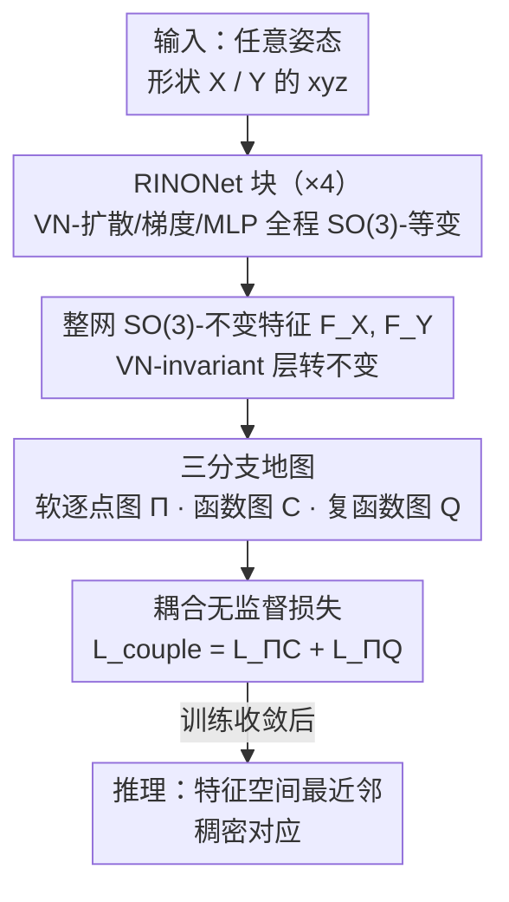

# RINO: Rotation-Invariant Non-Rigid Correspondences

**会议**: CVPR 2026  
**论文**: [CVF Open Access](https://openaccess.thecvf.com/content/CVPR2026/html/Gao_RINO_Rotation-Invariant_Non-Rigid_Correspondences_CVPR_2026_paper.html)  
**代码**: 无  
**领域**: 3D视觉  
**关键词**: 非刚性形状对应, 旋转不变, 向量神经元, 复函数图, 无监督匹配

## 一句话总结
RINO 用向量神经元（vector neuron）把 DiffusionNet 改造成端到端 SO(3)-不变的点特征提取器 RINONet，再把它和"只编码保向映射"的复函数图（CFMaps）以及一套耦合无监督损失结合，直接从原始 xyz 坐标学非刚性形状对应，无需预对齐、无需手工描述子，在任意姿态/非等距/部分/非流形/噪声等硬场景全面刷新 SOTA。

## 研究背景与动机
**领域现状**：稠密 3D 形状对应的主流范式是 Deep Functional Maps——用一个可学习的特征提取器（早期 ResNet+SHOT，现在几乎清一色 DiffusionNet）先算出逐点描述子，再用函数图框架 $C$ 把两个形状的特征空间对齐。近年大量工作把精力放在设计损失上，特征提取器基本沿用 DiffusionNet。

**现有痛点**：这条路有两个深层毛病。其一是**形状-姿态纠缠**：DiffusionNet 直接吃外在 xyz 坐标，是 SO(3)-可变的，所以必须先把形状摆正（预对齐），或者退而用 WKS/SHOT 这类手工内蕴描述子当输入。但 WKS 假设近等距，在大形变下失效；SHOT 对网格连通性极敏感。其二是**内蕴对称翻转**：纯内蕴方法理论上分不清左右对称（人的左手/右手、四足的左腿/右腿），常出现成片的对称翻转错误。

**核心矛盾**：传统做法把问题拆成"刚性匹配（估全局旋转平移）+ 非刚性匹配（假设已对齐再求稠密对应）"两步，但全局变换和局部形变本质上紧耦合——当正则姿态难以定义时（比如同一个人在跑和在坐），这种切分是病态的。理想的形状描述子应同时满足三点：对噪声/拓扑扰动鲁棒、利用表面几何先验、且与形状的外在朝向无关。现有方法没有一个能同时满足。

**核心 idea**：与其手工设计姿态对齐或描述子，不如把"旋转不变性"直接焊进网络结构——用向量神经元重写 DiffusionNet 的全部空间算子，得到一个从原始几何端到端学 SO(3)-不变特征的提取器；再叠加只能编码保向映射的 CFMaps 来根除对称翻转，整套用无监督损失训练。

## 方法详解

### 整体框架
RINO 的输入是两个任意姿态的 3D 形状 $X, Y$（顶点坐标，可非等距、可部分、可非流形），输出是它们之间的稠密点对应。整条管线分两层：底层是特征提取器 **RINONet**，把原始 xyz 直接映射成 SO(3)-不变的逐点特征 $F_X, F_Y$；上层是一个**三分支匹配框架**，从这对特征同时导出三种互补的地图表征——软逐点图 $\Pi$、函数图 $C$、复函数图 $Q$——再用一套无监督损失把它们耦合起来一起优化。推理时只需一次前向，在学到的特征空间里做欧氏最近邻搜索即可得到对应。

RINONet 本身是 Siamese 共享的：先用 VN-EdgeConv 把 $V\in\mathbb{R}^{n\times3}$ 聚合邻域信息升成 $\mathbb{R}^{n\times c\times3}$ 的向量值特征，过四个串联的 **RINONet 块**（内部全程保持 SO(3)-等变），再用一个 VN-invariant 层把等变特征转成不变特征，最后 VN-linear 调到目标维度。

### 关键设计

**1. RINONet 块：用向量神经元把 DiffusionNet 的每个空间算子改成 SO(3)-等变**

痛点很直接：DiffusionNet 吃 xyz 时是旋转可变的，转一下形状特征就变，所以才被迫预对齐。RINO 的做法是把网络隐状态从标量值 $\mathbb{R}^{n\times c}$ 升成向量值 $\mathbb{R}^{n\times c\times 3}$（多出来的 3 维叫 VN 维），借助向量神经元（VN）框架让旋转作用能显式映射到隐空间。VN 的等变性来自一个简单事实——线性层只乘到通道维、不碰 VN 维：$\text{VN-linear}(uR)=(Mu)R=\text{VN-linear}(u)R$，所以旋转 $R$ 可以一路"穿过"网络。等变与不变是一回事的特例：当 $F(uR)=F(u)$ 时就是不变，于是网络先学等变特征、最后一步再转成不变特征预测对应。

一个 RINONet 块由三个模块组成，每个都被重新设计以保持等变：
- **VN-Diffusion 层**：做表面特征扩散 $h:=H_t(u)$，扩散时间 $t$ 逐通道可学（控制每个特征的空间支撑范围）。保等变的关键设计是**同一个 $t$ 必须施加到输入的全部三个 VN 维上**，配合扩散算子的线性，才有 $H_t(uR)=H_t(u)R$。
- **VN-Gradient 层**：算空间梯度 $w:=G(h)$ 来学各向异性（径向不对称）滤波器，并在每个顶点的局部坐标系里表示成复数，过可学复矩阵 $A\in\mathbb{C}^{c\times c}$。但朴素的聚合 $\text{Re}(\bar{w}\odot Aw)$ 不与旋转交换，会破坏等变。作者的解法是沿 VN 维再求和，得到不变特征：

$$f := \mathrm{sum}\big(\mathrm{Re}(\bar{w}\odot Aw),\ \dim=1\big)$$

文中证明（Thm. 1）这个 $f\in\mathbb{R}^{n\times c}$ 是 SO(3)-**不变**的。随后 $g:=\tanh(f)$ 稳定训练，再与归一化等变特征 $h$ 逐元素相乘 $e:=g\odot h$，把不变量"贴回"等变特征上，尽量保持整体等变。
- **VN-MLP**：线性层去掉 bias（因为 $M(uR)+b\neq(Mu+b)R$），并把 ReLU 换成 VN 版本。

整块写成 $d=\text{VN-MLP}([u,h,e])+u$（输入、等变扩散特征、等变梯度特征沿通道拼接再过 MLP，带残差）。Thm. 2 给出：RINONet 块 SO(3)-等变，整个 RINONet SO(3)-不变。

**2. 用 CFMaps 根除内蕴对称翻转，而不靠外在预对齐**

光有不变特征还不够。作者发现：把未对齐形状的 xyz 喂进网络后，仍会出现成片的对称翻转对应（图 6、表 3）。原因是单凭内蕴信息理论上无法区分镜像对称。RINO 的对策是引入**复函数图 CFMaps（$Q$）**——它建立在连接拉普拉斯（Connection Laplacian）的复特征基上，作用在切向量场而非标量函数上，理论上**只能编码保向（orientation-preserving）映射**，因此天然把左右对称这种翻转排除掉。与函数图 $C$ 相比，$C$ 只强制特征本身一致，而 $Q$ 额外强制特征一阶导（梯度算子 $\nabla$ 得到）的一致性，从而既消歧又让特征更准。关键区别在于：DUOFM 也用 CFMaps，但它的特征不是 SO(3)-不变的、依赖外在嵌入，所以照样翻转；RINO 因为底层特征本身就旋转不变，CFMaps 才能真正发挥消歧作用。

**3. 三分支地图表征 + 耦合损失：把 Π、C、Q 拧成一股绳无监督训练**

从同一对不变特征 $F_X,F_Y$ 出发，RINO 同时导出三种地图：软逐点图 $\Pi_{XY}=\mathrm{Softmax}(F_X F_Y^{\top}/\tau)$（$\tau$ 是控制匹配熵的温度），以及通过两个不可学但可微的求解块解凸问题得到的 $C_{XY}$（函数图，能量见下）和 $Q_{XY}$（复函数图）。函数图本身的求解是最小化特征保持 + 结构正则：

$$E_{\text{data}}(C)=\lVert C\,\Phi_X^{\dagger}F_X-\Phi_Y^{\dagger}F_Y\rVert_F^2,\qquad C_{XY}=\arg\min_C E_{\text{data}}(C)+\omega E_{\text{reg}}(C)$$

总损失 $L_{\text{total}}$ 含三项：结构损失 $L_{\text{struct}}$、对比损失 $L_{\text{contr}}$（沿用已有工作，鼓励 $C/Q$ 的关键性质和判别性逐点特征），以及本文核心贡献——**耦合损失** $L_{\text{couple}}$。它强制软逐点图 $\Pi$ 与它经 $C$、$Q$ 的函数拉回保持一致：

$$L_{\text{couple}}=L_{\Pi C}+L_{\Pi Q}$$

其中 $L_{\Pi C}$ 约束逐点图和函数图一致（前人探索过），$L_{\Pi Q}$ 是新提出的、把逐点图和保向复函数图绑在一起的项。作者强调这是**首次同时耦合三种地图表征**——但又不能过度耦合（会把训练搞崩），所以是"有针对性的"耦合，才能同时拿到高精度特征和稳健的对称消歧。

### 损失函数 / 训练策略
整套无监督，无需任何真值对应。部分形状匹配时采用两阶段：先在 DT4D/SMAL/FAUST/SCAPE 四个完整形状数据集上预训练 2 个 epoch，再在 SHREC16-Partiality（CUTS 与 HOLES）上微调 500 个 epoch，评测全程不做任何后处理。为公平评估，所有形状在训练和测试时都施加随机旋转（除非另说明）。

## 实验关键数据

### 主实验

**SO(3)-不变性（SMAL，mGeoErr ↓）**：四种训练/测试旋转配置。I=已对齐、SO(3)=全随机旋转、Y=绕 y 轴旋转。最考验的是 I/SO(3)（对齐训练、随机旋转测试）。

| 方法 | I/I | I/SO(3) | SO(3)/SO(3) | Y/Y |
|------|-----|---------|-------------|-----|
| CnsFM | 5.4 | 58.7 | 9.1 | 5.4 |
| DUOFM | 11.7 | 41.4 | 25.2 | 16.5 |
| URSSM | 4.8 | 62.1 | 24.8 | 7.9 |
| SMS | 4.6 | 58.5 | 57.6 | 39.3 |
| SmpFM | 5.6 | 62.6 | 9.9 | 7.3 |
| HbrFM | 5.6 | 61.8 | 26.4 | 5.3 |
| **RINO** | **4.6** | **4.6** | **4.6** | **4.6** |

所有 baseline 在 I/I 都还行，但一旦旋转变化（尤其 I/SO(3) 这种未见旋转）就崩到 40~60；RINO 在四种配置下都是 4.6，因为不变性是结构自带的，连旋转数据增广都不需要。

**非等距 / 原始扫描匹配（SMAL/DT4D/FSCAN，mGeoErr ↓）**：分别用 wks 和 xyz 输入。

| 方法 | SMAL(xyz) | DT4D(xyz) | FSCAN(xyz) |
|------|-----------|-----------|------------|
| CnsFM | 9.1 | 7.4 | 50.5 |
| URSSM | 24.8 | 59.3 | 24.8 |
| SmpFM | 9.9 | 5.5 | 24.3 |
| HbrFM | 26.4 | 33.8 | 22.1 |
| **RINO** | **4.6** | **5.3** | **2.5** |

不论输入类型 RINO 都最好，直接处理原始几何绕开了 WKS 的近等距假设。

### 消融实验

**内蕴对称分析（FAUST/SCAPE，mGeoErr ↓，#Flips=400 对测试里翻转数）**：E 列只算无对称对应，ES 列连对称对应也算。

| 方法 | FAUST-E | FAUST-#Flips | SCAPE-E | SCAPE-#Flips |
|------|---------|--------------|---------|--------------|
| CnsFM | 4.4 | 25 | 27.2 | 249 |
| DUOFM | 28.0 | 204 | 28.3 | 232 |
| URSSM | 30.0 | 240 | 26.9 | 245 |
| SmpFM | 3.0 | 1 | 29.9 | 63 |
| HbrFM | 29.9 | 227 | 27.2 | 236 |
| **RINO** | **1.6** | **0** | **2.0** | **0** |

baseline 普遍在 ~200/400 对上翻转；RINO 因为 CFMaps 把翻转 **降到 0**。

**部分形状匹配（SHREC16-Partiality，mGeoErr ↓）**：

| 方法 | CUTS | HOLES |
|------|------|-------|
| URSSM | 42.1 | 29.8 |
| EchoMatch（有监督） | 12.7 | 57.1 |
| Wormhole | 48.2 | 26.9 |
| **RINO** | **6.7** | **12.09** |

RINO 在部分匹配上甚至超过有监督的 EchoMatch，说明"能处理未对齐部分形状"这一结构能力对部分匹配至关重要。

### 关键发现
- **CFMaps 是消除对称翻转的关键开关**：表 3 里把翻转从 ~200/400 直接打到 0；但前提是底层特征 SO(3)-不变（DUOFM 同样用 CFMaps 却照样翻，因为它特征依赖外在嵌入）。
- **不变性"白送"鲁棒性**：表 1 中 I/SO(3) 这种未见旋转配置，baseline 集体崩盘到 40~60，RINO 不动；而且省掉了昂贵的旋转数据增广。
- **噪声鲁棒**：在 SCAPE 上加方差 $\sigma\in[10^{-3},10^{-2}]$ 的高斯噪声，baseline 在 $\sigma\approx4\times10^{-3}$ 后明显退化，RINO 到 $\sigma\approx6\times10^{-3}$ 才开始掉。作者归因于直接处理 xyz（避开 WKS 等噪声敏感描述子）+ RINONet 参数量显著更少带来的正则效应。
- **特征可迁移**：RINONet 直接当人体分割骨干（合成数据集），分割结果比 DiffusionNet 更锐利，提示该特征对更广的 3D 理解任务有潜力。

## 亮点与洞察
- **把"旋转不变"焊进结构而非靠数据增广**：用向量神经元逐一重写扩散/梯度/MLP，等变性有定理保证（Thm. 1/2），是这篇最干净利落的工程贡献——尤其 VN-Gradient 里"沿 VN 维求和拿到不变量"那一步很巧。
- **不变特征 + 保向 CFMaps 的组合拳**：单独哪一个都不够（不变特征仍会内蕴翻转、CFMaps 没有不变特征也照翻），两者叠加才把对称翻转打到 0，这是"为什么 RINO 行而 DUOFM 不行"的核心。
- **首次三地图（Π/C/Q）耦合**：把逐点图同时和函数图、复函数图对齐，且点出"过度耦合会崩、要有针对性"，是可迁移到其他谱匹配方法的训练经验。
- 顺着 Sutton 的"苦涩教训"做减法——少手工先验、直接吃原始几何端到端学，本身就是一个值得记住的方法论取向。

## 局限与展望
- 作者承认当前要把学到的向量值特征"拍平"（flatten）才能用，未来想做能直接消费向量值特征、避免压平信息损失的匹配方法。
- ⚠️ 计算复杂度、损失/架构的完整消融、等距与非流形形状的结果都被放进补充材料，正文未给出，所以"哪一项损失/模块贡献多少"在正文层面无法量化对照。
- 评测全部是无监督 baseline（理由是它们普遍强于公理化方法、且真值标注稀缺），与最强有监督方法的系统对比有限（只在部分匹配里对了一个 EchoMatch）。
- 依赖 LBO/连接拉普拉斯的谱基与可微 FMap/CFMap 求解块，对网格质量仍有一定要求；极端非流形/破碎输入下的边界未在正文充分展开。

## 相关工作与启发
- **vs DiffusionNet**：RINONet 继承其表面扩散思想，但把所有空间算子用 VN 改成 SO(3)-等变，不再需要预对齐或手工内蕴描述子；DiffusionNet 吃 xyz 时旋转可变、消歧能力受限。
- **vs DUOFM（深度复函数图）**：两者都用 CFMaps 编码保向映射，但 DUOFM 的特征不是旋转不变的，依赖外在嵌入，所以在未见旋转和对称上仍大量翻转；RINO 因底层特征不变，CFMaps 才真正生效。
- **vs URSSM（地图耦合）/ CnsFM（循环一致多匹配）**：它们主要在损失/耦合上做文章、特征提取器仍是 SO(3)-可变的标准网络，随机旋转下学不到有意义的对应；RINO 把不变性下沉到特征层，并首次耦合三种地图表征。

## 评分
- 新颖性: ⭐⭐⭐⭐⭐ 首个无监督旋转不变稠密对应方法，向量神经元重写 DiffusionNet + 三地图耦合都是实打实的新东西
- 实验充分度: ⭐⭐⭐⭐ 覆盖任意姿态/非等距/对称/部分/噪声多场景且全面领先，但核心消融放进补充材料，正文无法量化各模块贡献
- 写作质量: ⭐⭐⭐⭐⭐ 动机三性质提得清晰，等变性有定理支撑，图表对照充分
- 价值: ⭐⭐⭐⭐⭐ 把"旋转不变"做成结构性质，给数据驱动 3D 形状理解提供了可复用的特征骨干

<!-- RELATED:START -->

## 相关论文

- [\[CVPR 2026\] RI-Mamba: Rotation-Invariant Mamba for Robust Text-to-Shape Retrieval](ri-mamba_rotation-invariant_mamba_for_robust_text-to-shape_retrieval.md)
- [\[CVPR 2026\] 4D Local Modeling Toward Dynamic Global Perception for Ambiguity-free Rotation-Invariant Point Cloud Analysis](4d_local_modeling_toward_dynamic_global_perception_for_ambiguity-free_rotation-i.md)
- [\[CVPR 2026\] Topology-aware Feature Propagation for Unsupervised Non-rigid Point Cloud Correspondence](topology-aware_feature_propagation_for_unsupervised_non-rigid_point_cloud_corres.md)
- [\[AAAI 2026\] Enhancing Rotation-Invariant 3D Learning with Global Pose Awareness and Attention Mechanisms](../../AAAI2026/3d_vision/enhancing_rotation-invariant_3d_learning_with_global_pose_awareness_and_attentio.md)
- [\[CVPR 2025\] 4DTAM: Non-Rigid Tracking and Mapping via Dynamic Surface Gaussians](../../CVPR2025/3d_vision/4dtam_non-rigid_tracking_and_mapping_via_dynamic_surface_gaussians.md)

<!-- RELATED:END -->
