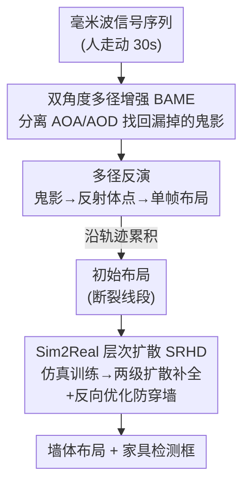

# RISE: Single Static Radar-based Indoor Scene Understanding

**会议**: CVPR 2026  
**论文**: [CVF Open Access](https://openaccess.thecvf.com/content/CVPR2026/html/Zhou_RISE_Single_Static_Radar-based_Indoor_Scene_Understanding_CVPR_2026_paper.html)  
**代码**: https://rise-cvpr.github.io  
**领域**: 3D视觉  
**关键词**: 毫米波雷达, 室内场景理解, 多径反射, 布局重建, 扩散模型

## 一句话总结
RISE 用一台**固定不动**的毫米波雷达，把传统被当噪声丢掉的"多径鬼影"反过来当几何线索，配合双角度信号增强（BAME）和仿真到真实的层次扩散（SRHD），首次实现单静态雷达下的室内墙体布局重建 + 家具检测，Chamfer 距离比 SOTA 降 60%（到 16 cm），家具检测 IoU 达 58%。

## 研究背景与动机
**领域现状**：室内场景理解长期依赖 RGB 相机和 LiDAR 这类光学传感器。它们空间分辨率高，但在智能家居/办公环境里有两个硬伤——会被墙体、家具遮挡（看不穿），还有隐私问题（摄像头一直拍人）。于是有人转向无线信号（WiFi、毫米波），因为它能穿透常见遮挡、且不像摄像头那样侵犯隐私。

**现有痛点**：现有无线方案要么分辨率太低、只能给出环境的零散小块；要么需要把雷达装在移动机器人上、让它满屋扫描，部署成本高。最关键的一个物理障碍是**镜面性（specularity）**：毫米波打到墙面这种光滑表面时，不像光学那样四处漫反射，而是像镜子一样按角度反射走。如果反射信号没回到传感器，这面墙就根本检测不到——所以单台静态雷达直接观测到的"可见区域"非常稀疏（论文 Fig.1）。

**核心矛盾**：单静态雷达既想保留"穿透+隐私"的优势，又被镜面反射困死——直接反射只能照亮环境一小块，大量墙面是"看不见的"。怎么在不移动传感器、不堆多台设备的前提下，把看不见的结构补出来？

**切入角度**：作者观察到，当**人在房间里走动**时会引入**多径效应**——信号经过二次/多次反射后才回到接收端，产生跟着人一起移动的"鬼影目标"（ghost target，如 radar→反射体→人→radar）。这些鬼影传统上被当噪声滤掉，但它们的几何位置其实**编码了墙面/反射体的位置信息**。

**核心 idea**：把多径鬼影从"噪声"翻转成"信号"——通过分析鬼影随时间的演化反解出一组反射体点（reflector），再用扩散模型把这些零碎反射体补成完整布局和物体，从而用一台不动的雷达"看见"看不见的房间。

## 方法详解

### 整体框架
RISE 的输入是一段毫米波信号序列（人在房间里走 30 秒，20 Hz 共约 600 帧），输出是房间的墙体布局多边形 + 家具的 2D 检测框。整条管线分三段串行：**先增强、再反解、后生成**。每帧信号先过 **BAME** 双角度增强，把常规波束成形会漏掉的"离对角线"鬼影找回来；增强后的观测交给**多径反演**，从鬼影几何反推出每帧的反射体点，再沿整条轨迹累积成一个粗糙的初始布局；这个初始布局是一堆断裂的线段，最后由 **SRHD（仿真到真实的层次扩散）** 补全成连续墙体和物体掩码，并用一次反向优化保证人走的轨迹不会"穿墙"。

### 关键设计

**1. 多径反演：把跟人移动的鬼影反解成墙面反射体**

这是整套方法的几何地基，针对的痛点是"单雷达直接只能看到稀疏可见区"。当静态雷达 S 观测移动的人 H 时，多径会产生鬼影。作者只保留快速衰减后仍可观测的一阶和二阶鬼影，按反射路径定义为 $G_1$（s→c1→h→s）、$G_1'$（s→h→c1→s）、$G_2$、$G_2'$ 四类（c1 是反射体，对应两跳/三跳路径）。识别流程是：先用 CFAR 检测在距离–角度图上找高能簇，再用 RANSAC 聚类，然后按四步规则把簇分配给不同鬼影——例如 H 选幅值 $m_i > \vartheta\max(m_i)$ 且距离最小的簇，$G_1$ 与 H 同方向但距离略大，$G_1'$ 与 $G_1$ 同距离但不同方向。两点若距离差 < 15 cm 或角度差 < 15° 就视为同一点（与真实空间分辨率一致）。

拿到鬼影后，关键一步是用几何关系把鬼影位置反解成**反射体点** $s_{c1}$（论文式(3)，由 $|\vec{sg_1'}|$、$|\vec{sh}|$ 和两个出射角差 $\theta^s_2-\theta^s_1$ 算出，⚠️ 具体推导见原文附录）。这些反射体点再经 GMM 聚类成空间连贯的簇、RANSAC 拟合出主导直线结构，就得到每帧的反射体几何。这一步把"看不见的墙"通过"看得见的鬼影"间接定位出来，是 RISE 能用静态雷达成像的根本原因。

**2. 双角度多径增强 BAME：救回被对角线假设抹掉的鬼影**

多径反演成不成立，取决于鬼影能不能稳定检测到。但作者实验发现鬼影的可见性在帧与帧之间剧烈跳变（同一个 $G_1'$ 在第 t 帧能看到、第 t+1 帧就消失了），这会让反射体估计极不稳定。根因被定位得很漂亮：常规雷达波束成形（式(2)）把收发天线合并成一个"虚拟阵列"索引，等价于**隐式假设到达角 AOA = 出射角 AOD**。这对直接反射没问题，但像 $G_1'$ 这种**一阶鬼影 AOA 和 AOD 本就不相等**——一旦它偏离 AOA=AOD 的对角线，就在距离–角度图里被压制甚至完全消失。

BAME 的做法是**把 AOA 和 AOD 分开处理**，重建完整的 Range–AOA–AOD 三维立方体（式(4)：内层求和编码 AOD 贡献、外层编码 AOA 分量）。具体四步：① Range FFT 得距离谱；② 双角度波束成形，分别对接收、发射维做 AOA/AOD 响应；③ 在三维立方体上用 3D CFAR 检测高能簇；④ **鬼影重整合**——把那些 AOA≠AOD 的离对角线簇重新插回距离–角度图当作有效鬼影。这样原本被对角线假设抹掉的多径分量被重新点亮，$G_1$ 和 $G_1'$ 能被一致检测，给后续布局推理一个稳健的初始先验。

**3. Sim2Real 层次扩散 SRHD：用仿真数据把断裂线段补成完整房间**

经过 BAME + 多径反演得到的初始布局只是一堆断裂线段，既连不成连续墙、也做不了物体检测。SRHD 要解决两个问题：补全 + 数据稀缺（这种雷达-到-布局的配对数据几乎不存在）。

为造数据，作者搭了一个**布局仿真引擎**：基于 35,000 张真实室内户型图，把每张转成 2D 结构骨架，随机摆放虚拟雷达，发射多条射线、每条只保留首个交点（模拟毫米波"只有最近表面反射"的物理特性），并插入 N 个随机包围盒当物体、每个选一条反射线段模拟材料相关的随机散射。再叠三种增强——随机缺失（删掉某角度区间的线段模拟遮挡）、随机旋转（按式(6)绕雷达中心旋转前景像素，模拟位姿误差）、随机缩放（按式(7)相对雷达径向缩放，模拟深度不确定性）——逼近真实噪声。

补全网络是一个**两级层次扩散**（Fig.6）：Stage 1 物体检测扩散 $f_1$ 从部分观测 O 预测二值物体图 $X_0 = f_1(O, X_{1000}; \theta_1)$，给出语义先验；Stage 2 墙体扩散 $f_2$ 同时吃 O 和 $X_0$ 重建完整墙体 $Y_0 = f_2(O, Y_{1000}, X_0; \theta_2)$，用通道注意力融合几何与语义线索。推理时还有一步**反向优化（空间一致性）**：沿人的运动轨迹 T，对潜在噪声 $X_{1000}, Y_{1000}$ 做基于碰撞的优化，最小化 $L_{overlap}=\sum_{(x_t,y_t)\in T}\left(\mathbb{1}[(x_t,y_t)\in W]+\mathbb{1}[(x_t,y_t)\in B]\right)$，即惩罚轨迹点落进墙 W 或物体 B 的区域。这等于用"人能走过去说明那里是自由空间"这一物理常识，把生成结果里穿墙/穿家具的不合理布局逼回到合法位置。

### 损失函数 / 训练策略
两级扩散在仿真数据上训练（Stage 1/2 各自的去噪目标），三种数据增强负责弥合仿真到真实的 gap；推理阶段冻结扩散权重、只把 $L_{overlap}$ 作为反向优化目标去微调潜在噪声变量，无需真实标注即可在线纠偏。

## 实验关键数据
数据集 RISE-Indoor：TI MMWCAS-RF-EVM 级联雷达固定在 1.2 m 高度，配 Intel Realsense 深度相机取 ground truth；11 种室内环境（办公室、走廊、实验室、客厅）、5 名志愿者随机行走、100+ 条 ~30 s 轨迹、共约 50,000 帧（20 Hz）。提供结构布局多边形 + 物体轴对齐框两级标注。

### 主实验：物体检测（IoU / Dice，跨 11 个场景平均）

| 方法 | 输入 | IoU (%) | Dice (%) |
|------|------|---------|----------|
| BRL [22] | 单帧 | 1.17 | 1.82 |
| EMT [9] + SRHD | 多帧 | 7.70 | 12.66 |
| **RISE（本文）** | 多帧 | **57.78** | **69.34** |

布局重建（100 条轨迹平均）：RISE 的 Chamfer 距离 **16.03 cm** vs EMT 的 39.06 cm（降约 60%），F1（15 cm 容差）**83.63** vs 63.43。这是首个能在单静态雷达下同时做布局重建 + 家具检测的系统，基线 EMT 根本无法检测小物体。

### 消融实验（布局重建，逐步加模块）

| 配置 | F1 (%) ↑ | Chamfer (cm) ↓ | 说明 |
|------|---------|----------------|------|
| Baseline (EMT) | 63.43 | 39.06 | 起点 |
| + G（鬼影增强 BAME） | 73.37 | 32.31 | 增强反射体可见性 |
| + G, D（再加扩散） | 78.84 | 19.82 | 生成式补全细节 |
| + G, D, R（全模型，再加反向优化） | **83.63** | **16.32** | 反向优化做最终纠偏 |

### 关键发现
- 三个模块**互补且逐级生效**：BAME 改善初始检测（39→32 cm），扩散负责整体重建（32→19.8 cm），反向优化做最后精修（19.8→16.3 cm），没有哪个能单独解决问题。
- **轨迹长度鲁棒**：即使只用 40% 长度的轨迹，RISE 的 Chamfer 仍低于 EMT 用全长轨迹的结果；但 F1 随轨迹变短下降更明显——因为输入信息减少时扩散模型输出更发散，而 F1 受误差阈值约束更敏感。
- 物体检测上基线几乎全场景为 0（BRL 平均仅 1.17 IoU），说明"小物体的反射体本就极难从单雷达恢复"，RISE 靠语义先验 + 生成补全才把它做了出来。

## 亮点与洞察
- **"噪声变信号"的视角翻转**：把传统被滤掉的多径鬼影当成几何线索，是整篇最"啊哈"的地方——同样的物理现象，换个解释就从障碍变成了资源。
- **AOA=AOD 假设的诊断很精准**：BAME 把"鬼影忽隐忽现"这个工程现象一路追到"虚拟阵列把双角度压成一维"的根因，再对症地恢复三维立方体，是信号处理层面很干净的修法，可迁移到其他多径/穿墙感知任务。
- **用人的轨迹当物理约束**：反向优化里"人走过的地方必然是自由空间"是一个几乎免费的强先验，把它写进生成模型的推理阶段去纠正穿墙，思路可借鉴到任何"有 agent 运动轨迹 + 场景重建"的设置。

## 局限与展望
- 作者承认目前主要针对**单人、较长轨迹**场景，多人同时走动会产生更复杂、相互干扰的多径，尚未解决；轨迹变短时 F1 明显掉点。
- 仿真引擎基于 2D 户型骨架 + 轴对齐框，对复杂三维家具、曲面墙、斜墙的建模可能不足；⚠️ 论文重建主要是 2D top-down 布局，并非完整 3D 体素重建，"scene understanding" 的维度有限。
- 强依赖"有人走动诱发多径"，空房间或人静止不动时该方法可能失效——这既是优势来源也是适用范围限制。

## 相关工作与启发
- **vs EMT [9]（静态雷达多径布局重建）**：EMT 同样用静态雷达 + 多径，但受视场盲区和鬼影可见性不一致拖累、只能重建大墙面、无法识别小家具。RISE 用 BAME 缓解鬼影忽隐忽现、用 SRHD 补全，并首次把能力扩展到家具检测。
- **vs 移动雷达扫描方案**：把雷达装在机器人上主动扫描虽精度高，但部署开销大、不适合"复用已有路由器/AP"的智能家居设想；RISE 的卖点是**单台、固定、复用现有设备**。
- **vs 光学（RGB/LiDAR）**：光学分辨率高但有遮挡和隐私问题；RISE 牺牲分辨率换来穿透性和隐私保护，定位互补而非替代。

## 评分
- 新颖性: ⭐⭐⭐⭐⭐ 首个单静态雷达同时做布局重建+家具检测，"鬼影即信号"+ BAME 的 AOA/AOD 分离都很原创。
- 实验充分度: ⭐⭐⭐⭐ 100 条真实轨迹/11 环境/5 万帧，消融清晰；但缺多人、缺与更多无线基线的横向对比。
- 写作质量: ⭐⭐⭐⭐ 从镜面性痛点到鬼影几何的推导链条清楚，部分公式符号需对照原文附录。
- 价值: ⭐⭐⭐⭐⭐ 隐私保护 + 穿透遮挡的室内感知，对智能家居/AR/安防有明确落地价值，并贡献首个公开 benchmark。

<!-- RELATED:START -->

## 相关论文

- [\[CVPR 2026\] Consistent Instance Field for Dynamic Scene Understanding](consistent_instance_field_for_dynamic_scene_understanding.md)
- [\[CVPR 2026\] CustomTex: High-fidelity Indoor Scene Texturing via Multi-Reference Customization](customtex_high-fidelity_indoor_scene_texturing_via_multi-reference_customization.md)
- [\[CVPR 2026\] AdaSFormer: Adaptive Serialized Transformers for Monocular Semantic Scene Completion from Indoor Environments](adasformer_adaptive_serialized_transformers_for_monocular_semantic_scene_complet.md)
- [\[CVPR 2026\] PointTPA: Dynamic Network Parameter Adaptation for 3D Scene Understanding](pointtpa_dynamic_network_parameter_adaptation_for_3d_scene_understanding.md)
- [\[CVPR 2026\] Lifting Unlabeled Internet-level Data for 3D Scene Understanding](lifting_unlabeled_internet-level_data_for_3d_scene_understanding.md)

<!-- RELATED:END -->
