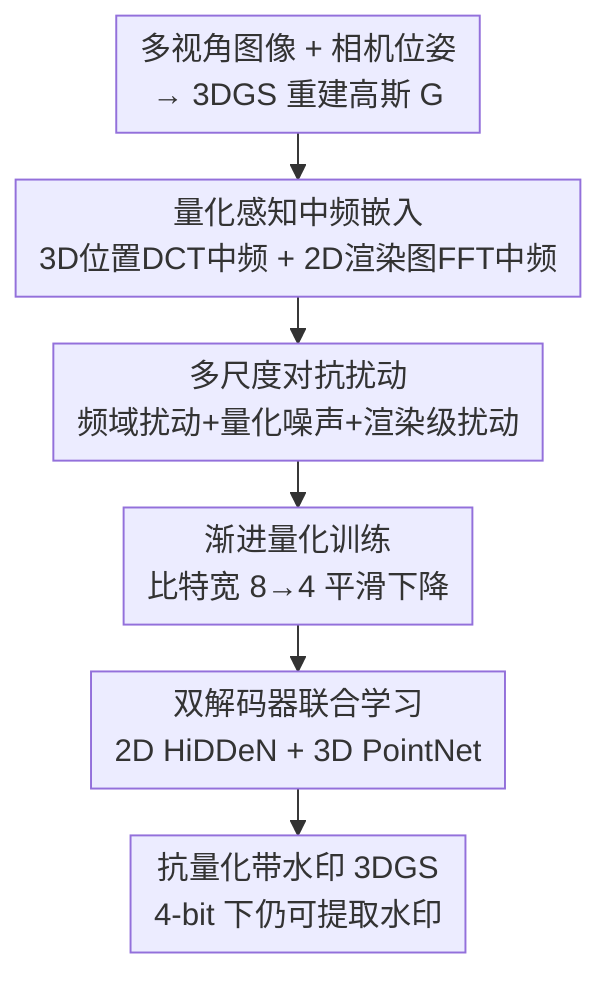

# Robust3DGSW: Toward Robust Watermarking for Quantization-Aware 3D Gaussian Splatting

**会议**: CVPR 2026  
**论文**: [CVF Open Access](https://openaccess.thecvf.com/content/CVPR2026/html/Wang_Robust3DGSW_Toward_Robust_Watermarking_for_Quantization-Aware_3D_Gaussian_Splatting_CVPR_2026_paper.html)  
**代码**: 待确认  
**领域**: 3D视觉  
**关键词**: 3D高斯泼溅, 数字水印, 量化感知, 中频嵌入, 对抗扰动

## 一句话总结
针对"把 3DGS 模型量化到低比特后水印会被抹掉、渲染质量也崩"的问题，Robust3DGSW 提出一个两阶段量化感知水印框架：第一阶段把水印嵌进 3D 高斯位置与 2D 渲染图的**中频带**抵抗量化损失，第二阶段用多尺度对抗扰动 + 渐进量化训练双解码器，使得在 4-bit 量化下水印提取准确率仍能 >80%，同时保持高质量渲染。

## 研究背景与动机
**领域现状**：3D 高斯泼溅（3DGS）已成为实时辐射场渲染的主流，随之而来的是对 3D 资产版权保护的需求，数字水印是公认有效的手段。已有 3DGS 水印工作（GaussianMarker、3D-GSW、GS-Hider 等）能把隐藏信息嵌进高斯模型或其渲染图。

**现有痛点**：高质量 3DGS 模型由海量高斯组成、参数文件巨大，部署到移动/边缘设备必须做模型量化压缩。但现有水印方法**完全没考虑量化**，于是出现两个致命问题（图 1）：其一，量化越狠水印提取准确率掉得越惨——3D-GSW 在 32-bit 下提取准确率 98%，到 4-bit 只剩 61%，叠加各种失真攻击后更低；其二，量化把渲染质量也拖垮，32-bit PSNR 35 dB，4-bit 只有约 10 dB。

**核心矛盾**：根本原因是量化会给高斯参数引入舍入误差，这些误差经 alpha-blending 逐层传播，既破坏渲染又抹掉嵌入的水印信号；尤其现有方法把水印放在**空间域/高频**，而 4-bit 舍入恰恰优先抹掉高频细节。更糟的是，现有水印解码器是在全精度模型上训练的，根本没见过量化噪声，部署时直接提取失败。

**本文目标**：在不牺牲渲染质量的前提下，让水印在激进量化（甚至 4-bit）下仍能被可靠提取——拆成"怎么嵌得抗量化"和"怎么训出能在量化下解码的解码器"两个子问题。

**切入角度**：作者观察到频带对量化的敏感度不同——低频改一点就破坏整体外观（违反感知质量），高频极易被量化抹掉，唯有**中频**落在人眼恰可觉察差阈（JND）以下、又对量化诱导的信号损失有较强抗性。这正是"既不破坏画质又抗量化"的甜点区。

**核心 idea**：把水印嵌进 3D 高斯位置和 2D 渲染图**双模态的中频带**抵抗量化，再用"多尺度对抗扰动 + 渐进降比特"训练 2D/3D 双解码器，让解码器主动适应量化伪影——这是已知第一个把量化纳入考量的 3DGS 水印方法。

## 方法详解

### 整体框架
Robust3DGSW 的输入是多视角图像及相机位姿，先用标准 3DGS 重建出高斯表示；输出是一个"带水印且抗量化"的 3DGS 模型，量化部署后水印仍可从渲染图或高斯参数中提取。整体分两阶段：**第一阶段·量化感知水印嵌入**——同时在 3D 高斯位置（经 3D DCT）和 2D 渲染图（经 2D FFT）的中频带注入水印噪声，得到带水印高斯 $\tilde G$ 和带水印图 $\tilde I_{wm}$；**第二阶段·量化感知解码器学习**——在渐进降比特（8→4 bit）的同时，对高斯特征和渲染图施加多尺度对抗扰动，联合训练 2D（HiDDeN）和 3D（PointNet）双解码器，用总损失 $L_{total}$ 优化。两阶段协同，使水印保存与渲染能力同时最大化。

### 关键设计

**1. 量化感知中频嵌入：把水印放进对量化最"耐造"的频带**

痛点是空间域/高频水印在 4-bit 量化下被舍入误差优先抹掉。Robust3DGSW 选择**中频带**作为嵌入位置，并在 3D 与 2D 双模态都做。3D 侧：从高斯取出位置矩阵 $M=[\mu_1,\dots,\mu_N]^T$，对每个轴 $d$ 做 1D DCT 得频率系数 $F^{3D}_{k,d}$，选取中频段 $k\in[\lfloor N/8\rfloor,\lfloor 3N/8\rfloor]$，以加噪方式嵌入 $\tilde F^{3D}_{k,d}=F^{3D}_{k,d}+\alpha_{3D}\cdot\mathcal{N}(0,\sigma_{3D}^2)$（默认 $\alpha_{3D}=1.0,\sigma_{3D}=0.001$），再 IDCT 回空间域更新高斯位置。2D 侧（Image Quality Enhancement）：对渲染图每个颜色通道做 2D FFT 并 fftshift 居中 DC，取半径在 $[\tfrac18\min(H,W),\tfrac38\min(H,W)]$ 的中频环形区域加噪 $\tilde F^{2D}_c=F^{2D}_c+\alpha_{2D}\cdot\mathcal{N}(0,\sigma_{2D}^2)$，再 IFFT 回图像。之所以有效：低频改动破坏整体外观、高频极易被量化抹除，唯有中频在 JND 以下且抗量化，双模态嵌入还互为冗余（3D 抗量化、2D 给解码器额外提取通道）。

**2. 多尺度对抗扰动：在训练中提前"预演"量化与失真**

痛点是解码器若只在干净/全精度数据上学，部署时遇到量化噪声和几何失真就提取失败。作者在解码器学习时对 3D 高斯特征和 2D 渲染图同时施加三类扰动——频域扰动、量化噪声、渲染级扰动（高斯噪声、JPEG 压缩模拟、高斯模糊、随机缩放裁剪）：

$$\tilde f_{3D}=Q(f_{3D}+\epsilon_{DCT},\,b(p))+\mathcal{N}(0,\sigma_q(b)),\quad \hat I=A_{render}(Q(\tilde I_{wm}+\epsilon_{FFT},\,b(p)))$$

其中训练进度 $p\in[0,1]$，比特调度 $b(p)=\lceil 8-4p\rceil$ 从 8 渐降到 4 bit，量化噪声方差 $\sigma_q(b)=0.01\cdot(8-b)/4$ 随比特降低而增大。这种"随训练进度逐步加大扰动强度"的渐进对抗策略，让双解码器学到对真实部署失真鲁棒的提取能力，消融显示它对抗失真场景贡献最大。

**3. 渐进量化训练：从 8-bit 平滑过渡到 4-bit 避开坏局部最优**

痛点是一上来就用大量 4-bit 量化训练，损失面高度非凸，容易陷入坏局部最优、训练不稳甚至不收敛。作者用渐进量化（沿 $b(p)=\lceil 8-4p\rceil$ 调度）配合 continuation method，让训练从稳定的 8-bit 环境平滑过渡到激进的 4-bit。优化目标对整个比特宽分布求期望而非死磕 4-bit：

$$\theta^*_{dec}=\arg\min_\theta\ \mathbb{E}_{p\sim U(0,1)}\big[L(\theta;b(p))\big],\quad L(\theta;b(p))=L_{2D}(\hat I)+L_{3D}(\tilde f_{3D})+L_{reg}$$

这样解码器逐步适应量化伪影、保住高精度模式，避免性能骤降，消融里去掉它时 4-bit 准确率从 87.51% 掉到 67.42%。

**4. 双解码器协同：2D 图像解码器 + 3D 几何解码器互相约束**

单一模态解码器易过拟合到自己域里的噪声。作者用 HiDDeN 作 2D 解码器 $D_\chi$ 从渲染图提取水印，并接一个轻量线性 adapter $A_{adapt}$ 以适配可变水印长度 $M$；用 PointNet 作 3D 解码器 $D_\phi$ 处理完整 14 维高斯属性 $f_{3D}\in\mathbb{R}^{N\times14}$（PointNet 提点特征 → MaxPool 聚合 → MLP 出预测）。为防两个解码器学出分歧映射，加跨解码器一致性损失 $L_{cons}=\|\sigma(w_{2D})-\sigma(w_{3D})\|_2$ 强制二者输出同一水印——这让一个解码器过拟合到自身域噪声时，另一个能拉回真实信号，提升整体鲁棒性。

### 损失函数 / 训练策略
总损失 $L_{total}=\lambda_{2D}L_{2D}+\lambda_{3D}L_{3D}+\lambda_{cons}L_{cons}+L_{rec}$，权重随渐进训练步进变化。其中 $L_{2D}=\mathrm{BCE}(D_{2D}(\hat I),m)$、$L_{3D}=\mathrm{BCE}(D_{3D}(\tilde f_{3D}),m)$ 为双解码器的二元交叉熵；一致性损失 $L_{cons}$ 如上；正则 $L_{rec}=\lambda_{bal}L_{balance}+\lambda_{batch}L_{batch}$，其中平衡损失 $L_{balance}=\tfrac1M\sum_i(\mathbb{E}_{batch}[\sigma(w_i)]-0.5)^2$ 让每个比特保持 50% 激活率防比特偏置，批一致性损失 $L_{batch}=\mathbb{E}_{\epsilon\sim\mathcal{N}(0,10^{-6})}[\|D(x)-D(x+\epsilon)\|^2]$ 保证小扰动下输出稳定。每个场景做 2000 次渐进量化感知迭代，2D/3D 解码器学习率分别 $2\times10^{-4}$、$3\times10^{-4}$（Adam + 余弦退火），默认水印 48 bit。

## 实验关键数据

### 主实验
在 Blender、LLFF、MipNeRF360 三个数据集上与四个基线（GaussianMarker、3D-GSW、StegaNeRF+3DGS、HiDDeN+3DGS）对比。无量化时 Robust3DGSW 在所有指标全面领先：比特准确率比 SOTA 高最多 2.37%，PSNR/SSIM/LPIPS 三项显著更好。4-bit 量化下优势进一步放大——作者方法在各种失真下仍 >80% 准确率，而 3D-GSW 仅约 60%。

| 量化设置 | 方法 | 比特准确率 | 渲染质量 |
|----------|------|-----------|----------|
| 无量化 | 4 个基线 | 较低 | 较低 PSNR/SSIM |
| 无量化 | **Robust3DGSW** | 最高（+最多 2.37%） | PSNR/SSIM/LPIPS 全面领先 |
| 4-bit | 3D-GSW | 约 60% | 显著退化 |
| 4-bit | **Robust3DGSW** | **>80%（各失真下）** | PSNR 仍明显更高 |

> 注：原文主对比以柱状图（图 3-6）呈现，上表为定性归纳；4-bit 各失真 >80% 与 3D-GSW 约 60% 为文中明确数值，其余以原文图为准。

### 消融实验
MipNeRF360 上逐组件消融（三数据集平均，论文 Table 1，Complete 为完整模型）：

| 配置 | 4-bit 准确率 | Blur 失真准确率 | Crop 失真准确率 | PSNR (dB) |
|------|-------------|----------------|----------------|-----------|
| Complete | **87.51** | **82.52** | **82.79** | **20.46** |
| w/o 水印鲁棒增强(中频→高频) | 72.57 | 65.76 | 67.68 | 14.26 |
| w/o 图像质量增强(2D 嵌入) | 78.56 | 71.29 | 75.35 | 18.68 |
| w/o 多尺度对抗扰动 | 71.57 | 67.26 | 65.78 | 19.83 |
| w/o 渐进量化训练 | 67.42 | 64.59 | 61.47 | 18.67 |
| w/o 解码器训练 | 51.78 | 46.59 | 50.13 | 19.36 |

### 关键发现
- 解码器训练是底线：去掉后 4-bit 准确率塌到 51.78%（接近随机），说明"让解码器见过量化/扰动"才是水印能被提取的根本。
- 渐进量化训练对低比特最关键：去掉它 4-bit 准确率从 87.51% 掉到 67.42%，印证直接 4-bit 训练会陷坏局部最优。
- 中频嵌入对画质与抗量化双赢：把鲁棒增强换回高频后 PSNR 从 20.46 跌到 14.26、各失真准确率全面下滑，验证中频确是"既保画质又抗量化"的甜点。
- 多尺度对抗扰动专治失真：去掉后在 Crop/Blur 等失真下掉点最猛（如 Crop 82.79→65.78），说明它主要贡献来自失真鲁棒性。

## 亮点与洞察
- 第一个把"量化"显式纳入 3DGS 水印设计的工作，问题定义本身就抓住了边缘部署的真实痛点（大模型必量化、量化即抹水印）。
- "中频甜点区"的洞察很可迁移：低频伤画质、高频被量化抹、中频两全——这套频带选择逻辑可借鉴到其他需要抗有损压缩的隐写/水印任务。
- 用"渐进降比特 + continuation"把量化感知训练的非凸难题化解，是把数值优化里的延拓思想搬进低比特 3DGS 训练的巧妙一招。
- 双模态冗余（3D 几何 + 2D 图像）+ 跨解码器一致性，让单一通道被失真破坏时另一通道仍能兜底，鲁棒性来自结构冗余而非单点加固。

## 局限与展望
- 嵌入强度/噪声尺度等超参（$\alpha_{3D},\sigma_{3D},\alpha_{2D},\sigma_{2D}$）大量沿用已有工作 [9] 的默认值，论文正文未充分给出其敏感性分析（放在附录），不同场景下是否需重调存疑。
- 评测局限在 NeRF 类合成/前向/无界三类静态场景，未涉及动态 3DGS 或更大规模街景；水印仅 48-bit，更长负载下的容量-鲁棒权衡未探讨。
- 中频带边界（$N/8\sim3N/8$、半径 $1/8\sim3/8$）是经验设定，缺乏对"为何是这个区间最优"的系统搜索；面向更激进 2/1-bit 量化时渲染 PSNR 仍明显下滑（图 6），鲁棒性也会到达极限。

## 相关工作与启发
- **vs GaussianMarker**: 它用 Fisher 信息/不确定性引导在空间域选稳定高斯嵌入，但把水印均匀撒到约 70% 高斯上，对局部失真（裁剪）脆弱且未考虑量化；本文嵌中频且量化感知训练，4-bit + 失真下大幅领先。
- **vs 3D-GSW**: 它用频率引导致密化做鲁棒水印，但仍是全精度训练、偏高频，量化到 4-bit 后准确率从 98% 崩到 61%；本文中频 + 渐进量化把 4-bit 准确率拉回 >80%。
- **vs StegaNeRF / HiDDeN + 3DGS**: 它们把 NeRF 隐写或图像级 HiDDeN 直接套到 3DGS，本质是图像/隐写迁移、未针对 3DGS 量化设计；本文双模态中频 + 双解码器协同，专为量化部署场景，鲁棒性与画质同时更优。

## 评分
- 新颖性: ⭐⭐⭐⭐⭐ 首个量化感知 3DGS 水印，中频甜点 + 渐进量化训练组合切中真实痛点。
- 实验充分度: ⭐⭐⭐⭐ 三数据集、四基线、多失真 + 完整组件消融，但主结果多为柱状图、超参敏感性放附录略可惜。
- 写作质量: ⭐⭐⭐⭐ 动机—频带分析—两阶段方法链条清晰，图 1/2/6 把问题与方案讲得直观。
- 价值: ⭐⭐⭐⭐⭐ 面向边缘部署的 3D 资产版权保护，量化下仍可靠，落地意义明确。

<!-- RELATED:START -->

## 相关论文

- [\[CVPR 2026\] Mark4D: Temporally-Consistent Watermarking for 4D Gaussian Splatting](mark4d_temporally-consistent_watermarking_for_4d_gaussian_splatting.md)
- [\[CVPR 2026\] HeroGS: Hierarchical Guidance for Robust 3D Gaussian Splatting under Sparse Views](herogs_hierarchical_guidance_for_robust_3d_gaussian_splatting_under_sparse_views.md)
- [\[CVPR 2026\] AERGS-SLAM: Auto-Exposure-Robust Stereo 3D Gaussian Splatting SLAM](aergs-slam_auto-exposure-robust_stereo_3d_gaussian_splatting_slam.md)
- [\[CVPR 2026\] ULF-Loc: Unbiased Landmark Feature for Robust Visual Localization with 3D Gaussian Splatting](ulf-loc_unbiased_landmark_feature_for_robust_visual_localization_with_3d_gaussia.md)
- [\[CVPR 2026\] Part$^{2}$GS: Part-aware Modeling of Articulated Objects using 3D Gaussian Splatting](part2gs_part-aware_modeling_of_articulated_objects_using_3d_gaussian_splatting.md)

<!-- RELATED:END -->
