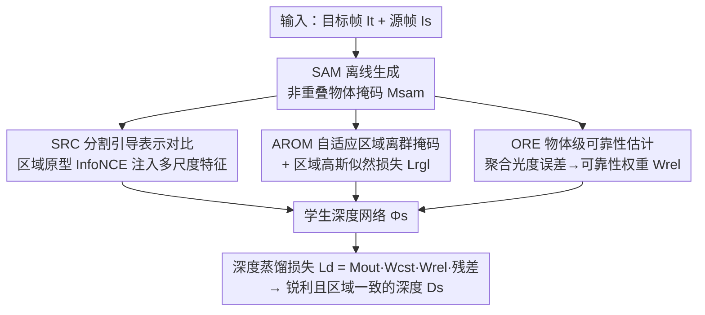

# RoSAMDepth: Robust Self-supervised Depth Estimation Leveraging Segment Anything Model

**会议**: CVPR 2026  
**论文**: [CVF Open Access](https://openaccess.thecvf.com/content/CVPR2026/html/Gao_RoSAMDepth_Robust_Self-supervised_Depth_Estimation_Leveraging_Segment_Anything_Model_CVPR_2026_paper.html)  
**代码**: https://github.com/xagao/RoSAMDepth  
**领域**: 3D视觉 / 自监督深度估计  
**关键词**: 自监督深度估计, SAM 物体级先验, 鲁棒深度, 对比表示学习, 伪标签可靠性

## 一句话总结
RoSAMDepth 把 SAM 离线生成的物体级掩码当作先验，从「表示空间对比」「区域级离群点抑制 + 高斯似然平滑」「物体级可靠性加权」三个角度注入到自监督单目深度框架中，让模型在夜间、雨天等恶劣条件下预测出边界更锐利、物体内部更一致的深度。

## 研究背景与动机
**领域现状**：自监督单目深度估计用立体对或单目视频的几何约束（光度重建一致性）替代昂贵的真值深度，在标准白天场景已经做得不错（Monodepth2、SfM-Learner 等）。

**现有痛点**：到了夜间、雨、雾等恶劣条件，光度一致性假设崩溃，深度质量急剧下降。近期工作（md4all、Robust-Depth、Syn2Real-Depth）靠 GAN 天气增广 + 教师-学生蒸馏或合成到真实的自适应来追求统一鲁棒性，但它们把退化区域**一视同仁**地处理，忽略了语义/物体级差异——结果就是物体内部深度发散、边界模糊，甚至把背景建筑误判成连续的前景。

**核心矛盾**：深度应当在「同一连续物体区域内部平滑」，又要在「物体边缘处允许锐利的深度跳变」；而现有方法既缺乏物体级的空间关系理解，也无法在物体层面评估深度线索的可靠性。常规边界感知平滑损失只在图像边缘附近产生梯度，对「内部错误但局部平滑」的区域无能为力；常规像素级伪标签质量指标又因为同物体像素外观相似而产生「假可靠」。

**本文目标**：把物体级信息系统性地引入鲁棒自监督深度，分解为两个子问题——（1）如何让特征空间具备物体感知；（2）如何用物体先验改造监督信号（平滑约束 + 伪标签可靠性）。

**切入角度**：作者注意到语义分割受限于预定义类别、无法区分同类不同实例、跨域泛化差；而 SAM 是在海量多样数据上预训练的通用分割模型，能分实例、对未见物体和天气都有强零样本鲁棒性，因此天然适合当物体级先验来源。关键是 SAM 掩码**全部离线预生成**，训练时不引入额外推理开销。

**核心 idea**：用 SAM 的物体级掩码同时改造「表示学习」与「深度监督」——掩码引导的区域原型对比让特征物体感知，区域离群点掩码 + 高斯似然损失强制区域平滑，物体级可靠性估计把蒸馏监督聚焦到可信区域。

## 方法详解

### 整体框架
RoSAMDepth 建立在 Syn2Real-Depth 的「合成自适应 → 真实自适应」范式之上，沿用其合成阶段训练好的固定教师网络 $\Phi_t$，本文只改造真实自适应阶段的学生网络 $\Phi_s$（从教师初始化）。输入是目标帧 $I_t$ 与相邻源帧 $I_s$，监督来自光度重投影一致性；额外输入是 SAM 在「segment-everything」模式下离线生成、再做非重叠后处理的物体掩码 $M_{sam}$。整个 pipeline 围绕两条互补的线展开：一条是**物体感知表示学习**（SRC 把分割先验注入多尺度解码特征），另一条是**带物体级先验的深度学习**（AROM 生成离群抑制掩码 $M_{out}$ 配合区域高斯似然损失 $L_{rgl}$ 强制区域平滑，ORE 估计物体级可靠性形成加权图 $W_{rel}$），两者最终共同调制深度蒸馏损失 $L_d$ 来训练学生深度 $D_s$。

### 关键设计

**1. SRC 分割引导表示对比：在特征层而非深度层注入物体感知**

针对「现有方法缺乏物体级空间关系理解」的痛点，SRC 用 SAM 掩码做基于区域原型的对比学习，把分割先验迁移进深度解码器的多尺度特征空间。具体地，对每个尺度 $s$ 先用最近邻插值把掩码缩放到该层分辨率得到 $M^{(s)}_{sam}$，再对每个分割区域内的像素特征做通道归一化后的平均，得到落在单位超球面上的区域原型 $pt^{(s)}_i = \frac{1}{|M^{(s)}_{sam,i}|}\sum_{(x,y)\in M^{(s)}_{sam,i}} F^{(s)}_{x,y}$；然后用 InfoNCE 形式 $L_{src}$ 拉近每个像素特征与其所属区域原型、推远其它区域原型，让同区域特征形成紧凑簇。一个关键的设计选择是：对比放在**特征层**而非直接约束最终深度。因为 SAM 常把单个物体过分割成多块，若在每条分割边界强行制造深度不连续会引入错误监督；放在特征空间则让网络**隐式**学到物体感知表示，而不显式改写深度值。消融（Tab.5）显示，直接把 SRC 加在预测深度 $D_s$ 上反而掉点（夜间 AbsRel 0.1694 vs 本文 0.1667），印证了这一判断。

**2. AROM + 区域高斯似然损失：把平滑约束从「物体边界」扩展到「物体区域」**

常规一阶导平滑损失 $L_{sm}=|\partial_x d^*|e^{-|\partial_x I|}+|\partial_y d^*|e^{-|\partial_y I|}$ 用图像边缘当权重避免跨边界惩罚，但它只在深度边界附近产生强梯度；对「内部估计错误却局部平滑」的区域（如被误判成前景的背景建筑），$|\partial d^*|$ 很小，损失误以为深度连续而不响应。AROM 把这类错误重新理解为「同一物体内部的区域离群点」。它先对每个物体 $M_{sam,i}$ 算教师逆深度的均值 $d_{t,i}$ 和标准差 $\sigma_{t,i}$，得到稠密偏差图 $\delta=\sum_i M_{sam,i}\cdot|d_t-d_{t,i}|/\sigma_{t,i}$；再用一个**自适应阈值** $\tau=\sum_i M_{sam,i}(\tau_0+\lambda\sigma_{t,i})$——在高方差区域（如地面、建筑表面）放宽离群判定、在均匀区域收紧——比较得到离群抑制掩码 $M_{out}=1-S_\kappa(S(\delta-\tau))$。配套的区域高斯似然损失把每个区域的逆深度建模成 $\mathcal{N}(d_{t,i},\sigma_{t,i})$，并用 $1-M_{out}$ 加权 $L_{rgl}=(1-M_{out})\cdot\sum_i M_{sam,i}\cdot(d_s-d_{t,i})^2/\sigma^2_{t,i}$，把监督集中到离群区域，从而在错误区域产生强、非局部的梯度。$M_{out}$ 还身兼二职：既引导 $L_{rgl}$，又在蒸馏损失里抑制离群引发的误差传播。消融（Tab.4）显示该组合优于图像边缘或 SAM 边界版的边界感知平滑损失。

**3. ORE 物体级可靠性估计：把伪标签可靠性从像素级提升到物体级**

像素级光度误差当伪标签可靠性指标有个根本缺陷：同物体像素外观相似会造成「偶然对齐」，即便整体深度被错误缩放，内部区域的光度误差仍然偏低、显得「假可靠」（论文 Fig.4 把车的深度缩放 0.25–4.0 倍，像素误差只在局部变化）。ORE 改为在物体层面评估可靠性。先按常规算像素光度误差 $pe=\alpha\cdot L1(I_t,I_{t'})+(1-\alpha)\cdot SSIM(I_t,I_{t'})$，再用 SAM 掩码聚合成每个区域的平均误差 $\overline{pe_i}$，并与全图平均误差 $\overline{pe}$ 比较得到可靠性图 $R=\sum_i M_{sam,i}\cdot\exp(-\beta\max\{0,\overline{pe_i}-\overline{pe}\}/\overline{pe})$；最终构造加权图 $W_{rel}=R+\epsilon$（$\epsilon$ 为偏置以保留弱监督）。直觉是：误差显著偏离全局的物体被整体判为低可靠。这样错误缩放的整辆车会被正确识别为不可靠区域，而不是只标出零散像素。

### 损失函数 / 训练策略
最终深度蒸馏损失为 $L_d=M_{out}\cdot W_{cst}\cdot W_{rel}\cdot\frac{D_s-D_t}{D_s}$（$W_{cst}$ 为基线 Syn2Real-Depth 的一致性重加权图）；总损失 $L_{total}=L_d+\lambda_1 L_{src}+\lambda_2 L_{rgl}+L_{ext}$，$L_{ext}$ 为沿用基线的辅助损失。教师 $\Phi_t$ 用基线提供的合成预训练模型、不微调；学生 $\Phi_s$ 从教师初始化、训练 10 epoch，Adam 优化、batch 10、初始学习率 $8\times10^{-5}$、每 5 epoch 衰减 0.5。SAM 用现成的 ViT-H 默认模型，掩码全部训练前离线生成。

## 实验关键数据

### 主实验
nuScenes（覆盖白天-晴、夜间、白天-雨三种条件），相对最强基线 Syn2Real-Depth 平均相对提升 AbsRel 2.8% / SqRel 2.7% / RMSE 0.6% / δ1 0.9%（平均自所有条件与单帧/多帧设置）。下表摘取夜间与白天-雨的单帧结果：

| 数据集/条件 | 指标 | 本文(单帧) | Syn2Real-Depth | md4all-DD |
|--------|------|------|----------|------|
| nuScenes 夜间 | AbsRel↓ | **0.1742** | 0.1792 | 0.1921 |
| nuScenes 夜间 | δ1↑ | **72.52** | 71.08 | 71.07 |
| nuScenes 白天-雨 | AbsRel↓ | **0.1298** | 0.1331 | 0.1414 |
| nuScenes 白天-雨 | RMSE↓ | **6.801** | 6.926 | 7.228 |

Oxford RobotCar（仅单帧测试），相对 Syn2Real-Depth 提升 AbsRel 4.4% / SqRel 7.6% / RMSE 4.7% / δ1 0.9%：

| 条件 | 指标 | 本文 | Syn2Real-Depth | md4all-DD |
|------|------|------|----------|------|
| RobotCar 白天 | AbsRel↓ | **0.1006** | 0.1063 | 0.1128 |
| RobotCar 夜间 | AbsRel↓ | **0.1066** | 0.1103 | 0.1219 |
| RobotCar 夜间 | δ1↑ | **87.03** | 86.15 | 84.86 |

> 注：AbsRel/SqRel/RMSE 为深度误差（越低越好），δ1 为阈值精度百分比（越高越好）；ground truth 评测范围 nuScenes 为 0.1–80 m、RobotCar 为 0.1–50 m。

### 消融实验
组件逐项消融（nuScenes 夜间）：

| 配置 (SRC / AROM / Lrgl / ORE) | AbsRel↓ | δ1↑ | 说明 |
|------|---------|-----|------|
| 仅 ORE | 0.1734 | 73.14 | 单组件 |
| 仅 SRC | 0.1725 | 73.21 | 单组件 |
| 仅 AROM | 0.1711 | 73.24 | 单组件 |
| AROM+Lrgl | 0.1699 | 73.67 | 平滑组合 |
| AROM+Lrgl+ORE | 0.1673 | 73.89 | 加可靠性 |
| Full（四件全开） | **0.1667** | **73.95** | 完整模型 |

专项消融：平滑损失（Tab.4，夜间 AbsRel）——图像边缘感知 0.1735 / SAM 边界感知 0.1732 / 本文 AROM+Lrgl **0.1699**；SRC 实现位置（Tab.5）——加在深度 $D_s$ 上 0.1694 / 加在特征上（本文）**0.1667**。

### 关键发现
- SRC 单独用收益有限，但与其它组件组合时作用关键：只有当预测深度逐渐对齐 SAM 掩码时，特征层增强才真正生效；直接约束深度反而被 SAM 过分割引入的噪声拖累。
- AROM 与 $L_{rgl}$ 缺一不可：去掉 AROM 则蒸馏损失无法抑制伪标签离群点，去掉 $L_{rgl}$ 则缺少区域级平滑监督，单留任一都掉点。
- 物体级可靠性（ORE）比像素级指标更能识别「整体被错误缩放但内部假可靠」的物体，让蒸馏监督聚焦到真正可信的区域。

## 亮点与洞察
- 把「平滑约束的失效」重新诊断为「物体内部的区域离群点」问题，是很漂亮的视角转换：常规损失在错误但局部平滑的区域不响应，AROM 用区域统计 + 自适应阈值把这些区域显式拎出来给强梯度。
- ORE 用一个反例（缩放整车深度而像素误差几乎不变）直观点出像素级伪标签指标的根本缺陷，再用区域聚合误差对比全局均值解决，思路可迁移到任何依赖光度一致性当可靠性代理的自监督任务。
- 全程把 SAM 当**离线先验**用，训练/推理都不引入 SAM 前向，几乎零额外推理开销，工程上很实用。
- $M_{out}$ 一图两用（既驱动 $L_{rgl}$ 又抑制蒸馏误差传播）是个省力的复用设计。

## 局限与展望
- 强依赖 SAM 掩码质量与离线生成流程，SAM 的过分割正是 SRC 必须放在特征层的根因；若场景中 SAM 表现差（极端低光/严重退化），物体先验本身可能不可靠。
- 方法建立在 Syn2Real-Depth 的合成→真实范式与其固定教师之上，继承了该范式对合成数据与教师质量的依赖；本文只改造真实自适应阶段。⚠️ 合成阶段与位姿网络训练细节未在正文展开，需查补充材料。
- 仅在自动驾驶类数据集（nuScenes、Oxford RobotCar）验证，室内/更一般场景的泛化未测；RMSE 维度的提升相对 AbsRel 偏小（nuScenes 仅 0.6%）。
- 多个超参（$\tau_0,\lambda,\kappa,\beta,\epsilon,\lambda_1,\lambda_2$）未给敏感性分析，实际部署的调参成本未知。

## 相关工作与启发
- **vs Syn2Real-Depth（基线）**：两者都走合成→真实自适应、教师-学生蒸馏；本文在真实自适应阶段额外注入 SAM 物体级先验（SRC/AROM/ORE），在几乎所有指标与条件上稳定超过基线，核心区别是「物体级 vs 一视同仁的退化处理」。
- **vs md4all / Robust-Depth / WeatherDepth**：它们靠 GAN 天气增广 + 教师-学生提升鲁棒性，但仍均匀处理所有区域；本文用物体级先验细化表示与监督信号，边界更锐、物体内部更一致。
- **vs 用语义分割引入物体信息的深度方法**：语义分割无法区分同类不同实例、类别集合固定、跨域泛化差；SAM 分实例、零样本鲁棒、对天气更稳，是更好的物体先验来源。

## 评分
- 新颖性: ⭐⭐⭐⭐ 首次把 SAM 离线掩码系统性用于鲁棒自监督深度，且三个角度各有独立洞察（尤其 AROM 的区域离群视角、ORE 的物体级可靠性）。
- 实验充分度: ⭐⭐⭐⭐ 两个驾驶数据集多条件 + 组件/损失/SRC 位置多项消融较扎实，但缺超参敏感性与室内泛化。
- 写作质量: ⭐⭐⭐⭐ 用 Fig.3/Fig.4 反例把动机讲得很清楚，公式与组件对应明确。
- 价值: ⭐⭐⭐⭐ 恶劣条件深度鲁棒性对自动驾驶有实际意义，离线 SAM 先验思路易复用。

<!-- RELATED:START -->

## 相关论文

- [\[CVPR 2026\] Depth Any Panoramas: A Foundation Model for Panoramic Depth Estimation](depth_any_panoramas_a_foundation_model_for_panoramic_depth_estimation.md)
- [\[NeurIPS 2025\] Jasmine: Harnessing Diffusion Prior for Self-Supervised Depth Estimation](../../NeurIPS2025/3d_vision/jasmine_harnessing_diffusion_prior_for_self-supervised_depth_estimation.md)
- [\[CVPR 2026\] SCAPO: Self-Supervised Category-Level Articulated Pose Estimation from a Single 3D Observation](scapo_self-supervised_category-level_articulated_pose_estimation_from_a_single_3.md)
- [\[CVPR 2026\] SeeGroup: Multi-Layer Depth Estimation of Transparent Surfaces via Self-Determined Grouping](seegroup_multi-layer_depth_estimation_of_transparent_surfaces_via_self-determine.md)
- [\[ECCV 2024\] High-Precision Self-Supervised Monocular Depth Estimation with Rich-Resource Prior](../../ECCV2024/3d_vision/high-precision_self-supervised_monocular_depth_estimation_with_rich-resource_pri.md)

<!-- RELATED:END -->
