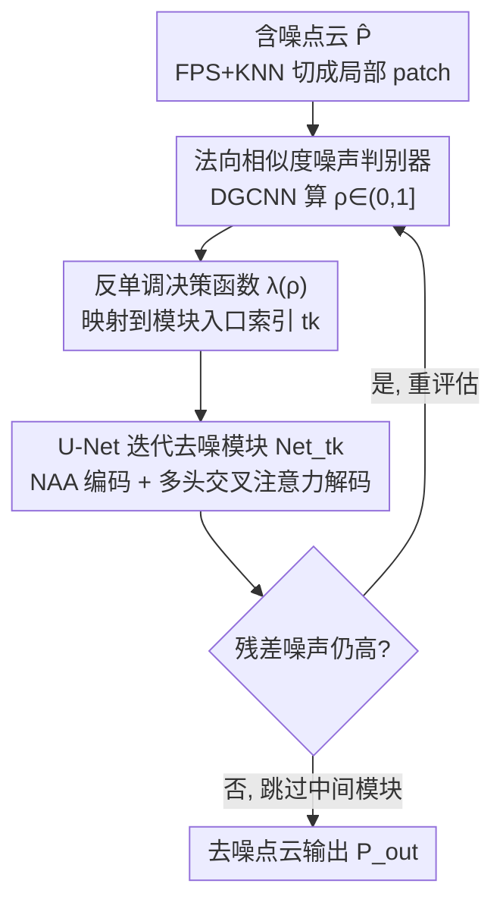

# Routing on Demand: DSNet for Efficient Progressive Point Cloud Denoising

**会议**: CVPR 2026  
**论文**: [CVF Open Access](https://openaccess.thecvf.com/content/CVPR2026/html/Cheng_Routing_on_Demand_DSNet_for_Efficient_Progressive_Point_Cloud_Denoising_CVPR_2026_paper.html)  
**代码**: https://github.com/cz-61/DSNet  
**领域**: 3D视觉 / 点云去噪  
**关键词**: 点云去噪, 渐进式去噪, 动态路由, 法向相似度, 自适应跳层

## 一句话总结
DSNet（Dynamic Skip Net）是一个「按需路由」的渐进式点云去噪框架：用基于法向相似度的噪声判别器量化每个局部 patch 的噪声强度，再用一个反单调的决策函数把它映射到合适的去噪模块入口，使干净区域跳过冗余去噪、噪声区域获得充分精修，从而在去噪质量与计算效率间取得更好平衡。

## 研究背景与动机
**领域现状**：点云去噪是 3D 感知的关键预处理。深度学习方法从单阶段（一次前向）发展到渐进式/迭代式（多步精修，如 IterativePFN 用权重共享模块逐步细化），整体优于传统几何拟合方法。

**现有痛点**：无论单阶段还是渐进式，主流框架都采用**刚性流水线**——对所有区域施加统一的去噪策略（要么一次前向，要么固定顺序的多阶段精修）。这种「一刀切」忽略了真实噪声的空间非均匀性：传感器高斯噪声、环境离群点、几何畸变常以不同强度共存。

**核心矛盾**：固定路径既会在干净区域**过度平滑**、抹掉细粒度几何细节，又会在重噪区域**精修不足**，同时对低噪区域产生**冗余计算**——保真度与效率被同时损害。

**本文目标**：让网络能感知局部噪声强度，并据此为每个 patch 动态规划去噪迭代路径，即提出一个核心问题——「网络能否按区域规划最优路径来动态分配计算？」

**切入角度**：作者通过实验观察发现，含噪点云与干净点云**表面法向的角度偏差**与几何退化程度高度相关，因此可用法向偏差当噪声代理（noise proxy）来指导自适应推理。

**核心 idea**：用法向相似度判别器量化退化，再用反单调决策函数把连续噪声分数映射到离散模块入口，配合路径选择迭代机制实现跨阶段跳层——干净 patch 直接跳到后期微调模块，重噪 patch 走完整去噪轨迹。

## 方法详解

### 整体框架
给定含噪点云 $\hat{P}$，DSNet 先用最远点采样（FPS）取中心点，再对每个中心点用 KNN 取 1000 个近邻组成局部 patch。每个 patch 进入「按需路由」循环：噪声判别器算出法向相似度因子 $\rho$ → 决策函数 $\lambda(\rho)$ 把它映射到一个离散模块索引（噪声越大入口越靠前）→ 选中的 U-Net 去噪模块精修该 patch → 重新评估噪声、重规划下一阶段入口。这个「评估—选择—执行」三步循环重复固定次数，且轨迹**不必连续**（可跳过中间模块），从而把传统静态渐进网络变成自适应系统。训练沿用 IterativePFN 的思路，给每个迭代模块分配逐步降噪的中间真值。

### 关键设计

**1. 法向相似度噪声判别器：用法向角度偏差量化局部几何退化**

针对「网络无法感知局部噪声强度」的痛点，作者基于「含噪/干净法向角度偏差与退化程度强相关」的观察，定义法向相似度因子 $\rho=\frac{1}{n}\sum_{i=1}^{n}\exp(-\theta_i^4/\gamma)$，其中 $\theta_i=\arccos(n_{clean,i}\cdot n_{noisy,i})$ 是第 $i$ 点干净与含噪法向的夹角，$n$ 为 patch 内点数，$\gamma$ 控制对噪声偏差的敏感度。四次方项 $\theta_i^4$ 放大了大角度偏差的惩罚，使 $\rho\in(0,1]$ 对小扰动鲁棒、对显著结构畸变敏感（$\rho$ 越接近 0 表示噪声越大）。判别器用 DGCNN 的 EdgeConv 层实现：先建 k-NN 图，多层 EdgeConv 通过动态邻接迭代更新节点特征，跨层特征拼接聚合成点级表示，全局池化后过 MLP 预测 $\rho$。

**2. 反单调决策函数 $\lambda(\rho)$：把连续噪声分数映射到离散模块入口**

有了 $\rho$ 还需把它映射成 $[N_{min},L]$ 内的离散模块索引，且映射需满足三条：反单调性（$\rho$ 低→噪声高→进更早更激进的阶段）、非线性敏感性（高噪区更精细、低噪区不敏感）、有界整数输出。作者设计 $\lambda(\rho)=\text{clip}\big(\text{round}(L-\frac{(L-N_{min})\log(\beta\rho+1)}{\log(\beta+1)}),N_{min},L\big)$。核心是对数项 $\frac{\log(\beta\rho+1)}{\log(\beta+1)}$：当 $\rho\to0$（极噪），分子趋 0、比值最大，把 $\lambda(\rho)$ 推向 $N_{min}$，强制 patch 走完整去噪轨迹；当 $\rho\to1$（干净），比值接近 1，$\lambda(\rho)\approx L$，让 patch 跳过大部分去噪步骤。超参 $\beta$ 调控曲率：$\beta$ 越大非线性越强、在高噪区（$\rho$ 近 0）路由越细，$\beta$ 越小则把 patch 更均匀地分散到各模块。`round` 离散化、`clip` 强制边界，整体给出可解释、可调的自适应路径选择机制。

**3. 路径选择迭代机制（动态跳层）：每阶段重评估、重规划，实现跨阶段跳过**

这是 DSNet 区别于固定级联（$Net_1\to Net_2\to\dots\to Net_L$）的核心。第 $k$ 次迭代分三步：（1）状态评估——当前 patch $P_{k-1}$ 送进判别器算 $\rho_{k-1}$；（2）模块选择——$t_k=\lambda(\rho_{k-1})$，且约束 $t_k\in\{t_{k-1}+1,\dots,L\}$ 保证单调前进；（3）模块执行——$P_k=Net_{t_k}(P_{k-1})$。循环重复固定 $K_{total}$ 次，轨迹可形如 $P_{input}\xrightarrow{Net_2}P_1\xrightarrow{Net_5}P_2\xrightarrow{Net_7}\dots\xrightarrow{Net_L}P_{output}$，有效跳过 $\{Net_3,Net_4,Net_6\}$ 等中间模块。这种非顺序路由让重噪复杂区域获得多阶段密集精修、干净简单区域绕过不必要的中间处理，从而在空间上自适应分配计算。

**4. U-Net 迭代去噪模块：邻域注意力编码 + 多头交叉注意力解码**

每个去噪模块是层级化的 U-Net。编码器每层用两次连续的邻域注意力聚合（NAA）配合 MLP 残差连接 $f_l=\text{MLP}([\text{NAA}(f^0_{l-1}),\text{NAA}^2(f^0_{l-1})])+\text{MLP}(f_{l-1})$，点集用 FPS 下采样；解码器用距离加权插值上采样后接多头交叉注意力（MHCA）做跨层融合 $h_{l-1}=\text{MLP}([\text{MHCA}(\phi(f_{l-1}),\phi(\tilde{h}_l)),f_{l-1}])$，兼顾全局上下文与局部结构细节。模块还会根据估计的噪声强度自适应决定编码-解码层数。

### 损失函数 / 训练策略
训练给每个迭代步分配逐步降噪的中间真值 $P_{gt_i}=P+\sigma_i\xi,\ \xi\sim\mathcal{N}(0,I)$，噪声标准差按 $\sigma_i=\sigma_{i-1}/\gamma$ 衰减（$\gamma=16/L$）。单步损失 $L_k=L_{cd}(P_k,P_{gt_k})+L_{disp}(P_{k-1},P_{gt_k},P_k)$，其中 $L_{cd}$ 为预测与目标点云间 Chamfer 距离，位移损失 $L_{disp}=\|(P_k-P_{k-1})-P_{nearest}\|_2$（$P_{nearest}$ 是 $P_{k-1}$ 到 $P_{gt_k}$ 最近邻的位移向量）。总损失等权聚合所有中间损失 $L=\sum_{k=1}^{K_{total}}L_k$，保证粗到细去噪全程的一致监督与稳定优化。训练先**独立预训练噪声判别器**得到稳定的噪声特征提取器，再用它指导 DSNet 联合优化，提升收敛速度与稳定性。

## 实验关键数据

### 主实验
训练用 PU-Net 数据集（40 个网格，Poisson disk 采样 10K/30K/50K，加 0.05–0.2 倍包围球半径的高斯噪声）。下表为 PU-Net 测试集结果（CD、P2M 均 ×10⁴，越低越好）：

| 设置 | 指标 | DSNet | ASDN | IterativePFN | 3DMambaIPF |
|------|------|-------|------|--------------|------------|
| 10K, 1% | CD↓ | **1.829** | 1.871 | 2.055 | 1.989 |
| 10K, 2.5% | CD↓ | **2.604** | 2.697 | 3.352 | 3.262 |
| 50K, 2% | CD↓ | **0.603** | 0.721 | 0.802 | 0.755 |
| 50K, 2.5% | CD↓ | **0.762** | 0.850 | 1.015 | 0.928 |
| 50K, 2.5% | P2M↓ | **0.514** | 0.575 | 0.588 | 0.531 |

> 注：CD = Chamfer Distance（预测与真值点云双向最近邻距离），P2M = Point-to-Mesh 距离（点到真值网格面距离）；两者均为几何保真度指标，越低越好。

真实扫描数据（Kinect，无真值故仅有限定量；Paris-Rue-Madame 仅定性）：

| 数据集 | 指标 | DSNet | P2P-Bridge | IterativePFN | 3DMambaIPF |
|--------|------|-------|-----------|--------------|------------|
| Kinect | CD↓ | 1.040 | **0.974** | 0.993 | 1.008 |
| Kinect | P2M↓ | 0.885 | **0.854** | 0.867 | 0.883 |

在合成数据上 DSNet 全面 SOTA，但在真实扫描 Kinect 上仅与同类持平（略逊 P2P-Bridge），作者坦承跨域泛化仍有提升空间。

### 消融实验
阶段数 $L$ 与动态/静态路径对比（PU-Net，CD↓，节选）：

| 配置 | 10K,1% CD↓ | 50K,2.5% CD↓ | 说明 |
|------|-----------|-------------|------|
| DSNet-2（动态） | 1.919 | 0.868 | 2 阶段 |
| DSNet-Static-2 | 1.914 | 0.975 | 固定路径 2 阶段 |
| DSNet-4（动态，最终） | **1.829** | **0.762** | 最优配置 |
| DSNet-Static-4 | 1.897 | 1.017 | 固定路径 4 阶段 |
| DSNet-5（动态） | 1.847 | 0.816 | 阶段过深略降 |

### 关键发现
- 阶段数 $L$ 从 2 增到 4 性能持续提升（更深→更有效的粗到细精修），但 $L=5$ 略降（过平滑/误差累积），故最终取 $L=4$。
- 动态路径全面优于静态变体：低噪时跳过冗余阶段避免过平滑，高噪时仍稳定领先（如 DSNet-Static-4 在 50K/2.5% 反而恶化到 CD 1.017，动态版仅 0.762），证明按需路由既高效又对挑战性噪声鲁棒。
- 合成→真实存在域差：真实扫描上提升不如合成显著，跨域泛化是后续方向。

## 亮点与洞察
- 「按需路由」把渐进式去噪从「固定流水线」升级成「每 patch 自适应路径」，是对 IterativePFN 这类固定级联的直接改进——核心洞察是噪声空间非均匀，计算就该按需分配。
- 用表面法向角度偏差当噪声代理很巧妙：法向对几何退化敏感且无需真值即可在推理时近似评估残差噪声，比直接回归噪声强度更有几何意义；四次方 + 指数的 $\rho$ 设计兼顾了「对小扰动鲁棒、对大畸变敏感」。
- 反单调对数决策函数把「连续分数→离散模块」的映射写成可解释、可调（$\beta$ 控曲率）的闭式，避免了额外的学习式路由器，工程上简洁。
- 单调约束 $t_k\in\{t_{k-1}+1,\dots,L\}$ 保证每步前进、不回退，使跳层在保证收敛的同时省算力——「跳过即省」的设计可迁移到其它渐进式精修任务（如图像/深度的迭代修复）。

## 局限与展望
- 真实扫描泛化偏弱：Kinect 上仅与 SOTA 持平、略逊 P2P-Bridge，作者明确指出跨域泛化留待改进。
- 判别器依赖法向估计质量，而含噪点云的法向本身可能不准；⚠️ 推理时如何得到「干净法向」用于 $\theta_i$ 计算，正文未完全交代（训练时有真值，推理时应是近似/残差评估，以原文为准）。
- 需要独立预训练噪声判别器再联合训练，流程比端到端方法多一步；多个超参（$\gamma,\beta,N_{min},L,K_{total}$）的联合调参成本未给系统分析。
- 评测主要在 PU-Net 合成噪声 + 两个真实扫描集，噪声类型仍以高斯为主，对结构化/离群点噪声的专门验证有限。

## 相关工作与启发
- **vs IterativePFN（最直接对照）**：两者都做渐进式迭代去噪、都用中间真值监督；IterativePFN 强制固定顺序、对所有 patch 一视同仁，易过平滑，DSNet 用判别器 + 决策函数实现非顺序跳层，按 patch 噪声定制路径。
- **vs 单阶段方法（PD-Flow / ASDN / Score-Denoise）**：单阶段一次前向，对非均匀噪声适应性差；DSNet 多阶段 + 动态路由在高分辨率/高噪声下优势明显（如 50K/2.5% CD 0.762 vs ASDN 0.850）。
- **vs 基于强化学习路由的渐进方法**：相关工作也探索过 RL-based routing；DSNet 用几何驱动的法向相似度 + 闭式决策函数替代学习式策略，更可解释、训练更稳。

## 评分
- 新颖性: ⭐⭐⭐⭐ 「按需路由 + 跨阶段跳层」在点云去噪里是清晰的新范式，法向相似度代理与反单调决策函数设计有巧思。
- 实验充分度: ⭐⭐⭐⭐ 合成多分辨率/多噪声 + 阶段数 + 动态vs静态消融较完整，但真实扫描定量偏少、超参敏感性缺。
- 写作质量: ⭐⭐⭐⭐ 动机、三步路由循环与公式推导讲得清楚，图示直观。
- 价值: ⭐⭐⭐⭐ 在质量与效率间取得更好平衡，对 3D 感知预处理有实用意义，跳层思路可迁移。

<!-- RELATED:START -->

## 相关论文

- [\[ICML 2026\] SIMPC: Learning Self-Induced Mirror-Point Consistency for Unsupervised Point Cloud Denoising](../../ICML2026/3d_vision/simpc_learning_self-induced_mirror-point_consistency_for_unsupervised_point_clou.md)
- [\[ICCV 2025\] Noise2Score3D: Tweedie's Approach for Unsupervised Point Cloud Denoising](../../ICCV2025/3d_vision/noise2score3d_tweedies_approach_for_unsupervised_point_cloud_denoising.md)
- [\[CVPR 2026\] MHopReg: Efficient Hierarchical Multi-Hop Graph Search for Point Cloud Registration](mhopreg_efficient_hierarchical_multi-hop_graph_search_for_point_cloud_registrati.md)
- [\[ECCV 2024\] P2P-Bridge: Diffusion Bridges for 3D Point Cloud Denoising](../../ECCV2024/3d_vision/p2p-bridge_diffusion_bridges_for_3d_point_cloud_denoising.md)
- [\[CVPR 2026\] SuP: Sub-cloud Driven Point Cloud Registration](sup_sub-cloud_driven_point_cloud_registration.md)

<!-- RELATED:END -->
