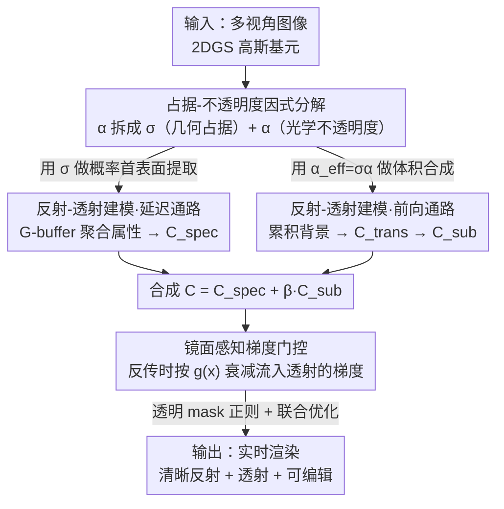

# RT-Splatting: Joint Reflection-Transmission Modeling with Gaussian Splatting

**会议**: CVPR 2026  
**arXiv**: [2605.18263](https://arxiv.org/abs/2605.18263)  
**代码**: https://sjj118.github.io/RT-Splatting (项目主页)  
**领域**: 3D视觉  
**关键词**: 高斯泼溅, 半透明表面, 反射-透射分解, 延迟着色, 梯度门控

## 一句话总结
RT-Splatting 把每个高斯基元的「几何占据」和「光学不透明度」解耦成两个独立属性，让单一套高斯既能当反射表面（延迟着色出高频镜面）又能当透射体（前向积分出清晰背景），并用「镜面感知梯度门控」抑制反射残差泄漏到透射分支造成的飘点，在车窗、塑料膜这类同时存在反射与透射的真实场景上取得 SOTA。

## 研究背景与动机
**领域现状**：3D Gaussian Splatting（3DGS）凭借光栅化实现了实时、高质量的新视角合成；为了表达高频、视角相关的镜面效果，近期变体普遍把每高斯 SH 换成基于物理的着色，并采用「延迟着色」——先把最近表面属性光栅化进 G-buffer，再逐像素着色。

**现有痛点**：这些方法在**薄半透明镜面**（车窗、玻璃、塑料膜）上集体失效。这类表面的外观是「透过表面看到的背景」与「表面反射的环境」的叠加。标准 3DGS 为了拟合高频镜面，会在表面后方幻觉出一堆「飘点」(floaters)，既没真实还原反射、又把本应透过表面可见的背景挡住，导致透射浑浊。延迟着色因为 G-buffer 只存每像素最近表面属性，天然处理不了透明——要么聚合不到反射所需的目标表面属性，要么干脆把表面当成不透明、彻底遮挡透射。

**核心矛盾**：单个不透明度参数 $\alpha$ 同时承担了两件互相冲突的事——它既是「几何上有没有面」（渲染高频反射需要面是实心的），又是「光学上挡不挡光」（透射需要面是清透的）。一个参数没法同时满足「几何实心 + 光学清透」，于是只能在「模糊反射」和「不透明遮挡」之间二选一。

**已有绕法的局限**：TransparentGS 等用多阶段管线，先把背景单独重建（且把透明区域 mask 掉）再叠透明物体，但当背景**只能透过透明表面看到**（如只能透过车窗看车内）时，背景重建阶段根本没见过这部分内容，方法直接崩。其他工作则强加平面假设或受控采集条件。

**核心 idea**：把每高斯的不透明度**因式分解**为几何占据 $\sigma$ 与光学不透明度 $\alpha$ 两个可学习量，用同一套高斯支撑「延迟反射 + 前向透射」的混合渲染管线，再用梯度门控解决两支联合优化时的歧义。

## 方法详解

### 整体框架
RT-Splatting 要解决的是「薄半透明表面上反射与透射强耦合」的重建。整条管线建立在 2DGS 之上：先把每个高斯的不透明度拆成几何占据 $\sigma$ 和光学不透明度 $\alpha$，得到一个「表面-体」统一表示；同一套高斯随后兵分两路——一条**延迟通路**用 $\sigma$ 做概率化首表面提取、把法线/粗糙度等属性聚合进 G-buffer，再经镜面着色网络算出反射色 $\mathbf{C}_{\text{spec}}$；一条**前向通路**用有效不透明度 $\alpha_{\text{eff}}=\sigma\alpha$ 做体积合成，累积透过表面的背景辐射 $\mathbf{C}_{\text{trans}}$。两路合成出最终像素色后，反传时用「镜面感知梯度门控」按像素镜面复杂度衰减流入透射分支的梯度，避免反射残差污染背景；训练时再用透明 mask 正则约束 $\alpha$、并对所有组件联合优化。

### 关键设计

**1. 占据-不透明度因式分解：让一套高斯同时是实心的面和清透的体**

针对「单参数 $\alpha$ 无法兼顾几何实心与光学清透」这个根本矛盾，本文把每高斯的不透明度拆成两个有物理含义的可学习量：几何占据 $\sigma\in[0,1]$ 表示射线**碰到**这个高斯实体的概率，光学不透明度 $\alpha\in[0,1]$ 表示一旦碰到、光被吸收/散射的条件概率。两者乘积 $\alpha_{\text{eff}}=\sigma\alpha$ 才是体积合成（式1）真正用的有效不透明度——也就是「光学衰减只发生在几何上有面的地方」。这样透明物体就能用「高 $\sigma$ + 低 $\alpha$」表达：几何上是一面实墙（反射所需），光学上几乎全透（透射所需）。

更关键的是，$\sigma$ 单独给出了延迟着色所需的**概率化首表面提取**：把高斯沿射线按深度排序后，任意表面属性 $\mathbf{a}$（法线、粗糙度等）的期望为

$$\mathbf{A}=\sum_i p_i\,\mathbf{a}_i,\quad p_i=\sigma_i\mathcal{G}_i\prod_{j=1}^{i-1}(1-\sigma_j\mathcal{G}_j)$$

其中 $p_i$ 是「第 $i$ 个高斯是射线首次交互的表面元」的概率。形式上和标准 alpha-blending 一样，但本文把这群高斯重新诠释为「单个表面的概率化表示」而非一堆半透明 surfel——这才让延迟着色在高斯泼溅里建模高频反射有了物理依据。

**2. 混合延迟-前向的反射-透射建模：反射走延迟、透射走前向，再按镜面强度调制透射**

半透明表面的外观 = 高频镜面反射 + 透射光，本文用一条延迟通路 + 一条前向通路并行建模。延迟通路用上面的式(2)把法线 $\mathbf{n}$、粗糙度 $\rho$、材质特征 $\mathbf{z}$ 聚进 G-buffer，再送入镜面着色网络 $f_{\text{spec}}$（结构沿用 Ref-GS）算出视角相关的反射色 $\mathbf{C}_{\text{spec}}$。为表达彩色玻璃这类有内部散射/吸收的材质，每高斯额外学一个本征散射色 $\mathbf{C}_{\text{scatter}}$ 和透射比 $\tau\in[0,1]$，把「穿透的背景光」与「材质内散射光」合成为次表面传输项：

$$\mathbf{C}_{\text{sub}}=\tau\,\mathbf{C}_{\text{trans}}+(1-\tau)\,\mathbf{C}_{\text{scatter}}$$

而背景辐射 $\mathbf{C}_{\text{trans}}$ 由前向通路用 $\alpha_{\text{eff}}=\sigma\alpha$ 体积积分得到，所以背景不会被透明物体遮挡。最终颜色不走纯 Fresnel 物理混合（它常被 tone-mapping 等非线性相机响应破坏），而是基于一个感知观察——「透射细节能从淡反射里看清，但会被强镜面高光压住甚至遮蔽」。为此着色网络额外输出一个衰减因子 $\beta\in[0,1]$ 直接调制透射项：

$$\mathbf{C}=\mathbf{C}_{\text{spec}}+\beta\,\mathbf{C}_{\text{sub}}$$

与以往「调制反射分量」的做法相反，本文**调制透射分量**，给「强反射压制背景光」提供了更直接稳定的机制。

**3. 镜面感知梯度门控：堵住反射残差泄漏到透射、引发飘点的路径**

即便表示干净地分了两支，联合优化仍有歧义：高频镜面本身极难拟合完美，其残差在反传时会被错误地路由进透射分支，透射分支便「将功补过」地在表面后方幻觉出飘点来抵消误差，反而把背景搞浑。作者的关键洞察是——这种错误补偿主要发生在**高频镜面细节区域**。于是用镜面分量 $\mathbf{C}_{\text{spec}}$ 在局部邻域 $\mathcal{N}(x)$ 的方差估计其复杂度，对每像素 $x$ 算门控权重：

$$g(x)=\exp\!\big(-k\cdot\mathrm{Var}_{p\in\mathcal{N}(x)}[\mathbf{C}_{\text{spec}}(p)]\big)$$

$k$ 控制门控灵敏度。反传时用 $g(x)$ 缩放图像损失经 $\mathbf{C}_{\text{trans}}$ 回流的梯度：$\frac{\partial\mathcal{L}_{\text{img}}}{\partial\mathbf{C}_{\text{trans}}(x)}\leftarrow g(x)\cdot\frac{\partial\mathcal{L}_{\text{img}}}{\partial\mathbf{C}_{\text{trans}}(x)}$。在镜面复杂的像素 $g(x)\to 0$、压制误导监督；在镜面简单/弱的像素 $g(x)\to 1$、背景仍获完整监督——这点很重要，它**只衰减不完全切断**，保留了背景几何与外观的有效优化路径。

**4. 透明 mask 正则 + 联合优化：消掉「幽灵几何」歧义并贯通整套训练**

因式分解引入一个新歧义：「高 $\sigma$ + 近零 $\alpha$」的高斯可以摆在场景任意位置而不影响最终渲染色，在缺乏强镜面线索的漫反射区会堆积成「幽灵几何」，腐蚀表面、扰乱优化。为此用预训练 SAM2 得到透明 mask $\mathbf{M}$，在延迟通路里把首表面的期望光学不透明度 $\alpha$ 聚进 G-buffer，再用 BCE 约束它去匹配反转后的语义 mask：

$$\mathcal{L}_{\text{mask}}=\mathrm{BCE}(1-\mathbf{M},\,\alpha)$$

与 TransparentGS 等「用 mask 切分场景分别处理」不同，这里 mask **只当正则**，所有组件（高斯基元、因式分解后的占据/不透明度、着色网络）一起联合优化。正是这种联合优化让方法能处理「背景只能透过透明表面看到」的复杂场景。

### 损失函数 / 训练策略
基于 PyTorch、在 2DGS 框架上实现；延迟通路着色函数超参与 Ref-GS 保持一致。训练目标为图像重建损失 $\mathcal{L}_{\text{img}}$（其经透射分支的梯度被 $g(x)$ 门控）加透明 mask 正则 $\mathcal{L}_{\text{mask}}$，对全部组件做联合优化。

## 实验关键数据

### 主实验
评测覆盖 Ref-Real、NeRF-Casting、EnvGS、T&T 的 6 个公开场景（Sedan / Toycar / Compact / Hatchback / Audi / Truck）加自采 2 个场景（Van / Swab，手机拍摄 220~240 视角）。指标为整图与透明区域上的 PSNR / SSIM / LPIPS，外加 FPS 与训练时长。

公开基准（Tab.1）：

| 方法 | 整图 PSNR↑ | 整图 LPIPS↓ | 透明区 PSNR↑ | 透明区 LPIPS↓ | FPS↑ | 训练时长↓ |
|------|-----------|-------------|--------------|----------------|------|-----------|
| 3DGS | 26.493 | 0.181 | 37.673 | 0.012 | 218.95 | 0.3h |
| 2DGS | 26.384 | 0.197 | 37.333 | 0.012 | 208.82 | 0.3h |
| 3DGS-DR | 26.597 | 0.190 | 37.890 | 0.012 | 119.62 | 0.8h |
| Ref-GS | 26.599 | 0.188 | 37.761 | 0.013 | 38.41 | 0.8h |
| EnvGS | 27.141 | 0.182 | 37.953 | 0.012 | 18.31 | 2.9h |
| **Ours** | **27.490** | **0.167** | **39.765** | **0.010** | 33.28 | 0.9h |

自采场景（Tab.2）差距更大——透明区 PSNR 35.490 vs 次优 3DGS 32.567（领先约 +2.9dB），整图 PSNR 28.780 也居首（次优 3DGS 27.507）。提升在透明区域尤其显著，且 33 FPS 实时、训练 0.9h 性价比好。

### 消融实验
透明区域上逐组件消融（Tab.3，去掉某项相对 Full 的掉点）：

| 配置 | PSNR↑ | LPIPS↓ | 说明 |
|------|-------|--------|------|
| Full (Ours) | 37.983 | 0.0095 | 完整模型 |
| w/o occupancy | 36.919 | 0.0113 | 退回单不透明度，反射↔透射互相牺牲，背景更遮挡 |
| w/o joint optimization | 36.288 | 0.0120 | 分开训两支，「只能透过车窗看到的车内」完全重建不出 |
| w/o scattering | 37.597 | 0.0102 | 去掉 $\mathbf{C}_{\text{scatter}}$ 和 $\tau$，材质本征色被烤进背景，透射偏暗 |
| w/o attenuation | 37.541 | 0.0102 | 去掉 $\beta$，建模不了视角相关的背景压制 |
| w/o gating | 37.754 | 0.0101 | 透明表面附近出现飘点伪影 |
| w/o $\mathcal{L}_{\text{mask}}$ | 37.167 | 0.0106 | 优化不稳、表面质量退化 |

### 关键发现
- **联合优化贡献最大**（掉 1.70dB 至 36.288），其次是占据-不透明度因式分解（掉 1.06dB）——这两项正是处理「背景只能透过透明面看到」场景的命门，去掉直接导致车内重建失败。
- 散射、衰减、门控、mask 正则各贡献约 0.2~0.8dB，单看 PSNR 不大，但门控、mask 主要改善的是**飘点伪影与优化稳定性**（定量被 PSNR 部分掩盖，定性图 Fig.5 更明显）。
- 方法在「反射与透射强耦合」的透明区收益远大于整图，说明增益确实来自反射-透射解耦而非整体表达力堆叠。

## 亮点与洞察
- **一个参数拆成两个、解开一对老矛盾**：把「几何占据」和「光学不透明度」分开，是对 3DGS/2DGS 不透明度语义的一次精准手术——单参数同时背负几何与光学两层含义本就是 alpha-blending 的历史包袱，拆开后「高几何占据 + 低光学不透明度」自然刻画了半透明表面，且只用一套高斯，不需要多阶段重建背景。
- **调制透射而非反射**：以往工作都去调反射分量，本文反过来用 $\beta$ 衰减透射分量，对应「强高光会遮蔽背景细节」的真实感知，机制更直接稳定；这个视角可迁移到任何需要建模「前景压制背景可见性」的合成任务。
- **梯度门控是「优化层面」的妙招而非表示层面**：它不改前向渲染、只在反传时按镜面方差衰减流入透射的梯度，精准切断「反射残差→透射飘点」的错误补偿路径，又保留弱镜面区的完整背景监督——这种「按局部复杂度门控梯度」的思路可复用到任何「难拟合分支会污染易拟合分支」的多分支优化。
- **解耦表示天然支持场景编辑**：因为反射/透射、粗糙度、透明度、材质 tint 被显式分离，可独立调整车窗粗糙度、透明度甚至换色。

## 局限性 / 可改进方向
- **只针对薄半透明表面**：作者明确不建模折射与多次光反弹，因此对厚折射介质（水、实心玻璃）和多次散射场景不适用——薄面「直线透射」近似是整套方法成立的前提。
- **依赖外部 mask**：透明 mask 由预训练 SAM2 提供，mask 质量会影响 $\mathcal{L}_{\text{mask}}$ 正则效果；SAM2 在弱边界透明物体上的分割误差可能传导到优化。
- **门控超参 $k$ 需调**：$g(x)=\exp(-k\cdot\mathrm{Var})$ 的灵敏度由 $k$ 控制，过强会切断背景监督、过弱则压不住飘点，论文未给 $k$ 的敏感性分析。
- **改进思路**：把直线透射近似扩展为可微折射路径以支持厚介质；把 mask 来源从 SAM2 换成可端到端学习的透明度先验，减少对外部分割的依赖。

## 相关工作与启发
- **vs 反射类高斯方法（3DGS-DR / Ref-GS / EnvGS / GaussianShader）**：它们用延迟着色或环境高斯擅长高频镜面，但把表面当不透明、G-buffer 只存最近表面，处理不了「反射+透射混合」的薄半透明面；本文用占据-不透明度因式分解让同一套高斯兼顾两者，透明区 PSNR 领先约 1.8~3.7dB。
- **vs TransparentGS 等多阶段透明重建**：它们先单独重建并冻结不透明背景（且 mask 掉透明区），当背景只能透过透明面看到时背景阶段没数据可用、直接失败；本文把 mask 仅作正则、所有组件联合优化，因而能重建「只能透过车窗看到的车内」。
- **vs 平面假设的反射-透射工作**：近期一些联合建模反射与透射的方法局限于简单平面、无法泛化到复杂形状；本文以薄半透明面的直线透射近似为前提，但表示与渲染管线不限平面，可处理车身曲面等复杂几何。

## 评分
- 新颖性: ⭐⭐⭐⭐⭐ 「占据/不透明度因式分解 + 调制透射 + 镜面感知梯度门控」三处都给出了对症且优雅的新机制
- 实验充分度: ⭐⭐⭐⭐ 8 个真实场景 + 整图/透明区双指标 + 6 项逐组件消融，但缺超参（$k$）敏感性与对比方法的定性失败分析量化
- 写作质量: ⭐⭐⭐⭐⭐ 矛盾铺陈清晰、公式与动机一一对应，方法可从笔记复现
- 价值: ⭐⭐⭐⭐ 解决了半透明镜面这一长期硬骨头且实时可编辑，实用价值高，受限于薄面/无折射假设

<!-- RELATED:START -->

## 相关论文

- [\[CVPR 2026\] DirectFisheye-GS: Enabling Native Fisheye Input in Gaussian Splatting with Cross-View Joint Optimization](directfisheye-gs_enabling_native_fisheye_input_in_gaussian_splatting_with_cross-.md)
- [\[CVPR 2026\] Part$^{2}$GS: Part-aware Modeling of Articulated Objects using 3D Gaussian Splatting](part2gs_part-aware_modeling_of_articulated_objects_using_3d_gaussian_splatting.md)
- [\[CVPR 2026\] eRetinexGS: Retinex Modeling for Low-Light Scene Enhancement via Event Streams and 3D Gaussian Splatting](eretinexgs_retinex_modeling_for_low-light_scene_enhancement_via_event_streams_an.md)
- [\[CVPR 2026\] TagSplat: Topology-Aware Gaussian Splatting for Dynamic Mesh Modeling and Tracking](tagsplat_topology-aware_gaussian_splatting_for_dynamic_mesh_modeling_and_trackin.md)
- [\[CVPR 2026\] Clay-to-Stone: Phase-wise 3D Gaussian Splatting for Monocular Articulated Hand-Object Manipulation Modeling](clay-to-stone_phase-wise_3d_gaussian_splatting_for_monocular_articulated_hand-ob.md)

<!-- RELATED:END -->
