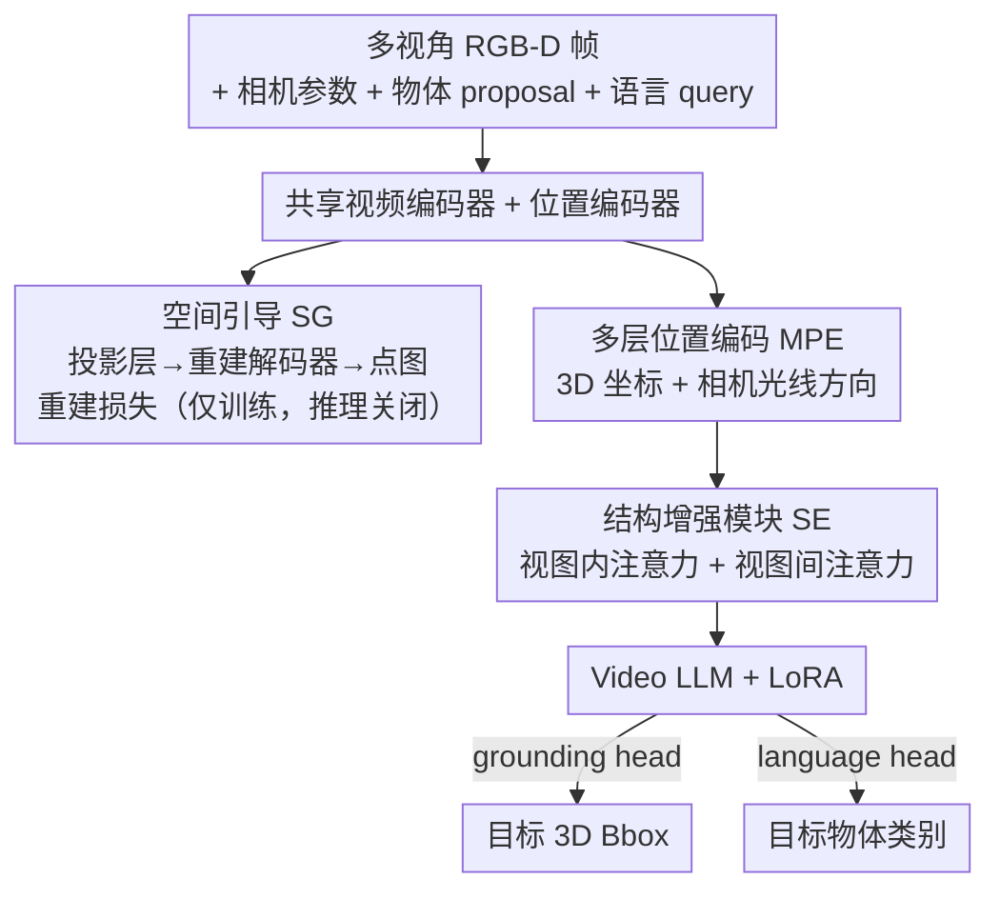

# S$^2$-MLLM: Boosting Spatial Reasoning Capability of MLLMs for 3D Visual Grounding with Structural Guidance

**会议**: CVPR 2026  
**论文**: [CVF Open Access](https://openaccess.thecvf.com/content/CVPR2026/html/Xu_S2-MLLM_Boosting_Spatial_Reasoning_Capability_of_MLLMs_for_3D_Visual_CVPR_2026_paper.html)  
**代码**: https://github.com/IRMVLab/S2-MLLM.git  
**领域**: 3D视觉 / 多模态VLM  
**关键词**: 3D视觉定位, MLLM, 空间推理, 前馈3D重建, 隐式空间推理

## 一句话总结
S²-MLLM 让多模态大模型（MLLM）做 3D 视觉定位（3DVG）时**不再依赖推理阶段昂贵的点云重建+多视角渲染**，而是在训练时把前馈 3D 重建当作「空间引导」联合优化、再配一个把 3D 坐标/相机光线注入视觉特征的结构增强模块，使模型在潜空间里**隐式**完成 3D 空间推理，在 ScanRefer / Nr3D / Sr3D 上既涨点又只用 25% 训练开销、推理零额外延迟。

## 研究背景与动机
**领域现状**：3D 视觉定位（3DVG，根据自然语言在 3D 场景中框出被指物体）是具身智能与机器人的基础能力。近来大家想借 MLLM 的推理与泛化能力来做 3DVG，但 MLLM 本质是「2D 中心」训练的，光看几张 2D 图很难理解场景的 3D 空间结构。

**现有痛点**：为了补上 3D 结构，现有方法（如 SeeGround、GPT4Scene）走「显式重建」路线——推理时先把场景重建成点云、再渲染成多视角图或 BEV 鸟瞰图喂给 MLLM。这条路有两个硬伤：① 特定视角渲染图**反映不了完整 3D 结构**，还受视角选择和遮挡影响，同一对相对空间关系换个视角就可能变；② **推理时要现场重建点云，极慢**（SeeGround 还要多次 API 调用，延迟近 4×）。

**核心矛盾**：「想要 3D 结构理解」与「不想在推理时背重建/渲染的成本」之间存在 trade-off——把结构信息搬到推理阶段做，必然又慢又受视角偏置。

**本文目标**：让 MLLM 在**训练阶段**把 3D 结构感知内化进权重，从而在推理阶段无需任何重建/渲染、直接在潜特征空间里隐式推理空间关系。

**切入角度**：作者注意到**前馈 3D 重建模型**（如 Fast3R）能直接从多视角 RGB 预测稠密 3D 结构，天生具备空间理解能力。那就把这种重建目标**联合进训练**，当作免费的「空间引导」监督信号——训练时用、推理时丢。

**核心 idea**：用「重建当监督」把 3D 结构知识蒸进 MLLM 的视觉表征（空间引导），再用「3D 坐标+相机光线编码 + 视图内/视图间注意力」把空间信息显式钉进特征（结构增强），实现「训练重、推理轻」的隐式空间推理。

## 方法详解

### 整体框架
S²-MLLM 把 3D 场景当作**视频序列**处理（保留 2D 图的丰富纹理与语义）。输入是采样的多视角 RGB-D 帧 $\{(I_v,D_v)\}_{v=1}^{V}$、对应相机参数、物体候选框 proposal $\{o_i\}$ 和一句语言描述 $Q$；输出是目标物体的 3D 包围盒和类别。共享的视频编码器和位置编码器从 RGB-D 帧抽出视觉与几何特征，经**多层位置编码**注入 3D 坐标与相机光线信息，再过**结构增强模块**（视图内/视图间注意力）形成视觉输入送进 Video LLM（LoRA 微调）；LLM 联合处理视觉输入与 tokenize 后的 query，由 grounding head 预测 3D bbox、language head 预测类别。**关键在于训练时多挂一条重建分支**：把编码器特征经投影层送进重建解码器预测点图、算重建损失，这就是「空间引导」——它只在训练时存在，推理时整条结构引导分支被关掉，因此不带来任何额外延迟。

### 关键设计

**1. 空间引导策略（SG）：把前馈 3D 重建当监督，训练时蒸结构、推理时丢分支**

针对的痛点是「现有方法非得在推理时重建点云才有结构信息，又慢又受视角偏置」。作者在 MLLM 之上搭一条重建分支，复用 Fast3R 的融合 transformer 与解码头，但**把 Fast3R 原本的 ViT 换成 MLLM 自己的视觉编码器** $E_v$，保证重建与 3DVG 共享同一表征空间；中间加投影层 $P$ 把语义特征对齐/归一化到重建所需的稠密结构特征。分支预测局部点图 $X_L$ 与全局点图 $X_G$：

$$X_L,X_G=D\big(P(E_v(I))\big)$$

训练时把重建损失与 grounding/语言损失**联合优化**，逼模型把 3D 结构内化进潜空间。重建损失收敛得早、提供稳定的结构监督，让模型在训练早期就拿到结构感知特征而不损害多模态对齐能力。之所以有效：结构知识被蒸进权重后，**推理阶段无需任何重建/渲染**，既避开视角偏置又零额外延迟——这正是和「显式重建」路线的本质区别。

**2. 多层位置编码（MPE）：把 3D 坐标和相机光线显式钉进每个 patch**

针对的痛点是「就算有了空间引导，MLLM 仍缺少把视觉表观与 3D 位置显式关联的能力，分不清距离/方向/相对关系」。每个 RGB-D 像素都能投影成 3D 坐标、且落在一条相机光线上。给定深度 $d=D(u,v)$、内参 $K$、外参 $T$，世界坐标为

$$p_{world}=T\begin{bmatrix} d\,K^{-1}(u,v,1)^\top \\ 1 \end{bmatrix}$$

光线视角方向 $r=\dfrac{p_{world}-o_{world}}{\lVert p_{world}-o_{world}\rVert_2}$（$o_{world}$ 为相机中心）。对每个 patch，用正弦位置编码 $\phi(\cdot)$ 编码其平均 3D 坐标加到视觉特征上，再做邻域平均池化得上下文增强特征，最后用可学习编码 $\psi(\cdot)$（MLP）编码光线方向，得到位置感知表征

$$f^{vis}_i=\text{AvgPool}\big(f_i+\phi(p^i_{world})\big)+\psi(r_i)$$

这样视觉特征里既有「我在哪」（3D 坐标）又有「从哪看」（视角方向），细粒度空间关系才推得准。消融显示去掉 MPE 掉点最狠（Acc@0.25 −15.05%），是性能贡献最大的组件。

**3. 结构增强模块（SE）：视图内/视图间分离注意力，补齐跨视一致性与视内结构**

针对两个具体毛病：（i）MLLM 在独立图文对上预训练，**跨视语义不一致**——从不同视角看到的椅子，它判断不出是不是同一个 3D 物体；（ii）缺乏视图内 patch 间的结构关联。借鉴视频建模里「时间/空间分解」的思路，作者用分离注意力（divided attention）：给定多视角特征 $f\in\mathbb{R}^{B\times(V\cdot H\cdot W)\times dim}$，**视图间注意力**按 patch 索引 $s$ 跨视角聚合 $f^{inter}_s\in\mathbb{R}^{B\times V\times dim}$，强制视角切换时的语义对齐；**视图内注意力**按视角索引 $v$ 分组、捕捉同一视图内 patch 间依赖，改善局部与全局上下文。两者分开算而非一锅端，既省算力又把「跨视对应」与「视内结构」两类天然不同的交互各自建模到位。

### 损失函数 / 训练策略
总目标是三项加权和：

$$L=\lambda_g L_{ground}+\lambda_r L_{recon}+\lambda_l L_{lang}$$

- **grounding 损失**：把 3DVG 当物体候选的分类。对每个 bbox，取其内部（覆盖率 >50%）patch 特征平均得 $f_{obj}$、加上物体中心的 3D 位置编码；取 `<ground>` token 的隐状态 $h$，用 InfoNCE 对比损失对齐 $L_{ground}=\text{InfoNCE}(f_{obj},h)$（温度 $\tau=0.07$）。
- **重建损失**：对预测点图 $\hat X$（含置信度 $\hat\Sigma$）与真值用 Fast3R 的置信度加权回归损失，局部+全局点图相加 $L_{recon}=L_{X_G}+L_{X_L}$。
- **语言损失**：交叉熵监督模型生成「The [类别] is located at \<ground\>…」，纠正把 stool 错认成 chair 这类**类别误判**（⚠️ 具体提示词模板以原文为准）。

底座 LLaVA-Video-7B + LoRA，单卡 A100(80G) 训 1 个 epoch、batch 8；训练时给 GT bbox 当 proposal、冻结重建解码器、微调投影层/视觉编码器/LLM；推理时关掉结构引导分支、用 Mask3D 生成 proposal。

## 实验关键数据

> 指标说明：**Acc@0.25 / Acc@0.5** 指预测 3D bbox 与真值 IoU 超过 0.25 / 0.5 阈值即算命中的准确率（%）；Unique=单物体场景，Multiple=含同类干扰物场景。

### 主实验

ScanRefer 验证集（Acc，%）：

| 方法 | LLM | Unique@0.25 | Multiple@0.5 | Overall@0.25 | Overall@0.5 |
|------|-----|------|------|------|------|
| TSP3D (CVPR'25) | - | 87.3 | 42.4 | 56.5 | 46.7 |
| Video-3D-LLM (CVPR'25) | LLaVA-Video-7B | 88.0 | 45.3 | 58.1 | 51.7 |
| SeeGround (CVPR'25, 零样本) | Qwen2-VL-72B | 75.7 | 30.0 | 44.1 | 39.4 |
| **S²-MLLM** | LLaVA-Video-7B | 87.4 | **46.6** | **59.2** | **52.7** |

在含多个相似物体（Multiple）的难场景上，Acc@0.5 较此前 SOTA 提升 10.0%；相比同样 LoRA 微调的 Video-3D-LLM，各指标 +5.1% 以上。

ReferIt3D（Nr3D / Sr3D，Acc@0.25，%）：

| 方法 | Pred-Sr3D | Pred-Nr3D | GT-Nr3D |
|------|------|------|------|
| MCLN (ECCV'24) | 53.9 | 46.1 | 59.8 |
| SeeGround (CVPR'25) | − | − | 46.1 |
| **S²-MLLM** | 53.9 | **50.6** | 59.8 |

在更贴近真实的「预测框（Pred）」设置下 Nr3D 达 50.6%（自然语言 query 上优势明显）；Sr3D 的 GT 设置因模板化 query 让传统全监督法占便宜，本文略逊，但作者强调 Pred 设置才反映真实部署。

### 消融实验

ScanRefer 上逐组件消融（Overall Acc，%，16 帧）：

| 配置 | Overall@0.25 | Overall@0.5 | 说明 |
|------|------|------|------|
| Full (S²-MLLM) | 59.18 | 52.67 | 完整模型 |
| w/o SG（空间引导） | 54.40 | 48.45 | 掉 4.78 / 4.22，结构监督重要 |
| w/o MPE（多层位置编码） | 44.13 | 38.49 | **掉 15.05**，位置信息最关键 |
| w/o Attn（视图内外注意力） | 59.13 | 52.30 | 小幅下降 |
| w/o LG（语言引导） | 57.75 | 50.85 | 掉 1.43 / 1.82，纠类别误判 |

效率对比（单 A100）：

| 方法 | GPU 时↓ | 可训练参数(MB)↓ | 推理延迟(s)↓ |
|------|------|------|------|
| Video-3D-LLM | 256 | 8078.79 | 1.04 |
| SeeGround | - | - | 3.97 + t₀(重建) |
| **S²-MLLM(Full)** | 72 | 1767.50 | 1.16 |

只需 Video-3D-LLM 约 25% 的可训练参数和 GPU 时；SG 仅增约 10% 训练时间、推理零额外延迟（对比 SeeGround 还要重建点云的 t₀）。

### 关键发现
- **MPE 贡献最大**：去掉多层位置编码 Acc@0.25 暴跌 15.05%，说明「把 3D 坐标/光线显式钉进视觉特征」是 LLM 做 3DVG 的命门，光有隐式空间引导还不够。
- **SG 让稀疏观测也够用**：开了空间引导后，把输入帧从 16 加到 24 提升仅 +1.41%（关掉 SG 时是 +2.06%），说明 SG 已能从稀疏多视角抽出可靠结构，降低对稠密视角的依赖。
- **OOD 泛化强**：在未微调的 MultiScan / ARKitScenes 上，S²-MLLM Acc@0.25 达 59.13 / 43.26，全面超过零样本 SeeGround 与监督法 MCLN，印证空间推理能力来自 SG 而非记住某数据集分布。

## 亮点与洞察
- **「训练重、推理轻」的结构注入范式**很巧：把昂贵的 3D 重建从推理阶段挪到训练阶段当监督蒸进权重，既拿到结构理解又零推理开销——这个「用辅助重建分支当训练期 scaffold、推理时拆掉」的套路可迁移到任何「想要 3D/几何先验但又不想推理时背成本」的多模态任务。
- **复用 MLLM 编码器做重建**（而非外挂一个独立 3D 编码器）保证重建与定位共享表征空间，避免两个目标各学各的、表征割裂——这是 SG 能真正反哺 3DVG 的关键工程细节。
- **把视频建模的时空分解搬到多视角**：视图间注意力≈时间维、视图内注意力≈空间维，这个类比让跨视一致性问题有了现成解法，思路干净。

## 局限与展望
- 推理时仍依赖外部 proposal 生成器（Mask3D）给候选框，3DVG 被建模成候选分类而非端到端回归，定位上限受 proposal 质量制约。
- Sr3D 这类**模板化合成 query** 上不及传统全监督法，说明对固定句式的模式匹配并非本文强项；方法的优势集中在自然语言 query（Nr3D）。
- SG 依赖前馈重建（Fast3R）质量与 RGB-D 输入；纯 RGB、无深度或重建退化的场景下，空间引导信号能否同样可靠未充分验证。
- 语言损失的提示词模板细节文中未完全给出（⚠️ 以原文/补充材料为准）。

## 相关工作与启发
- **vs SeeGround / GPT4Scene（显式重建+渲染路线）**: 他们推理时重建点云再渲染多视角/BEV 图喂 MLLM，受视角偏置且慢（SeeGround 延迟近 4×+t₀）；本文把重建当训练监督、推理隐式，零额外延迟还更准。
- **vs Video-3D-LLM（把 3D 当视频序列的 MLLM）**: 同样视频化场景、同底座 LLaVA-Video-7B，但本文加了空间引导与显式位置编码，相同 LoRA 设置下各指标 +5.1% 以上，且训练开销仅其 25%。
- **vs 点云编码器接 LLM 的 3D MLLM**: 那类方法受点云模态鸿沟和 3D 标注稀缺所限；本文从 2D 图像序列学 3D 结构，绕开点云标注瓶颈。

## 评分
- 新颖性: ⭐⭐⭐⭐ 「重建当训练监督、推理拆分支」的隐式空间推理范式新颖且实用，组件本身（注意力/位置编码）较常规。
- 实验充分度: ⭐⭐⭐⭐ ScanRefer/Nr3D/Sr3D + 两个 OOD + 效率 + 逐组件消融，覆盖全面。
- 写作质量: ⭐⭐⭐⭐ 动机—方案—验证链条清晰，图 2 框架与各模块讲解到位。
- 价值: ⭐⭐⭐⭐ 在精度、效率、泛化三者间取得好折衷，对具身/机器人实时 3DVG 落地有现实意义。

<!-- RELATED:START -->

## 相关论文

- [\[CVPR 2026\] HAMMER: Harnessing MLLMs via Cross-Modal Integration for Intention-Driven 3D Affordance Grounding](hammer_harnessing_mllms_via_cross-modal_integration_for_intention-driven_3d_affo.md)
- [\[CVPR 2026\] PV-Ground: Text-Guided Point-Voxel Interaction for 3D Visual Grounding](pv-ground_text-guided_point-voxel_interaction_for_3d_visual_grounding.md)
- [\[CVPR 2026\] Masking Matters: Unlocking the Spatial Reasoning Capabilities of LLMs for 3D Scene-Language Understanding](masking_matters_unlocking_the_spatial_reasoning_capabilities_of_llms_for_3d_scen.md)
- [\[ECCV 2024\] ScanReason: Empowering 3D Visual Grounding with Reasoning Capabilities](../../ECCV2024/3d_vision/scanreason_empowering_3d_visual_grounding_with_reasoning_capabilities.md)
- [\[CVPR 2026\] Context-Nav: Context-Driven Exploration and Viewpoint-Aware 3D Spatial Reasoning for Instance Navigation](context-nav_context-driven_exploration_and_viewpoint-aware_3d_spatial_reasoning_.md)

<!-- RELATED:END -->
