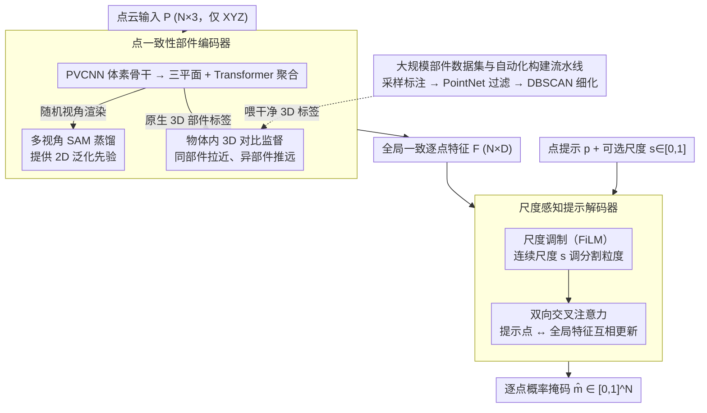

# S2AM3D: Scale-controllable Part Segmentation of 3D Point Clouds

**会议**: CVPR2026  
**arXiv**: [2512.00995](https://arxiv.org/abs/2512.00995)  
**代码**: [项目主页](https://sumuru789.github.io/S2AM3D-website/)  
**领域**: 3D视觉  
**关键词**: 点云部件分割, 多粒度控制, 对比学习, 2D-3D联合监督, SAM

## 一句话总结

提出融合2D预训练先验与3D对比监督的点云部件分割框架S2AM3D，通过点一致性编码器获得全局一致的点特征，并设计尺度感知提示解码器实现连续可控的分割粒度调节，在多个基准上大幅超越现有方法。

## 背景与动机

点云部件级分割是连接细粒度几何细节与高层语义理解的关键任务，在3D内容创建、机器人操控和逆向工程等领域有重要应用。现有方法面临两大挑战：

1. **原生3D方法泛化性差**：高质量3D部件标注成本高昂，现有数据集规模和类别多样性有限（如ShapeNet-Part、PartNet），导致在开放域形状上的泛化性能严重受限
2. **2D先验方法跨视图不一致**：利用SAM等2D模型对3D渲染图进行分割再融合的方法，在遮挡、细长结构和复杂拓扑下会产生跨视图不一致性，累积误差损害全局3D一致性
3. **粒度控制不灵活**：PartField等基于特征聚类的方法依赖后处理聚类，控制不连续且不直观；Point-SAM等基于点提示的方法缺乏显式粒度控制机制

## 方法详解

### 整体框架

S2AM3D 要解决的核心矛盾是：纯 3D 部件分割数据太少、泛化差，而借 SAM 等 2D 模型给 3D 渲染图打标再回投，又会在遮挡和复杂拓扑下跨视图打架。它的思路是把两条路拧成一股——2D 先验负责泛化，3D 对比监督负责全局一致——并把分割粒度做成一个能连续旋的"旋钮"。

整体走两段解耦训练。第一段训练**点一致性部件编码器**：输入点云 $\mathbf{P} \in \mathbb{R}^{N \times 3}$，输出每个点一个特征 $\mathbf{F} \in \mathbb{R}^{N \times D}$，训练信号同时来自多视角 SAM 蒸馏和原生 3D 标签的对比损失。第二段冻结编码器、训练**尺度感知提示解码器**：给定一个点提示索引 $p$ 和一个可选尺度提示 $s \in [0,1]$，解码器输出该提示对应部件的概率掩码 $\hat{\mathbf{m}} \in [0,1]^N$。把粒度交给 $s$，同一个点提示就能在不重新聚类的前提下返回"一条桌腿"或"整套桌腿加桌面"。其中编码器阶段的 3D 对比监督所需的干净部件标签，由作者自建的大规模部件数据集提供。

### 关键设计

**1. 点一致性部件编码器：在 2D 蒸馏之上叠 3D 对比监督，治跨视图不一致**

单靠多视角 2D 蒸馏的毛病在于各视角各分各的，遮挡、细长结构、复杂拓扑下不同视角对同一部件的判断会冲突，融合回 3D 就出现边界模糊、内部割裂。编码器用 PVCNN 体素骨干提特征，转成三平面（tri-plane）表示 $\mathbf{T} \in \mathbb{R}^{3 \times D \times H \times W}$（$xy$、$yz$、$zx$ 三个正交面），再经 Transformer 聚合；三平面从随机视角渲染成 2D 潜变量交给 SAM 蒸馏。取某点 $(x,y,z)$ 的特征时，把它投到三个面上求和：

$$\mathbf{F} = \Big[\mathbf{T}_{xy}(x_n, y_n) + \mathbf{T}_{yz}(y_n, z_n) + \mathbf{T}_{zx}(z_n, x_n)\Big]_{n=1}^{N}$$

真正治"跨视图打架"的是叠进来的 3D 对比监督。它直接在原生 3D 部件标签上做对比，且把对比限制在单个物体内部（intra-instance，每个 mini-batch 只放一个物体），避免跨物体的语义错配。对锚点 $i$（标签 $y_i$），同部件的点构成正样本集 $\hat{P}(i) = \{j \in \hat{P} \setminus \{i\} \mid y_j = y_i\}$，用带温度 $\tau$ 的余弦相似度 $s_{ij} = \mathbf{f}_i^\top \mathbf{f}_j / \tau$ 拉近正样本、推远负样本：

$$\mathcal{L}_{\text{contr}} = \frac{1}{|\hat{P}|} \sum_{i \in \hat{P}} -\log \frac{\sum_{j \in \hat{P}(i)} e^{s_{ij}}}{\sum_{j \in \hat{P} \setminus \{i\}} e^{s_{ij}}}$$

这一项把同部件的点在特征空间里压成一团、不同部件推开，得到全局一致、边界清晰的逐点嵌入——消融里它正是最大的性能来源。

**2. 尺度感知提示解码器：把分割粒度做成一个连续可调的旋钮**

PartField 那类靠后处理聚类调粒度，控制不连续也不直观；Point-SAM 那类点提示又没有显式的粒度档位。这里把粒度直接编码成连续标量 $s \in [0,1]$（定义为目标部件点数占总点数的比例），喂给解码器调制特征。解码器先给编码器特征 $\mathbf{F}$ 叠上 3D 正弦位置编码得到基础表示 $\mathbf{X}^{(0)} = \mathbf{F} + \mathrm{PE}(\mathbf{P})$，随后做两件事。

一是**尺度调制**。把连续的 $s$ 过一组可学习正弦嵌入 $\mathbf{e}(s) = \big[\sin(\omega_k s + \phi_k),\ \cos(\omega_k s + \phi_k)\big]_{k=1}^{M}$（$\{\omega_k,\phi_k\}$ 可学，$M$ 为频率对数），再用 FiLM 在通道维上对全局特征做仿射调制：

$$[\boldsymbol{\gamma}, \boldsymbol{\beta}] = \text{Linear}(\mathrm{LN}(\mathbf{e}(s))), \qquad \mathrm{FiLM}(\mathbf{X}; s) = \mathbf{X} \odot (1 + \alpha \boldsymbol{\gamma}) + \alpha \boldsymbol{\beta}$$

其中 $\alpha$ 是可学习标量门控。FiLM 与 Transformer 块交替堆 $L_m$ 层 $\mathbf{X}^{(\ell+1)} = T_\ell\big(\mathrm{FiLM}(\mathbf{X}^{(\ell)}; s)\big)$，得到尺度条件下的增强表示 $\tilde{\mathbf{F}} = \mathbf{X}^{(L_m)}$。训练时还以 0.1 的概率把 $\mathbf{e}(s)$ 整个置零（尺度 Dropout），此时 FiLM 退化成恒等映射，于是推理阶段即使不给 $s$ 也能正常出结果。直观地说，旋小 $s$ 让同一个点提示收敛到更细的子部件，旋大 $s$ 则吸纳更多邻接点扩成大部件：比如点在椅子腿上，小 $s$ 出"单条腿"，调大就逐步并入"四条腿底座"乃至"整把椅子"。

二是**双向交叉注意力**。单向交叉注意力很难在一次前向里既聚上下文又做细化，所以这里让提示点特征 $\tilde{\mathbf{F}}_p \in \mathbb{R}^{1 \times D}$ 和全局特征 $\tilde{\mathbf{F}} \in \mathbb{R}^{N \times D}$ 来回各更新一遍：

$$\mathbf{q}^{(\ell+1)} = \mathbf{q}^{(\ell)} + \mathrm{CAttn}(\mathbf{q}^{(\ell)}; \mathbf{Y}^{(\ell)})$$

$$\mathbf{Y}^{(\ell+1)} = \mathrm{FFN}\Big(\mathbf{Y}^{(\ell)} + \mathrm{CAttn}(\mathbf{Y}^{(\ell)}; \mathbf{q}^{(\ell+1)})\Big)$$

提示 query 先从全局特征吸上下文，全局特征再回头被更新后的 query 细化。堆 $L_d$ 层后过 MLP + Sigmoid 出逐点概率掩码 $\hat{\mathbf{m}} = \sigma(\mathrm{MLP}(\mathbf{H})) \in [0,1]^N$。

**3. 大规模部件数据集与自动化构建流水线：给 3D 对比监督喂足干净数据**

3D 对比监督要奏效，前提是有足够多、足够干净的原生部件标签，而现有 3D 部件数据集类别和规模都吃紧。作者从 Objaverse 出发自建了一套覆盖 400+ 类别、含 10 万+ 点云实例、约 120 万部件标注的数据集，靠三步自动化流水线把噪声压下去：先按表面积比例采样并分配部件标签；再训练一个二分类 PointNet 验证器，自动剔除标注不合理的样本；最后对同一标签下空间不连通的区域用 DBSCAN 拆成独立标签，修掉"一个标签横跨两块不相连几何"的脏标注。消融显示把它换成 PartNet 训练数据后性能明显掉，说明这批数据和已有数据在分布上互补。

### 损失函数

分割端用**动态加权 BCE + Dice** 的混合目标：

$$\mathcal{L}_{\text{seg}} = \lambda_{\text{bce}} \mathrm{BCE}_{\text{dyn}}(\hat{\mathbf{m}}, \mathbf{m}) + \lambda_{\text{dice}} \left(1 - \frac{2\hat{\mathbf{m}}^\top \mathbf{m}}{\|\hat{\mathbf{m}}\|_1 + \|\mathbf{m}\|_1}\right)$$

动态 BCE 按每个样本的正样本比例 $\pi$ 自适应给权重 $\beta = (1-\pi)/(\pi + \varepsilon)$，缓解部件占比悬殊带来的类别不平衡；Dice 项直接优化集合级重叠，对小部件和长尾分布更稳。编码器阶段则由 SAM 蒸馏损失与上面的对比损失 $\mathcal{L}_{\text{contr}}$ 共同监督。

## 实验

### 主实验结果

**交互式分割（点提示 → 单部件掩码）**：

| 方法 | PartObjaverse-Tiny (IoU%) | PartNet-E (IoU%) | 平均 |
|------|:---:|:---:|:---:|
| Point-SAM | 31.46 | 50.23 | 40.85 |
| P3-SAM | 35.05 | 39.98 | 37.52 |
| **S2AM3D** | **46.47** | **62.52** | **54.50** |
| **S2AM3D (+scale)** | **61.19** | **77.51** | **69.35** |

**全分割（预测所有点的部件标签）**：

| 方法 | PartObjaverse-Tiny (IoU%) | PartNet-E (IoU%) | 平均 |
|------|:---:|:---:|:---:|
| Find3D | 20.76 | 21.69 | 21.23 |
| SAMPart3D | 48.79 | 56.17 | 52.48 |
| SAMesh | - | 26.66 | - |
| PartField | 51.54 | 59.10 | 55.32 |
| P3-SAM | 58.10 | 65.39 | 61.75 |
| **S2AM3D** | **63.29** | **77.98** | **70.64** |

### 消融实验

| 设置 | PartObjaverse-Tiny | PartNet-E | 平均 |
|------|:---:|:---:|:---:|
| **+scale 完整模型** | **61.19** | **77.51** | **69.35** |
| +scale 去掉3D监督 | 53.94 | 64.11 | 59.03 |
| +scale 去掉自建数据 | 53.12 | 66.12 | 59.62 |
| **No scale 完整模型** | **46.47** | **62.52** | **54.50** |
| No scale 去掉3D监督 | 41.14 | 55.39 | 48.27 |
| No scale 去掉自建数据 | 42.12 | 58.56 | 50.34 |
| No scale 去掉尺度嵌入 | 42.31 | 58.28 | 50.30 |

### 关键发现

- **3D对比监督是最大性能贡献者**：去掉后 +scale 设置下平均IoU下降10.32%，特征可视化显示边界模糊和内部不一致
- **尺度提示带来显著提升**：加入尺度条件后，交互式分割平均IoU从54.50%提升至69.35%（+14.85%）
- **自建数据集的关键作用**：替换为PartNet训练数据后性能明显下降，证明大规模高质量数据的分布互补价值
- **尺度嵌入增强解码鲁棒性**：即使推理时不提供尺度，有尺度嵌入训练的模型仍优于无尺度嵌入版本（54.50 vs 50.30）
- **仅需XYZ坐标**：相比Point-SAM需要颜色、P3-SAM需要法线，S2AM3D仅用坐标即可取得最优结果

## 亮点

- 2D-3D联合训练范式设计巧妙：用2D先验提供泛化能力，用3D对比监督保证全局一致性，互补性强
- 尺度感知解码器通过FiLM + 双向交叉注意力实现连续粒度控制，支持从细到粗的平滑过渡
- 自动化数据流水线（标注→过滤→细化）具有可扩展性，构建了目前最大规模的3D部件分割数据集之一
- 同一框架统一了交互式分割和全分割两种任务

## 局限与展望

- 仅支持点提示和尺度信号交互，未来可引入文本指令实现更直观的语义交互
- 依赖PartField预训练参数初始化编码器，编码器本身的创新有限
- 数据集标注依赖自动化流水线，过滤策略（PointNet验证器）的泛化性未充分验证
- 未讨论推理速度和内存消耗，10000个采样点的三平面 $448 \times 512 \times 512$ 维度较大
- 评估数据集规模偏小（PartObjaverse-Tiny仅200样本），更大规模评估可增强说服力

## 评分

- 新颖性: ⭐⭐⭐⭐ — 2D-3D联合监督 + 连续尺度控制的组合设计有创意，但编码器基础架构沿用PartField
- 实验充分度: ⭐⭐⭐⭐ — 两种任务设置+消融+可视化较完整，但评估数据集规模偏小
- 写作质量: ⭐⭐⭐⭐ — 逻辑清晰，公式推导规范，图表质量高
- 价值: ⭐⭐⭐⭐ — 为3D部件分割提供了实用的粒度控制方案，数据集贡献有附加价值

<!-- RELATED:START -->

## 相关论文

- [\[CVPR 2026\] JOPP-3D: Joint Open Vocabulary Semantic Segmentation on Point Clouds and Panoramas](jopp3d_joint_open_vocabulary_semantic_segmentation.md)
- [\[ICLR 2026\] PartSAM: A Scalable Promptable Part Segmentation Model Trained on Native 3D Data](../../ICLR2026/3d_vision/partsam_a_scalable_promptable_part_segmentation_model_trained_on_native_3d_data.md)
- [\[ECCV 2024\] 3×2: 3D Object Part Segmentation by 2D Semantic Correspondences](../../ECCV2024/3d_vision/3x2_3d_object_part_segmentation_by_2d_semantic_correspondenc.md)
- [\[CVPR 2026\] 3D sans 3D Scans: Scalable Pre-training from Video-Generated Point Clouds](3d_sans_3d_scans_scalable_pre-training_from_video-generated_point_clouds.md)
- [\[CVPR 2026\] GaussianGrow: Geometry-aware Gaussian Growing from 3D Point Clouds with Text Guidance](gaussiangrow_geometry-aware_gaussian_growing_from_3d_point_clouds_with_text_guid.md)

<!-- RELATED:END -->
