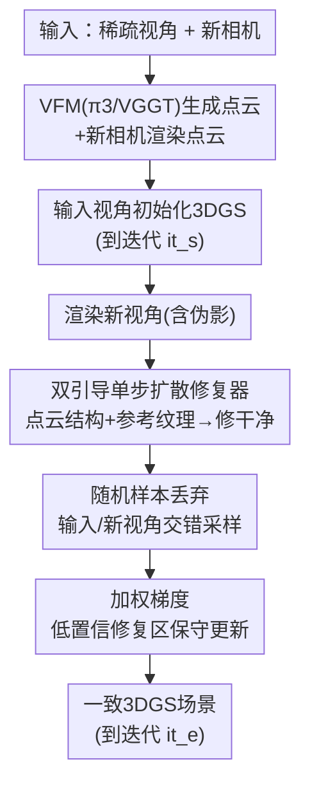

# S2D: Sparse to Dense Lifting for 3D Reconstruction with Minimal Inputs

**会议**: CVPR 2026  
**论文**: [CVF Open Access](https://openaccess.thecvf.com/content/CVPR2026/html/Ji_S2D_Sparse_to_Dense_Lifting_for_3D_Reconstruction_with_Minimal_CVPR_2026_paper.html)  
**代码**: https://george-attano.github.io/S2D （项目页）  
**领域**: 3D视觉 / 3D高斯泼溅 / 稀疏视角重建  
**关键词**: 3DGS, 稀疏视角重建, 单步扩散, 伪影修复, 点云引导

## 一句话总结
S2D 把"稀疏点云"和"3D 高斯泼溅（3DGS）"两种表示桥接起来：用一个点云引导的单步扩散修复器把稀疏输入下渲染出的新视角伪影修干净，再配一套带随机样本丢弃和加权梯度的重建策略稳住优化，从而用极少输入（甚至 1 张图看 30°、<10 张图看 180°+）就能重建出高质量、3D 一致的 3DGS 场景。

## 研究背景与动机
**领域现状**：3DGS 在自动驾驶和具身 AI 仿真里已是重要的显式 3D 表示，渲染快、质量高。但它有个长期约束——当视角偏离输入位姿时渲染质量急剧退化，要维持低视角插值距离就得喂大量输入图。现实中很难保证稠密输入，算力成本也高，这严重阻碍了 3DGS 的实际落地。

**现有痛点**：为了减少输入，社区试了三条路，但在"极稀疏输入"这个最苛刻设定下都崩。① **前馈模型**（pixelSplat、MVSplat、DepthSplat 等）直接预测高斯属性，但在极稀疏场景下仍产生大量伪影；② **生成式新视角合成**（条件于相机外参或稀疏点的扩散）保不住 3D 一致性和生成保真度，还很耗时，且无法对长序列做精确相机控制；③ **DIFIX** 这类生成式"修复器"能去掉新视角伪影、支持相对稀疏的输入，但它建立在小视角偏移和轻微伪影之上，且忽略了"新视角引导"和"真实输入"之间的鸿沟、直接拿去重建，造成严重 3D 不一致——在 S2D 定义的稀疏设定下 DIFIX 彻底失效。

**核心矛盾**：稀疏输入下，**新视角的伪影太大**（DIFIX 只会修小伪影），而**修复出的"伪 GT"和真实输入之间又有不可避免的偏差**——如果优化时无差别地信这些修复结果，会过拟合到错误细节、破坏 3D 一致性；但完全不信、只用输入视角又会欠拟合、覆盖不到外推区域。

**本文目标**：分解为两个子问题——① 怎么在极端伪影下还能修出高保真、跨视角一致的新视角引导？② 怎么在"稀疏输入 + 稠密修复引导"的混合监督下稳定拟合 3DGS、不被错误引导带偏？

**切入角度**：作者注意到最新的视觉基础模型（VFM，如 VGGT、π3、MapAnything）能瞬间做稠密点云重建，且点云天然视角无关、结构一致——虽然点云渲染不够照片级（有混叠和累积误差噪声），但正好可以当作"结构一致的引导"补足 DIFIX 缺的那块。

**核心 idea**：用点云渲染（结构引导）+ 邻近输入视角（纹理引导）做**双引导**喂给一个单步扩散修复器，把稀疏渲染的极端伪影修干净；再用随机样本丢弃 + 加权梯度的重建策略，让优化既有充分的输入视角监督、又对可能修错的区域保守更新。

## 方法详解

### 整体框架
S2D 的输入是任意数量的输入视角 + 任意新相机，输出是视角范围大幅扩展的一致 3DGS 场景。流程是：先用 VFM 从输入视角生成点云、在新相机上渲染点云；在输入视角上初始化 3DGS 直到采样迭代 $it_s$；此时对所有新相机渲染一遍，得到带伪影的新视角图，连同邻近输入视角（纹理参考）和对应点云渲染（结构参考）一起送进伪影修复器，修出干净的新视角；之后用"输入视角 + 修复结果"的混合监督继续优化到最终迭代 $it_e$，期间用随机样本丢弃和加权梯度稳住训练，最终得到一致的 3DGS。

### 关键设计

**1. 双引导单步扩散修复器：点云结构 + 参考纹理 + 混合模块**

针对"DIFIX 只修小伪影、靠邻近视角只有纹理引导"的痛点，作者在单步扩散模型上引入双引导。DIFIX 用邻近视角当参考，主要提供纹理引导、能修模糊区但搞不定大伪影和结构损坏；而点云视角无关、结构一致，正好补结构。但点云有混叠和累积误差噪声，不能全信，所以设计了一个**混合模块**：先抽目标视角和对应点云引导的 DINO 特征与图像特征，过投影层后合并，经交叉注意力后抬升生成一张"混合输入图" $I_m$——这个模块专门鼓励模型用好点云引导，只取其中有价值的部分。修复走单步扩散（基于 pix2pix-turbo，UNet 从 SD-Turbo、VAE 从 DIFIX 初始化）：混合图 $I_m$ 和参考图 $I_r$ 经 VAE 编码成 $[z^m,z^r]$，多视角时间条件 UNet 在固定时间步 $t_d$ 预测噪声 $[Z^m,Z^r]=\epsilon_\theta([z^m,z^r],t_d)$，丢掉 $Z^r$、只对 $z^m$ 做单步去噪得 $z^d$，再解码成修复图 $I^{\text{fix}}=\mathcal{D}(z^d)$。训练只调混合模块 + VAE/UNet 上的 LoRA 适配器，损失把 backbone 的 CLIP loss 换成 DINO 特征余弦相似度并加 SSIM：$\mathcal{L}=0.2\mathcal{L}_{\text{LPIPS}}+0.4\mathcal{L}_2+0.25\mathcal{L}_{\text{SSIM}}+\mathcal{L}_{\text{GAN}}+\mathcal{L}_{\text{DINO}}$。消融显示：若像 DIFIX 那样直接把点云、参考、伪影图一起塞进 UNet（去掉混合模块），模型会忽略点云只用其他图；混合模块若放在 VAE 之后直接操作潜变量则结果过度平滑。

**2. 随机样本丢弃：交错输入/新视角，保证输入监督持续充分**

针对"稀疏输入 + 大量新视角（如 6 输入 vs 300 新视角）时输入监督被淹没"的痛点。如果不管，纹理、小字这类细节会被新视角引导平均掉（生成式方法的通病）。作者用概率采样策略让两类视角在训练序列里均匀交错，目标是让输入视角占比满足 $\frac{|S_{\text{ref}}|}{|S_{\text{novel}}|+|S_{\text{ref}}|}=\alpha$。训练时每个抽到的样本按概率 $P^{\text{drop}}$ 决定是否丢弃：若 $s_i\in V_{\text{ref}}$ 则 $1-\min(1,\frac{\alpha}{r_i})$，若 $s_i\in V_{\text{novel}}$ 则 $1-\min(1,\frac{1-\alpha}{1-r_i})$，其中 $r_i$ 是当前序列里已出现的输入视角比例。这样既稳定控制两类引导的比例、又给训练提供连续充分的输入视角监督。实验在 DL3DV 上扫 $\alpha$（0=完全丢输入、1=完全丢新视角），实际取 $\alpha=0.7$。

**3. 加权梯度：对低置信修复区域保守更新，防过拟合错误细节**

针对"严重伪影下修复结果和真值仍有偏差、无差别信任会过拟合错误细节"的痛点。前人要么忽略这问题、要么对新视角用一个统一的小权重（仍会过拟合到错误细节）。作者改成像素级权重 $W\in[0,1]^{H\times W}$，基于点云渲染得到的置信掩码 $M^{\text{conf}}$：新视角处 $W_i(x,y)=\beta+(1-\beta)M^{\text{conf}}_i(x,y)$，输入视角处恒为 1。置信掩码 $M^{\text{conf}}_v(x,y)=\mathbb{I}((x,y)\in\mathcal{P})$ 即该像素是否被点云投影覆盖——有点云覆盖的区域可信、给高权重，没点云覆盖却有大伪影的区域给低权重、保守更新。对一个泼溅高斯 $g_i$，其梯度按 $\nabla_i\mathcal{L}=\frac{1}{|P_i|}\sum_{x,y\in P_i}W_i(x,y)\frac{\partial\mathcal{L}}{\partial G_i(x,y)}$ 加权，使含潜在伪影的区域在反传中贡献更少。这避免了被错误引导主导优化导致的高斯模型震荡或失败。$\beta=1$ 表示不加权，实测取 $\beta=0.4$ 兼顾伪影抑制和整体质量。

## 实验关键数据

### 主实验
室内/室外/驾驶场景全面评测，结构质量用 PSNR/SSIM、感知质量用 LPIPS/FID。in-the-wild 场景中正脸场景（3DOVS）只用 1 张图、其余用 6 张图。

| 数据集@输入 | 指标 | S2D | DIFIX | 提升 |
|-------------|------|-----|-------|------|
| 3DOVS @ 1图 | PSNR↑ | **21.41** | 14.10 | +7.31 |
| 3DOVS @ 1图 | LPIPS↓ | **0.27** | 0.56 | −0.29 |
| RE10K @ 2图 | PSNR↑ | **27.62** | 26.11 | +1.51 |
| MIP360 @ 6图 | PSNR↑ | **20.97** | 19.43 | +1.54 |
| DL3DV @ 6图 | PSNR↑ | **23.2** | 20.4 | +2.8 |
| DL3DV @ 6图 | FID↓ | **41.2** | 55.3 | −14.1 |

极稀疏设定下传统方法（3DGS、Mip-Splatting）和前馈 SOTA（DepthSplat、AnySplat）都显著退化；生成式方法（SEVA）感知质量尚可但保不住长序列精确相机控制。S2D 在四组 in-the-wild 数据上全面领先，1 张图输入（3DOVS）的优势最夸张（PSNR 比 DIFIX 高 7 个点）。

驾驶场景（Waymo）同样领先：

| 方法 | 插值PSNR↑ | 插值LPIPS↓ | 变道2m FID↓ | 变道3m FID↓ | 抬升1.5m FID↓ |
|------|-----------|------------|-------------|-------------|----------------|
| StreetCrafter | 29.31 | 0.10 | 57.4 | 66.4 | 59.0 |
| DIFIX | 30.26 | 0.11 | 60.2 | 71.6 | 60.3 |
| S2D (Ours) | **31.44** | **0.07** | **46.1** | **53.9** | **41.3** |

注：变道/抬升是外推轨迹（无真值），用 FID 衡量；DIFIX 的变道 FID 反而比专门训练驾驶视频生成的 StreetCrafter 还高，而 S2D 在插值和外推上都更优。

### 消融实验

| # | 配置 | PSNR↑ | LPIPS↓ | 说明 |
|---|------|-------|--------|------|
| ① | 仅点云生成(无参考混合) | 12.7 | 0.71 | 单步去噪恢复不出准确背景 |
| ② | 混合模块放 VAE 之后(操作潜变量) | 15.6 | 0.49 | 结果过度平滑、漂离原空间 |
| ③ | 去混合模块(像 DIFIX 直接拼) | 19.0 | 0.38 | 模型忽略点云、只用其他图 |
| ④ | 双引导 w/o DINO | 22.1 | 0.27 | 注意力不够均衡 |
| ⑤ | 双引导 w DINO（完整） | **23.0** | **0.26** | DINO 引导帮助平衡注意力 |

### 关键发现
- **混合模块是用好点云引导的关键**：去掉它（③，19.0 PSNR）模型会忽略点云只用纹理参考——因为早期 loss 主要被整体图像质量主导，点云的细节结构引导被盖住；加 DINO 特征引导（④→⑤）能帮注意力在混合时更均衡，但增益不算大（+0.9 PSNR）。
- **混合要在像素/图像层做、别在潜变量层做**：在 VAE 之后操作潜变量（②）会让目标漂离去噪 backbone 决定的原始空间，结果过度平滑（仅 15.6 PSNR）。
- **随机样本丢弃保细节、加权梯度治大伪影**：消融可视化显示，没有随机样本丢弃时纹理/小字会被新视角引导平均掉；加权梯度则在点云引导缺失但伪影大的区域阻止"永久性错误更新"，对严重伪影作用更大。

## 亮点与洞察
- **用点云补"结构一致性"这块拼图**：DIFIX 只有纹理引导、修不了大伪影，S2D 看准点云视角无关 + 结构一致的特性，把 VFM 瞬时点云当结构锚——这是"基础模型时代怎么给生成式修复补结构约束"的一个干净范式。
- **单步扩散 + LoRA 微调的效率取舍**：修复器基于 pix2pix-turbo 单步去噪，评测可在单张 RTX 4090 上跑，避开了视频扩散蒸馏的高耗时，对实际部署友好。
- **加权梯度的置信掩码用"是否被点云覆盖"定义**，零额外网络、直接复用已有点云渲染——一个很省的可信度信号，思路可迁移到任何"有部分可信几何引导"的优化问题。
- **即插即用**：S2D 不固定输入数量、支持任意输入密度，可套在大多数 3DGS 方法上大幅降低其输入需求，泛化性强。

## 局限与展望
- 训练成本不低：配对数据 curation 用了 850 H200 GPU 小时，修复器在 8 卡 H200 上训 60 小时——虽然推理便宜，但复现修复器门槛高。⚠️
- 修复质量上限受 VFM 点云质量制约：点云有混叠/累积误差噪声，若 VFM（π3/VGGT）在某场景重建失败，结构引导就失真，加权梯度只能保守跳过而非纠正。
- 纯生成式对比方法因不支持长序列精确相机控制，部分结构指标（PSNR/SSIM）未参与对比，横向比较仅在感知指标（LPIPS/FID）上——评测口径需留意此 caveat。⚠️
- 超参 $\alpha=0.7$、$\beta=0.4$ 在 DL3DV 上调出，跨场景（驾驶 vs 室内 360°）是否需重调论文未充分展开。
- 仍是静态/准静态场景重建，动态物体（驾驶场景里的运动车辆/行人）如何处理未深入讨论。

## 相关工作与启发
- **vs DIFIX/DIFIX3D+（生成式伪影修复器）**：DIFIX 靠邻近视角只有纹理引导、建立在小视角偏移 + 轻伪影上，极稀疏下完全失效；S2D 加点云结构引导 + 混合模块 + 重建策略，把适用范围推到 1 张图看 30°、6 张图看 180°+，在 3DOVS@1图 上 PSNR 高出 7 个点。
- **vs 前馈 3DGS（pixelSplat / MVSplat / DepthSplat）**：它们直接预测高斯属性、缺显式 3D 监督，极稀疏下仍有大量伪影且泛化受限；S2D 走"先重建后修复 + 稳健拟合"路线，对极端输入更鲁棒。
- **vs VFM 点云重建（VGGT / π3 / MapAnything）**：S2D 不直接拿 VFM 做照片级合成（点云渲染有噪声、不够真），而是把它当结构一致引导喂给修复器——是"把基础模型当中间件而非终点"的一种用法。
- **vs 驾驶场景视频生成蒸馏（StreetCrafter）**：StreetCrafter 用驾驶视频生成模型做新轨迹，变道 FID 仍偏高；S2D 在 Waymo 插值和外推（变道/抬升）上都更优，且不依赖特定领域视频模型。

## 评分
- 新颖性: ⭐⭐⭐⭐ 点云双引导 + 混合模块 + 加权梯度的组合较新颖，但单步扩散修复、LoRA 微调、随机采样等组件多基于已有工作改造。
- 实验充分度: ⭐⭐⭐⭐⭐ 室内/室外/驾驶三类场景、多输入密度、扎实的消融与超参扫描，对比覆盖前馈/生成式/修复式三条路线。
- 写作质量: ⭐⭐⭐⭐ 动机和痛点剖析清晰、公式完整；部分符号（去噪步骤 $z^d$ 系数）排版略乱，需对照原文。
- 价值: ⭐⭐⭐⭐⭐ 把 3DGS 的输入需求压到极低且即插即用，对自动驾驶/具身仿真的实际落地价值高。

<!-- RELATED:START -->

## 相关论文

- [\[CVPR 2026\] Unblur-SLAM: Dense Neural SLAM for Blurry Inputs](unblur-slam_dense_neural_slam_for_blurry_inputs.md)
- [\[CVPR 2026\] 4D Reconstruction from Sparse Dynamic Cameras](4d_reconstruction_from_sparse_dynamic_cameras.md)
- [\[CVPR 2026\] Minimal Constraint Relaxation for Multiview Autocalibration](minimal_constraint_relaxation_for_multiview_autocalibration.md)
- [\[CVPR 2026\] Dense Metric Depth Completion from Sparse Direct Time-of-Flight Sensors](dense_metric_depth_completion_from_sparse_direct_time-of-flight_sensors.md)
- [\[CVPR 2026\] FSFSplatter: Geometrically Accurate Reconstruction with Free Sparse-view Images within 2 minutes](fsfsplatter_geometrically_accurate_reconstruction_with_free_sparse-view_images_w.md)

<!-- RELATED:END -->
