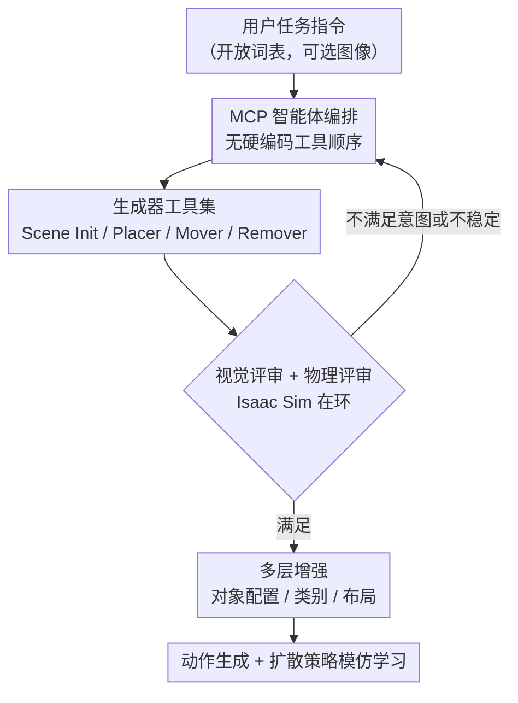

# SAGE: Scalable Agentic 3D Scene Generation for Embodied AI

**会议**: CVPR 2026  
**论文**: [CVF Open Access](https://openaccess.thecvf.com/content/CVPR2026/html/Xia_SAGE_Scalable_Agentic_3D_Scene_Generation_for_Embodied_AI_CVPR_2026_paper.html)  
**代码**: 项目页（论文称已开源 Code/demo/SAGE-10k 数据集）  
**领域**: 3D视觉  
**关键词**: 智能体生成、3D场景合成、具身智能、仿真就绪、自我修正

## 一句话总结
SAGE 把 3D 室内场景生成做成一个在 MCP 协议下运行的智能体：它按需调用布局/资产生成器，再用"视觉评审 + 物理评审（Isaac Sim 在环验证）"形成闭环自我修正，产出可直接放进仿真器训练机器人策略的、物理稳定的开放词表场景，并通过多层增强批量扩展数据。

## 研究背景与动机

**领域现状**：具身智能高度缺数据——真实世界采集慢、贵且不安全，仿真成了天然替代方案，但仿真数据必须同时满足真实性、多样性、仿真就绪性、任务相关性四个要求。现有 3D 场景生成大致分四类：规则系统（ProcTHOR、Infinigen）、数据驱动（ATISS、DiffuScene）、基础模型流水线（LayoutGPT、Holodeck）、以及刚出现的智能体方法（SceneWeaver）。

**现有痛点**：规则系统物理合理但词表封闭、缺乏多样性；数据驱动方法受限于稀缺的 3D 训练数据，无法泛化到新房型或开放词表提示；基础模型流水线能从文本生成但缺乏 3D grounding，常产出物理上不成立的场景（物体悬空、互相穿插）。更关键的是这些系统都是"静态"的——它们的"计算图"是写死的，无法自适应推理和自我纠错。

**核心矛盾**：场景生成的"语义合理"与"仿真可部署"之间存在鸿沟。即便是同期的智能体工作 SceneWeaver，也因为缺少物理属性、没有把仿真器放进生成回路验证，导致输出不能直接落地到机器人仿真器里训练。问题的根源在于：没有一个机制能在生成过程中持续检验"这个场景在重力和碰撞下到底稳不稳"。

**本文目标**：给定一句开放式机器人任务描述（如"拿起碗放到桌上"），自动生成可直接部署到现代仿真器、物理稳定、且能规模化的 3D 环境，并据此合成动作数据训练策略。

**切入角度**：把场景生成从"固定流水线"重构成"智能体 + 工具 + 评审"的闭环。作者的假设是：只要让智能体能自由编排生成器、并能拿到带物理验证的反馈，它就能像人一样反复试错、自我修正，逼近既真实又可仿真的结果。

**核心 idea**：用一个 MCP 智能体编排多个生成器，配上"视觉评审 + 物理评审（仿真在环）"双重反馈，让场景在闭环中自我改进到满足用户意图且物理有效，再用多层增强把单个场景扩展成可训练策略的大规模数据集。

## 方法详解

### 整体框架
SAGE 的输入是一句自然语言的机器人任务需求，输出是一批可直接放进 Isaac Sim 训练具身策略的、物理稳定的 3D 场景及配套动作数据。整体分两段：先是**智能体驱动的单场景生成**——智能体作为 MCP 客户端，按需调用生成器工具构建/编辑场景，并根据视觉与物理两个评审的反馈反复自我修正；然后是**面向具身 AI 的规模化**——把一个生成好的场景做多层增强扩成大量任务一致的变体，再自动生成抓取/导航动作数据，用扩散策略做模仿学习。

整条管线没有硬编码的工具调用顺序：智能体每一步根据当前需求（要生成地板？要加资产？要验证稳定性？）发出结构化 MCP 请求，服务器执行并返回结果作为反馈，智能体据此决定下一步动作，直到场景被判定既视觉真实又物理稳定。

### 关键设计

**1. MCP 智能体编排：把写死的"计算图"换成可自适应推理的工具调用**

针对"现有系统计算图固定、无法自我纠错"这个根本痛点，SAGE 让智能体在 Model Context Protocol（MCP）下运行：智能体是 MCP 客户端，每个工具（布局生成器、物理仿真器等）托管在各自的 MCP 服务器后面。智能体不按预设顺序执行，而是在每轮迭代里识别"此刻需要什么能力"（生成地板平面 / 验证物理稳定性 / 移除某个物体），发出结构化请求，服务器返回结果，智能体把它当反馈来决定下一步动作。这种设计的好处是工具编排完全由推理驱动、无硬编码逻辑，因此能根据场景当前状态灵活地"先加再移、不稳就换小物体"，这是静态流水线做不到的。

**2. 生成器工具集：四类原子编辑操作 + 资产级物理属性估计**

智能体能调用的生成器是一组可灵活组合的原子工具。**Scene Initializer** 接收场景规格，生成只有地板和墙的空房间（纹理由 MatFuse 生成、尺寸由 LLM 预测），同时输出一份"待放物体清单"，每个物体带文本描述、估计的物理属性和放置约束（与其他物体的关系、边界）——清单内容直接反映任务，比如任务是"拿苹果放进碗里"，清单里就会有苹果和碗。**Asset Placer** 用 TRELLIS 按文本生成物体，并用 VLM 估计物理属性（高度用于把单位尺寸物体缩放到真实大小、质量用于仿真、金属度/粗糙度用于 PBR 渲染），再用 LLM 把放置约束归为 floor/wall/on-top 三类，按深度优先搜索 + 碰撞规避找最满足约束的位置。**Asset Mover** 先删后用 Placer 的规划器重放，**Asset Remover** 用 LLM 推理定位并删除物体。把编辑拆成这四类原子操作，正是为了让智能体能任意组合、细粒度地增删改场景内容。

**3. 视觉评审 + 物理评审：仿真在环验证，把误差累积扼杀在生成过程中**

简单堆叠生成器会让各自的瑕疵累积成两类错误：视觉伪影（漏物体、错位）和物理违规（不稳、碰撞）。SAGE 用两个互补评审来闭环纠错。**视觉评审**输入当前场景配置（物体放置 + 俯视和四角的多视角渲染），提出"该加哪些物体、该怎么调整现有放置"，帮智能体判断下一步调哪个生成器。**物理评审**是关键差异点：每次增/删/移物体后，场景被载入 Isaac Sim 做物理测试，测量仿真后的位姿变化，凡是导致不稳或碰撞的放置直接拒绝、只保留维持全局稳定的候选；若找不到稳定配置，评审会把失败报告给智能体并建议替代动作（换小物体、调目标位置）。正是这个仿真在环的回路，让 SAGE 把物理稳定性维持在近乎完美，从而保证输出能直接落地到下游具身学习。

**4. 多层增强 + 动作生成：把单场景放大成可规模化的训练数据**

单个场景不足以训出鲁棒策略，SAGE 引入三层增强把它扩成大量任务一致的变体：**对象配置级**重采样任务相关物体（要抓的、要放上去的、要导航到的目标）的位姿，增加空间多样性；**对象类别级**用 LLM 文本增强生成几何/纹理变化（形状、颜色、材质）后再用 TRELLIS 合成 3D 资产，丰富实例级视觉与物理多样性；**场景布局级**针对需要全场景探索/导航的任务，把背景几何和任务无关物体整体重生成，产出共享同一任务规格但布局各异的场景。每步增强后都调用物理评审保证稳定。增强后的场景再自动生成动作数据——抓取用 M2T2 从深度图提候选抓取位姿、Curobo 做无碰撞 IK 轨迹，移动操作用 RRT 做路径规划，失败样本（抓取不准、目标不可达、执行碰撞）通过碰撞检查和到位验证过滤掉——最后用扩散策略（Diffusion Policy）做模仿学习。

> ⚠️ 框架图中的"MCP 智能体编排 → 生成器工具集 → 双评审 → 多层增强"四个贡献节点与上面四个关键设计一一对应；末端"动作生成 + 扩散策略"属于下游应用脚手架，已并入设计 4 一并交代。

### 损失函数 / 训练策略
SAGE 本身的场景生成不靠端到端训练，而是编排现成基础模型：智能体 LLM 与集成 LLM 用 gpt-oss-120b，视觉-语言推理用 Qwen3-VL-30B-A3B-Instruct，3D 物体用 TRELLIS、纹理用 MatFuse，物理验证用 Isaac Sim。下游策略用扩散策略训练，输入多视角 RGB-D 图像和末端执行器轨迹，输出下一步连续动作。

## 实验关键数据

### 主实验
在三类常见室内场景（卧室、厨房、客厅）上，每种房型生成 10 个场景取平均。视觉指标（Realism/Functionality/Layout/Completeness，由 GPT-4.1 打分）和物理指标（碰撞率 Coll%、Isaac Sim 中稳定物体占比 Stab%）。下表为卧室结果（节选）：

| 方法 | #Obj ↑ | Real. ↑ | Func. ↑ | Lay. ↑ | Comp. ↑ | Coll.% ↓ | Stab.% ↑ |
|------|--------|---------|---------|--------|---------|----------|----------|
| Holodeck | 28.5 | 7.4 | 6.8 | 5.0 | 6.1 | 29.1 | 51.0 |
| SceneWeaver | 17.5 | 9.0 | 9.7 | 7.8 | 7.5 | 31.0 | 58.8 |
| **SAGE（本文）** | **48.3** | **9.0** | **10.0** | **8.0** | **9.5** | **2.3** | **99.8** |

SAGE 在所有指标上都领先：物体更多、视觉更真实，碰撞率从基线的 ~30% 降到 2.3%，稳定物体占比近 99.8%。Holodeck 因固定流水线缺乏自我改进、碰撞频繁；SceneWeaver 视觉中等但因无仿真验证导致碰撞率高、稳定性低。SAGE 还展示了开放词表能力，能生成 Gym、赛博朋克游戏厅、星空卧室等长尾风格化场景。

> 指标说明：稳定性判定标准为——某物体仿真 120 步后相对平移 > 0.2 米或旋转 > 8° 即视为不稳定；碰撞率用 trimesh 在 3D 物体网格上统计。

### 消融实验
针对两个评审的作用做消融（指标为该论文 Tab. 3 报告的关键值）：

| 配置 | 碰撞率 Coll.% | 稳定性 Stab.% | 说明 |
|------|--------------|--------------|------|
| 仅生成器（无评审） | 7.8 | — | 误差累积、物理违规多 |
| + 视觉评审 | — | — | 视觉质量显著提升 |
| + 物理评审 | 1.9 | 99.6 | 碰撞大幅下降、稳定性拉满 |
| + 双评审（Full） | 最优 | 最优 | 所有指标综合最佳 |

### 关键发现
- **物理评审是物理稳定性的决定性模块**：加入后碰撞率从 7.8% 降到 1.9%、稳定性升到 99.6%，直接把"能否仿真部署"从不可用拉到可用。
- **视觉评审主管语义完整性**：显著提升真实性/功能性/完整性，弥补漏物体、错位等语义瑕疵。
- **两个评审互补**：视觉反馈 + 仿真在环验证组合才拿到全指标最优，缺一不可。
- **下游策略呈现清晰 scaling 趋势**：随场景多样性和演示数量增加，策略性能持续提升，并能泛化到未见过的物体和布局。

## 亮点与洞察
- **"仿真在环"是把生成从'看着对'推到'真能用'的关键一招**：把 Isaac Sim 直接塞进生成回路逐物体验证稳定性，而不是生成完再事后检查，从机制上杜绝了悬空/穿插这类物理违规——这是相比 SceneWeaver 等智能体方法最实质的差异。
- **用 MCP 统一编排异构工具**：把 LLM/VLM/3D 生成器/物理仿真器都包成 MCP 服务器，智能体只管推理调用，工程上天然解耦、可插拔，这套思路可迁移到任何"多工具协同 + 反馈纠错"的生成任务。
- **生成→增强→动作→策略的闭环数据引擎**：不止生成场景，还顺手把动作数据和策略训练串起来，证明了"仿真驱动的 scaling"对具身 AI 确实有效，给"用生成数据替代真实采集"提供了完整范式。
- **开放词表 + 资产级物理属性**：靠文本到 3D 合成而非检索，既覆盖长尾风格，又给每个物体挂上质量/PBR 等可仿真属性，这是"既多样又可部署"能同时成立的前提。

## 局限与展望
- **重度依赖一系列大模型与现成生成器**（gpt-oss-120b、Qwen3-VL、TRELLIS、MatFuse、Isaac Sim），整条管线的上限受这些组件能力制约，复现成本和算力门槛较高。
- **仿真在环验证逐物体调用 Isaac Sim**，每次增删改都要载入物理引擎测稳定性，生成单个复杂场景的时间开销可能较大（论文未充分量化生成耗时）。⚠️ 具体延迟以原文为准。
- **物理稳定性主要以"近乎完美"和稳定物体占比来衡量**，但仿真稳定不完全等于真实世界可交互；sim-to-real 的策略迁移效果论文以 scaling 趋势和泛化为主，真实机器人部署的鲁棒性仍待进一步验证。
- **评审打分部分依赖 GPT-4.1**，视觉质量指标带有 LLM 评判者的主观性，横向比较时需注意评测协议一致性。

## 相关工作与启发
- **vs Holodeck**：Holodeck 用 LLM 驱动但流水线固定、无自我改进，生成物体少、碰撞多。SAGE 用智能体动态编排 + 双评审闭环纠错，物体更多、碰撞率从 ~29% 压到 2.3%。
- **vs SceneWeaver（同期智能体方法）**：SceneWeaver 也用工具实现关系/碰撞感知放置，但缺少仿真器在环验证，输出不带系统化物理属性、不能直接仿真部署。SAGE 的核心增量正是把 Isaac Sim 验证设为默认产物，从"语义合理"推进到"仿真就绪"。
- **vs 规则系统（ProcTHOR/Infinigen）**：规则系统物理可靠但词表封闭、多样性受限；SAGE 用文本到 3D 合成支持开放词表，且保留物理验证。
- **vs 数据驱动（ATISS/DiffuScene）**：后者学到强空间先验但受封闭 taxonomy 限制、不附物理属性、无仿真验证；SAGE 既开放词表又仿真就绪。

## 评分
- 新颖性: ⭐⭐⭐⭐ 把仿真在环验证设为默认产物 + MCP 统一编排，相对同期智能体方法有清晰实质增量
- 实验充分度: ⭐⭐⭐⭐ 场景生成有定量/定性/消融，下游策略验证 scaling 与泛化，但生成耗时与 sim-to-real 量化偏少
- 写作质量: ⭐⭐⭐⭐ 动机—方法—实验逻辑清晰，四要素 desiderata 框架易读
- 价值: ⭐⭐⭐⭐⭐ 给"仿真驱动 scaling 训具身策略"提供了端到端可落地范式，附带开源数据集

<!-- RELATED:START -->

## 相关论文

- [\[CVPR 2026\] Wanderland: Geometrically Grounded Simulation for Open-World Embodied AI](wanderland_geometrically_grounded_simulation_for_open-world_embodied_ai.md)
- [\[CVPR 2026\] EmbodMocap: In-the-Wild 4D Human-Scene Reconstruction for Embodied Agents](embodmocap_in-the-wild_4d_human-scene_reconstruction_for_embodied_agents.md)
- [\[CVPR 2026\] PromptDepth: Efficient and Promptable Geometric 3D Vision Model for Embodied Intelligence](promptdepth_efficient_and_promptable_geometric_3d_vision_model_for_embodied_inte.md)
- [\[CVPR 2026\] MANSION: Multi-floor Language-to-3D Scene Generation for Long-horizon Tasks](mansion_multi-floor_language-to-3d_scene_generation_for_long-horizon_tasks.md)
- [\[CVPR 2026\] MSGNav: Unleashing the Power of Multi-modal 3D Scene Graph for Zero-Shot Embodied Navigation](msgnav_unleashing_the_power_of_multi-modal_3d_scene_graph_for_zero-shot_embodied.md)

<!-- RELATED:END -->
