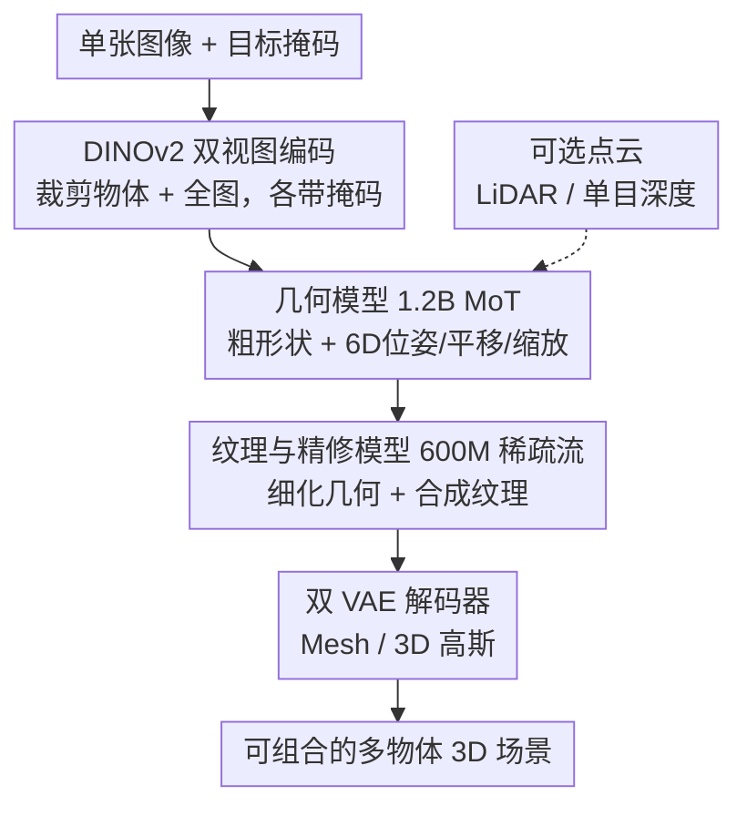

# SAM 3D: 3Dfy Anything in Images

**会议**: CVPR 2026  
**论文**: [CVF Open Access](https://openaccess.thecvf.com/content/CVPR2026/html/Chen_SAM_3D_3Dfy_Anything_in_Images_CVPR_2026_paper.html)  
**代码**: https://ai.meta.com/sam3d  
**领域**: 3D视觉  
**关键词**: 单图3D重建, 生成式重建, 流匹配, 数据引擎, 人类偏好对齐

## 一句话总结
SAM 3D 是一个从**单张自然图像**出发、为图中任意物体重建完整 3D 形状/纹理/布局的生成式基础模型，靠"模型在环 + 人类标注"的数据飞轮和 LLM 式多阶段训练突破了真实世界 3D 数据稀缺的壁垒，在真实物体与场景上对此前 SOTA 拿到至少 5:1 的人类偏好胜率。

## 研究背景与动机
**领域现状**：从单图重建 3D 一直是计算机视觉的难题。传统路线靠多视图几何拿 3D 信号，而近期的生成式方法（Trellis、Hunyuan3D 等）在**孤立的合成物体**上已经能给出不错的形状重建。

**现有痛点**：这些模型几乎都在"干净的单物体渲染图"上训练，一旦遇到自然图像里那种**远距离、被严重遮挡、场景杂乱**的物体就崩。本质问题是真实图像配对的 3D 真值极难大规模获取——给图片打"猫"标签或画掩码很容易，但让普通标注员造出一个物体的 3D 网格几乎不可能，专业 3D 艺术家做一个又要好几个小时。这就是作者反复强调的"3D 数据壁垒"。

**核心矛盾**：模型要在真实图像上泛化，就需要"真实图像 ↔ 3D 真值"的大规模配对数据；而这种数据恰恰是最贵、最难标的。合成数据管够但有域差，真实数据有用但标不起。

**切入角度**：作者借了两个老观察。其一是心理学里的"图像线索（pictorial cues）"——人类单凭一张图就能感知形状，其中关键的一条是**识别**（"熟悉物体"线索）：一旦认出这是什么，3D 形状和位姿就能被恢复，且因为新物体由见过的部件组成，识别能带来泛化。其二是**标注的不对称性**：人虽然造不出网格，却能从一组候选 3D 模型里**挑出**最像的那个、并把它的位姿对齐到图上。

**核心 idea**：把"识别驱动重建"做成生成模型，并用"模型出候选、人来挑选/评分"的数据引擎源源不断造出真实世界 3D 监督，再套 LLM 那套"合成预训练 → 真实后训练"的多阶段配方把模型对齐到真实图像和人类审美。

## 方法详解

### 整体框架
SAM 3D 把"拍照"看成一个把 3D 物体投影到 2D 像素的有损映射，目标是逆转它：给定图像 $I$ 和物体掩码 $M$，建模条件分布 $p(S, T, R, t, s \mid I, M)$，并训一个生成模型 $q$ 去逼近——其中 $S$ 是形状、$T$ 是纹理、$(R, t, s)$ 是相机坐标系下的旋转/平移/缩放（布局）。整个系统由三根支柱撑起：**推理架构**（双流 MoT + 两阶段流匹配，负责"怎么从图算出 3D"）、**多阶段训练**（合成预训练到真实后训练，负责"怎么把数据壁垒打穿"）、**MITL 数据引擎飞轮**（负责"真实监督从哪来"）。

推理侧是一个清晰的串行 pipeline：单图配掩码先用 DINOv2 编码出条件 token，几何模型先出粗形状和布局，纹理与精修模型再补细节和纹理，最后双 VAE 解码器把隐表示解成 mesh 或 3D 高斯，多个物体拼成可组合的整场景。

### 关键设计

**1. 双流 MoT 架构与两阶段隐空间流匹配：先定形再上色，识别线索贯穿全程**

直接一步从图回归 3D 既要管全局位姿又要管局部细节，很难兼顾，所以 SAM 3D 把任务拆成两阶段、并在编码上同时喂"局部清晰"与"全局语义"两路信息。**输入编码**用 DINOv2 提取四组条件 token：裁剪后的物体图 + 其掩码（提供物体的高分辨率聚焦视图），以及完整图像 + 全图掩码（提供裁剪视图里没有的场景上下文和识别线索）——后者正是"识别驱动重建"落地的地方。**几何模型**是一个 1.2B 参数的流变换器，采用 Mixture-of-Transformers（MoT）双流架构：用两条流分别处理几何 $O \in \mathbb{R}^{64^3}$ 和布局 $(R,t,s)$，仅在多模态自注意力层共享信息，建模 $p(O, R, t, s \mid I, M)$；旋转用 6D 表示 $R \in \mathbb{R}^6$。**纹理与精修模型**是一个 600M 参数的稀疏隐空间流变换器，从粗形状 $O$ 里抽出活跃体素，建模 $p(S, T \mid I, M, O)$ 来细化几何并合成纹理。最后两个共享同一 VAE 编码器（因而共享同一结构化隐空间）的解码器 $D_m, D_g$ 把结果解成 mesh 或 3D 高斯。和只重建孤立物体的 Trellis 不同，SAM 3D 多预测了布局 $(R,t,s)$，才能把若干物体摆成一个连贯的多物体场景。模型还可选地以点云 $P$（手机 LiDAR 或单目深度估计得到）为条件，方便接入其它 pipeline。

**2. LLM 式多阶段训练：用合成预训练打底、真实后训练对齐，打穿 3D 数据壁垒**

3D 真值数据比文本/图像/视频少几个数量级，硬训真实数据训不动。SAM 3D 直接搬 LLM 的多阶段配方："预训练 → 中训练 → 后训练"逐步把模型从合成域推到真实域。**预训练**用 270 万个 Objaverse-XL 等来源的物体网格、每个渲染 24 个视角的孤立合成物体（数据集 Iso-3DO，训练 2.5 万亿 token），让模型先学到丰富的形状/纹理"词汇"。**中训练**用"渲染-粘贴"造的半合成数据 RP-3DO（6100 万样本、280 万独立网格）：把渲染的纹理网格用 alpha 合成贴进自然图像，其中一类是遮挡者-被遮挡者配对、一类是把真实物体替换成相近位置尺度的合成物体——以此教会模型掩码跟随、遮挡鲁棒（被遮挡时补全形状）和布局估计。**后训练**才用真实图像，分 SFT 与偏好对齐两步：SFT 先用噪声较大的非专家标注（MITL-3DO）、再用少而精的 3D 艺术家标注（Art-3DO）来抑制悬浮碎片、无底网格、缺失对称等常见崩坏；偏好对齐用 DPO，拿数据引擎里的"优于/劣于"候选对去消除人类敏感却难被流匹配目标捕捉的瑕疵（对称、闭合等）。最后还有一个蒸馏阶段把推理的函数评估次数 NFE 从 25 降到 4，做到亚秒级出形状和布局。作者强调一个关键经验：**只要真实后训练足够，合成预训练学到的能力能泛化过去**。

**3. 模型在环（MITL）数据引擎飞轮：把"人不会造网格但会挑网格"变成可规模化的监督**

真实 3D 监督最难拿，这个数据引擎是全篇的灵魂。核心利用一个不对称事实：普通人造不出网格，但给定若干候选能挑出最像图中物体的那个。流程拆成三个子任务（见原文 Fig. 5）：Stage 1 选目标物体得到 $(I, M)$；Stage 2 让标注员从候选里挑形状/纹理 $(S, T)$ 并打分 $r$，低于阈值 $r < \omega$ 的拒掉、且这些差候选会变成偏好对齐的负样本；Stage 3 把物体相对点云对齐位姿，标出 $(R, t, s)$。Stage 2/3 都是模型在环。为提高一次标注成功（$r > \omega$）的概率，引擎让标注员在 $N=8$ 个候选里挑——这是一种"用人来做的 best-of-N 搜索"，候选越多期望质量越高，还会先用模型过滤再用人过滤来进一步放大 $N$。**冷启动**问题（第一轮模型几乎产不出好候选）靠一套现成的学习式 + 检索式模型集成来兜底出候选，随训练推进，自家最佳模型逐渐主导，最终约 80% 的标注数据由 SAM 3D 自己产出。极难的样本（没有任何模型能给出像样形状）小比例路由给专业 3D 艺术家直接标注（Art-3DO）。整个引擎可形式化成一个 API：吃进当前最佳模型 $q(S,T,R,t,s \mid I,M)$，吐出训练样本 $D^+$、质量评分 $r \in [0,1]$ 和一组都劣于 $D^+$ 的候选 $D^-$。这些数据回流训练、改进后的模型再回插引擎，形成"标注质量、标注率、模型性能同步上升"的良性循环——数据集本身是对齐过程的副产物。最终在近 100 万张图上标了约 314 万个无纹理网格和约 10 万个有纹理网格，规模空前。

## 实验关键数据

### 主实验
SAM 3D 在形状、纹理、布局三个维度都拿了大幅领先。形状上，SA-3DAO（真实图像，有几何真值）指标几乎翻倍，孤立物体集 ISO3D（无几何真值，用感知相似度）也持平或超过 SOTA。人类偏好测试中，真实物体对 SOTA 拿到约 5:1 胜率、场景级约 6:1。

| 数据集 | 指标 | 本文 SAM 3D | 之前最佳 | 说明 |
|--------|------|------|----------|------|
| SA-3DAO | F1@0.01 ↑ | **0.2344** | 0.1629 (Hi3DGen) | 真实图像形状，大幅领先 |
| SA-3DAO | vIoU ↑ | **0.2311** | 0.1531 (Hi3DGen) | 体素 IoU |
| SA-3DAO | Chamfer ↓ | **0.0400** | 0.0844 (TripoSG) | 几何误差减半 |
| SA-3DAO | EMD ↓ | **0.1211** | 0.2049 (HY3D-2.0) | 推土机距离 |
| ISO3D | Uni3D ↑ | **0.3707** | 0.3698 (Trellis) | 感知相似度，持平/略超 |

布局上，SAM 3D 的"联合生成形状+布局"开辟了新能力，在 ADD-S @ 0.1 这个指标上把"2% → 77%"，且即便给 pipeline 类方法换上 SAM 3D 的网格仍被其稳超：

| 数据集 | 范式 | 方法 | 3D IoU ↑ | ADD-S @0.1 ↑ |
|--------|------|------|----------|--------------|
| SA-3DAO | Pipeline | HY3D-2.0 + FoundationPose | 0.2937 | 0.5396 |
| SA-3DAO | Joint | **SAM 3D** | **0.4254** | **0.7232** |
| Aria Digital Twin | Joint | MIDI | 0.0336 | 0.0175 |
| Aria Digital Twin | Joint | **SAM 3D** | **0.4970** | **0.7673** |

### 消融实验
按训练阶段累加做消融（SA-3DAO 形状 + 偏好集纹理胜率），近乎单调提升，验证了多阶段配方里每一段都有用：

| 累加阶段 | F1@0.01 ↑ | Chamfer ↓ | 纹理胜率 ↑ | 说明 |
|------|---------|---------|---------|------|
| 预训练 (Iso-3DO) | 0.1349 | 0.1036 | – | 仅合成孤立物体 |
| + 中训练 (RP-3DO) | 0.1705 | 0.0760 | 60.7 | 加半合成贴图数据 |
| + SFT (MITL-3DO) | 0.2027 | 0.0578 | 66.9 | 真实非专家标注 |
| + DPO (MITL-3DO) | 0.2156 | 0.0498 | 66.4 | 偏好对齐 |
| + SFT (Art-3DO) | 0.2331 | 0.0445 | – | 艺术家高质量数据 |
| + DPO (Art-3DO) | **0.2344** | **0.0400** | – | 完整模型 |

### 关键发现
- **数据引擎迭代带来近线性的 Elo 提升**：把数据引擎跑得越久、性能越好（400 分 Elo 差≈偏好测试 10:1），且必须"所有阶段同步扩"才有这个累积线性效应；只单独迭代 MITL-3DO 数据也涨但边际递减。
- **合成预训练能泛化**：只要真实后训练充分，合成预训练打下的形状/纹理先验能迁移到真实图像——这是打穿数据壁垒的关键前提。
- **DPO 抓的是流匹配目标抓不到的东西**：SFT 后再上 DPO，能消掉对称性、闭合性这类人类敏感但通用目标难刻画的瑕疵。
- **对深度估计器是模块化的**：换一个训练时没见过的更好深度估计器，标注员反而更偏好其输出，说明系统不绑死在某个点云来源。

## 亮点与洞察
- **"人不会造、但会挑"是整个数据引擎的支点**：把昂贵的"造 3D"换成廉价的"从 N=8 个候选里挑+评分"，再用模型集成解冷启动，这个不对称性设计可迁移到任何"生成易、验证/挑选更易"的标注任务上。
- **直接搬 LLM 的多阶段 + 数据飞轮配方到 3D**，并明确给出"合成预训练能泛化"这一可被后续工作复用的经验结论，是把 3D 重建当"基础模型"来做的范式样本。
- **双流 MoT 把几何与布局解耦又共享**，仅在自注意力层互通信息，是同时输出形状和场景布局而不互相干扰的巧妙折中。
- **顺手补了一个真实世界基准 SA-3DAO**：1000 个艺术家从自然图像手工建的 3D 网格，代表"视觉接地 3D 重建"的人类专家上界，填补了真实场景缺评测的空白。

## 局限与展望
- 整套方法重度依赖**大规模标注基础设施和算力**：百万级图像标注、万亿 token 级训练、专业 3D 艺术家兜底——学术界很难复现这个数据飞轮规模。
- 布局评测（平移/缩放）需要**真值深度/点云**作参考，纯 RGB 下的布局精度上界仍受单目深度估计质量制约（⚠️ 论文称形状/纹理质量不依赖点云条件，但布局评测明确需要 GT 深度）。
- 数据引擎的质量阈值 $\omega$ 随训练动态抬升（类似交叉熵方法），其调度对最终质量的影响、以及"约 80% 数据由自家模型产出"是否带来自我强化偏差，文中讨论有限。
- ⚠️ MoT 双流的注意力掩码、蒸馏（25→4 NFE）、DPO 的具体训练细节都放在附录，正文给的是高层描述，复现需对照附录。

## 相关工作与启发
- **vs Trellis [112]**：SAM 3D 直接在其两阶段隐空间流匹配架构上搭建，但 Trellis 只重建孤立物体，SAM 3D 多预测了布局 $(R,t,s)$ 并能拼出多物体场景，且靠真实后训练大幅改善了自然图像下的鲁棒性（SA-3DAO 上 F1 从 0.1475 → 0.2344）。
- **vs Hunyuan3D / Direct3D-S2 / Hi3DGen 等生成式单图重建**：它们同样强在合成孤立物体，但在遮挡/杂乱的真实图像上掉得厉害；SAM 3D 的差距主要来自 MITL 数据引擎喂进的真实监督，而非架构本身。
- **vs MIDI [38]（联合场景生成）/ render-and-compare pipeline [47,103]**：SAM 3D 把形状与布局联合生成，在 ADD-S@0.1 上对 MIDI 实现数量级领先；且即便给 pipeline 方法换上 SAM 3D 的网格，联合范式仍占优。
- **vs SAM [44] 的标注范式**：SAM 收集分割掩码，普通人就能标；3D 视觉接地无法照搬，SAM 3D 的贡献正是设计了"模型出候选 + 人挑选评分 + 艺术家兜底"的替代飞轮来绕开这一难点。

## 评分
- 新颖性: ⭐⭐⭐⭐⭐ 把 LLM 式多阶段训练 + 模型在环数据飞轮系统性引入单图 3D 重建，并用"人挑不人造"的不对称性绕开 3D 数据壁垒。
- 实验充分度: ⭐⭐⭐⭐⭐ 形状/纹理/布局三维度 + 自建真实基准 SA-3DAO + 逐阶段消融 + Elo 数据引擎分析，覆盖很全。
- 写作质量: ⭐⭐⭐⭐⭐ 从心理学"图像线索"和标注不对称性讲起，动机链条清晰，方法与数据引擎叙述到位。
- 价值: ⭐⭐⭐⭐⭐ 开源模型/代码/在线 demo/新基准，对机器人、AR/VR、游戏等下游有直接拉动，是 3D 基础模型的标志性工作。

<!-- RELATED:START -->

## 相关论文

- [\[ICML 2026\] Fast-SAM3D: 3Dfy Anything in Images but Faster](../../ICML2026/3d_vision/fast-sam3d_3dfy_anything_in_images_but_faster.md)
- [\[CVPR 2026\] Aligning Text, Images and 3D Structure Token-by-Token](aligning_text_images_and_3d_structure_token-by-token.md)
- [\[CVPR 2026\] PhysX-Anything: Simulation-Ready Physical 3D Assets from Single Image](physx-anything_simulation-ready_physical_3d_assets_from_single_image.md)
- [\[CVPR 2026\] Generalizable Sparse-View 3D Reconstruction from Unconstrained Images](generalizable_sparse-view_3d_reconstruction_from_unconstrained_images.md)
- [\[CVPR 2026\] RoSAMDepth: Robust Self-supervised Depth Estimation Leveraging Segment Anything Model](rosamdepth_robust_self-supervised_depth_estimation_leveraging_segment_anything_m.md)

<!-- RELATED:END -->
