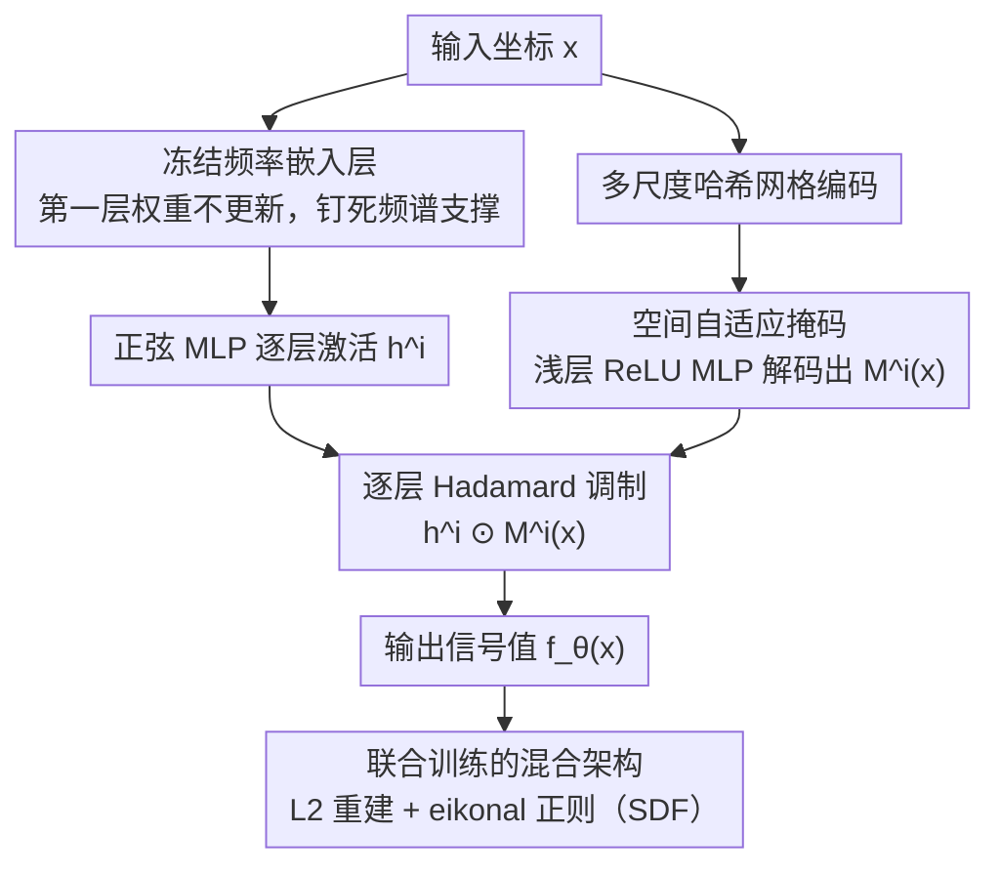

# SASNet: Spatially-Adaptive Sinusoidal Networks for INRs

**会议**: CVPR 2026  
**arXiv**: [2503.09750](https://arxiv.org/abs/2503.09750)  
**代码**: [https://github.com/Fengyee/SASNet_inr](https://github.com/Fengyee/SASNet_inr)  
**领域**: 3D视觉 / 隐式神经表示  
**关键词**: 隐式神经表示, SIREN, 空间自适应, 频率泄漏, 哈希网格

## 一句话总结

提出 SASNet，通过将冻结的频率嵌入层与轻量级哈希网格 MLP 学习的空间自适应掩码相结合，解决 SIREN 中频率初始化敏感和高频泄漏问题，在图像拟合、体数据拟合和 SDF 重建任务上实现更快收敛和更高重建质量。

## 研究背景与动机

隐式神经表示 (INR) 已成为计算机视觉和图形学中建模低维信号的强大工具，将坐标直接映射到信号值。其中，正弦网络 (SIREN) 因使用正弦激活函数能建模高频信号而被广泛使用，特别适合图像拟合、超分辨率和 SDF 建模等需要高频重建的任务。

然而，SIREN 存在一个核心痛点：对频率参数 $\omega_0$ 极度敏感。$\omega_0$ 小时产生干净但过于平滑的重建，缺失细节；$\omega_0$ 大时可以捕获锐利边缘，但在平滑区域（如图像背景）引入虚假的高频噪声——作者将这种不想要的高频成分在低频区域的激活称为"频率泄漏"。延长训练以恢复高频细节会进一步导致优化不稳定和过拟合。

根本矛盾在于：SIREN 中每个神经元的影响是全局的——一个负责编码高频细节的神经元会同时影响整个空间域，包括不需要高频信息的平滑区域。这就是频率泄漏的根源。网格化方法（如 InstantNGP）通过哈希网格实现空间局部化，但表示精细细节需要极高分辨率网格，增加了内存和计算成本。

核心 idea：将 SIREN 的频率控制能力与哈希网格 MLP 的空间局部化能力结合——用冻结的频率嵌入层固定网络的频谱支撑，用轻量级哈希网格 MLP 学习空间自适应掩码来约束每个神经元的空间影响范围，从而在需要细节的区域激活高频神经元、在平滑区域抑制它们。

## 方法详解

### 整体框架

SASNet 想解决的是 SIREN「调一个 $\omega_0$ 顾不了全局」的死结：要么背景干净细节糊，要么细节锐利背景脏。它的办法是把「能用哪些频率」和「在哪儿用这些频率」拆成两件事分别处理。具体做法是让两个网络共享同一个输入坐标 $\mathbf{x}$ 并行工作——一个正弦 MLP 负责产生高频表达，一个轻量级哈希网格 MLP 负责产生一张「空间自适应掩码」$\mathcal{M}^i(\mathbf{x})$，掩码逐层地以 Hadamard 乘积 $\odot$ 作用在正弦 MLP 的激活上，告诉每个神经元「在当前这个坐标该不该出力」。正弦 MLP 的第一层是冻结的频率嵌入层，把频谱范围钉死；掩码则在这个固定频谱之上做空间裁剪。两个网络端到端联合训练。

### 关键设计

**1. 冻结频率嵌入层：把「能用哪些频率」从隐式调参变成显式固定**

标准 SIREN 的频谱范围是被 $\omega_0$ 和第一层权重的随机初始化共同、隐式地决定的——你没法直接说「我要这一组频率」，只能反复试 $\omega_0$，而这正是它对初始化敏感、训练不稳的来源。SASNet 沿用 Novello et al. 的做法，在第一层放一组预先定义好的频率，并把这层权重冻结，训练全程不更新。这样网络的频谱支撑被显式钉死，后面的空间掩码就有了一个稳定、可控的频率基底去裁剪，而不必同时再去对付一个会漂移的频率范围。

**2. 空间自适应掩码：把全局神经元的影响裁到它该管的那片区域**

这是消除频率泄漏的核心。频率泄漏的病根在于 SIREN 每个神经元都是全局的——一个负责高频细节的神经元会无差别地作用到整张图，于是平滑背景上也被它激活出虚假高频。SASNet 用一个多尺度哈希网格把坐标编码成特征，再经一个小型 ReLU MLP 解码出与正弦 MLP 各层维度对齐的掩码值，逐元素地调制该层激活 $\mathbf{h}^i \odot \mathcal{M}^i(\mathbf{x})$。哈希网格本身具有天然的空间局部性，因此掩码能随坐标平滑变化：在平滑背景处把高频神经元的掩码压低、把它们「关掉」，在边缘和细节处再放它们通过。举个直观的例子，同一张图里背景一块平坦像素拿到的高频掩码值接近 0、对应神经元几乎不出力，而一条锐利边缘上的像素拿到的高频掩码值接近 1、高频神经元正常激活——这套分配不是手工指定的，而是联合训练里自动学出来的。把哈希网格当「掩码生成器」而不是像 InstantNGP 那样当「特征提取器」，是这里最不一样的用法。

**3. 联合训练的混合架构：让频率表达和空间局部各取所长，又不让参数膨胀**

正弦 MLP 和哈希网格 MLP 共享输入、一起优化标准的 INR 拟合目标：

$$\mathcal{L}(\theta) = \frac{1}{N}\sum_i \|f_\theta(\mathbf{x}_i) - \mathscr{f}_i\|^2 + \lambda \mathcal{R}(\theta)$$

关键是哈希网格这一支被刻意做得很轻——小分辨率网格加浅层 ReLU MLP，只负责生成掩码而非扛起主要表达，所以总参数量只小幅增加。这样混合架构一边继承了正弦激活精确的导数性质（对 SDF 这类要算梯度的任务很关键），一边借哈希网格拿到了空间局部性，绕开了纯 SIREN 全局泄漏、纯哈希网格要堆超高分辨率才出细节这两个各自的短板。对 SDF 任务，正则项 $\mathcal{R}(\theta)$ 即 eikonal 约束，强制梯度范数为 1。

### 损失函数 / 训练策略

主损失是 L2 重建损失，SDF 任务上再加 eikonal 正则把梯度范数约束到 1。频率嵌入层全程冻结，掩码在联合训练中自然收敛到「低频神经元归平滑区、高频神经元归细节区」的空间分配。

## 实验关键数据

### 主实验

基于论文摘要和方法描述，SASNet 在以下三类任务上进行了评估（具体数值待缓存补充）：

| 任务 | 指标 | SASNet vs SIREN | 说明 |
|--------|------|------|------|
| 2D 图像拟合 | PSNR | 显著提升 | 锐利边缘+干净背景 |
| 3D 体数据拟合 | PSNR | 显著提升 | 消除了平滑区域噪声 |
| SDF 重建 | CD/IoU | 优于先前方法 | 掩码自动聚焦零等值面 |
| ×16 超分辨率 | PSNR | 超越不同 $\omega_0$ 的 SIREN | 高低 $\omega_0$ 均有问题，SASNet 两者兼顾 |

### 消融实验

| 配置 | 关键效果 | 说明 |
|------|---------|------|
| SIREN (low $\omega_0$) | 平滑但模糊 | 缺失高频细节 |
| SIREN (high $\omega_0$) | 锐利但噪声 | 频率泄漏严重 |
| SASNet w/o frozen embedding | 收敛不稳定 | 频率范围不可控 |
| SASNet w/o masks | 类似 SIREN | 无空间局部化 |
| SASNet (full) | 锐利且干净 | 频率控制+空间局部化 |

### 关键发现

- **频率泄漏是 SIREN 的根本瓶颈**：无论如何调节 $\omega_0$ 都无法同时获得锐利细节和干净背景，这不是超参数调优能解决的问题
- **空间掩码自动学习频率分配**：可视化显示低频神经元的掩码在平滑区域值高，高频神经元的掩码在边缘/细节区域值高，验证了设计直觉
- **参数效率高**：哈希网格 MLP 作为掩码生成器仅增加少量参数，但带来显著的质量提升
- **SDF 任务中掩码聚焦零等值面**：在 Armadillo 模型的腿部等细节区域，掩码自动集中神经元激活，与 SDF 的物理意义一致

## 亮点与洞察

- **将哈希网格作为掩码生成器而非特征提取器**是最巧妙的设计——通常哈希网格直接替代正弦激活作为特征编码（如 InstantNGP），本文反其道而行，让哈希网格服务于正弦网络的空间调制。这保留了 SIREN 精确的导数计算能力，同时获得空间局部性
- **冻结频率 + 学习空间分配的解耦**在概念上非常优雅——"固定你能做什么频率，学习在哪里做"，将频率控制和空间分配正交化
- **这种掩码调制机制可以迁移到 NeRF/3DGS**：在神经辐射场中，不同空间区域也需要不同频率的表达能力，空间自适应掩码可能有效

## 局限与展望

- 缓存文件仅包含摘要、引言和方法部分，缺少完整的实验数据（具体 PSNR 数值、运行时间对比等）
- 哈希网格本身引入了离散化，在分辨率不足时可能产生块效应
- 掩码的学习是否需要大量迭代才能收敛，在极少数据点的场景中是否有效，未充分讨论
- 仅在低维信号（2D 图像、3D 体数据/SDF）上验证，未扩展到 NeRF 等高维场景表示

## 相关工作与启发

- **vs SIREN**: SIREN 的全局性是频率泄漏的根源，SASNet 通过空间掩码直接解决，且保持了 SIREN 的正弦激活优势
- **vs InstantNGP**: InstantNGP 用哈希网格+ReLU MLP 做局部表示，但 ReLU 导数精度差；SASNet 保留正弦激活的精确导数，用哈希网格做辅助调制
- **vs WIRE**: WIRE 用 Gabor 小波实现空间局部性但容易过拟合，SASNet 的掩码方式更灵活且参数更高效
- **vs FINER**: FINER 通过动态缩放因子做自适应频率调制，但仍是全局性的，SASNet 实现了真正的空间局部化

## 评分

- 新颖性: ⭐⭐⭐⭐ 将哈希网格作为 SIREN 的空间掩码生成器是新颖的架构设计，冻结频率+学习空间的解耦思路清晰
- 实验充分度: ⭐⭐⭐ 缓存不完整导致无法评估具体数值，但覆盖了三类任务（图像、体数据、SDF）
- 写作质量: ⭐⭐⭐⭐ 问题定义清晰，"频率泄漏"的可视化对比直观有力，INR 分类体系（全局/局部/混合）有组织价值
- 价值: ⭐⭐⭐⭐ 对 INR 领域的频率控制问题提出了优雅的解决方案，空间掩码思路有广泛的迁移潜力

<!-- RELATED:START -->

## 相关论文

- [\[CVPR 2026\] EventHub: Data Factory for Generalizable Event-Based Stereo Networks without Active Sensors](eventhub_data_factory_for_generalizable_event-based_stereo_networks_without_acti.md)
- [\[CVPR 2025\] Exploiting Deblurring Networks for Radiance Fields](../../CVPR2025/3d_vision/exploiting_deblurring_networks_for_radiance_fields.md)
- [\[CVPR 2026\] AdaSFormer: Adaptive Serialized Transformers for Monocular Semantic Scene Completion from Indoor Environments](adasformer_adaptive_serialized_transformers_for_monocular_semantic_scene_complet.md)
- [\[CVPR 2026\] MajutsuCity: Language-driven Aesthetic-adaptive City Generation with Controllable 3D Assets and Layouts](majutsucity_language-driven_aesthetic-adaptive_city_generation_with_controllable.md)
- [\[CVPR 2026\] Adaptive 3D Perception for Small Aerial Targets Under Sparse Sampling via Reinforcement Learning](adaptive_3d_perception_for_small_aerial_targets_under_sparse_sampling_via_reinfo.md)

<!-- RELATED:END -->
