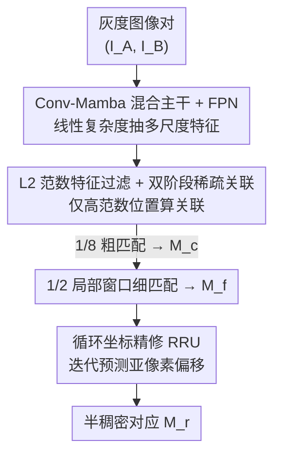

# Scalable Feature Matching via State Space Modeling and Sparse Correlation

**会议**: CVPR 2026  
**论文**: [CVF Open Access](https://openaccess.thecvf.com/content/CVPR2026/html/Choo_Scalable_Feature_Matching_via_State_Space_Modeling_and_Sparse_Correlation_CVPR_2026_paper.html)  
**代码**: https://github.com/Band-127/SLiM  
**领域**: 3D视觉  
**关键词**: 特征匹配, 状态空间模型(Mamba), 稀疏关联, 高分辨率可扩展, 半稠密匹配

## 一句话总结
SLiM 用「Conv-Mamba 线性复杂度主干 + L2 范数引导的稀疏关联 + 轻量循环坐标精修」三件套，把半稠密特征匹配从随分辨率二次膨胀的开销里解放出来，在 MegaDepth 上以 5.9M 参数拿到 AUC@5°=57.9（比 Efficient LoFTR 高 1.5 分），同时在 1200×1200 高分辨率下比 JamMa 省 45% 显存、比 Efficient LoFTR 快 1.8×。

## 研究背景与动机
**领域现状**：当前主流的「detector-free / 半稠密」匹配器（LoFTR、MatchFormer、ASpanFormer、Efficient LoFTR 等）走的是 coarse-to-fine 路线——先在 1/8 粗尺度上对两张图的特征做全局关联建立初始对应，再在细尺度上做局部窗口精化。它们靠 transformer 的 cross-view / cross-scale 注意力把全局上下文建模得很好，精度也确实做到了 SOTA。

**现有痛点**：这类方法的开销随空间分辨率**二次膨胀**，来源有二。其一是 vanilla transformer 注意力本身就是 $O(N^2)$；其二是粗匹配阶段要在两图所有位置之间算**完整关联矩阵**，复杂度高达 $O(W^2H^2)$。匹配精度又强依赖高输入分辨率，于是一旦上到 1200×1200 这种分辨率，显存和延迟就涨到 latency-sensitive、资源受限的场景（SLAM、移动端定位）根本吃不消。

**核心矛盾**：精度要靠高分辨率喂出来，但高分辨率下「全局上下文建模」和「全量关联」这两块恰恰是二次复杂度的重灾区——精度和效率在分辨率这个轴上直接对冲。

**本文目标**：设计一条端到端的高效匹配管线，把上面两个二次瓶颈各个击破——主干换成线性复杂度的全局建模，关联从「全量」改成「只在显著区域算」，同时不牺牲匹配精度。

**切入角度**：作者注意到两个可利用的观察。一是状态空间模型（Mamba/SS2D）能以线性复杂度保留全局感受野，天然适合替掉 transformer 做高分辨率上下文建模；二是一个被 OOD 检测领域反复验证、但匹配领域没人用的现象——网络在优化对数似然损失时，**判别性强（in-distribution）的特征其 L2 范数会逐渐变大**，于是范数本身就是一个免训练的"显著性先验"，可以拿来筛掉没用的位置、只在高范数区域算关联。

**核心 idea**：用 Conv-Mamba 把全局建模降到线性复杂度，再用「L2 范数过滤」把全量关联换成稀疏关联，最后用一个轻量循环网络替掉精度不够的期望回归——三处都对着「高分辨率下的开销」开刀。方法整体命名为 SLiM（Salient Lightweight Matching）。

## 方法详解

### 整体框架
SLiM 输入一对灰度图 $(I_A, I_B) \in \mathbb{R}^{H\times W\times 1}$，输出半稠密的亚像素级对应集。整条管线分三段串行：先用 **Conv-Mamba 混合主干 + FPN** 抽出多尺度特征金字塔 $\{F^A_l\}, \{F^B_l\}$ 并在其中完成跨视图、跨尺度的上下文融合；再做 **双阶段稀疏关联**——在 1/8 粗尺度上只对「高 L2 范数」的显著位置算关联、双 softmax 出初始对应 $M_c$，再在 1/2 细尺度上对 $M_c$ 周围的局部窗口算关联得到 $M_f$；最后用轻量 **循环精修单元 RRU** 在原始尺度窗口上迭代预测亚像素偏移，把 $M_f$ 精修成最终对应 $M_r$。

### 关键设计

**1. Conv-Mamba 混合主干 + FPN：用线性复杂度换掉 transformer 的全局建模**

直接针对「transformer 注意力二次复杂度」这个痛点。主干分三层、把卷积的局部先验和 SS2D（VMamba 的结构化空间扫描）的全局感受野交错堆叠：第一层只用一个 7×7 大核 ConvNeXt 块处理输入、保住高频细节，得到 $F_1 \in \mathbb{R}^{\frac{H}{2}\times\frac{W}{2}\times 48}$；第二层叠一个 ConvNeXt + 一个 SS2D 块到 $F_2 \in \mathbb{R}^{\frac{H}{4}\times\frac{W}{4}\times 96}$；第三层再加 SS2D 与两个「聚合模块」（每个含 InceptionNeXt + SS2D），输出高层特征 $F_3 \in \mathbb{R}^{\frac{H}{8}\times\frac{W}{8}\times 192}$。

跨视图融合就发生在 SS2D 块里、是一套巧妙的「拼接—扫描—拆分」流程：先把成对特征沿宽度维拼成 $F_{AB}\in\mathbb{R}^{H\times 2W\times C}$，再做四方向扫描接四个并行 Mamba 块，最后把处理后的特征拆开取平均，得到带了对方上下文信息的 $\tilde{F}_A, \tilde{F}_B$——这样一次扫描就让两张图的特征互相"看到了"，省去了 transformer 那种两两注意力。跨尺度融合则交给一个卷积 FPN，逐层把深层语义和浅层细节加起来：$F_l^{\text{fused}} = \text{Conv}\big(\text{Conv}_{1\times1}(F_l) + \text{Up}(F_{l+1}^{\text{fused}})\big)$。相比 JamMa 那种「直接把 transformer 模块换成 Mamba」的做法，这里是把卷积和 Mamba 交错编织，既保住局部纹理判别力又拿到线性复杂度的全局感受野。

**2. L2 范数特征过滤 + 双阶段稀疏关联：只在显著区域算关联，砍掉粗匹配的二次开销**

这是整篇最核心、最省算力的一刀，针对的是「全量关联 $O(W^2H^2)$」痛点。作者借用 OOD 检测的观察——优化对数似然损失会让 in-distribution 特征的 L2 范数越训越大（因为 softmax 下输出分布越来越极化，间接放大了范数），把 **L2 范数当成免训练的显著性指标**：建筑结构等几何显著区域天然是高范数，纹理贫乏的背景则是低范数。于是在 1/8 粗尺度上先按阈值 $\eta$ 把候选位置筛出来：

$$\mathcal{G}^A = \{\, i \mid \|F^A_{3,i}\|_2 > \eta \,\}, \quad \mathcal{G}^B = \{\, j \mid \|F^B_{3,j}\|_2 > \eta \,\}$$

之后的关联和双 softmax **只在 $\mathcal{G}^A \times \mathcal{G}^B$ 这个高范数子集上算**，而不是全量位置。粗关联为 $C^c_{ij} = \frac{\langle F^A_{3,i}, F^B_{3,j}\rangle}{\sqrt{d}}$（$d=192$），双 softmax 取行列归一化之积 $P^c_{ij} = \text{softmax}_i(C^c_{ij})\cdot\text{softmax}_j(C^c_{ij})$，互为最近邻且 $P^c_{ij}>\tau_c$ 的位置构成初始对应 $M_c$。细阶段在 1/2 尺度上以每个 $M_c$ 为中心抠 $k\times k$（实测 $k=4$）窗口，展平成 $k^2$ 个 token 再算窗口内关联 $C^f_{pq}$、双 softmax 出 $P^f_{pq}$（此处 $d=48$），$P^f_{pq}>\tau_f$ 的位置经索引到 2D 偏移 $\Delta(\cdot)$ 映射后得到 $M_f$。范数阈值 $\eta$ 归一化后经验设为 0.65。这套设计妙在过滤完全免训练、即插即用，且实验证明 L2 范数比方差、均值都更能分辨显著特征（见消融）。

**3. 循环坐标精修单元 RRU：把期望回归换成迭代优化，提亚像素精度**

针对 LoFTR 系列在细匹配阶段惯用的「基于期望的坐标回归」的两个软肋：期望操作假设局部窗口内是单峰概率分布，碰到重复纹理或噪声造成的匹配歧义就会失效；直接回归又没显式建模相邻像素的空间一致性，容易把定位误差放大。RRU 借鉴光流里的循环架构，把亚像素精修**重写成一个迭代坐标优化任务**：这是个仅 816K 参数的轻量模块，隐藏维 32，跑 $T=4$ 次迭代就能达到高精度定位还保持实时。

每次迭代对当前坐标 $(x^A, x^B_t)$ 在原始尺度特征上抠 $k\times k$ 窗口 $W^A, W^B_t$，把拼接特征过深度可分离卷积和 MLP 更新隐藏状态 $h_t$，再解码出亚像素位移图 $\Delta x_t$ 和置信权重 $w_t$，按加权平均更新目标坐标、参考坐标 $x^A$ 全程固定：$x^B_{t+1} \leftarrow x^B_t + \sum_{i=1}^{k\times k} w^{(i)}_t \Delta x^{(i)}_t$。迭代次数还能在推理时动态调，给出「精度—速度」可调旋钮（论文里 SLiM† 就是把迭代降到 1 次换更低延迟的变体）。比起一锤定音的期望回归，这种多峰假设聚合 + 逐步收敛的方式在重复纹理场景下更稳，单应估计上的涨点（见 HPatches 实验）主要就归功于它。

### 损失函数 / 训练策略
三项损失联合监督。匹配损失对粗/细分数矩阵分别取负对数似然：$\mathcal{L}_c = -\frac{1}{|M^{gt}_c|}\sum_{i,j\in M^{gt}_c}\log P^c(i,j)$，$\mathcal{L}_f$ 同理对 $M^{gt}_f$ 与 $P^f$。坐标精修损失对所有中间迭代用指数衰减 L2 监督：$\mathcal{L}_r = \sum_{t=1}^{T}\gamma^{T-t}\lVert x^B_{gt}-x^B_t\rVert_2$，衰减因子 $\gamma=0.8$。总目标 $\mathcal{L} = \alpha\mathcal{L}_c + \beta\mathcal{L}_f + \lambda\mathcal{L}_r$，权重经交叉验证取 $\alpha=0.25,\ \beta=0.2,\ \lambda=1.0$（用于平衡匹配概率与坐标偏移之间的尺度差异）。训练全在 MegaDepth 上做：AdamW、权重衰减 0.1、初始学习率 $1\times10^{-3}$、batch 6、6 张 RTX 4090（24GB）跑 19 个 epoch 约 21 小时，输入统一 padding 到 1024×1024，评估时不在其它数据集上微调以验证泛化。

## 实验关键数据

### 主实验

相对位姿估计（MegaDepth 1200×1200 室外 / ScanNet 640×480 室内），AUC@5°/10°/20° 越高越好，推理时间越低越好；†为 1 次迭代变体，‡为按 LightGlue 调过 RANSAC 阈值的设置：

| 方法 | 参数(M) | MegaDepth AUC@5° | ScanNet AUC@5° | MegaDepth 时间(ms) |
|------|--------|------|------|------|
| LoFTR | 11.6 | 52.8 | 16.9 | 315.4 |
| ASpanFormer | 15.8 | 55.3 | 19.6 | 332.2 |
| Efficient LoFTR | 16.0 | 56.4 | 19.2 | 139.2 |
| JamMa | 5.7 | 55.4 | 14.5 | 181.3 |
| **SLiM** | **5.9** | **57.9** | 18.0 | **77.0** |
| SLiM † (1 iter) | 5.9 | 57.6 | 17.7 | 65.3 |
| SLiM ‡ (tuned RANSAC) | 5.9 | **60.1** | 18.2 | 77.0 |

SLiM 以 5.9M 参数（约 LoFTR 的 50.9%）在 MegaDepth 上拿到全场半稠密 SOTA 的 57.9，比 Efficient LoFTR 高 1.5 分且推理快 1.8×；†变体在 ScanNet 上仅 23.9ms 还比 JamMa（26.6ms）又快又准。与稠密匹配器对比（Table 2）则是另一种取舍：SLiM 57.9 略低于 RoMa 的 62.6，但 77ms 远快于 RoMa 的 1176.8ms——作者也诚实指出稠密法的精度优势部分来自多数据集训练，而 SLiM 只用 MegaDepth。单应估计（HPatches，AUC@3/5/10px）上 SLiM 取 69.4/78.2/86.3，分别比 JamMa 高 1.3/1.2/0.9 分，作者归因于 RRU 的多峰假设聚合优于期望回归。

### 消融实验

特征过滤指标对比（同一阈值下换不同显著性度量），可见 L2 范数在精度和效率上都最优，而均值过滤在室内场景几乎崩溃：

| 过滤指标 | MegaDepth AUC@5° | MegaDepth 时间(ms) | ScanNet AUC@5° | ScanNet 时间(ms) |
|---------|------|------|------|------|
| 不过滤 | 57.9 | 128.7 | 17.4 | 41.1 |
| 均值 (Mean) | 55.1 | 65.0 | 0.6 | 31.7 |
| 方差 (Variance) | 57.2 | 78.4 | 15.1 | 35.0 |
| **L2 范数** | 57.6 | 77.0 | **17.7** | **23.9** |

即插即用泛化（把免训练 L2 过滤直接插进现成匹配器、不重训），⋆为插件变体：

| 方法 | MegaDepth AUC@5° | 时间(ms) |
|------|------|------|
| LoFTR | 52.8 | 315.4 |
| LoFTR⋆ | 53.2 | 268.9 |
| MatchFormer | 53.3 | 555.2 |
| MatchFormer⋆ | 53.4 | 487.2 |
| Efficient LoFTR | 56.4 | 139.2 |
| Efficient LoFTR⋆ | 56.1 | 76.0 |

### 关键发现
- **L2 范数过滤是效率主力，且几乎不掉精度**：在 MegaDepth 上不过滤要 128.7ms、加 L2 过滤降到 77.0ms 而 AUC 仅从 57.9 微降到 57.6；ScanNet 上更直接——从 41.1ms 砍到 23.9ms 还反涨 0.3 分（17.4→17.7）。
- **过滤指标的选择很关键**：均值过滤在 ScanNet 直接崩到 0.6 AUC（把判别信息也滤掉了），方差次之，只有 L2 范数能稳定分辨显著区域，印证了「对数似然训练放大 in-distribution 特征范数」这一先验的有效性。
- **高分辨率才是 SLiM 的主场**：分辨率缩放测试里，1200×1200 下比 JamMa 省 45% 显存、比 Efficient LoFTR 快 1.8×，且呈近线性增长——把二次瓶颈拆掉的收益随分辨率放大。
- **过滤是通用加速器**：插进 LoFTR / MatchFormer 不仅降延迟还小涨精度，插进 Efficient LoFTR 则精度基本不变、延迟近乎砍半（139.2→76.0ms）；不过最优阈值 $\eta$ 与架构相关，迁移时需逐方法调。

## 亮点与洞察
- **把 OOD 检测里的"范数即显著性"迁到匹配里当免训练过滤器**，这是最"啊哈"的一笔：不加任何可学参数、不改训练，就把粗匹配的全量关联换成稀疏关联——而且作为插件能直接给别人的匹配器加速，复用价值很高。
- **Conv 与 Mamba 交错编织而非简单替换**：通过「沿宽度拼接 → 四方向扫描 → 拆分平均」用一次 SS2D 扫描完成跨视图融合，是把 Mamba 用在匹配任务上比 MambaGlue/JamMa 更彻底的设计。
- **把亚像素精修当成可迭代、可调步数的优化问题**：RRU 仅 816K 参数却能在重复纹理上稳过期望回归，且推理时调迭代次数就能换取精度-速度，这个「旋钮」思路可迁移到任何 coarse-to-fine 的细化阶段。

## 局限与展望
- 与 DKM、RoMa、MASt3R 等稠密匹配器相比，绝对精度仍有差距（57.9 vs 62.6）；作者归因于稠密法用了更大更多样的多数据集监督，暗示 SLiM 若加更大训练数据集可能进一步缩小差距，但论文未验证。
- 即插即用过滤的最优阈值 $\eta$ 与架构强相关，迁移到新匹配器时需要逐一调参，缺乏自适应阈值机制——这是工程落地时的一个隐性成本。
- 在 ScanNet 室内场景上 SLiM 的 AUC（18.0/34.7/50.4）相对 Efficient LoFTR（19.2/37.0/53.6）并不占优，方法的优势更多体现在室外高分辨率，室内弱纹理场景下范数显著性先验是否仍稳健值得进一步分析。⚠️ 论文未深入讨论室内场景相对偏弱的原因。

## 相关工作与启发
- **vs LoFTR / Efficient LoFTR**：同为半稠密 coarse-to-fine，但 LoFTR 系列靠 transformer 全局建模 + 全量关联（二次复杂度），SLiM 用 Conv-Mamba 线性主干 + 范数稀疏关联把两个二次瓶颈都拆掉；细化阶段 SLiM 用循环精修替掉期望回归，精度更高且参数更省（5.9M vs 16.0M）。
- **vs JamMa**：两者都引入 Mamba，但 JamMa 是「把 transformer 模块换成 Joint Mamba」，SLiM 是把卷积与 Mamba 交错编织成混合主干；高分辨率下 SLiM 省 45% 显存、快 2.4×，且 MegaDepth AUC 更高（57.9 vs 55.4）。
- **vs DKM / RoMa（稠密匹配）**：稠密法直接预测逐像素稠密 warp，精度更强但参数多、运行慢；SLiM 走半稠密路线，以可接受的精度差换数量级的效率优势，定位 latency-sensitive 场景。

## 评分
- 新颖性: ⭐⭐⭐⭐ 把 OOD 的范数显著性先验迁成免训练稀疏关联是真正巧妙的迁移，Conv-Mamba 交错主干和循环精修则更多是已有思路的高质量组合
- 实验充分度: ⭐⭐⭐⭐ 位姿/单应双任务、室内外双场景、过滤指标与即插即用消融都齐，分辨率缩放曲线尤其有说服力；室内弱势未深究略减分
- 写作质量: ⭐⭐⭐⭐ 三个创新点目标清晰、公式给得完整，框架图与文字对得上
- 价值: ⭐⭐⭐⭐ 免训练过滤可即插即用给现成匹配器加速，高分辨率可扩展性对 SLAM/移动端定位有实际落地意义

<!-- RELATED:START -->

## 相关论文

- [\[CVPR 2026\] TextFM: Robust Semi-dense Feature Matching with Language Guidance](textfm_robust_semi-dense_feature_matching_with_language_guidance.md)
- [\[CVPR 2026\] Hyper-PCN: Hypergraph-Based Point Cloud Completion via High-Order Correlation Modeling](hyper-pcn_hypergraph-based_point_cloud_completion_via_high-order_correlation_mod.md)
- [\[CVPR 2026\] AsymLoc: Towards Asymmetric Feature Matching for Efficient Visual Localization](asymloc_towards_asymmetric_feature_matching_for_efficient_visual_localization.md)
- [\[CVPR 2026\] RayNova: Scale-Temporal Autoregressive World Modeling in Ray Space](raynova_scale-temporal_autoregressive_world_modeling_in_ray_space.md)
- [\[NeurIPS 2025\] MVSMamba: Multi-View Stereo with State Space Model](../../NeurIPS2025/3d_vision/mvsmamba_multi-view_stereo_with_state_space_model.md)

<!-- RELATED:END -->
