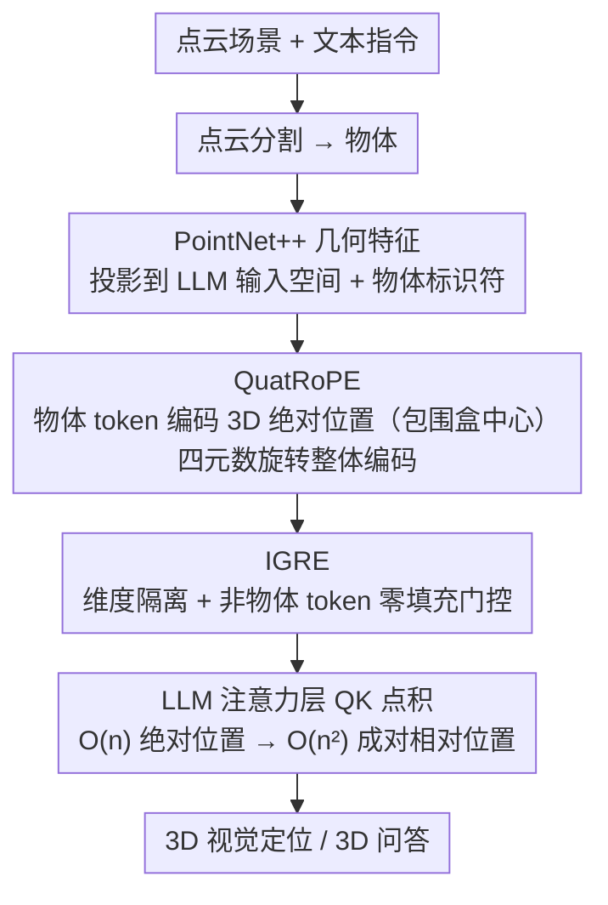

# Scalable Object Relation Encoding for Better 3D Spatial Reasoning in Large Language Models

**会议**: CVPR 2026  
**arXiv**: [2603.24721](https://arxiv.org/abs/2603.24721)  
**代码**: [https://github.com/oceanflowlab/QuatRoPE](https://github.com/oceanflowlab/QuatRoPE)  
**领域**: 3D视觉 / 多模态VLM  
**关键词**: 3D空间推理, 位置编码, 四元数旋转, 大语言模型, 3D视觉语言

## 一句话总结

提出 QuatRoPE，一种基于四元数旋转的3D位置编码方法，仅需 $O(n)$ 输入token即可保留所有 $O(n^2)$ 物体间空间关系，并配合 IGRE 机制减少与语言 RoPE 的干扰，在多个3D视觉语言基准上取得大幅提升。

## 研究背景与动机

1. **领域现状**：3D空间推理要求模型根据物体间的空间关系（如"在桌子左边"）来定位目标物体，是3D视觉定位(3D VG)和3D视觉问答(3D VQA) 的核心能力。由于3D场景-文本配对数据稀缺，当前主流做法是将点云特征注入LLM输入空间，借助LLM预训练的推理能力进行空间推理。

2. **现有痛点**：现有方法主要有两类编码方式，各有缺陷：
    - **绝对位置编码**（如 Chat-Scene、LEO）：将物体的3D坐标与几何特征过早融合，LLM难以从这些混杂的特征中提取空间关系
    - **显式成对关系编码**（如 3DGraphLLM）：额外用 token 表示物体间成对关系，但 token 数量随物体数量呈二次增长（如554个物体会产生超过15万对关系），远超LLM输入上限。KNN 剪枝策略虽能减少 token，但"近邻≠相关"，可能遗漏关键空间关系

3. **核心矛盾**：如何在保持线性输入长度的同时，让模型感知到所有成对空间关系？

4. **本文目标**
    - 在 $O(n)$ token 内编码 $O(n^2)$ 空间关系
    - 避免独立轴编码导致的虚假相似性
    - 将空间位置编码与语言RoPE整合而不产生干扰

5. **切入角度**：借鉴 RoPE（旋转位置编码）将绝对位置转换为相对位置的机制，只需在每个物体 token 上编码绝对坐标，通过注意力层的点积自动计算成对相对位置。

6. **核心 idea**：用四元数旋转对3D坐标进行整体向量编码，使得注意力分数仅依赖物体间的相对位置差。

## 方法详解

### 整体框架

输入为点云场景和文本指令。首先对点云进行分割得到物体，每个物体的特征（PointNet++提取的几何特征）投影到LLM输入空间，同时分配物体标识符（如 `<obj005>`）。每个物体对应若干物体 token（object-related token）。QuatRoPE 在这些 token 上编码物体的3D绝对位置（包围盒中心），通过注意力层的 QK 点积自动转换为两两相对位置。IGRE 机制则确保 QuatRoPE 只影响物体 token 之间的注意力，不干扰语言 token。

### 关键设计

**1. QuatRoPE：用四元数旋转把"编码绝对、计算相对"从一维推广到三维**

显式成对关系编码会让 token 随物体数二次爆炸，而把绝对坐标直接拼进物体特征又会破坏 LLM 对输入的理解。QuatRoPE 想要两头都占：每个物体 token 只携带一份绝对坐标，让注意力层的点积自动把它展开成相对位置——这正是原始 RoPE 在一维序列上"旋转绝对位置、点积得相对位置"的思路，被推广到三维。具体做法是把 query/key 向量切成若干三维段（看作纯四元数 $\vec{q},\vec{k}$），按物体包围盒中心 $\vec{m}$ 做四元数旋转 $f(\vec{q}, \vec{m}) = Q(\vec{m})\,\vec{q}\,Q^{-1}(\vec{m})$，其中旋转算子 $Q(\vec{m})$ 由欧拉角分解为绕三个坐标轴的旋转。论文证明，只要频率函数 $\theta$ 取线性形式，旋转后两向量的点积就只依赖坐标差 $\vec{m}-\vec{n}$：

$$\langle f(\vec{q},\vec{m}),\, f(\vec{k},\vec{n})\rangle = g(\vec{q},\vec{k},\,\vec{m}-\vec{n})$$

于是分布在 $O(n)$ 个 token 上的绝对坐标，过一层注意力就隐式还原出全部 $O(n^2)$ 个成对相对位置，既不爆 token 也不丢关系。

关键在于"整体向量编码"而非像 M-RoPE 那样把坐标按轴拆到不同维度段。举个例子：桌面上两个物体 A、B 高度（$z$ 坐标）几乎相同，但水平方向隔了 3 米，M-RoPE 负责 $z$ 轴的那段维度因为坐标差近似 0 会给出虚高点积，把它们误判成"近邻"；QuatRoPE 让每个维度都受完整三维坐标调制，只有真正三维邻近的物体才能拿到高注意力，从根上避免了这种"虚假近邻"。

**2. IGRE：把空间 RoPE 和语言 RoPE 隔到不同维度，用零填充实现门控**

3D 场景-文本配对数据稀缺，没法从头训练一个同时带语言 RoPE 和空间 RoPE 的 LLM；而把 QuatRoPE 直接叠加到所有 token 的所有维度上，又会和预训练好的语言 RoPE 互相旋转、破坏已有的语言能力。IGRE 的做法是隔离：只给物体 token 的 query/key 额外拼接一段维度并施加 QuatRoPE 旋转，系统提示、问题这些非物体 token 在这段维度上填全零。这样语言 RoPE 和 QuatRoPE 各占不同维度互不干扰，点积里那段空间维度只有当两端都是物体 token 时才非零——相当于一个天然门控，空间调整只发生在物体之间。

零填充这一步看似不起眼却很关键：如果让非物体 token 也参与但不旋转，就等价于把它们摆在坐标原点 $(0,0,0)$，模型会被误导去过度关注原点附近的物体；零填充让它们在扩展维度上的贡献直接为零，既不被错误定位，又最大限度保住了 LLM 原有的语言理解与推理能力。

**3. ASR 基准：剥掉属性线索，逼模型只靠空间关系定位**

ScanRefer、SQA3D 这些现有基准的描述往往把空间关系和物体属性（颜色、类别等）混在一起，模型可能直接认出"红色椅子"就蒙对答案，绕过了真正的空间推理，于是测出来的分数衡量不出空间能力本身。ASR 的构造是做减法：从 ScanQA 里挑出答案物体名称唯一的问题，删掉所有泄露目标属性的描述，只留下"必须靠空间关系才能定位"的问题，再转成 3D VG 多选格式以消除语言生成偏差。比如把 "What is the object in front of the tall white shelf?" 改写成 "The object in front of the tall white shelf"，模型只有真的算出"在……前面"这个关系才能选对目标。

### 损失函数 / 训练策略

模型使用 LoRA（rank=16, $\alpha$=16）微调 LLM，学习率 $2\times10^{-5}$。训练数据为 ScanRefer、Multi3DRef、ScanQA、SQA3D 等的联合数据集。QuatRoPE 的频率参数随3D segment 变化，遵循类似原始 RoPE 的指数衰减设计。

## 实验关键数据

### 主实验

在 ScanRefer、Multi3DRef、SQA3D 三个基准上的结果（GT 分割）：

| 模型 | ScanRefer Acc@0.25 | ScanRefer Acc@0.5 | Multi3DRef F1@0.25 | SQA3D EM@1 |
|------|-------------------|-------------------|-------------------|------------|
| Chat-Scene-1B | 50.7 | 50.3 | 53.3 | 50.7 |
| Chat-Scene-1B + QuatRoPE | **55.4** | **55.0** | **58.1** | **53.1** |
| 3DGraphLLM-1B | 55.9 | 55.8 | 58.6 | 51.1 |
| 3DGraphLLM-1B + QuatRoPE | **58.3** | **58.2** | **60.7** | **53.2** |
| Chat-Scene-7B (Mask3D) | 55.5 | 50.2 | 57.1 | 54.6 |
| Chat-Scene-7B + QuatRoPE | **57.8** | **52.2** | **59.5** | **54.7** |

### 消融实验

不同位置编码方式对比（基于 Chat-Scene-1B + IGRE）：

| 编码方式 | ScanRefer Acc@0.25 | ScanRefer Acc@0.5 | SQA3D EM@1 | 说明 |
|---------|-------------------|-------------------|------------|------|
| 无显式编码 | 50.72 | 50.33 | 50.72 | 基线 |
| Raw Coordinates | 52.26 | 52.01 | 51.40 | 直接加绝对坐标 |
| M-RoPE | 54.30 | 53.92 | 51.55 | 独立轴编码 |
| QuatRoPE | **55.44** | **55.00** | **53.14** | 整体向量编码 |

ASR 空间推理基准零样本结果（3DGraphLLM-8B）：

| 模型 | ASR Acc@0.25 | Gain |
|------|-------------|------|
| 3DGraphLLM (无QuatRoPE) | 37.50 | — |
| 3DGraphLLM + QuatRoPE | **41.96** | +4.46 (11.9%) |

### 关键发现

- QuatRoPE 在所有基线和所有指标上都取得了一致的增益，在 ScanRefer 上增益最大（约+4-5个百分点），说明显式空间关系编码对定位任务帮助最大
- IGRE 显著优于 Trans-Additive 组合方式，验证了隔离和门控机制的必要性
- 当物体间单轴坐标差 $\delta$ 越小时，QuatRoPE 相对 M-RoPE 的优势越大（$\delta=0.1$ 时增益达5.83%），证实了整体向量编码避免虚假近邻的能力
- 在 ASR 纯空间推理基准上，QuatRoPE 带来 12-19% 的相对提升，直接验证了方法对空间推理能力的增强

## 亮点与洞察

- **线性输入编码二次关系**：通过巧妙利用注意力机制的点积特性，将 $O(n)$ 个绝对位置自动转换为 $O(n^2)$ 个相对位置，这一设计既优雅又高效。这种"编码绝对、计算相对"的思路可以迁移到任何需要成对关系的场景（如分子构象、社交网络）
- **四元数整体编码**：相比独立轴RoPE的虚假近邻问题，四元数旋转让query/key每个维度都受到完整3D坐标的调制，根本上解决了单轴近似导致的注意力膨胀
- **IGRE 设计精巧**：零padding非物体token + 维度隔离，既保留 LLM 原有能力又能门控式引入3D空间信息，是一种通用的多模态 RoPE 扩展范式

## 局限与展望

- QuatRoPE 假设物体用包围盒中心表示，忽略了物体的形状和大小信息，对"在X表面上"这类需要精确几何的关系可能不够
- 仅在 ScanNet 室内场景上验证，未测试大规模户外场景（物体分布更稀疏、坐标范围更大）
- ASR 基准虽然排除了属性，但仍来源于 ScanQA，数据量有限（仅做零样本评估）
- 四元数旋转的频率参数目前采用固定指数衰减，可探索可学习频率以适应不同尺度场景

## 相关工作与启发

- **vs 3DGraphLLM**：3DGraphLLM 通过额外 token 显式编码空间关系但面临 $O(n^2)$ 缩放问题和 KNN 剪枝误差，QuatRoPE 通过位置编码在 $O(n)$ 内实现了所有关系的隐式计算，更加可扩展
- **vs M-RoPE（Qwen2-VL）**：M-RoPE 将 segment 分组对应不同坐标轴，导致单轴相似性膨胀。QuatRoPE 通过四元数旋转消除了这一问题
- **vs Chat-Scene**：Chat-Scene 将绝对坐标融入物体特征，空间信息隐式且稀疏，QuatRoPE 提供了显式且通过注意力自然计算的空间关系

## 评分

- 新颖性: ⭐⭐⭐⭐⭐ 四元数旋转位置编码的思路非常新颖且数学推导完整
- 实验充分度: ⭐⭐⭐⭐ 多基线对比+多数据集+消融分析+专用ASR基准，但只有ScanNet系列
- 写作质量: ⭐⭐⭐⭐⭐ 动机清晰，公式推导严谨，图表直观
- 价值: ⭐⭐⭐⭐ 提供了3D LLM空间推理的通用位置编码方案，可插拔应用于多种架构

<!-- RELATED:START -->

## 相关论文

- [\[CVPR 2026\] Masking Matters: Unlocking the Spatial Reasoning Capabilities of LLMs for 3D Scene-Language Understanding](masking_matters_unlocking_the_spatial_reasoning_capabilities_of_llms_for_3d_scen.md)
- [\[CVPR 2026\] ORD: Object-Relation Decoupling for Generalized 3D Visual Grounding](ord_object-relation_decoupling_for_generalized_3d_visual_grounding.md)
- [\[CVPR 2026\] OLATverse: A Large-scale Real-world Object Dataset with Precise Lighting Control](olatverse_a_large-scale_real-world_object_dataset_with_precise_lighting_control.md)
- [\[CVPR 2026\] Learning Multi-View Spatial Reasoning from Cross-View Relations](learning_multi-view_spatial_reasoning_from_cross-view_relations.md)
- [\[CVPR 2026\] I-Scene: 3D Instance Models are Implicit Generalizable Spatial Learners](i-scene_3d_instance_models_are_implicit_generalizable_spatial_learners.md)

<!-- RELATED:END -->
