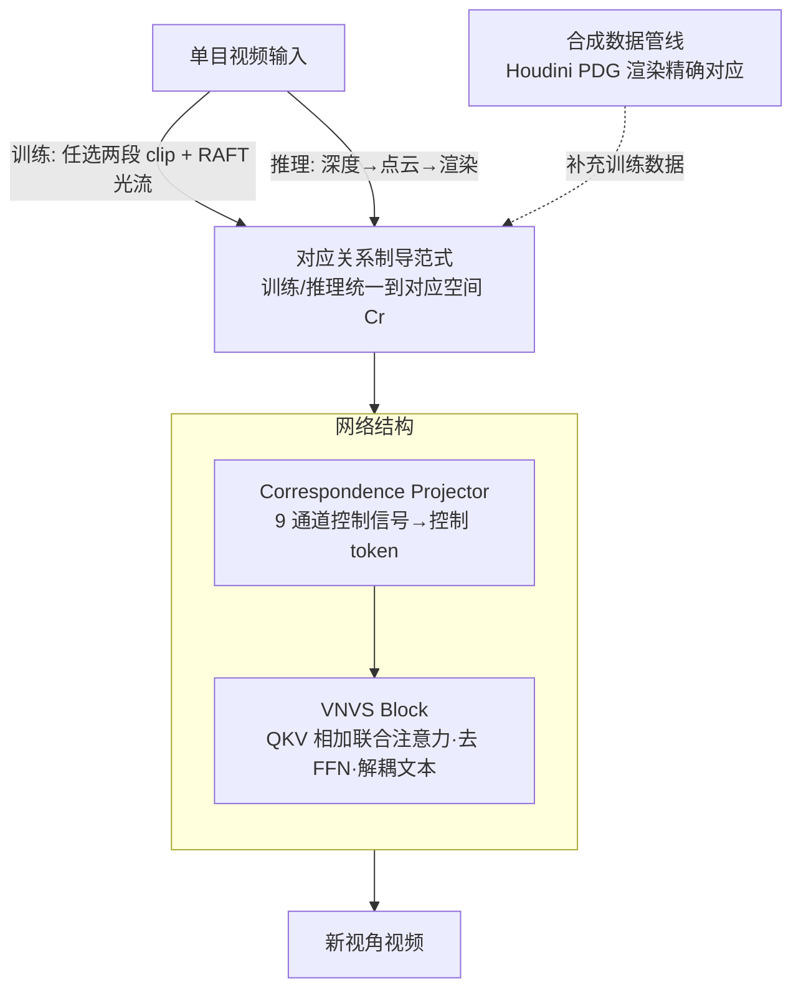

# Scaling4D: Pushing the Frontier of Video Novel View Synthesis through Large-Scale Monocular Videos

**会议**: CVPR 2026  
**论文**: [CVF Open Access](https://openaccess.thecvf.com/content/CVPR2026/html/Cai_Scaling4D_Pushing_the_Frontier_of_Video_Novel_View_Synthesis_through_CVPR_2026_paper.html)  
**代码**: 项目页 https://rainbowrui.github.io/scaling4d/  
**领域**: 3D视觉 / 视频生成  
**关键词**: 视频新视角合成, 对应关系制导, 单目视频, 扩散模型, 可扩展训练

## 一句话总结
Scaling4D 把视频新视角合成（VNVS）从"先渲染点云再 inpainting"重新表述为"对应关系（correspondence）制导的生成任务"，从而能用海量真实单目视频做自监督训练，弥合了旧方法的训练-推理鸿沟，在单视角和多视角基准上全面超越 GEN3C / TrajectoryCrafter 等方法，且性能随数据量持续提升。

## 研究背景与动机
**领域现状**：视频新视角合成（Video Novel View Synthesis, VNVS）要从一段单目视频渲染出任意新相机视角的动态场景。由于单视角输入信息稀疏，4D 高斯泼溅、动态 NeRF 这类重建/优化方法不适用，近期主流是借助视频生成大模型（如 Wan、Hunyuan Video）的先验来"生成"新视角。

**现有痛点**：训练 VNVS 缺少大规模多视角视频数据。已有两条路线都受限：（1）只用合成多视角数据（如 ReCamMaster），数据完全可控但多样性受资产和场景限制；（2）把任务转成视频 inpainting（如 GEN3C、TrajectoryCrafter）——先估深度→转动态点云→渲染到目标视角得到稀疏图，再用 inpainting 模型补全。

**核心矛盾**：inpainting 路线存在**训练-推理鸿沟**。训练时模型学的是"补全空洞"，但新视角合成本质上要"换一个视角看同一物体"。论文图 2 给的例子很直观：新视角下红框区域应当露出人物的背面，inpainting 却错误地用背景像素填满——它根本不知道那里该是物体的另一侧。

**本文目标**：能不能直接用大规模真实单目视频训练 VNVS，同时把训练-推理鸿沟彻底抹平？

**切入角度**：作者要找一座"桥"，它既能作为 VNVS 的控制条件，又天然大量存在于真实单目视频中。答案是**像素对应关系（pixel correspondence）**：把输入视频的点云渲染到新视角，就在源视角和目标视角之间建立了像素对应；而在任意单目视频里，相邻帧之间用光流就能得到对应关系。

**核心 idea**：用"对应关系"统一训练和推理——推理时对应关系来自深度+点云渲染，训练时来自光流；二者落在同一个"对应空间"里，于是任意单目视频都能自监督训练，且推理场景永远是训练分布的子集。

## 方法详解

### 整体框架
Scaling4D 的输入是一段单目源视频 $\mathbf{I}^s$ 和一组目标相机位姿 $\mathbf{T}^r$，输出是对应新视角下的视频。核心是把旧范式 $\mathbf{I}^s \xrightarrow{\Phi^{-1}} \mathcal{P} \xrightarrow{\mathbf{T}^r} \mathbf{T}^r\mathcal{P} \xrightarrow{\Phi} \mathbf{I}^r \xrightarrow{G_\theta} \mathbf{I}^*$（深度反投影→位姿变换→投影→生成）压缩成 $\mathbf{I}^s \xrightarrow{\mathbf{C}^r} \mathbf{I}^r \xrightarrow{G_\theta} \mathbf{I}^*$，因为投影-变换-反投影这一串复合操作在 2D 平面上恰好等价于一个对应关系 $\mathbf{C}^r$。训练时直接从单目视频任选两段 clip 当源/目标，用 RAFT 光流求出 $\mathbf{C}^r$，构成完整自监督训练回环；推理时用 GeometryCrafter 估深度、转点云、渲染得到 $\mathbf{C}^r$。在此之上配一套合成数据管线补充精度，外加一个把对应关系注入视频生成大模型的网络结构（Correspondence Projector + VNVS Block）。

### 关键设计

**1. 对应关系制导范式：把 VNVS 从 inpainting 升级成统一对应空间的生成**

针对旧方法的训练-推理鸿沟，作者的关键观察是：旧范式里 $\Phi \circ \mathbf{T}^r \circ \Phi^{-1}$ 这串复合操作本质上只是在 2D 图像平面上定义了一个对应关系 $\mathbf{C}^r \in \mathbb{R}^{n\times 2\times h\times w}$，即 $\mathbf{C}^r \Longleftrightarrow \Phi \circ \mathbf{T}^r \circ \Phi^{-1}$。把它代回去，整个框架就简化为 $\mathbf{I}^s \xrightarrow{\mathbf{C}^r} \mathbf{I}^r \xrightarrow{G_\theta} \mathbf{I}^* \Leftarrow \mathbf{I}^t$，其中 $\mathbf{I}^s \to \mathbf{I}^r$ 是按对应关系做的 warping 而非渲染。

这个改写带来一个关键好处：对任意野外单目视频，可以**任选两段 clip 当作源 $\mathbf{I}^s$ 和目标 $\mathbf{I}^t$**，再用光流模型（RAFT）求出二者间的对应 $\mathbf{C}^r$，于是 $\mathbf{I}^s \xrightarrow{\mathbf{C}^r} \mathbf{I}^r \xrightarrow{G_\theta} \mathbf{I}^*$ 就有了真值 $\mathbf{I}^t$ 监督，形成完整训练回环。推理时对应关系改由深度+点云渲染得到，但落在同一个对应空间里——所有推理场景（包括大幅度视角变化）都成为训练时见过的对应情形的子集，从根上消除了训练-推理鸿沟。warping 时若多个源像素映射到同一目标像素，训练阶段随机取一个，推理阶段用 z-buffer 取深度最小者。控制信号最终设为 $(\mathbf{I}^s, \mathbf{C}^r, \mathbf{I}^r, \mathbf{M}^r) \in \mathbb{R}^{n\times 9\times h\times w}$。

**2. 合成数据管线：用 Houdini PDG 补充精确对应与多样运动**

真实视频的对应关系精度有限（光流本身有噪声），所以作者还搭了一条合成数据管线作为补充。它用电影级的程序化依赖图（Procedural Dependency Graph, PDG）工具 Houdini 构建，所有资产用 USD 格式存储并借其 variant 机制让每个资产有多种外观。管线包含：按 SpatialLM 格式收集的房间布局做组合式场景、随机组合体型/服装/发型/动作的程序化人物、先在 3D 空间采样点再连平滑曲线、且严格避障并保证目标点始终在视野内的相机轨迹。对合成场景，源/目标视频、点云 $\mathcal{P}$、位姿 $\mathbf{T}^r$ 都已知，可直接算出 $\mathbf{C}^r$ 并套用统一训练框架。它的价值是合成数据天然没有对应误差、相机运动范围大，能提升控制精度（消融显示去掉合成数据后位姿精度下降）。

**3. 网络结构：Correspondence Projector + VNVS Block 把对应关系注入生成大模型**

如何把 9 通道控制信号喂进一个原本只处理"文本+视频"的 MMDiT 大模型？作者设计两个可训练模块。**Correspondence Projector** 用若干卷积层加一个 patchify 层，把控制信号编码成控制 token $\mathbf{F}_{\text{cor}}$，其形状与原 DiT 的隐 token 对齐。**VNVS Block** 插在预训练块之间，输入视频特征 $\mathbf{F}_{\text{vid}}$ 和控制 token $\mathbf{F}_{\text{cor}}$，只更新视频特征、保持文本特征不变，注意力为

$$\mathbf{F}_{\text{vid}} \leftarrow \mathbf{F}_{\text{vid}} + \mathrm{Attn}(\mathbf{Q}_{\text{vid}}+\mathbf{Q}_{\text{cor}},\ \mathbf{K}_{\text{vid}}+\mathbf{K}_{\text{cor}},\ \mathbf{V}_{\text{vid}}+\mathbf{V}_{\text{cor}})$$

即把视频和控制的 Q/K/V 投影**相加**做联合注意力——之所以能直接相加，是因为控制 token 与视频 token 在空间上对齐。两个设计取舍很关键：（1）显式与文本 token 解耦，从而保留大模型原有的 prompt-following 能力；（2）刻意省去 FFN 层，作者借前人结论论证 FFN 主要承载长期记忆、注意力承载瞬时上下文记忆，而"可控性"本质属于瞬时上下文记忆，去掉 FFN 既省算力又不损可控性（实验验证有效）。

### 损失函数 / 训练策略
训练用普通的流匹配（flow matching）损失，源/目标 clip 间的对应关系作为控制条件做自监督。每段视频 49 帧、分辨率 480×480；训练对应关系用 RAFT 光流、推理深度用 GeometryCrafter；在 64 张 A100 上训练，world batch size 256，AdamW，学习率 $4\times10^{-5}$。真实数据用 SpatialVID（约 300 万段富相机运动的单目视频），合成数据用自建管线生成 1 万样本。

## 实验关键数据

> 指标说明：FID/FVD 衡量生成画质（越低越好）；CLIP-T/F/V 分别是文本-帧、帧间、视频级 CLIP 一致性（越高越好）；RotErr/TransErr 是生成视频相机轨迹的旋转/平移误差（越低越好，衡量视角控制精度）；PSNR/SSIM/LPIPS 是有真值时的逐像素重建质量。

### 主实验（单视角数据集，Panda-70M 抽 400 段）

| 方法 | FID ↓ | FVD ↓ | CLIP-V ↑ | RotErr ↓ | TransErr ↓ |
|------|-------|-------|----------|----------|------------|
| GEN3C | 69.35 | 442.70 | 90.14 | 6.98 | 299.68 |
| TrajectoryCrafter | 68.94 | 425.20 | 90.41 | 6.65 | 320.38 |
| Voyager | 68.41 | 414.89 | 91.07 | 7.04 | 347.57 |
| ReCamMaster-Wan | 83.71 | 635.86 | 86.21 | 12.29 | 737.71 |
| **Scaling4D（本文）** | **62.83** | **411.17** | **91.81** | **6.48** | **286.77** |

本文在所有指标上都取得 SOTA。对比方法的失败模式很明确：基于点云 inpainting 的 GEN3C / Voyager / TrajectoryCrafter 在遮挡和前景细节（蜡烛、椅背）处出现严重伪影或空洞；ReCamMaster-Wan 用隐式几何（相机矩阵）做控制太粗，生成的相机轨迹几乎静止，对新相机运动泛化差。

### 多视角数据集（iPhone dataset，有真值逐像素评估）

| 方法 | PSNR ↑ | SSIM ↑ | LPIPS ↓ |
|------|--------|--------|---------|
| GEN3C | 14.09 | 0.304 | 0.531 |
| TrajectoryCrafter | 14.13 | 0.309 | 0.539 |
| Voyager | 14.03 | 0.303 | 0.513 |
| ReCamMaster-Wan | 10.25 | 0.318 | 0.709 |
| **Scaling4D（本文）** | **14.85** | **0.336** | **0.468** |

### 消融实验（单视角数据集）

| 配置 | FID ↓ | FVD ↓ | RotErr ↓ | TransErr ↓ | 说明 |
|------|-------|-------|----------|------------|------|
| Full model | 62.83 | 411.17 | 6.48 | 286.77 | 完整模型 |
| + DoubleProj | 65.17 | 439.77 | **6.27** | **282.85** | 加双重投影数据：位姿更准但画质退化 |
| w/o RealData | 64.26 | 472.62 | 6.79 | 318.61 | 只用合成数据：各指标尤其画质明显下降 |
| w/o SynData | **63.61** | 409.16 | 6.58 | 308.92 | 只用真实数据：位姿精度下降 |

### 关键发现
- **真实数据决定画质，合成数据决定控制精度**：去掉真实数据画质大幅退化（FVD 472.62），证明合成数据的丰富度/多样性无法替代真实观测；去掉合成数据则位姿精度下降，说明合成数据能提升相机控制精度。
- **双重投影数据（inpainting 范式）会反噬画质**：加它虽降低位姿误差（因其本身无对应误差），但 FID/FVD 升高，与对 inpainting 方法的分析一致。
- **训练-推理鸿沟被弥合**：在 100 段静态视频上对比训练用的光流对应 $\mathbf{C}^r_{\text{flow}}$ 与推理用的深度对应 $\mathbf{C}^r_{\text{depth}}$，二者高度对齐（EPE = 1.18 px，vec-corr = 0.986）；光流对应稍粗糙，反而迫使模型学到抗噪映射，增强了推理鲁棒性。
- **可扩展性**：固定总迭代数、按数据量反比调 epoch（1k/3000 epoch ~ 3M/1 epoch），FID/FVD 随数据量持续下降、CLIP-V 持续上升，位姿精度在 100k→3M 区间趋于饱和，画质指标尚未饱和，仍有提升空间。

## 亮点与洞察
- **"对应关系等价于投影-变换-反投影复合操作"是全文支点**：一个看似朴素的数学等价，把需要多视角真值的 inpainting 范式，改成只需单目视频+光流就能自监督的范式——这是把"数据稀缺"问题直接绕开的漂亮一招。
- **统一训练与推理空间的思路可迁移**：凡是训练/推理用不同信号导致分布偏移的任务（如各种条件生成），都可以反问"有没有一个二者都能落进去的统一表示"。
- **"可控性是瞬时上下文记忆、可去 FFN"是一条实用工程洞察**：在给生成大模型加控制模块时，省 FFN 既省算力又不掉点，值得复用。
- **光流对应略粗反而增强鲁棒性**：训练信号比推理信号"更糙"逼出抗噪能力，是一个反直觉但有数据支撑的发现。

## 局限与展望
- 推理仍依赖外部深度估计器（GeometryCrafter）和点云渲染，深度误差会传导到对应关系，进而影响生成质量。
- 位姿精度在大数据量时已接近上限（100k→3M 几乎不再提升），说明当前架构/任务复杂度下控制精度有天花板，要再提升可能需要改架构。
- 合成数据管线工程量大（Houdini PDG、USD 资产、避障轨迹），复现门槛高；论文未给合成数据规模与多样性的更细量化。
- ⚠️ 在本文框架内重训 ReCamMaster 失败、只能用其官方 Wan 模型对比，公平性存在 caveat（架构不兼容，输入分辨率也被迫调成 480×832）。

## 相关工作与启发
- **vs GEN3C / TrajectoryCrafter**：它们把 VNVS 当 inpainting，渲染点云后补全，存在训练-推理鸿沟、在遮挡/前景处出伪影；本文用对应关系统一训练推理空间，从根上消除该鸿沟。
- **vs ReCamMaster**：它只用合成数据、以相机矩阵这种隐式几何做控制，控制粗、对新轨迹泛化差；本文能用海量真实单目数据训练、用稠密对应关系做控制，控制更准、画质更好。
- **vs 4D 重建（动态 NeRF / 4D-GS）**：它们需要多视角输入做优化，恰恰凸显了"从单视角生成多视角视频"这一任务的价值，本文正是为重建方法提供多视角输入的来源。

## 评分
- 新颖性: ⭐⭐⭐⭐⭐ 用"对应关系等价"把范式从 inpainting 升级到统一对应空间，思路简洁且直击数据稀缺与训练-推理鸿沟两大痛点。
- 实验充分度: ⭐⭐⭐⭐ 单/多视角基准 + 消融 + 鸿沟量化 + 数据量可扩展性都有，但部分对比（ReCamMaster）存在公平性 caveat。
- 写作质量: ⭐⭐⭐⭐⭐ 从动机到数学推导再到架构层层递进，图 2 的反例和 Eq.3→Eq.5 的化简讲得非常清楚。
- 价值: ⭐⭐⭐⭐⭐ 让 VNVS 真正能吃海量真实单目数据并随数据量 scaling，对 4D 内容生成有实际推动力。

<!-- RELATED:START -->

## 相关论文

- [\[CVPR 2026\] RHINO: Reconstructing Human Interactions with Novel Objects from Monocular Videos](rhino_reconstructing_human_interactions_with_novel_objects_from_monocular_videos.md)
- [\[NeurIPS 2025\] Reconstruct, Inpaint, Test-Time Finetune: Dynamic Novel-View Synthesis from Monocular Videos](../../NeurIPS2025/3d_vision/reconstruct_inpaint_test-time_finetune_dynamic_novel-view_synthesis_from_monocul.md)
- [\[CVPR 2026\] SpatialVID: A Large-Scale Video Dataset with Spatial Annotations](spatialvid_a_large-scale_video_dataset_with_spatial_annotations.md)
- [\[CVPR 2026\] SmokeSVD: Smoke Reconstruction from A Single View via Progressive Novel View Synthesis and Refinement with Diffusion Models](smokesvd_smoke_reconstruction_from_a_single_view_via_progressive_novel_view_synt.md)
- [\[CVPR 2026\] PR-IQA: Partial-Reference Image Quality Assessment for Diffusion-Based Novel View Synthesis](pr-iqa_partial-reference_image_quality_assessment_for_diffusion-based_novel_view.md)

<!-- RELATED:END -->
