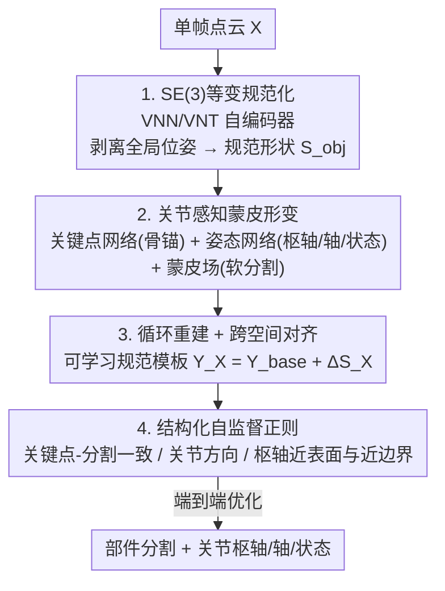

# SCAPO: Self-Supervised Category-Level Articulated Pose Estimation from a Single 3D Observation

**会议**: CVPR 2026  
**论文**: [CVF Open Access](https://openaccess.thecvf.com/content/CVPR2026/html/Zhang_SCAPO_Self-Supervised_Category-Level_Articulated_Pose_Estimation_from_a_Single_3D_CVPR_2026_paper.html)  
**代码**: https://lulusindazc.github.io/SCAPOproject/  
**领域**: 3D视觉  
**关键词**: 关节物体, 类别级位姿估计, 自监督, SE(3)等变, 蒙皮形变  

## 一句话总结
SCAPO 用一个 SE(3) 等变自编码器把任意位姿的关节物体（笔记本、抽屉、安全箱等）对齐到共享规范空间，再用"关节感知蒙皮形变"同时回归部件分割、关节轴/枢轴/关节状态，全程靠循环重建与跨空间对齐自监督训练，无需任何标注、CAD 模板或多帧输入，在合成与真实数据上超过所有自监督基线。

## 研究背景与动机
**领域现状**：类别级关节物体理解要从观测中恢复部件分割、每个部件的 6D 位姿、以及关节参数（旋转轴/滑动方向、枢轴位置、关节角）。这对机器人操作、AR/VR、数字孪生都是刚需。主流做法要么依赖实例级 CAD 模板与关节标注，要么需要多帧/多视角观测来获取运动线索。

**现有痛点**：单帧、无标注的设定下问题极难。PartMobility 靠点云序列的运动线索发现可动部件，但依赖动态输入、无法恢复完整部件位姿；UPPD 能处理静态输入但依赖体素监督，在稀疏/带噪点云上不稳；EAP 学到部件级 SE(3) 等变特征却只输出隐式部件变换，缺少显式的关节枢轴与运动轴，下游运动学推理用不了；OP-Align 通过规范重建做对齐但几何与关节仍纠缠，遇到大形状差异和精细关节就退化。

**核心矛盾**：单帧观测里**形状变化**和**关节运动**两种因素纠缠在一起——同一类物体既有实例间形状差异（不同笔记本外形不同），又有关节状态差异（屏幕开合角度不同），现有方法很难把"这是形状不一样"和"这是关节转了"分开，于是要么分割飘、要么关节参数错。

**本文目标**：在单帧 RGB-D / 点云、零标注、零模板的条件下，同时输出规范形状、刚性部件分割、以及**显式**的关节枢轴 $c^{[j]}$、运动轴 $d^{[j]}$、关节状态 $a^{[j]}$。

**切入角度**：先用 SE(3) 等变把全局位姿这一最大干扰因素彻底剥离、把所有实例对齐到统一规范帧；再在对齐后的形状上用蒙皮（blend skinning）这一可逆形变显式建模部件运动，使几何与关节解耦。

**核心 idea**：用"SE(3) 等变规范化 + 关节感知蒙皮形变 + 循环/跨空间一致性自监督"取代密集监督，从单帧恢复可解释的关节结构。

## 方法详解

### 整体框架
输入是一个含 $P$ 个刚性部件的关节物体点云 $X \in \mathbb{R}^{3\times N}$，输出是部件分割、每部件刚性位姿 $T^{[p]}=[R^{[p]}|t^{[p]}]\in SE(3)$、以及 $J$ 个关节的枢轴/轴/状态。整条管线分三个阶段：① **规范化**——SE(3) 等变自编码器估全局位姿 $(R_g,t_g)$ 并解码出规范形状 $S_{obj}$，把不同实例对齐到共享规范帧；② **关节感知形变**——在规范空间里用关键点网络定义骨骼、姿态网络回归关节参数、蒙皮场分配软权重，构成观测↔规范双向蒙皮映射；③ **优化与正则**——用观测↔重建的循环一致性、规范模板的跨空间对齐、以及一组结构化正则项端到端自监督训练。

### 关键设计

**1. SE(3) 等变规范化：把全局位姿这一最大干扰先剥干净**

针对"单帧里形状与运动纠缠、且物体位姿任意"的痛点，作者先解决"位姿"这一层。编码器 $\Theta_E$ 基于 Vector Neuron Networks (VNN) 与 Vector Neuron Translation (VNT) 构建：先用 VNT 层估平移向量 $t_g$ 并构造平移不变特征，再用 VNN 层提取朝向感知特征并聚合出旋转矩阵 $R_g$，从而得到位姿不变的隐式形状码 $Z_x$；解码器 $\Theta_D$ 把 $Z_x$ 解码成与全局变换无关的规范形状 $S_{obj}$。原始输入可由 $X = S_{obj}\cdot R_g + \mathbf{1}_N\cdot t_g^\top$ 重建，这保证形状特征对 SE(3) 变换不变、而位姿参数等变。训练目标沿用重建损失 $L_{rec}$、正交约束 $L_{ortho}$（把 $R_g$ 拉向 $SO(3)$）、增广一致 $L_{aug\text{-}consist}$ 与规范一致 $L_{can\text{-}consist}$，组合为 $L = L_{rec} + \lambda_1 L_{ortho} + \lambda_2 L_{aug} + \lambda_3 L_{can}$。把位姿先验剥离后，后续部件/关节建模才能在统一坐标系里进行。

**2. 关节感知蒙皮形变：用骨骼+蒙皮显式表达部件运动**

针对"要输出显式关节参数、又要把几何与关节解耦"的目标，作者在规范空间用蒙皮框架建模。关键点网络 $\Theta_K$ 从 $Z_x$ 预测 $P$ 个部件质心 $K=\{k^{[p]}\}$ 作为骨锚；姿态网络 $\Theta_J$ 回归每个部件的枢轴 $c^{[p]}$、运动轴 $d^{[p]}$、标量关节状态 $a^{[p]}$，并据此构造骨变换——旋转关节 $R^{[p]}=\mathrm{Exp}_{SO3}([d^{[p]}]_\times\cdot a^{[p]})$、平移关节 $t^{[p]}=d^{[p]}\cdot a^{[p]}$，每部件变换走"平移到枢轴→施加运动→平移回去"三步。蒙皮场 $\Omega$ 用马氏距离 $W_i^{[p]}=(s_i-O^{[p]})^\top Q^{[p]}(s_i-O^{[p]})$ 衡量点与骨的契合度（$O^{[p]}=k^{[p]}$ 为骨中心、$Q^{[p]}$ 编码骨的朝向与尺度），再经温度 softmax 得到软权重 $w_i$，从而把硬分割问题转成可微的软部件归属。每点的混合变换 $T_i^{c\to o}=\sum_p w_i^{[p]}T^{[p]}$ 与其逆给出观测↔规范双向形变，天然支持循环重建。和 EAP 只给隐式部件变换不同，这里**所有量都是显式且有物理含义**（枢轴是 3D 点、轴是单位向量、状态是关节角/位移），下游运动学可直接用。

**3. 循环重建 + 跨空间对齐：用可学习规范模板解耦类别几何与实例残差**

针对"实例间形状差异会被误当成关节运动"的痛点，作者引入跨实例的可学习规范模板 $Y_X=\Delta S_X + Y_{base}$，其中 $Y_{base}$ 是编码类别共享几何与规范位姿的全局先验，$\Delta S_X=\Theta_\Delta(F_x)$ 是从解码器特征预测的实例特定残差形状。训练时有两类一致性约束：**循环重建**对输入 $X$ 走 $X\to S_{obj}\to S^*\to \hat S_{obj}\to \hat X$ 这条可逆链，用 $L_{cycle}=\|\hat X - X\|_1$ 逼回原输入，并对模板 $Y_X$ 施加同样的循环；**跨空间对齐**定义输入空间与规范模板间的跨空间骨变换 $T^{[p]}_{X\to Y}$（其中 $R^{[p]}_{r,x2y}$ 把输入轴 $d_x^{[p]}$ 对齐到规范轴 $d_y^{[p]}$、$R^{[p]}_{x2y}$ 编码两个关节状态之间的相对运动），再用 Chamfer 距离 $L_{recon}=\mathrm{CD}(\hat S_{x2y}, Y_X)$、$L^Y_{recon}=\mathrm{CD}(\hat S_{y2x}, S_{obj})$ 双向对齐。这套设计让"类别共享几何"沉淀进 $Y_{base}$、"实例外形差异"被 $\Delta S_X$ 吸收，从而把它们和真正的关节运动分开。

**4. 结构化自监督正则：用关节物体的物理结构当弱监督信号**

针对"零标注下关节参数容易乱飘"的问题，作者加入四组反映关节物体物理结构的正则。**关键点-分割一致**：用软权重算部件软质心 $m^{[p]}=\frac{1}{N_p}\sum_i w_i^{[p]} s_i$，惩罚关键点与质心偏差 $L_{kp\text{-}seg}$，让骨锚落在部件几何中心；同时用"最近关键点"给每点生成 one-hot 伪标签监督分割权重 $L_{seg}$。**关节方向对齐**：在分割熵高的边界点上做 PCA 得主方向 $\tilde d$，用 $L_{dir\text{-}align}=\frac{1}{B}\sum(1-|\langle d^{[j]},\tilde d\rangle|)$ 把关节轴拉向边界处的主几何变化方向（取绝对值处理轴的符号歧义）。**枢轴近表面**：$L_{joint\text{-}prox}$ 约束枢轴别飘离规范形状表面。**枢轴近边界**：以分割熵 $H_i=-\sum_p w_i^{[p]}\log w_i^{[p]}$ 作边界线索，用软注意力把枢轴 $c^{[j]}$ 吸向高熵（部件交界）区域。这些项把"关节应当落在部件交界、轴应顺着几何变化"的物理先验编码进损失，替代了昂贵的关节标注。

### 损失函数 / 训练策略
两阶段训练：Stage 1 训 SE(3) 等变自编码器（$\lambda_1=\lambda_2=\lambda_3=0.1$，学习率 $1\times10^{-3}$）；Stage 2 训关节相关模块（PointNet 风格关节预测器、关键点检测器、类别形状方差模块等 MLP 头，学习率 $1\times10^{-4}$）。总损失权重：$\lambda_{cycle}=10,\lambda_{recon}=10,\lambda_{kp\text{-}seg}=1,\lambda_{seg}=1,\lambda_{shape\text{-}var}=10,\lambda_{dir\text{-}align}=0.1,\lambda_{joint\text{-}prox}=1,\lambda_{joint\text{-}boundary}=3$。每物体均匀采样 $N=1024$ 点，Adam（权重衰减 $10^{-8}$）+ 余弦退火 200 epoch，单张 RTX A5000 训练。

## 实验关键数据

### 主实验
合成数据集取自 EAP 的设定（HOI4D + Shape2Motion 共五类：laptop / safe / oven / washer / eyeglasses），每个 mesh 渲染成模拟单视角深度的部分点云。评估三维度：部件级（旋转/平移误差、3D IoU）、关节状态（旋转关节角误差/平移关节位移误差）、关节参数（轴朝向误差、枢轴定位误差）。下表为五类均值（S=分割 IoU↑，D=关节方向误差↓ 度，C=枢轴误差↓，R=部件旋转误差↓ 度，t=部件平移误差↓）：

| 指标 | 方法 | 监督 | 均值 |
|------|------|------|------|
| S ↑ | OP-Align | 自监督 | 82.24 |
| S ↑ | **SCAPO** | 自监督 | **84.98** |
| S ↑ | 3DGCN | 全监督 | 92.59 |
| D ↓ | OP-Align | 自监督 | 4.60 |
| D ↓ | **SCAPO** | 自监督 | **3.89** |
| C ↓ | OP-Align | 自监督 | 0.104 |
| C ↓ | **SCAPO** | 自监督 | **0.075** |
| R ↓ | OP-Align | 自监督 | 6.73 |
| R ↓ | **SCAPO** | 自监督 | **5.78** |
| t ↓ | EAP | 自监督 | 0.067 |
| t ↓ | **SCAPO** | 自监督 | 0.086 |

SCAPO 在自监督方法里拿下最高分割 IoU 与最低关节方向/枢轴/部件旋转误差，全面超过此前最强自监督基线 OP-Align；平移误差略逊于 EAP 但优于 OP-Align（0.115）与 ICP（0.174）。提升在 eyeglasses、washer 这类大形状变化类别上尤其明显。即便对比全监督的 3DGCN / NPCS-EPN，SCAPO 在关节方向与旋转误差上反而更低，分割与枢轴误差也具竞争力——而它完全不用标注。

### 消融实验
真实数据集（[1] 提供的五类 RGB-D 扫描：basket / laptop / suitcase / drawer / scissors，无 mesh 真值）采用多阈值 mAP 评估：部件位姿在旋转误差 < 5°/10°/15° 且平移误差 < 5/10/15 cm 时算正确，分割按 75%/50% IoU 阈值统计。⚠️ 真实数据各类具体数值以原文表为准（缓存未含完整表格）。下表汇总论文报告的关键设计组件作用：

| 组件 | 作用 | 去掉/替换后的影响 |
|------|------|------|
| SE(3) 等变规范化 | 剥离全局位姿、对齐实例 | 各实例无法对齐，部件/关节建模失去统一坐标系 |
| 关节感知蒙皮形变 | 显式输出枢轴/轴/状态 + 软分割 | 退回隐式变换，下游运动学不可用 |
| 可学习规范模板 $Y_{base}+\Delta S_X$ | 解耦类别几何与实例残差 | 形状差异被误当关节运动，分割飘移 |
| 结构化正则（4 项） | 关节落边界、轴顺几何 | 零标注下关节参数漂移、不物理 |

### 关键发现
- 把全局位姿用 SE(3) 等变彻底剥离，是后续在统一规范帧里稳定建模部件与关节的前提。
- 显式蒙皮（枢轴+轴+状态驱动骨变换）让自监督方法首次给出可直接用于运动学推理的关节参数，区别于 EAP 的隐式变换。
- 自监督 SCAPO 在关节方向与部件旋转误差上甚至超过全监督基线，说明结构化物理正则在该任务上比密集标注更"对症"。

## 亮点与洞察
- **把"位姿"和"形状/关节"分两层解耦**：先 SE(3) 等变去位姿、再蒙皮去几何残差，层层剥离纠缠因素，思路干净且每层都有明确监督信号，可迁移到其他需要规范化的 3D 任务。
- **用分割熵当关节边界线索**：以 $H_i=-\sum_p w_i^{[p]}\log w_i^{[p]}$ 把枢轴吸向"分割最犹豫"的区域——部件交界处天然分割不确定，这个无标注的几何/统计信号巧妙替代了关节位置标注。
- **可学习类别模板 + 实例残差**：$Y_{base}$ 沉淀共享几何、$\Delta S_X$ 吸收个体差异，是把"类别级泛化"与"实例特异"显式分账的可复用范式。

## 局限与展望
- 方法假设部件是刚性、且类别内共享一致的运动学结构（关节连接拓扑固定），对柔性/可变拓扑物体未必适用。
- 依赖单视角部分点云，遮挡严重或部件几乎不可见时，关节参数估计的歧义难以从单帧消除（作者也指出单帧观测的强歧义性）。
- 平移误差仍略逊于 EAP，说明纯自监督在绝对尺度定位上仍有差距；可改进方向是引入弱物理约束或少量自标注线索来收紧平移。
- ⚠️ 真实数据集的逐类 mAP 数值缓存未完整收录，复现时需回原文表格核对。

## 相关工作与启发
- **vs OP-Align**: 同为单点云自监督的类别级关节对齐，OP-Align 靠规范重建做对象/部件联合规范化但几何与关节仍纠缠；SCAPO 用 SE(3) 等变 + 蒙皮形变 + 模板残差显式解耦，在大形状变化与精细关节上更稳，分割/关节误差全面更低。
- **vs EAP**: EAP 学部件级 SE(3) 等变特征但只输出隐式部件变换、缺显式枢轴与轴，且推理慢、分割不稳；SCAPO 直接回归显式关节参数，下游运动学可用。
- **vs UPPD / PartMobility**: 二者分别依赖体素监督或点云序列运动线索；SCAPO 只需单帧、无标注、无模板，部署更可扩展。

## 评分
- 新颖性: ⭐⭐⭐⭐⭐ SE(3) 等变规范化 + 关节感知蒙皮 + 模板残差解耦的组合在单帧自监督关节估计上是清晰的新框架。
- 实验充分度: ⭐⭐⭐⭐ 合成+真实双数据集、对比自监督与全监督基线、指标覆盖三维度；但缓存内消融以组件级定性为主，逐项数值消融有限。
- 写作质量: ⭐⭐⭐⭐ 逻辑分三阶段层层递进、公式完整；符号偏密集，初读门槛略高。
- 价值: ⭐⭐⭐⭐⭐ 零标注/零模板输出显式关节参数，对机器人操作与数字孪生有直接落地价值。

<!-- RELATED:START -->

## 相关论文

- [\[CVPR 2026\] DICArt: Advancing Category-level Articulated Object Pose Estimation in Discrete State-Spaces](dicart_advancing_category-level_articulated_object_pose_estimation_in_discrete_s.md)
- [\[CVPR 2026\] SE(3)-Equivariance with Geometric and Topological Guidance for Category-Level Object Pose Estimation](se3-equivariance_with_geometric_and_topological_guidance_for_category-level_obje.md)
- [\[CVPR 2026\] ComPose: A Unified Completion-Pose Framework for Robust Category-Level Object Pose Estimation](compose_a_unified_completion-pose_framework_for_robust_category-level_object_pos.md)
- [\[CVPR 2026\] RoSAMDepth: Robust Self-supervised Depth Estimation Leveraging Segment Anything Model](rosamdepth_robust_self-supervised_depth_estimation_leveraging_segment_anything_m.md)
- [\[ICCV 2025\] Unified Category-Level Object Detection and Pose Estimation from RGB Images using 3D Prototypes](../../ICCV2025/3d_vision/unified_category-level_object_detection_and_pose_estimation_from_rgb_images_usin.md)

<!-- RELATED:END -->
