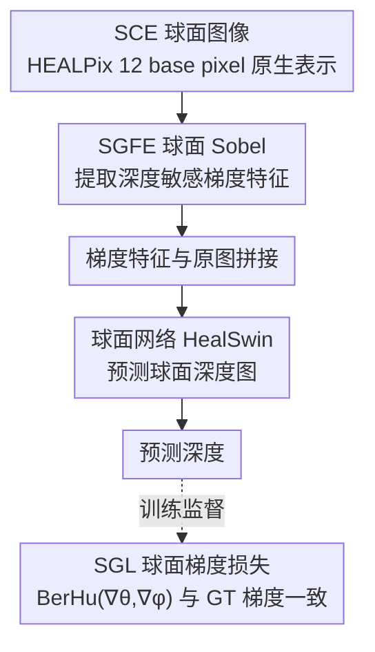

# SCE-Depth: A Spherical Compound Eye Framework for Wide FOV Depth Estimation

**会议**: CVPR 2026  
**论文**: [CVF Open Access](https://openaccess.thecvf.com/content/CVPR2026/html/Zhu_SCE-Depth_A_Spherical_Compound_Eye_Framework_for_Wide_FOV_Depth_CVPR_2026_paper.html)  
**代码**: https://github.com/ZhuYi2000/SCE-Depth  
**领域**: 3D视觉 / 深度估计  
**关键词**: 宽视场深度估计, 仿生复眼相机, 球面神经网络, HEALPix, 球面梯度

## 一句话总结
SCE-Depth 提出一套"仿生球面复眼相机 + 球面神经网络"的软硬件协同深度估计框架，直接在 HEALPix 球面网格上原生处理复眼图像以避免平面化带来的畸变，并利用相邻小眼重叠视场天然产生的"随距离衰减的深度敏感梯度"，用球面 Sobel 算子（SGFE）和球面梯度损失（SGL）显著降低宽视场深度误差，尤其在外围区域。

## 研究背景与动机
**领域现状**：单目深度估计轻量、适合 AR、无人机、移动机器人等资源受限平台，但精度差、有尺度歧义；做大模型虽准却又贵又慢。一条有希望的路是软硬件协同——把专用传感器结构和任务优化模型一起设计。生物复眼有独立小眼（ommatidia）和重叠感受野，提供丰富深度线索，且球面排布让视场逼近 180°，启发了人工复眼相机。

**现有痛点**：现有人工复眼系统多受限于感知距离短、计算效率低，且大多只给稀疏/粗糙深度（点源定位、少目标测距），做不了复杂场景的稠密逐像素深度。更关键的是**模态错配**：复眼产生的是球面图像，硬塞进平面神经网络时，把球面投影到平面会引入畸变、破坏小眼间的几何一致性，反而拖垮深度估计。

**核心矛盾**：球面成像数据与平面网络之间存在结构性不匹配——要么投影到平面承受畸变误差，要么缺乏能原生处理球面的学习算法。而复眼硬件与对应学习算法的联合设计此前几乎无人探索。

**本文目标**：（1）让网络原生在球面上处理复眼图像，消除模态转换误差；（2）挖掘并利用复眼特有的深度线索；（3）填补缺乏原生球面复眼数据集的空白。

**切入角度**：作者注意到 SCE 相机相邻小眼有明显视场重叠，会天然增强局部边缘线索，而这种边缘强度随距离衰减——这正是一个可被网络利用的深度敏感特征。配合 HEALPix 网格上的球面网络（如 HealSwin），就能在球面域里无畸变地处理。

**核心 idea**：在 HEALPix 球面网格上原生处理复眼图像，用球面 Sobel 算子提取"随深度衰减的梯度特征"并以球面梯度损失强化，实现梯度感知的宽视场深度估计。

## 方法详解

### 整体框架
SCE-Depth 的输入是球面复眼（Spherical Compound Eye, SCE）相机拍的球面灰度图，输出是球面深度图。整条管线分三步：先用 **球面梯度特征提取器（SGFE）** 从原始 SCE 图像里提取深度敏感的球面梯度特征，把这些梯度特征与原图拼接，再送进一个原生跑在 HEALPix 网格上的球面网络（backbone 用 HealSwin）预测深度；训练时优化目标是标准 MSE 重建损失加上一个新设计的 **球面梯度损失（SGL）**，强制预测深度的梯度与真值梯度一致。整套表示自始至终都在 HEALPix 球面网格上，从而避免了把球面图投影到平面引入的畸变。

### 关键设计

**1. 原生球面处理：在 HEALPix 网格上消除模态转换畸变**

针对"球面成像数据与平面网络错配"这一核心痛点，作者让整个框架原生在球面上运行。SCE 相机的小眼借鉴并列型（apposition）复眼结构，每个小眼是"一个透镜 + 一个单像素光电探测器"，相邻单元间光学隔离消除串扰，把视场内光强积分成一个值，再在半球面阵列上汇成 SCE 灰度图。这些球面图用 HEALPix 格式表示——球面被剖分成 12 个等面积 base pixel，每个再细分成 $n_{\text{side}}\times n_{\text{side}}$ 的规则网格，共 $12\times n_{\text{side}}^2$ 个像素（实现取 $n_{\text{side}}=128$）。这种层级设计既保持等面积采样，又给每个邻域提供局部笛卡尔坐标，便于做梯度运算。Backbone 选 HealSwin 正是因为它也建在 HEALPix 网格上，能与同样实现在该球面表示上的 SGFE/SGL 无缝集成；而 SUFormer 等用不同剖分方案的网络需要重采样、引入插值误差。这样一个统一的 180° 视场被原生处理，绕开了平面投影的畸变误差。

**2. 深度敏感梯度特征 + SGFE：用球面 Sobel 提取随距离衰减的边缘线索**

这是全文的物理洞察兼提取手段。当单个小眼的视场角 $\alpha$ 大于相邻单元的角间隔 $\beta$ 时（即 $\alpha > \beta$），相邻小眼视场重叠，给 SCE 带来深度线索：物体越远，边缘区被多个小眼捕获后越模糊，相邻小眼的强度差 $\Delta\text{Intensity}$ 随距离稳定下降——这一点在仿真（1.0–2.0 m 的椅子模型）和 37 个小眼的实物原型（0.5–0.9 m 白方块）上都得到验证，而鱼眼成像的边缘锐利、强度差对深度无依赖。$\Delta\text{Intensity}$ 本质是相邻小眼连线方向上的梯度，把它推广成球面梯度算子就得到一个随深度反向变化、更稳定连续的深度指示。**SGFE** 把 Sobel 算子搬到球面：对每个 base pixel $B_m$ 用 Sobel 核 $S_x, S_y$ 算两个角向梯度

$$\nabla_x(i,j) = \sum_{u,v=-1}^{1} S_x(u,v)\cdot I(B_m, i{+}u, j{+}v),\quad \nabla_y(i,j) = \sum_{u,v=-1}^{1} S_y(u,v)\cdot I(B_m, i{+}u, j{+}v)$$

再用 HEALPix 的层级映射 $H$ 把局部梯度投到全局球面坐标 $(\theta,\phi)$：$[\nabla_\theta(p), \nabla_\phi(p)] = H(B_m) \odot [\nabla_x(i,j), \nabla_y(i,j)]^T$，其中 $\odot$ 是坐标感知的梯度融合算子，保证跨 base pixel 边界的连续性。实验（$\alpha=3°$）显示 SCE 梯度图随距离明显衰减、而鱼眼平面 Sobel 梯度图无此变化，证明 SGFE 确实在编码 SCE 特有的深度敏感线索。

**3. SGL 球面梯度损失：用 BerHu 在梯度层面强化深度几何一致性**

光提取梯度特征不够，还要在训练目标里显式约束。**SGL** 借鉴平面梯度正则化但直接把深度敏感几何纳入，定义为

$$L_{SG} = \mathrm{BerHu}(\nabla_\theta, \nabla_\theta^*) + \mathrm{BerHu}(\nabla_\phi, \nabla_\phi^*),\qquad L = L_{MSE} + \lambda L_{SG}$$

其中 $\nabla_\theta, \nabla_\phi$ 是预测深度的两个梯度分量，带星号的是真值对应量。选用 BerHu 函数（小误差用 $\ell_2$、大误差转 $\ell_1$ 的混合）是因为它比纯 $\ell_1/\ell_2$ 更抗离群点，既保留梯度特征又抑制不连续边缘处的误差放大；权重 $\lambda$（实现取 1.0）平衡空间精度与几何一致性。它与 SGFE 共同把"梯度即深度线索"这一物理事实贯穿到特征和损失两端。

### 损失函数 / 训练策略
总损失为 $L = L_{MSE} + \lambda L_{SG}$（$\lambda=1.0$）。PyTorch 实现，2 张 RTX 4090，HEALPix $n_{\text{side}}=128$，backbone 为 HealSwin；Adam，学习率 $1\times10^{-4}$，batch size 4，训练 1000 epoch，全局范数 1.0 梯度裁剪，固定随机种子 42，所有指标取 5 次独立运行平均。

## 实验关键数据

> 指标说明：RMSE 是深度均方根误差（越低越好）；Abs Rel 是绝对相对误差（越低越好）；$\delta_1, \delta_2$ 是预测深度与真值之比落在 $1.25$、$1.25^2$ 阈值内的像素百分比（越高越好）。

### 主实验（FisheyeDepth 与 CompoundDepth 数据集，与 SOTA 对比）

| 方法 | 参数(M) | CompoundDepth RMSE ↓ | Abs Rel ↓ | δ1 ↑ | δ2 ↑ |
|------|---------|----------------------|-----------|------|------|
| Swin（平面） | 41.3 | 0.376 | 0.113 | 90.80 | 95.74 |
| DepthAnythingv2 | 24.8 | 0.313 | 0.061 | 94.59 | 98.04 |
| PanDA | 24.8 | 0.283 | 0.064 | 94.35 | 97.86 |
| DepthAnyCamera | 208.9 | 0.266 | 0.055 | 94.89 | 97.84 |
| HealSwin（球面） | 41.3 | 0.350 | 0.082 | 92.76 | 96.99 |
| SUFormer（球面） | 14.9 | 0.429 | 0.105 | 90.31 | 94.76 |
| **SCE-Depth（本文）** | 41.3 | **0.256** | **0.050** | **95.74** | **98.48** |

本文在 CompoundDepth 上 RMSE/Abs Rel/δ1/δ2 全面领先；在 FisheyeDepth 上 RMSE 最低、Abs Rel 仅用约 1/5 参数即媲美 208.9M 的 DepthAnyCamera。值得注意的是，单纯的球面 baseline（HealSwin/SUFormer）反而不如平面方法，因为平面网络架构更成熟、基准更充分，而现有球面模型相对欠发展——SCE-Depth 靠 SGFE+SGL 的深度敏感特征才反超双方。

### 消融实验：FOV 角 α 与梯度算子选择

| 配置 | RMSE ↓ | Abs Rel ↓ | δ1 ↑ | 说明 |
|------|--------|-----------|------|------|
| α = 1° | 0.279 | 0.061 | 94.90 | 重叠太少，深度梯度线索弱 |
| **α = 3°** | **0.256** | **0.050** | **95.74** | 清晰度-深度敏感度最优折中 |
| α = 5° | 0.289 | 0.074 | 93.75 | 重叠过多，边界模糊、精度退化 |
| α = 7° | 0.284 | 0.072 | 93.47 | 同上 |
| Laplacian 算子 | 0.295 | 0.068 | 94.30 | 过度平滑深度不连续处 |
| Scharr 算子 | 0.258 | 0.059 | 95.18 | 接近 Sobel 但高频边缘易放大噪声 |
| **Sobel 算子** | **0.256** | **0.050** | **95.74** | 噪声抑制与结构保留平衡最佳 |

### 关键发现
- **小眼视场角存在最优折中**：$\alpha$ 同时控制两个相互竞争的因素——重叠越大深度敏感度越高，但图像越模糊清晰度越低；$3°$ 取得最佳平衡，过窄（$1°$）线索弱、过宽（$5°/7°$）边界糊。
- **梯度算子 Sobel 最稳**：Laplacian 过度平滑深度断层，Scharr 在高频边缘易放大噪声，Sobel 在噪声抑制与结构细节保留间最均衡。
- **全向一致性是 SCE 的硬优势**：鱼眼（Swin）误差集中在 ±60°~±90° 外围（桶形畸变所致），而 SCE-Depth 因无畸变球面处理在各方向误差均匀，外围墙体/窗户深度更准。
- **跨模态泛化**：在 SynWoodScape 上各指标均超 HealSwin/SUFormer；在 Stanford2D3D 上 RMSE 超两者、Abs Rel 略逊（作者归因于损失里缺相对误差项）。

### 泛化实验（SynWoodScape 与 Stanford2D3D）

| 方法 | SynWoodScape RMSE ↓ | Abs Rel ↓ | Stanford2D3D RMSE ↓ | Abs Rel ↓ |
|------|---------------------|-----------|---------------------|-----------|
| HealSwin | 7.896 | 0.425 | 0.497 | 0.143 |
| SUFormer | 10.376 | 0.519 | 0.432 | 0.071 |
| **SCE-Depth（本文）** | **7.606** | **0.297** | **0.418** | 0.114 |

## 亮点与洞察
- **把"重叠视场→随距离衰减的强度差"这个物理现象变成可学习的深度特征**，并用仿真+实物原型双重验证，软硬件协同做得扎实——这是全文最"啊哈"的地方。
- **原生球面处理 + 球面 Sobel 的组合**说明：与其把球面数据强行平面化承受畸变，不如把经典算子（Sobel）和正则（梯度损失）整体搬到球面网格上，思路可迁移到全景/鱼眼等一切宽视场任务。
- **小参数量打平大模型**：41.3M 在 FisheyeDepth 上 Abs Rel 媲美 208.9M 的 DepthAnyCamera，证明合适的结构先验比堆参数更划算。
- **开源 CompoundDepth + FisheyeDepth 同条件数据集**，为复眼/鱼眼对照和软硬件协同研究提供了稀缺基准。

## 局限与展望
- **依赖仿真数据集**：CompoundDepth 用 Isaac Sim 合成（每小眼 10000 采样光线、共约 20609 个小眼聚合），受当前工艺限制实物复眼分辨率低、高分辨率器件仍在实验室验证阶段，真实复眼大规模数据缺位。
- **损失缺相对误差项**：作者自承在 Stanford2D3D 的 Abs Rel 等相对指标上偏弱，可能因为损失只含 MSE + 梯度一致性、没显式优化相对误差。
- **FOV 折中依赖数据集调参**：最优 $\alpha=3°$ 是在 CompoundDepth 上选出的，换场景/距离范围未必最优。
- ⚠️ 论文核心证据多来自仿真与小规模原型，真实复杂场景、动态目标下的稠密深度表现还需更多验证。

## 相关工作与启发
- **vs 平面投影的复眼方法（CNN/ViT 在平面化复眼图上）**：它们把球面几何投影到平面、引入畸变并破坏小眼间一致性；本文原生在 HEALPix 球面处理，从源头消除模态转换误差。
- **vs 球面网络 HealSwin / SUFormer**：它们是通用球面 backbone 但无针对复眼的深度敏感设计，单独用反而不如平面方法；本文在 HealSwin backbone 上加 SGFE+SGL，反超平面与球面双方。
- **vs 早期人工复眼硬件（COMPU-EYE、光流测深等）**：偏硬件、感知距离短、只给稀疏/粗糙深度；本文以学习驱动在高小眼数球面域做稠密深度，并与硬件解耦。

## 评分
- 新颖性: ⭐⭐⭐⭐⭐ 把生物复眼"重叠视场→深度敏感梯度"的物理机制落成 SGFE+SGL，并原生在 HEALPix 球面建模，软硬件协同角度新颖。
- 实验充分度: ⭐⭐⭐⭐ 主对比 + FOV/算子消融 + 全向一致性 + 跨数据集泛化都有，但核心数据偏仿真、真实复眼数据有限。
- 写作质量: ⭐⭐⭐⭐ 物理动机（仿真+原型验证）讲得清晰，公式与流程图配合到位。
- 价值: ⭐⭐⭐⭐ 为宽视场仿生深度感知和软硬件协同提供了框架与开源数据集，但受复眼器件成熟度制约，落地尚需时日。

<!-- RELATED:START -->

## 相关论文

- [\[CVPR 2026\] Depth Any Panoramas: A Foundation Model for Panoramic Depth Estimation](depth_any_panoramas_a_foundation_model_for_panoramic_depth_estimation.md)
- [\[CVPR 2026\] MD2E: Modeling Depth-to-Edge Cues for Monocular Metric Depth Estimation](md2e_modeling_depth-to-edge_cues_for_monocular_metric_depth_estimation.md)
- [\[CVPR 2026\] Depth Hypothesis Guided Iterative Refinement for Event-Image Monocular Depth Estimation](depth_hypothesis_guided_iterative_refinement_for_event-image_monocular_depth_est.md)
- [\[CVPR 2026\] Seeing Depth Through Frequency and Motion: A Progressive Training Paradigm for Monocular Depth Estimation](seeing_depth_through_frequency_and_motion_a_progressive_training_paradigm_for_mo.md)
- [\[CVPR 2026\] Radar-Guided Polynomial Fitting for Metric Depth Estimation](radar-guided_polynomial_fitting_for_metric_depth_estimation.md)

<!-- RELATED:END -->
