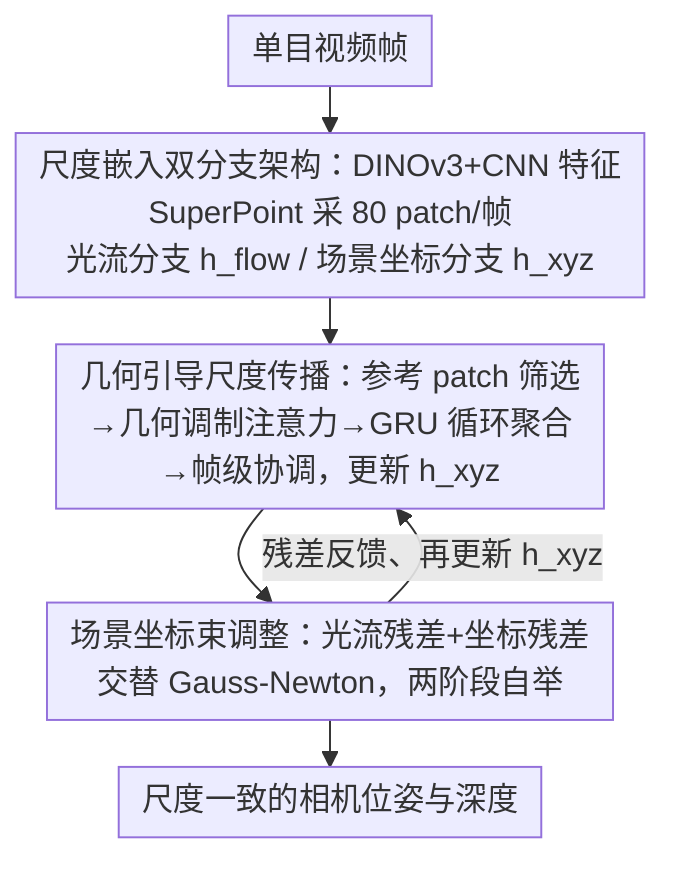

# SCE-SLAM: Scale-Consistent Monocular SLAM via Scene Coordinate Embeddings

**会议**: CVPR 2026  
**论文**: [CVF Open Access](https://openaccess.thecvf.com/content/CVPR2026/html/Wu_SCE-SLAM_Scale-Consistent_Monocular_SLAM_via_Scene_Coordinate_Embeddings_CVPR_2026_paper.html)  
**代码**: 无  
**领域**: 3D视觉  
**关键词**: 单目SLAM, 尺度漂移, 场景坐标嵌入, 束调整, 视觉里程计

## 一句话总结
SCE-SLAM 在帧到帧单目 SLAM 的光流分支之外并联一条「场景坐标分支」，用可学习的 patch 级场景坐标嵌入把 3D 几何关系编码到一个统一尺度参照下，靠几何调制注意力跨窗口传播尺度、再用 3D 坐标约束把束调整往参照尺度上拉，从而在保持 36 FPS 实时性的同时显著抑制长序列尺度漂移（KITTI 平均 ATE 从 DPVO 的 53.61m 降到 25.79m，加回环 14.07m）。

## 研究背景与动机
**领域现状**：单目视觉 SLAM 是移动机器人和互联网级 3D 重建的基础能力。近年的帧到帧方法（DROID-SLAM、DPVO）用基于匹配的局部滑窗优化拿到了很好的实时性，特别适合算力受限的部署场景。

**现有痛点**：单目相机只能恢复到一个未知尺度因子的几何，于是出现「尺度漂移」——估计尺度在长序列上逐渐发散。根本原因在于帧到帧方法的核心约束是像素级匹配，而匹配本身对尺度是不敏感的：把整个场景按任意常数缩放，得到的像素对应关系完全一样。滑窗一个接一个往前滑、彼此独立优化，各自隐式确立各自的尺度，几千帧下来地图就碎裂了，回环也跟着失败。

**核心矛盾**：要消除尺度漂移，可以引入度量深度预测、大型多视图几何模型或帧到模型方法，但它们都带来沉重的计算开销，牺牲了帧到帧方法最宝贵的实时性。于是作者把问题逼到一个中心提问：能不能在保留帧到帧优化效率的前提下做到尺度一致？

**切入角度**：作者的关键观察是——尺度漂移源于「缺乏时间上的尺度记忆」，每个滑窗都独立地另起炉灶建立尺度，不记得前面窗口的尺度。但尺度与光流不同：光流刻画的是瞬时像素位移，而尺度是环境的一个持久几何不变量，整段序列里本应保持不变。传统束调整没有任何机制去跨窗口维持这个不变量。

**核心 idea**：用一组可学习的 patch 级「场景坐标嵌入」充当持久几何记忆，把 3D 几何关系编码在一个统一（canonical）尺度参照下；通过循环更新让这些嵌入跨时间累积尺度一致的信息，再把它解码成显式 3D 坐标约束注入束调整，主动把漂移的估计拉回参照尺度。

## 方法详解

### 整体框架
SCE-SLAM 在 DPVO 的基础上扩展出一个双分支架构：**光流分支**继承 DPVO 提供像素级匹配约束、负责局部跟踪；新增的**场景坐标分支**维护每个 patch 的场景坐标嵌入 $h^{xyz}$，专门负责全局尺度一致性。整套系统输入单目视频帧、输出尺度一致的相机位姿与 patch 深度，中间靠两个协同模块——几何引导尺度传播、场景坐标束调整——形成一个不断自我强化尺度一致性的反馈回环，无需做全局优化。

### 关键设计

**1. 尺度嵌入的双分支架构：给每个 patch 维护两套互补的隐状态**

帧到帧方法只有一套以「边（edge）」为中心的光流隐状态，它天然对尺度不敏感，无从承载尺度记忆。本文为每个 patch 同时维护两类隐状态：① 继承自 DPVO 的边级光流状态 $h^{flow}\in\mathbb{R}^{384}$，由跨帧匹配特征算出的相关体更新，驱动精确光流预测，提供尺度无关的几何约束；② 本文核心的场景坐标嵌入 $h^{xyz}\in\mathbb{R}^{384}$，是**以 patch 为中心**（而非以边为中心）的表示，初始化为零，能从所有观测到该 patch 的帧里累积尺度一致信息。两者分工明确：$h^{flow}$ 抓瞬时成对运动（尺度无关），$h^{xyz}$ 累积持久几何关系（尺度相关）。

为支撑尺度学习，特征侧也做了两处针对性改造：特征提取在轻量 CNN 上融合预训练 DINOv3 特征（$1\times1$ 卷积融合），借基础模型的泛化能力换跨场景稳定匹配；patch 采样放弃 DPVO 的随机采样，改用 SuperPoint 关键点采 80 个 patch/帧——因为尺度一致性学习需要 patch 在多视图间稳定可追踪，随机采样得到的 patch 可能只在一两帧可见，无法支撑多视图几何约束（消融里光这一步就把 ATE 从 31.83m 降到 25.79m）。场景坐标分支的解码头把嵌入解码成残差坐标 $\Delta X_k$ 和置信度 $w_k$：$X_k^{prior}=X_k+\Delta X_k$，其中 $X_k=T_t\cdot\pi^{-1}(u_k,d_k)$ 是当前迭代位姿/深度把 patch 投到世界系的位置。预测残差而非绝对坐标，是为了不丢掉束调整已经积累的几何信息，只做朝参照尺度的修正。

**2. 几何引导尺度传播：让当前 patch 选择性地从空间邻近的历史 patch 借尺度**

核心难题是：当前 patch 怎么利用历史嵌入里编码的统一尺度，又不付出二次方计算量、也不引入错误关联？朴素的全局自注意力有两个致命问题——patch 随序列累积，全注意力计算量随序列长度二次增长，几千帧上万 patch 直接不可行；且并非所有 patch 都该平等交互，一个看近处墙的 patch 不该去关注一个看远山的 patch，这种虚假长程依赖会破坏几何推理。

作者的洞察是「尺度一致性沿 3D 空间邻近性传播」：两个 patch 若观测到物理上邻近的 3D 点，它们在统一尺度下的几何关系就该一致。据此设计了四步传播机制：（i）**参考 patch 筛选**——按历史 patch 的束调整残差排序，只保留残差最低的前 50%，并把范围限制在距当前窗口时间中心最近的 30 帧，最终 $R\approx1200$ 个参考 patch，既保证参照来自几何一致的观测又把注意力计算压到可实时；（ii）**几何调制注意力**——注意力 logit 为 $e_{ar}=\frac{Q_a^\top K_r}{\sqrt{d}}-\lambda\|X_a-X_r\|^2$，几何惩罚项 $-\lambda\|X_a-X_r\|^2$ 随空间距离增大压低注意力，编码「3D 邻近 patch 应共享一致尺度」的归纳偏置；并把相对位移经 MLP 融进 value：$V_r^{geo}=V_r+\text{MLP}_{pos}(X_a-X_r)$，再聚合出空间相关 $f^{sc}=\text{MLP}_{sc}(e_{ar}\cdot V_r^{geo})$；（iii）**循环聚合**——$\tilde h^{xyz}=h^{xyz}+f^{sc}+f^{ctx}$ 残差融合保留旧记忆，再过 GRU：$h^{xyz}=\text{GRU}(\tilde h^{xyz})$ 让尺度记忆跨迭代累积；（iv）**帧级协调**——同一帧所有 patch 共享相机位姿、尺度应互相一致，故解码前做 $h^{xyz}=\text{FrameAgg}(h^{xyz})$。当某窗口开始漂移，这套聚合就把它锚回初始化时确立的参照尺度。

**3. 场景坐标束调整：把学到的嵌入翻译成显式优化约束，跨窗口锚定尺度**

光流残差再准也救不了尺度，因为它是尺度无关的。本模块在标准束调整里并入第二类残差。光流残差 $r_{ij}^{flow}=w_{ij}^{flow}(u_j^{prior}-\pi(T_j T_i^{-1}\pi^{-1}(u_i,d_i)))$ 在像素空间驱动局部高保真重建，但对深度和基线的统一缩放无感；场景坐标残差 $r_k^{xyz}=w_k^{xyz}(X_k^{prior}-T_{t(k)}\cdot\pi^{-1}(u_k,d_k))$ 在世界坐标系里显式惩罚尺度偏离——一旦当前估计偏离 $X_k^{prior}$ 编码的统一尺度，残差就增大并产生把 $\{d_k,T_{t(k)}\}$ 拉回去的修正梯度。每次迭代用 Gauss-Newton 交替最小化两类残差。

训练用两阶段自举：阶段 1 只最小化光流残差拿到初始 $\{T_t,d_k\}$ 确立序列的参照尺度；阶段 2 更新嵌入、解码坐标先验，每轮做 1 次带场景坐标残差的 BA 锚尺度、再做 2 轮只用光流残差细化局部几何。这样从光流初始化里自举出尺度一致预测，并让坐标分支沿长序列内化并传播参照尺度。

### 损失函数 / 训练策略
在合成数据 TartanAir 上训练 240K 次迭代（AdamW，lr $8\times10^{-5}$，序列长 15）。除沿用 DPVO 对光流与位姿的监督外，场景坐标分支用 GT 坐标监督 $\mathcal{L}_{SC}=\sum_k\|X_k-X_k^{GT}\|^2$，总损失 $\mathcal{L}_{total}=\lambda_1\mathcal{L}_{flow}+\lambda_2\mathcal{L}_{pose}+\mathcal{L}_{SC}$（$\lambda_1=0.1,\lambda_2=10$）。课程上前 10K 迭代冻结光流分支以初始化坐标分支，随后两分支联合优化。

## 实验关键数据

### 主实验
在 KITTI、Waymo、Virtual KITTI 三个大规模基准上评测，指标为绝对轨迹误差 ATE RMSE（米，越低越好），并报告标准差衡量跨序列稳定性。LC = 是否带回环（loop closure）。

| 数据集 | 指标 | 本文(无LC) | 本文(有LC) | 代表性对手 |
|--------|------|-----------|-----------|-----------|
| KITTI（11 序列均值） | ATE↓ | 25.79 | **14.07** | DPVO 53.61；DPV-SLAM++(LC) 25.75；VGGT-Long(LC) 27.64 |
| Waymo（9 序列均值） | ATE↓ | **0.915** | — | VGGT-Long 1.996；MegaSaM 2.776；DPV-SLAM++ 3.874 |
| vKITTI（6 天气均值） | ATE↓ | **0.280** | — | DPV-SLAM++ 0.343；VGGT-Long 2.089；DROID-SLAM 1.578 |

KITTI 上本文无回环版（25.79m）已逼近带回环的 DPV-SLAM++（25.75m），加回环后进一步到 14.07m，平均 ATE 与标准差均最优；论文强调相比此前最好方法 ATE 减少约 8.36m，且保持 36 FPS 实时。Waymo 上本文（0.915m）显著优于用大型预训练度量深度增强跟踪的 MegaSaM（2.776m），说明「学到的嵌入」比「外部度量先验」更有效。vKITTI 跨六种天气均值 0.28m，甚至超过带回环模块的 DPV-SLAM++。

### 消融实验
KITTI 全序列平均 ATE（SC Branch=场景坐标分支配置，Sampler=patch 采样方式，SP=SuperPoint）：

| 配置 | SC 分支 | 采样 | LC | ATE(m)↓ | 说明 |
|------|---------|------|----|---------|------|
| A | ✗ | 随机 | ✗ | 45.84 | DPVO+DINOv3，仅强特征无尺度锚定 |
| B | 基础设计 | 随机 | ✗ | 43.62 | 加基础坐标分支，仅小幅改善 |
| C | 几何尺度传播 | 随机 | ✗ | 31.83 | 加几何调制注意力等，明显下降 |
| D | 几何尺度传播 | SP | ✗ | 25.79 | 换 SuperPoint 采样再降 6m |
| E | 几何尺度传播 | SP | ✓ | 14.07 | 加回环，完整模型 |

另有 DINOv3 特征影响表：DPVO 加 DINOv3 仅从 53.61→45.84（无锚定机制时漂移依旧），而本文与 DINOv3 协同更强（25.79m）；即便都带回环，本文 14.07m 仍远优于 DPV-SLAM++ 的 22.91m，说明架构设计的贡献超过单纯换特征。

### 关键发现
- 贡献最大的不是更强特征：A→B 仅降 2.2m，真正的跳变来自几何引导尺度传播（B→C 降约 11.8m）与 SuperPoint 采样（C→D 降 6m）。
- SuperPoint 采样之所以关键：跨三帧追踪时随机采样只得 4 条轨迹（2 条落在无效天空区），而 SuperPoint 得 11 条且都在有效结构上，多视图可观测性是尺度聚合的前提。
- 尺度一致性对回环至关重要：在 4Seasons 上本文成功闭环，而带显式回环模块的 DPV-SLAM++ 因尺度碎裂反而失败。

## 亮点与洞察
- 把「尺度」当作环境的持久不变量而非逐帧重估的量，是这篇论文最「啊哈」的视角转换：尺度记忆被显式实例化成 patch 级嵌入，并用 GRU 跨迭代累积，思路类似光流里的循环更新但搬到了 3D 尺度空间。
- 几何调制注意力用一个简单的 $-\lambda\|X_a-X_r\|^2$ 惩罚项把「3D 邻近才该交互」的物理先验注入注意力，既剪掉虚假长程依赖又把全局二次方注意力压成对 1200 个高质量参考 patch 的局部注意力——这个「按几何距离裁剪注意力」的 trick 可迁移到其它需要空间一致性的点云/patch 任务。
- 不预测绝对度量尺度、只维持「一致性」，让系统绕开了度量深度模型的沉重开销，却拿到接近全局优化的尺度稳定性，是效率与一致性之间一个聪明的折中点。

## 局限与展望
- 尺度参照在阶段 1 由前若干帧的光流初始化确立，若初始化阶段本身估计不佳（如开头就快速运动或弱纹理），后续传播的可能是一个有偏的参照尺度——论文未深入讨论初始化失败的鲁棒性。⚠️ 此为笔者据方法推断，原文未明确量化。
- 参考集固定取残差最低 50% 且限于最近 30 帧，本质是局部时间窗口；对于真正的大回环（离开很久又回到同一地点）能否把早期尺度记忆有效带回，仍依赖外部回环模块（实验中加 LC 才到 14.07m）。
- 训练完全在合成数据 TartanAir 上完成，真实开放场景的泛化主要靠 DINOv3 特征撑着；论文给的 8.36m 提升的具体对照基线在正文未完全点名，建议以原文表格为准。

## 相关工作与启发
- **vs DPVO/DROID-SLAM**：它们靠像素级匹配做帧到帧滑窗优化，约束尺度无关、缺跨窗口尺度记忆；本文在其上并联场景坐标分支，用 3D 坐标约束补上尺度锚定，效率相当但尺度稳定性大幅提升。
- **vs MASt3R-SLAM / VGGT-Long 等多视图几何大模型**：它们用 all-to-all 注意力做全局对齐，二次方复杂度限制了可联合处理的帧数，且独立窗口预测会收敛到不一致尺度（本文实验中它们常 TL/OOM）；本文通过对局部时间窗口的迭代几何推理回避了二次方复杂度，同时维持尺度一致。
- **vs 度量深度先验类（MegaSaM 等）**：它们引入外部度量深度模型预测绝对尺度但开销大；本文把尺度信息内化进轻量 patch 嵌入、只维持一致性而非预测绝对度量，Waymo 上反而更准。

## 评分
- 新颖性: ⭐⭐⭐⭐ 把尺度一致性建模为可学习的持久几何记忆 + 几何调制注意力传播，视角清新且落地，但仍是 DPVO 的扩展而非全新框架
- 实验充分度: ⭐⭐⭐⭐ KITTI/Waymo/vKITTI 三基准 + 组件/特征双消融，覆盖较全；真实开放数据与初始化鲁棒性的考察略欠
- 写作质量: ⭐⭐⭐⭐ 动机推导清晰、模块层次分明，但部分关键对照数字（8.36m 的具体基线）在正文未点透
- 价值: ⭐⭐⭐⭐ 在保持实时的前提下显著抑制单目尺度漂移，对资源受限平台的长序列 SLAM 有直接实用价值

<!-- RELATED:START -->

## 相关论文

- [\[CVPR 2026\] Revisiting Monocular SLAM with Spatio-Temporal Scene Modeling](revisiting_monocular_slam_with_spatio-temporal_scene_modeling.md)
- [\[CVPR 2026\] ODGS-SLAM: Omnidirectional Gaussian Splatting SLAM](odgs-slam_omnidirectional_gaussian_splatting_slam.md)
- [\[CVPR 2026\] Unblur-SLAM: Dense Neural SLAM for Blurry Inputs](unblur-slam_dense_neural_slam_for_blurry_inputs.md)
- [\[CVPR 2026\] Flow4DGS-SLAM: Optical Flow-Guided 4D Gaussian Splatting SLAM](flow4dgs-slam_optical_flow-guided_4d_gaussian_splatting_slam.md)
- [\[CVPR 2026\] AERGS-SLAM: Auto-Exposure-Robust Stereo 3D Gaussian Splatting SLAM](aergs-slam_auto-exposure-robust_stereo_3d_gaussian_splatting_slam.md)

<!-- RELATED:END -->
