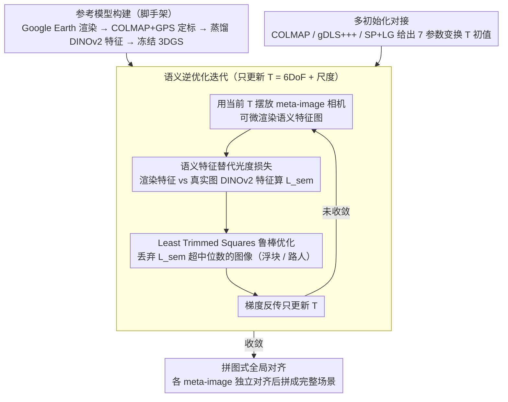

# Scene Grounding In the Wild

**会议**: CVPR 2026  
**arXiv**: [2603.26584](https://arxiv.org/abs/2603.26584)  
**代码**: [https://tau-vailab.github.io/SceneGround/](https://tau-vailab.github.io/SceneGround/)  
**领域**: 3D视觉  
**关键词**: 场景接地, 3D重建, 高斯泼溅, 语义特征, 跨域对齐

## 一句话总结

提出一种基于语义特征的逆优化框架，将野外拍摄的局部3D重建（SfM）对齐到完整的伪合成参考模型（如Google Earth Studio），通过DINOv2特征和鲁棒优化解决巨大的域差异问题，实现非重叠局部重建的全局一致性融合。

## 研究背景与动机

1. **领域现状**：从非结构化照片集合重建3D场景是CV核心挑战。经典SfM和现代学习方法（DUSt3R, MASt3R, VGGT等）已能从大规模图像集合中重建场景，但前提是输入视角间有足够的视觉重叠。
2. **现有痛点**：大规模真实世界图像集合往往存在严重的视角偏置——例如游客主要拍摄米兰大教堂正面，少部分拍背面。这导致SfM产生多个不相连的局部重建，甚至将非重叠区域错误合并。
3. **核心矛盾**：缺少重叠使基于特征匹配的几何对应失效。而Google Earth Studio这样的工具可以渲染完整场景覆盖，但渲染图像与现实照片外观差异巨大（域差异），传统光度损失无法用于对齐。
4. **本文目标** 将野外拍摄的局部重建"接地"（ground）到完整的参考模型中，实现全局一致性对齐。
5. **切入角度**：尽管外观差异巨大，真实照片和伪合成渲染共享相同的场景语义。利用DINOv2等基础模型提取的语义特征跨域一致这一洞察，设计基于语义的逆优化。
6. **核心 idea**：将3DGS参考模型蒸馏语义特征，通过最小化渲染-真实图像的语义特征L1损失来优化6DoF+scale变换，辅以Least Trimmed Squares鲁棒优化处理异常值。

## 方法详解

### 整体框架

这篇论文要解决的是：野外拍的一堆照片做SfM后，常因视角不重叠裂成几块互不相连的局部重建，怎么把它们摆回一个完整场景里。作者的做法是借一个"地图册"——用Google Earth Studio渲染整座建筑、再构建成蒸馏了DINOv2特征的3DGS参考模型，把每块局部重建（称为meta-image）逐个"接地"到这张完整参考上。

整条流水线只优化一个7参数的全局变换 $T$（6DoF的SE3旋转平移 + 1个尺度）：参考模型的高斯参数全程冻结，每轮迭代用当前 $T$ 把meta-image的相机摆到参考坐标系下、可微渲染出语义特征图，再和真实照片的DINOv2特征算损失（其间用鲁棒优化剔除异常图像），梯度反传只更新 $T$。多块局部重建则各自独立对齐，像拼图一样一块块拼回完整场景。

### 关键设计

**1. 语义特征替代光度损失：让颜色对不上的两个域也能算损失**

跨域对齐最棘手的地方是参考图来自Google Earth渲染、真实图是游客随手拍，颜色、光照、纹理质量天差地别，传统光度损失（iNeRF那一类直接比RGB的做法）在这种外观鸿沟下基本失灵——消融里它的旋转误差 ΔR 高达6.48°，而本方法只有2.48°。作者抓住的关键观察是：外观虽然差很多，但场景语义是共享的——大教堂的塔楼、玫瑰窗、门廊在哪，两个域都一样。于是他们仿照 Feature 3DGS 的思路，在参考模型的每个高斯上额外蒸馏一个 DINOv2 特征向量，让模型不止能渲RGB还能渲特征图，优化时改用渲染特征图与真实图DINOv2特征之间的L1损失 $L_{sem}$ 当监督。因为DINOv2编码的是场景语义而非外观细节，颜色对不上也不影响这个信号。作者还试过 LSeg 的分割特征和 DINOv2+DVT 增强版，发现原始DINOv2最好——对齐需要的是细粒度空间语义，而不是粗的语义类别。

**2. Least Trimmed Squares 鲁棒优化：别让浮块和路人主导损失**

野外数据里异常值躲不掉：参考模型有浮块artifact，真实照片里有路人、临时搭建物、大面积遮挡，这些区域的特征损失会异常大，直接平均下来整个优化会被它们带偏。作者把目标写成

$$\hat{T} = \arg\min_T \varphi\big(\mathcal{L}(T\,|\,\mathcal{I}, \mathcal{M})\big)$$

其中鲁棒算子 $\varphi$ 用的是 LTS：每轮迭代里，凡是 $L_{sem}$ 超过上一轮损失中位数的那些图像，本轮直接丢掉不参与梯度。这种"按中位数自适应截断"的方式比固定阈值截断（Fixed LTS）或迭代加权的 IRLS 都更稳——消融里去掉LTS后 MTA 从81%掉到69%、异常率O%从0%升到3%。

**3. 多初始化对接 + 拼图式全局对齐：从任何起点都能往上提**

逆优化本身不挑初始化，作者让它能直接对接 COLMAP、gDLS+++、SuperPoint+LightGlue 等多种方法的输出——这三者各有取舍：gDLS+++最稳但需要特殊配置，COLMAP最通用但初始误差偏大，SP+LG介于其间。无论从哪个起点出发，语义逆优化都能在其基础上持续把误差压下去（比如 COLMAP init 的 ΔR 从4.99°降到2.48°）。多块重建则不是一次性联合求解，而是每个meta-image各自独立对齐到同一个参考模型，最后像拼图一样拼成全局一致的场景——这样回避了同时优化所有变换的高维耦合，每次只解一个7参数问题。

### 损失函数 / 训练策略

监督信号是渲染特征图与真实图DINOv2特征的L1距离 $L_{sem}$，外面套一层LTS鲁棒化；优化用梯度下降更新7参数变换（6DoF SE3 + 1尺度），参考模型的3DGS参数全程冻结。参考模型本身则由Google Earth Studio渲染图像走COLMAP重建、并借GPS坐标定标得到。

## 实验关键数据

### 主实验

WikiEarth基准（32个meta-images，23个场景）：

| 方法 | ΔR° ↓ | ΔT ↓ | MTA% ↑ | O% ↓ | 失败数 |
|------|-------|------|--------|------|--------|
| COLMAP | 4.99 | 0.12 | 66 | 12 | 0/32 |
| **Ours (COLMAP init)** | **2.48** | **0.12** | **81** | **0** | - |
| gDLS+++ | 2.86 | 0.12 | 78 | 6 | 1/32 |
| **Ours (gDLS+++ init)** | **2.69** | **0.13** | **84** | **3** | - |
| SP+LG | 3.74 | 0.25 | 74 | 15 | 5/32 |
| **Ours (SP+LG init)** | **3.13** | **0.24** | **81** | **7** | - |

与前馈3D模型对比（geodesic rotation error）：

| 方法 | ΔR_I↔M° ↓ | ΔR_I↔I° ↓ |
|------|-----------|-----------|
| DUSt3R | 54.40 | 29.27 |
| MASt3R | 24.18 | 12.52 |
| VGGT | 51.69 | 24.63 |
| π³ | 68.46 | 45.80 |
| **Ours (COLMAP init)** | **2.59** | **1.48** |

本方法误差比前馈模型低一个数量级。

### 消融实验

| 方法 | ΔR° ↓ | ΔT ↓ | MTA% ↑ | O% ↓ |
|------|-------|------|--------|------|
| **Ours (full)** | **2.48** | **0.12** | **81** | **0** |
| Photometric Loss | 6.48 | 0.38 | 72 | 22 |
| LSeg | 4.78 | 0.34 | 62 | 19 |
| DINOv2 + DVT | 2.86 | 0.14 | 78 | 0 |
| w/o LTS | 3.78 | 0.19 | 69 | 3 |
| Fixed LTS | 2.78 | 0.14 | 72 | 0 |
| IRLS | 3.51 | 0.18 | 72 | 3 |

### 关键发现

- 光度损失在跨域设置下几乎不可用（ΔR 6.48° vs 2.48°，O% 22%），证实了语义特征的必要性
- DINOv2原始特征优于DVT增强版和LSeg分割特征——场景对齐需要的是细粒度空间语义而非语义类别
- LTS的自适应异常值检测至关重要——去除LTS后MTA从81%降至69%，O%从0%升至3%
- 前馈3D模型（DUSt3R, MASt3R, VGGT, π³）在非重叠场景下完全失败——误差在24°-68°范围，而本方法仅2.59°，差距达一个数量级
- 方法可泛化到无人机视频构建的参考模型，不局限于Google Earth

## 亮点与洞察

- **语义作为跨域桥梁**：巧妙利用"不同域的图像共享场景语义"这一洞察，将DINOv2特征蒸馏到3DGS中实现可微渲染+语义比较。这一策略可迁移到任何需要跨域3D对齐的场景
- **iNeRF框架的3DGS升级**：从NeRF切换到3DGS获得实时渲染速度，使逆优化迭代更高效，同时扩展到全局变换而非单帧位姿
- **WikiEarth基准的价值**：首个提供伪合成参考模型与真实世界重建之间ground truth对齐的数据集，填补了评估空白
- 对SOTA前馈模型的"打脸"测试有很强说服力——DUSt3R/MASt3R/VGGT在无重叠设置下几乎完全无效，凸显了外部参考模型的必要性

## 局限与展望

- 依赖Google Earth Studio等外部数据源，这些数据的可用性和质量因地域而异
- 每个meta-image独立对齐，未利用多个meta-image之间可能的约束
- Google Earth Studio模型质量有限（低分辨率纹理、几何粗糙），某些场景可能不够支撑精细对齐
- WikiEarth基准主要包含欧洲大教堂等地标，场景多样性有限
- 可改进方向：联合优化多个meta-image的变换；利用LLM/VLM进行场景-图像语义匹配辅助初始化；扩展到室内场景或非地标场景

## 相关工作与启发

- **vs iNeRF**：iNeRF优化单帧相机位姿，用光度损失，限于受控环境；本文优化全局变换，用语义损失，适用于野外图像集合。重要升级是3DGS替代NeRF和LTS鲁棒化
- **vs DUSt3R/MASt3R/VGGT**：这些前馈模型在有重叠的场景下表现出色，但在非重叠设置下因缺乏全局几何约束而崩溃。说明LLM时代的端到端方法不能完全替代经典的参考模型+逆优化范式
- **vs GaussReg, NeRF2NeRF**：这些方法做两个3D场景间的配准，但不处理跨域（合成-真实）的巨大外观差异

## 评分

- 新颖性: ⭐⭐⭐⭐ 将语义特征引入逆优化做跨域场景接地是自然但有效的创新；WikiEarth基准是有价值的贡献
- 实验充分度: ⭐⭐⭐⭐⭐ 多初始化、与前馈模型全面对比、详细消融、无人机泛化实验，非常扎实
- 写作质量: ⭐⭐⭐⭐ 问题动机清晰，可视化丰富，方法描述条理
- 价值: ⭐⭐⭐⭐ 实用性强——提供了解决大规模场景碎片化重建的方案，对文化遗产、城市建模有直接应用价值

<!-- RELATED:START -->

## 相关论文

- [\[CVPR 2026\] Affostruction: 3D Affordance Grounding with Generative Reconstruction](affostruction_3d_affordance_grounding_with_generative_reconstruction.md)
- [\[CVPR 2026\] NeoVerse: Enhancing 4D World Model with in-the-wild Monocular Videos](neoverse_enhancing_4d_world_model_with_in-the-wild_monocular_videos.md)
- [\[CVPR 2026\] DROID-W: DROID-SLAM in the Wild](droid-slam_in_the_wild.md)
- [\[CVPR 2026\] GaussFusion: Improving 3D Reconstruction in the Wild with A Geometry-Informed Video Generator](gaussfusion_improving_3d_reconstruction_in_the_wild_with_a_geometry-informed_vid.md)
- [\[CVPR 2025\] Zero-Shot Monocular Scene Flow Estimation in the Wild](../../CVPR2025/3d_vision/zero-shot_monocular_scene_flow_estimation_in_the_wild.md)

<!-- RELATED:END -->
