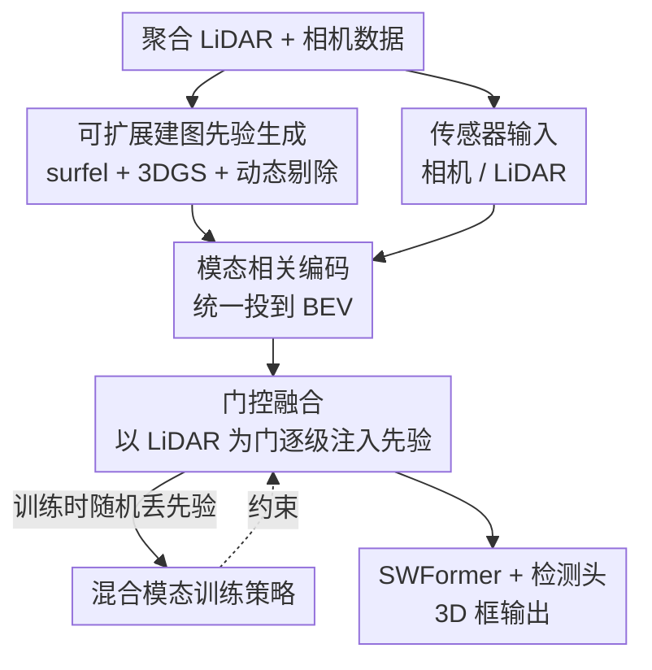

# Scene Reconstruction as Mapping Priors for 3D Detection

**会议**: CVPR 2026  
**arXiv**: [2605.22997](https://arxiv.org/abs/2605.22997)  
**代码**: 无  
**领域**: 3D视觉 / 自动驾驶  
**关键词**: 3D检测, 场景重建, 建图先验, 3DGS, 门控融合

## 一句话总结
把自动驾驶里只用于规划的"地图"重新利用到感知上——用可自动批量重建的 surfel / 3DGS 场景重建当作"建图先验"代替昂贵的人工 HD 地图，再用一个门控融合模块把它和 LiDAR/相机自适应融合，在 Waymo Open Dataset 上仅用 4 帧就超过了用 100 帧的时序融合 SOTA。

## 研究背景与动机
**领域现状**：自动驾驶的 3D 检测目前主流靠多传感器（LiDAR、相机、radar）+ 体素化稀疏卷积骨干（如 SWFormer、SAFDNet）。为了对抗单帧的稀疏与遮挡，业界还广泛用**时序融合**（把过去多帧 LiDAR 对齐到当前帧拼起来，或维护一个目标记忆库做轨迹预测），代表作 MAD 甚至聚合到 100 帧历史。

**现有痛点**：传感器在低能见度、远距离、恶劣天气下不可靠——远处车辆点云极稀，容易淹没在背景噪声里分不出来。已有研究证明 HD 地图能提供静态环境的强结构先验来消歧、补稀疏，但**HD 地图本身不可扩展**：它依赖人工逐条标注每个路面要素，造价高、难维护、覆盖不了大规模路网。而时序融合虽然能加密表征，却受限于算力/显存无法处理长序列，且"检测-跟踪-融合"范式一旦关联出错（ID switch）误差会逐帧累积。

**核心矛盾**：感知想要 HD 地图那种致密静态先验来补传感器之短，但拿不到可扩展的地图来源——人工 HD 地图贵且不可扩展，时序融合又贵又脆。

**本文目标**：找到一种**既能像 HD 地图一样提供致密静态结构先验、又能自动大规模生产**的"地图"，并把它有效融进现有检测器，且要能在地图缺失时照常工作。

**切入角度**：作者观察到，近年的场景重建方法（surfel、3DGS）可以直接从车辆采集的 LiDAR+相机数据**全自动**重建出带几何和外观的致密地图，无需任何人工标注。把重建结果当"建图先验"，正好填上"可扩展致密静态先验"这个空缺。

**核心 idea**：用可自动批量重建的场景（surfel + 3DGS）当 mapping prior 代替人工 HD 地图，再用门控融合把这层"静态背景先验"和传感器特征自适应融合——背景一旦被先验"标记掉"，剩下对不上的稀疏点就凸显成前景动态目标，远处/遮挡目标因此更易检出。

## 方法详解

### 整体框架
MPA3D（Mapping Priors Augmented 3D detection）建立在 SWFormer 之上，整条管线分两大块：**离线的可扩展建图先验生成** 和 **在线的先验增强检测**。

第一块先用一套 MapReduce 并行流水线，从聚合的传感器数据自动重建两类先验——**surfel 图**（几何高效但重度依赖 LiDAR）和 **3DGS 图**（额外用相机优化、能补全 LiDAR 稀疏区），重建前要先剔除动态物体保证场景静态。第二块在检测时，把相机图、LiDAR、surfel、3DGS 各走模态相关编码器投到同一个 BEV 空间，再用 **门控融合模块**以 LiDAR 为主特征、把两类先验当"门"逐级注入，最后接 SWFormer 稀疏窗口 Transformer 和检测头出 3D 框。整套流程靠 **混合模态训练策略**保证先验缺失时模型照样能跑。

下面框架图自上而下对应：建图先验生成 → 模态编码 → 门控融合 → 检测头，与「关键设计」一一对齐。

### 关键设计

**1. 可扩展建图先验生成：用自动重建代替人工 HD 地图**

这是全文动机的落地点——要的就是"致密静态先验"但不能靠人工标注。作者重建两类互补先验。**Surfel 图**把场景离散成 0.25m 的体素，对多次穿行的 LiDAR 扫描在每个体素拟合一个 surfel disk，估计均值坐标、表面法向和均值颜色，记为 $\mathcal{S}=\{x_i, n_i, c_i\}_{i=1:N_S}$；因为每个 surfel 的生成相互独立，可以把大区域切块大规模并行重建，轻松扩展到多城市。它简单高效保真，但**位置被初始 LiDAR 点固定死**，稀疏区会噪声或残缺。**3DGS 图**则用一组高斯 $\boldsymbol{\mathcal{G}}=\{(\boldsymbol{\mu}, \text{SH}, \boldsymbol{r}, \boldsymbol{s}, \alpha)_i\}$ 表示，位置用 LiDAR 初始化，但**所有属性（含位置）都用相机图的光度损失继续优化**——这是和 surfel 最关键的区别：高斯能在优化中移动位置、纠正噪声、补全 LiDAR 缺失区。作者还实现了自定义 CUDA 核做 3D 高斯 ray-tracing（而非原版 splatting）以兼顾精细几何与效率。两者互补：surfel 省、3DGS 准。

由于 3DGS 假设场景静态，必须先**剔除动态物体**：训练集直接用 3D 框标注剔除动态点并投成 2D mask 排除运动物体；推理时没有标注，先用 map-free 配置（靠混合训练支持）预测出初始 3D 框，再用这些框生成 mask 做"边检测边建图"。工程上整条流水线用 Apache Beam 的 MapReduce 实现，**用上千 CPU 核 10 天即可为 60 万个场景生成 surfel+3DGS**，相对人工标 HD 地图是极低成本。

**2. 门控融合模块：以 LiDAR 为门，逐级注入先验且不被密度淹没**

先验和传感器要融合，但有个致命问题：surfel、3DGS、LiDAR 在同一 BEV 体素网格下（$N_{\text{lidar}}=N_{\text{surfel}}=N_{\text{gaussian}}$），若直接对同体素特征做 segment-mean 平均，**结果会偏向点密度最高的模态**——比如一个体素里 95 个 LiDAR 点、5 个高斯，平均后 LiDAR 占 95%，高斯的互补信息几乎被抹掉，多模态融合形同虚设。

门控融合的做法是：先各模态独立 segment-mean 得到 $\bar{f}_{\text{lidar}}, \bar{f}_{\text{surfel}}, \bar{f}_{\text{gaussian}}$，**把 LiDAR 特征当作主特征/门**。第一步注入 surfel 贡献，用 LiDAR 上下文调制 surfel：

$$\alpha_{\text{surfel}} = \text{Swish}(\sigma_{\text{in}}(\bar{f}_{\text{lidar}})) \cdot \sigma_{\text{surfel}}(\bar{f}_{\text{surfel}})$$

再用残差连接得到中间融合特征 $f_{\text{inter}} = \phi_{\text{surfel}}(\alpha_{\text{surfel}}) + \bar{f}_{\text{lidar}}$。第二步**用这个中间特征当新的门**去注入 3DGS：

$$\alpha_{\text{Gaussian}} = \text{Swish}(\sigma_{\text{inter}}(f_{\text{inter}})) \cdot \sigma_{\text{Gaussian}}(\bar{f}_{\text{Gaussian}})$$

最终 $f_{\text{fused}} = \phi_{\text{Gaussian}}(\alpha_{\text{Gaussian}}) + f_{\text{inter}}$，其中 $\sigma_*, \phi_*$ 都是 PointMLP。融合特征再和相机的稠密特征拼接 $f_{\text{final}}=[f_{\text{camera}}, f_{\text{fused}}]$ 喂给稀疏窗口 Transformer。这个设计的妙处在于：通过 LiDAR 残差跳连**保住可靠的 LiDAR 特征不被先验污染**，同时让网络按局部场景特性自适应地调制先验影响力，而不是无脑等权平均。

**3. 混合模态训练策略：让模型在任意模态组合下都能跑**

实际部署时先验未必都在——重建可能因数据覆盖不足或恶劣环境失败；推理时也没有现成的 3D 框。模型必须能处理任意模态组合，不能依赖完整先验。作者在训练时**为每个样本随机采样模态组合**（假设相机+LiDAR 永远在，surfel/3DGS 按预设概率随机丢弃），被丢的模态特征置零。

它能成立靠门控融合的三个性质：① 模态独立聚合，缺失模态贡献零特征而无需改架构；② 可学习的门控权重会自动压制缺失/不可靠模态——网络学会在 $\bar{f}_{\text{surfel}}=\mathbf{0}$ 时令 $\alpha_{\text{surfel}}\approx 0$；③ LiDAR 残差跳连保证稳定，**所有先验都缺失时 $f_{\text{fused}}$ 自然退化为 $\bar{f}_{\text{lidar}}$**。于是整套机制无需显式 mask 或条件分支，推理时模型对任何可用模态组合即插即用、无需重训。这也正好支撑了设计 1 里推理阶段"先 map-free 预测、再建图"的闭环。

### 损失函数 / 训练策略
沿用 SWFormer 的检测损失，对每个类别 $c$ 由热图损失、框回归损失、前景分割损失组成。热图损失 $L_{\text{hm}}^c$ 是 penalty-reduced focal loss；框参数化为 $\boldsymbol{b}=\{d_x,d_y,d_z,l,w,h,\theta\}$（中心偏移 + 尺寸 + 朝向），$L_{\text{bbox}}^c$ 含朝向的 bin loss、其余参数的 Smooth L1 和 IoU loss；外加逐体素二值 focal 的类感知前景分割损失 $L_{\text{seg}}^c$。总损失：

$$L = \sum_c (\lambda_{\text{hm}} L_{\text{hm}}^c + \lambda_{\text{bbox}} L_{\text{bbox}}^c + \lambda_{\text{seg}} L_{\text{seg}}^c)$$

权重 $\lambda_{\text{hm}}=1.0, \lambda_{\text{bbox}}=2.0, \lambda_{\text{seg}}=1.0$。整体采用**三阶段训练**：先在 1 亿条内部视频序列（无先验、用 off-board auto-labeler 自动打 7-DoF 框）预训练；再在约 35 万条带先验序列上 mid-training；最后在 WOD 训练集上用完整先验微调。骨干为 5 个 transformer block（层数 [4,6,4,6,4]、256 通道、8 头），体素 0.2m、最多 250K 体素，256 TPU 核 + LAMB 优化器训 20K 步。

## 实验关键数据

### 主实验
在 Waymo Open Dataset（WOD）验证集与测试集 leaderboard 上评测，指标为 mAP 与按朝向加权的 mAPH，车辆 IoU 阈值 0.7、行人/骑车人 0.5，分 L1/L2 两档难度，检测范围 75m。

**vs 单帧/多帧检测器（验证集 Overall）**：

| 方法 | 帧数 | L1 AP | L1 APH | L2 AP | L2 APH |
|------|------|-------|--------|-------|--------|
| SAFDNet | 1 | 81.7 | 79.7 | 75.5 | 73.6 |
| HEDNet 4f | 4 | 83.6 | 82.3 | 78.1 | 76.8 |
| SAFDNet 4f | 4 | 83.9 | 82.6 | 78.4 | 77.1 |
| **MPA3D (Ours) 4f** | 4 | **86.4** | **84.9** | **81.6** | **80.1** |

相比此前最好的多帧方法 SAFDNet 4f，Overall L1 APH +2.2%、L2 APH +2.7%。

**vs 时序融合方法（验证 + 测试集 Overall）**：

| 方法 | 帧数 | Val L2 APH | Test L2 APH |
|------|------|-----------|-------------|
| MSF | 4 | 75.5 | 77.0 |
| MAD | 100 | 79.4 | 80.2 |
| **MPA3D (Ours)** | 4 | **80.1** | **81.6** |

关键对比：MAD 用 **100 帧**历史，MPA3D 只用 **4 帧**（含 3 帧历史），测试集 L2 AP/APH 还分别 +0.9% / +1.2%，证明高质量重建先验比堆时序帧更"省且强"。在 WOD 测试集 leaderboard 上（不用 ensemble / TTA 的在线方法），MPA3D 4 帧以 L2 APH 81.6 登顶，超过 MAD 100 帧的 80.2。

### 消融实验

**建图先验有效性**（WOD 验证子集，L2）：

| 基线 | Surfel | 3DGS | Overall AP | Overall APH |
|------|--------|------|-----------|-------------|
| Ours-baseline | ✗ | ✗ | 81.8 | 80.1 |
| Ours-baseline | ✓ | ✗ | 82.7 | 81.1 |
| Ours-baseline | ✗ | ✓ | 82.6 | 81.0 |
| Ours-baseline | ✓ | ✓ | **83.3** | **81.7** |

**门控融合 vs 其他融合策略**（WOD 验证子集，Overall L2）：

| 融合策略 | AP | APH |
|----------|----|----|
| Sum | 75.2 | 73.4 |
| Average | 78.7 | 77.0 |
| Concat | 80.4 | 78.7 |
| **Gated** | **83.3** | **81.7** |

**输入模态消融**（MPA3D-96M，Overall L2 APH）：LiDAR 单模 74.9 → +相机 75.7 → +surfel 76.1 → +3DGS 77.4，逐步加模态单调提升。

### 关键发现
- **门控融合是融合环节贡献最大的部件**：Gated 的 Overall L2 AP 83.3% 比次优的 Concat（80.4%）高 2.9%，而 Sum/Average 因等权对待各模态、让某模态的噪声/空特征污染有效信号，表现明显更差——印证了"密度偏置"问题的存在。
- **surfel 与 3DGS 互补**：单独加任一个都涨，两个一起加最好；弱基线（SWFormer†）上加先验在行人类别甚至略降，但强基线（Ours-baseline）上全类别一致提升。
- **为什么背景先验能帮前景检测**：先验主要刻画静态背景（前景已被剔除），模型能把和已知静态背景对齐的点"消去"，剩下对不上的稀疏点即使只是部分轮廓也被凸显成动态前景，对远距离/遮挡目标尤其有效。
- **代价**：baseline 延迟 245ms，加两类先验后升到 452ms；建图侧 60 万场景上千 CPU 核 10 天可完成。

## 亮点与洞察
- **"地图"概念的跨任务再利用**：把规划用的地图重新当成感知的结构先验，且用可自动批量重建的 surfel/3DGS 绕开了人工 HD 地图不可扩展的死结——这是最让人"啊哈"的点，问题被换了个来源就解开了。
- **静态先验帮动态检测的机制很优雅**：不是直接告诉模型"哪里有车"，而是给出"哪里是背景"，靠"排除法"让前景自己浮现，特别契合远距离稀疏点的痛点。
- **门控以 LiDAR 为锚的残差设计一举多得**：既解决了密度偏置（不被点多的模态淹没），又天然支撑了混合模态训练（先验全缺时退化为纯 LiDAR），还让推理时"先 map-free 预测再建图"的闭环成立——一个设计串起了三处需求。
- **可迁移思路**：用门控+残差让"辅助模态"以主模态为门按需注入、训练时随机丢模态学鲁棒性，这套机制可迁移到任何"主传感器 + 不保证可用的辅助先验"的多模态融合场景（如多模态分割、SLAM 里的先验地图）。

## 局限与展望
- **动态重建留给未来工作**：3DGS 假设静态，必须先剔除动态物体；推理时还得先 map-free 跑一遍生成 mask，动态目标本身没法被准确重建，作者明确把"准确动态重建"列为未来工作。
- **延迟近乎翻倍**：加两类先验后从 245ms→452ms，对实时部署是实打实的开销，论文没给先验加速方案。
- **重度依赖 Waymo 体量的数据与算力**：1 亿条内部序列预训练、60 万场景建图、256 TPU 核——方法效果与这种工业级数据/算力规模强绑定，学术界难复现，且未在 nuScenes 等其它数据集验证泛化。
- **无代码开源**：未提供代码，自定义 CUDA 高斯 ray-tracing 核、Apache Beam 流水线等工程细节难以复刻。

## 相关工作与启发
- **vs HD 地图增强检测（HDMapNet / VectorMapNet / MapTR / NeuralMapPrior）**：它们要么依赖昂贵的人工 HD 地图，要么在线预测矢量地图但仍需高质量地图或密集标注训练数据；本文用全自动场景重建当先验，无需任何人工标注即可大规模生产，可扩展性是核心优势。
- **vs 时序融合（MAD / MSF / MPPNet / VideoBEV）**：它们靠聚合多帧（MAD 达 100 帧）或目标记忆库+轨迹预测补稀疏，受算力/显存限制且跟踪误差会累积；本文用预建的静态场景先验提供丰富上下文，仅 4 帧就达到或超过 100 帧时序融合，且不需要长期帧聚合或显式跟踪。
- **vs 基础检测器 SWFormer / SAFDNet**：本文以 SWFormer 为骨干，新增的是建图先验输入 + 门控融合 + 混合模态训练；相对纯传感器检测器，增益主要来自"静态背景先验帮前景消歧"这一额外信息源。

## 评分
- 新颖性: ⭐⭐⭐⭐⭐ 把场景重建重新定义为可扩展的"建图先验"喂给检测，视角新颖、问题转化巧妙。
- 实验充分度: ⭐⭐⭐⭐ WOD 上主实验+多组消融充分、登顶 leaderboard，但只在单一数据集验证、无跨数据集泛化与开源。
- 写作质量: ⭐⭐⭐⭐⭐ 动机推导清晰，方法（先验生成→门控融合→混合训练）层层递进、机制讲得透。
- 价值: ⭐⭐⭐⭐ 对工业级自动驾驶感知很实用且 SOTA，但强绑定 Waymo 量级数据/算力，学术复现门槛高。

<!-- RELATED:START -->

## 相关论文

- [\[CVPR 2026\] Generative Diffusion Priors for 3D Mapping of the Dark Universe](generative_diffusion_priors_for_3d_mapping_of_the_dark_universe.md)
- [\[CVPR 2026\] Learning 3D Reconstruction with Priors in Test Time](tco_learning_3d_reconstruction_with_priors_in_test_time.md)
- [\[CVPR 2026\] Zoo3D: Zero-Shot 3D Object Detection at Scene Level](zoo3d_zero-shot_3d_object_detection_at_scene_level.md)
- [\[CVPR 2026\] NimbusGS: Unified 3D Scene Reconstruction under Hybrid Weather](nimbusgs_unified_3d_scene_reconstruction_under_hybrid_weather.md)
- [\[CVPR 2026\] Paparazzo: Active Mapping of Moving 3D Objects](paparazzo_active_mapping_of_moving_3d_objects.md)

<!-- RELATED:END -->
