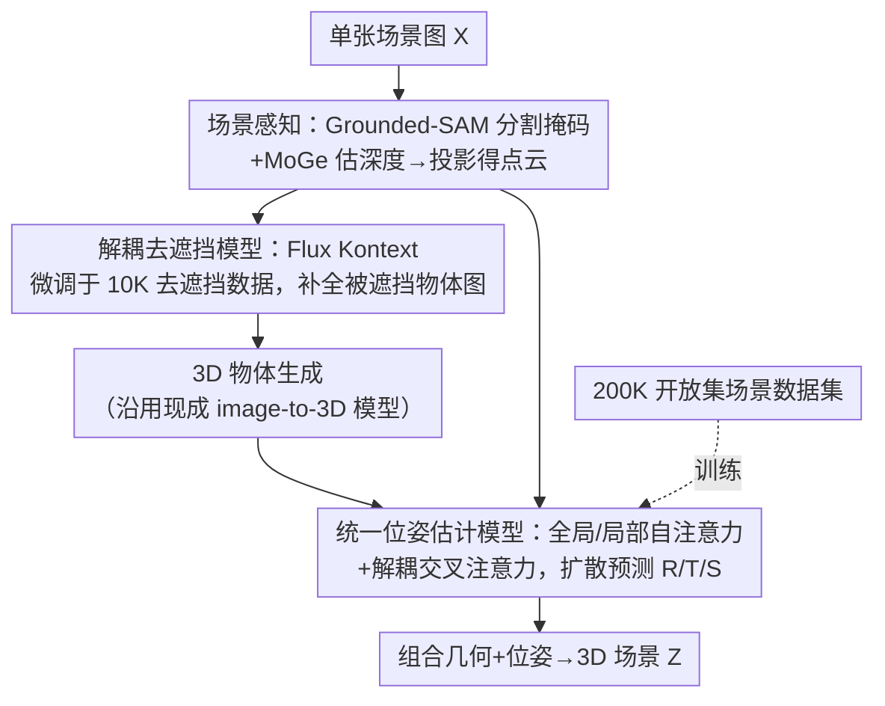

# SceneMaker: Open-set 3D Scene Generation with Decoupled De-occlusion and Pose Estimation Model

**会议**: CVPR 2026  
**论文**: [CVF Open Access](https://openaccess.thecvf.com/content/CVPR2026/html/Shi_SceneMaker_Open-set_3D_Scene_Generation_with_Decoupled_De-occlusion_and_Pose_CVPR_2026_paper.html)  
**代码**: https://idea-research.github.io/SceneMaker/  
**领域**: 3D视觉  
**关键词**: 开放集3D场景生成, 去遮挡, 位姿估计, 扩散模型, 解耦框架

## 一句话总结
SceneMaker 把单图 3D 场景生成拆成「去遮挡 / 3D 物体生成 / 位姿估计」三个解耦子任务，分别在图像数据、3D 物体数据、场景数据上各取所长地学到充足的开放集先验——用图像编辑模型微调的去遮挡模型补全被遮挡物体，用带全局/局部注意力的统一扩散位姿模型直接预测每个物体的旋转/平移/尺寸，并自建 200K 开放集场景数据集，从而在室内和开放集场景下同时拿到高质量几何与准确位姿。

## 研究背景与动机
**领域现状**：开放集 3D 场景生成的目标是从单张图像合成包含任意开放世界物体的 3D 场景，是 AIGC 与具身智能的基础能力（3D 资产创建、仿真环境构建、3D 感知决策）。但受限于场景数据集稀少，多数现有方法被困在室内等受限域。

**现有痛点**：随着大规模 3D 物体数据集出现，开放集 3D 物体生成进步很快，场景生成也开始向开放集延伸，但现有方法仍无法在严重遮挡 + 开放集设定下同时产出高质量几何与准确位姿。作者把根因归结为模型**缺乏两类开放集先验**——去遮挡先验与位姿估计先验。

**核心矛盾**：一个 3D 场景生成模型需要三类开放集先验：去遮挡、物体几何、位姿估计；而这三类先验在场景/物体/图像三种数据集里的可得性各不相同。场景原生方法（scene-native）只从场景数据集学全部三类先验，但场景数据开放集先验有限；物体原生方法（object-native）借大规模 3D 物体数据补上了物体几何先验，却仍因数据受限而缺去遮挡与位姿先验。此外，现有位姿估计方法用到场景生成时会退化——既缺尺寸预测，又没有为不同位姿变量定制的注意力机制。

**本文目标**：分解为三个子问题——（1）如何为去遮挡拿到充足开放集先验；（2）如何在场景中准确估计每个物体的 6D 位姿与尺寸；（3）如何让位姿模型泛化到开放集。

**切入角度**：既然不同先验天然栖息在不同数据集里，那就「按所需先验把任务解耦」，让每个子任务在最匹配的数据集上独立训练，避免数据在任务间互相串扰（如小物体几何坍塌、几何与位姿耦合表示导致的位姿漂移）。

**核心 idea**：解耦三任务 + 用海量图像数据补去遮挡先验 + 用自建 200K 合成场景数据补位姿先验，三管齐下把开放集场景生成的两块短板补齐。

## 方法详解

### 整体框架
给定一张含多个 2D 物体的场景图 $X=\{x_1,...,x_n\}$，SceneMaker 输出对应的一致 3D 场景 $Z=\{z_1,...,z_n\}$。整条流水线由三大模块串成：**场景感知**（用 Grounded-SAM 分割物体掩码、用 MoGe 估深度并投到 3D 得点云）→ **遮挡下的 3D 物体生成**（先用解耦去遮挡模型补全被遮挡物体图，再用现成 image-to-3D 模型生几何）→ **统一位姿估计**（基于点云/图像/几何，扩散式地预测每个物体的旋转、平移、尺寸），最后把几何与位姿组合成完整场景 $Z=\{O,P\}$。整套设计的灵魂是「解耦」：每个模块各自在最富相应先验的数据集上单独训练。

### 关键设计

**1. 解耦式三任务框架：按「所需先验」把场景生成拆开，各在最匹配的数据集上训练**

现有方法把去遮挡、物体几何、位姿三类先验混在一起学，导致数据在任务间互相拖累——小物体几何坍塌、几何与位姿的联合表示引发位姿漂移。本文把场景生成显式划成三个独立任务：去遮挡在图像数据集上训、3D 物体生成在 3D 物体数据集上训、位姿估计在场景数据集上训。形式上写成一串自动化步骤：Grounded-SAM 得掩码 $M$ 与遮挡物体图 $I$ → MoGe 得深度 $D$ 并投影得点云 $C$ → 去遮挡模型 $\epsilon_\theta^d(I_t^d;t,I)\to I^d$ → 3D 生成 $\epsilon_\theta^o(O_t;t,I^d)\to O$ → 位姿估计 $\epsilon_\theta^p(P_t;t,X,M,I,C,O)\to P$，其中 $p_i=\{r_i,t_i,s_i\}$ → 组合成 $Z=\{O,P\}$。解耦保证每个任务都能把自己那类开放集先验学到位、互不污染。

**2. 解耦去遮挡模型：借图像数据集的海量开放集遮挡模式，把被遮挡物体补完整再去生几何**

严重遮挡下几何崩坏的瓶颈在于「去遮挡先验不足」，而 3D 数据集太小、遮挡模式太单一。作者的关键判断是：图像数据集远大于 3D 数据集，覆盖更广的开放集物体与更丰富的遮挡模式。于是把去遮挡从 3D 物体生成里独立出来，用图像编辑模型 Flux Kontext 作初始化（继承其充足开放集先验与对自然语言提示的理解），再在自建 10K 物体级图像去遮挡数据集上微调。该数据集构造很讲究：GPT 生成详细物体描述、FLUX 产高质量目标图，每类 20 条描述并加细节保证质量，再用三种掩码策略模拟真实遮挡（无背景物体抠图、图像边界直角裁剪、随机笔刷涂抹），最终得到 10K 个「被遮挡图 + 文本提示 + 目标图」三元组。补完遮挡后直接接现成 image-to-3D 模型 $\epsilon_\theta^o$ 生几何即可。相比直接在 3D 上做的方法，这种解耦在严重遮挡和开放集下质量更高、更可文本控制。

**3. 统一位姿估计模型：用全局/局部注意力 + 解耦交叉注意力，扩散式联合预测旋转、平移、尺寸**

现有位姿方法用到场景生成时有三大短板：缺尺寸预测（物体生成在归一化 canonical 空间，模型不知道物体在场景里多大）、不同位姿变量没正确解耦地与场景级/物体级特征交互、开放集下因数据受限而退化。本文提出一个统一的扩散位姿模型直接输出 $P=\{R,T,S\}$（旋转用 6D 表示），把整套场景归一化到统一空间后从高斯噪声去噪（flow matching + DiT 架构，物体几何/图像/点云分别用冻结的 3D VAE、DINOv2、点编码器编码）。注意力是核心：每个物体被表示成「旋转/平移/尺寸/几何」四个 token 的四元组——**局部自注意力**让四元组内部交互，**全局自注意力**让场景内所有物体的 token 互相交互以得到连贯的相对位姿；交叉注意力则做了关键的解耦——鉴于旋转可在物体 canonical 空间独立估计、场景级条件帮助不大，用**局部交叉注意力**让旋转 token 只关注裁剪物体图与归一化物体点云，而**全局交叉注意力**让平移与尺寸 token 关注场景级点云和图像。这种「按位姿变量分配该看什么条件」的细粒度注意力，正对症现有方法变量耦合导致的退化。

**4. 200K 开放集场景数据集：为位姿模型补上开放集泛化先验**

现有数据集缺训练开放集位姿模型所需的先验，作者用 Objaverse + Blender 自建。先做严格筛选（排除透明、无 BSDF 节点、无 albedo 贴图、纯色或过暗 albedo 的模型）得到 9 万高质量模型，每个场景随机组合 2~5 个物体，配随机环境贴图作背景、加带 Perlin 噪声纹理的地面、给每个物体随机旋转作物体级增强，最终得 200K 场景、共 800 万图像。把它混进室内数据训练后，位姿模型在开放集上从严重退化变为最优，是开放集场景生成不可或缺的一环。

### 损失函数 / 训练策略
去遮挡模型在 10K 去遮挡数据上微调 Flux Kontext。位姿模型直接对旋转、平移、尺寸施加等权 L2 损失；为公平对比先只在 3D-Front（混合 MIDI3D 与 InstPifu、按房间 ID 对齐得 20K 场景）上从头训 25K 步，再混入 200K 开放集数据从头训 40K 步至收敛。

## 实验关键数据

### 主实验
在 MIDI 测试集（1K 场景）做综合对比，并在更具挑战的室内（3D-Front，遮挡更重）与开放集（自采）各 1K 场景上验证泛化。指标含场景级 Chamfer Distance（CD-S，越低越好）、场景级 F-Score（F-Score-S，越高越好）、包围盒 IoU（IoU-B），以及物体级 CD-O / F-Score-O。

| 测试集 | CD-S↓ | F-Score-S↑ | IoU-B↑ | 对比 |
|--------|-------|-----------|--------|------|
| MIDI（1K） | **0.051** | **0.5642** | **0.671** | MIDI 0.080/0.5019/0.518；DiffCAD 0.117/0.4358/0.392 |
| 3D-Front（重遮挡） | **0.0470** | **0.6312** | **0.7693** | MIDI3D 0.1672/0.3420/0.3855 |
| 开放集 | **0.0285** | **0.6125** | **0.7549** | MIDI3D 0.1425/0.3211/0.5079 |

在 MIDI 测试集对比 PanoRecon/Total3D/InstPIFu/SSR/DiffCAD/Gen3DSR/REPARO/MIDI 等一众方法均取得最优；在遮挡更重的 3D-Front 与开放集上对 MIDI3D、PartCrafter 全面领先。值得注意的是，即便不用 200K 开放集数据训练，本文在室内（3D-Front）仍拿到最佳场景级结果，凸显解耦框架本身的优势。去遮挡与遮挡下物体生成两项子任务也单独验证：去遮挡 PSNR 15.03 / SSIM 0.7566 / CLIP 0.2698 优于 BrushNet 与 Flux Kontext；遮挡下物体生成 CD 0.0409 / F-Score 0.7454 / Volume IoU 0.5985 优于 MIDI、Amodal3R。

### 消融实验
位姿估计的注意力机制消融（用 GT 网格排除几何影响）：

| 配置 | CD-S↓ | FS-S↑ | CD-O↓ | FS-O↑ | IoU-B↑ | 说明 |
|------|-------|-------|-------|-------|--------|------|
| 完整模型 | 0.0242 | 0.7502 | 0.0294 | 0.8121 | 0.7555 | 全部注意力 |
| w/o GSA | 0.0340 | 0.6610 | 0.0556 | 0.6293 | 0.7336 | 去全局自注意力，掉点最重 |
| w/o LSA | 0.0293 | 0.7434 | 0.0901 | 0.7142 | 0.7733 | 去局部自注意力，物体级 CD-O 显著恶化 |
| w/o LCA | 0.0274 | 0.7368 | 0.0429 | 0.7113 | 0.7882 | 去局部交叉注意力 |
| + 完整点云 | 0.0064 | 0.9197 | 0.0124 | 0.8432 | 0.8550 | 上界：给完整点云时大幅跃升 |

### 关键发现
- 注意力三件套都有正贡献：去掉全局自注意力（GSA）整体掉点最重（CD-S 0.0242→0.0340、FS-O 0.8121→0.6293），印证物体间全局交互对连贯相对位姿最关键；去掉局部自注意力（LSA）则主要伤物体级几何（CD-O 0.0294→0.0901）。
- 开放集数据集不可或缺：无 200K 数据时开放集场景严重退化（CD-S 0.0285→0.1538），它提供了跨不同几何建立位姿映射所需的开放集模式。
- 物体数量泛化：训练时每场景不超过 5 个物体，靠 RoPE 设计可泛化到 5 个以上物体的场景。
- 上界很高：给完整点云（等价于视频/多视图重建到上限）时指标大幅提升（CD-S 0.0064、FS-S 0.9197），说明本文方法在视频/多视图条件下潜力巨大。

## 亮点与洞察
- 「按所需先验解耦数据源」是最具启发性的设计哲学：不是堆一个更大模型，而是认识到去遮挡先验富集在图像数据、物体几何富集在 3D 物体数据、位姿先验需要场景数据，于是让每个子任务各取其所——这种「数据—任务匹配」的思路可迁移到任何受多类异构先验制约的生成任务。
- 解耦交叉注意力把「旋转看物体 canonical 空间、平移/尺寸看场景空间」这一几何直觉直接编码进注意力路由，是对「位姿变量耦合导致退化」的精准对症，比笼统地全局交叉注意力更省也更准。
- 用图像编辑大模型（Flux Kontext）当去遮挡初始化、再用合成三元组微调，巧妙地把 2D 生成模型的海量开放集先验「借渡」到 3D 场景生成里，绕开了 3D 去遮挡数据稀缺的死结。

## 局限与展望
- 流水线很长且依赖多个现成模块（Grounded-SAM、MoGe、image-to-3D 生成器），任一上游模块在开放集图像上失败都会沿管线放大；论文未系统分析误差传播。⚠️ 此为笔者据 pipeline 结构推断。
- 上界实验显示给完整点云时性能大幅跃升，反过来说明单图条件下位姿精度仍受深度/点云质量明显制约，真实单图场景与该上界尚有差距。
- 200K 开放集数据由 Objaverse + Blender 合成，物体组合（2~5 个）与背景多为程序化生成，到真实复杂室外/杂乱场景的 sim-to-real 差距未充分评估。
- 评测主要在合成或半合成集（MIDI、3D-Front、自采开放集）上，真实世界捕获图仅做定性展示，缺定量验证。

## 相关工作与启发
- **vs 场景原生方法（InstPIFu / Total3D 等）**：它们只从有限场景数据集学全部三类先验，开放集先验不足、困于室内；本文把任务解耦到各自最富先验的数据源，几何与位姿质量全面领先。
- **vs 物体原生 / 场景空间直接生成（MIDI3D / PartCrafter）**：它们借 3D 物体数据补了几何先验，但去遮挡与位姿先验仍缺、且耦合表示在严重遮挡和小物体上退化；本文用图像数据补去遮挡、用 200K 场景数据补位姿，遮挡更重的 3D-Front 上 CD-S 从 0.1672 降到 0.0470。
- **vs CAST3D 等解耦几何/位姿方法**：它们虽解耦了几何生成与位姿估计，但位姿阶段缺物体间场景级交互导致相对位姿不准；本文的全局自注意力补上了物体间交互、解耦交叉注意力又分流了不同位姿变量的条件来源。

## 评分
- 新颖性: ⭐⭐⭐⭐ 「按所需先验解耦三任务 + 解耦交叉注意力」是清晰且有效的新组织方式，但各子模块多基于现成组件组合
- 实验充分度: ⭐⭐⭐⭐ MIDI/3D-Front/开放集三档评测 + 去遮挡/物体生成/注意力多项消融 + 上界分析，较扎实；真实图缺定量
- 写作质量: ⭐⭐⭐⭐ 用「先验—数据集」表格把动机讲得很透，方法分模块清晰，少量符号偏密
- 价值: ⭐⭐⭐⭐ 实打实推进开放集 3D 场景生成、并开源代码与数据集，对 AIGC/具身仿真有直接价值

<!-- RELATED:START -->

## 相关论文

- [\[CVPR 2026\] DINO Eats CLIP: Adapting Beyond Knowns for Open-set 3D Object Retrieval](dino_eats_clip_adapting_beyond_knowns_for_open-set_3d_object_retrieval.md)
- [\[CVPR 2026\] Exploring 6D Object Pose Estimation with Deformation](exploring_6d_object_pose_estimation_with_deformation.md)
- [\[CVPR 2026\] Iris: Bringing Real-World Priors into Diffusion Model for Monocular Depth Estimation](iris_bringing_realworld_priors_into_diffusion_model_for_monocular_depth_estimation.md)
- [\[CVPR 2026\] Breaking the 3D Dataset Bottleneck: Fast Scalable Generation of Aligned 3D Assets from Scratch for Category 6D Pose Estimation and Robotic Grasping](breaking_the_3d_dataset_bottleneck_fast_scalable_generation_of_aligned_3d_assets.md)
- [\[CVPR 2026\] PoseMaster: A Unified 3D Native Framework for Stylized Pose Generation](posemaster_a_unified_3d_native_framework_for_stylized_pose_generation.md)

<!-- RELATED:END -->
