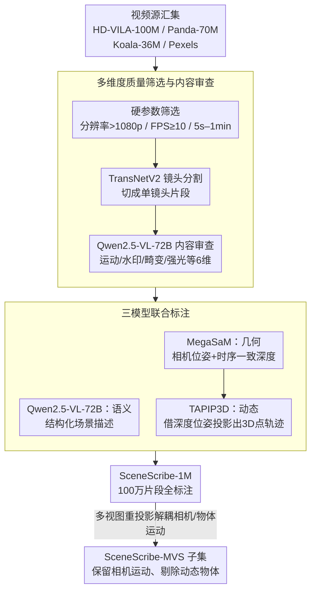

# SceneScribe-1M: A Large-Scale Video Dataset with Comprehensive Geometric and Semantic Annotations

**会议**: CVPR 2026  
**arXiv**: [2604.07990](https://arxiv.org/abs/2604.07990)  
**代码**: [https://wangyunnan.github.io/SceneScribe-1M](https://wangyunnan.github.io/SceneScribe-1M)  
**领域**: 3D视觉 / 视频理解  
**关键词**: 视频数据集, 几何标注, 语义标注, 世界基础模型, 深度估计

## 一句话总结

提出SceneScribe-1M——一个包含100万个野外视频、超4000小时的大规模多模态视频数据集，提供详细文本描述、精确相机参数、连续深度图和一致性3D点轨迹等全面标注，为3D几何感知和视频生成任务提供统一资源。

## 研究背景与动机

1. **领域现状**：3D几何感知和视频合成的融合是构建世界基础模型（WFM）的核心需求。现有数据集要么专注于3D理解（如RE10K、CO3Dv2），要么专注于视频生成（如Panda-70M、Koala-36M），缺乏同时支持两个方向的统一资源。
2. **现有痛点**：(A) 3D感知数据集：合成数据有域差异，真实数据标注受限于计算开销和SfM/SLAM的局限性，动态场景标注规模小；(B) 视频生成数据集：提供丰富语义标注但缺乏几何标注；(C) 并发工作如Sekai（~400小时）和SpatialVID（缺少3D点轨迹）在规模或标注完整性上不足。
3. **核心矛盾**：WFM需要同时具备3D几何理解和视频生成能力，但两类任务所需数据的规模和标注类型存在巨大鸿沟。
4. **本文目标** 构建一个足够大、标注足够全面的视频数据集，同时支持深度估计、场景重建、动态点追踪等3D任务和文本/位姿到视频的生成任务。
5. **切入角度**：利用强大的专有模型（Qwen2.5-VL-72B做语义，MegaSaM做几何，TAPIP3D做点轨迹），在1000+GPU上大规模并行标注。
6. **核心 idea**：以精心设计的筛选+多模型标注流水线，在100万个开放域视频上同时获取结构化文本描述、相机位姿、连续深度图、动态掩码和3D点轨迹。

## 方法详解

### 整体框架

数据管线分三步：(1) **收集**——从HD-VILA-100M、Panda-70M、Koala-36M和Pexels汇集大规模视频源；(2) **预处理**——质量筛选（分辨率>1080p, FPS≥10, 时长5s-1min）+ 内容审查（用Qwen2.5-VL-72B评估6个维度）+ TransNetV2时间分割；(3) **标注**——三个专用模型分别标注文本描述、几何信息和3D点轨迹。最终输出包含完整标注的100万视频片段，以及用多视图重投影筛选的静态子集SceneScribe-MVS。

### 关键设计

**1. 多维度质量筛选与内容审查：硬参数挡不住"看着清楚但内容没用"的视频**

分辨率、帧率、时长这些硬指标只能保证视频"技术合格"，却拦不住静止画面、满屏水印或被强光糊掉的片段——这些视频清晰度达标，但对学习3D几何毫无价值。本文先用硬参数过一遍（分辨率 >1080p、FPS ≥10、时长 5s–1min），再请Qwen2.5-VL-72B当自动评审：围绕运动强度、水印、镜头畸变、强光干扰等6个维度设计问答模板，让MLLM逐条判断，命中任一负面条件就剔除。对于跨多个镜头的非连续视频，先用TransNetV2检测镜头边界切成单镜头片段，再让切出来的片段重新过一遍筛选。用MLLM做内容审查的好处是覆盖面广又不需要人海战术，能在百万量级上把"画质合格但内容无效"的视频成规模地筛掉。

**2. 三模型联合标注：单一模型给不全 WFM 需要的全套标注**

世界基础模型既要懂3D几何又要会生成视频，可没有哪个现成模型能一次吐出文本、位姿、深度、动态掩码和3D轨迹这一整套标注，于是本文按职责把三个专用模型串成流水线。Qwen2.5-VL-72B负责语义，生成结构化的场景描述（场景设置、主体、动作）；MegaSaM负责几何，先联合估计光流和不确定性得到运动概率图，再用改进的 DROID-SLAM 叠加单目深度先验做相机追踪，最后优化出时序一致的高分辨率深度图；TAPIP3D负责动态，借 MegaSaM 算好的深度和位姿把2D特征投影进3D世界空间，生成对长时遮挡更鲁棒的3D点轨迹。分工的依据是各自的长板：MegaSaM 在动态场景、视差有限的野外视频上比 DROID-SLAM 和 VGGT 更稳，而它本身不支持动态点追踪，正好交给 TAPIP3D 补上。整条流水线跑在1000+ 块 H20 GPU 上并行推理，总计约消耗150k GPU时。

**3. SceneScribe-MVS 子集：把相机运动和物体运动拆开，才能既要静态场景又不丢相机多样性**

多视图3D重建偏爱静态场景，但如果简单按"整体运动幅度"来筛，会把相机在动、物体没动的优质片段也一起误杀——而这类片段恰恰是多视图任务最想要的。本文用多视图重投影（Algorithm 1）把两种运动解耦开：对每帧计算几何与光度一致性误差 $e_{2d}, e_{3d}, e_{rgb}$，据此生成运动掩码 $M_{motion}$，再定义两个物体运动评分——$s_1$ 聚合运动掩码、$s_2$ 取点轨迹的平均运动距离，最后用阈值 $\tau_4, \tau_5$ 只保留物体静止的场景。因为筛选依据是"物体在不在动"而非"画面整体动得多大"，相机运动被完整保留下来：统计显示 MVS 子集的相机运动分布与完整集几乎重合，但动态物体显著减少。

### 损失函数 / 训练策略

本文是数据集工作，不涉及新模型训练。下游验证实验中使用各任务原始模型的默认训练配置。

## 实验关键数据

### 主实验

单目深度估计（MoGe模型，8个基准集平均）：

| 设置 | Rel ↓ | δ₁ ↑ |
|------|-------|------|
| MoGe (w/o SceneScribe) - Scale-inv | 6.17 | 93.8 |
| MoGe (w SceneScribe) - Scale-inv | **6.14** | **94.0** |
| MoGe (w/o SceneScribe) - Affine-inv | 4.72 | 95.8 |
| MoGe (w SceneScribe) - Affine-inv | **4.68** | **95.9** |

场景重建 - VGGT（CO3Dv2 + ETH3D）：

| 方法 | Pose AUC30 ↑ | Pose AUC15 ↑ |
|------|-------------|-------------|
| VGGT (w/o SceneScribe) | 89.5 | 83.4 |
| VGGT (w SceneScribe) | **89.9** | **83.8** |

4D重建 - MonST3R（Sintel）：

| 方法 | ATE ↓ | RPE trans ↓ | RPE rot ↓ |
|------|-------|------------|-----------|
| MonST3R (w/o SceneScribe) | 0.108 | 0.042 | 0.732 |
| MonST3R (w SceneScribe) | **0.099** | **0.038** | **0.685** |

视频生成 - AC3D（RealEstate10K）：

| 方法 | TransErr ↓ | RotErr ↓ | FID ↓ | FVD ↓ | CLIP ↑ |
|------|-----------|---------|-------|-------|--------|
| AC3D (w/o SceneScribe) | 0.374 | 0.039 | 1.27 | 38.20 | 28.62 |
| AC3D (w SceneScribe) | **0.318** | **0.026** | **1.19** | **35.15** | **29.98** |

### 消融实验

2D/3D点追踪：

| 任务 | 方法 | 关键指标 | 改善 |
|------|------|---------|------|
| 2D (CoTracker3) | w/ SceneScribe | TAP-Vid δ_avg^vis 平均 77.4 | +0.8 |
| 3D (SpatialTrackerV2) | w/ SceneScribe | TAPVid-3D AJ 平均 23.5 | +0.25 |

### 关键发现

- SceneScribe-1M在所有下游任务（深度估计、场景重建、4D重建、点追踪、视频生成）上都带来一致的性能提升，验证了数据集标注质量
- 视频生成任务收益最大（TransErr从0.374降至0.318，降幅15%），说明精确相机参数对可控视频生成尤为关键
- MonST3R的ATE改善显著（0.108→0.099），说明大规模真实动态场景数据有效弥补了合成训练数据的域差异
- MoGe的提升幅度较小——因为原始训练集TartanAir本身标注精确，但SceneScribe的真实数据仍然有补充价值
- 运动解耦采样成功：SceneScribe-MVS的相机运动分布与完整集几乎一致，但动态物体显著减少

## 亮点与洞察

- **标注完整性是核心差异化**：同时提供文本描述、相机位姿、深度图、动态掩码、3D点轨迹——这在同类数据集中独一无二，使得一个数据集可以服务于3D感知+视频生成两大方向
- **工业级标注流水线**：1000+ GPU并行标注150k GPU时，展示了大规模AI数据工程的成熟方法论。修改MegaSaM官方代码库实现多机并行推理的工程贡献值得注意
- **运动解耦思想**：通过深度重投影一致性区分相机运动和物体运动的方法优雅实用，可应用于任何需要从混合运动中分离静态/动态的场景
- 4000+小时的规模比并发工作Sekai（600+小时）大约7倍，且包含后者缺少的3D点轨迹

## 局限与展望

- 标注质量受限于所用模型的能力——MegaSaM在特征点稀疏时仍有退化，TAPIP3D对长时遮挡处理有限
- 深度标注为相对尺度，缺少metrc depth——限制了需要绝对深度的应用
- 视频来源以网络视频为主，工业场景（如自动驾驶、机器人）的覆盖有限
- 未提供实例级/全景分割标注，限制了物体级理解任务
- 可改进方向：引入metric depth估计模型（如UniDepth）提供绝对深度；增加语义分割标注；扩展到特定领域（自动驾驶、具身AI）的视频采集

## 相关工作与启发

- **vs SpatialVID**：SpatialVID有200万视频但缺少3D点轨迹；SceneScribe-1M以100万视频提供更完整标注（深度+位姿+3D轨迹+描述）
- **vs Sekai**：Sekai侧重结构化描述+深度+位姿，规模约400小时；SceneScribe-1M规模约大7倍且额外提供3D点轨迹
- **vs PointOdyssey**：PointOdyssey是合成数据集（159场景），提供GT深度和轨迹但存在域差异；SceneScribe-1M用真实视频虽然标注非GT但规模和多样性远超
- 本数据集可作为多个方向的通用预训练资源，对世界基础模型的发展有催化作用

## 评分

- 新颖性: ⭐⭐⭐ 数据集工作的创新主要在标注完整性和规模，方法论创新较少
- 实验充分度: ⭐⭐⭐⭐ 覆盖6个下游任务的全面验证，但每个任务仅用一个模型验证
- 写作质量: ⭐⭐⭐⭐ 结构清晰，表格对比充分，统计分析详实
- 价值: ⭐⭐⭐⭐⭐ 填补了大规模几何+语义联合标注视频数据集的空白，对WFM研究有重要推动作用

<!-- RELATED:START -->

## 相关论文

- [\[CVPR 2026\] SpatialVID: A Large-Scale Video Dataset with Spatial Annotations](spatialvid_a_large-scale_video_dataset_with_spatial_annotations.md)
- [\[CVPR 2026\] OLATverse: A Large-scale Real-world Object Dataset with Precise Lighting Control](olatverse_a_large-scale_real-world_object_dataset_with_precise_lighting_control.md)
- [\[CVPR 2026\] Ego-1K: A Large-Scale Multiview Video Dataset for Egocentric Vision](ego-1k_--_a_large-scale_multiview_video_dataset_for_egocentric_vision.md)
- [\[CVPR 2026\] 3DReflecNet: A Large-Scale Dataset for 3D Reconstruction of Reflective, Transparent, and Low-Texture Objects](3dreflecnet_a_large-scale_dataset_for_3d_reconstruction_of_reflective_transparen.md)
- [\[CVPR 2026\] Reliev3R: Relieving Feed-forward 3D Reconstruction from Multi-View Geometric Annotations](reliev3r_relieving_feed-forward_3d_reconstruction_from_multi-view_geometric_annot.md)

<!-- RELATED:END -->
