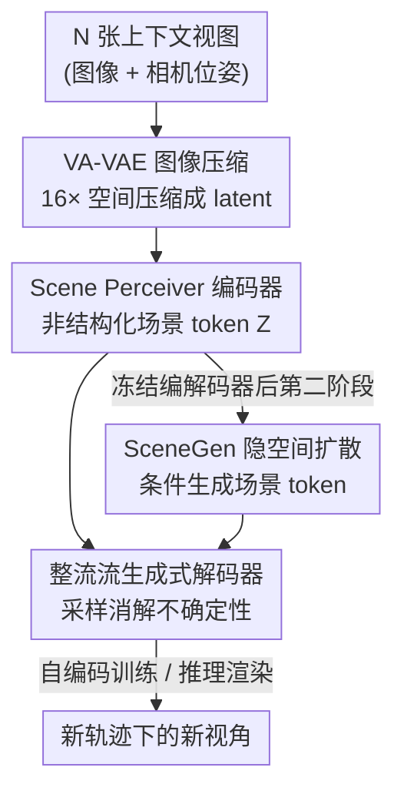

# SceneTok: A Compressed, Diffusable Token Space for 3D Scenes

**会议**: CVPR 2026  
**论文**: [CVF Open Access](https://openaccess.thecvf.com/content/CVPR2026/html/Asim_SceneTok_A_Compressed_Diffusable_Token_Space_for_3D_Scenes_CVPR_2026_paper.html)  
**代码**: geometric-rl.mpi-inf.mpg.de/scenetok/（项目页）  
**领域**: 3D视觉  
**关键词**: 场景分词器, 非结构化token, 整流流解码, 隐空间扩散, 新视角合成

## 一句话总结
SceneTok 把一组多视角图像压缩成一小撮（约 1024 个、32-bit float 仅几万）与空间网格解耦的**非结构化场景 token**，再用轻量整流流解码器从任意新轨迹采样渲染，并在这个高度压缩的隐空间上训练扩散 transformer，5 秒内完成 3D 场景生成，把渲染与生成两件事彻底解耦。

## 研究背景与动机
**领域现状**：在大规模生成模型时代如何表示 3D 场景是核心问题。主流做法分两派：一派用显式 3D 数据结构（体素、3D Gaussian、NeRF）做生成，另一派用带位姿的多视角图像 / 视频扩散模型直接在视图空间生成目标视角。

**现有痛点**：显式 3D 结构受限于 3D 数据稀缺且体素是立方级开销，训练大模型几乎不可行；视图空间的视频 / 多视角扩散虽能吃大规模视频数据，但模型巨大、需要 history-guided、自回归或 anchored 等专门采样策略来保证大场景一致性，渲染每个新视角都要跑一遍昂贵的生成，计算浪费严重。可泛化重建方法（LVSM、RayZer）虽把图像编码进与网格解耦的隐空间，但它们用 3072 个、维度 ≥512 的高维 token，根本没法在上面做扩散；而且 RayZer 把目标视图当输入，存在信息泄露，只能做视图插值、无法渲染偏离输入轨迹的真·新视角。

**核心矛盾**：表示要同时满足三个互相拉扯的要求——能从海量视频学、结构简单到方便接生成模型、压缩率高到能 scale，但现有表示要么太大不能生成（3D 结构 / 高维隐空间），要么把渲染和生成绑死导致重复计算。

**本文目标**：造一个既能高保真重建、又能从新轨迹真渲染、还小到能直接喂给扩散模型做生成的 3D 场景表示。

**切入角度**：作者借鉴图像 / 视频领域的 1D 非结构化 tokenizer 思路——既然 2D/3D patch token 缺乏自然顺序，干脆把场景编码成一组**置换不变、与空间网格解耦**的连续 token，并把"渲染"和"生成"拆成级联两阶段。

**核心 idea**：用一个 2 阶段自编码器把场景压成一小撮非结构化 token，渲染交给轻量整流流解码器（顺带用采样消解不确定性），生成交给在 token 隐空间上训练的扩散 transformer——从此扩大生成模型不影响渲染速度。

## 方法详解

### 整体框架
SceneTok 的核心是一个自编码器（图 2a）：编码器 $\phi$ 吃 $N$ 张带位姿的上下文视图 $(X_C, P_C)$，输出一组 $K$ 个连续 token $Z=\{z_i\}_{i=1}^K$ 作为场景表示；解码器 $\psi$ 拿 $Z$ 和一条新相机轨迹 $P_T$，渲染出 $M$ 张新视角 $X_T=\psi(Z,P_T)$。第二阶段（图 2b）冻结编解码器，在 token 集合 $Z$ 上训练一个扩散 transformer（SceneGen），实现以单 / 少张图像加锚点位姿为条件的场景生成。整条管线把"压缩—渲染—生成"三步拆开：渲染用轻量解码器秒级完成，生成在压缩隐空间里跑，扩大生成容量不拖慢渲染。

### 关键设计

**1. Scene Perceiver 编码器：把视图集压成置换不变的非结构化 token**

痛点是现有隐空间表示要么维度太高（LVSM/RayZer 几千个 ≥512 维 token）没法做扩散，要么带网格结构无法解耦。SceneTok 先用冻结的 VA-VAE 编码器把每张图 $x_i$ 做 16× 空间压缩成特征图 $f_i$，作为 $1\times1$ patch token 喂进 Scene Perceiver 的多视角分支；每个 block 里把相机位姿 $P_C$ 转成 ray map $r_i=[o_i,d_i]$（光线原点 + 方向），通过 AdaLN 调制对应 patch token，再做多视角注意力与 MLP。另一条分支处理一组**直接优化得到的 scene query** $Q=\{q_i\}_{i=1}^K$，每个 block 在 query 间做自注意力、再 cross-attention 到多视角分支，最后投影到低维 $d$ 得到 token $Z$。关键巧思在位置编码：视频编码器常用的 3D RoPE 会给上下文视图引入"时间顺序"偏置，破坏轨迹任意性；作者只用 **2D RoPE**，让编码器对视图顺序不变，从而保证 token 之后能从任意轨迹渲染。

**2. 整流流生成式解码器：用采样优雅地消解渲染不确定性**

场景表示天然缺信息——要么输入视图本来就没拍到，要么高频细节被压缩丢了，不同新视角的不确定性还各不相同。作者认为这里关键是把渲染建成**生成式采样**而非确定性回归：解码器 $\psi$ 从条件分布 $p_\psi(x|Z)$ 采样，对 token 清晰定义的区域从窄分布采、对高不确定区域退化到纯生成。具体用整流流（rectified flow）：推理时一个 DiT 风格的去噪器 $\Psi$ 对新轨迹的 latent image patch 迭代去噪，单步 $x_{t-\Delta t}=x_t-\Delta t\,\Psi(x_t,R,Z,t)$，以时间步 $t$、新轨迹 ray map $R$ 和场景 token $Z$ 为条件（$Z$ 通过 cross-attention 注入），去噪结果再过冻结的 VideoDCAE 解码器回到像素空间。论文实证渲染输出的方差和 token 信息量正相关——掉 token 或丢上下文视图，对应区域方差就升高，说明 token 真的在给解码器供信息。

**3. 级联两阶段范式：把渲染与生成解耦、在压缩隐空间做扩散**

视图空间扩散最大的浪费是渲染和生成绑死，重访已生成视角还要再算一遍。SceneTok 训练好自编码器后冻结编解码器，再训一个扩散 transformer SceneGen 建模 $p(Z|X_I,A)$：$X_I$ 是单 / 少张条件图，$A=\{a_i\}$ 是相机锚点（$a_i=[o_i,d_i]$，定义场景空间范围与布局），同样用整流流目标在编码好的 token 上训练。这一拆带来双赢：生成在几万 float 的压缩 token 上跑而非像素空间，效率极高；扩大生成模型容量完全不影响渲染速度。由于编码时把场景中心对齐到原点，第一张图和锚点可恒设为原点 + 单位旋转，后续位姿都相对原点给出。

### 损失函数 / 训练策略
冻结 VA-VAE 编码器与 VideoDCAE 解码器，端到端训练其余部分。整流流匹配目标是预测向量场 $v_t=\Psi(x_t,R,Z,t)$，损失为真值 flow $x_1-x_0$ 与预测 flow 的 MSE：$L(\psi)=\mathbb{E}_{t,x_1,x_0}\|(x_1-x_0)-v_t\|_2^2$，其中 $x_t=tx_1+(1-t)x_0$、$x_1\sim\mathcal{N}(0,I)$、$x_0$ 是训练集 latent 目标图像。端到端时编码器被迫提取能最大化渲染目标视图似然的 $Z$。SceneTok 在 4×A100(40G) 上训 760K 步（≈11 epoch，≈250 GPU+CPU 小时）；SceneGen 在 4×A100(80G) 上训 1M 步（≈238 小时）。

## 实验关键数据

### 主实验
在 RealEstate10K 上对比新视角合成质量（Repr. Size 指表示所用的 32-bit float 个数，越小越省）：

| 设置 | 方法 | Repr. Size | PSNR↑ | LPIPS↓ | rFVD↓ | rFID↓ |
|------|------|-----------|-------|--------|-------|-------|
| 12 上下文视图 | DepthSplat（显式） | 46.40M | 21.55 | 0.202 | 204.52 | 21.35 |
| 12 上下文视图 | LVSM（隐空间） | 1.57M | 21.25 | 0.262 | 211.66 | 26.40 |
| 12 上下文视图 | **SceneTok** | **32.76K** | **23.99** | **0.159** | **79.80** | **11.12** |
| 5 上下文视图 | LVSM | 1.57M | 25.74 | 0.140 | 111.14 | 13.37 |
| 5 上下文视图 | **SceneTok** | **32.76K** | **25.97** | 0.133 | **76.24** | **11.26** |

表示大小比显式表示小 1–3 个数量级（32.76K vs 46.4M ≈ 1400×），同时在 rFVD/rFID 上大幅领先；DepthSplat 靠深度监督拿到更高 SSIM，而 SceneTok 是自监督整流流端到端训。⚠️ DepthSplat 的 SSIM 列在 12 视图下为 0.809，本文为 0.783，此处省略未列。

**真·新轨迹可迁移性（TPS，DL3DV-140 配对场景，越高越好）**：SceneTok 在 R.Acc/T.Acc/AUC 三组阈值上全面碾压——例如 AUC@30° 达 0.593，而 LVSM 仅 0.178、RayZer 仅 0.096，证明它能跟随偏离输入轨迹的相机轨迹做真渲染而非视图插值。

**场景生成（单视图条件，200 场景）**：

| 方法 | gFID↓ | gFVD↓ | 推理(s)↓ |
|------|-------|-------|----------|
| DFM（NeRF 扩散） | 52.64 | 566.71 | 630 |
| DFoT（像素扩散） | 35.40 | 220.36 | 146 |
| SEVA（闭源大数据） | 17.69 | 133.00 | 1620 |
| **SceneGen** | 18.90 | 157.89 | **26 (11+16)** |

SceneGen 指标与大规模多视角生成模型相当，但生成快一个数量级；甚至能在单张 RTX 4090(24G) 上跑（其它三者 OOM），总耗时仅 10s（5s 生成 + 5s 渲染 192 视角）。

### 消融实验
论文主要做"理解性消融"而非传统模块消融，通过遮挡 token / 上下文视图来分析 token 编码了什么：

| 分析方式 | 操作 | 观察到的现象 |
|----------|------|--------------|
| 深度解码 | 冻结编码器，微调解码器输出深度 | token 无显式监督也内蕴几何线索，能渲合理深度图 |
| 遮挡 scene token | 随机 mask 0%→100% token | mask 越多，输出 per-pixel 方差越大（信息被移除） |
| 遮挡上下文视图 | 保留前 $n$/12 张（$n\in\{2,6,12\}$） | $n$ 越大方差越低，被 token 覆盖区域方差更低 |

### 关键发现
- token 信息量与渲染输出方差强相关：清晰区域解码器从窄分布采、不确定区域退化到纯生成，说明"生成式渲染消解不确定性"这一设计真实生效。
- 表示压缩到 32.76K float 仍能 SOTA 重建，是"能做隐空间扩散"的前提——LVSM/RayZer 的几千个高维 token 根本压不进可扩散的隐空间。
- SceneTok 在高频细节一致性上仍略逊于像素空间扩散的 DFoT 和闭源大模型 SEVA，但换来了一个数量级的速度优势。

## 亮点与洞察
- **置换不变 + 2D RoPE 是"轨迹任意渲染"的隐形钥匙**：仅仅把 3D RoPE 换成 2D RoPE 就消除了时间顺序偏置，让 token 摆脱输入轨迹束缚——一个很小却很关键的归纳偏置选择。
- **把"渲染"和"生成"解耦成可独立 scale 的两件事**：扩大生成模型不影响渲染速度，这个范式拆分思路可迁移到任何"表示—生成"耦合导致重复计算的任务。
- **用生成式解码器把"压缩丢信息"变成"采样补信息"**：不确定性不再是 bug 而是被显式建模、按区域自适应采样的特性。

## 局限与展望
- 作者承认在重建一致的高频细节上仍有局限，认为可借助更好的图像压缩器或结构化隐空间改进。
- 自监督整流流训练在 SSIM 上不及用深度监督的 DepthSplat，绝对 PSNR 在某些设置（如 DL3DV）也未全面领先显式大表示方法。
- 生成质量逊于闭源大数据训练的 SEVA，依赖的训练数据规模（RealEstate10K）和闭源大模型不在同一量级，横向比"质量"需带 caveat。
- ⚠️ token 数量 $K$、维度 $d$ 等具体超参在正文未完整给出（指向附录 A），笔记中"约 1024 个 token"为据 32.76K float / 32 维量级的推断，以原文附录为准。

## 相关工作与启发
- **vs LVSM / RayZer（隐空间重建）**: 同样与网格解耦，但它们用 3072 个 ≥512 维 token、无法做扩散，且 RayZer 把目标视图当输入造成信息泄露、只能视图插值；SceneTok 压到几万 float、可扩散、能真·新轨迹渲染。
- **vs DFM / DFoT / SEVA（视图空间生成）**: 它们在像素 / 视图空间直接扩散，渲染与生成绑死、计算浪费；SceneTok 在压缩 token 隐空间生成，解耦后快一个数量级。
- **vs 1D 图像 / 视频 tokenizer**: 把"非结构化 token 集"的思路首次搬到 3D 场景，并解决了体素立方开销带来的可扩展性瓶颈。

## 评分
- 新颖性: ⭐⭐⭐⭐⭐ 首个把 3D 场景压成可扩散、非结构化 token 集的 tokenizer，范式层面的解耦很干净。
- 实验充分度: ⭐⭐⭐⭐ 三数据集 + 可迁移性 + 生成 + 多角度分析很扎实，但缺传统模块消融，部分超参藏在附录。
- 写作质量: ⭐⭐⭐⭐ 动机与范式拆分讲得清晰，公式规范；token 数量等细节正文略简。
- 价值: ⭐⭐⭐⭐⭐ "渲染—生成解耦 + 可扩散隐空间"为 3D 生成提供了一条高效可扩展的新路线。

<!-- RELATED:START -->

## 相关论文

- [\[CVPR 2026\] Aligning Text, Images and 3D Structure Token-by-Token](aligning_text_images_and_3d_structure_token-by-token.md)
- [\[CVPR 2026\] Space-Time Forecasting of Dynamic Scenes with Motion-aware Gaussian Grouping](space-time_forecasting_of_dynamic_scenes_with_motion-aware_gaussian_grouping.md)
- [\[ECCV 2024\] Compress3D: a Compressed Latent Space for 3D Generation from a Single Image](../../ECCV2024/3d_vision/compress3d_a_compressed_latent_space_for_3d_generation_from_a_single_image.md)
- [\[CVPR 2026\] PrITTI: Primitive-based Generation of Controllable and Editable 3D Semantic Urban Scenes](pritti_primitive-based_generation_of_controllable_and_editable_3d_semantic_urban.md)
- [\[CVPR 2026\] FreeScale: Scaling 3D Scenes via Certainty-Aware Free-View Generation](freescale_scaling_3d_scenes.md)

<!-- RELATED:END -->
