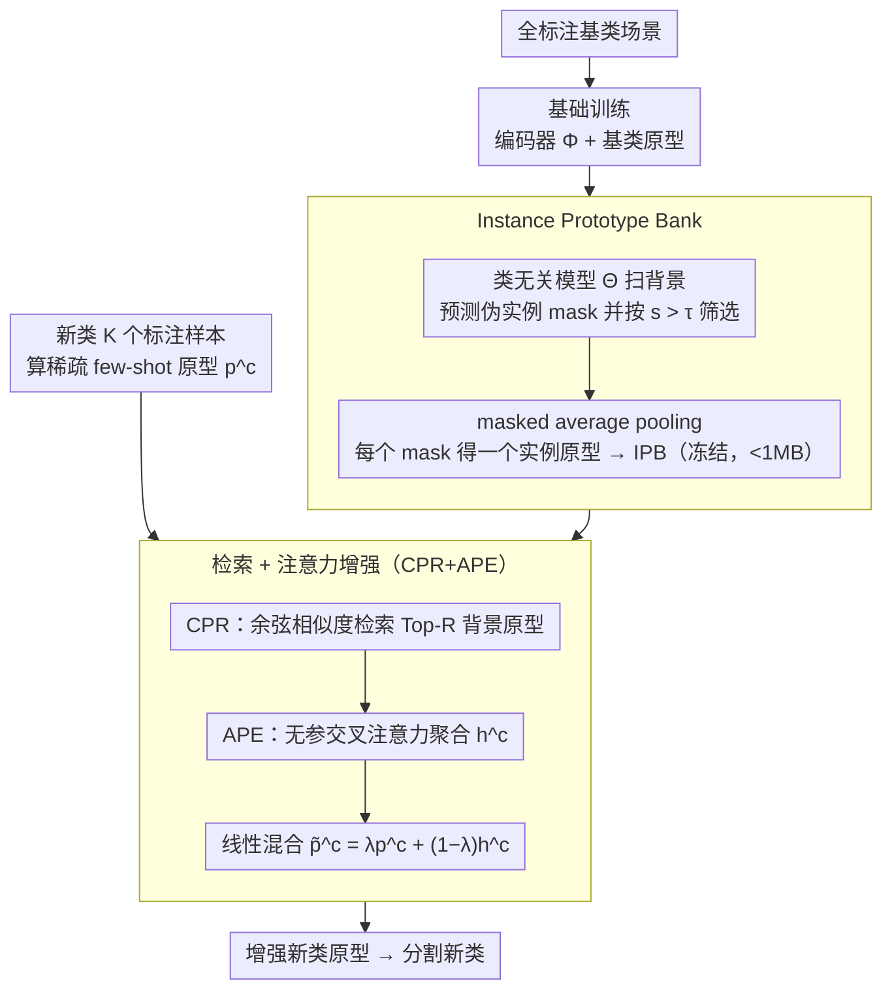

# SCOPE: Scene-Contextualized Incremental Few-Shot 3D Segmentation

**会议**: CVPR 2026  
**arXiv**: [2603.06572](https://arxiv.org/abs/2603.06572)  
**代码**: [github.com/Surrey-UP-Lab/SCOPE](https://github.com/Surrey-UP-Lab/SCOPE)  
**领域**: 3D点云分割 / 增量Few-Shot学习  
**关键词**: 3D点云分割, 增量few-shot, 背景挖掘, 原型增强, 即插即用

## 一句话总结
提出即插即用的SCOPE框架，利用类无关分割模型从基础训练场景的背景区域挖掘伪实例原型，通过检索+注意力融合增强few-shot新类原型，无需重训backbone即可在ScanNet上将新类IoU提升6.98%。

## 研究背景与动机
**领域现状**：全监督3D点云分割需要大量逐点标注且标签空间固定，而实际部署中新类别会不断涌现且仅有少量标注可用。现有范式（few-shot/class-incremental/generalized few-shot）各只解决部分挑战。

**现有痛点**：(1) Few-shot方法无法保持已学知识；(2) Class-incremental方法需要充足监督，稀疏标注下性能急剧下降；(3) Generalized few-shot方法只支持一次性更新；(4) 直接将2D增量few-shot方法应用到3D效果不佳——要么遗忘严重，要么原型不够判别。

**核心矛盾**：在极度有限的标注下，如何学到足够判别的新类原型，同时不遗忘已学知识？

**本文目标** 3D点云的增量few-shot分割（IFS-PCS）：支持多阶段顺序学习新类别，每次仅需K个标注样本。

**切入角度**：发现基础训练场景的"背景区域"中隐藏着新类的物体结构——这些被粗暴归为"背景"的区域实际包含可迁移的物体级语义信息。

**核心 idea**：用类无关分割模型从背景挖掘伪实例构建原型库，再通过注意力机制选择性融合到稀疏的few-shot原型中。

## 方法详解

### 整体框架
SCOPE要解决的是增量few-shot 3D点云分割：模型先在全标注的基类上训好，之后每个阶段只拿到新类别的极少量（K个）标注样本，既要学会新类、又不能忘掉旧类。难点在于K太小，直接拿这几个样本算出来的新类原型既稀疏又不判别。SCOPE的核心赌注是：基础训练时那些被一股脑归为"背景"的区域里，其实藏着大量未来新类的物体结构，可以提前挖出来当作可迁移线索。

整个流程分三段走。基础训练阶段照常用全标注数据训练编码器Φ和基类原型；场景上下文化阶段，用一个现成的类无关分割模型Θ（Segment3D）扫一遍训练场景的背景区域，把挖出来的伪实例存成一个原型库（IPB）；增量注册阶段，每来一个新类就拿它稀疏的few-shot原型去IPB里检索相关背景原型，用注意力融合成一个增强原型——全程不碰backbone、不加任何可学习参数。

### 关键设计

**1. Instance Prototype Bank：把"背景"从噪声变成可迁移的物体原型库**

新类到来之前，模型对它一无所知，没法预先建类别原型。但作者观察到，基类场景里被标成"背景"的点云，物理上往往是桌子、柜子、杂物这些有完整物体结构的东西——它们只是不属于当前基类的标签空间，并非真的"没有内容"。SCOPE让类无关模型Θ对每个场景$i$预测一批伪实例mask及其置信度 $\{(\hat{M}_{i,j}, s_{i,j})\}$，只保留落在背景区域、且置信度 $s_{i,j} > \tau$ 的那些，再用编码器特征对每个mask做masked average pooling得到一个实例原型：

$$\mu_{i,j} = \mathcal{F}_{\text{Pool}}(F_i, \hat{M}_{i,j})$$

所有场景的这类原型汇成IPB。它只在离线阶段构建一次、之后冻结，存储不到1MB，增量时不增加任何训练开销；Θ本身也是用完即弃的off-the-shelf工具，不进推理链路。

**2. 检索 + 注意力增强（CPR+APE）：从原型库里挑出对新类有用的那几个，自适应融进去**

光有一个大原型库还不够——背景里五花八门，绝大多数原型和当前新类毫无关系，硬拼进去只会引入噪声。CPR（Contextual Prototype Retrieval）先做粗筛：对新类$c$的few-shot原型$p^c$，和IPB里每个原型算余弦相似度$\sigma^c_b$，取最相关的Top-R个 $\mathcal{B}^c = \text{TopR}(\sigma^c_b)$。APE（Attention-Based Enrichment）再做精融：用一个无参数的交叉注意力，让few-shot原型当query、检索到的原型当key/value，按相关度加权聚合出补充向量$h^c$，最后和原始原型线性混合：

$$\tilde{p}^c = \lambda p^c + (1-\lambda)h^c, \qquad h^c = \sum_r \text{CrossAttn}(\bar{p}^c, \bar{\mathcal{B}}^c)_r\, \bar{\mu}^c_r$$

注意力的好处是自适应——它会自动压低不相关或噪声原型的权重、放大真正可迁移的结构线索；而整个CPR+APE没有一个可学习参数，正好契合"样本极少、一训就过拟合"的few-shot场景。消融显示，仅CPR（均值聚合）就把新类IoU从16.88抬到22.12，再加APE的注意力滤波又涨到23.86。

### 一个完整示例：注册一个新类"chair"
假设增量阶段来了新类 chair，只给5个标注样本（K=5）。先对这5个样本算出一个稀疏的few-shot原型$p^{\text{chair}}$——因为样本太少，这个原型很容易偏。CPR拿它去已冻结的IPB里检索：库里有成千上万个从背景挖出的实例原型，按余弦相似度排序后取Top-R（R=50）个，这50个里大多是和椅子语义相近的"可坐物体/带腿家具"结构。APE接着把$p^{\text{chair}}$当query、这50个当key/value做交叉注意力，那些真正像椅子的原型拿到高权重、混进来的杂物拿到低权重，聚合出$h^{\text{chair}}$，再按$\lambda=0.5$与原始原型对半混合得到$\tilde{p}^{\text{chair}}$。整个过程backbone一动不动、不反传梯度，多花的时间约0.02s——但 chair 这类新类的原型从"5样本拍出来的毛坯"变成了"借了50个背景结构补强的成品"。

### 损失函数 / 训练策略
基础阶段使用标准交叉熵损失训练编码器和基类原型。增量阶段完全无需训练——backbone冻结，检索与注意力融合都是解析式操作，没有梯度回传。核心超参数：τ=0.75（mask置信度阈值），R=50（检索数量），λ=0.5（融合权重）。

## 实验关键数据

### 主实验

| 数据集/设定 | 方法 | mIoU | mIoU-N (新类) | HM | FPP↓ |
|-------------|------|------|---------------|-----|------|
| ScanNet K=5 | GW (ICCV23) | 34.27 | 16.88 | 23.94 | 1.49 |
| ScanNet K=5 | CAPL (CVPR22) | 31.73 | 14.75 | 21.36 | -0.65 |
| ScanNet K=5 | **SCOPE** | **36.52** | **23.86** | **30.38** | 1.27 |
| ScanNet K=1 | GW | 33.53 | 14.11 | 20.99 | 1.36 |
| ScanNet K=1 | **SCOPE** | **34.78** | **18.09** | **25.12** | 1.27 |
| S3DIS K=5 | GW | 57.71 | 39.42 | 51.29 | - |
| S3DIS K=5 | **SCOPE** | **59.41** | **43.03** | **54.25** | - |

### 消融实验

| 配置 | mIoU-N | 说明 |
|------|--------|------|
| GW baseline | 16.88 | 无背景增强 |
| +CPR（均值聚合） | 22.12 | 仅检索的增益+5.24 |
| +CPR+APE（完整SCOPE） | 23.86 | 注意力再增+1.74 |
| GT mask（上界） | 24.77 | 与伪mask差距仅0.91 |
| 应用到PIFS | 3.43→4.93 | 即插即用有效 |
| 应用到CAPL | 14.75→18.70 | 即插即用有效 |

### 关键发现
- 6阶段长期可扩展性：SCOPE mIoU-N 19.75 vs GW 15.64，遗忘更少
- 运行时开销可忽略：增量阶段仅多0.02s（18.60s vs 18.58s），存储<1MB
- GT mask与伪mask差距极小——APE的注意力滤波有效消除了伪标签噪声

## 亮点与洞察
- "背景蕴含未来类信息"这一insight新颖且有力——背景不是噪声，而是宝藏
- 完全即插即用、无参数、无需微调，可应用到任何基于原型的3D分割方法
- 注意力机制使框架对伪mask噪声高度鲁棒（伪mask vs GT mask仅差0.91 IoU）
- 零额外运行时开销（<1MB内存, 0.02s新增时间）使其适合真实世界部署

## 局限与展望
- 依赖类无关分割模型质量，目前仅验证了Segment3D一种选择
- 仅在室内数据集（ScanNet/S3DIS）验证，室外场景（自动驾驶等）效果未知
- λ=0.5固定权重可能不适合所有场景，可考虑自适应权重学习
- 未探索更高级的原型聚合方式（如图注意力网络）

## 相关工作与启发
- **vs GW (ICCV23)**: 几何词汇原型学习，ScanNet K=5 mIoU-N 16.88 vs SCOPE 23.86（+41.3%相对提升）。SCOPE无需geometric word等额外设计
- **vs HIPO (CVPR25)**: 双曲原型嵌入，但mIoU-N仅7.44，远落后于GFS基线。SCOPE思路更直接有效
- **vs CAPL (CVPR22)**: 共现先验原型学习。SCOPE作为插件应用到CAPL可将其mIoU-N从14.75提升到18.70
- "从背景挖掘future class信息"的范式可推广到2D few-shot分割和开放世界检测

## 评分
- 新颖性: ⭐⭐⭐⭐⭐ 背景挖掘思路新颖、insight有力、无参设计优雅
- 实验充分度: ⭐⭐⭐⭐ 两个数据集、即插即用验证、GT vs pseudo对比、长期可扩展性
- 写作质量: ⭐⭐⭐⭐ 问题定义清晰，方法描述系统完整
- 价值: ⭐⭐⭐⭐⭐ 对few-shot 3D分割有范式性贡献，即插即用设计实用性强

<!-- RELATED:START -->

## 相关论文

- [\[CVPR 2026\] Few-Shot Incremental 3D Object Detection in Dynamic Indoor Environments](few-shot_incremental_3d_object_detection_in_dynamic_indoor_environments.md)
- [\[CVPR 2026\] EmoTaG: Emotion-Aware Talking Head Synthesis on Gaussian Splatting with Few-Shot Personalization](emotag_emotion-aware_talking_head_synthesis_on_gaussian_splatting_with_few-shot_.md)
- [\[CVPR 2026\] Long-SCOPE: Fully Sparse Long-Range Cooperative 3D Perception](long_scope_fully_sparse_long_range_cooperative_3d_perception.md)
- [\[CVPR 2026\] MSGNav: Unleashing the Power of Multi-modal 3D Scene Graph for Zero-Shot Embodied Navigation](msgnav_unleashing_the_power_of_multi-modal_3d_scene_graph_for_zero-shot_embodied.md)
- [\[CVPR 2026\] Action-guided Generation of 3D Functionality Segmentation Data](action-guided_generation_of_3d_functionality_segmentation_data.md)

<!-- RELATED:END -->
