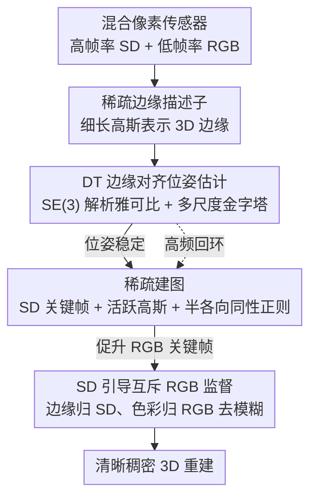

# SDGS: Spatial Difference Guided Gaussian Splatting for Simultaneous Localization and 3D Reconstruction

**会议**: CVPR 2026  
**论文**: [CVF Open Access](https://openaccess.thecvf.com/content/CVPR2026/html/Tian_SDGS_Spatial_Difference_Guided_Gaussian_Splatting_for_Simultaneous_Localization_and_CVPR_2026_paper.html)  
**代码**: 待确认  
**领域**: 3D视觉  
**关键词**: 高斯泼溅SLAM, 稀疏边缘描述子, 距离变换位姿估计, 混合像素传感器, 运动去模糊

## 一句话总结
SDGS 用稀疏边缘（spatial difference）作为描述子、把它表示成细长的 3D 高斯椭球，通过"渲染边缘 ↔ 输入边缘"的距离变换对齐来在线估计 6-DoF 位姿，再借助混合像素传感器的高帧率差分信号做互斥监督去模糊，最终在极端高速运动（传统 RGB 方法全失败）下仍能稳健跟踪并重建清晰稠密场景。

## 研究背景与动机
**领域现状**：3D Gaussian Splatting（3DGS）以显式表示实现了照片级、实时 3D 重建。但原始 3DGS 离线运行，依赖 SfM 预先算好相机位姿，引入了"感知—重建"之间的延迟。近来一批工作把 3DGS 改造成无位姿先验的在线 GS-SLAM。

**现有痛点**：在线 GS-SLAM 分两类、各有硬伤——（1）传统 SLAM 模块（ORB-SLAM / ICP）+ 3DGS 的混合框架，要额外引入 Gaussian 之外的描述子，导致 tracking 和 mapping 优化目标错位、高斯与跟踪解耦，削弱位姿—高斯联合优化、限制重建保真；（2）纯 3DGS 系统在稠密像素上最小化光度损失、用海量高斯点反传位姿，计算和显存开销巨大、拖垮实时性。更根本的是：离线管线靠精挑的高质量图，在线系统却控制不了输入流质量，必须扛运动模糊、光照变化等非理想因素。

**核心矛盾**：在线场景里"鲁棒跟踪 / 表示效率 / 高保真外观"三者难以兼得——稠密光度跟踪贵且对模糊敏感，稀疏方法又难恢复高保真 RGB。这本质上源于传统成像机制和稠密描述子的固有局限。

**本文目标**：造一个在线 3DGS 系统，能在线、无位姿先验地同时做 6-DoF 定位和稠密重建，并且在高速运动 / 运动模糊下依然稳。

**切入角度**：作者注意到新型**混合像素传感器**（如 Tianmouc）能在一颗传感器里同时给出低帧率 RGB（纹理/亮度）和高帧率、稀疏的差分信号（几何特征），且两者精确同步对齐。边缘信息正适合被细长高斯椭球近似、且比点描述子提供更强结构线索。

**核心 idea**：用稀疏边缘（spatial difference）当核心描述子、表示成细长高斯，"先勾轮廓再上色"（sketch-then-paint）——先用边缘 + 距离变换做敏捷鲁棒的跟踪与稀疏建图，位姿稳定后再促升关键帧做稠密 RGB 重建。

## 方法详解

### 整体框架
SDGS 遵循"先勾线、后上色"两阶段范式（图 2）。前端 tracking 进程对每帧用高帧率 SD 输入维护一张稀疏高斯地图，通过边缘对齐估位姿；后端 mapping 进程在滑窗内异步联合优化 SD 高斯（高频更新）和 RGB 高斯（低频更新）。具体地：先从混合像素传感器差分通道（或 RGB 的一阶差分）得到稀疏边缘描述子 $I_\text{SD}$，用细长高斯表示这些 3D 边缘；跟踪时把渲染的 SD 边缘与观测边缘的距离变换（DT）对齐、在 $SE(3)$ 上用解析雅可比优化位姿；位姿稳定后促升 RGB 关键帧，用 DT 做频率感知的高斯初始化，并用 SD 引导的**互斥监督**抑制运动模糊，重建清晰稠密场景。

### 关键设计

**1. 稀疏边缘描述子 + 细长高斯表示：用边缘几何换稠密像素的昂贵**

针对纯 3DGS-SLAM 在稠密像素上算光度跟踪太贵、又对模糊敏感的痛点，作者用一阶 **spatial difference**（SD）当描述子：$\widehat{SD}(\mathbf{x})=I(\mathbf{x})-I(\mathbf{x}+\mathbf{s})$，对幅值阈值化得到二值稀疏边缘图 $I_\text{SD}(\mathbf{x})=\mathbf{1}\{|\widehat{SD}(\mathbf{x})|>\tau\}$。它既能从 RGB 一阶差分得到、也能直接读混合像素传感器的差分通道，对高速 / 高动态范围场景天然鲁棒。再把这些 3D 边缘用**故意拉长的各向异性高斯**表示——其 2D 投影 $\Sigma_I$ 自然贴合并覆盖局部边缘结构。由于这些高斯只提供几何支撑，其球谐 SH 系数**固定不优化**，线性化误差靠致密化约束尺度来控制。相比点描述子，细长高斯给出更强的结构线索，也大幅压低表示边缘所需的资源。

**2. 距离变换边缘对齐的位姿估计：把稀疏边缘变成连续势场来求位姿**

直接用稀疏边缘做对应匹配很难收敛。作者引入**距离变换**（DT）：$DT(\mathbf{x})=\min_{\mathbf{v}\in S} d(\mathbf{x},\mathbf{v})$，把稀疏边缘集变成连续"势场"，从而无需显式对应、靠最小化渲染像素处的 DT 值把预测拉到观测边缘上。跟踪损失为 $\mathcal{L}_\text{tracking}=\|\,I(\mathcal{G}_\text{SD},T_{CW})\odot DT(I_\text{SD})\,\|_1$——每个渲染出的正响应按其到最近观测边缘的欧氏距离受罚。位姿在 $SE(3)$ 上用**解析雅可比**经指数映射更新（投影中心和协方差对 $T_{CW}$ 的流形导数见原文式 8），用 Adam 在稀疏边缘上稳定优化。这种 DT 形式相比直接光度优化对"未重建区域"更鲁棒，是它在高速运动下不崩的关键。还配了**多尺度图像金字塔**（coarse-to-fine 扩大收敛盆地）和**可见性 / 共视性过滤**（剔除从其它视角重建、当前视角被遮挡的高斯），并在立体混合像素配置下用沿极线的金字塔 LK 搜索得到亚像素视差转深度。论文称该 DT 对齐使每次迭代位姿优化比现有方法快约 2×。

**3. 稀疏建图：用活跃高斯和半各向同性正则维持一张干净稀疏地图**

在线建图要解决两个矛盾：SD 输入看不穿遮挡区域、简单的非边缘 mask 又会留大片无监督区导致几何退化。作者用滑窗策略管理 SD 关键帧（平移超阈值或可见高斯 IoU 过低时新增关键帧）；插入新高斯时只对**已重建地图未覆盖**的边缘区域采样、主轴沿切线方向初始化；并把滑窗内所有可见高斯标记为**活跃高斯** $\mathcal{G}_A$，只有它们参与建图——配合定期 opacity reset，从未被标活跃的高斯得不到监督、被当零贡献剪掉，从而保持稀疏。为防止高斯沿视线方向退化成病态细长，引入**半各向同性正则** $\mathcal{L}_\text{semi-iso}$：只强制三个尺度轴里最接近的一对相等（取 $\min$ 三个两两差值），既保留一个自由轴建模边缘方向、又排列不变。稀疏建图总损失 $\mathcal{L}=\lambda_\text{sd}\mathcal{L}_\text{sd}+\lambda_\text{si}\mathcal{L}_\text{semi-iso}$，其中 $\mathcal{L}_\text{sd}=\|I(\mathcal{G}_A,T_{CW})-I_\text{SD}\|_1$。

**4. SD 引导的互斥 RGB 监督：用差分信号把模糊 RGB 重建成清晰边缘**

位姿稳定后促升 RGB 关键帧做稠密重建，但 RGB 流本身有运动 / 散焦模糊。作者用硬件 SD 当先验做**互斥监督**：把像素按 SD gate $M_\text{SD}=\mathbf{1}\{|\widehat{SD}|\ge\tau\}$ 分成两组互斥监督——强梯度区由 SD 约束（保证锐利结构），其互补区 $M_\text{RGB}=1-M_\text{SD}$ 由 RGB 光度一致性约束（传播色彩），消除"锐利梯度 vs 模糊 RGB 观测"之间的监督歧义。RGB 侧的 SD 渲染在 chessboard 采样网格上算 $SD_\text{render}(\mathbf{u})=\mathcal{C}(Y_d)(\mathbf{u})-\mathcal{C}(Y_d)(\mathbf{u}+\mathbf{s})$，损失 $\mathcal{L}_\text{sd}^\text{rgb}=\|(\mathcal{Q}_{b,\theta}(k\cdot SD_\text{render})-\widehat{SD})\odot M_\text{SD}\|_1$，其中 $\mathcal{Q}_{b,\theta}$ 是带 ADC 位深 $b$ 和死区阈值 $\theta$ 的硬件一致量化器（反传用 STE）、$k$ 对齐不同混合像素的尺度。这样锐结构靠 SD 约束、色彩从邻近 RGB 监督区传播，从模糊输入里恢复出更锐的边缘。作者也坦言：互斥性主要锐化边缘，低纹理非边缘区只由 RGB 光度监督，模糊可能残留。

### 损失函数 / 训练策略
系统把 tracking 和 mapping 拆成两个异步子进程：tracking 估每帧位姿（前端，高帧率维护 SD 地图）；mapping 在滑窗内联合优化 SD 与 RGB 高斯（后端，SD 高频、RGB 低频）。稀疏建图目标 $\mathcal{L}=\lambda_\text{sd}\mathcal{L}_\text{sd}+\lambda_\text{si}\mathcal{L}_\text{semi-iso}$；稠密 RGB 建图目标 $\mathcal{L}=\lambda_\text{sd}^\text{rgb}\mathcal{L}_\text{sd}^\text{rgb}+\lambda_\text{rgb}\mathcal{L}_\text{rgb}$。位姿优化默认 Adam，论文另报告了二阶 Gauss–Newton/LM 作为实验性替代。

## 实验关键数据

### 主实验
**stereo-Tianmouc 跟踪精度（RMSE ATE [cm]，越低越好；fail = 跟丢）**：

| 方法 | 输入 | slow | fast | extreme | Average |
|------|------|------|------|---------|---------|
| MonoGS–RGBD | RGB | 3.32 | 24.52 | fail | — |
| WildGS-SLAM* | RGB | 2.01 | 8.21 | 8.62 | 6.28 |
| SEGS-SLAM* | RGB | 6.69 | 19.30 | 19.06 | 15.02 |
| SEGS-SLAM* | SD | 3.30 | 4.64 | 15.37 | 7.77 |
| **Ours** | SD | 4.21 | 5.89 | **3.91** | **4.67** |

低速时与基线相当，**高速 / 极端运动下唯一不崩**——extreme 列只有 SDGS 给出 3.91cm，其余 RGB 方法几乎全 fail，多数 RGB 基线在极端运动下因模糊和误差累积失效。

**TUM RGB-D 泛化（用 RGB 一阶差分抽边缘，RMSE ATE [cm]）**：

| 方法 | fr1/desk | fr2/xyz | fr3/office | Average |
|------|----------|---------|-----------|---------|
| MonoGS–RGBD | 1.45 | 1.23 | 1.75 | 1.48 |
| **Ours** | 1.64 | 0.54 | 4.15 | 2.11 |

在标准 RGB 系统上精度略低于稠密基线，但换来效率大幅提升，证明方法可泛化到普通 RGB 相机。

**去模糊（SD-Replica room0，10k 步后精修）**：SDGS 在 PSNR/SSIM/LPIPS 全面优于 MonoGS-RGBD（24.11/0.737/0.379 vs 22.51/0.702/0.394）；单视图去模糊后 PSNR 从模糊输入 27.78 提升到 31.15。

### 消融实验
TUM-RGBD 上消融图像金字塔（Pyr.）与半各向同性损失（Semi-iso），RMSE ATE [cm]：

| 配置 | fr1/desk | fr2/xyz | fr3/office | Average |
|------|----------|---------|-----------|---------|
| w/o Pyr., w/o Semi-iso | 5.04 | 0.97 | 7.40 | 4.47 |
| w/ Pyr., w/o Semi-iso | 3.29 | 1.01 | 3.00 | 2.43 |
| w/o Pyr., w/ Semi-iso | 2.90 | 0.54 | 7.09 | 3.51 |
| **w/ Pyr., w/ Semi-iso** | 1.64 | 0.54 | 4.15 | **2.11** |

### 关键发现
- **金字塔贡献最大**：在 fr3/office 这种长序列上，加金字塔把误差从 7.40→3.00cm，显著扩大收敛盆地。
- **半各向同性损失对锐边缘场景有效但非万能**：fr1/desk、fr2/xyz 这类有清晰边缘的场景受益，但在 fr3/office 这种常出现光滑球面物体的场景反而略降精度（光滑物体产生空间中的伪边缘）。
- **稀疏到极致**：每次跟踪迭代仅用约 2k 高斯（MonoGS 约 9–12k、SplaTAM 高达 2690k），且 SD 高斯几乎不重叠，使减点直接转化为提速，达到对比方法中最高帧率（fr2/xyz 总 FPS 4.29）。
- 用 LM 二阶优化器时可在 fr2/xyz 跑到 8.61 总 FPS、ATE 1.13cm，但需后端更快优化高斯才能保精度。

### 性能与效率
在 TUM-RGBD 上 SDGS 每帧跟踪只需 ∼2k 高斯、每迭代 ∼3.1ms，总 FPS 全面领先（如 fr2/xyz 4.29 vs MonoGS 2.40 vs SplaTAM 0.07），跟踪精度仍有竞争力。

## 亮点与洞察
- **"先勾线后上色"两阶段范式很贴硬件**：粗建图用稀疏边缘做敏捷跟踪、细建图用 RGB 上色，恰好对上混合像素传感器"差分快通道 + RGB 慢通道"的互补设计，软硬协同自洽。
- **DT 把稀疏边缘变连续势场**是让稀疏描述子能稳定做位姿优化的关键——稀疏点本来难做对应，DT 一来就有了可微的对齐目标，且对未重建区比光度法鲁棒。
- **互斥监督**这一招把"用谁监督哪个像素"显式拆开（边缘归 SD、色彩归 RGB），干净地消除了模糊 RGB 与锐利梯度之间的监督歧义，可迁移到任何有辅助锐利信号的去模糊重建任务。
- 细长高斯 + 固定 SH、只做几何支撑，这种"几何与外观解耦"的高斯用法是个轻量又好用的 trick。

## 局限与展望
- 作者承认互斥监督主要锐化边缘，**低纹理非边缘区**只由 RGB 光度监督，模糊可能残留。
- 半各向同性损失在含大量光滑球面物体的场景会产生空间伪边缘、反而略降精度，说明该正则有场景依赖性。
- 在标准 RGB（TUM）上精度略低于稠密基线 MonoGS，方法的精度优势主要体现在高速 / 模糊这一特定 regime。
- 强依赖混合像素传感器（Tianmouc）才能发挥全部优势，立体配置还需精确标定同步；细长高斯的线性化误差仅靠致密化约束，作者也提到值得探索更好的缓解方案。
- ⚠️ 论文未提供代码链接，部分损失权重、阈值 $\tau$ 等超参未在正文完整给出，复现细节以原文为准。

## 相关工作与启发
- **vs MonoGS / SplaTAM / Gaussian-SLAM（纯 3DGS-SLAM）**: 它们在稠密像素上做光度跟踪、用大量高斯反传位姿，开销大且对模糊敏感、高速下崩；SDGS 用 ∼2k 稀疏边缘高斯 + DT 对齐，极端运动下唯一稳健。
- **vs ORB-SLAM+3DGS / ICP-SLAM 混合框架（SEGS-SLAM 等）**: 它们引入 Gaussian 之外的描述子、tracking 与 mapping 目标错位、高斯与跟踪解耦；SDGS 直接用高斯本身（细长边缘高斯）做跟踪，目标统一。
- **vs 事件相机 GS-SLAM**: 单事件相机方法只监督亮度、难恢复高保真 RGB；event+RGB-D 融合法跨模态成本高、对标定同步敏感；SDGS 借混合像素传感器同步互补信号，兼顾鲁棒跟踪与高保真外观。

## 评分
- 新颖性: ⭐⭐⭐⭐ 把稀疏 SD 边缘 + 细长高斯 + DT 对齐 + 混合像素传感器串成一套自洽在线 SLAM，软硬协同思路新颖。
- 实验充分度: ⭐⭐⭐⭐ 合成 + 自录 + TUM 三数据集，覆盖跟踪 / 去模糊 / 效率 / 消融，但去模糊主实验场景偏少。
- 写作质量: ⭐⭐⭐⭐ 公式与 pipeline 讲解清晰，"先勾线后上色"比喻到位；部分超参与代码缺失。
- 价值: ⭐⭐⭐⭐ 为高速 / 模糊等非理想条件下的在线 GS-SLAM 提供了稀疏高效且鲁棒的新路线。

<!-- RELATED:START -->

## 相关论文

- [\[CVPR 2026\] Prune Wisely, Reconstruct Sharply: Compact 3D Gaussian Splatting via Adaptive Pruning and Difference-of-Gaussian Primitives](prune_wisely_reconstruct_sharply_compact_3d_gaussian_splatting_via_adaptive_prun.md)
- [\[CVPR 2026\] P2GS: Physical Prior-guided Gaussian Splatting for Photometrically Consistent Urban Reconstruction](p2gs_physical_prior-guided_gaussian_splatting_for_photometrically_consistent_urb.md)
- [\[CVPR 2026\] ULF-Loc: Unbiased Landmark Feature for Robust Visual Localization with 3D Gaussian Splatting](ulf-loc_unbiased_landmark_feature_for_robust_visual_localization_with_3d_gaussia.md)
- [\[CVPR 2026\] LangRef3DGS: Natural Language-Guided 3D Referential Segmentation from Partial Observations via 3D Gaussian Splatting](langref3dgs_natural_language-guided_3d_referential_segmentation_from_partial_obs.md)
- [\[CVPR 2026\] Towards Visual Query Localization in the 3D World](towards_visual_query_localization_in_the_3d_world.md)

<!-- RELATED:END -->
