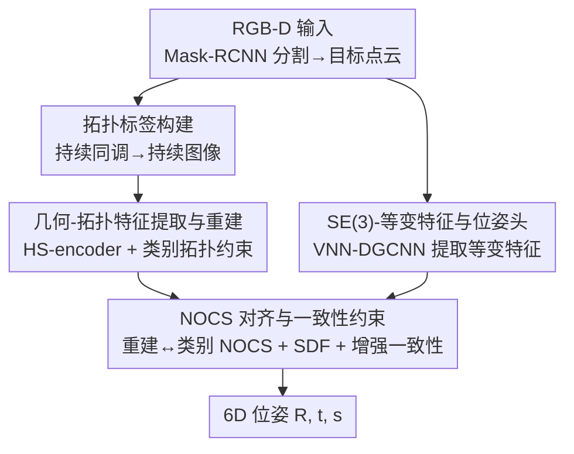

# SE(3)-Equivariance with Geometric and Topological Guidance for Category-Level Object Pose Estimation

**会议**: CVPR 2026  
**论文**: [CVF Open Access](https://openaccess.thecvf.com/content/CVPR2026/html/Yu_SE3-Equivariance_with_Geometric_and_Topological_Guidance_for_Category-Level_Object_Pose_CVPR_2026_paper.html)  
**代码**: 未提及  
**领域**: 3D视觉  
**关键词**: 类别级位姿估计, SE(3)-等变, 持续同调, 点云重建, 机器人抓取

## 一句话总结
SEGPose 是一个纯深度（点云）输入的类别级 6D 物体位姿估计方法，首次把点云的几何特征、拓扑特征和 SE(3)-等变性三者同时引入位姿估计：用持续同调生成拓扑标签引导点云重建，再用向量神经元网络提取 SE(3)-等变特征引导位姿预测头，在 REAL275 / CAMERA25 上超过所有基于深度的同类方法，并逼近大多数 RGB-D 方法。

## 研究背景与动机
**领域现状**：类别级 6D 位姿估计（预测旋转 $R\in SO(3)$、平移 $t\in\mathbb{R}^3$、尺寸 $s\in\mathbb{R}^3$）不依赖物体 CAD 模型，能泛化到同类未见物体，是机器人抓取、自动驾驶、AR 的关键能力。当前主流方法（如 SGPA、CatFormer、AG-Pose、SpotPose）大量依赖 RGB 与点云特征的融合。

**现有痛点**：一方面，RGB 纹理在暗光/低光环境下会模糊，使依赖 RGB-D 融合的方法失效；纯深度方法（SAR-Net、GPV-Pose、HS-Pose 等）虽不受光照影响，但**几乎只用几何特征**，忽略了点云里同样存在的拓扑/图结构信息——同一类别的物体往往共享相似的拓扑结构，对重建和位姿都有帮助。另一方面，机器人抓取等场景中物体在动、相机视角在变，点云随之变化，位姿也应随之同步变换（即 SE(3)-等变：输入点云任意 3D 旋转/平移，输出位姿做相同变换），但绝大多数方法没利用这一性质。

**核心矛盾**：纯深度方法为了简单只盯着几何特征，丢掉了「拓扑结构」和「SE(3)-等变」这两类天然存在、却能显著提升鲁棒性的信息；少数用了拓扑的方法（如 TG-Pose）又完全忽略 SE(3)-等变。两类信息从未被同时建模。

**本文目标**：在仅用深度（RGB 只用于分割）的前提下，同时利用几何、拓扑与 SE(3)-等变三种信息，提升类别级位姿估计的精度与跨视角鲁棒性。

**切入角度**：拓扑信息缺少可监督的标签——作者用持续同调（persistent homology）把点云的拓扑结构编码成持续图，再转成可微的持续图像（persistence image）当标签；SE(3)-等变则借向量神经元网络（VNN）这种天生等变的骨干来获取。

**核心 idea**：用「拓扑标签引导重建 + SE(3)-等变特征引导位姿头」替代「只靠几何特征回归位姿」，让重建既几何准又拓扑对、让位姿随视角同步变换。

## 方法详解

### 整体框架
SEGPose 是一个纯点云输入的类别级位姿估计流水线：先用 Mask-RCNN 在 RGB-D 上分割出目标 mask，裁剪深度图得到目标物体点云 $P_o\in\mathbb{R}^{N_o\times3}$；随后用 HS-encoder 提取几何特征并在拓扑标签监督下预测拓扑特征，二者共同引导点云的 3D 重建；并行地，SE(3)-等变编码模块（VNN-DGCNN）提取等变特征，输入到一个 SE(3)-等变引导的位姿估计头预测 $R,t,s$；最后把重建点云用预测位姿变换到 NOCS 空间，与类别 NOCS 点云对齐做精修。

### 关键设计

**1. 拓扑标签构建：给「点云拓扑」造一个可微分的监督信号**

几何特征可以用物体模型/NOCS 点云约束，但拓扑信息没有现成标签可监督，直接预测又容易模型坍塌。作者用持续同调把点云结构编码成持续图：先用 alpha complex 构造点云的 1D、2D 拓扑特征，得到生灭坐标 $D_1,D_2$，再做线性变换 $T(x,y)=(x,y-x)$ 转成「生-持续」坐标。为了让离散的生灭点能并入网络训练，套用持续图像（persistence image）的做法：对每个点施加正则高斯核 $N(p\mid\bar p,\sigma^2)=\frac{1}{2\pi\sigma^2}e^{-\frac{(x-\bar x)^2+(y-\bar y)^2}{2\sigma^2}}$ 把离散点变成连续分布，并用权重 $w=\frac{y-x}{t}$（$t$ 为持续图中最大持续值）突出长持续的关键结构，得到持续曲面 $S_{D^*}(p)=\sum_{\bar p}w(\bar p)N(p\mid\bar p,\sigma^2)$；最后把曲面切成 $M\times M$ 个 patch，对每块做二重积分 $V(S_{D^*})_n=\iint_{S_n}D^*(x,y)\,dy\,dx$ 得到有限维向量，拼成持续图像 $I_1,I_2$ 作为拓扑标签。这一步的价值在于：它把「形状的拓扑」量化成了一张可微的图像标签，让网络能像学几何一样学拓扑。⚠️ 公式细节以原文为准。

**2. 几何-拓扑特征提取与重建：用拓扑约束 + 类别拓扑约束守住重建质量**

只靠几何重建的点云可能形状对、结构错。SEGPose 用 HS-encoder 抽出点云特征 $F$，再经基于 Transformer 的图模块分析点间关系得到拓扑特征 $F_{topo}$，配合自适应最大池化和 MLP 预测出 1D/2D 持续图像。这里加了**两重拓扑约束**：其一，预测的持续图像要与设计 1 得到的点云拓扑标签对齐（用 MAE：$L_{pt}=L_{pt1}(I_1,\hat I_1)+L_{pt2}(I_2,\hat I_2)$）；但单视角点云有噪声、标签本身可能不准，于是引入**类别拓扑约束**——同类物体共享相似形状/拓扑，用 $L_{ct}=\alpha_1 L_{ct1}+\alpha_2 L_{ct2}$ 把预测拉向类别级结构，且平衡因子 $\alpha=e^{-2L_{pt*}}$ 让点云约束越准时类别约束越弱，避免被异常点带偏。最终用 $I_1,I_2$ 生成拓扑特征 $F_{t1},F_{t2}$，由多层 MLP 重建器在几何+拓扑双重约束下直接预测重建点云 $P_{recon}$。

**3. SE(3)-等变特征与位姿估计头：让位姿随视角同步变换**

几何特征不具备等变性，所以这里换用向量神经元网络（VNN）当骨干。输入点云 $P_o$ 经 VNN-DGCNN 层提取等变特征（VNN 用向量表示捕捉空间信息，对 3D 变换天生等变；DGCNN 负责图特征），拼接各层输出得融合等变特征 $F_{fuse}$。再用 VNN-Linear 得 $F_{adj}$，与 $F_{fuse}$ 逐元素相乘得 $F_{se}$；同时用 $F_{fuse}$+MLP 预测形状权重微调点云得 $P_{adj}$，把 $P_{adj}$ 与 $F_{se}$ 拼接过 MLP 得最终等变特征 $F_{SE}$。位姿头则让等变特征**引导**点云几何特征：把 $F$（1D 卷积调整）和等变特征（VNN-Linear 调整）拼成 $F_{se1}$，经 Sigmoid 生成权重 $W_1$ 调制点云特征得 $V_1$，逐层迭代后由 MLP 预测旋转分量 $R_r,R_b$、平移 $t$ 和尺度 $s$，旋转 $R$ 由 $R_r,R_b$ 解耦合成。这样预测的位姿会随输入点云的旋转/平移同步变换，跨视角更稳。

**4. NOCS 对齐与一致性约束：无额外分支的位姿精修与鲁棒训练**

最后把重建点云用预测位姿从几何空间搬到 NOCS 空间，与类别 NOCS 点云对齐，从而**不需额外预测分支**就能纠正错误位姿，且对类内形状差异鲁棒、无需 CAD 模型。对齐用密度倒角距离（Density Chamfer Distance）$L_{alig}$ 度量。此外两个辅助约束提升鲁棒性：（a）对原始点云 $P_{orig}$ 和增强输入 $P_o$ 施加余弦相似度特征一致性 $L_F=1-\frac{F_{orig}F_o}{\lVert F_{orig}\rVert\lVert F_o\rVert}$，配合重建损失 $L_{rec}$，确保随机遮挡下特征稳定；（b）受 GPV-Pose 用 bbox-位姿一致性启发，因位姿和包围盒同样具 SE(3)-等变性，提出基于 SDF 的 bbox-位姿一致性：按包围盒把点分为外（SDF>0）、面（=0）、内（<0），用 L1 损失 $L_{sdf}$ 约束预测 SDF 与真值。总损失 $L=L_{basic}+\lambda_3 L_{pt}+L_{ct}+L_{alig}+\lambda_4(L_F+L_{rec})+\lambda_5 L_{sdf}$，其中 $L_{basic}=\lambda_1 L_{pose}+\lambda_2 L_{sym}$。

### 损失函数 / 训练策略
点云点数 1024，batch size 24，初始学习率 1e-4 + 余弦衰减，单张 RTX 3090 训练。权重 $\lambda_1=8,\lambda_2=1,\lambda_3=4,\lambda_4=0.1,\lambda_5=2$，$\beta_1=0.5,\beta_2=1$。训练用尺度变化、随机裁剪、点云 dropout 等数据增强。

## 实验关键数据

### 主实验
数据集 REAL275（真实 4300 训练 / 2750 测试）与 CAMERA25（合成入真实场景，300K 图、25K 评测），均含 bottle/bowl/camera/can/laptop/mug 6 类。指标为 3D IoU（阈值 0.5/0.75）与 $5°2cm/5°5cm/10°2cm/10°5cm$ 的旋转-平移联合准确率（mAP）。下表为 REAL275 关键对比（D=纯深度，RGB-D=彩色+深度）：

| 方法 | 类型 | IoU75 | 5°2cm | 5°5cm | 10°5cm | FPS |
|------|------|-------|-------|-------|--------|-----|
| HS-Pose | D | 74.7 | 46.5 | 55.2 | 82.7 | 50.0 |
| TG-Pose | D | 76.2 | 49.8 | 59.0 | 86.6 | 50.0 |
| HRC-Pose | D | 77.8 | 49.8 | 58.6 | 85.4 | - |
| **SEGPose（本文）** | D | **78.3** | **51.8** | **61.1** | **87.1** | 45.8 |
| SpotPose | RGB-D | 81.2 | 59.7 | 64.8 | 88.2 | - |

SEGPose 在所有纯深度方法上取得最佳，并超过大多数 RGB-D 方法，仅落后于使用更丰富 RGB-D 信息做点云重建/关键点的 SpotPose——但 SEGPose 推理更快（45.8 FPS），更适合实时抓取。可视化上对相机、杯子这类复杂类别的位姿捕捉明显优于 HS-Pose。

### 消融实验
在 REAL275 上的模块消融（Table 2(A)，IoU75 / 5°2cm / 5°5cm）：

| 配置 | IoU75 | 5°2cm | 5°5cm | 说明 |
|------|-------|-------|-------|------|
| 仅几何（只用 $L_{basic}$） | 71.6 | 43.8 | 51.1 | 去掉拓扑与 SE(3) |
| + 拓扑引导（无 SE(3)） | 75.3 | 46.5 | 54.2 | 加回拓扑重建 |
| + SE(3)（无拓扑） | 74.6 | 45.2 | 53.4 | 加回等变位姿头 |
| 完整 SEGPose | **78.3** | **51.8** | **61.1** | 几何+拓扑+SE(3) |

### 关键发现
- **拓扑和 SE(3) 缺一不可且互补**：单独加任一模块都能从「仅几何」的 5°2cm 43.8 提升到 ~45–46，但两者合用才跳到 51.8，提升幅度远超单项之和，说明几何/拓扑/等变三类信息确实建模了不同的结构线索。
- **拓扑模块单项收益略大于 SE(3) 单项**：在 5°5cm 上 +拓扑（54.2）> +SE(3)（53.4），印证「同类物体共享拓扑结构」对重建质量的价值。
- **速度-精度权衡良好**：纯深度让 SEGPose 在 45.8 FPS 下仍接近 RGB-D SOTA，暗光场景比 RGB-D 方法更可靠。

## 亮点与洞察
- **把持续同调做成可微标签**：用 persistence image + 二重积分把离散的拓扑「生灭点」变成监督信号，避免直接回归拓扑导致的坍塌——这套「拓扑→可微标签」的思路可迁移到任何缺拓扑监督的点云任务。
- **类别拓扑约束的自适应权重 $\alpha=e^{-2L_{pt}}$ 很巧**：点云约束越准、类别约束越弱，天然防止单视角噪声标签把网络带偏，是处理「标签本身不可靠」的优雅做法。
- **SE(3)-等变用「引导」而非「替换」**：等变特征不直接出位姿，而是去调制几何特征（Sigmoid 权重逐层调），既享等变鲁棒性又保留几何判别力。
- **NOCS 对齐当精修、不加分支**：把重建点云搬到 NOCS 空间对齐就实现位姿纠正，省掉了额外的 refine 网络。

## 局限与展望
- 精度仍落后于 RGB-D SOTA（SpotPose），在纹理/关键点信息丰富的常光场景下不占优；其优势主要体现在暗光与实时性。
- 拓扑标签依赖持续同调计算，alpha complex / persistence image 的构造对超参（$\sigma$、patch 数 $M$）可能敏感，论文未充分给出敏感性分析。⚠️ 以原文为准。
- 仅在 6 类常见家居物体上验证，对薄壁、透明、强对称物体的拓扑稳定性未知。
- 改进方向：在暗光下融合轻量 RGB 线索、或把拓扑约束扩展到更细的部件级，可能进一步缩小与 RGB-D 的差距。

## 相关工作与启发
- **vs HS-Pose / GPV-Pose（纯深度几何）**：它们只用几何特征回归位姿，SEGPose 额外引入拓扑标签引导重建 + SE(3)-等变位姿头，在 REAL275 5°2cm 上从 46.5 提到 51.8，区别在于多利用了两类被忽视的结构信息。
- **vs TG-Pose（用拓扑但忽略等变）**：TG-Pose 引入了拓扑却完全没用 SE(3)-等变，SEGPose 把两者首次同时建模，5°2cm 51.8 vs 49.8。
- **vs SpotPose（RGB-D SOTA）**：SpotPose 靠 RGB-D 做更准的点云重建/关键点而精度更高，但 SEGPose 不依赖 RGB、暗光鲁棒且更快，定位互补而非直接竞争。

## 评分
- 新颖性: ⭐⭐⭐⭐⭐ 首次同时把几何、拓扑、SE(3)-等变三者引入类别级位姿估计，拓扑可微标签设计有原创性
- 实验充分度: ⭐⭐⭐⭐ 双数据集 + 细致模块/损失消融 + 实机抓取，但缺拓扑超参敏感性分析、类别范围有限
- 写作质量: ⭐⭐⭐⭐ 动机清晰、公式完整，但部分符号（如 $F_{se1}$、对齐项）描述偏密
- 价值: ⭐⭐⭐⭐ 暗光/实时抓取场景实用，「拓扑→可微标签」思路可复用

<!-- RELATED:START -->

## 相关论文

- [\[CVPR 2026\] ComPose: A Unified Completion-Pose Framework for Robust Category-Level Object Pose Estimation](compose_a_unified_completion-pose_framework_for_robust_category-level_object_pos.md)
- [\[CVPR 2026\] SCAPO: Self-Supervised Category-Level Articulated Pose Estimation from a Single 3D Observation](scapo_self-supervised_category-level_articulated_pose_estimation_from_a_single_3.md)
- [\[CVPR 2026\] DICArt: Advancing Category-level Articulated Object Pose Estimation in Discrete State-Spaces](dicart_advancing_category-level_articulated_object_pose_estimation_in_discrete_s.md)
- [\[ICCV 2025\] Unified Category-Level Object Detection and Pose Estimation from RGB Images using 3D Prototypes](../../ICCV2025/3d_vision/unified_category-level_object_detection_and_pose_estimation_from_rgb_images_usin.md)
- [\[CVPR 2026\] Breaking the 3D Dataset Bottleneck: Fast Scalable Generation of Aligned 3D Assets from Scratch for Category 6D Pose Estimation and Robotic Grasping](breaking_the_3d_dataset_bottleneck_fast_scalable_generation_of_aligned_3d_assets.md)

<!-- RELATED:END -->
