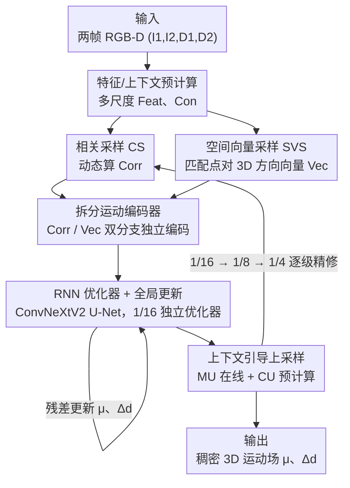

# SEA-Flow3D: Simplified, Efficient, and Accurate Scene Flow via Spatial Vector Sampling and Multi-scale Refinement

**会议**: CVPR 2026  
**论文**: [CVF Open Access](https://openaccess.thecvf.com/content/CVPR2026/html/Ling_SEA-Flow3D_Simplified_Efficient_and_Accurate_Scene_Flow_via_Spatial_Vector_CVPR_2026_paper.html)  
**代码**: https://github.com/HanLingsgjk/SEAFLOW3D  
**领域**: 3D视觉 / 场景流估计  
**关键词**: 场景流, RGB-D, 空间向量采样, 多尺度迭代优化, RAFT  

## 一句话总结
SEA-Flow3D 在 RAFT 式稠密场景流框架的相关采样里额外塞进一份「匹配点对之间的 3D 方向向量」（Spatial Vector Sampling），让迭代优化器在 2D 相关性之外持续看到深度/几何方向，再配上轻量 ConvNeXtV2 RNN 优化器和粗到细多尺度结构，在 KITTI（SF-all 3.55）和 Sintel（Final 2.04）上同时刷新精度并把推理压到 60–72 ms。

## 研究背景与动机
**领域现状**：有了便宜可靠的深度估计后，RGB-D 稠密场景流成为主流。代表方法 RAFT-3D 把 RGB 和深度拼起来喂给 2D 网络，逐像素预测 3D 运动（2D 光流 $\mu$ + 视差变化 $\Delta d$），并通过迭代相关体（correlation volume）反复 refine。另一条路是点云方法（FlowNet3D、CamLiRAFT），直接在 3D 空间建立对应，几何先验用得足，但输出稀疏、难做高分辨率稠密估计。

**现有痛点**：稠密 RGB-D 方法虽然把深度当成输入，但深度信息只在「入口」用了一次——后续的迭代 refine 完全发生在 2D 特征/相关空间里。也就是说，优化器在每一步 lookup 时只看到 2D 特征相关性，看不到匹配点对在 3D 里到底朝哪个方向、错开多少视差。几何先验没有被传播进迭代过程，导致复杂/非刚性场景下 3D 运动恢复不准；同时这些方法（RAFT-3D、MS-RAFT-3D）为了补偿往往堆刚性优化层（rigid optimization），网络变重、速度变慢（MS-RAFT-3D 在 Sintel 上要 1710 ms）。

**核心矛盾**：想要 3D 结构先验贯穿优化全程 → 直觉做法是上 3D 卷积或点云架构，但那很重很慢；想要快和简单 → 就只能退回 2D 相关空间，丢掉几何。精度（要几何）和效率（要轻量）之间被卡死。

**核心 idea**：不必把整个网络搬到 3D，只要在每次相关采样的同一个邻域里，顺手算出匹配点对之间的「3D 方向向量」并和相关值一一配对喂给优化器，就能用极小开销给迭代过程注入持续的几何引导——用一份轻量的方向线索代替昂贵的 3D 卷积/点云分支。

## 方法详解

### 整体框架
输入是连续两帧 RGB-D（图像 $I_1,I_2$ + 视差图 $D_1,D_2$），输出是稠密 3D 运动场，由 2D 光流 $\mu$ 和视差变化 $\Delta d$ 组成。整个网络是一个粗到细的多尺度迭代框架：先在 1/16 尺度上解决全局大位移，再逐级（1/8、1/4）上采样并做少量精修，每一级都重复「采样 → 循环精修 → 上采样」三步。

特征侧先做两类预计算：特征编码器 $F$ 从 $(I_1,I_2)$ 抽取 1/4、1/8、1/16 三尺度视觉特征；上下文编码器 $C$ 吃 $(I_1,I_2,D_1,D_2)$ 拼接，产出 1/2、1/4、1/8、1/16 四尺度上下文特征（多出来的 1/2 给最后上采样用）。每一步采样阶段动态算两份东西：常规相关场 $\mathrm{Corr}=\mathrm{Sample}(\mathrm{Feat}_1,\mathrm{Feat}_2,\mu)$（用 CUDA 动态算子按需计算，省掉 RAFT 那个 4D cost volume 的显存），以及空间向量 $\mathrm{Vec}=\mathrm{SVS}(D_1,D_2,\mu)$。二者元素一一对应，一起送进 RNN 优化器迭代更新 $\mu,\Delta d$；refine 完用上采样模块把结果传到更细一级。整套结构的核心改动集中在「往采样里加 SVS 方向向量」「把 GRU 换成轻量 ConvNeXtV2 RNN 且 1/16 尺度单独一个全局优化器」「把方向特征和相关特征分流编码」「用预计算的上下文 mask 做廉价上采样」。

### 关键设计

**1. Spatial Vector Sampling（SVS）：让相关采样的每个样本都带上一根 3D 方向向量**

这是全文核心，直击「深度只在入口用一次、迭代过程看不到几何」这个痛点。SVS 不在 3D 空间里折腾，而是在「视差增广的 2D 投影场」里采样——在针孔相机模型下，一个三元组 $(u,v,D)$（像素坐标 + 视差）就唯一确定一个 3D 点，所以隐式地携带了完整 3D 几何信息，而且这套表示和预测目标 $\mu,\Delta d$ 天然兼容，pipeline 能大幅简化。具体地，给定第二帧投影场 $P_2=(u,v,D_2)$ 和当前光流估计 $\mu=(\mu_x,\mu_y)$，第一帧每个像素 $p=(x,y)$ 被映射到第二帧的 $p'=(x+\mu_x,\,y+\mu_y)$，然后在 $p'$ 周围开一个和相关半径 $r_f$ 相同的窗口 $N_{p'}=\{p'+\delta\mid \delta_x,\delta_y\in[-r_d,r_d]\cap\mathbb{Z}\}$（取 $r_d=r_f$ 保证空间样本和相关样本严格一一对应）。对窗口内每个邻居 $q$，相对第一帧像素 $p$（视差 $D_1(p)$）算出方向向量

$$\mathrm{Vec}(p,q)=\big(\,u(q)-x,\;\; v(q)-y,\;\; D_2(q)-D_1(p)\,\big)^\top.$$

把 $(2r_d+1)^2$ 个邻居堆叠起来得到张量 $\mathrm{Vec}\in\mathbb{R}^{H\times W\times(2r_d+1)^2\times3}$，每个元素和 $\mathrm{Corr}$ 里同位置的相关值一一对应。这样优化器在每一次 lookup 时不仅看到「哪里相关性高」（2D），还看到「往哪个 3D 方向走、视差差多少」（前两维是像平面偏移、第三维是跨帧视差差）。整个过程没有 3D 卷积、没有点云架构，几乎零额外成本，却把几何引导贯穿了所有迭代。消融里 SVS 把 KITTI 的 DC-out 从 34.53 降到 27.81、Sintel 从 58.59 骤降到 31.55，深度运动估计的提升最明显。

**2. RNN 优化器 + 1/16 尺度独立全局更新：用 ConvNeXtV2 替 GRU，并给粗尺度单开一个优化器**

针对 RAFT 系 GRU 优化器感受野小、要很多次迭代才能收敛的问题，本文借鉴 SEA-RAFT 的思路，把传统 GRU 循环单元换成由 ConvNeXtV2 块搭成的轻量 U-Net（两层 ×2 下采样 + 残差连接）当作 RNN 式优化器。卷积设计带来更大感受野和更丰富的上下文，使得每一步更新更有效，用更少迭代达到更高精度——消融里仅这一项就把 KITTI 的 Fl-all 从 5.36 降到 3.66。每次迭代里，$\mathrm{Corr}$、$\mathrm{Vec}$、当前估计 $(\mu,\Delta d)$ 先被编码成运动特征 $M$，再 $h'=\mathrm{RNN}(h,M,C)$ 更新隐状态，最后用一个两层 CNN 的 Head3D 回归残差 $\mu_{res},\Delta d_{res}$。此外作者发现，最粗的 1/16 尺度承担的是「全局初始化」职责，需要激进的大范围更新；后续尺度则越来越局部化精修。单个共享优化器同时兼顾这两种相互冲突的优化动态很吃力，于是 1/16 尺度单独配一个带更大采样半径 $r$ 的独立优化器，专门强化全局更新、加速并稳定初始化。Fig. 5 显示分离式优化器在后期迭代上明显优于统一式。

**3. 拆分运动编码器（Split Motion Encoder）：把方向特征和相关特征分两条分支编码**

这个设计是为了收拾 SVS 带来的一个副作用。作者实验观察到，直接把 SVS 的 3D 方向线索塞进运动编码会改善视差变化估计、却轻微拉低光流精度——因为额外的方向信息扩大了输入维度，而原始 RAFT 式编码器容量不够，无法把「运动」和「几何」两种表示解耦，方向信息会干扰原本的光流特征空间。解决办法是给相关特征和空间向量特征各开一条独立卷积分支，再分别用 ConvNeXtV2 模块对 flow 分支和 depth 分支做特征精修。消融里这一解耦设计在几乎不增加计算的前提下把 Fl-all 从 3.91 修回 3.71、同时 DC-out 从 27.81 进一步降到 27.17，验证了「分流编码做特征解耦」是有效解法。

**4. 上下文引导上采样（Context-guided Upsampling, CU）：用预计算 mask 做廉价多尺度上采样**

多尺度框架里把稠密运动场恢复到全分辨率一直很棘手：RAFT 的学习式上采样依赖固定尺度的隐状态回归，不适合层级更新；MS-RAFT 用双线性插值快但掉精度；CCMR 在 1/2 尺度 refine 又太贵。本文的最细 refine 尺度是 1/4，单靠在线 mask 无法直接重建全分辨率。于是作者为相邻尺度间固定的 ×2 过渡预计算一组上下文引导 mask $CU_{\{2,4,8\}}$——每个 mask 由对应尺度上下文特征 $\mathrm{Con}_{\{2,4,8\}}$ 经两次卷积得到，负责一次 2× 分辨率跃迁；而当前尺度内 refine 后的第一次 ×2 上采样仍用从 $h'$ 在线回归的动态 mask $MU$。由于 CU 独立于循环精修、只算一次，开销极小，却能强化低尺度监督、给所有尺度预测提供一致可靠的上采样。消融里加入 CU 把 Fl-all 从 3.71 降到 3.28。

### 损失函数 / 训练策略
训练目标在所有迭代和所有尺度上联合监督光流 $\mu$ 与视差变化 $\Delta d$，用 RAFT 式指数衰减加权：

$$L_{total}=\sum_{i=1}^{N}\gamma^{\,N-i}\Big(\lVert \mu_i-\mu_{gt}\rVert_1+\lVert \Delta d_i-\Delta d_{gt}\rVert_1\Big),$$

衰减因子 $\gamma=0.8$ 逐步降低早期预测的权重。总迭代数 $N=N_1+N_2+N_3$ 分摊到 1/16、1/8、1/4 三个尺度，取 $N_1=2,\,N_2=4,\,N_3=3$。采样半径在 1/16 尺度 $r_f=r_d=6$、其余尺度为 4。KITTI 上先在 Driving+vkitti 混合集预训练 200K 步，再在 KITTI+Driving+vkitti 上微调 100K 步；Sintel 遵循 CamLiRAFT 流程在 FlyingThings 上训练、不微调直接评测。

## 实验关键数据

### 主实验
KITTI Scene Flow Benchmark（数值为 outlier rate %，越低越好；+G 用 GA-Net 深度、+M 用 MonSter 深度）：

| 方法 | D1-all | D2-all | Fl-all | SF-all |
|------|--------|--------|--------|--------|
| RAFT-3D | 1.81 | 3.67 | 4.29 | 5.77 |
| CamLiRAFT | 1.81 | 2.94 | 2.96 | 4.26 |
| MS-RAFT-3D | 1.59 | 2.68 | 2.98 | 4.04 |
| **SEA-Flow3D+G** | 1.81 | 2.91 | **2.89** | **4.17** |
| **SEA-Flow3D+M** | **1.42** | **2.18** | **2.53** | **3.55** |

同样深度输入（+G）下 SF-all 4.17 已优于 CamLiRAFT/MS-RAFT-3D；换更强深度（+M）后 SF-all 进一步降到 3.55，验证方法越是有好深度、越能榨出 3D 结构先验的红利。

Sintel（无微调，RTX 4090 计时）：

| 方法 | 输入 | Time/ms | Clean | Final |
|------|------|---------|-------|-------|
| CamLiRAFT | RGB+P | 130 | 1.27 | 2.38 |
| RAFT-3D | RGB+D | 138 | 1.75 | 2.91 |
| MS-RAFT-3D | RGB+D | 1710 | 1.06 | 2.22 |
| **SEA-Flow3D** | RGB+D | **72** | **1.04** | **2.04** |

精度（Final 2.04）和速度（72 ms）同时超过依赖刚性优化的 MS-RAFT-3D（2.22 / 1710 ms），约 24× 提速。

### 消融实验
从简化 MS-RAFT 基线（A）逐步叠加模块到完整模型（E）；DC-epe/DC-out 为作者新引入的视差变化误差/异常率指标：

| ID | 配置 | KITTI Fl-all | KITTI DC-out | Sintel Fl-all | Sintel DC-out |
|----|------|------|------|------|------|
| A | baseline | 5.36 | 48.97 | 5.95 | 56.32 |
| B | +RNN 优化器 | 3.66 | 34.53 | 5.83 | 58.59 |
| C | +SVS | 3.91 | 27.81 | 6.13 | 31.55 |
| D | +Split 编码器 | 3.71 | 27.17 | 6.01 | 28.56 |
| E | +CU（完整） | **3.28** | 27.67 | **5.09** | 27.79 |

### 关键发现
- **SVS 主攻深度运动**：从 B→C，光流精度（Fl-all）甚至略升，但 DC-out 在 KITTI/Sintel 上分别从 34.53/58.59 降到 27.81/31.55，说明显式 3D 方向向量精准地补的是「视差变化/深度运动」这块短板。
- **拆分编码器修复 SVS 副作用**：SVS 会轻微伤光流（C 的 Fl-all 3.91 比 B 还高），Split 编码（D）把它修回 3.71 且 DC-out 继续降，印证「方向信息会污染光流特征空间、需解耦」的判断。
- **RNN 优化器对大位移刚性场景增益大**：在 KITTI（大尺度、刚性多）增益显著，在 Sintel（细粒度、非刚性）与 GRU 差距很小，说明 U-Net 优化器主要受益于需要大范围空间感知的场景。
- **效率拆解**：含特征预处理（约 7.5 ms），整模型在 384×1248 上约 60 ms；采样几乎不占时间（每尺度 0.5–0.7 ms），开销主要在 Update。
- ⚠️ 表 3 中完整模型 E 在 Sintel 的 DC-out（27.79）略高于 D（28.56）……实为略降，但 KITTI 的 DC-out 在 E（27.67）相对 D（27.17）有微升，CU 主要换的是光流误差下降，深度指标基本持平，解读时以原文表格为准。

## 亮点与洞察
- **「2D 投影场里采样、却拿到 3D 几何」是最巧的一手**：利用 $(u,v,D)$ 唯一决定一个 3D 点这个事实，把 3D 方向线索压回 2D 采样网格，既避开 3D 卷积/点云的重计算，又让方向样本和相关样本严格一一对应——这种「不升维也能注入几何」的思路可迁移到立体匹配、光流、深度补全等任何 RAFT 式迭代框架。
- **把「全局初始化」和「局部精修」当成两种优化动态**：识别出粗尺度要激进大步、细尺度要保守小步，二者目标冲突，于是给最粗尺度单独一个大半径优化器——这是个很朴素却有效的工程洞察，几乎零成本换来收敛稳定性。
- **遇到副作用先解释再解耦**：SVS 伤光流不是回退，而是定位到「编码器容量不足以解耦运动与几何」，用分流编码对症下药，是干净的因果链。
- **不靠刚性优化也能打非刚性**：相比 RAFT-3D/MS-RAFT-3D 的 rigid layer，SVS 提供的是逐点几何方向而非刚体假设，所以在 Sintel 的非刚性人物、运动模糊、低光场景反而更稳。

## 局限与展望
- **强依赖输入深度/视差质量**：方法本质是「有了好深度就能把 3D 先验用满」，+G→+M 的大幅提升也印证这点；深度噪声大时 SVS 的方向向量会被污染，鲁棒性待验证（⚠️ 原文未给深度退化下的系统实验）。
- **仍在视差/投影空间工作**：SVS 用的是视差而非真实尺度 3D，对没有可靠视差的纯单目或宽基线场景适配性存疑。
- **评测仍偏自动驾驶/合成**：主战场是 KITTI、Sintel、FlyingThings，真实世界仅给了行人泛化的定性图（Fig. 6），缺乏大规模真实非刚性场景的定量评测。
- **可改进方向**：把 SVS 的固定窗口采样换成可学习/自适应半径；将方向向量从「邻域偏移」升级为带置信度的几何项，缓解深度噪声敏感问题。

## 相关工作与启发
- **vs RAFT-3D / MS-RAFT-3D**：它们把深度只用在输入端，迭代仍在 2D 相关空间且堆刚性优化层；本文让几何方向贯穿每次采样、去掉刚性假设，精度更高且在 Sintel 上快约 24×，非刚性场景更稳。
- **vs CamLiRAFT / CamLiFlow（点云路线）**：它们靠点云采样持续注入几何、效果好但输出偏稀疏且较慢；SEA-Flow3D 在稠密 2D 框架里用 SVS 拿到类似的几何收益，保持稠密高分辨率输出，Sintel Final 2.04 < 2.38、72 ms < 130 ms。
- **vs SEA-RAFT / IGEV-Stereo**：借鉴了 SEA-RAFT 用卷积 U-Net 换 GRU 的优化器设计、以及 IGEV「把几何编进 cost volume」的思想，但把几何注入方式具体化为「相关采样配对的 3D 方向向量」，更轻更直接。

## 评分
- 新颖性: ⭐⭐⭐⭐ SVS「2D 网格采样拿 3D 方向」的切入点干净且实用，但整体仍是 RAFT 框架的几何增强而非范式突破
- 实验充分度: ⭐⭐⭐⭐ KITTI+Sintel 双榜 SOTA、消融逐模块清晰、含计时拆解，但真实非刚性场景定量评测偏少
- 写作质量: ⭐⭐⭐⭐ 动机—矛盾—方法链条清楚，公式与图配合好；个别消融表数字解读需对照原文
- 价值: ⭐⭐⭐⭐ 精度与效率双赢、即插即用思路可迁移到各类 RAFT 式迭代匹配，对自动驾驶/具身场景流实用价值高

<!-- RELATED:START -->

## 相关论文

- [\[CVPR 2026\] Fast SceneScript: Fast and Accurate Language-Based 3D Scene Understanding via Multi-Token Prediction](fast_scenescript_fast_and_accurate_language-based_3d_scene_understanding_via_mul.md)
- [\[ICLR 2026\] UrbanGS: A Scalable and Efficient Architecture for Geometrically Accurate Large-Scene Reconstruction](../../ICLR2026/3d_vision/urbangs_a_scalable_and_efficient_architecture_for_geometrically_accurate_large-s.md)
- [\[CVPR 2026\] SpatialVID: A Large-Scale Video Dataset with Spatial Annotations](spatialvid_a_large-scale_video_dataset_with_spatial_annotations.md)
- [\[CVPR 2026\] AMB3R: Accurate Feed-forward Metric-scale 3D Reconstruction with Backend](amb3r_accurate_feed-forward_metric-scale_3d_reconstruction_with_backend.md)
- [\[CVPR 2026\] A Survey of Spatial Memory Representations for Efficient Robot Navigation](a_survey_of_spatial_memory_representations_for_efficient_robot_navigation.md)

<!-- RELATED:END -->
