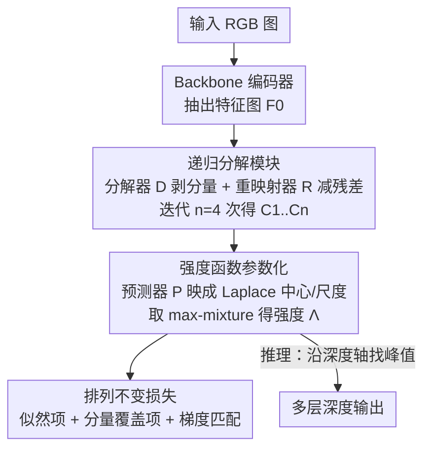

# SeeGroup: Multi-Layer Depth Estimation of Transparent Surfaces via Self-Determined Grouping

**会议**: CVPR 2026  
**论文**: [CVF Open Access](https://openaccess.thecvf.com/content/CVPR2026/html/Wen_SeeGroup_Multi-Layer_Depth_Estimation_of_Transparent_Surfaces_via_Self-Determined_Grouping_CVPR_2026_paper.html)  
**代码**: 待确认  
**领域**: 3D视觉  
**关键词**: 多层深度估计, 透明物体, 自定群组, 强度函数, 排列不变损失

## 一句话总结
SeeGroup 把透明物体的多层深度建模成一条沿深度轴的"强度函数"，用递归分解模块让模型自己决定该怎么把各层深度归组、再配一个对层序排列不变的似然损失，在 LayeredDepth 真实基准上把四元组相对深度准确率从 61.34% 提升到 70.09%。

## 研究背景与动机

**领域现状**：单目深度估计经过多年发展（MiDaS、Depth Anything 等强预训练 backbone + 大规模多数据集训练）已经能在常规场景做到很好的零样本泛化，但它们都只输出**一张**深度图，即假设每条相机光线只打到一个表面。

**现有痛点**：透明物体（玻璃瓶、玻璃门、塑料容器）天生违反这个假设——一条相机光线会同时穿过透明表面和它后面的背景，一个像素对应**多个**沿光线方向的深度值。现有做法要么把透明物当不透明、只取第一层（透明表面）作为目标几何，要么干脆忽略透明表面只预测背后的几何，两者都丢掉了信息。可实际感知系统往往需要同时看到透明表面和背景：机器人从塑料盒里取物，既要看到盒壁避免碰撞、又要看到盒内目标。

**核心矛盾**：多层深度估计的真正难点不在"预测几层"，而在"怎么把每个像素的若干深度值组织成几张深度图"。前人 LayeredDepth 用的是**深度序**分组（第 $i$ 张图收集每个像素第 $i$ 大的深度），在"前景玻璃 + 自然背景"这种简单情形工作良好，但遇到两个部分重叠的透明平面就会出问题：第一张图把整个前平面和后平面的非重叠区拼在一起，第二张图只剩后平面的重叠区，导致每张图内部几何和语义突变。

**本文目标**：让分组策略不再被预先固定，而是随输入场景、甚至随图像区域自适应地决定——某些区域更适合深度序，某些区域更适合物体中心分组。

**切入角度**：作者发现"最优分组高度场景相关"，于是干脆让模型在推理时**自行决定**每个像素那串深度值的排列顺序，不强制从小到大；评测时再按需排序即可。要让这种"自定顺序"成立，关键是设计一个**对像素内深度值排列不变**的损失。

**核心 idea**：把每个像素的多层几何建模成一条沿深度轴的强度函数（Laplace 分量的 max-mixture），用递归分解模块逐步从特征里剥出各层分量，再用排列不变的似然损失训练，让"该怎么分组"完全由模型学出来。

## 方法详解

### 整体框架
给定一张分辨率 $H\times W$ 的 RGB 图，目标是为每个像素 $p$ 预测一串递增深度 $D(p)=\{d_1,\dots,d_m\}$，层数 $m$ 因像素而异。SeeGroup 的流水线是：backbone 编码器先抽出特征图 $F_0$；**递归分解模块**迭代地把 $F_0$ 拆成一串分量 $\{C_1,\dots,C_n\}$，每个分量负责一组主导深度层；预测器 $P$ 把每个分量映成一个 Laplace 分布的中心 $d_i$ 和尺度 $b_i$；所有 Laplace 取 max 得到逐像素的**强度函数** $\Lambda$；训练时用**排列不变似然损失**优化，推理时在 $\Lambda$ 上沿深度轴找峰值即得各层深度。整条链路里"怎么分组"完全由模型自定，因为损失不强加任何层序。

### 关键设计

**1. 递归分解模块：让模型自己把混合特征剥成一组组深度层**

透明区域的像素特征 $F_0$ 是多个表面特征的混合体，直接回归多层深度很难。作者用一个递归分解模块迭代地把这个混合"剥开"：模块含一个分解器 $D$ 和一个重映射器 $R$。第 $i$ 步分解器从上一步残差特征 $F_{i-1}$ 抽出分量 $C_i = D(F_{i-1})$，直觉上 $C_i$ 隔离出当前特征里最主导的一组深度层；随后重映射器把 $C_i$ 投回特征空间得到 $F'_{i-1}=R(C_i)$，再从特征图里减掉这部分以聚焦剩余内容：

$$C_i = D(F_{i-1}), \qquad F_i = F_{i-1} - \eta_i \cdot R(C_i)$$

其中重缩放因子 $\eta_i = \frac{\lVert F_{i-1}\rVert_2}{\lVert F'_{i-1}\rVert_2}$ 保证减完后 $F_i$ 的尺度与 $F_{i-1}$ 仍可比。关键在于"怎么剥、剥成什么"完全由模型学出来，且分量之间**顺序无关**（因为损失排列不变），这正是"自定群组"的实现载体。实现里迭代次数固定为 $n=4$。

**2. 强度函数参数化：用沿深度轴的 Laplace max-mixture 表达多层与不确定性**

如果在透明区域只用 L1 损失直接回归深度值，模型会倾向于靠记数据集先验而非真实视觉证据来消歧。为此作者不输出离散的 $\{\hat d_1,\dots,\hat d_m\}$，而是把逐像素几何建模成一条强度函数 $\Lambda:\mathbb{R}_+\to\mathbb{R}_{\ge 0}$，$\Lambda(x)$ 表示"在深度 $x$ 处观察到某个表面的可能性"——值大代表更可能有表面，接近零代表没有。每个分量 $C_i$ 经预测器映成一个 Laplace 形状的贡献：

$$L_i(x) = \frac{1}{2 b_i}\exp\!\left(-\frac{\lvert x - d_i\rvert}{b_i}\right), \qquad \Lambda = \max_{i=1}^{n} L_i$$

注意这里用的是 **max**-mixture 而不是常见的加权和 $\sum_i w_i L_i$。原因是：在每个深度 $x$ 只有最主导的分量贡献到 $\Lambda(x)$，这局部压制了次要分量，鼓励不同分量各自专精到不同深度区间，避免它们坍缩成一个宽阔的单峰。这样得到的逐像素分布是一条多峰曲线，每个峰对应一层深度，天然编码了不确定性（模糊区表现为低或宽的强度），推理时取峰即得多层深度。

**3. 排列不变损失：似然项 + 分量覆盖项构成双向匹配**

要让模型"自定层序"成立，损失就不能依赖任何固定排列。作者把 $\Lambda$ 看成概率密度的推广（它沿深度轴的积分等于期望层数而非 1），于是观察到一组真值深度 $\{d_1,\dots,d_m\}$ 的似然正比于各点强度之积 $\prod_{i=1}^m \Lambda(d_i)$。因为乘法可交换，这个目标**天然排列不变**。在对数空间为数值稳定写成：

$$L_{int} = -\sum_{i=1}^{m}\log\max_{j=1}^{n} L_j(d_i)$$

但这个目标是单边的：它只鼓励强度在每个真值深度处高，却不惩罚模型多预测了不对应任何真值层的分量。为此作者加一个**分量覆盖损失** $L_{cov} = -\sum_{j=1}^{n}\log\max_{i=1}^{m} L_j(d_i)$，对每个预测分量 $L_j$ 在所有真值深度上取最佳匹配——若 $L_j$ 至少对齐一个真值，惩罚很小；若它远离所有真值，惩罚就很大，从而压制虚假分量。两项合起来构成一个减少过预测、又保持排列不变的双向匹配目标。此外还引入梯度匹配损失 $L_{gm}$ 改善细节，总损失为 $L = \lambda_{int} L_{int} + \lambda_{cov} L_{cov} + \lambda_{gm} L_{gm}$。

### 损失函数 / 训练策略
在 LayeredDepth-Syn 合成数据集（基于 infinigen-indoors 程序化生成，14,800 训练 + 500 验证）上训练，特征提取器用 Depth Anything V2 的 metric-depth checkpoint（DINOv2-ViT-L）初始化。AdamW，初始学习率 $1\times10^{-5}$，4×L40 GPU，batch size 4，训练 250k 步，尺度不变方式训练，$\lambda_{int}, \lambda_{cov}, \lambda_{gm}$ 分别取 1.0、0.1、1.0。推理时沿深度轴检测峰值得多层深度，并抑制深度差小于 0.02 的近重复峰以免重复计数，最后排成递增序列。

## 实验关键数据

### 主实验
在 LayeredDepth 真实基准（1,500 张多样场景图、14.2M 相对深度元组，目前唯一带多层深度标注的真实基准）上做**零样本**评测。指标是元组级准确率：模型预测相对深度排序正确的元组比例，分别报告对（P）、三元组（T）、四元组（Q）——其中四元组（Q）最具信息量，因为点数越多，随机猜对的概率越小。下表为 "All" 子集（全部元组）结果：

| 方法 | Q ↑ | T ↑ | P ↑ |
|------|------|------|------|
| Multi-head (NeWCRFs) | 25.32 | 41.65 | 63.95 |
| Recurrent (NeWCRFs) | 23.77 | 40.70 | 62.26 |
| Multi-head (DA v2)（共享同款 backbone） | 61.34 | 70.57 | 82.56 |
| **SeeGroup（本文）** | **70.09** | **74.88** | **82.62** |

SeeGroup 在 15 个评测指标里赢了 14 个，四元组准确率从 61.34% 提到 70.09%（与本文共享同款单层深度 backbone 的 Multi-head (DA v2) 基线相比）。

### 消融实验
在 LayeredDepth 验证集上（"All" 子集四元组准确率 Q）：

| 维度 | 配置 | Q ↑ | 说明 |
|------|------|------|------|
| 强度参数化 | Weighted Mixture | 56.12 | 加权和混合 |
| 强度参数化 | Sorted Mixture | 52.68 | 强制排序混合 |
| 强度参数化 | **Max-Mixture（本文）** | **69.03** | max 混合 |
| 损失 | L1 | 42.49 | 纯回归 |
| 损失 | L1 + GM | 46.67 | 加梯度匹配 |
| 损失 | Int + GM | 68.36 | 强度似然 + 梯度匹配 |
| 损失 | **Int + Cov + GM（本文）** | **69.03** | 再加分量覆盖项 |

### 关键发现
- **强度参数化的"max"是核心**：把 max-mixture 换成加权和（Weighted）或强制排序（Sorted），四元组准确率从 69.03% 跌到 56.12% / 52.68%，验证了"局部只让主导分量贡献"对避免分量坍缩的关键作用。
- **似然损失替代 L1 是质变**：纯 L1（42.49）或 L1+GM（46.67）远低于强度似然 Int+GM（68.36），说明把"回归深度值"换成"优化排列不变似然"才是主要增益来源；再加分量覆盖项 Cov 进一步微涨到 69.03。
- ⚠️ 模型架构消融里有个反直觉现象：在 "All" 四元组上 Multi-head（73.04）甚至略高于本文递归分解 RD（71.50），但在更深的 Layer 5 子集上 Multi-head 仅 39.64、RD 达 66.14——说明递归分解的优势主要体现在深层/复杂透明结构上（以原文表格为准）。

## 亮点与洞察
- **把"分组该怎么做"交给模型自己学**，而不是预设深度序或物体序——这是对多层深度估计任务的一次重新表述，抓住了前人方法在重叠透明面上失效的根因。
- **排列不变似然是支撑"自定群组"的数学基石**：用 $\prod \Lambda(d_i)$ 的乘法可交换性换来层序无关，思路干净，可迁移到任何"输出无序集合"的预测任务（如多目标关键点、集合预测）。
- **max-mixture 而非加权和**这个小改动贡献巨大（消融掉点 13%），它通过"局部赢者通吃"防止多个分量坍缩成单峰，是值得记住的分布建模 trick。
- 把多层几何建模成"沿深度轴的强度函数 + 取峰"，天然表达了透明区的不确定性，比强行回归单值优雅得多。

## 局限与展望
- 训练完全依赖合成数据集 LayeredDepth-Syn，真实基准上虽零样本表现好，但合成到真实的域差距仍可能限制极端材质/光照场景。
- 递归分解迭代次数固定为 $n=4$，对层数超过 4 的复杂叠透明场景可能不足；自适应迭代次数是潜在改进方向。
- ⚠️ 推理时靠固定阈值 0.02 抑制近重复峰，这个超参可能对深度尺度敏感，跨数据集时或需重新调。
- 架构消融显示在浅层/简单元组上递归分解未必优于 Multi-head，如何在保持深层优势的同时补齐浅层是后续值得探索的点。

## 相关工作与启发
- **vs LayeredDepth [46] 的深度序分组**: 前者第 $i$ 张图固定收集第 $i$ 大深度，遇重叠透明面会在单张图内造成几何/语义突变；本文让模型自定分组顺序，配排列不变损失，结构更连贯、更贴合人类感知。
- **vs 单层透明物深度方法（mask/inpaint 透明区、生成 RGB-D 对）**: 它们最终仍只输出单层深度，透明表面对单个像素的多值歧义无法解决；本文直接输出多层深度。
- **vs 只预测玻璃后方几何的方法 [34, 40]**: 那类方法刻意忽略透明表面本身、且通常假设玻璃为简单平面；本文同时恢复透明表面与背景，且不限平面。

## 评分
- 新颖性: ⭐⭐⭐⭐⭐ 首次把多层深度"分组"形式化并用自定群组 + 排列不变损失求解，问题表述本身就有洞察。
- 实验充分度: ⭐⭐⭐⭐ 真实基准 SOTA + 细致消融，但仅在 LayeredDepth 一个真实基准上验证，跨场景广度有限。
- 写作质量: ⭐⭐⭐⭐ 动机—公式—消融环环相扣，max-mixture 与覆盖损失的设计理由讲得清楚。
- 价值: ⭐⭐⭐⭐ 对机器人抓取/导航等需同时感知透明面与背景的应用有直接价值，方法思路可迁移。

<!-- RELATED:START -->

## 相关论文

- [\[ICCV 2025\] Seeing and Seeing Through the Glass: Real and Synthetic Data for Multi-Layer Depth Estimation](../../ICCV2025/3d_vision/seeing_and_seeing_through_the_glass_real_and_synthetic_data_for_multi-layer_dept.md)
- [\[CVPR 2026\] RoSAMDepth: Robust Self-supervised Depth Estimation Leveraging Segment Anything Model](rosamdepth_robust_self-supervised_depth_estimation_leveraging_segment_anything_m.md)
- [\[CVPR 2026\] Depth Any Panoramas: A Foundation Model for Panoramic Depth Estimation](depth_any_panoramas_a_foundation_model_for_panoramic_depth_estimation.md)
- [\[CVPR 2026\] MD2E: Modeling Depth-to-Edge Cues for Monocular Metric Depth Estimation](md2e_modeling_depth-to-edge_cues_for_monocular_metric_depth_estimation.md)
- [\[CVPR 2026\] Depth Hypothesis Guided Iterative Refinement for Event-Image Monocular Depth Estimation](depth_hypothesis_guided_iterative_refinement_for_event-image_monocular_depth_est.md)

<!-- RELATED:END -->
