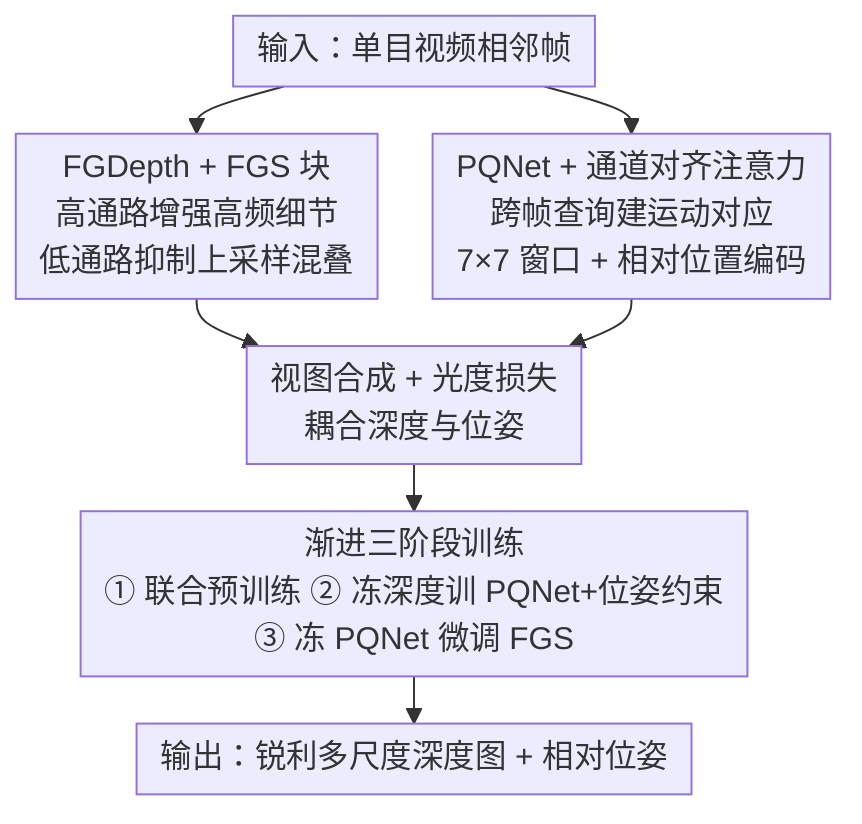

# Seeing Depth Through Frequency and Motion: A Progressive Training Paradigm for Monocular Depth Estimation

**会议**: CVPR 2026  
**论文**: [CVF Open Access](https://openaccess.thecvf.com/content/CVPR2026/html/Li_Seeing_Depth_Through_Frequency_and_Motion_A_Progressive_Training_Paradigm_CVPR_2026_paper.html)  
**代码**: https://github.com/ACoTAI/FGDepth  
**领域**: 3D视觉  
**关键词**: 自监督单目深度, 频率混叠, 频率引导采样, 位姿估计, 渐进训练

## 一句话总结
针对自监督单目深度估计里"边界模糊源于下采样频率混叠"和"位姿网络对跨帧运动建模不足"两个痛点，本文提出即插即用的频率引导采样模块（FGS）保高频细节、PoseQuery 网络（PQNet）用通道对齐注意力建模跨帧运动，再用一套渐进三阶段解耦训练把深度与位姿的互补性榨干，在 KITTI 上 Sq Rel 较强基线降低 4.1%。

## 研究背景与动机

**领域现状**：自监督单目深度估计（MDE）用无标注单目视频、以图像重建为监督信号训练，避开了大规模标注依赖，在自动驾驶、AR 等领域价值很大。近年靠最小重投影损失、更强架构（Transformer、cost volume）、多帧推理等不断推进。

**现有痛点**：现有方法在恢复**细粒度结构**（尤其物体边界、细杆等薄结构）上仍然很弱，表现为"边界出血"伪影和细结构丢失。作者归因于两点：① 编码器-解码器的下采样操作引入了**频率混叠**——根据 Nyquist-Shannon 采样定理，高频成分（深度关键的边缘、纹理）被折叠进低频带，后续上采样无法恢复；② 现有 PoseNet 通常在网络早期就把相邻帧融合，限制了对跨帧几何对应的建模能力。

**核心矛盾**：深度网络和位姿网络本是**互补**的——准的位姿能反过来强化深度预测，反之亦然——但常规做法把两者**联合单阶段**训练，这种互补关系基本没被利用，且单阶段联合训练本身不稳定。

**本文目标**：设计一个能保住高频结构细节的深度网络 + 一个能建模跨帧运动的鲁棒位姿网络，再配一套能充分释放二者互补性的训练范式。

**切入角度**：从信号处理角度切入——既然边界模糊本质是下采样的频率混叠，那就在采样环节显式做频率分路处理；既然位姿能助深度，那就把两个网络解耦、分阶段交替优化而非一锅煮。

**核心 idea**：用即插即用的频率引导采样（FGS）双路分别增强高频、抑制混叠；用 PoseQuery + 通道对齐注意力跨帧查询建运动；用渐进三阶段训练（等价于块坐标下降 BCD）解耦优化深度与位姿。

## 方法详解

### 整体框架
整套框架由两个核心组件 + 一套训练策略构成：**FGDepth**（频率感知深度网络，解码器里嵌 FGS 块）和 **PQNet**（带通道对齐注意力的位姿网络）。输入是单目视频相邻帧，FGDepth 负责出锐利深度图，PQNet 负责估相邻帧相对位姿，二者通过视图合成的光度损失自监督耦合。关键在于训练不是一锅联合，而是**渐进三阶段**：先联合预训练，再冻结深度网络单训 PQNet（加位姿约束），最后冻结 PQNet 微调带 FGS 的 FGDepth，让两个网络的互补优势逐步释放。

### 关键设计

**1. 频率引导采样（FGS）块：用双路频率处理对抗下采样混叠**

神经网络下采样压缩特征的同时降低了空间分辨率，损害边界锐度和深度连续性，作者据 Nyquist-Shannon 定理把它归因于高频细节混叠进低频。FGS 块是个即插即用、架构无关的模块，可嵌进各种编码-解码或 Transformer 深度网络，含两条互补路径：① **高通增强路**从编码器特征里恢复并重注入丢失的高频细节；② **低通滤波路**在解码器上采样时抑制混叠伪影。高频增强写作：

$$w_{LP} = \mathrm{softmax}(\mathrm{Conv}_{3\times3}(F_{lr})), \quad w_{HP} = \mathbb{I} - w_{LP}, \quad F'_{hr} = w_{HP}\cdot F_{hr} + F_{hr}$$

其中 $F_{hr}, F_{lr}$ 是高/低分辨率特征，$w_{LP}$ 是自适应低通核，$\mathbb{I}$ 是恒等核。最终的频率引导重建是一个频谱补偿机制——把"高频补偿项 $w_{HP}\cdot F_{hr}+F_{hr}$"和"带限基底 $(w_{LP}\cdot F_{lr})\!\uparrow$（上采样）"相加：

$$\hat{F}_{hr} = \underbrace{w_{HP}\cdot F_{hr} + F_{hr}}_{\text{高频补偿}} + \underbrace{(w_{LP}\cdot F_{lr})\!\uparrow}_{\text{带限基底}}$$

这样在保住低频结构语义完整的同时恢复边缘/纹理等细结构。与依赖全局傅里叶变换的方法相比，FGS 用高效的空间域滤波解决混叠，延迟更低。FGDepth 的解码器在每次上采样前都用 FGS 块增强特征，多尺度视差头输出 1/8、1/4、1/2 和全分辨率深度图。

**2. PQNet 与通道对齐注意力（CAA）：跨帧查询建模细粒度运动**

现有 PoseNet 早早融合相邻帧、难建跨帧几何对应。PQNet 用通道对齐注意力（CAA）在连续帧间做细粒度空间对齐：共享的 Pose Stem 抽出前后帧特征 $f_t, f_s$，PoseQuery 层用前帧特征做 query 去对齐后帧：

$$Q_t = \mathrm{Proj}(f_t; W_Q), \quad K_s, V_s = \mathrm{Proj}(f_s; W_K, W_V), \quad \mathrm{CAA}_{t\to s} = \mathrm{Softmax}\!\left(\frac{Q_t K_s^T}{\sqrt{d}} + B_E\right)V_s$$

其中 $B_E$ 是可学习的相对空间位置编码，所有投影**通道共享**以保证语义一致。再并行算自注意力 $SA_t, SA_s$，最后用轻量通道注意力融合：$f_{t\to s} = \mathrm{CAFuse}([SA_t, \mathrm{CAA}_{t\to s}, SA_s])$。为降复杂度，特征切成不重叠的 $7\times7$ 窗口，CAA 与 SA 都在窗口内计算，再重组送入 Pose Trunk 精修并由 Pose Head 回归相对位姿。PQNet 含 Pose Stem（抽特征）、PoseQuery 层（跨帧对齐）、Pose Trunk（高层运动表示）、Pose Head（最终位姿）四部分。

**3. 渐进三阶段解耦训练：把深度与位姿的互补性逐步榨干**

作者观察到更准的位姿能提升深度、反之亦然，于是把两个网络解耦、分阶段在各自约束下优化。**阶段一**走标准自监督 MDE：用源图 $I_s$ 到目标图 $I_t$ 的视图合成做代理任务，最小化光度损失 $L_p = (1-\alpha)\lvert I_t - \hat{I}_{s\to t}\rvert + \alpha\frac{1-\mathrm{SSIM}(I_t,\hat{I}_{s\to t})}{2}$。**阶段二**冻结预训练深度网络，单训 PQNet，并在光度损失外加一个基于 SE(3) 李群的**互逆位姿约束**——强制相邻帧前向/后向位姿近似互逆：

$$L_{pose} = \lVert R_{t\to s} R_{s\to t} - I\rVert_1 + \lVert R_{s\to t}\, t_{t\to s} + t_{s\to t}\rVert_2$$

旋转项用 L1 增强抗噪、平移项用 L2 鼓励平滑回归。**阶段三**把深度网络的上采样块替换成 FGS 块、其余预训练参数保留来初始化 FGDepth，冻结 PQNet 只训涉及 FGS 的模块，聚焦从高频线索恢复边缘/纹理。这种解耦优化在理论上对应**非凸非精确块坐标下降（BCD）**：交替近似更新保证稳定收敛到稳定点。

### 损失函数 / 训练策略
全程都用光度损失（含 SSIM 项），阶段二额外加 SE(3) 互逆位姿损失。实验在 KITTI Eigen split（39,810 训练三元组 + 4,424 验证，697 测试）上训，输入 resize 到 $640\times192$，学习率/epoch/batch 等与基线 MonoViT 保持一致，2×RTX 3090，PyTorch 1.9.0。

## 实验关键数据

### 主实验
KITTI Eigen split（$640\times192$）单目训练设定，深度预测前按标准做法对齐尺度：

| 方法 | Abs Rel ↓ | Sq Rel ↓ | RMSE ↓ | δ<1.25 ↑ |
|------|-----------|----------|--------|----------|
| Monodepth2 [10] | 0.115 | 0.903 | 4.863 | 0.877 |
| MonoViT [39]（基线） | 0.099 | 0.708 | 4.372 | 0.900 |
| GeoDepth [31] | 0.100 | 0.694 | 4.381 | 0.897 |
| Gao et al. [8] | 0.097 | 0.692 | 4.373 | 0.900 |
| **FGDepth（本文）** | **0.096** | **0.679** | **4.303** | **0.902** |

FGDepth 在所有指标上取得 SOTA，相比 MonoViT 基线 Sq Rel 降 4.1%（0.708→0.679）、RMSE 降 1.6%。在 Make3D 上做**零样本**泛化（不用其任何训练数据），Sq Rel 2.627 / RMSE 6.500 / Abs Rel 0.283，全面超过所有自监督方法，较 MonoViT 分别降 4.75% 和 1.86%。

### 消融实验
KITTI 上对组件与训练策略消融（联合训练设定下逐个加组件，下半部固定用 FGDepth+PQNet 比三种训练范式）：

| 维度 | 配置 | Abs Rel ↓ | Sq Rel ↓ | RMSE ↓ |
|------|------|-----------|----------|--------|
| 组件 | baseline（联合） | 0.102 | 0.727 | 4.428 |
| 组件 | + FGDepth | 0.098 | 0.712 | 4.363 |
| 组件 | + PQNet | 0.099 | 0.723 | 4.399 |
| 组件 | + 两者 | 0.098 | 0.704 | 4.338 |
| 训练 | Batch（逐 batch 交替） | 0.117 | 0.819 | 4.448 |
| 训练 | Epoch（逐 epoch 交替） | 0.098 | 0.710 | 4.381 |
| 训练 | **Stage（本文三阶段）** | **0.096** | **0.679** | **4.303** |

### 关键发现
- **位姿网络也能帮深度**：PQNet 本是位姿网络，单独加进去也让深度 Abs Rel 从 0.102 降到 0.099，印证了"更准的位姿通过联合优化反哺深度"的互补假设。
- **训练范式是关键变量**：同样的 FGDepth+PQNet，逐 batch 交替（Batch，类 GAN）反而最差（Sq Rel 0.819），因为频繁交替扰乱两个任务的学习动态、阻碍收敛；逐 epoch 交替（Epoch，0.710）尚可但仍逊于联合，因每个 epoch 开始时优化器内部状态与当前配对模型错位；唯有渐进三阶段（Stage，0.679）显著最优，较常规单阶段联合训练 Sq Rel 降 3.55%（0.704→0.679）。
- **FGS 块对薄结构增益显著**：去掉 FGS 后预测过度平滑、轮廓模糊；加上后细杆、行人、植被等薄/复杂结构明显更锐利，频谱上高频响应也更均衡丰富。

## 亮点与洞察
- **用 Nyquist-Shannon 采样定理重新诊断"边界模糊"**：把一个长期被当成"网络容量/损失"问题的现象归因到下采样的频率混叠，这个信号处理视角清晰且可操作。
- **FGS 块即插即用、架构无关**：双路（高通增强 + 低通抑混叠）可嵌进各种 backbone，是可复用的"反混叠采样"组件，迁移成本低。
- **把三阶段训练对应到块坐标下降（BCD）**：给"为什么解耦交替比联合稳"提供了理论锚点，也解释了为何逐 batch 交替反而崩——交替粒度直接决定收敛性。
- **SE(3) 互逆位姿约束**用前后向位姿应互逆这一几何先验做正则，简单且物理可解释，增强了时序一致性。

## 局限与展望
- 仅在 KITTI（驾驶场景）+ Make3D 上验证，室内、手持等大运动/弱纹理场景的泛化未充分检验。
- 三阶段训练虽稳但流程更长（联合→冻深度训位姿→冻位姿训 FGS），相比一锅联合训练增加了工程复杂度和调度成本。
- ⚠️ BCD 收敛性的详细数学推导放在了补充材料，正文只给结论，理论严谨性需以补充材料为准。
- FGS 的高/低通分路靠 $3\times3$ 卷积学自适应核，对极端高频纹理或运动模糊场景是否仍稳，文中未深入分析。

## 相关工作与启发
- **vs MonoViT [39]（基线）**: 同 backbone 下，本文靠 FGS 反混叠 + PQNet 运动建模 + 三阶段训练，把 Sq Rel 从 0.708 压到 0.679（降 4.1%），主要赢在边界锐度和大误差抑制。
- **vs 傅里叶域频率方法 [13]/[4]**: 那类方法靠全局频域变换或高频区光度损失，计算重；本文用高效空间域滤波解决混叠，延迟更低且即插即用。
- **vs 多阶段训练方法（不确定性建模 [19]/帧间一致性 [18]/师生 [21]）**: 它们多忽略可靠运动线索的整合；本文显式把"准位姿反哺深度"做进三阶段解耦，并给出 BCD 理论支撑。

## 评分
- 新颖性: ⭐⭐⭐⭐ 频率混叠诊断 + FGS 双路采样 + 三阶段 BCD 训练三者组合新颖，但各单点（频率感知、解耦训练）都有前作脉络。
- 实验充分度: ⭐⭐⭐⭐ KITTI SOTA + Make3D 零样本 + 组件/训练范式双重消融较扎实，但数据集广度限于驾驶场景。
- 写作质量: ⭐⭐⭐⭐ 从采样定理到 BCD 的动机链讲得清楚，消融对照（Batch/Epoch/Stage）很有说服力。
- 价值: ⭐⭐⭐⭐ FGS 即插即用、对自动驾驶/AR 的边界精度有直接价值，且训练范式洞察可迁移。

<!-- RELATED:START -->

## 相关论文

- [\[CVPR 2026\] DepthFocus: Controllable Depth Estimation for See-Through Scenes](depthfocus_controllable_depth_estimation_for_see-through_scenes.md)
- [\[CVPR 2026\] MD2E: Modeling Depth-to-Edge Cues for Monocular Metric Depth Estimation](md2e_modeling_depth-to-edge_cues_for_monocular_metric_depth_estimation.md)
- [\[CVPR 2026\] Depth Hypothesis Guided Iterative Refinement for Event-Image Monocular Depth Estimation](depth_hypothesis_guided_iterative_refinement_for_event-image_monocular_depth_est.md)
- [\[ICCV 2025\] Depth AnyEvent: A Cross-Modal Distillation Paradigm for Event-Based Monocular Depth Estimation](../../ICCV2025/3d_vision/depth_anyevent_a_cross-modal_distillation_paradigm_for_event-based_monocular_dep.md)
- [\[CVPR 2026\] Iris: Integrating Language into Diffusion-based Monocular Depth Estimation](iris_integrating_language_into_diffusion-based_monocular_depth_estimation.md)

<!-- RELATED:END -->
