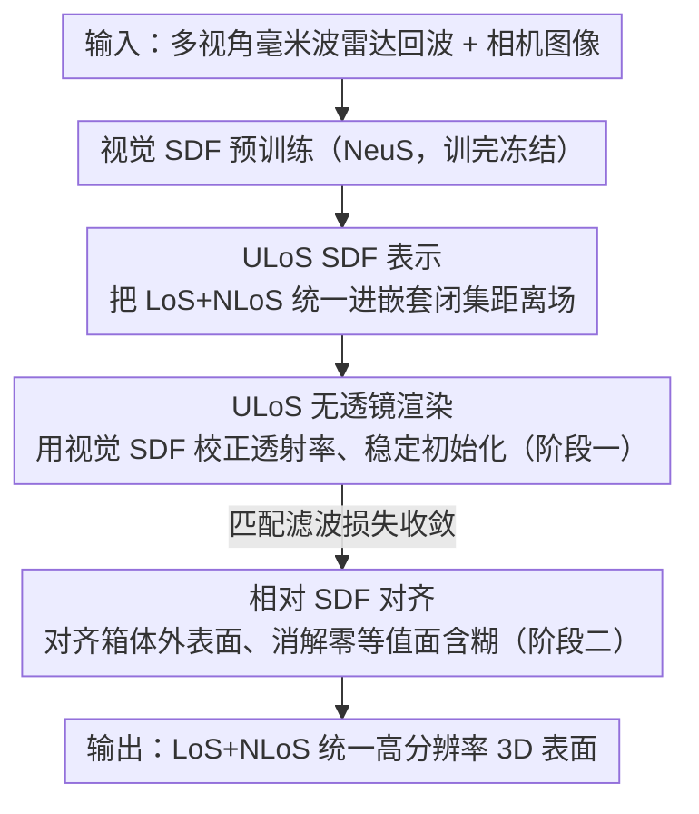

# Seeing through boxes: Non-Line-of-Sight 3D Reconstruction from Radar Signals

**会议**: CVPR 2026  
**论文**: [CVF Open Access](https://openaccess.thecvf.com/content/CVPR2026/html/Lu_Seeing_through_boxes_Non-Line-of-Sight_3D_Reconstruction_from_Radar_Signals_CVPR_2026_paper.html)  
**代码**: 待确认  
**领域**: 3D视觉  
**关键词**: 非视距重建, 射频/雷达成像, 神经隐式表面, 符号距离场, 视觉先验  

## 一句话总结
针对毫米波雷达"穿透遮挡看箱内物体"时重建噪声大、训练不稳、表面位置含糊的问题，本文提出 GeRaF 2.0：把箱外可见（LoS）几何和箱内隐藏（NLoS）几何统一进一个 ULoS 符号距离场，用视觉预训练 SDF 给射频重建做稳定初始化，并用两阶段训练 + 相对 SDF 对齐把表面精确锁在零等值面上，刷新了射频 3D 重建的 SOTA。

## 研究背景与动机

**领域现状**：射频（RF）信号能穿透纸箱、布料等遮挡物，是少有的能"看见被挡住的物体"的传感模态，因此在机器人抓取箱内物体、智能家居感知遮挡区域上很有价值。近年的做法是把神经隐式重建（NeRF / NeuS 那一套）搬到射频上，用一个可微的物理渲染模型去拟合雷达回波，从而连续地表示场景几何。

**现有痛点**：射频是"无透镜成像"——每根天线都接收整个场景的回波，导致空间分辨率极低、噪声极高，且金属等表面以镜面反射为主，会丢失大片表面。作者前作 GeRaF 处理遮挡的办法很粗暴：直接把遮挡物（箱子）从雷达图里裁掉，当它不存在。但这假设"穿过箱壁后的信号完全不受箱壁影响"是错的——信号穿过箱壁时会被部分反射、衰减。

**核心矛盾**：忽略 LoS 箱壁几何会带来三个连锁问题——（1）箱壁的可见反射会"漏"进隐藏区，在重建里表现为噪声（论文里兔子模型被箱子影响出了个奇怪的"帽子"）；（2）训练不稳，不同形状/大小的箱子改变了优化曲面，有时根本不收敛；（3）表面含糊（surface ambiguity），由于箱体几何影响到达 NLoS 区的信号强度，无法归一化信号、从而无法确定 SDF 的真实零等值面（重建表面会偏移几厘米）。而纯视觉重建恰恰相反：训练稳、表面准，但看不进箱子里。

**本文目标**：能不能用箱外稳定准确的可见信息，去引导箱内低分辨率、强噪声的不可见射频重建？

**切入角度**：作者观察到一个关键事实——在箱外的自由空间（LoS 区域），视觉训练得到的 SDF 和射频训练得到的距离场本应取同样的值。这给了一个把视觉先验"注入"射频神经场的天然接口。

**核心 idea**：把 LoS 与 NLoS 统一进一个符号距离场（ULoS SDF），用视觉预训练 SDF 给射频重建做初始化与渲染校正，再用两阶段训练 + 相对 SDF 对齐把零等值面锁准。

## 方法详解

### 整体框架
GeRaF 2.0 的输入是一台装在机械臂上的 77 GHz 毫米波雷达采集的多视角回波，外加同场景的多视角相机图像；输出是 LoS（箱壁）+ NLoS（箱内物体）统一的高分辨率 3D 表面。整条管线先用纯视觉把箱外表面重建好并冻结，再把这个稳定的视觉 SDF 当作物理先验贯穿到射频重建里，最后分两个阶段优化：阶段一让射频重建在视觉先验的护航下稳定收敛，阶段二用相对 SDF 对齐解决表面位置含糊、把表面精确卡到 SDF=0 处。

### 关键设计

**1. ULoS 统一符号距离场：把"内/外"二元语义改造成适配射频多层穿透的嵌套闭集**

视觉 SDF 用正负号干脆地区分物体的内外，但射频不行——一层箱壁对射频是"半透明"的，传统"内/外"二元概念在多层结构上失效。本文把整个场景建成一系列嵌套、闭合、紧致的集合 $M_n \subset \mathrm{int}(M_{n-1}) \subset \cdots \subset \mathrm{int}(M_1) \subset \mathrm{int}(\Omega_{\mathrm{ULoS}})$，并据此定义 ULoS SDF $f_r$。符号不再按几何内外，而是按"射频相互作用强弱"来定：强相互作用区（纸箱、金属）取负值，弱相互作用区（空气）取正值。每个区域的距离值取到其最近两个边界面的最小欧氏距离 $f(\mathbf{x}) = \mathrm{sign}(f(\mathbf{x}))\min(d(\mathbf{x},\partial M_i),\, d(\mathbf{x},\partial M_{i+1}))$。这样既保留了几何连续性，又给每层介质一个物理上有意义的符号，让单个神经场就能一致地优化箱壁和箱内物体，从源头上抑制 LoS 反射漏进 NLoS 区造成的伪影。

**2. ULoS 无透镜渲染：用视觉预训练 SDF 校正透射率，给不稳定的射频训练打稳定地基**

无透镜渲染里，沿真实射线计算累积透射率 $T(u')$ 时要在场景边界对 sigmoid-SDF 值做修正 $T(u') = T(u) - \Phi_s(f(\mathbf{x}(u_s))) + \Phi_s(f(\mathbf{x}(u'_s)))$。问题是这两个修正项计算代价高、在反向传播里被舍弃，且网络初始化阶段存在显著偏置，导致透射率校正在训练早期严重失真——在信号可见性本就很差的 NLoS 场景里这尤其致命。本文利用前面那个观察：在箱外区域 $R_{0,1}$，视觉 SDF 与射频 ULoS SDF 取值相同 $f_v(\mathbf{x}) = f_r(\mathbf{x})$。由于主射线的起点都落在箱外自由空间，作者就用收敛良好的视觉预训练 SDF 来做透射率修正、给 ULoS SDF 提供稳定初始化，而不是依赖正在训练、尚不可靠的射频模型本身，从而换来更快收敛和更一致的重建。

**3. 相对 SDF 对齐 + 两阶段训练：把"表面位置含糊"这个老大难锁到正确的零等值面**

即便有了前两步，重建表面仍可能整体偏离 SDF 零等值面——因为雷达信号强度无法像 RGB 那样预归一化到 $[0,1]$，反射率、预测信号功率、SDF 零等值面三者彼此纠缠，网络无法唯一确定正确表面。作者引入相对 SDF（RSDF）$g_r$：它与真实 SDF 只差一个未知常数，故梯度处处相同 $\nabla f = \nabla g$。论文证明了一个命题——若两个标量场梯度处处相等、且在某条闭曲面 $S$ 上取值相等，则二者在整个连通域上恒等。于是只要在箱外一条参考闭曲面（取箱体外表面 $\partial M_1$）上把 RSDF 对齐到视觉 SDF，对齐就会"传导"到箱内。对齐损失 $\mathcal{L}_{\mathrm{RSDF}} = \mathbb{E}_{\mathbf{x}\in\partial M_1}[\,|g_r(\mathbf{x}) - f_v(\mathbf{x})|\,]$，实现上为稳定起见改成沿主射线监督期望深度 $d = \int_0^\infty u\,\rho(u)\,T(u)\,du$。训练分两阶段：阶段一冻结反射率网络（输出恒置 1.0），只用匹配滤波损失 $\mathcal{L}=\mathcal{L}_{\mathrm{MF}}+\lambda_{\mathrm{GRAD}}\mathcal{L}_{\mathrm{GRAD}}$（含 Eikonal 正则）把几何先稳住；阶段二解冻全部网络、加入 RSDF 对齐 $\mathcal{L}=\mathcal{L}_{\mathrm{MF}}+\lambda_{\mathrm{GRAD}}\mathcal{L}_{\mathrm{GRAD}}+\lambda_{\mathrm{RSDF}}\mathcal{L}_{\mathrm{RSDF}}$，此时已有阶段一的稳定初始化，不再需要 ULoS 无透镜渲染。

### 损失函数 / 训练策略
两阶段优化：阶段一目标 $\mathcal{L}_{\mathrm{MF}} + \lambda_{\mathrm{GRAD}}\mathcal{L}_{\mathrm{GRAD}}$，匹配滤波损失（在预测与真值匹配滤波功率分布间计算）抑制噪声、Eikonal 项保证合法 SDF；阶段二加入 $\lambda_{\mathrm{RSDF}}\mathcal{L}_{\mathrm{RSDF}}$ 做表面对齐。训练在单卡 NVIDIA H100 上跑 100,000 次迭代、约 48 小时。

## 实验关键数据

数据集用 Franka Research 3 机械臂 + TI AWR1843BOOST 雷达采集，物体置于 360° 转盘上每 10° 采一帧，真值由 Scaniverse 扫描得到。量化指标为 F1-Score（阈值 $\tau=0.015$）与 Chamfer Distance（毫米），评估时把箱体从点云中裁掉。

### 主实验
对比三类基线：纯视觉 NeuS、匹配滤波（MF）成像、前作 NLoS 重建 GeRaF。下表汇总各方法在"是否需手动选表面层 $g_r$"上的差异，这直接反映表面含糊是否被解决（⚠️ 缓存正文未给出逐物体的 F1/CD 数值表，定性结论与下表趋势以原文为准）：

| 方法 | 模态 | 能否重建 360° 隐藏物 | 表面零等值面 $g_r$ |
|------|------|----------------------|--------------------|
| NeuS | 纯视觉 | 否（看不进箱内，需分开拍） | 自动 $g_r=0$ |
| Matched Filter | 射频点云 | 粗糙、需阈值化 | 需手动选层 |
| GeRaF（前作） | 射频 | 是，但有伪影/裁掉遮挡 | 需手动选层（偏移 5–95 mm ⚠️） |
| GeRaF 2.0 Stage 1 | 射频+视觉 | 是，干净 | 仍需手动选层 |
| GeRaF 2.0 Stage 2 | 射频+视觉 | 是，干净且细节丰富 | 自动 $g_r=0$（全部物体） |

关键差异：GeRaF 2.0 阶段二受益于 RSDF 对齐，能在 SDF 零等值面处直接精确抽取表面，这是所有基线都做不到的——既免去手动阈值，又保住了大象象牙、公鸡鸡冠、鹿角、球顶这类细节。

### 消融实验
围绕 RSDF 对齐权重 $\lambda_{\mathrm{RSDF}}$ 做消融：

| 配置 | 表面相对零等值面 | 说明 |
|------|------------------|------|
| Stage 1（无对齐） | 显著偏移 | 表面整体偏离 SDF 零等值面 |
| $\lambda_{\mathrm{RSDF}}=0$ | 显著偏移 | 与无对齐等价，含糊未解 |
| $\lambda_{\mathrm{RSDF}}=0.5$ | 逐渐收敛 | 表面向正确零等值面靠拢 |
| $\lambda_{\mathrm{RSDF}}=1.0$ | 锁到 $g_r=0$ | 含糊被解决，表面正确 |

### 关键发现
- RSDF 对齐是解决"表面含糊"的关键开关：$\lambda_{\mathrm{RSDF}}$ 从 0 增大到 1.0，表面从大幅偏移逐步收敛到正确的零等值面，验证了"在箱外一条参考面对齐即可传导到箱内"这一命题的实际效果。
- 鲁棒性：箱内填充气泡膜（额外散射层）时重建几何几乎无退化；嵌套双箱场景下 SDF 也能清晰分辨同心箱壁与内部物体（内表面因散射增强略有退化）。
- 视觉先验的作用集中在"稳"——它把射频训练从不收敛/噪声漏入的困境里拉了出来，让阶段二的细节恢复成为可能。

## 亮点与洞察
- **用"箱外稳准的视觉"去救"箱内噪而糊的射频"**：抓住了 LoS 区两种 SDF 取值相同这一物理事实，把视觉先验做成神经场的初始化与渲染校正接口，而不是简单地把两路特征拼接，思路干净且可证。
- **把表面含糊问题数学化为一个可证传导的对齐命题**：只在箱外一条参考闭曲面上对齐 RSDF，就能保证整域恒等，工程上还退化成沿主射线的深度监督，既稳又省。
- **符号语义的重定义**：把 SDF 的正负从"几何内外"改成"射频相互作用强弱"，是适配多层穿透介质的关键一步，这个视角可迁移到其他穿透式传感（如太赫兹、超声）的神经隐式重建。

## 局限性 / 可改进方向
- 评估规模有限：在单一雷达硬件、转盘采集、Scaniverse 真值下测试，未见大规模/野外场景验证，泛化性待考。
- 嵌套多层、强散射填充物下内表面会退化，说明在更复杂遮挡层叠时方法仍有上限。
- 依赖一套可用的多视角视觉重建（NeuS）来产生先验，若箱外视觉本身难以重建（强反光、透明箱壁）则先验失效，这一前置条件限制了适用范围。
- 训练成本不低（H100 上 48 小时 / 10 万次迭代），离实时机器人感知尚有距离。

## 相关工作与启发
- **vs GeRaF（前作）**：前作把遮挡物直接裁掉、对 LoS 与 NLoS 一视同仁，导致反射漏入、训练不稳、表面偏移；本文用统一 ULoS SDF + 视觉先验 + RSDF 对齐正面建模遮挡交互，是对前作三大缺陷的针对性修补。
- **vs mmNorm**：mmNorm 通过估计法向场并对等值面反演做 NLoS 重建，但只做单面（正视图）且同样裁掉遮挡；本文做 360° 全向重建并显式利用遮挡外几何。
- **vs 纯视觉 NeuS/NeRF**：视觉方法训练稳、表面准但看不穿遮挡；本文把视觉的"稳"嫁接到射频的"穿透"上，取两者之长。
- **vs RadarSim 等雷达-视觉联合**：已有雷达-相机融合多服务于自动驾驶检测与雷达仿真（从 LoS 几何合成回波），本文反过来用相机-雷达联合观测解决 NLoS 高分辨率重建，问题设定不同。

## 评分
- 新颖性: ⭐⭐⭐⭐⭐ 首个用视觉 LoS 模态提升射频 NLoS 高分辨率重建的工作，且把表面含糊问题数学化为可证传导的对齐命题。
- 实验充分度: ⭐⭐⭐☆☆ 定性结果与消融到位，但缓存正文缺逐物体量化数值表、硬件/场景单一，规模偏小。
- 写作质量: ⭐⭐⭐⭐☆ 物理建模与命题推导清晰，框架递进合理，公式排版在 PDF 抽取下略乱但逻辑可循。
- 价值: ⭐⭐⭐⭐☆ 为穿透式传感的神经隐式重建提供了"以视觉先验稳住射频"的范式，机器人/智能家居"看穿遮挡"有实际想象空间。

<!-- RELATED:START -->

## 相关论文

- [\[CVPR 2026\] Seeing Depth Through Frequency and Motion: A Progressive Training Paradigm for Monocular Depth Estimation](seeing_depth_through_frequency_and_motion_a_progressive_training_paradigm_for_mo.md)
- [\[CVPR 2026\] Seeing through Light and Darkness: Sensor-Physics Grounded Deblurring HDR NeRF from Single-Exposure Images and Events](seeing_through_light_and_darkness_sensor-physics_grounded_deblurring_hdr_nerf_fr.md)
- [\[CVPR 2026\] Neural Field-Based 3D Surface Reconstruction of Microstructures from Multi-Detector Signals in Scanning Electron Microscopy](neural_field-based_3d_surface_reconstruction_of_microstructures_from_multi-detec.md)
- [\[ICCV 2025\] Seeing and Seeing Through the Glass: Real and Synthetic Data for Multi-Layer Depth Estimation](../../ICCV2025/3d_vision/seeing_and_seeing_through_the_glass_real_and_synthetic_data_for_multi-layer_dept.md)
- [\[CVPR 2026\] Radar-Guided Polynomial Fitting for Metric Depth Estimation](radar-guided_polynomial_fitting_for_metric_depth_estimation.md)

<!-- RELATED:END -->
