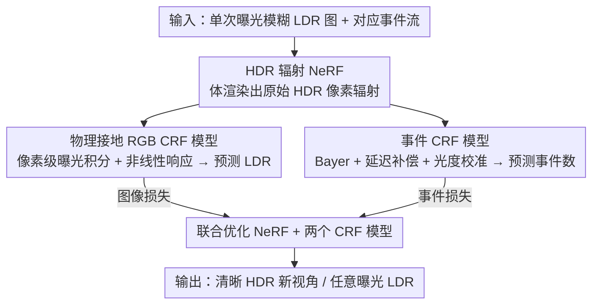

# Seeing through Light and Darkness: Sensor-Physics Grounded Deblurring HDR NeRF from Single-Exposure Images and Events

**会议**: CVPR 2026  
**论文**: [CVF Open Access](https://openaccess.thecvf.com/content/CVPR2026/html/Qi_Seeing_through_Light_and_Darkness_Sensor-Physics_Grounded_Deblurring_HDR_NeRF_CVPR_2026_paper.html)  
**代码**: https://github.com/iCVTEAM/See-NeRF  
**领域**: 3D视觉  
**关键词**: NeRF, 高动态范围, 去模糊新视角合成, 事件相机, 相机响应函数  

## 一句话总结
针对"单次曝光的模糊低动态范围（LDR）图 + 事件流"重建清晰高动态范围（HDR）3D 表示时、现有方法忽视传感器输出与物理辐射之间失配的问题，本文提出 See-NeRF：用 NeRF 直接表示场景的真实 HDR 辐射，再用一个像素级 RGB CRF 模型和一个延迟感知、光度校准的事件 CRF 模型把"物理辐射→传感器测量"这一过程显式建模出来，三者联合优化，从而在极端光照下拿到 SOTA 的去模糊 HDR 新视角合成结果。

## 研究背景与动机

**领域现状**：NeRF / 3DGS 在理想的清晰 LDR 图输入下能做出高保真新视角合成（NVS）。但真实野外图像常同时存在两个麻烦：极端光照（高光与暗部并存）和相机运动模糊，根源是模糊、压缩后的 8-bit LDR 图本身丢了信息（过曝饱和在 255、欠曝裁切在 0）。

**现有痛点**：图像类方法靠多曝光 LDR 补动态范围、靠建模相机运动去模糊，但要么需要繁琐的多曝光拍摄，要么在长曝光严重模糊下仍失效。事件相机是个好补充——它在对数域异步记录亮度变化，天然保留高时间分辨率（补时域模糊）和高动态范围（补空间辐射差异）信息。于是近年出现了用"事件+RGB"（ERGB）做去模糊 NVS 的工作，EvHDR-NeRF 第一个把事件引入单次曝光的 HDR 去模糊 NeRF。

**核心矛盾**：但这些 ERGB 方法都缺一个关键环节——没有 grounding 在"传感器输出 vs 物理场景亮度"的失配上。EvHDR-NeRF 基本沿用 HDR-NeRF 的色调映射策略，直接把 CRF（相机响应函数）作用在 3D 点上，并把它生硬地扩展到事件设定，完全没考虑事件的生成机理。结果是：渲染输出对不齐由输入图像和事件导出的监督信号，几何与外观学习被削弱（出现色偏、模糊残留）。

**本文目标**：在 ERGB 设定下，显式建模"场景辐射如何经由设备特定过程变成传感器测量"——对 RGB 相机是曝光时间积分 + 非线性 CRF；对事件相机是对比度阈值、延迟效应、光度量化。

**切入角度**：作者主张物理一致的 3D 表示学习不能靠直接套用图像类框架，而要让 NeRF 专注学习场景在 HDR 域的真实辐射，再用两个可微的 CRF 模型把辐射"翻译"成各自传感器的测量，让预测能对齐监督。

**核心 idea**：NeRF 学 HDR 真实辐射 + 物理接地的 RGB CRF 模型 + 延迟感知光度校准的事件 CRF 模型，三者联合优化，用事件补偿场景动态，从单次曝光模糊 LDR 学出清晰 HDR 3D 表示。

## 方法详解

### 整体框架
See-NeRF 的输入是单次曝光的模糊 LDR 图及对应事件流，输出是清晰的 HDR 新视角图（以及任意曝光的 LDR 图）。核心思路是把"重建 3D 几何/辐射"和"模拟传感器成像"两件事解耦：NeRF 网络 $F_\theta$ 只负责学场景在 HDR 域的真实辐射 $\mathbf{e}$ 和密度 $\sigma$，体渲染模拟 HDR 场景光线打到传感器像素、得到原始 HDR 像素辐射；随后两个 CRF 模型分别把这份原始辐射"翻译"成 RGB 相机会记录的 LDR 像素值、和事件相机会触发的事件数，再用图像损失与事件损失联合监督 NeRF 和两个 CRF 模型一起优化。

### 关键设计

**1. HDR 域辐射 NeRF 表示：让 NeRF 学真实辐射而非相机处理过的 LDR**

原始 NeRF 学的是相机处理后的 LDR 辐射，这把传感器的非线性响应、动态范围压缩都"焊死"进了 3D 表示，无法恢复 HDR 与清晰几何。本文让 NeRF $F_\theta$ 直接输出 3D 点在极端光照场景里的真实辐射 $\mathbf{e}$ 与密度 $\sigma$：$(\mathbf{e}, \sigma) = F_\theta(\gamma_o(\mathbf{o}), \gamma_d(\mathbf{d}))$。再用体渲染模拟 HDR 场景光线在某相机位姿 $p(t)$ 下打到像素 $(x,y)$ 的潜在清晰 HDR 辐射 $E(x,y,p(t)) = \sum_i T_i(1-\exp(-\sigma_i\delta_i))\mathbf{e}_i$。这样 NeRF 只关心"场景本来有多亮"，把"相机/事件如何把它变成测量"的脏活交给后面两个 CRF 模型，职责清晰，是整个物理接地框架能成立的前提。

**2. 物理接地的像素级 RGB CRF 模型：把 CRF 放到体渲染之后、像素层级上，而不是作用在 3D 点上**

HDR-NeRF 那类方法把色调映射 CRF 直接作用在每个 3D 点的辐射 $\mathbf{e}$ 上，与真实成像过程不符——真实相机是先对一段曝光时间内的辐射做积分、再过非线性 CRF。本文按物理过程来：先在曝光区间 $[t_{\text{start}}, t_{\text{end}}]$ 内离散采样 $b+1$ 个时间点、按权重合成原始 HDR 像素值 $\hat{\mathcal{I}}_{\text{HDR}}(x,y) = \sum_{i=0}^{b} w_i E_i(x,y,p(t_i))$（这一步顺带在 HDR 像素上做了更物理的模糊合成），再用三通道各一个 MLP $f_{\text{crf}}$ 在对数域拟合 CRF 得到预测 LDR：$\hat{\mathcal{I}}_{\text{LDR}}(x,y) = f_{\text{crf}}(\ln(\hat{\mathcal{I}}_{\text{HDR}}(x,y)\,\Delta t_{\text{exp}}))$。把 CRF 放在体渲染之后的像素级，能让 $f_{\text{crf}}$ 专注学非线性色调映射、不被线性的体渲染干扰，同时 NeRF 专注学密度与原始辐射、不被 CRF 干扰——这种解耦正是它显著优于 3D 点 CRF 的原因（见消融）。

**3. 延迟感知、光度校准的事件 CRF 模型：把理想事件生成模型修正成贴近真实传感器的版本**

理想事件模型按对数亮度变化跨阈值计数 $B(t_1,t_2,x,y) = \text{floor}((\ln L(t_2) - \ln L(t_1))/\Theta)$，但真实事件在暗区有显著延迟、且固定对比度阈值 $\Theta$ 导致最小可测变化有下界、带来辐射估计误差。本文的事件 CRF 模型分三步修正：（a）**Bayer 模式适配**——把三通道场景辐射喂进 RGGB Bayer 阵列，得到事件传感器的像素辐射 $E_{\text{ev}}$；（b）**时间延迟补偿**——延迟主要由像素辐射决定，用 MLP $f_{\text{ev}}$ 估计延迟系数 $\epsilon_i = f_{\text{ev}}(E_{\text{ev}}(\cdot))$，再用二阶低通滤波合成事件延迟 $L^i_{\text{lp}} = (1-\epsilon_i)L^{i-1}_{\text{lp}} + \epsilon_i E_{\text{ev}}(p(t_i))$，代回事件生成模型算出 $\hat{B}'$；（c）**光度量化校准**——由于亮度变化低于阈值时事件采集有不确定性、采样时间点未必对齐最后一次触发事件的时间戳，先用 $h(\cdot)$ 从输入事件预估一个偏移再减掉：$\hat{B}(t_i,t_{i+1}) = \hat{B}'(t_i,t_{i+1}) - h(B(t_i,t_{i+1}))$。三步合起来把"物理辐射动态→真实事件生成"的鸿沟补上，让事件监督真正帮上 CRF 曲线的学习。

### 损失函数 / 训练策略
图像损失 $\mathcal{L}_{\text{ldr}} = \sum_{(x,y)}\|\hat{\mathcal{I}}_{\text{LDR}} - \mathcal{I}_{\text{LDR}}\|_2^2$ 与事件损失 $\mathcal{L}_{\text{evs}} = \sum_{(x,y)}\sum_i \|\hat{B}(t_i,t_{i+1}) - B(t_i,t_{i+1})\|_2^2$ 联合监督 NeRF 与两个 CRF 模型，总损失 $\mathcal{L} = \lambda\mathcal{L}_{\text{evs}} + \mathcal{L}_{\text{ldr}}$，取 $\lambda=0.005$；曝光内采样点 $b=4$（性能与训练时间的折中），同时优化 coarse 与 fine 两个网络。测试时用 Eq.(6) 出清晰 HDR 图、用 Eq.(7) 出任意曝光的 LDR 图。

## 实验关键数据

自建合成数据集（基于 HDR-NeRF 的 8 个 Blender 场景，用 Blender + v2e 生成模糊图与事件）与真实数据集（5 个极端光照场景，DAVIS 346 事件相机手持采集），并采用公开的 Real-World-Challenge 数据集评估去模糊效果。指标用 PSNR / SSIM / LPIPS；HDR 任务先把生成与真值 HDR 都色调映射到 LDR 域再评估。

### 主实验（HDR NVS，PSNR↑/SSIM↑/LPIPS↓）
See-NeRF 在合成与真实数据上都显著领先，真实数据 HDR 甚至超过用多曝光输入的参考方法 HDR-NeRFref：

| 数据/任务 | 指标 | EvHDR-NeRF（次优） | See-NeRF | 提升 |
|-----------|------|--------------------|----------|------|
| 合成 HDR | PSNR | 21.73 | 24.13 | +2.40 |
| 合成 HDR | LPIPS | .3446 | .1916 | 更优 |
| 真实 HDR | PSNR | 19.00 | 26.49 | +7.49 |
| 真实 HDR | LPIPS | .2612 | .1638 | 更优 |
| 合成 新曝光 | PSNR | 24.37 | 27.57 | +3.20 |

在公开 Real-World-Challenge 去模糊 NVS 上同样最优：

| 方法 | PSNR↑ | SSIM↑ | LPIPS↓ |
|------|-------|-------|--------|
| DP-NeRF（RGB 最优） | 28.85 | .9226 | .3015 |
| E3NeRF（ERGB 最优） | 31.40 | .9464 | .2000 |
| EvHDR-NeRF | 27.19 | .8960 | .3731 |
| **See-NeRF** | **32.70** | **.9564** | **.1574** |

### 消融实验（HDR / 去模糊，节选关键配置）
| 配置 | 改动 | 真实 HDR PSNR↑ | Real-Challenge LPIPS↓ |
|------|------|----------------|------------------------|
| See-NeRF（完整） | — | 最优 | .1574 |
| See-NeRF3D | RGB CRF 换成 3D 点 CRF | 24.95 | .1634 |
| See-NeRFNoEM | 事件 CRF 换成朴素模型 | 25.87 | .1686 |
| See-NeRFEvD | 事件 CRF 换成 EvDeblur-NeRF 的 eCRF | 16.43 | .2776 |
| See-NeRFNoEv | 去掉事件输入 | 19.84 | .2425 |

### 关键发现
- **事件输入是 HDR 与去模糊的关键**：去掉事件（NoEv）后真实 HDR PSNR 从 26+ 掉到 19.84、CRF 曲线估计明显偏离真值，验证了"事件的空间差分能扩展单曝光 LDR 的动态范围、时域差分能估计潜在清晰辐射"这一理论动机。
- **像素级 RGB CRF 优于 3D 点 CRF**：把本文 RGB CRF 换成 HDR-NeRF 那类 3D 点 CRF（See-NeRF3D）后 HDR 与去模糊性能都明显下降、CRF 曲线估计变错，说明"CRF 放在体渲染之后的像素层级"这个物理接地选择确有价值。
- **事件 CRF 模型的边际增益更细但同样必要**：换成朴素事件模型（NoEM）或别家 eCRF（EvD，PSNR 骤降到 16.43）都会让 CRF 对齐变差，说明延迟补偿与光度校准对暗区/阈值附近的事件尤为关键。

## 亮点与洞察
- **把"传感器物理"当一等公民**：不再让 NeRF 既学几何又学相机响应，而是显式拆出"辐射→RGB 测量"和"辐射→事件测量"两条可微管线，让 NeRF 专注真实辐射、CRF 专注非线性响应，这种解耦让监督信号真正对齐物理过程。
- **像素级而非点级 CRF 的小改动带来大收益**：把 CRF 从 3D 点移到体渲染之后的像素上，看似细节，却让色调映射学习与线性体渲染互不干扰，是性能拉开差距的关键之一。
- **事件 CRF 三件套（Bayer 适配 + 延迟补偿 + 光度校准）**可迁移到其它事件-图像融合任务（HDR 视频、事件去模糊），为"如何让事件监督真正物理可信"提供了一个可复用模板。

## 局限性 / 可改进方向
- 依赖事件相机硬件与配对采集，真实数据规模偏小（5 场景），且手持采集的位姿要靠事件引导 COLMAP 估计，位姿误差可能传导到重建。
- 曝光内采样点 $b=4$、$\lambda=0.005$ 等是性能/成本折中，超参对不同动态范围场景的敏感性主要放在补充材料，正文交代有限。
- 基于 NeRF 而非 3DGS，渲染/训练速度未作为卖点，实时性存疑（⚠️ 缓存正文未给训练耗时）。
- 事件 CRF 的光度量化校准用到 $h(\cdot)$ 预估偏移，细节在补充材料，正文未展开，复现门槛偏高。

## 相关工作与启发
- **vs EvHDR-NeRF**：同样用单曝光图+事件做 HDR 去模糊 NeRF，但 EvHDR-NeRF 沿用 HDR-NeRF 把 CRF 作用在 3D 点、且忽略事件生成机理；本文显式建模 RGB 与事件两条传感器物理管线，真实 HDR PSNR 大幅领先（19.00→26.49）。
- **vs HDR-NeRF / HDR-GS（RGB 多曝光）**：它们靠多曝光输入补动态范围、且把色调映射加在 3D 点上，既需繁琐采集又物理失配；本文单次曝光 + 事件即可，并把 CRF 放到像素级。
- **vs E3NeRF / E2NeRF 等 ERGB 去模糊**：这些方法做去模糊但不处理 HDR、也不建模传感器物理失配；本文在 Real-World-Challenge 去模糊上仍超过最强的 E3NeRF（32.70 vs 31.40），说明物理接地对纯去模糊也有正收益。
- **vs 级联方案 HDR-NeRF+（EDI 去模糊 + HDRev 重建后再喂 NeRF）**：解耦级联受限于各子模块瓶颈、误差累积；本文端到端联合优化避免了这种串联损耗。

## 评分
- 新颖性: ⭐⭐⭐⭐☆ 首个在 ERGB 设定下显式建模 RGB 与事件双传感器物理失配的去模糊 HDR NeRF，像素级 CRF + 事件 CRF 三件套是实打实的新设计。
- 实验充分度: ⭐⭐⭐⭐☆ 合成/真实/公开三类数据 + 完整消融 + CRF 曲线分析，覆盖到位；真实数据场景数偏少。
- 写作质量: ⭐⭐⭐⭐☆ 从成像物理一路推导到方法，动机与设计对应清晰，公式较密但逻辑连贯。
- 价值: ⭐⭐⭐⭐☆ 为野外极端光照 + 运动模糊下的高质量 3D 重建给出了可行范式，代码与数据开源，落地与复用潜力较好。

<!-- RELATED:START -->

## 相关论文

- [\[ECCV 2024\] Deblur e-NeRF: NeRF from Motion-Blurred Events under High-speed or Low-light Conditions](../../ECCV2024/3d_vision/deblur_e-nerf_nerf_from_motion-blurred_events_under_high-speed_or_low-light_cond.md)
- [\[CVPR 2026\] Seeing through boxes: Non-Line-of-Sight 3D Reconstruction from Radar Signals](seeing_through_boxes_non-line-of-sight_3d_reconstruction_from_radar_signals.md)
- [\[CVPR 2026\] Seeing Depth Through Frequency and Motion: A Progressive Training Paradigm for Monocular Depth Estimation](seeing_depth_through_frequency_and_motion_a_progressive_training_paradigm_for_mo.md)
- [\[CVPR 2026\] AERGS-SLAM: Auto-Exposure-Robust Stereo 3D Gaussian Splatting SLAM](aergs-slam_auto-exposure-robust_stereo_3d_gaussian_splatting_slam.md)
- [\[CVPR 2026\] eRetinexGS: Retinex Modeling for Low-Light Scene Enhancement via Event Streams and 3D Gaussian Splatting](eretinexgs_retinex_modeling_for_low-light_scene_enhancement_via_event_streams_an.md)

<!-- RELATED:END -->
