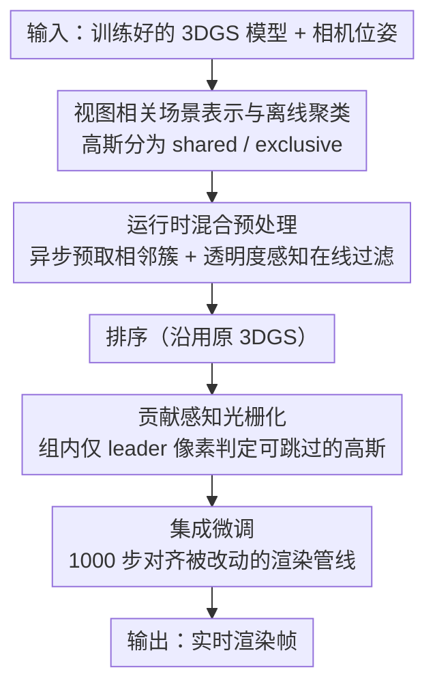

# Seele: A Unified Acceleration Framework for Real-Time Gaussian Splatting on Mobile Devices

**会议**: CVPR 2026  
**论文**: [CVF Open Access](https://openaccess.thecvf.com/content/CVPR2026/html/Zhu_Seele_A_Unified_Acceleration_Framework_for_Real-Time_Gaussian_Splatting_on_CVPR_2026_paper.html)  
**代码**: 项目页 http://seele-project.netlify.app（代码声明发表后开源）  
**领域**: 3D视觉  
**关键词**: 3D高斯泼溅, 实时渲染, 移动端加速, 光栅化优化, GPU并行

## 一句话总结
SEELE 是一个面向移动端的 3DGS 渲染加速框架，用「视图相关场景表示 + 在线过滤 + 异步预取」削减参与渲染的高斯数量、用「贡献感知光栅化」把算力集中到真正影响像素的少数高斯上，在四套主流 3DGS 算法上即插即用，最高获得 6.3× 加速与 39.1% 运行时模型缩减，且渲染质量不降反升。

## 研究背景与动机
**领域现状**：3D 高斯泼溅（3DGS）已成为自动驾驶、AR/VR 等实时应用的主力渲染技术，但这些场景普遍跑在算力受限的移动平台上。论文给出一个扎心的数字：车载旗舰模块 Nvidia AGX Orin 的算力只有工作站 A100 的 3.4%，在它上面原版 3DGS 在真实数据集上勉强跑到 20 FPS，离 VR 所需的 90 FPS 相去甚远。

**现有痛点**：作者把 3DGS 在移动端的瓶颈拆成三块——计算强度高（渲染一个像素要遍历上千个高斯）、渲染低效（所有高斯不分轻重走同一条光栅化管线）、显存吃紧（模型规模一大，所有高斯同时驻留显存难以承受）。已有工作各打一面：剪枝/量化（CompactGS、LightGaussian）以质量换效率；离线压缩（CompactGS、EAGLES）引入运行时解码开销；AABB/OBB 在线过滤只减少进入光栅化的高斯数，没碰光栅化本身的不均衡。

**核心矛盾**：所有高斯被「一视同仁」地处理，但作者实测发现——对每个像素而言，仅 1.5% 的高斯贡献了 99% 的最终颜色（Fig. 4）。统一管线把大量算力浪费在低贡献高斯上，而这正是低端 GPU 上实时性上不去的根因。同时，渲染某个视角根本不需要把全部高斯都载入显存。

**本文目标**：在不修改硬件、对现有 3DGS 管线只做极少量微调的前提下，同时缓解计算、渲染、显存三个维度的低效，把移动端 3DGS 推到实时。

**切入角度**：从「视图相关性」与「贡献不均衡」两个被忽视的结构性冗余下手——前者说明不同视角依赖不同高斯子集，后者说明像素颜色由极少数高斯决定。

**核心 idea**：离线把高斯按视角聚类成「共享/专属」两类、运行时只取相关簇并按透明度精过滤，再在光栅化阶段按贡献动态分配算力、跳过无关紧要的高斯混色。

## 方法详解

### 整体框架
SEELE 不改 3DGS 的训练流程，而是在「预处理」和「光栅化」两个阶段动刀。整体分两条线：**离线**把训练好的 3DGS 模型转成「视图相关场景表示」（高斯被聚类成跨视角共享的 shared 与各簇专属的 exclusive），并做一次轻量集成微调把改动带来的质量损失补回；**运行时**按当前相机位姿异步预取相邻簇进显存、用透明度感知的在线过滤剔除假相交高斯，再交给「贡献感知光栅化」按高斯对像素的贡献动态跳算。原版三步管线（预处理 → 排序 → 光栅化）中，排序保持不变，预处理被「混合预处理」替换、光栅化被「贡献感知光栅化」替换。

### 关键设计

**1. 视图相关场景表示与离线聚类：把「这个视角根本用不到的高斯」提前摘出去**

针对「全部高斯同时驻留显存、计算强度高」的痛点，作者的关键观察是：邻近视角倾向于复用相似的高斯，远离的视角则共享很少。于是离线阶段先随机采样相机位姿，按「位置 + 朝向」的加权相似度把它们聚成 $N$ 个簇——具体是把归一化相机位置 $\vec{x}$ 与视向 $\vec{v}$ 拼成向量 $(\vec{x}, \beta\vec{v})$（$\beta$ 平衡位置与朝向，聚类高斯时取 1）。对每个簇，按高斯对累积透射率的贡献 $\Gamma_i\alpha_i$ 取每像素 Top-$k$（$k=32$，再大收益甚微）作为主贡献者；把所有簇 Top 贡献者的并集判为 **shared 高斯**（任意视角都常驻显存），其余划为各簇的 **exclusive 高斯**。渲染时只取最近簇及其 $M-1$ 个邻簇（$M$ 经验取 3–4），其余高斯根本不进显存。这与「先载全部再剪枝」的旧思路相反——它从源头上让显存只装当前视角真正需要的那部分，从而把运行时模型缩减约 39.1%。

**2. 运行时混合预处理：在线过滤 + 异步预取，既精确剔除又不卡帧**

光靠离线聚类还不够，进入每个 tile 的高斯里仍有大量「在视锥内但其实不相交」的假阳性。作者在标准 $3\sigma$ 包络相交测试上引入不透明度：由于 $\alpha_i$ 低于阈值 $\alpha_\theta=\tfrac{1}{255}$ 的高斯会被跳过，相交条件可改写为 $(p-x_i')^T\Sigma_i'^{-1}(p-x_i') = \min(2\ln\tfrac{o_i}{\alpha_\theta}, 9)$，把不透明度纳入考量后能进一步滤掉假相交高斯，做到更细粒度的在线过滤。另一面，运行时按需载入高斯簇本身会带来非平凡开销、可能卡帧，作者用专用 GPU 流**异步预取**未来簇——对相机位姿做线性外推预测下一帧视角，把预取与当前帧渲染重叠。这套预取让运行时模型缩减 39.1% 的同时，额外开销仅占总延迟 <6%。

**3. 贡献感知光栅化：算力跟着贡献走，顺带消掉 warp 分歧**

这是针对「所有高斯一视同仁」最核心的一击。基于 1.5% 高斯决定 99% 像素的观察（低贡献高斯多落在低频区、方差大、梯度小、空间局部性好），算法把每 $h\times w$ 个像素编成一组 $P$（$h=w=2$）。每次迭代只让组内 **leader 像素**（第一个像素）对当前高斯算一次透明度 $\alpha$；若 $\alpha<\alpha_\theta$，则整组所有像素都跳过这个高斯的混色（Algo. 1）。重要的是它天然契合 GPU：一组像素映射到一个 warp，原本 warp 内线程要「锁步」等某个线程处理无关高斯（warp 分歧），现在由 leader 统一判定「跳或不跳」，整组要么一起跳要么一起算，从而消除 warp 内分歧、提升并行度（Fig. 5）。这与剪枝/量化的根本区别在于：它不削减模型，而是在渲染时**动态重分配算力**，因此质量几乎不损（PSNR 仅动 0.03）。

**4. 集成微调：用极小代价把管线改动引入的偏差校回来**

混合预处理与贡献感知光栅化都改了渲染管线，可能损害跨帧视图一致性。由于这两项都不参与反向传播，可无缝接进现有训练而不改梯度计算。作者在 3DGS 正常训练完、转成视图相关表示后，只额外微调 1000 步，损失为 $L_{total} = L_{3DGS} + \gamma\, L_{consistency}$，其中一致性损失用 7 帧的 F​LIP score 度量，$\gamma=0.1$。正是这步轻量微调让 SEELE 的渲染质量不降反升。

### 损失函数 / 训练策略
核心训练目标即上式 $L_{total} = L_{3DGS} + 0.1\, L_{consistency}$。一致性项基于 F​LIP（7 帧）感知差异度量，惩罚因管线改动导致的跨帧不一致。仅微调 1000 步，且两项加速技术不进梯度，故对原训练几乎零侵入。

## 实验关键数据

> 指标说明：**FPS** 为渲染帧率（越高越好）；**#Inst.** 为 Nsight Compute 统计的执行指令数（$10^6$，越低越省算力）；**Mem.** 为高斯点贡献的运行时模型显存（MB）；**F​LIP1 / F​LIP7** 为基于 1 帧 / 7 帧的视图一致性误差（越低越一致）；PSNR/SSIM/LPIPS 为标准渲染质量指标。

### 主实验
四套主流 3DGS 算法套上 SEELE 后，三套数据集（Mip-NeRF360 / Tanks&Temples / Deep Blending）质量普遍微升、效率大幅提升（平均 PSNR +0.28 dB、SSIM +0.004）：

| 算法 / 数据集 | PSNR↑ | FPS↑ | #Inst.(10⁶)↓ | Mem.(MB)↓ |
|--------|------|------|----------|------|
| 3DGS @ Mip-NeRF360 | 27.46 | 20.79 | 2168.68 | 710.6 |
| **SEELE + 3DGS** | **27.72** | **59.67** | **778.25** | **380.9** |
| 3DGS @ Tanks&Temples | 23.75 | 41.97 | 1034.37 | 430.9 |
| **SEELE + 3DGS** | **24.02** | **127.80** | **356.15** | **207.6** |
| MiniSplatting @ Mip-NeRF360 | 27.23 | 71.31 | 797.96 | 145.7 |
| **SEELE + MiniSplatting** | **27.70** | **131.62** | **436.41** | **106.5** |
| LightGaussian @ Mip-NeRF360 | 27.44 | 30.89 | 1533.50 | 59.4 |
| **SEELE + LightGaussian** | **27.56** | **76.36** | **589.85** | **39.1** |

按算法平均加速分别为 3DGS 3.2×、MiniSplatting 1.8×、LightGaussian 2.7×、AdR-Gaussian 1.7×（整体最高 6.3×）。3DGS 提速最大，因其高斯更密、视图相关冗余更多，混合预处理可分离的无关高斯也更多。视图一致性上 SEELE 也全面更优，如 3DGS 的 F​LIP7 从 0.0466 降到 0.0292。

### 跨硬件与消融
在低功耗 Orin NX 与工作站 A6000 上同样有效，且**越低端的 GPU 加速越明显**（资源越紧、优化收益越大）：

| 配置 | PSNR↑ | FPS↑ | Mem.(MB)↓ | 说明 |
|------|------|------|------|------|
| 3DGS（基线） | 27.46 | 20.79 | 710.6 | Mip-NeRF360 |
| +Opti. | 27.46 | 21.75 | 710.6 | 仅底层代码优化，约 1.1× |
| +Opti.+HP | 27.70 | 46.15 | 380.9 | 加混合预处理，额外约 2.8× |
| +Opti.+CR | 27.50 | 30.10 | 710.6 | 加贡献感知光栅化，额外约 1.3× |
| **SEELE（全量）** | **27.72** | **59.67** | **380.9** | 整体约 3.2× |

### 关键发现
- **加速主力是混合预处理（HP）**：单独 HP 就带来约 2.8× 加速，且 39.1% 的全部模型缩减都来自 HP（CR 与代码优化不省显存）。HP 配合微调还把 PSNR 平均提了 0.23。
- **贡献感知光栅化（CR）几乎零质量损耗**：单独贡献约 1.3× 加速，PSNR 仅动 0.03，验证「低贡献高斯本就可跳」的假设。
- **CR 可能增加指令数却仍提速**：因为它换来的 warp 分歧减少带来的并行收益盖过了多出的指令——说明瓶颈在并行效率而非纯指令量。
- **正交可叠加**：四套算法（含已剪枝的 MiniSplatting）都能再获提速，说明 SEELE 的冗余来源（视图相关 + 贡献不均）与已有压缩手段互补。

## 亮点与洞察
- **「贡献不均衡」的量化是全文支点**：1.5% 高斯决定 99% 像素这一实测，把「该不该分轻重」从直觉变成可执行的算力分配策略，比泛泛说「剪枝」更有针对性。
- **算法设计直接对齐 GPU 执行模型**：让 leader 像素统一判跳、整组锁步，把「跳算」与「消 warp 分歧」一举两得——这是把算法收益落到硬件吞吐上的巧思，可迁移到其他 tile/warp 级渲染任务。
- **shared/exclusive 二分 + 异步预取**：把「显存只装当前视角所需」做成可预取的流水线，避免按需载入卡帧，这套思路对任何视角连续变化的点云/体素渲染都适用。
- **零侵入式集成**：两项加速都不进反向传播，仅 1000 步微调即可，落地成本极低，对工业部署很友好。

## 局限与展望
- **依赖相机轨迹可预测**：异步预取用线性外推预测下一视角，遇到剧烈/不规则相机运动时预取可能落空，论文未充分讨论这类最坏情况。
- **离线聚类引入超参**：簇数 $N$、邻簇数 $M$、Top-$k$、平衡因子 $\beta$ 都需设定，跨场景的鲁棒性与自适应设置未深入探讨。⚠️ 部分敏感性分析作者放在补充材料，正文未给全。
- **质量提升幅度有限**：平均 PSNR +0.28 dB 更多是「不降反微升」，核心价值在效率而非质量；在已很稀疏的模型（如 MiniSplatting）上显存收益也缩水到 23.2%。
- **可改进方向**：把聚类/预取做成场景内容自适应、或与神经压缩联合训练，或许能在更稀疏模型上恢复加速比。

## 相关工作与启发
- **vs CompactGS / EAGLES（离线压缩）**：它们用向量量化/编码网络压模型但带来运行时解码开销，SEELE 不压模型、改的是渲染管线的算力分配，运行时近乎零额外解码。
- **vs LightGaussian / 各类剪枝（significance score）**：剪枝在质量与效率间做取舍且保留统一光栅化管线，SEELE 不删高斯、按贡献动态跳算，并能叠加在剪枝结果之上再提速。
- **vs FlashGS / Balanced3DGS（光栅化优化）**：FlashGS 软件流水重叠取数与光栅化、Balanced3DGS 离线调度平衡 workload，二者仍把高斯一视同仁；SEELE 独辟蹊径地利用「贡献不均衡」分配算力，且天然缓解 warp 分歧、无需改硬件。
- **vs AABB/OBB 在线过滤**：这些只减少进入光栅化的高斯数，SEELE 在此基础上把不透明度并入相交测试做更细过滤，并进一步动刀光栅化阶段本身。

## 评分
- 新颖性: ⭐⭐⭐⭐ 「贡献感知 + 视图相关」两个角度都切中 3DGS 被忽视的结构性冗余，贡献感知光栅化与 GPU warp 模型的对齐尤为巧妙。
- 实验充分度: ⭐⭐⭐⭐ 四套算法 × 三数据集 × 三种 GPU 的矩阵评测扎实，消融把三项贡献拆得清楚；部分敏感性分析下放补充材料。
- 写作质量: ⭐⭐⭐⭐ 瓶颈三分法清晰、动机与方法对应紧密，图示（Fig. 4/5）有效支撑论点。
- 价值: ⭐⭐⭐⭐ 即插即用、零侵入、对低端硬件收益更大，对移动端实时 3DGS 落地有直接实用价值。

<!-- RELATED:START -->

## 相关论文

- [\[CVPR 2025\] Mobile-GS: Real-time Gaussian Splatting for Mobile Devices](../../CVPR2025/3d_vision/mobile-gs_real-time_gaussian_splatting_for_mobile_devices.md)
- [\[CVPR 2026\] Urban-GS: A Unified 3D Gaussian Splatting Framework for Compact and High-Fidelity Aerial-to-Street Reconstruction](urban-gs_a_unified_3d_gaussian_splatting_framework_for_compact_and_high-fidelity.md)
- [\[CVPR 2026\] Changes in Real Time: Online Scene Change Detection with Multi-View Fusion](changes_in_real_time_online_scene_change_detection_with_multi-view_fusion.md)
- [\[CVPR 2026\] GHPT: Real-Time Relightable Gaussian Splatting using Hybrid Path Tracing](ghpt_real-time_relightable_gaussian_splatting_using_hybrid_path_tracing.md)
- [\[CVPR 2026\] Uni3R: Unified 3D Reconstruction and Semantic Understanding via Generalizable Gaussian Splatting from Unposed Multi-View Images](uni3r_unified_3d_reconstruction_and_semantic_understanding_via_generalizable_gau.md)

<!-- RELATED:END -->
