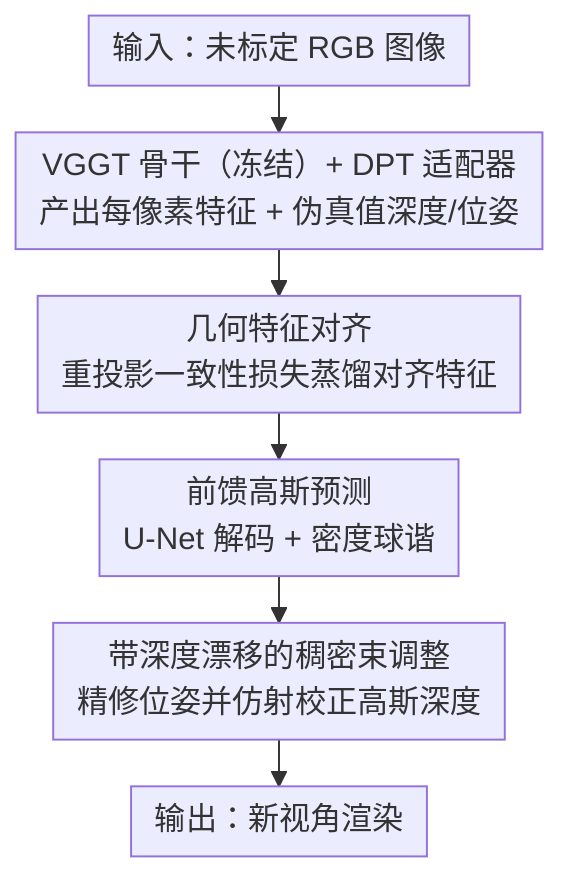

# Selfi: Self-improving Reconstruction Engine via 3D Geometric Feature Alignment

**会议**: CVPR 2026  
**论文**: [CVF Open Access](https://openaccess.thecvf.com/content/CVPR2026/html/Deng_Selfi_Self-improving_Reconstruction_Engine_via_3D_Geometric_Feature_Alignment_CVPR_2026_paper.html)  
**代码**: 项目页 https://denghilbert.github.io/selfi  
**领域**: 3D视觉  
**关键词**: 新视角合成, 3D视觉基础模型, 特征对齐, 高斯泼溅, 无位姿重建

## 一句话总结
Selfi 冻结 VGGT 这类 3D 视觉基础模型作骨干，仅训练一个轻量特征适配器——用 VGGT 自己输出的深度/位姿做伪标签、靠重投影一致性损失把特征蒸馏成「几何对齐」的新特征空间，从而把一个本不为高保真渲染设计的基础模型变成无位姿输入下 SOTA 的新视角合成与相机位姿估计引擎，全程零 3D 真值标注。

## 研究背景与动机
**领域现状**：传统新视角合成（NVS）依赖已知相机参数或先跑 SfM（检测关键点 → 匹配 → 解相机）再优化场景表示。前馈式 NVS 去掉了逐场景优化、一次前向直接预测 3D 基元，但大多仍假设相机已标定。

**现有痛点**：SfM 与场景表示解耦的管线计算重且脆弱——NVS 质量高度依赖 SfM 位姿精度，标定不准甚至失败时质量骤降。新近的 3D 视觉基础模型（VFM，如 DUSt3R、VGGT）能从未标定图像一次前向预测位姿、深度、3D 结构，绕开 SfM；但直接把 VFM 特征解码成 3D 高斯做 NVS，渲染质量明显落后于优化式方法。

**核心矛盾**：作者的判断是——VFM 特征虽对它被训练的几何预测任务很强，却**没有被显式优化成跨视角几何一致**，而这恰是高保真 NVS 的关键。换句话说，VFM 的特征空间「懂 3D 但不够对齐」。

**本文目标**：在不引入任何 3D 真值标注、不改 VFM 骨干的前提下，把预训练 VFM 改造成 SOTA 级的 NVS 与位姿估计引擎。

**切入角度**：既然 VFM 能输出还算靠谱的深度和相机，那就用它**自己的输出当稠密自监督信号**，去学一个几何对齐的新特征空间——这正是「self-improving / 自我改进」之名的来源。

**核心 idea**：冻结 VGGT，训一个轻量特征适配器，用「从一个视角把查询点重投影到其他视角」构造对应关系，强制对应位置的特征相似，得到既含语义又含 3D 邻近性的对齐特征；再把它喂给高斯预测头与束调整，闭环提升渲染和位姿。

## 方法详解

### 整体框架
Selfi 是一条「先对齐特征、再前馈出高斯、最后用束调整闭环回灌」的自改进管线。输入是一组未标定 RGB 图像：先用冻结的 VGGT 骨干 + DPT 适配器产出每像素特征，用 VGGT 自标注的深度/相机做伪真值、靠重投影一致性损失把特征训成几何对齐空间；对齐特征接一个 U-Net 解码器前馈预测每个像素的 3D 高斯参数（含一个关键的密度球谐）渲染新视角；同时用对齐特征建立的鲁棒对应做稠密束调整（BA）精修初始位姿，并把位姿修正经「深度漂移」仿射校正回灌到高斯位置，得到更高质量的最终渲染。三个贡献节点（特征对齐、高斯预测、带深度漂移的 BA）之间，VGGT+DPT 仅作骨干脚手架。

### 关键设计

**1. 几何特征对齐：用 VFM 自己的输出当伪标签，学一个跨视角一致的特征空间**

针对「VFM 特征不显式几何一致」的痛点，作者取 VGGT 的骨干与聚合器、外接一个 DPT 适配器 $F_i = \mathrm{DPT}_{adapter}(T_i)$（取四层中间 token，输出每像素 $C=24$ 维特征）。训练目标是让「3D 空间邻近」的位置特征相似。给定源帧 $s$ 的查询点 $n$ 与目标帧 $t$，先算特征余弦相似图 $S^n(u,v)=\frac{F_s^n\cdot F_t(u,v)}{\|F_s^n\|\|F_t(u,v)\|}$，经温度 $\tau$ 的 softmax 得权重 $w^n$，再以目标坐标的加权平均得到**预测对应** $\hat{p}_t^n=\sum_{u,v} w^n(u,v)[u,v]$（用全像素加权平均比对比学习提供更稠密的监督）。**伪真值对应**则由 VGGT 给出：对源像素按其深度 $D_s^n$ 反投影到 3D、变换到目标坐标系再投影回 2D 得 $p_t^n$，并用一个硬可见性图 $V_t^n$ 通过比较反投影 z 坐标与目标深度图来处理遮挡。对齐损失即可见性加权的对应误差 $L_{align}=\frac{1}{TN}\sum_t\sum_n V_t^n\|\hat{p}_t^n - p_t^n\|_2^2$。这样学出的特征同时编码语义内容与 3D 邻近性，且全程不需任何相机标注或 VFM 输出之外的 3D 监督。

**2. 前馈高斯预测与密度球谐：把对齐特征解成可渲染高斯，并用密度球谐对抗几何噪声**

拿到对齐特征图后，冻结 DPT 适配器、新训一个 U-Net 解码器：$F_s^{dec}=\mathrm{U\text{-}Net}(\mathrm{cat}(F_s, I_s))$，再分头输出四元数 $q_s$、尺度 $s_s$、颜色 $c_s$、不透明度 $\sigma_s$ 与深度残差 $\Delta D_s$；高斯中心由 $\mu_s=(D_s+\Delta D_s)\pi_K^{-1}p_s$ 反投影得到。本文的关键改动是：除颜色用球谐建模视相关效果外，**密度 $\sigma_s$ 也启用球谐**而非单标量。动机很具体——VGGT 的几何预测在低置信区域并不准，视相关密度等于学到一个「置信度度量」：对某个渲染视角，它会把不可靠的高斯调成近乎透明，从而克服遮挡与错位，还能据此剪掉低置信高斯提速。整个高斯头仅用 RGB 重建损失 $L_{RGB}=\frac{1}{T}\sum_t\|\hat{I}_t - I_t\|$ 训练。

**3. 带深度漂移的稠密束调整：用对齐特征做 BA 精修位姿，再把位姿修正一致地传回高斯**

对齐特征带来的鲁棒对应，让作者能用一个快速收敛的经典 BA 精修 VGGT 的初始位姿，比其他前馈方法对相机和高斯都做后优化更高效。但有个陷阱：BA 会同时改变与 2D 对应相关的稀疏 3D 点位置，若只换新位姿、不挪稠密高斯，渲染就会错位（Fig. 4a）。作者观察到 BA 引起的深度变化主要是**线性的**（Fig. 4c），于是从稀疏 BA 点估一个仿射变换 $\phi(\cdot)$ 并施加到所有稠密深度：$\mu_s'=\phi(D_s+\Delta D_s)\pi_{K'}^{-1}p_s$，尺度也按比例调整 $s_s'=\frac{\phi(D_s+\Delta D_s)}{D_s+\Delta D_s}s_s$。这个简单的「深度漂移」校正弥合了几何缺口，使 BA 的位姿提升能真正转化为 NVS 质量提升——消融显示不加校正时 BA 反而掉点。

### 损失函数 / 训练策略
两阶段训练：① 特征对齐阶段仅用对齐损失 $L_{align}$，在 DL3DV 上采 11 帧（中间帧为源、其余为目标），随机采 4096 个查询点，DPT + AdamW 训 150K 步，约 128 张 H100 跑 2 天；② 高斯头阶段用 RGB 重建损失 $L_{RGB}$，DL3DV + RealEstate10K 联合训练（6 源帧 + 帧间 5 目标帧），同样 150K 步约 1.5 天。可见性阈值 $\alpha=0.05$，softmax 温度 $\tau=100$，全程 JAX 实现。

## 实验关键数据

> 指标说明：PSNR/SSIM/LPIPS 为标准渲染质量指标；**AUC@N** 为相机位姿估计的精度曲线下面积（阈值 N 度，越高越准）。所有 NVS 评测在 RealEstate10K 与 DL3DV 的留出场景上进行。

### 主实验
在不同序列长度下，Selfi 全面超越前馈式 pose-free 基线（AnySplat、WorldMirror、Flare），短序列时甚至逼近用 GT 位姿 + SfM 初始化的逐场景优化 3DGS（作为上界）：

| 数据集 / 输入帧数 | 方法 | PSNR↑ | SSIM↑ | LPIPS↓ |
|--------|------|------|------|------|
| DL3DV / 6 帧 | 3DGS（GT 位姿，上界） | 25.63 | 0.8376 | 0.1985 |
| DL3DV / 6 帧 | AnySplat | 18.84 | 0.5665 | 0.2949 |
| DL3DV / 6 帧 | WorldMirror | 21.76 | 0.7389 | 0.2162 |
| DL3DV / 6 帧 | **Ours** | **24.94** | **0.8442** | **0.1566** |
| RE10K / 6 帧 | WorldMirror | 25.54 | 0.8691 | 0.1502 |
| RE10K / 6 帧 | **Ours** | **28.34** | **0.9021** | **0.1206** |

在 PixelSplat 的两视角约定下，Selfi 取得所有方法（含需要 GT 位姿的）中最好的 SSIM 与 LPIPS：

| 方法 | 类型 | PSNR↑ | SSIM↑ | LPIPS↓ |
|------|------|------|------|------|
| DepthSplat | 需位姿 | 27.47 | 0.889 | 0.114 |
| ReSplat | 需位姿 | 29.72 | 0.911 | 0.100 |
| NoPoSplat | 无位姿 | 26.82 | 0.880 | 0.125 |
| **Ours** | 无位姿 | 29.01 | **0.942** | **0.053** |

### 消融实验
DL3DV 上逐项叠加（Tab. 6）：

| 配置 | PSNR↑ | SSIM↑ | LPIPS↓ | 说明 |
|------|------|------|------|------|
| 全去（VGGT 原特征） | 22.53 | 0.759 | 0.240 | 基线 |
| + 特征对齐 | 23.29 | 0.792 | 0.210 | 对齐特征本身就涨 0.76 dB |
| + 对齐 + RGB 球谐 | 23.70 | 0.801 | 0.207 | 视相关颜色 |
| + 对齐 + RGB&密度球谐 | 24.67 | 0.835 | 0.169 | 密度球谐贡献最大 |
| + BA（无深度漂移） | 24.61 | 0.833 | 0.164 | 直接换位姿反而掉点 |
| + BA + 深度漂移 | 24.88 | 0.844 | 0.157 | 校正后才真正受益 |

位姿估计上（10 帧）Selfi 的 AUC@3 达 0.867，优于 VGGT+BA 的 0.835；更关键的是 100 帧时 Co-Tracker 因显存爆掉失败（OOM），Selfi 仍稳定输出。

### 关键发现
- **几何特征对齐是地基**：仅把 VGGT 原特征换成对齐特征（高斯头训练计划相同），NVS 就显著提升，印证「VFM 特征缺几何一致性」的假设。
- **密度球谐是单点收益最大的设计**：从 23.70 → 24.67（PSNR +0.97），它当作「学习到的置信度」把远离目标视角的高斯调透明，有效压制位姿/深度噪声。
- **BA 必须配深度漂移**：直接灌新位姿会让 NVS 掉点（24.67 → 24.61），加上仿射深度校正后才反超到 24.88——说明位姿与稠密高斯必须一致更新。
- **随帧数增多前馈方法普遍退化**，而 Selfi 退化最慢、并能 zero-shot 迁移到 MipNeRF360 / Tanks&Temples 的 BA 评测。

## 亮点与洞察
- **「用模型自己的输出当稠密伪标签」**：把 VGGT 的深度/位姿变成重投影对应监督，绕开 3D 真值标注，是 self-supervised 改造基础模型的一个干净范式，可迁移到其他 VFM。
- **密度也上球谐 = 学习式置信度**：把视相关性从颜色推广到密度，让模型自动「不信任」远视角的高斯，这一招同时解决遮挡、错位与剪枝，启发性强。
- **冻结骨干、只训小头即达 SOTA**：训练成本集中在轻量适配器/解码器，说明 VFM 里已蕴含足够 3D 先验，缺的只是「对齐」这一步。
- **深度漂移用线性仿射闭合 BA 与渲染的缝**：观察到 BA 深度变化近似线性、用一个仿射变换批量校正稠密高斯，简单却关键，是「让位姿提升真正转化为渲染提升」的临门一脚。

## 局限与展望
- **两视角下 PSNR 略低**：作者归因于两输入间的曝光差异、且模型为多视角 NVS 训练，输入仅两帧时鲁棒性下降（虽 SSIM/LPIPS 仍最优）。
- **强依赖 VGGT 质量**：整套自监督信号都来自 VGGT 的深度/位姿，若骨干在某类场景预测失准，伪标签会带偏对齐——论文未系统评估骨干失效的边界。
- **训练算力门槛高**：两阶段共需 128 张 H100 跑 3.5 天，复现成本不低。⚠️ 更多实现细节作者放在补充材料。
- **可改进方向**：让密度置信度显式建模不确定性、或把对齐损失扩展到时序/动态场景，可能进一步增强稀疏视角与长序列下的稳健性。

## 相关工作与启发
- **vs AnySplat / WorldMirror（前馈 pose-free 高斯）**：它们直接把 VFM 特征 token 解成高斯，未对齐特征，质量明显落后；Selfi 先做几何对齐再解码，在 6 帧 DL3DV 上 PSNR 高出 3–6 dB。
- **vs NoPoSplat / Flare（无位姿前馈）**：同为无位姿，Selfi 借对齐特征 + BA 闭环把 SSIM/LPIPS 推到全场最优。
- **vs Feat2GS（探针式复用 VFM 特征）**：Feat2GS 用 NVS 当代理任务探测 VFM 表示空间但直接复用其特征；Selfi 不止复用，而是主动学一个几何对齐空间，并证明该空间还能反哺位姿精修。
- **vs LVSM / RayZer（无 3D 表示直出图像）**：它们彻底放弃 3D 表示直接回归像素，Selfi 走每像素高斯参数化路线，保留可渲染的显式 3D 场景。
- **vs CoTracker（用于 BA 的匹配）**：Selfi 的对齐特征匹配在位姿精度上更优，且能扩展到 >40 张图（CoTracker 此时 OOM 失败）。

## 评分
- 新颖性: ⭐⭐⭐⭐⭐ 「用 VFM 自身输出做伪标签学几何对齐特征」是干净且有普适性的新范式，密度球谐与深度漂移两处设计都很巧。
- 实验充分度: ⭐⭐⭐⭐ 序列长度、重叠度、两视角、位姿估计多维评测充分，消融把每个设计拆得清楚；两视角 PSNR 略弱有合理解释。
- 写作质量: ⭐⭐⭐⭐⭐ 动机—假设—方法—验证逻辑闭环，图示（Fig. 2/4/6）有效支撑「特征对齐」与「视相关密度」等抽象概念。
- 价值: ⭐⭐⭐⭐ 把基础模型改造成无位姿 SOTA NVS 引擎、且零 3D 标注，对实用化无标定重建有明确意义，唯训练算力门槛偏高。

<!-- RELATED:START -->

## 相关论文

- [\[CVPR 2026\] Improving Human Image Animation via Semantic Representation Alignment](improving_human_image_animation_via_semantic_representation_alignment.md)
- [\[CVPR 2026\] PatchAlign3D: Local Feature Alignment for Dense 3D Shape Understanding](patchalign3d_local_feature_alignment_for_dense_3d_shape_understanding.md)
- [\[CVPR 2026\] BulletGen: Improving 4D Reconstruction with Bullet-Time Generation](bulletgen_improving_4d_reconstruction_with_bullet-time_generation.md)
- [\[CVPR 2026\] From None to All: Self-Supervised 3D Reconstruction via Novel View Synthesis](from_none_to_all_self-supervised_3d_reconstruction_via_novel_view_synthesis.md)
- [\[CVPR 2026\] Cross-Instance Gaussian Splatting Registration via Geometry-Aware Feature-Guided Alignment](cross-instance_gaussian_splatting_registration_via_geometry-aware_feature-guided.md)

<!-- RELATED:END -->
