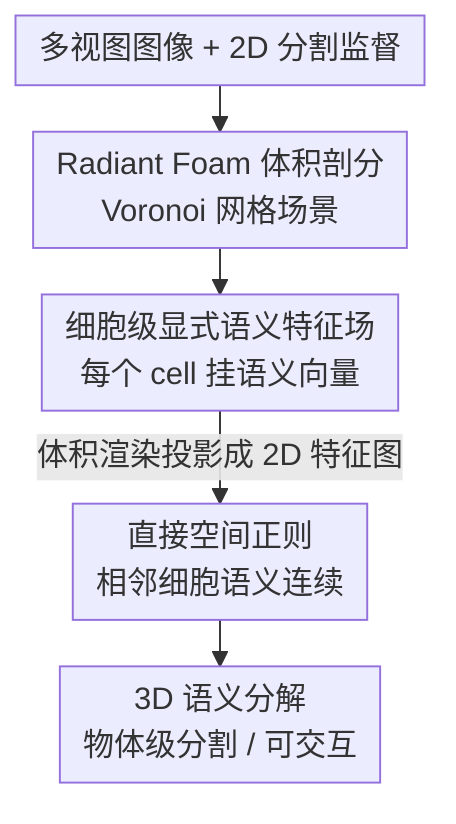

# Semantic Foam: Unifying Spatial and Semantic Scene Decomposition

**会议**: CVPR 2026 (Highlight)  
**arXiv**: [2604.26262](https://arxiv.org/abs/2604.26262)  
**代码**: 无（仅有 Project page）  
**领域**: 3D视觉 / 场景表示 / 3D语义分解  
**关键词**: Radiant Foam, Voronoi 网格, 3D 高斯泼溅, 语义特征场, 场景分解

> ⚠️ 本篇为 CVPR 2026 Highlight，截至撰写时缓存与 arXiv 仅提供摘要（HTML 全文未渲染、PDF 16MB 未下载）。下文「方法详解」中超出摘要的具体机制（监督信号来源、正则项形式、损失等）均为基于 Radiant Foam / 3DGS 分割文献的合理推断，已逐处标注 **⚠️ 以原文为准**。

## 一句话总结
把最近提出的 Radiant Foam（基于 Voronoi 网格的可微辐射场表示）扩展到语义分解任务：在每个 Voronoi 细胞上显式挂一套语义特征，借助网格天然的空间邻接关系做直接的空间正则，从而避免点基表示常见的遮挡/跨视图监督不一致伪影，在物体级分割上达到甚至超过 Gaussian Grouping、SAGA 等 SOTA。

## 研究背景与动机
**领域现状**：以 3D Gaussian Splatting（3DGS）为代表的现代场景重建方法，能以实时速度合成照片级真实感的新视角图像，已成为神经渲染的主流表示之一。

**现有痛点**：尽管渲染质量很好，这类表示在交互式图形应用中的落地却受限——相比人工创作（human-authored）的传统 3D 资产，它们很难"被编辑/被操作"。要支持交互，第一步就是把场景做**语义分解**（把"一团高斯"拆成可单独选中、移动、删除的物体）。已有工作（如 Gaussian Grouping、SAGA）尝试在 3DGS 上叠加语义分解，但**分割质量与跨视图一致性**始终是老大难。

**核心矛盾**：3DGS 这类**点基（point-based）/非结构化**表示缺乏显式的空间结构——每个高斯是各自飘着的、彼此不知道邻居是谁。于是当某视角下物体被遮挡、或不同视角给的 2D 监督互相矛盾时，语义标签就会在 3D 空间里"漏""糊""跳"，因为没有一个天然的结构去约束"空间上挨着的东西语义也应当连续"。

**本文目标**：拆成两个子问题——(1) 找一个**自带空间结构**的底层表示，让语义可以"挂在结构上"而不是飘在点云里；(2) 利用该结构提供**直接的空间正则**，压住遮挡/监督不一致带来的伪影。

**切入角度**：作者注意到新近的 **Radiant Foam** 用 **Voronoi 网格**来表示辐射场——场景被剖分成一堆 Voronoi 细胞（cell），细胞之间有明确的邻接关系，本质上是一个**显式的体积剖分（spatial volumetric decomposition）**。这恰好提供了 3DGS 缺失的"空间结构"。

**核心 idea**：在 Radiant Foam 的每个 Voronoi 细胞上**显式参数化一套语义特征场**，把"空间剖分"和"语义剖分"统一在同一套网格上；由于结构显式，相邻细胞之间可以直接做空间正则，从根上避免点基表示的不一致伪影。

## 方法详解

### 整体框架
Semantic Foam 把 Radiant Foam 的几何/外观表示当作底座，在其 **Voronoi 网格的细胞层级（cell-level）**额外挂一个**显式语义特征向量**，让同一套体积剖分同时承载"空间分解"和"语义分解"。整体上可以理解为：多视图图像先经 Radiant Foam 重建出 Voronoi 网格场景 → 每个细胞被赋予可学习的语义特征 → 用与渲染外观相同的体积渲染管线把语义特征投影成 2D 特征图，接受 2D 分割监督 → 关键在于，因为细胞是显式且彼此邻接的，可以**直接在 3D 网格上做空间正则**，让空间相邻的细胞语义连续，从而抹平遮挡和跨视图不一致造成的伪影 → 最终得到可被物体级选中/分解的 3D 场景。

⚠️ 以下流程的串接顺序符合摘要描述的"显式细胞特征 + 直接空间正则"，但各模块的具体实现（监督信号、渲染方式、正则项形式）为推断，**⚠️ 以原文为准**。

### 关键设计

**1. 把语义挂到 Voronoi 细胞上：用显式空间剖分替代飘散的点**

针对的痛点是点基表示"没有空间结构、语义飘在点云里"。Semantic Foam 不另起炉灶做语义场，而是**复用 Radiant Foam 已经把场景剖分好的 Voronoi 网格**：场景被划成一组 Voronoi 细胞，每个细胞由一个站点（site）定义，细胞之间有明确的邻接拓扑。作者在**细胞层级**显式参数化一个语义特征向量 $f_i$（第 $i$ 个细胞一套特征），于是"空间在哪里被切开"和"语义在哪里被切开"用的是**同一套剖分**——这就是标题里 "Unifying Spatial and Semantic" 的字面含义。相比把语义特征绑在各自独立的高斯上，显式网格让每个语义单元都知道自己的空间邻居是谁，为后续正则提供了结构抓手。⚠️ 特征维度、是否带可学习的 site 位置等细节以原文为准。

**2. 直接空间正则：用网格邻接关系压住遮挡/不一致伪影**

这是本文最核心、也最依赖"显式结构"的设计，针对的正是 Gaussian Grouping / SAGA 等点基方法的老大难——遮挡导致的标签泄漏、不同视角监督互相打架。因为 Voronoi 细胞是显式的且**邻接关系已知**，作者可以直接在 3D 空间上约束"相邻细胞的语义特征应当连续/相似"，形如对相邻细胞对 $(i,j)$ 施加平滑约束 $\sum_{(i,j)\in\mathcal{N}} w_{ij}\,\lVert f_i - f_j \rVert$（⚠️ 具体形式以原文为准）。这种正则是**直接作用在表示本身**、而非仅靠 2D 监督反传——点基方法做不到这点，因为它们没有现成的空间邻接图。其效果是：即便某些视角监督缺失或矛盾，3D 语义场也会被空间一致性"兜住"，避免出现悬空错标、边界破碎等伪影。

**3. 与外观共享体积渲染、对接 2D 分割监督**

⚠️ 此点为推断（摘要未明说监督来源），**以原文为准**。要训练细胞语义特征，需要把 3D 语义投影回 2D 与监督比对：沿用 Radiant Foam 的体积渲染，把沿光线穿过的细胞语义特征按权重累积成 2D 语义/特征图，再用来自图像的 2D 分割（如 SAM 类掩码、或 SAGA 风格的特征对比目标）做监督。由于语义复用了与外观一致的渲染路径，几何/外观与语义在空间上天然对齐，避免了"几何一套、语义另一套"的错位。

> ⚠️ **框架↔关键设计一致性**：框架图中"Radiant Foam 体积剖分"为底座脚手架（沿用已有工作，非本文新贡献），本文真正的贡献集中在设计 1（细胞级显式语义场）与设计 2（直接空间正则）；设计 3 为训练所需的监督接口。

### 损失函数 / 训练策略
⚠️ 摘要未给出损失细节，以下为合理推断，**以原文为准**：总损失大致为「2D 语义监督项（分割/特征对比损失） + 空间正则项（相邻细胞语义平滑）」的加权和，可能还保留 Radiant Foam 原有的光度重建项以维持几何/外观。空间正则权重是关键超参，过小则压不住伪影、过大则糊掉物体边界。

## 实验关键数据

> ⚠️ 仅有摘要，未获得具体数值表；下表为根据摘要结论整理的**定性对比**，数值留空待原文补全。

### 主实验（物体级分割，定性结论）

| 对比对象 | 任务 | 本文（Semantic Foam） | 备注 |
|----------|------|------------------------|------|
| Gaussian Grouping | 物体级 3D 分割 | comparable or superior | 摘要明确声称达到/超过 ⚠️ 具体指标以原文为准 |
| SAGA | 物体级 3D 分割 | comparable or superior | 同上 |

### 消融实验

⚠️ 摘要未提供消融数据，以下为根据方法设计**预期**的消融维度（数值待原文）：

| 配置 | 关键指标 | 说明 |
|------|---------|------|
| Full model | — | 完整模型（细胞语义场 + 空间正则） |
| w/o 空间正则 | 预计下降 | 去掉直接空间正则后，遮挡/跨视图不一致伪影应回归 |
| w/o 显式细胞结构 | 预计下降 | 退化到点基语义，失去邻接正则的抓手 |

### 关键发现
- ⚠️ 以原文为准：按方法逻辑，**直接空间正则**应是掉点最多的模块——它是本文相对 3DGS 点基方法的核心增量。
- 摘要强调的优势场景是**遮挡严重 / 跨视图监督不一致**的情形，这正是点基表示翻车、而显式网格正则能兜底的地方。

## 亮点与洞察
- **"换底座"而非"打补丁"**：以往 3DGS 语义分解是在非结构化点云上事后叠语义；本文直接换到自带空间剖分的 Radiant Foam 上，让空间结构成为语义一致性的天然来源——这是个很聪明的"选对表示，问题自动变简单"的思路。
- **显式邻接 = 可做直接 3D 正则**：很多 3DGS 分割方法只能靠 2D 监督间接约束 3D，本文因为有 Voronoi 邻接图，可以**直接在 3D 上**约束语义平滑，这个能力可迁移到任何带显式网格/剖分的神经表示上（如做 3D 编辑、物理仿真的边界一致性）。
- **空间与语义统一在一套剖分**：把"几何切分"复用为"语义切分"，省去维护两套表示的错位风险，是个干净的工程/表示设计。

## 局限性 / 可改进方向
- ⚠️ 强依赖 **Radiant Foam** 这一较新的底层表示，其重建质量/速度/适用范围直接决定 Semantic Foam 的上限；对仍以 3DGS 为主的生态迁移成本较高。
- 摘要未给数值，**comparable or superior** 的措辞偏保守，可能在部分指标上只是持平而非显著超越——具体强弱需看原文表格。
- 空间正则的强度需要在"压伪影"与"保物体边界锐利"之间权衡，过强正则可能糊掉细小物体或薄结构（自己推测的局限）。
- 无开源代码（仅 Project page），复现门槛较高。

## 相关工作与启发
- **vs Gaussian Grouping**：Gaussian Grouping 在 3DGS 上给每个高斯学一个 identity/grouping 特征、靠 2D 掩码监督；本文换到 Voronoi 网格、在**显式细胞**上挂语义并能做**直接空间正则**。区别在于"有没有现成的空间邻接结构去约束 3D 语义连续性"——这正是本文宣称在遮挡/不一致场景更稳的原因。
- **vs SAGA**：SAGA 把 SAM 的分割能力蒸馏进 3DGS 特征场，同样是点基、靠特征对比；本文的增量在于底层表示的**显式体积剖分**带来的结构化正则，而非分割监督信号本身。
- **vs Radiant Foam（底座）**：Radiant Foam 解决的是"用 Voronoi 网格做高质量可微辐射场重建"；本文是其下游扩展，把该表示从**几何/外观**推广到**语义分解**任务。

## 评分
> ⚠️ 仅基于摘要打分，待全文校准。

- 新颖性: ⭐⭐⭐⭐ 把语义分解嫁接到 Voronoi 网格表示、用显式邻接做直接空间正则，角度新且自洽；但属于"已有新表示 + 语义扩展"的组合式创新。
- 实验充分度: ⭐⭐⭐ ⚠️ 摘要仅给定性结论（comparable or superior），无法核实充分度，暂保守。
- 写作质量: ⭐⭐⭐⭐ 摘要问题—矛盾—方案链条清晰，CVPR Highlight 佐证表达质量。
- 价值: ⭐⭐⭐⭐ 切中 3DGS 类表示"难交互/难分解"的真实痛点，对可交互神经场景资产有实际意义。

<!-- RELATED:START -->

## 相关论文

- [\[CVPR 2026\] Learning Spatial-Temporal Consistency for 3D Semantic Scene Completion](learning_spatial-temporal_consistency_for_3d_semantic_scene_completion.md)
- [\[CVPR 2026\] AdaSFormer: Adaptive Serialized Transformers for Monocular Semantic Scene Completion from Indoor Environments](adasformer_adaptive_serialized_transformers_for_monocular_semantic_scene_complet.md)
- [\[CVPR 2026\] EmbodiedSplat: Online Feed-Forward Semantic 3DGS for Open-Vocabulary 3D Scene Understanding](embodiedsplat_online_feed-forward_semantic_3dgs_for_open-vocabulary_3d_scene_und.md)
- [\[ICCV 2025\] Disentangling Instance and Scene Contexts for 3D Semantic Scene Completion](../../ICCV2025/3d_vision/disentangling_instance_and_scene_contexts_for_3d_semantic_scene_completion.md)
- [\[CVPR 2026\] PointGS: Semantic-Consistent Unsupervised 3D Point Cloud Segmentation with 3D Gaussian Splatting](pointgs_semantic-consistent_unsupervised_3d_point_cloud_segmentation_with_3d_gau.md)

<!-- RELATED:END -->
