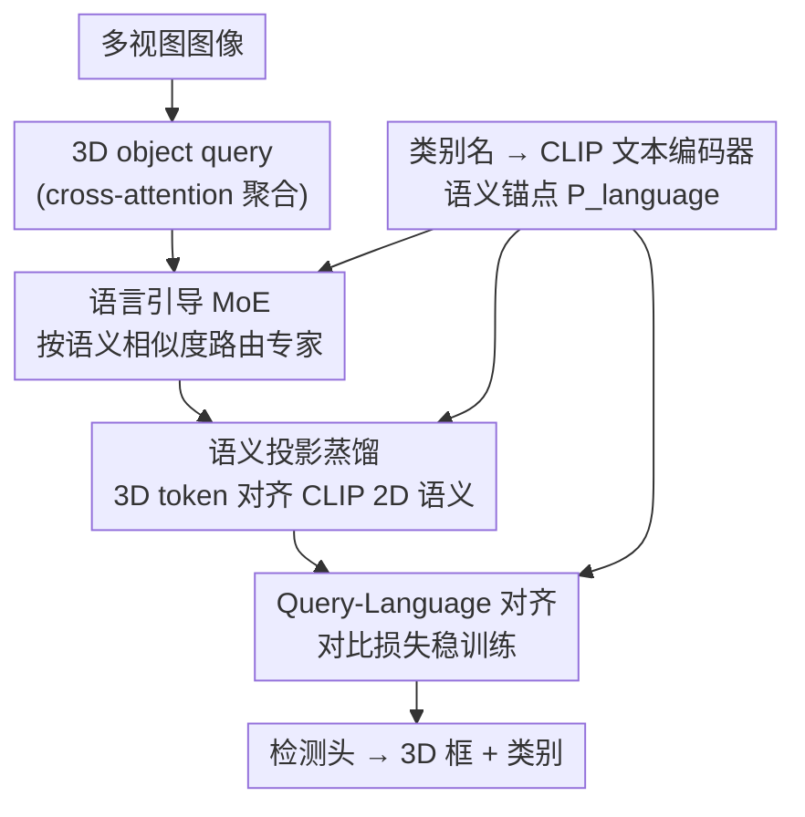

# SemLT3D: Semantic-Guided Expert Distillation for Camera-only Long-Tailed 3D Object Detection

**会议**: CVPR 2026  
**arXiv**: [2604.18476](https://arxiv.org/abs/2604.18476)  
**代码**: 无  
**领域**: 3D视觉 / 自动驾驶 / 长尾学习  
**关键词**: 纯相机3D检测, 长尾分布, 语言引导MoE, CLIP蒸馏, nuScenes

## 一句话总结
针对纯相机多视图 3D 检测里"罕见但安全攸关"类别（儿童、急救车、婴儿车）样本极少、还伴随类内多样和类间混淆的问题，SemLT3D 用 CLIP 的语言/视觉先验做两件事——按语义相似度把 3D query 路由到专家（语言引导 MoE）+ 把 CLIP 的 2D 语义蒸馏进 3D token（语义投影蒸馏），作为即插即用模块挂到 StreamPETR/Far3D 上，在 nuScenes 18 类设定下尾类 mAP 明显提升、整体 mAP/NDS 也涨。

## 研究背景与动机

**领域现状**：纯相机 3D 检测因为部署成本低、易规模化，已成为 LiDAR 的有力替代，主流是 query-based 范式（PETR/StreamPETR/Far3D 这一脉）：初始化一组 3D object query，从多相机视角聚合视觉信息形成 3D token，再由检测头解码出位置和类别。

**现有痛点**：这些方法几乎都只盯整体 mAP/NDS，却忽视了驾驶数据天然的长尾（Zipfian）分布——car、adult 这类头部类满天飞，而 child、emergency vehicle、stroller、debris 这些尾类样本极度稀缺。偏偏这些罕见类往往安全风险最高：漏检一个儿童或急救车可能是灾难性的。更糟的是 nuScenes 标准协议把 child、警察、施工人员、婴儿车全揉进 pedestrian 一个粗类，把关键的安全差异直接抹掉了。

**核心矛盾**：尾类难学不只是"样本少"。还叠加两个固有难点——**类内多样性（intra-class diversity）**：同一个尾类内部视觉差异巨大（debris 可以是垃圾桶、梯子或散落的货物）；**类间模糊性（inter-class ambiguity）**：语义相近的类视觉高度重叠（警察穿反光背心和施工人员难分，某些视角下警车就像普通 car）。单一统一模型在长尾数据上优化必然被头部类主导，尾类拿不到足够监督。

**本文目标**：在不引入 LiDAR、不增加整体模型复杂度的前提下，同时缓解数据稀缺、类内多样、类间模糊三件事。

**切入角度**：作者借鉴成熟的 2D 长尾经验——但注意到 2D 的重采样/重加权受限于尾类样本本身有限、无法补上"表示缺失"，而用额外数据或 CLIP 补语义的做法直接搬到 3D 又有巨大 domain gap。于是关键观察是：**语义先验（语言 embedding + CLIP 视觉特征）可以绕过"样本数"这个瓶颈，直接为尾类丰富表示空间**。

**核心 idea**：用语言语义来"组织"专家路由（让语义相近的类共享专家、各类专精），同时把 CLIP 的 2D 语义对齐蒸馏进 3D token，用语义结构化学习换取尾类的判别力。

## 方法详解

### 整体框架
SemLT3D 不重新设计检测器，而是作为即插即用模块挂在 query-based 检测器（nuScenes 上用 StreamPETR、AV2 上用 Far3D）之上。骨干流程不变：多视图图像 → 一组 3D object query 经 cross-attention 聚合视觉信息 → 检测头解码 3D 框和类别。SemLT3D 在 query 精炼这一环插入三个语义驱动的组件，从三个角度攻克长尾难点：(1) **语言引导 MoE（LMoE）** 替换 transformer block 里的 FFN，按语义相似度把 query 路由到专家，专治类内多样；(2) **语义投影蒸馏（SPD）** 把 CLIP 的 2D 视觉-语言先验注入 3D token，专治类间模糊与数据稀缺；(3) **Query-Language 对齐** 用对比损失稳住训练、让 query 和语言空间对齐。三者共享同一套 CLIP 文本 embedding $P^{\text{language}}$ 作为语义锚点。

### 关键设计

**1. 语言引导混合专家 LMoE：用语言相似度路由，让语义相近的类共享专家**

针对类内多样性：统一 FFN 对所有 query 做同一种变换，尾类的异质外观被头部类主导的优化淹没。LMoE 把 transformer block 里的 FFN 换成"路由器 + $M$ 个轻量专家 + 1 个共享专家"（都是轻量线性层），让每个专家专精一组语义相关的类别，从而降低类间干扰、捕捉尾类内部的独特变化。

关键创新在**路由信号的设计**。DETR 式检测器直接套用 LLM 的 MoE 层往往导致"均匀路由"，形不成有意义的语义专精。作者不把高维 query 特征喂给路由器，而是先把 cross-attention 后的 3D query $Q\in\mathbb{R}^{k\times D}$ 投影到语言空间得 $\hat{Q}=\mathrm{Linear}(Q)$，再用 CLIP 文本编码器把类别名转成语义锚点 $P^{\text{language}}=\mathrm{CLIP}_{\text{language}}(\textit{categories})\in\mathbb{R}^{n\times d}$，然后**用 query 与各类名 embedding 的相似度向量** $S^{l}=\mathrm{sim}(\hat{Q},P^{\text{language}})\in\mathbb{R}^{k\times n}$ 作为路由器输入（$\mathrm{sim}$ 为余弦相似度）。这样语义相近的 query 天然被分到同一专家——比如 adult、警察、debris 这类"类人"目标因身高/体态/空间位置相近而聚到一起，车辆类聚到另一处（论文 Fig.3 显示出清晰的语义划分，而 vanilla MoE 是均匀的）。

路由权重 $W=\mathrm{Softmax}(R)$，$R=\mathrm{Router}(S^{l})$；每个 query 取 top-$k$ 专家聚合，同时过一个共享专家 $E^s$ 保留通用知识：
$$y^{e}=\sum_{i\in\mathcal{T}}W_{i}E^{R}_{i}(Q),\qquad \bar{Q}=y^{e}+E^{s}(Q)$$
$\mathcal{T}$ 是选中的 top-$k$ 专家集合。为防止专家被冷落，加辅助均衡损失 $\mathcal{L}_{\text{balance}}=M\cdot\sum_{i=1}^{M}\mathcal{F}_i\cdot\mathcal{P}_i$，其中 $\mathcal{F}_i$ 是分给专家 $E_i$ 的 query 比例、$\mathcal{P}_i$ 是该专家的平均路由概率。为保持复杂度不变，共享专家隐层设 1024、每个专家 512，配 top-$k=2$ 恰好等于原 FFN 的 2048 维。

**2. 语义投影蒸馏 SPD：把 CLIP 的 2D 视觉-语义当老师，蒸馏进 3D token**

针对类间模糊与数据稀缺：警察 vs 施工人员这种靠微妙上下文（站在街角还是工地旁）区分的类，CLIP 能很好捕捉。SPD 让 CLIP 当老师，把视觉-语言先验蒸馏进 3D object token，目标有三：直接增强 3D token 的特征学习、为罕见/相似类注入语义先验、通过语言-视觉对齐促进类间解耦。

具体做法是构造一对"学生-老师"相似度分布。先把精炼后的 3D token $\bar{Q}$ 借相机外参 $E\in\mathbb{R}^{C\times 16}$ 变成相机对齐表示 $Q_c=\mathrm{Linear}(\bar{Q})\odot\mathrm{Linear}(E)\in\mathbb{R}^{C\times k\times d}$（$\odot$ 为 Hadamard 积，$C$ 是相机数），使 3D token 能在多视角下被 2D CLIP 特征直接监督。再做 Hungarian 匹配，把匹配上的 GT 3D 框投影到 2D 图像平面，裁出目标区域喂 CLIP 图像编码器得 $P^{\text{visual}}_g=\mathrm{CLIP}_{\text{visual}}(\tilde{I}_g)$——它既含类语义又含周围上下文。**学生分布**是相机对齐 query 与语言锚点的相似度 $S^s_g=\mathrm{sim}(Q^c_g,P^{\text{language}})$，**老师分布**是 CLIP 视觉特征与语言锚点的相似度 $S^t_g=\mathrm{sim}(P^{\text{visual}}_g,P^{\text{language}})$，用 KL 散度让学生逼近老师：
$$\mathcal{L}_{\mathrm{KD}}=\frac{1}{G}\sum_{g=1}^{G}\mathcal{L}_{\mathrm{KL}}(S^s_g,S^t_g)$$
妙在不是直接回归 CLIP 特征，而是蒸馏"在语言空间上的相似度分布"——把 2D 老师对各类的判别结构搬给 3D 学生，对尾类和易混类的判别尤其有用。

**3. Query-Language 对齐：对比损失稳训练、显式拉齐 query 与语言空间**

前两个模块都依赖"query 投影到语言空间后是否对齐得好"，若对齐漂移训练会不稳。作者额外加一个对比损失：用 query 与语言 embedding 的点积相似度当分类 logits，再用 focal loss 监督：
$$\mathcal{L}_{\text{contrast}}=\mathcal{L}_{\text{Focal}}(\mathrm{sim}(\hat{Q},P_{\text{language}}),T)$$
$T\in\mathbb{R}^{k\times n}$ 是 Hungarian 匹配得到的 query-类别目标。与 DETR 一致，这个对比损失作为辅助损失加在每个 decoder 层，让对齐随层数渐进、稳定收敛。消融显示它能再补一截尾类性能。

### 损失函数 / 训练策略
总损失 = 检测器原损失 + $\mathcal{L}_{\text{contrast}}$（权重 1.0）+ $\mathcal{L}_{\mathrm{KD}}$（权重 0.5）+ $\mathcal{L}_{\text{balance}}$（权重 0.01）。蒸馏老师用 CLIP-B/16。nuScenes 上基于 StreamPETR 训 60 epoch（ResNet-50/101），AV2 上基于 Far3D 同配置。LMoE 用 4 专家 + top-$k=2$。全部实验在 8×A100(40GB) 上跑。

## 实验关键数据

### 主实验
nuScenes 验证集，扩展到 18 类长尾设定（而非标准 10 类）：

| 数据集 | Backbone | 指标 | 本文 | StreamPETR baseline | 提升 |
|--------|----------|------|------|----------|------|
| nuScenes | ResNet-50 | mAP | 29.59 | 26.97 | +2.62 |
| nuScenes | ResNet-50 | NDS | 40.94 | 38.19 | +2.75 |
| nuScenes | ResNet-101 | mAP | 31.12 | 30.16 | +0.96 |
| nuScenes | ResNet-101 | NDS | 42.79 | 41.17 | +1.62 |
| AV2 | VoV-99 | mAP | 25.9 | 24.4 (Far3D) | +1.5 |
| AV2 | VoV-99 | CDS | 19.4 | 18.1 (Far3D) | +1.3 |

推理时间仅增加 ResNet-50 +9.1% / ResNet-101 +8.16%，开销可控。

长尾分组（Many/Medium/Few）mAP 拆解（nuScenes，C=纯相机）：

| 方法 | 模态 | All | Many | Medium | Few |
|------|------|-----|------|--------|-----|
| StreamPETR | C | 26.97 | 53.32 | 28.53 | 3.22 |
| Ours | C | 29.59 | 50.92 | 34.55 | 6.03 |
| Ours* (ViT) | C | 41.1 | 62.08 | 40.62 | 20.77 |
| BEVFusion† | L+C | 45.5 | 75.5 | 52.0 | 12.8 |

相对 baseline：Medium +6.02、Few +2.81，Many 仅微降；换 ViT backbone 后纯相机方案在 Few 上甚至比多传感器 BEVFusion 高 +10.17 mAP。

### 消融实验
逐模块叠加（nuScenes val，起点为 StreamPETR baseline）：

| 配置 | mAP | NDS | Many | Medium | Few |
|------|-----|-----|------|--------|-----|
| baseline | 26.97 | 38.19 | 53.32 | 28.53 | 3.22 |
| + 仅 SPD | 28.30 | 39.13 | 49.6 | 32.1 | 5.82 |
| + vanilla MoE | 26.37 | 37.47 | 51.48 | 30.73 | 0.32 |
| + 语义引导路由 | 27.50 | 37.59 | 51.7 | 32.16 | 2.25 |
| + SPD（叠 MoE）| 28.56 | 40.26 | 49.48 | 32.2 | 6.9 |
| + 对比对齐（Full）| 29.59 | 40.94 | 50.92 | 34.56 | 6.03 |

### 关键发现
- **vanilla MoE 反而有害**：无引导路由把 mAP 拉到 26.37、Few 暴跌到 0.32；加上语义引导路由立刻翻盘（Few 回到 2.25、Medium 涨到 32.16），证明"语言相似度路由"才是 MoE 在长尾下生效的关键，而非 MoE 本身。
- **SPD 单独就很强**：只加 SPD 就把 mAP 从 26.97 拉到 28.30、Few 从 3.22 翻到 5.82，说明 CLIP 语义先验对尾类/中频类贡献突出。
- **LMoE 配置**（Table 5）：4 专家 + top-$k=2$ 是最佳折中（29.59 mAP）；专家加到 8 个虽提升 Few（top-$k=1$ 达 8.6）但拖累 Many/Medium，过度扩容导致路由失衡、专家闲置。
- **CLIP 大小**（Table 6）：ViT-L/14 略好（29.63）但训练/推理成本大增，最终选 ViT-B/16（29.59）平衡精度与成本。
- t-SNE 可视化显示 SemLT3D 对 adult/child/施工人员形成更紧凑可分的簇，对 trailer 的不同变体形成清晰子簇，印证 SPD 缓解类间模糊、LMoE 缓解类内多样。

## 亮点与洞察
- **把"样本数瓶颈"换成"语义先验注入"**：长尾的根子是尾类样本少、表示缺失，重采样/重加权治标不治本。SemLT3D 绕过样本数，用 CLIP 的语言/视觉语义直接丰富尾类表示空间——这个思路可迁移到任何苦于长尾的检测/分割任务。
- **路由信号用"语言相似度"而非"原始特征"**：一行改动（把 router 输入从高维 query 换成 query-类名相似度向量）就让 MoE 从"均匀路由"变成"语义专精"，这是 MoE 在长尾下到底有没有用的胜负手，很具启发性。
- **蒸馏的是"语言空间上的相似度分布"而非特征本身**：用 KL 对齐学生/老师的"对各类的相似度结构"，比直接回归 CLIP 特征更稳、且天然带类间判别信息，是个轻量但聪明的蒸馏设计。
- **全程即插即用**：StreamPETR、Far3D 都能挂，推理只增约 8-9%，对实际部署友好。

## 局限性 / 可改进方向
- **绝对精度仍受限**：纯相机 18 类 Few 组只有 6.03 mAP，距实用还远；只有换 ViT backbone 才把 Few 拉到 20.77，意味着收益相当依赖更强 backbone，轻量 backbone 下尾类仍很弱。
- **car 类有小幅掉点**：作者承认整体优化 trade-off 导致 car 略降——语义专精在头部类上未必无损。
- **强依赖 CLIP 文本对类名的语义质量**：路由和蒸馏都建立在"类别名 → CLIP embedding"的语义合理性上，对于命名歧义大或 CLIP 见得少的类（如 debris 这种宽泛类）语义先验可能不准，论文未深究这一失效边界。
- **未给出 open-vocabulary 能力**：方法用到 CLIP 语义却仍是闭集 18 类，没探索对训练时未见类别的泛化，是个自然延伸方向。

## 相关工作与启发
- **vs LT3D / FOMO-3D（LiDAR 或多模态长尾）**：它们靠 LiDAR、相机-LiDAR 融合或多阶段（LiDAR-VLM、LiDAR-2D 检测器）流水线提尾类召回，效果好但带来同步复杂度、硬件成本和延迟。SemLT3D 坚持纯相机、单阶段、即插即用，牺牲部分绝对精度换可部署性。
- **vs CBGS（LiDAR 上采样/复制粘贴）**：CBGS 在数据层面补样本；SemLT3D 在表示层面补语义，不依赖样本扩增。
- **vs 2D 长尾的重采样/重加权与 few-shot 迁移**：2D 方法受尾类样本上限制约、或需训多个模型代价高，且直接搬到 3D 有 domain gap。SemLT3D 用语言引导 MoE + CLIP 蒸馏把 2D 长尾的成熟思路桥接进统一可扩展的相机-only 3D 框架。
- **vs 标准 MoE（LLM 式）**：标准 MoE 在 DETR 检测器上趋于均匀路由、形不成语义专精；本文用语言相似度重设路由信号，是核心区别。

## 评分
- 新颖性: ⭐⭐⭐⭐ 首个聚焦"纯相机 3D 检测长尾"的工作，"语言相似度路由 + 语义分布蒸馏"组合在该问题上很贴切。
- 实验充分度: ⭐⭐⭐⭐ 两数据集、18/26 类长尾设定、Many/Medium/Few 拆解 + 多组消融（模块/专家配置/CLIP 大小）齐全，但缺与更多长尾专用方法的直接对比。
- 写作质量: ⭐⭐⭐⭐ 动机-难点-方法对应清晰，三模块各打一个痛点讲得明白。
- 价值: ⭐⭐⭐⭐ 抓住安全攸关的罕见类问题，即插即用、低开销，对纯相机自动驾驶感知有实际意义。

<!-- RELATED:START -->

## 相关论文

- [\[CVPR 2026\] Towards Intrinsic-Aware Monocular 3D Object Detection](towards_intrinsic-aware_monocular_3d_object_detection.md)
- [\[CVPR 2026\] MonoSAOD: Monocular 3D Object Detection with Sparsely Annotated Label](monosaod_monocular_3d_object_detection_with_sparsely_annotated_label.md)
- [\[CVPR 2026\] Unleashing the Power of Chain-of-Prediction for Monocular 3D Object Detection](unleashing_the_power_of_chain-of-prediction_for_monocular_3d_object_detection.md)
- [\[CVPR 2026\] Zoo3D: Zero-Shot 3D Object Detection at Scene Level](zoo3d_zero-shot_3d_object_detection_at_scene_level.md)
- [\[CVPR 2026\] Long-SCOPE: Fully Sparse Long-Range Cooperative 3D Perception](long_scope_fully_sparse_long_range_cooperative_3d_perception.md)

<!-- RELATED:END -->
