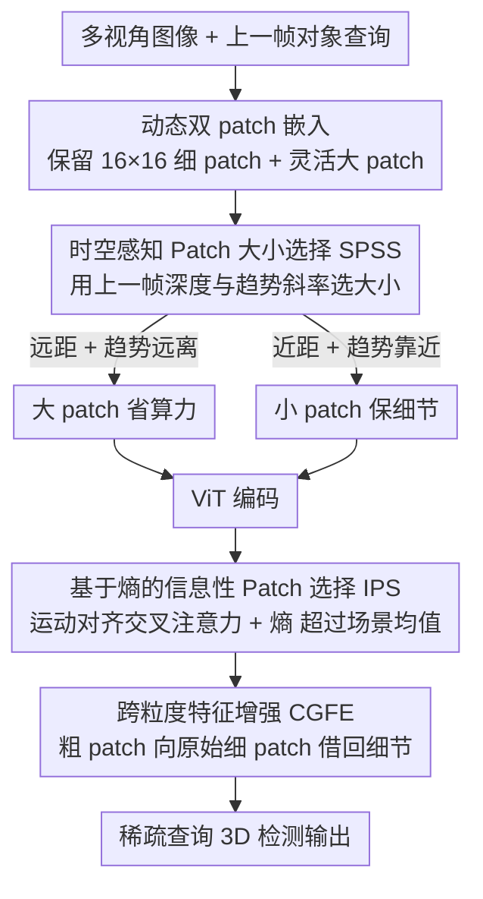

# SEPatch3D: Revisiting Token Compression for Accelerating ViT-based Sparse Multi-View 3D Object Detectors

**会议**: CVPR 2026  
**arXiv**: [2604.14563](https://arxiv.org/abs/2604.14563)  
**代码**: [github.com/Mingqj/SEPatch3D](https://github.com/Mingqj/SEPatch3D)  
**领域**: 3D视觉  
**关键词**: 3D object detection, token compression, patch size selection, multi-view detection, ViT acceleration

## 一句话总结

提出 SEPatch3D，通过时空感知的动态 patch 大小选择和基于熵的信息性 patch 筛选增强机制，在 ViT 基稀疏多视角 3D 检测中实现 57% 推理加速且保持可比检测精度。

## 研究背景与动机

ViT 基稀疏查询式多视角 3D 检测器（如 StreamPETR）性能优异但推理延迟高。现有 token 压缩策略的局限：(1) token 剪枝可能丢弃对困难负样本学习至关重要的信息性背景区域；(2) token 合并的不规则聚合破坏上下文一致性；(3) 简单增大 patch 大小超过阈值（如>18）会因丢失细粒度语义线索而性能下降。核心观察：增大 patch 可降低计算但需同时保留语义重要区域的细粒度信息。

## 方法详解

### 整体框架

SEPatch3D 要解决的是 ViT 基稀疏查询式多视角 3D 检测器（如 StreamPETR）精度好但推理太慢的问题，而它的切入点是「动态调 patch 大小」而非常规的剪枝/合并。整体是两阶段：先做动态双 patch 嵌入，由 SPSS 模块根据时空线索自适应选每帧的 patch 大小；再做选择性跨粒度特征增强，由 IPS 模块筛出信息性 patch、CGFE 模块用对应的细粒度 patch 把这些粗 patch 补回细节。

### 关键设计

**1. 时空感知 Patch 大小选择 SPSS：用上一帧的物体远近决定这一帧切多大**

单纯把 patch 调大能省算力，但超过阈值（如 >18）就会丢细粒度语义、掉点。SPSS 的思路是让 patch 大小跟着场景走：利用前一帧对象查询的平均深度 $\bar{D}^{T-1}$ 和深度趋势斜率变化 $\Delta S^{T-1}$ 来决策——远距物体 + 趋势远离就用大 patch 省计算，近距物体 + 趋势靠近就用小 patch 保细节，其余情况沿用前帧设置以保证时间稳定性。这样算力花在该花的地方，又避免了连续帧间 patch 大小突变。

**2. 基于熵的信息性 Patch 选择 IPS：用信息熵自适应地圈出值得补细节的区域**

要补细节就得先知道哪些 patch 值得补，固定 Top-K 又适应不了不同复杂度的场景。IPS 先通过运动对齐的历史查询做交叉注意力增强 patch 特征，再对 L2 归一化后的特征算信息熵，把熵值超过场景均值的 patch 选为信息性区域。用「超过均值」这个自适应阈值代替固定 Top-K，场景越复杂选得越多，刚好匹配场景复杂度。

**3. 跨粒度特征增强 CGFE：让粗 patch 向原始细 patch 借回丢掉的细节**

被选中的粗粒度 patch 直接用会缺细节。CGFE 让这些粗 patch 当 query、对应区域的原始细粒度 patch 当 key/value，通过位置编码增强的交叉注意力把细节注入进来，再用残差连接保住全局结构。信息性 patch 往往落在纹理丰富或边缘处，正是粗 patch 损失最大的地方，所以这一步能在大幅加速的同时把检测精度基本保住。

### 损失函数 / 训练策略

继承 StreamPETR 的检测损失，端到端训练。双 patch 嵌入中保留原始 16×16 小 patch 提供细粒度特征参考，灵活的大 patch 则用于高效推理。

## 实验关键数据

### 主实验

| 方法 | 骨干 | NDS(%) | mAP(%) | 推理时间 |
|------|------|--------|--------|---------|
| StreamPETR (patch=16) | ViT | 基线 | 基线 | 基线 |
| ToC3D-faster | ViT | 略低 | 略低 | 加速 |
| SEPatch3D-faster | ViT | **可比** | **可比** | **-57%** |

在 nuScenes 上推理加速 57%，性能下降不到 1 点；比 ToC3D-faster 额外快 20%。Argoverse 2 上同样验证有效。

### 消融实验

- SPSS 的深度-趋势联合决策优于仅用深度或仅用趋势
- 自适应熵阈值优于固定 Top-K 选择
- CGFE 的跨粒度增强对保持检测精度至关重要

### 关键发现

- patch 大小增大到 18 以上性能开始下降，但通过选择性增强可延续加速收益
- 信息性 patch 往往对应纹理丰富或边缘区域，正是粗 patch 损失最大的地方
- 时空感知选择有效避免了连续帧间 patch 大小的突变

## 亮点与洞察

- "增大 patch + 选择性增强"比"剪枝/合并"更适合 3D 检测的思路新颖
- 利用检测查询的时空信息指导 backbone 压缩策略的跨层交互设计巧妙
- 不同于 ToC3D 的前景导向剪枝，保留了对困难负样本学习有价值的背景信息

## 局限与展望

- 预定义的大小 patch 对集合（$P_s$, $P_l$）和深度阈值 $\theta$ 需要手动设定
- 细粒度 patch 始终需要计算（虽然不全程参与 ViT 块）
- 仅在 StreamPETR 基线上验证，对其他稀疏检测器的泛化性未测试

## 相关工作与启发

- 动态 patch 大小选择思路可推广到其他需要效率-精度平衡的 ViT 应用
- 时空查询指导 backbone 计算的范式突破了传统单向信息流
- 跨粒度特征增强可用于多尺度表示学习

## 评分

7/10 — 动机清晰、方法实用、加速效果显著，在自动驾驶场景有实际价值。

<!-- RELATED:START -->

## 相关论文

- [\[CVPR 2026\] Revisiting Token Compression for Accelerating ViT-based Sparse Multi-View 3D Object Detectors](revisiting_token_compression_for_accelerating_vit-based_sparse_multi-view_3d_obj.md)
- [\[CVPR 2026\] OLATverse: A Large-scale Real-world Object Dataset with Precise Lighting Control](olatverse_a_large-scale_real-world_object_dataset_with_precise_lighting_control.md)
- [\[CVPR 2026\] Revisiting Pose Sensitivity in Splat-based Computed Tomography under Sparse-view Reconstruction](revisiting_pose_sensitivity_in_splat-based_computed_tomography_under_sparse-view.md)
- [\[CVPR 2026\] Aligning Text, Images and 3D Structure Token-by-Token](aligning_text_images_and_3d_structure_token-by-token.md)
- [\[CVPR 2026\] Block-Sparse Global Attention for Efficient Multi-View Geometry Transformers](block-sparse_global_attention_for_efficient_multi-view_geometry_transformers.md)

<!-- RELATED:END -->
