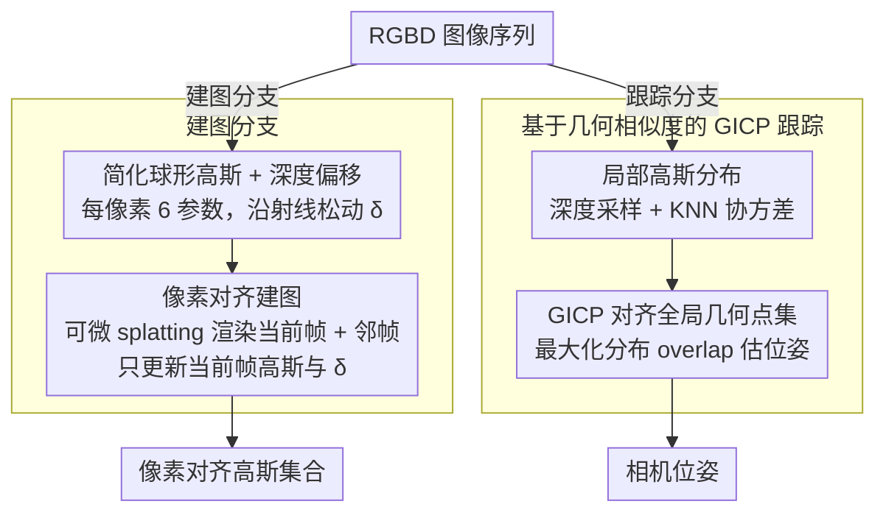

# SGAD-SLAM: Splatting Gaussians at Adjusted Depth for Better Radiance Fields in RGBD SLAM

**会议**: CVPR 2026  
**arXiv**: [2603.21055](https://arxiv.org/abs/2603.21055)  
**代码**: [https://machineperceptionlab.github.io/SGAD-SLAM-Project](https://machineperceptionlab.github.io/SGAD-SLAM-Project)  
**领域**: 3D视觉  
**关键词**: 3DGS、RGBD SLAM、像素对齐高斯、深度偏移、广义ICP

## 一句话总结
提出SGAD-SLAM，采用像素对齐的简化高斯表示并允许高斯沿射线调整深度偏移以提升渲染质量和可扩展性，同时引入基于几何相似度的GICP跟踪策略加速相机位姿估计，在Replica、TUM、ScanNet和ScanNet++上全面超越最新方法。

## 研究背景与动机

1. **领域现状**：3DGS已成为RGBD SLAM中替代NeRF的主流辐射场表示方法，通过可微splat操作显著提升渲染效率。当前3DGS-SLAM方法按高斯运动方式分两类：(a) 全局自由3D高斯——灵活但需在GPU内存中维护所有高斯，难以扩展到大场景；(b) 视图绑定高斯（如VTGS-SLAM）——严格锚定在固定深度点，可扩展但限制了渲染质量。
2. **现有痛点**：全局高斯方法在大场景下GPU内存不足；视图绑定高斯方法因高斯位置完全固定于观测深度，无法适应深度噪声和几何不精确，渲染质量受限。跟踪方面，渲染式跟踪（优化渲染误差）效率低下。
3. **核心矛盾**：可扩展性与渲染质量之间的trade-off——像素对齐可节省内存但位置固定伤害质量；自由移动可提升质量但内存开销大。
4. **本文目标** (1) 设计既可扩展又高质量的高斯表示；(2) 实现比渲染式跟踪更快的相机位姿估计。
5. **切入角度**：允许像素对齐高斯沿射线方向做有限调整（深度偏移），兼得像素对齐的可扩展性和位置调整的渲染灵活性。跟踪用3D几何对齐替代2D渲染优化。
6. **核心 idea**：像素对齐高斯 + 可学习深度偏移 = 可扩展且高质量的辐射场 + GICP几何跟踪 = 快速精准定位。

## 方法详解

### 整体框架
SGAD-SLAM 要解决的核心矛盾，是 3DGS-SLAM 里"可扩展"和"高渲染质量"长期二选一的困境：自由移动的全局高斯渲染好但要把所有高斯常驻显存，大场景吃不消；锁死在观测深度上的视图绑定高斯省显存却被深度噪声拖累。系统把建图和跟踪拆成两条并行的分支来一起破这个局。Mapping 分支逐帧处理：对每帧深度图初始化一组像素对齐的简化高斯，让每个高斯沿射线方向有一点可学习的深度松动，再用可微 splatting 渲染回当前帧及其邻帧，靠渲染误差把高斯属性和深度偏移学出来。Tracking 分支不碰渲染，而是另起一套全局 3D 几何点集来刻画场景结构，每来一帧就把当前局部深度的高斯分布往这个全局分布上贴，贴的过程就估出了相机位姿。整体输入是 RGBD 图像序列，输出是每帧的像素对齐高斯集合和相机位姿。

### 关键设计

**1. 简化球形高斯 + 深度偏移：在最省的参数下保住渲染质量**

视图绑定高斯之所以渲染受限，根子在于它的位置被硬钉在观测深度点上，深度一旦带噪声就没法自我修正。本文的做法是先把高斯本身瘦身到极致：每个高斯只留颜色（$\mathbb{R}^3$）、当半径用的单一方差（$\mathbb{R}^1$）、不透明度（$\mathbb{R}^1$）和深度偏移（$\mathbb{R}^1$）共 6 个参数，把标准 3DGS 的 4D 旋转、3D 位置、额外两个方差全砍掉，参数量从 59 压到 6（约 10 倍）。位置不再单独存，而是由相机中心到像素的射线直接确定，唯一留的自由度就是那个深度偏移 $\delta_i$，让 3D 位置变成 $\tilde{D}_i = |D_i + \delta_i|$。关键就在这一个标量：高斯仍然一一对齐到像素、不做局部 densification，但允许它沿射线前后挪一小段，于是即便在"简化模型 + 限制运动 + 无 densification"这套很紧的约束下，逐像素的自适应位置微调仍能把渲染质量顶上去——既保住了像素对齐省显存的好处，又找回了固定深度方案丢掉的那点灵活性。

**2. 像素对齐建图：每帧只拟合局部，把全场景显存压力卸掉**

全局自由高斯的可扩展性瓶颈，在于必须把整个场景的高斯都留在 GPU 里反复优化。本文换成逐帧建图：每帧初始化一组像素对齐高斯 $G_i = \{g_i^j\}_{j=1}^J$，通过可微 splatting 渲染到当前帧及其几个邻帧，最小化渲染误差

$$\min_{G_i, \delta_i} \sum_k \left(\rho \|V_k - V_k'\|_1 + \tau L_S + \sigma U_k \|D_k - D_k'\|_1\right)$$

优化时只动当前帧自己的高斯和深度偏移 $\delta_i$，邻帧的高斯一律固定不参与更新，这样既借邻帧的视角约束住当前帧、保证跨帧一致，又不会牵一发动全身。深度图有缺失的区域则用插值或邻帧高斯渲染来补。这么一来每帧高斯只需要拟合自己加上几个邻居，不必把全场景高斯常驻显存，大场景的可扩展性就上来了。

**3. 基于几何相似度的 GICP 跟踪：用 3D 几何对齐换掉慢吞吞的渲染式跟踪**

主流 3DGS-SLAM 估位姿靠优化渲染误差，每帧都要反复渲染、迭代，慢。本文跟踪干脆不走渲染这条路，改成纯 3D 几何对齐。先对当前帧深度图均匀采样一批 3D 点，对每个点用 KNN 取邻域算协方差矩阵，得到一组局部高斯分布 $T_i$；另一边维护一个全局高斯点集 $T$ 表示已扫描场景的几何结构。位姿估计就是用广义 ICP（GICP）把 $T_i$ 往 $T$ 上对齐，通过最大化两组高斯分布的 overlap 求解。对应关系用点到面距离而非点到点距离（法向量由 SVD 分解得到），再做尺度归一化抹平不同帧的深度量程差异。这条路一来快——GICP 高度可并行，比 2D 渲染优化省得多；二来不依赖 NetVLAD 这类预训练先验，比 loop closure 方案干净；三来用高斯分布而不是裸点来建模局部几何，对真实嘈杂深度更鲁棒。

### 损失函数 / 训练策略
- 建图损失：L1 RGB loss + SSIM loss + 带mask的L1 depth loss
- 跟踪初始化：默认用匀速假设，可选渲染式初始化（用前一帧高斯渲染当前帧的误差来粗估位姿）以应对无纹理/大运动场景
- 全局几何点集 $T$ 增量更新：每帧跟踪后添加非重叠高斯

## 实验关键数据

### 主实验 - 渲染质量

| 数据集 | 指标 | SGAD-SLAM | VTGS-SLAM | Gaussian-SLAM | SplaTAM |
|--------|------|-----------|-----------|---------------|---------|
| Replica | PSNR↑ | **44.87** | 43.34 | 42.08 | 34.11 |
| Replica | SSIM↑ | **0.998** | 0.996 | 0.996 | 0.970 |
| TUM | PSNR↑ | **38.60** | 30.20 | 25.05 | 22.80 |
| TUM | SSIM↑ | **0.997** | 0.972 | 0.929 | 0.893 |
| ScanNet | PSNR↑ | **42.31** | 31.10 | 27.70 | 19.14 |

### 主实验 - 跟踪精度 (ATE RMSE [cm]↓)

| 数据集 | SGAD-SLAM | GS-ICP SLAM | VTGS-SLAM | LoopSplat* | CG-SLAM* |
|--------|-----------|-------------|-----------|------------|----------|
| Replica Avg | **0.16** | **0.16** | 0.28 | 0.26 | 0.27 |
| TUM Avg | **2.0** | 2.4 | 2.6 | 2.3 | **2.0** |
| ScanNet Avg | 7.9 | - | 11.3 | **7.7** | 8.1 |
| ScanNet++ Avg | **0.59** | - | 1.6 | 2.05 | - |

### 重建质量 (Replica)

| 指标 | SGAD-SLAM | VTGS-SLAM | Point-SLAM | Loopy-SLAM* |
|------|-----------|-----------|------------|-------------|
| Depth L1 [cm]↓ | **0.30** | 0.51 | 0.44 | 0.35 |
| F1 [%]↑ | **90.9** | 90.4 | 89.8 | 90.8 |

### 关键发现
- **深度偏移的关键作用**：像素对齐高斯+深度偏移在受限条件（简化高斯+限制运动+无densification）下仍超越全局自由高斯和固定深度高斯的渲染效果。
- **TUM和ScanNet上渲染提升巨大**：TUM上PSNR从次优的30.20提升到38.60（+8.4dB），ScanNet上从31.10到42.31（+11.2dB），说明深度偏移对真实场景特别有效。
- **跟踪无需预训练先验**：不依赖NetVLAD等预训练模型做loop closure，仅靠GICP几何对齐就达到了与使用预训练先验方法可比甚至更好的精度。
- **渲染式初始化对ScanNet++很重要**：去掉初始化后ScanNet++的ATE从0.59升到6.5，说明大运动/无纹理场景需要渲染式初始化。

## 亮点与洞察
- **"像素对齐+深度偏移"的折中方案**非常优雅：兼得了像素对齐的内存可扩展性（无需维护全局高斯）和自由高斯的渲染灵活性（沿射线有限调整），且只增加一个标量参数。这种"受限但可调"的设计思路适用面很广。
- **几何跟踪替代渲染跟踪**：用3D高斯分布建模局部几何+GICP对齐的策略不仅更快，而且在真实嘈杂数据上更鲁棒，提供了一种不同于主流渲染式跟踪的技术路线。
- **简化高斯的极致压缩**：从59参数压缩到6参数（约10倍），证明了在SLAM场景下精心设计约束后，少量参数就足以达到甚至超越全参数的效果。

## 局限与展望
- 深度偏移是沿射线的1D调整，无法处理需要横向位移的场景（如深度传感器有系统性偏差）
- 全局几何点集 $T$ 持续增长可能在极大场景下仍有内存问题，需要点集裁剪策略
- 当前实验场景主要是室内，室外/开放环境的性能未验证
- GICP跟踪在纹理均匀区域的深度图采样可能缺乏区分性几何特征

## 相关工作与启发
- **vs VTGS-SLAM**: VTGS-SLAM的高斯严格锚定在深度点不能动，本文引入深度偏移打破这一限制，同样使用简化高斯但渲染质量显著更好（TUM上+8.4dB）
- **vs GS-ICP SLAM**: 都使用ICP类跟踪，但本文用高斯分布建模局部几何而非直接用点，在Replica上跟踪精度相当，渲染大幅领先
- **vs SplaTAM/Gaussian-SLAM**: 这些方法使用全局自由高斯，存储开销大且收敛慢；本文的像素对齐策略在保持可扩展性的同时实现了更好的渲染效果

## 评分
- 新颖性: ⭐⭐⭐⭐ 深度偏移+像素对齐的组合简单有效，几何跟踪策略新颖
- 实验充分度: ⭐⭐⭐⭐⭐ 4个数据集、多种指标（渲染/跟踪/重建）、丰富的对比
- 写作质量: ⭐⭐⭐⭐ 结构清晰，图示直观，方法描述详细
- 价值: ⭐⭐⭐⭐ 刷新了3DGS SLAM的SOTA，在真实数据上提升巨大

<!-- RELATED:START -->

## 相关论文

- [\[CVPR 2026\] Unblur-SLAM: Dense Neural SLAM for Blurry Inputs](unblur-slam_dense_neural_slam_for_blurry_inputs.md)
- [\[CVPR 2026\] ODGS-SLAM: Omnidirectional Gaussian Splatting SLAM](odgs-slam_omnidirectional_gaussian_splatting_slam.md)
- [\[CVPR 2026\] Flow4DGS-SLAM: Optical Flow-Guided 4D Gaussian Splatting SLAM](flow4dgs-slam_optical_flow-guided_4d_gaussian_splatting_slam.md)
- [\[CVPR 2026\] AERGS-SLAM: Auto-Exposure-Robust Stereo 3D Gaussian Splatting SLAM](aergs-slam_auto-exposure-robust_stereo_3d_gaussian_splatting_slam.md)
- [\[CVPR 2026\] SCE-SLAM: Scale-Consistent Monocular SLAM via Scene Coordinate Embeddings](sce-slam_scale-consistent_monocular_slam_via_scene_coordinate_embeddings.md)

<!-- RELATED:END -->
